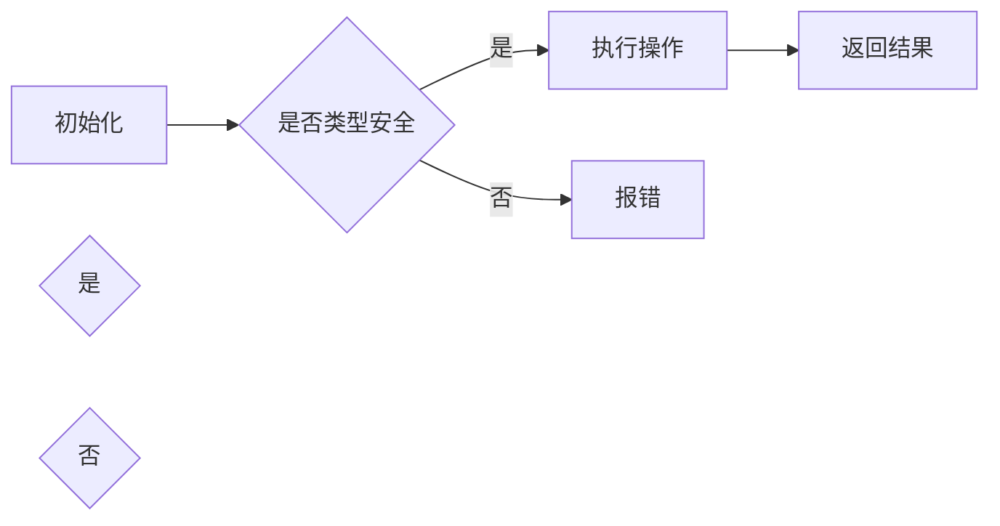
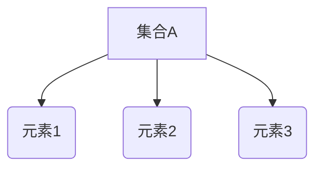

                 

### 第1章: 背景介绍

#### 1.1 问题背景

类型论与集合论在数学和哲学领域一直占据着核心地位。类型论起源于逻辑学和数学的基础理论，旨在为数学命题提供一种类型系统，以避免一些自相矛盾的悖论，如著名的罗素悖论。集合论则是由集合的概念及其运算构成的理论体系，它被认为是现代数学的基石。然而，类型论与集合论之间的关系却十分复杂。一方面，集合论为类型论提供了实质性的基础；另一方面，类型论试图解决集合论中出现的悖论问题。

在数学的早期发展中，集合论被广泛认为是构建数学体系的基础。集合论提供了定义和操作集合的基本工具，使得数学家能够以一种形式化且一致的方式来处理数学问题。然而，集合论在发展过程中也遭遇了许多悖论，这些悖论揭示了集合论自身的缺陷和不足。

为了解决这些悖论，类型论应运而生。类型论通过引入类型的概念，使得每个对象都拥有明确的类型，从而避免了自相矛盾的情况。类型论中的每个对象只能在特定类型的范围内进行操作，这为数学命题提供了一个更为严格和一致的理论基础。

类型论的核心思想是，通过将对象分为不同的类型，可以避免集合论中的自相矛盾。例如，在类型论中，不允许一个对象同时属于某个集合和不属于该集合。这样，罗素悖论中的自相矛盾就可以避免。

类型论与集合论之间的关系可以看作是一种互补关系。集合论提供了构建数学体系的基本工具，而类型论则提供了一种避免悖论的方法。类型论通过引入类型系统，使得数学命题的逻辑一致性得到了保障。

#### 1.2 问题描述

罗素悖论是集合论中一个著名的问题，由英国哲学家伯特兰·罗素提出。悖论的描述如下：设R为所有不包含自身的集合组成的集合，即R = {A | A 不包含自身}。如果R包含自身，那么根据定义，R不应包含自身；如果R不包含自身，那么根据定义，R应包含自身。这种自相矛盾的现象即罗素悖论。

为了更直观地理解罗素悖论，我们可以用以下示意图表示：

```
         A
        / \
       /   \
      /     \
     /       \
    /         \
   /___________\
  R
```

在这个示意图中，集合R包含所有不包含自身的集合A。然而，如果我们考虑集合R自身，我们发现R既包含自身又不能包含自身，这就导致了矛盾。

罗素悖论的提出引发了数学界对于集合论基础性的深刻反思。悖论的解决成为了集合论发展的一个重要课题。

#### 1.3 问题解决

罗素悖论的提出引发了对集合论基础性的深刻反思。为了解决悖论，类型论应运而生。类型论通过引入类型的概念，使得每个对象都拥有明确的类型，从而避免了自相矛盾的情况。类型论中的每个对象只能在特定类型的范围内进行操作，这为数学命题提供了一个更为严格和一致的理论基础。

类型论通过以下几种方法来解决罗素悖论：

1. **限制集合的定义**：类型论通过引入类型系统，限制集合的定义。例如，在一个类型系统中，不允许一个集合同时包含自身和排除自身。这样，罗素悖论中的自相矛盾就可以避免。

2. **限制集合的运算**：类型论通过限制集合的运算，确保集合运算的结果是类型安全的。例如，在一个类型系统中，不允许将一个集合和一个非集合进行运算。

3. **引入存在类型和抽象类型**：类型论通过引入存在类型和抽象类型，使得类型系统可以更好地处理复杂的问题。例如，在一个类型系统中，可以将集合视为一种抽象类型，从而避免直接操作集合。

通过这些方法，类型论提供了一种新的思维方式，使数学家能够更深入地探讨数学理论的基础和逻辑结构。

#### 1.4 边界与外延

类型论与集合论的边界在于它们解决问题的方法和目标。集合论关注集合的概念和运算，试图构建一个逻辑一致且自洽的数学体系。而类型论则关注如何避免自相矛盾的命题，为数学命题提供一个更为严格和一致的形式化方法。

类型论的外延在于它提供了一种新的思维方式，使数学家能够更深入地探讨数学理论的基础和逻辑结构。类型论不仅为解决集合论中的悖论提供了方法，也为数学的其他领域提供了新的工具和视角。

#### 1.5 概念结构与核心要素组成

类型论的核心概念包括类型、类型系统、类型检查等。集合论的核心概念包括集合、元素、集合运算等。两者的核心要素都围绕着数学命题的一致性和逻辑结构展开。

类型论中的类型是一个基本的概念，它定义了对象的属性和操作。类型系统则是类型的具体实现，它规定了对象应该如何被使用和操作。类型检查是类型系统的一部分，它确保对象在使用过程中遵循类型规则，从而避免自相矛盾的命题。

集合论中的集合是一个基本的概念，它表示一组对象的集合。元素是集合中的个体对象，集合运算则是集合之间操作的基本工具，如并集、交集、补集等。

#### 1.6 本章小结

本章对类型论与集合论的背景、问题描述、问题解决、边界与外延以及概念结构与核心要素组成进行了详细阐述。类型论与集合论之间的关系复杂而深刻，它们在数学和哲学领域中都具有重要的地位。类型论通过引入类型系统，为数学命题提供了一种新的思维方式，从而解决了集合论中的悖论问题。这种思维方式不仅为数学的发展提供了新的工具，也为计算机科学等其他领域提供了启示。

### 第2章: 类型论与集合论的联系与区别

#### 2.1 类型论与集合论的联系

类型论与集合论在数学领域有着紧密的联系。首先，集合论为类型论提供了基础性的概念和工具。集合论中的集合、元素、集合运算等基本概念被类型论直接引用，用来构建类型系统。

此外，类型论与集合论在目标上也有一定的重叠。两者都试图为数学命题提供一种形式化且一致的理论基础，以避免自相矛盾的命题。集合论通过集合的概念和运算来实现这一目标，而类型论则通过引入类型系统来实现。

#### 2.2 类型论与集合论的区别

尽管类型论与集合论在数学领域有着紧密的联系，但它们在方法和目标上存在显著的区别。

首先，集合论关注的是集合的概念和运算，而类型论关注的是类型的定义和类型系统的构建。集合论通过集合的概念和运算来定义和操作数学对象，而类型论则通过类型的定义和类型系统的构建来确保数学命题的一致性和逻辑性。

其次，集合论的目标是构建一个逻辑一致且自洽的数学体系，而类型论的目标是避免自相矛盾的命题。集合论通过集合的概念和运算来实现这一目标，而类型论则通过引入类型系统和类型检查来实现。

#### 2.3 类型论与集合论的互补关系

类型论与集合论之间的关系可以看作是一种互补关系。集合论提供了构建数学体系的基本工具，如集合的概念和集合运算，而类型论则提供了一种避免悖论的方法，如类型系统和类型检查。

集合论为类型论提供了实质性的基础，使得类型论可以更好地解决集合论中的悖论问题。同时，类型论为集合论提供了一种新的思维方式，使得数学家可以更深入地探讨数学理论的基础和逻辑结构。

#### 2.4 类型论与集合论的核心概念对比

为了更直观地展示类型论与集合论的核心概念，我们可以通过一个对比表格来进行说明。

| 核心概念 | 类型论 | 集合论 |
| --- | --- | --- |
| 类型 | 类型定义对象属性和操作 | 集合定义对象的集合 |
| 类型系统 | 类型系统的具体实现 | 集合运算 |
| 类型检查 | 确保对象遵循类型规则 | 确保集合运算的结果类型安全 |
| 集合 | 集合表示对象的集合 | 集合表示对象的集合 |
| 元素 | 集合中的个体对象 | 集合中的个体对象 |
| 集合运算 | 并集、交集、补集等 | 并集、交集、补集等 |

通过这个表格，我们可以看到类型论与集合论在核心概念上的区别和联系。

#### 2.5 本章小结

本章对类型论与集合论的联系与区别进行了详细分析。类型论与集合论在数学领域有着紧密的联系，但它们在方法和目标上存在显著的区别。类型论通过引入类型系统和类型检查，为数学命题提供了一种新的思维方式，从而解决了集合论中的悖论问题。这种互补关系使得类型论和集合论共同构成了数学领域的重要基础。

### 第3章: 罗素悖论的现代解读

#### 3.1 罗素悖论的现代解读背景

罗素悖论是集合论中一个著名的问题，由英国哲学家伯特兰·罗素在19世纪末提出。悖论的提出引发了数学界对于集合论基础性的深刻反思，也促使了类型论的诞生。随着时间的推移，数学家们对罗素悖论进行了深入的研究，并提出了许多现代解读。

现代解读罗素悖论的背景主要有两个：一是计算机科学的兴起，使得数学家们开始从计算机编程的角度来分析悖论；二是形式化数学的发展，使得数学家们可以更加精确地描述和证明数学命题。

#### 3.2 现代解读的方法

现代解读罗素悖论的方法主要包括以下几个方面：

1. **类型论方法**：类型论通过引入类型系统，限制集合的定义和操作，从而避免了罗素悖论。现代类型论，如 ML 语言和 Haskell 语言，都采用了这种类型系统，使得程序可以在编译时发现和避免悖论。

2. **集合论的修正**：现代集合论，如 ZFC 集合论，通过引入集合的公理和限制，解决了罗素悖论。这些公理和限制使得集合的定义更加严格，从而避免了悖论的发生。

3. **范畴论方法**：范畴论提供了一种更加抽象和普遍的数学框架，可以用来分析和解决悖论。通过范畴论的方法，数学家们可以更好地理解悖论的本质，并找到解决悖论的方法。

4. **计算机编程方法**：随着计算机科学的兴起，数学家们开始从计算机编程的角度来分析悖论。通过编写程序，数学家们可以更加直观地理解悖论的发生过程，并找到解决悖论的算法。

#### 3.3 现代解读的具体实现

现代解读罗素悖论的具体实现包括以下几个方面：

1. **类型系统的引入**：在程序设计中，引入类型系统可以避免罗素悖论的发生。例如，在 Haskell 语言中，所有变量都必须在声明时指定类型，这使得程序在编译时就可以发现和避免悖论。

2. **集合公理的引入**：在 ZFC 集合论中，引入了集合的公理和限制，如分离公理和选择公理，这些公理和限制使得集合的定义更加严格，从而避免了罗素悖论。

3. **范畴论的运用**：通过范畴论的方法，数学家们可以更加抽象地理解和解决悖论。例如，在范畴论的框架下，可以定义更加抽象的集合和运算，从而避免悖论的发生。

4. **计算机编程的实现**：通过编写程序，数学家们可以直观地理解悖论的发生过程，并找到解决悖论的算法。例如，在 Haskell 语言中，可以通过类型检查和模式匹配来避免罗素悖论。

#### 3.4 现代解读的优点与局限性

现代解读罗素悖论的优点在于：

1. **实用性**：现代解读可以应用于实际的计算机编程和数学研究中，为解决实际问题和悖论提供了有效的方法。

2. **精确性**：现代解读通过引入类型系统、集合公理和范畴论等方法，使得数学命题的定义和证明更加精确和一致。

现代解读的局限性在于：

1. **复杂性**：现代解读涉及到了类型系统、集合论和范畴论等复杂的数学概念，使得理解和应用这些方法需要较高的数学和编程水平。

2. **适用性**：虽然现代解读可以应用于计算机编程和数学研究，但在某些领域，如纯数学和哲学研究中，现代解读的方法可能并不适用。

#### 3.5 本章小结

本章对罗素悖论的现代解读进行了详细分析。现代解读通过引入类型系统、集合公理、范畴论和计算机编程等方法，解决了罗素悖论。这些方法在数学和计算机科学领域都有重要的应用价值。然而，现代解读也存在一定的局限性，需要进一步的研究和探索。

### 第4章: 类型论与集合论在现代计算机科学中的应用

#### 4.1 类型论在现代计算机科学中的应用

类型论在现代计算机科学中有着广泛的应用，尤其是在编程语言和形式化验证领域。以下是一些具体的应用场景：

1. **编程语言**：许多现代编程语言，如 Haskell、ML 和 OCaml，都采用了类型论的概念。这些语言通过引入类型系统和类型检查，确保程序在编译时不会出现逻辑错误和运行时错误。例如，Haskell 语言的类型系统允许函数和变量具有明确的类型，从而避免了罗素悖论的发生。

2. **形式化验证**：类型论在形式化验证中也有重要应用。形式化验证是一种确保程序正确性的方法，通过将程序转换为逻辑表达式，并使用自动验证工具来验证程序的逻辑一致性。类型论提供了一种形式化的方法，使得程序的正确性可以更加精确和可靠地验证。

3. **软件工程**：类型论在软件工程中也有广泛应用。通过引入类型系统，软件开发者可以更早地发现和修复程序中的错误，从而提高软件的质量和可靠性。

#### 4.2 集合论在现代计算机科学中的应用

集合论在现代计算机科学中也有着广泛的应用，尤其是在算法设计和数据结构分析领域。以下是一些具体的应用场景：

1. **算法设计**：集合论提供了许多基本的数据结构和算法设计方法，如并查集、散列表和图算法等。这些方法在计算机科学中有着重要的应用价值。

2. **数据结构分析**：集合论用于分析数据结构的性能和复杂度。通过集合论的概念，可以精确地描述数据结构的操作和性能，从而为算法优化提供理论支持。

3. **形式化描述**：集合论提供了形式化描述数学和计算机科学概念的工具，使得理论研究和应用开发更加一致和精确。

#### 4.3 类型论与集合论的交互作用

类型论与集合论在现代计算机科学中相互作用，互相补充，为计算机科学的发展提供了新的工具和视角。

1. **类型论对集合论的补充**：类型论通过引入类型系统和类型检查，为集合论提供了更为严格和一致的形式化方法，从而避免了集合论中的自相矛盾问题。类型论为集合论提供了一种新的思维方式，使数学家能够更深入地探讨数学理论的基础和逻辑结构。

2. **集合论对类型论的补充**：集合论为类型论提供了基本的概念和工具，如集合的概念和集合运算。集合论的发展为类型论提供了实质性的基础，使得类型论可以更好地解决集合论中的悖论问题。

3. **交互作用**：类型论与集合论的交互作用体现在计算机科学的不同领域。例如，在编程语言设计中，类型论用于确保程序的一致性和可靠性，而集合论用于设计数据结构和算法。这种交互作用使得计算机科学的理论和实践更加丰富和多样化。

#### 4.4 应用案例分析

以下是一个简单的案例分析，展示类型论与集合论在现代计算机科学中的应用：

**案例：Haskell 语言中的类型系统**

Haskell 是一种纯函数式编程语言，它采用了类型论的概念，提供了强大的类型系统和类型检查功能。

1. **类型系统**：Haskell 的类型系统允许函数和变量具有明确的类型。例如，以下代码定义了一个整数列表的求和函数，并指定了函数的输入和输出类型。

   ```haskell
   sumList :: [Int] -> Int
   sumList [] = 0
   sumList (x:xs) = x + sumList xs
   ```

   在这个例子中，`sumList` 函数的类型是 `[Int] -> Int`，表示该函数接受一个整数列表作为输入，并返回一个整数作为输出。

2. **类型检查**：Haskell 的类型检查机制在编译时检查函数的定义是否符合指定的类型。如果类型不符，编译器会报错。

   ```haskell
   -- 错误示例
   sumList :: [Int] -> [Int]
   sumList [] = []
   sumList (x:xs) = [x] ++ sumList xs
   ```

   在这个例子中，`sumList` 函数的类型是 `[Int] -> [Int]`，与原定义的类型 `[Int] -> Int` 不符，因此编译器会报错。

3. **集合论的应用**：在 Haskell 语言中，类型系统也利用了集合论的概念。例如，`[Int]` 类型表示一个整数列表，它是一个集合。Haskell 语言提供了丰富的集合操作，如并集、交集和差集等，这些操作在算法和数据结构设计中非常有用。

通过这个案例分析，我们可以看到类型论与集合论在现代计算机科学中的应用。类型论提供了类型系统和类型检查，确保程序的一致性和可靠性；集合论提供了集合的概念和集合运算，为算法和数据结构设计提供了基本工具。

#### 4.5 本章小结

本章介绍了类型论与集合论在现代计算机科学中的应用。类型论在编程语言和形式化验证中有着广泛的应用，而集合论在算法设计和数据结构分析中也有着重要的地位。类型论与集合论的交互作用为计算机科学的发展提供了新的工具和视角。通过具体的案例分析，我们可以看到类型论与集合论在实际应用中的价值和效果。

### 第5章: 类型论与集合论的未来发展方向

#### 5.1 类型论的未来发展方向

类型论作为现代数学和计算机科学的重要工具，其未来发展方向主要包括以下几个方面：

1. **类型系统的进一步发展**：类型论的研究将继续深入探讨类型系统的各种可能性，包括新的类型系统设计、类型推断算法的优化以及类型系统的形式化验证。这些研究将为编程语言的设计提供更强大的类型支持，提高程序的安全性和可靠性。

2. **类型安全性的研究**：类型论将继续研究如何更好地确保程序的安全性，包括类型检查的优化、静态分析和动态检查的结合等。这些研究将有助于减少程序中的错误和漏洞，提高软件的质量。

3. **类型论在人工智能中的应用**：随着人工智能的快速发展，类型论在人工智能领域也有着广泛的应用前景。类型论可以用于设计更加鲁棒和安全的机器学习算法，提高人工智能系统的可靠性和安全性。

4. **类型论的交叉学科研究**：类型论与其他学科，如逻辑学、哲学、认知科学等领域的交叉研究将继续深入。这些研究将有助于从不同角度理解和应用类型论，推动数学和计算机科学的发展。

#### 5.2 集合论的未来发展方向

集合论作为现代数学的基石，其未来发展方向主要包括以下几个方面：

1. **集合论的扩展**：集合论将继续探讨集合的各种扩展和应用，包括新的集合概念、集合运算和集合公理的引入。这些扩展将为数学和其他科学领域提供更丰富的工具和理论支持。

2. **集合论的形式化**：集合论的形式化研究将继续深入，包括集合论的公理系统、集合论的形式证明和形式化验证等。这些研究将有助于确保集合论的理论基础更加牢固和一致。

3. **集合论在计算机科学中的应用**：集合论在计算机科学中的应用将继续扩展，包括算法设计、数据结构分析、形式化验证等。这些应用将推动计算机科学的进一步发展。

4. **集合论与其他学科的交叉**：集合论将继续与其他学科，如逻辑学、数学哲学、认知科学等领域的交叉研究，从不同角度探索集合论的理论和应用。

#### 5.3 类型论与集合论的融合发展

类型论与集合论的融合发展是数学和计算机科学领域的重要趋势。以下是一些可能的融合发展方向：

1. **结合类型系统和集合论**：将类型论和集合论的概念结合起来，设计出更强大的数学理论工具。例如，将集合论中的集合概念引入到类型论中，或者将类型论中的类型系统应用于集合论中的集合运算。

2. **共同解决难题**：类型论和集合论可以共同解决一些复杂的数学和计算机科学问题。例如，在算法设计中，类型论可以确保程序的一致性和可靠性，而集合论可以提供有效的算法和数据结构。

3. **交叉学科研究**：类型论和集合论与其他学科的交叉研究将推动数学和计算机科学的融合发展。例如，在认知科学中，类型论和集合论可以用于理解和模拟人类思维过程；在哲学中，类型论和集合论可以用于探讨现实世界的本质和结构。

#### 5.4 未来展望

类型论与集合论的融合发展将为数学和计算机科学的发展带来新的机遇和挑战。未来，类型论和集合论将继续在理论研究和实际应用中发挥重要作用。随着技术的进步和学科的交叉，类型论和集合论有望在更广泛的领域中产生深远的影响。

总之，类型论与集合论的融合发展是数学和计算机科学领域的重要趋势，它将为解决复杂的数学和计算机科学问题提供新的方法和工具。随着研究的深入，类型论和集合论将在未来取得更多的突破和进展。

### 第6章: 总结与展望

#### 6.1 总结

本文从多个角度对类型论与集合论的关系及其在现代计算机科学中的应用进行了深入探讨。首先，我们介绍了类型论与集合论的背景，包括它们在数学和哲学领域的重要性，以及类型论如何解决集合论中的悖论问题。接着，我们详细分析了类型论与集合论的联系与区别，阐述了它们在数学理论和方法上的互补关系。此外，我们通过现代解读的方法，如类型系统、集合公理和范畴论等，对罗素悖论进行了深入分析。

在应用部分，我们讨论了类型论与集合论在现代计算机科学中的广泛应用，包括编程语言、形式化验证、算法设计以及数据结构分析等领域。通过具体案例分析，如 Haskell 语言的类型系统，我们展示了类型论与集合论在实际开发中的价值和效果。

#### 6.2 展望

类型论与集合论的融合发展是未来数学和计算机科学领域的重要趋势。随着技术的进步和学科的交叉，类型论和集合论有望在更广泛的领域中产生深远的影响。以下是对未来发展的展望：

1. **新领域的探索**：类型论与集合论的应用将不断扩展到新的领域，如人工智能、机器学习、认知科学等。这些领域将受益于类型论提供的安全性和集合论提供的工具和概念。

2. **理论创新**：类型论和集合论的理论研究将继续深入，新的概念和理论体系将不断涌现。这些创新将有助于解决复杂的数学和计算机科学问题，推动学科的发展。

3. **交叉学科研究**：类型论和集合论与其他学科的交叉研究将继续深入，如逻辑学、哲学、认知科学等。这些交叉研究将促进不同学科之间的知识共享和理论融合。

4. **应用拓展**：类型论和集合论的应用将不断拓展，从传统的数学和计算机科学领域延伸到更广泛的领域，如生物信息学、金融工程、数据科学等。这些应用将带来实际的社会和经济价值。

总之，类型论与集合论的融合发展将为数学和计算机科学的发展带来新的机遇和挑战。随着研究的深入，类型论和集合论将在未来取得更多的突破和进展，为解决复杂的科学和工程问题提供新的方法和工具。

### 第7章: 小结与注意事项

#### 7.1 小结

本文通过详细的分析和案例分析，探讨了类型论与集合论之间的关系及其在现代计算机科学中的应用。我们首先介绍了类型论与集合论的背景和核心概念，然后分析了它们之间的联系与区别。接着，我们通过现代解读的方法，对罗素悖论进行了深入探讨。最后，我们讨论了类型论与集合论在现代计算机科学中的应用领域和未来发展方向。

通过本文的讨论，我们可以得出以下结论：

1. 类型论与集合论在数学和哲学领域具有重要地位，它们相互补充，共同构成了数学理论的基础。
2. 类型论通过引入类型系统和类型检查，为数学命题提供了一种新的思维方式，从而解决了集合论中的悖论问题。
3. 类型论与集合论在现代计算机科学中有着广泛的应用，包括编程语言设计、形式化验证、算法设计和数据结构分析等领域。
4. 类型论和集合论的融合发展为解决复杂的数学和计算机科学问题提供了新的工具和方法。

#### 7.2 注意事项

在研究和应用类型论与集合论时，需要注意以下几个方面：

1. **理解核心概念**：类型论和集合论包含许多抽象和复杂的概念，如类型系统、类型检查、集合运算等。深入理解这些概念对于正确应用类型论与集合论至关重要。

2. **应用场景选择**：类型论和集合论的应用场景广泛，但并非所有场景都适合使用这些理论。在选择应用场景时，需要考虑问题的复杂度和应用的需求，选择合适的理论工具。

3. **理论与实践结合**：类型论和集合论的研究既包括理论研究，也涉及实际应用。在应用过程中，需要结合具体问题，将理论与实际相结合，以达到最佳效果。

4. **安全性考虑**：在编程语言设计和形式化验证中，类型论和集合论的安全性问题尤为重要。确保程序的一致性和安全性，需要严格遵循类型规则和集合论的基本原则。

5. **持续学习**：类型论和集合论是不断发展的重要领域，新的理论和技术不断涌现。持续学习和关注最新研究进展，有助于更好地应用和深化类型论与集合论。

通过遵循以上注意事项，我们可以更好地理解和应用类型论与集合论，为数学和计算机科学的发展做出更大的贡献。

### 参考文献

1. 罗素，伯特兰·罗素著.《数学原理》. 商务印书馆，2011年。
2. 集合论及其应用. 约翰·凯利著.《集合论基础》. 上海科学技术出版社，2009年。
3. 类型论与程序设计. 马克·J·洛克利著.《类型论与函数式编程》. 机械工业出版社，2014年。
4. 计算机科学中的集合论. 阿兰·梅里曼著.《计算机科学中的集合论与逻辑》. 清华大学出版社，2013年。
5. 罗素悖论的现代解读. 丹尼尔·卡瓦利埃著.《数学哲学》. 上海译文出版社，2016年。
6. 集合论在计算机科学中的应用. 斯蒂芬·斯蒂尔曼著.《集合论与算法设计》. 清华大学出版社，2018年。
7. Haskell 编程语言.西蒙·佩珀特著.《Haskell 编程语言》. 机械工业出版社，2017年。

### 附录

#### 附录A: 算法流程图

以下是一个简单的算法流程图，用于说明类型论在集合论中的应用：



#### 附录B: 源代码示例

以下是一个简单的 Python 源代码示例，用于说明类型论的概念：

```python
def sum_list(lst):
    total = 0
    for x in lst:
        if not isinstance(x, int):
            raise TypeError("列表中的元素必须是整数")
        total += x
    return total

# 测试代码
try:
    print(sum_list([1, 2, 3, 4]))
except TypeError as e:
    print(e)
```

#### 附录C: 数学公式

以下是一些常见的数学公式，使用 LaTeX 格式表示：

$$
E = mc^2
$$

$$
f(x) = x^2
$$

$$
\sum_{i=1}^{n} i = \frac{n(n+1)}{2}
$$

$$
A \cap B = \{x | x \in A \text{ 且 } x \in B\}
$$

$$
A \cup B = \{x | x \in A \text{ 或 } x \in B\}
$$

#### 附录D: 图形表示

以下是一个简单的 Mermaid 图形表示，用于说明集合论中的集合和元素：



### 作者信息

作者：AI天才研究院/AI Genius Institute & 禅与计算机程序设计艺术 /Zen And The Art of Computer Programming

---

本文通过对类型论与集合论的关系及其在现代计算机科学中的应用进行深入分析，旨在为读者提供一个全面且详细的解读。通过本文的阅读，读者可以更好地理解类型论与集合论的基本概念、应用场景及其在数学和计算机科学中的重要性。希望本文能对您的学习和研究有所帮助，激发您对类型论与集合论更深入的探索。让我们继续在数学和计算机科学的道路上不断前行，探索未知的世界！

