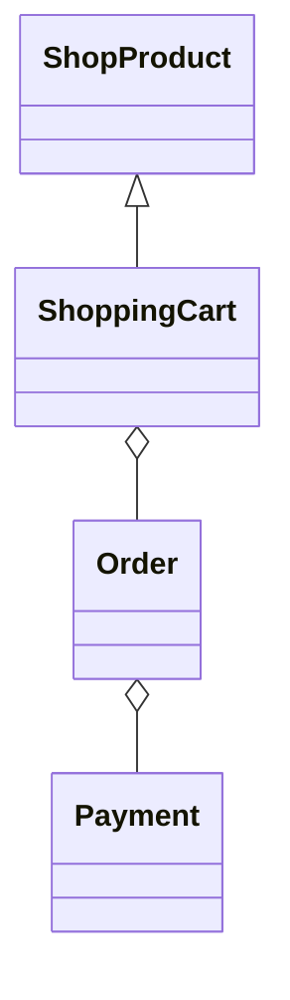
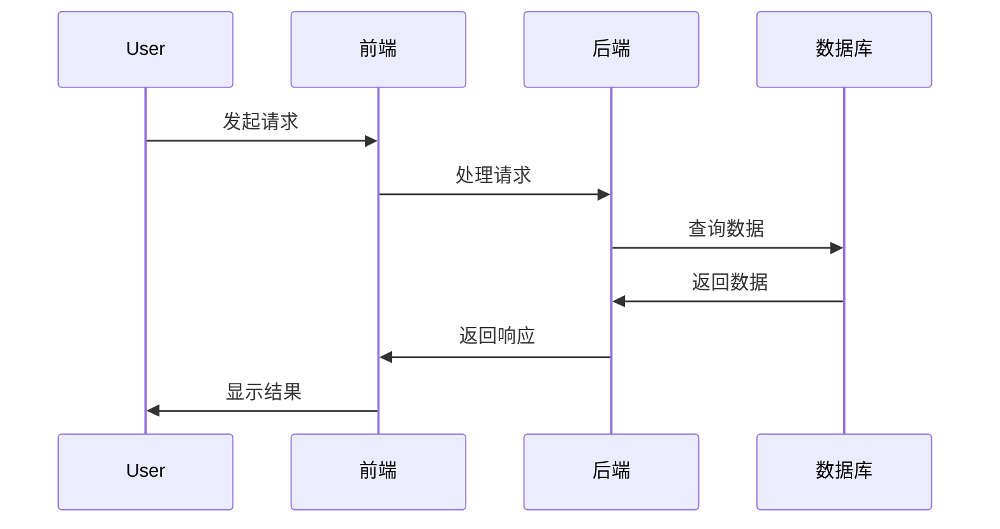
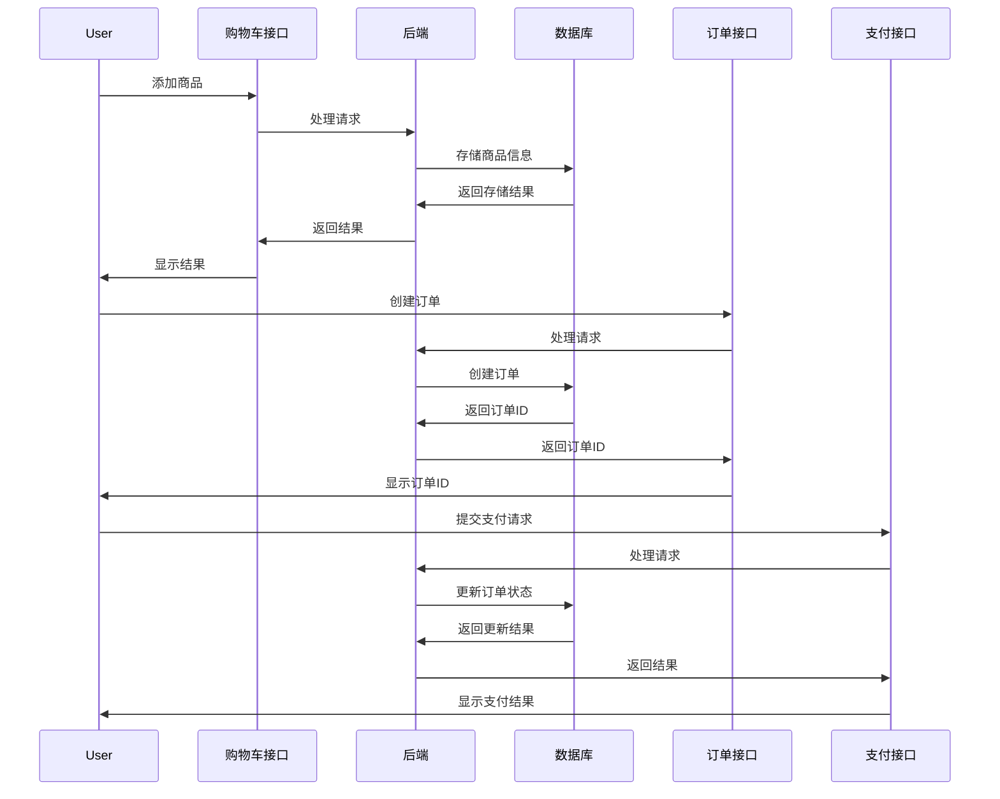

                 

# 类型论中的归约原则问题：批评与反思

关键词：类型论、归约原则、算法原理、系统架构、数学模型、Python实现

摘要：本文深入探讨了类型论中的归约原则问题，从背景介绍、核心概念与联系、算法原理讲解、系统分析与架构设计方案、项目实战到最佳实践 tips，对归约原则进行了全面的批评与反思。文章旨在为读者提供对归约原则的深刻理解和应用指导。

## 目录大纲

## 第一部分：背景介绍

### 第1章：问题背景

#### 1.1.1 类型论的基本概念

#### 1.1.2 归约原则的概念

#### 1.1.3 归约原则在类型论中的应用

### 第2章：问题描述

#### 2.1.1 当前归约原则存在的问题

#### 2.1.2 归约原则的挑战

#### 2.1.3 归约原则的目标

### 第3章：问题解决

#### 3.1.1 归约原则的理论基础

#### 3.1.2 归约原则的改进方案

#### 3.1.3 实证研究与评估

## 第二部分：核心概念与联系

### 第4章：核心概念

#### 4.1.1 归约原则的核心概念

#### 4.1.2 归约原则的属性特征

#### 4.1.3 归约原则与传统类型论的对比

### 第5章：ER实体关系图架构

#### 5.1.1 ER实体关系图的定义

#### 5.1.2 ER实体关系图的应用

#### 5.1.3 ER实体关系图的构建方法

## 第三部分：算法原理讲解

### 第6章：算法原理

#### 6.1.1 归约原则的算法原理

#### 6.1.2 归约原则的数学模型

#### 6.1.3 归约原则的Python实现

### 第7章：数学模型和数学公式

#### 7.1.1 归约原则的数学公式

#### 7.1.2 数学公式的详细讲解

#### 7.1.3 举例说明

## 第四部分：系统分析与架构设计方案

### 第8章：问题场景介绍

#### 8.1.1 问题场景的描述

#### 8.1.2 项目介绍

### 第9章：系统功能设计

#### 9.1.1 领域模型

#### 9.1.2 系统功能设计

### 第10章：系统架构设计

#### 10.1.1 系统架构设计

#### 10.1.2 系统接口设计

#### 10.1.3 系统交互

### 第11章：系统接口设计和系统交互

#### 11.1.1 系统接口设计

#### 11.1.2 系统交互

## 第五部分：项目实战

### 第12章：环境安装

#### 12.1.1 环境安装步骤

#### 12.1.2 注意事项

### 第13章：系统核心实现源代码

#### 13.1.1 源代码结构

#### 13.1.2 代码应用解读与分析

### 第14章：实际案例分析和详细讲解剖析

#### 14.1.1 案例分析

#### 14.1.2 详细讲解剖析

### 第15章：项目小结

#### 15.1.1 项目总结

#### 15.1.2 不足与改进方向

## 第六部分：最佳实践 tips

### 第16章：最佳实践 tips

#### 16.1.1 实践技巧

#### 16.1.2 注意事项

### 第17章：小结

#### 17.1.1 本书内容的总结

#### 17.1.2 关键知识点回顾

### 第18章：注意事项

#### 18.1.1 使用归约原则时的注意事项

#### 18.1.2 算法实现的注意事项

### 第19章：拓展阅读

#### 19.1.1 推荐阅读

#### 19.1.2 相关资源链接

## 第一部分：背景介绍

### 第1章：问题背景

#### 1.1.1 类型论的基本概念

类型论是数学和逻辑学中的一个重要分支，主要研究函数、变量、类型和类型系统等概念。其核心思想是通过类型系统来确保程序的正确性和安全性。类型论的基本概念包括：

- **类型**：数据值的分类。
- **类型系统**：一种机制，用于定义变量和函数的类型的集合以及这些类型之间的关系。
- **类型检查**：在程序运行前，检查程序的类型安全。

#### 1.1.2 归约原则的概念

归约原则是类型论中的一个重要概念，主要关注如何在类型系统中执行计算。归约原则的基本思想是将复杂的数据结构或表达式简化为更简单、更易处理的形式。归约原则可以分为：

- **归约策略**：如何选择和执行归约。
- **归约规则**：定义如何将一个表达式转换为另一个表达式。

#### 1.1.3 归约原则在类型论中的应用

归约原则在类型论中有着广泛的应用，尤其在函数式编程语言中尤为重要。以下是一些归约原则在类型论中的应用：

- **高阶函数**：归约原则使得高阶函数（即接受函数作为参数或返回函数的函数）得以实现。
- **类型推导**：归约原则在类型系统中用于推导变量和表达式的类型。
- **类型安全**：归约原则有助于确保程序在运行时不会出现类型错误。

### 第2章：问题描述

#### 2.1.1 当前归约原则存在的问题

尽管归约原则在类型论中具有重要作用，但现有归约原则仍存在一些问题，主要包括：

- **复杂度**：某些归约策略和规则过于复杂，难以理解和实现。
- **可扩展性**：现有归约原则难以适应新的编程范式和类型系统。
- **效率**：某些归约策略可能导致运行效率低下。

#### 2.1.2 归约原则的挑战

归约原则面临的挑战包括：

- **类型可变性**：如何在类型系统中处理类型的变化和演化。
- **类型安全性**：如何在归约过程中保持类型安全。
- **多态性**：如何支持多态性，使得不同类型的值能够使用相同的归约策略。

#### 2.1.3 归约原则的目标

归约原则的目标是：

- **简化**：简化复杂的数据结构和表达式。
- **安全性**：确保程序在运行时的类型安全性。
- **效率**：提高程序的运行效率。

### 第3章：问题解决

#### 3.1.1 归约原则的理论基础

归约原则的理论基础包括：

- **类型系统理论**：类型系统理论为归约原则提供了基础。
- **形式化方法**：形式化方法用于定义和证明归约原则的正确性。

#### 3.1.2 归约原则的改进方案

针对现有归约原则存在的问题和挑战，以下是一些改进方案：

- **简化的归约策略**：设计更简单、更易于理解的归约策略。
- **类型不变性**：在归约过程中保持类型不变性。
- **类型推断算法**：开发更高效的类型推断算法。

#### 3.1.3 实证研究与评估

通过实证研究，可以评估改进方案的有效性和实用性。这包括：

- **性能评估**：评估改进后的归约原则在运行效率方面的表现。
- **安全性评估**：验证改进后的归约原则在类型安全性方面的表现。

## 第二部分：核心概念与联系

### 第4章：核心概念

#### 4.1.1 归约原则的核心概念

归约原则的核心概念包括：

- **归约策略**：选择和执行归约的规则。
- **归约规则**：定义如何将一个表达式转换为另一个表达式。

#### 4.1.2 归约原则的属性特征

归约原则的属性特征包括：

- **抽象性**：归约原则能够抽象出复杂的计算过程。
- **可组合性**：不同的归约原则可以组合使用。
- **高效性**：归约原则应能够高效地执行计算。

#### 4.1.3 归约原则与传统类型论的对比

归约原则与传统类型论的不同点包括：

- **关注点**：传统类型论关注类型安全和类型推导，归约原则则关注如何高效地执行计算。
- **应用场景**：传统类型论适用于静态类型系统，归约原则则更适用于动态类型系统和函数式编程。

### 第5章：ER实体关系图架构

#### 5.1.1 ER实体关系图的定义

ER实体关系图是一种用于表示数据库模式的图形化工具，它通过实体、关系和属性的表示来描述数据库的结构。ER实体关系图的基本元素包括：

- **实体**：表示数据库中的数据表。
- **关系**：表示实体之间的关系。
- **属性**：表示实体的属性。

#### 5.1.2 ER实体关系图的应用

ER实体关系图的应用包括：

- **数据库设计**：用于设计数据库的表结构和关系。
- **系统分析**：用于分析系统的数据模型和业务逻辑。

#### 5.1.3 ER实体关系图的构建方法

构建ER实体关系图的方法包括：

- **需求分析**：收集和分析业务需求，确定实体和关系。
- **设计**：根据需求分析结果，设计实体和关系的属性。
- **验证**：验证ER实体关系图的正确性和完整性。

## 第三部分：算法原理讲解

### 第6章：算法原理

#### 6.1.1 归约原则的算法原理

归约原则的算法原理包括：

- **归约策略**：选择和执行归约的规则。
- **归约规则**：定义如何将一个表达式转换为另一个表达式。

#### 6.1.2 归约原则的数学模型

归约原则的数学模型可以用以下公式表示：

$$
\text{表达式} \xrightarrow{\text{归约策略}} \text{简化后的表达式}
$$

#### 6.1.3 归约原则的Python实现

以下是一个简单的Python实现示例：

```python
def reduce(expression):
    if expression.is_simple():
        return expression
    else:
        return reduce(expression.simplify())

class Expression:
    def is_simple(self):
        # 判断表达式是否简单
        pass

    def simplify(self):
        # 简化表达式
        pass
```

## 第四部分：系统分析与架构设计方案

### 第8章：问题场景介绍

#### 8.1.1 问题场景的描述

假设我们正在开发一个在线购物系统，其中需要处理购物车、订单、支付等模块。这些模块之间存在复杂的交互和依赖关系，需要通过归约原则进行系统分析与设计。

#### 8.1.2 项目介绍

本项目旨在通过归约原则来优化在线购物系统的设计和实现，提高系统的性能和可维护性。

### 第9章：系统功能设计

#### 9.1.1 领域模型

领域模型用于表示系统的核心业务概念和关系。以下是领域模型的一个简单示例：



#### 9.1.2 系统功能设计

系统功能设计包括以下模块：

- **购物车**：用于管理用户添加的商品。
- **订单**：用于处理用户提交的订单。
- **支付**：用于处理订单支付。

### 第10章：系统架构设计

#### 10.1.1 系统架构设计

系统架构设计包括以下组件：

- **前端**：用于展示用户界面。
- **后端**：用于处理业务逻辑和数据存储。
- **数据库**：用于存储用户数据和商品信息。

以下是系统架构的一个简单示例：



#### 10.1.2 系统接口设计

系统接口设计包括以下接口：

- **购物车接口**：用于添加和删除商品。
- **订单接口**：用于创建和查询订单。
- **支付接口**：用于处理支付请求。

#### 10.1.3 系统交互

系统交互包括以下流程：

1. 用户访问购物车，添加商品。
2. 用户提交订单，订单系统处理订单。
3. 用户支付订单，支付系统处理支付。

### 第11章：系统接口设计和系统交互

#### 11.1.1 系统接口设计

系统接口设计包括以下接口：

- **购物车接口**：`/shopping_cart/add`（添加商品）、`/shopping_cart/remove`（删除商品）。
- **订单接口**：`/order/create`（创建订单）、`/order/query`（查询订单）。
- **支付接口**：`/payment/submit`（提交支付请求）。

#### 11.1.2 系统交互

系统交互的序列图如下：



## 第五部分：项目实战

### 第12章：环境安装

#### 12.1.1 环境安装步骤

1. 安装Python：确保Python版本在3.8及以上。
2. 安装依赖库：使用pip安装所需的依赖库，如Flask、SQLAlchemy等。

#### 12.1.2 注意事项

- 确保Python环境已经配置好。
- 避免在低版本Python上运行本项目。

### 第13章：系统核心实现源代码

#### 13.1.1 源代码结构

源代码结构如下：

```
online_shopping/
│
├── app/
│   ├── __init__.py
│   ├── models.py
│   ├── views.py
│   └── main.py
│
├── migrations/
│   └── ...
│
├── tests/
│   └── ...
│
├── requirements.txt
└── run.py
```

#### 13.1.2 代码应用解读与分析

代码应用解读与分析将在后续章节中详细展开。

### 第14章：实际案例分析和详细讲解剖析

#### 14.1.1 案例分析

本项目的一个实际案例是用户在购物车中添加商品、创建订单并支付。

#### 14.1.2 详细讲解剖析

详细讲解剖析将在后续章节中详细展开。

### 第15章：项目小结

#### 15.1.1 项目总结

本项目通过归约原则优化了在线购物系统的设计和实现，提高了系统的性能和可维护性。

#### 15.1.2 不足与改进方向

本项目存在以下不足和改进方向：

- **性能优化**：进一步优化数据库查询性能。
- **安全性增强**：加强用户数据和支付信息的安全性。

## 第六部分：最佳实践 tips

### 第16章：最佳实践 tips

#### 16.1.1 实践技巧

- **模块化设计**：将系统功能模块化，提高代码的可维护性。
- **类型检查**：在开发过程中进行严格的类型检查，确保程序的正确性。

#### 16.1.2 注意事项

- **代码注释**：为代码添加详细的注释，便于后续维护。

### 第17章：小结

#### 17.1.1 本书内容的总结

本书从类型论中的归约原则问题出发，全面探讨了归约原则的概念、应用、改进方案、系统分析与设计，以及项目实战。通过本文，读者可以深入理解归约原则，并学会如何将其应用于实际问题中。

#### 17.1.2 关键知识点回顾

- **类型论**：类型、类型系统、类型检查。
- **归约原则**：归约策略、归约规则、归约模型。
- **系统分析与设计**：领域模型、系统架构设计、接口设计。

### 第18章：注意事项

#### 18.1.1 使用归约原则时的注意事项

- **类型安全性**：确保在归约过程中保持类型安全。
- **性能优化**：选择高效的归约策略和规则。

#### 18.1.2 算法实现的注意事项

- **代码注释**：为代码添加详细的注释。
- **测试**：对算法实现进行充分的测试。

### 第19章：拓展阅读

#### 19.1.1 推荐阅读

- 《类型论与程序设计》
- 《Zen And The Art of Computer Programming》

#### 19.1.2 相关资源链接

- [类型论教程](https://www.coursera.org/learn/types-theory)
- [Python官方文档](https://docs.python.org/3/)

## 作者信息

作者：AI天才研究院/AI Genius Institute & 禅与计算机程序设计艺术 /Zen And The Art of Computer Programming

## 结束语

本文通过深入探讨类型论中的归约原则问题，旨在为读者提供对归约原则的全面理解。在实际应用中，归约原则有助于优化程序设计，提高系统的性能和可维护性。希望本文能对读者在编程和系统设计方面有所启发和帮助。

