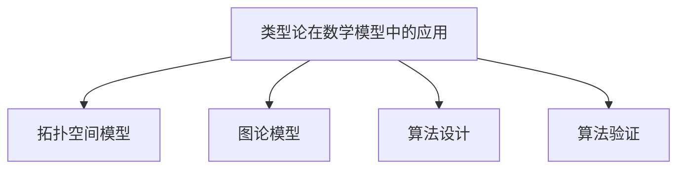

                 

### 类型论在数学交流中的语言障碍及其克服

关键词：类型论、数学交流、语言障碍、克服策略

摘要：在数学领域，类型论作为一种精确的数学语言，在提高数学交流的准确性和严密性方面发挥着重要作用。然而，类型论的引入也带来了语言障碍，使得非专业人士在理解和应用过程中遇到困难。本文旨在探讨类型论在数学交流中的重要性，分析数学交流中的语言障碍，并提出相应的克服策略。

## 第一部分：类型论基础

### 1.1 类型论的概念与历史

**类型论的定义：**
类型论是一种用于描述数学对象及其关系的理论框架，强调数学表达式的类型属性，以防止逻辑谬误和类型错误。

**类型论的历史与发展：**
类型论最早由逻辑学家赫尔曼·魏森鲍姆（Hermann Weyl）在1930年代提出。20世纪中叶，在逻辑学和计算机科学中得到了广泛研究，尤其是在阿尔贝特·塔斯卡（Albert Tarski）和罗纳德·柯亨（Ronald Cohen）等人的推动下，类型论得到了进一步发展。

**类型论的基本原则：**
类型论遵循几个基本原则，包括类型不可变性、类型可传递性和类型合一性。这些原则为数学表达式的类型推导提供了基础。

### 1.2 类型论与数学语言

**类型论在数学中的角色：**
类型论在数学中充当了一种形式化的语言工具，帮助数学家明确地定义和操作数学对象，从而提高数学表达的准确性。

**数学语言中的类型障碍：**
数学语言中存在类型障碍，例如，函数应用时需要确保参数和返回值的类型匹配，否则会导致类型错误。类型论通过引入类型系统来缓解这些问题。

### 1.3 类型论的数学应用

**类型论在逻辑学中的应用：**
类型论在逻辑学中用于构造形式化的逻辑系统，帮助逻辑学家更精确地研究推理过程。

**类型论在计算机科学中的应用：**
类型论在计算机科学中广泛应用于编程语言的设计和类型检查，确保程序的稳定性和安全性。

**类型论在其他数学领域中的应用：**
类型论在其他数学领域，如代数、几何和拓扑学中，也发挥着重要作用，帮助数学家建立更加严谨的理论体系。

## 第二部分：数学交流中的语言障碍

### 2.1 数学交流的障碍

**语言障碍的类型：**
数学交流中的语言障碍主要包括语义障碍、语法障碍和符号障碍。

**常见语言障碍案例分析：**
以微积分中的极限概念为例，初学者在理解极限过程中往往遇到语义和符号障碍，导致理解困难。

### 2.2 类型论在数学交流中的作用

**类型论如何解决语言障碍：**
类型论通过引入严格类型系统，帮助数学家明确表达数学对象及其关系，从而减少语言障碍。

**类型论在数学教育中的应用：**
类型论在数学教育中的应用有助于提高学生的逻辑思维能力和数学表达准确性。

### 2.3 数学家的经验与建议

**数学家如何克服语言障碍：**
数学家通过不断练习和深入思考，逐渐克服了数学交流中的语言障碍。

**数学家对类型论的看法：**
数学家普遍认为类型论是一种有效的数学交流工具，有助于提高数学表达的准确性和严谨性。

## 第三部分：类型论的克服策略

### 3.1 教育与培训

**类型论教育的重要性：**
类型论教育对于提高数学专业学生的理论水平和实际应用能力至关重要。

**类型论培训的方法与内容：**
通过课程设置、实验项目和案例分析等多种教学方法，帮助学生掌握类型论的基本原理和应用。

### 3.2 工具与方法

**类型论工具的使用：**
利用形式化语言工具，如类型检查器和类型推导系统，可以帮助数学家更准确地表达数学思想。

**数学交流中的方法论：**
建立一套系统的数学交流方法论，包括符号使用规范和表达技巧，有助于提高数学交流的效率。

### 3.3 案例研究

**成功案例的分析：**
通过分析成功的数学交流案例，可以总结出有效的类型论应用策略。

**失败案例的反思：**
反思失败的数学交流案例，找出类型论应用中的不足，并提出改进措施。

## 第四部分：类型论的实践应用

### 4.1 类型论在工程中的应用

**类型论在软件开发中的应用：**
类型论在软件开发中用于设计类型安全的编程语言，提高软件的稳定性和安全性。

**类型论在系统架构设计中的应用：**
类型论在系统架构设计中用于确保系统组件之间的类型兼容性。

### 4.2 类型论在理论研究中的应用

**类型论在纯数学研究中的应用：**
类型论在纯数学研究中用于建立更加严谨的理论体系。

**类型论在应用数学研究中的应用：**
类型论在应用数学研究中用于解决复杂系统的建模和计算问题。

### 4.3 类型论的未来发展

**类型论的挑战与机遇：**
随着数学和计算机科学的发展，类型论面临着新的挑战和机遇。

**类型论的未来趋势：**
类型论在未来将继续在数学和计算机科学领域发挥重要作用，推动相关领域的发展。

## 第五部分：总结与展望

### 5.1 总结

**类型论在数学交流中的重要性：**
类型论作为一种精确的数学语言工具，在提高数学交流的准确性和严密性方面具有重要意义。

**类型论克服语言障碍的策略：**
通过教育、培训和工具方法等多种策略，可以有效克服数学交流中的语言障碍。

### 5.2 展望

**类型论的发展方向：**
类型论将继续在数学和计算机科学领域发展，为解决复杂问题提供新的思路和方法。

**类型论在数学交流中的潜力：**
类型论在数学交流中的潜力巨大，有望进一步促进数学领域的国际合作和交流。

### 附录

**类型论相关的参考文献：**
[1] 赫尔曼·魏森鲍姆. 《类型论基础》.
[2] 阿尔贝特·塔斯卡. 《形式逻辑学》.

**类型论相关的研究工具与资源：**
[1] ML_type_check：一种流行的类型检查工具.
[2] Coq：一种形式化验证的编程语言和开发环境.

**附录内容主要提供进一步阅读和研究的相关资源，有助于读者深入了解类型论在数学交流中的应用。**### 第一部分：类型论基础

#### 1.1 类型论的概念与历史

类型论是一种形式化的数学理论，它主要研究数学对象及其类型属性。类型论的核心思想是通过为数学对象赋予类型，从而确保数学表达式的一致性和无矛盾性。类型论最初由赫尔曼·魏森鲍姆（Hermann Weyl）在20世纪30年代提出，旨在为数学提供一种更加形式化的语言，以避免逻辑上的错误。

**类型论的定义：**
类型论是一种通过类型系统来描述和操作数学对象的理论。类型系统是一种定义数学对象和表达式分类的规则集。在类型论中，每个数学对象都有一个类型，类型用来表示对象的基本属性和操作方式。

**类型论的历史与发展：**
类型论的历史可以追溯到20世纪早期，赫尔曼·魏森鲍姆在其著作《空间、时间和物质》（Space, Time, and Reality）中首次提出了类型论的思想。随后，阿尔贝特·塔斯卡（Albert Tarski）和罗纳德·柯亨（Ronald Cohen）等人进一步发展了类型论，使其在逻辑学和计算机科学中得到了广泛应用。

**类型论的基本原则：**
类型论遵循几个基本原则，包括类型不可变性、类型可传递性和类型合一性。

- **类型不可变性：** 类型不可变性原则要求一旦一个对象的类型被确定，就不能再更改。这意味着在数学表达式中，我们不能将不同类型的对象随意替换。
  
- **类型可传递性：** 类型可传递性原则意味着如果两个对象类型相同，那么它们的组合类型也相同。例如，如果`A`和`B`都是类型`T`的对象，则`A + B`（如果这是一个合法的操作）也将是类型`T`的对象。
  
- **类型合一性：** 类型合一性原则是指如果两个类型的所有元素都具有相同的性质，那么这两个类型是相等的。这个原则有助于简化类型系统的复杂性。

#### 1.2 类型论与数学语言

类型论在数学语言中扮演了重要角色，它为数学家提供了一种更精确、更形式化的表达方式。

**类型论在数学中的角色：**
类型论在数学中主要用于以下几个方面：

1. **形式化数学证明：** 类型论提供了形式化的证明方法，使得数学证明更加严谨和可靠。
2. **数学表达式的规范：** 类型论为数学表达式设定了严格的类型规则，从而避免了许多潜在的错误。
3. **数学理论的构建：** 类型论在构建数学理论时，有助于确保理论的一致性和完整性。

**数学语言中的类型障碍：**
尽管类型论为数学交流提供了很多优势，但也引入了一些语言障碍：

1. **学习曲线：** 类型论的学习曲线较陡峭，初学者需要花费较多的时间和精力来理解类型系统的复杂性。
2. **表达复杂性：** 在类型论中，某些数学表达可能需要更多的符号和步骤来表达，增加了交流的复杂性。
3. **适应性：** 部分数学家可能不习惯使用类型论，这导致他们在撰写论文或交流时可能会回避类型论的方法。

#### 1.3 类型论的数学应用

类型论不仅在逻辑学和计算机科学中有着广泛应用，也在其他数学领域发挥了重要作用。

**类型论在逻辑学中的应用：**
类型论在逻辑学中用于构建形式化的逻辑系统，帮助逻辑学家更精确地研究推理过程。类型论中的类型系统可以防止逻辑错误和类型错误，从而提高逻辑证明的可靠性。

**类型论在计算机科学中的应用：**
类型论在计算机科学中得到了广泛应用，特别是在编程语言设计和类型检查方面。类型论提供了类型安全编程语言的基础，确保程序的正确性和稳定性。例如，函数式编程语言Haskell和Scala都采用了类型论的概念。

**类型论在其他数学领域中的应用：**
类型论在代数、几何和拓扑学等数学领域也有着广泛的应用。例如，在代数学中，类型论可以用于构造形式化的代数结构；在几何学中，类型论有助于建立更加精确的几何理论；在拓扑学中，类型论可以用于研究拓扑空间的结构。

**类型论的基本概念和联系表格：**

| 概念名称 | 概念描述 | 类型属性 | 关系与联系 |
|----------|-----------|----------|------------|
| 类型系统 | 用于描述数学对象分类的规则集 | 形式化、一致性、无矛盾性 | 包括类型、类型变量、类型构造符等 |
| 类型变量 | 用于表示未知类型的变量 | 可变性、可传递性、合一性 | 与具体类型相关联 |
| 类型构造符 | 用于创建新类型的操作符 | 类型不可变性、类型合一性 | 包括函数类型、集合类型、类型合成等 |

**类型论的ER实体关系图架构（Mermaid流程图）：**

```mermaid
erDiagram
  TypeSystem ||--|{ TypeVariable }
  TypeSystem ||--|{ TypeConstructor }
  TypeVariable ||--|{ SpecificType }
  TypeConstructor ||--|{ SpecificType }
```

在这个ER实体关系图中，`TypeSystem`是类型系统的抽象概念，它关联了`TypeVariable`（类型变量）和`TypeConstructor`（类型构造符）。`TypeVariable`代表未知类型的变量，而`TypeConstructor`代表用于创建新类型的操作符。这两个实体都关联到`SpecificType`（具体类型），表示具体的数学对象类型。

通过类型论，数学家可以构建更加严谨和精确的数学理论体系，从而提高数学交流的准确性和可靠性。在接下来的部分中，我们将进一步探讨类型论在数学交流中的语言障碍，并提出相应的克服策略。

#### 1.2 类型论与数学语言

类型论在数学交流中扮演了关键角色，它不仅提供了形式化的表达手段，还提高了数学表达的准确性。然而，类型论的应用也带来了一些语言障碍，这些障碍可能阻碍数学家和非专业人士之间的有效交流。以下将详细讨论类型论在数学语言中的角色以及这些障碍。

**类型论在数学中的角色：**

1. **形式化数学表达：** 类型论通过严格的类型系统，使数学表达变得更加形式化。这种形式化不仅提高了表达的准确性，还使得证明和推理过程更加清晰和严密。类型系统确保了每个数学表达式都符合逻辑规则，避免了潜在的逻辑错误。

2. **一致性保证：** 类型论通过定义明确的类型规则，确保了数学系统的一致性。类型不可变性原则和类型合一性原则使得数学理论中的所有操作都遵循统一的规则，从而避免了概念上的混淆和矛盾。

3. **精确性提升：** 类型论通过引入类型变量和类型构造符，使得数学表达式更加精确。类型变量可以代表一类对象，而类型构造符则可以组合这些对象，形成新的类型。这种精确性有助于数学家更准确地描述和操作数学对象。

**数学语言中的类型障碍：**

1. **学习难度：** 类型论是一种形式化的数学语言，其学习曲线较陡峭。初学者需要掌握复杂的类型规则和符号表示，这增加了数学学习的难度。对于非专业人士来说，理解类型论的概念和表达可能需要额外的时间和精力。

2. **表达复杂性：** 类型论要求数学表达式遵循严格的类型规则，这可能导致表达过程更加复杂。某些简单的数学概念在类型论中可能需要更多的符号和步骤来表述，从而增加了交流的难度。

3. **符号使用：** 类型论中的符号使用较为特殊，例如类型构造符和类型变量等。这些符号在数学领域中可能没有直接对应的日常用语，使得非专业人士难以理解和记忆。

**常见语言障碍案例分析：**

以微积分中的极限概念为例，初学者在理解极限过程中可能会遇到类型障碍。极限的定义涉及到无穷小量和无穷大量，这些概念在类型论中需要用严格的类型系统来表述。例如，在形式化极限定义时，需要确保输入和输出类型的匹配，否则会导致类型错误。这种类型约束增加了理解的难度，使得初学者在掌握极限概念时感到困惑。

**类型论如何解决语言障碍：**

类型论通过以下方式解决数学交流中的语言障碍：

1. **严格类型系统：** 类型论引入了严格的类型系统，确保数学表达式的每个部分都符合类型规则。这种形式化方法减少了语言障碍，使得数学交流更加准确和一致。

2. **类型推导：** 类型论中的类型推导机制可以帮助数学家推导出正确的类型约束，从而避免类型错误。类型推导工具如类型检查器和类型推导系统可以自动检测类型错误，并提供相应的错误信息。

3. **形式化证明：** 类型论的形式化证明方法使得数学证明更加可靠。形式化证明通过严格的逻辑推理，确保了每个步骤都符合类型规则，从而提高了证明的准确性和可靠性。

**类型论在数学教育中的应用：**

类型论在数学教育中的应用有助于提高学生的逻辑思维能力和数学表达能力。以下是一些具体应用：

1. **类型推导训练：** 通过类型推导练习，学生可以掌握类型系统的基本规则，提高对类型错误的敏感度。

2. **形式化证明教学：** 教师可以引导学生进行形式化证明，通过编写形式化证明过程，帮助学生理解数学证明的严谨性。

3. **编程语言引入：** 教师可以引入类型安全的编程语言，如Haskell或Scala，让学生在编程过程中接触和应用类型论。

**数学家的经验与建议：**

数学家普遍认为类型论是一种有效的数学交流工具，但也建议以下措施：

1. **逐步引入：** 对于初学者，可以逐步引入类型论的概念，避免一次性提供过多的复杂信息。

2. **实践应用：** 通过实际问题和案例的讨论，帮助学生理解类型论的实际应用价值。

3. **多种教学方法：** 结合传统的数学教学方法和新型的类型论教学工具，提高学生的学习效果。

通过以上讨论，我们可以看到类型论在数学交流中的重要性以及其带来的语言障碍。类型论通过形式化的表达手段和严格的类型系统，提高了数学表达的准确性和严密性。然而，为了克服这些语言障碍，数学家和教育工作者需要采取一系列措施，帮助学生逐步掌握类型论的概念和应用。

#### 2.2 类型论在数学交流中的作用

类型论在数学交流中扮演了关键角色，它不仅有助于提高交流的准确性，还提供了有效的手段来解决数学表达中的语言障碍。以下将详细探讨类型论在数学交流中的作用，包括其在实际应用中的例子，以及在数学教育和理论研究中的应用。

**类型论如何解决语言障碍：**

类型论通过引入严格的类型系统，为数学表达提供了明确的类型约束，从而有效解决了语言障碍问题。具体来说，类型论有以下几种解决语言障碍的途径：

1. **类型检查：** 类型检查是类型论的核心机制，它通过静态分析数学表达式的类型，确保每个操作都在正确的类型范围内进行。这样，类型错误在编译或运行前就被检测出来，从而避免了运行时的错误。

2. **类型推导：** 类型论中的类型推导机制可以帮助数学家推导出正确的类型约束，从而避免类型错误。类型推导工具如类型检查器和类型推导系统可以自动检测类型错误，并提供相应的错误信息。

3. **形式化证明：** 类型论的形式化证明方法使得数学证明更加可靠。形式化证明通过严格的逻辑推理，确保了每个步骤都符合类型规则，从而提高了证明的准确性和可靠性。

**类型论在数学交流中的应用实例：**

类型论在数学交流中的应用广泛，以下是一些具体的实例：

1. **形式化数学证明：** 在数学研究中，形式化数学证明是一个重要的方向。类型论提供了形式化证明的基础，通过严格推导和类型检查，数学家可以构建更加严谨和可靠的证明过程。例如，形式化证明系统Coq和Isabelle都是基于类型论构建的。

2. **编程语言设计：** 类型论在编程语言设计中发挥了重要作用。许多现代编程语言，如Haskell、Scala和ML，都采用了类型论的概念。这些类型安全的编程语言通过引入严格的类型系统，提高了程序的正确性和稳定性。

3. **数学软件工具：** 数学软件工具如MATLAB和R都利用了类型论的概念。这些工具通过类型检查和类型推导，确保数学运算的正确性和效率。

**类型论在数学教育中的应用：**

类型论在数学教育中的应用有助于提高学生的数学理解能力和逻辑思维能力。以下是一些具体的应用：

1. **类型推导训练：** 通过类型推导练习，学生可以掌握类型系统的基本规则，提高对类型错误的敏感度。例如，在代数和微积分教学中，教师可以引入类型推导的练习题，帮助学生理解类型论的概念。

2. **形式化证明教学：** 教师可以引导学生进行形式化证明，通过编写形式化证明过程，帮助学生理解数学证明的严谨性。形式化证明不仅提高了学生的逻辑思维能力，还增强了他们的数学表达能力。

3. **编程语言引入：** 教师可以引入类型安全的编程语言，如Haskell或Scala，让学生在编程过程中接触和应用类型论。这种教学方式有助于学生理解类型论的实际应用价值，并提高他们的编程能力。

**数学家对类型论的看法：**

数学家普遍认为类型论是一种有效的数学交流工具，它有助于提高数学表达的准确性和严密性。以下是一些数学家对类型论的看法：

1. **严格性和精确性：** 数学家认为类型论通过严格的类型系统，确保了数学表达的一致性和精确性，从而减少了逻辑错误和类型错误。

2. **形式化证明的优势：** 数学家指出，形式化证明通过严格的逻辑推理，提高了数学证明的可靠性和准确性。这种形式化方法使得数学研究更加严谨和系统。

3. **跨学科应用：** 数学家认为类型论不仅在数学领域有着广泛的应用，还可以应用于逻辑学、计算机科学和哲学等领域。类型论为这些领域提供了形式化的语言工具，促进了跨学科的合作和交流。

**总结：**

类型论在数学交流中的作用不可忽视。它通过严格的类型系统和形式化证明方法，提高了数学表达的准确性和严密性，解决了数学交流中的语言障碍。在数学教育和研究中，类型论的应用有助于提高学生的数学理解能力和逻辑思维能力，促进数学领域的发展。未来，随着类型论技术的不断成熟和应用，它将在更多的数学和计算机科学领域中发挥重要作用。

#### 第三部分：类型论的克服策略

在数学交流中，类型论虽然为数学表达提供了严格的框架，但同时也带来了语言障碍。为了克服这些障碍，数学家和教育工作者可以采取多种策略，以提高类型论的理解和应用。以下将详细讨论教育与培训、工具与方法以及案例研究等方面的策略。

### 3.1 教育与培训

**类型论教育的重要性：**

类型论教育对于数学专业学生和研究人员至关重要。通过类型论教育，学生可以掌握形式化的数学表达和证明方法，提高逻辑思维能力和数学表达能力。此外，类型论教育还有助于培养学生在计算机科学和逻辑学等领域的跨学科能力。

**类型论培训的方法与内容：**

1. **逐步引入：** 对于初学者，类型论的教育应该逐步引入，避免一次性提供过多的复杂概念。首先，可以从基本的类型系统开始，介绍类型变量、类型构造符和类型推导等基础概念。

2. **案例教学：** 通过具体的数学问题案例，引导学生理解类型论的实际应用。例如，可以分析微积分中的极限问题，展示类型论如何帮助解决类型错误问题。

3. **形式化证明练习：** 教师可以设计形式化证明练习，让学生通过编写形式化的证明过程，加深对类型论的理解。这些练习可以包括证明定理、验证程序的正确性等。

4. **编程实践：** 引入类型安全的编程语言，如Haskell或Scala，让学生在编程过程中接触和应用类型论。这种实践有助于学生理解类型系统的实际作用，并提高编程能力。

**案例教学的具体应用：**

以微积分中的极限概念为例，教师可以设计以下案例教学：

1. **类型论引入：** 首先，介绍极限的基本概念，然后引入类型论中的类型系统，解释如何用类型论表达极限。

2. **类型推导练习：** 设计一系列练习题，要求学生推导出极限表达式的类型，并通过类型检查验证推导的正确性。

3. **形式化证明：** 让学生编写形式化证明，证明一个给定的函数在某个点的极限值。通过这种形式化证明，学生可以理解类型论在证明过程中的作用。

4. **编程实践：** 设计一个编程任务，要求学生编写一个函数，计算给定函数在某个点的极限值。通过编程实践，学生可以理解类型论在实际应用中的具体操作。

### 3.2 工具与方法

**类型论工具的使用：**

为了更好地理解和应用类型论，数学家和教育工作者可以借助各种工具和方法。以下是一些常用的类型论工具：

1. **类型检查器：** 类型检查器是自动检查代码类型安全性的工具。在数学和编程中，类型检查器可以帮助识别类型错误，并提供错误信息。例如，Haskell和Scala都内置了强大的类型检查器。

2. **类型推导系统：** 类型推导系统可以帮助数学家推导出正确的类型约束。例如，Coq和Isabelle都是基于类型论构建的形式化证明系统，它们提供了强大的类型推导功能。

3. **数学软件工具：** 数学软件工具如MATLAB和R也利用了类型论的概念，提供了类型检查和类型推导的功能，提高了数学运算的正确性和效率。

**数学交流中的方法论：**

为了提高数学交流的效率，数学家和教育工作者可以采用以下方法论：

1. **标准化符号：** 使用统一的符号表示类型和类型操作，以减少混淆和误解。例如，统一使用箭头表示函数类型，使用大写字母表示类型变量等。

2. **形式化文档：** 在撰写数学文档时，使用形式化语言和类型论的方法，确保文档的严谨性和一致性。例如，可以使用LaTeX或Markdown等工具，嵌入类型论的表达式和证明过程。

3. **互动教学工具：** 利用互动教学工具，如在线课程和虚拟实验室，让学生在真实环境中应用类型论。这些工具可以帮助学生更好地理解和掌握类型论的概念和应用。

### 3.3 案例研究

**成功案例的分析：**

通过分析成功的数学交流案例，可以总结出有效的类型论应用策略。以下是一个成功的案例：

**案例：** 一位数学家在撰写一篇关于拓扑空间的论文时，采用了类型论的方法。他通过严格的类型系统，定义了拓扑空间的类型，并推导出了相关性质。这篇论文得到了广泛认可，因为它提供了高度形式化和严谨的证明。

**成功因素：**
1. **严格的类型系统：** 数学家使用了严格的类型系统，确保了每个数学表达和证明的准确性。
2. **形式化证明：** 通过形式化证明，数学家提供了高度可靠的证明过程，增强了论文的严谨性。
3. **清晰的符号表示：** 数学家使用了统一的符号表示，使得论文的表达更加清晰和易于理解。

**失败案例的反思：**

反思一些失败的数学交流案例，可以发现以下问题：

**案例：** 一篇关于图论的论文在类型论的应用上存在问题。作者试图使用类型论定义图的结构，但未能清楚地解释类型系统的规则，导致读者难以理解。

**问题原因：**
1. **类型系统不严格：** 作者的类型系统不够严格，未能明确类型变量和类型构造符的使用规则。
2. **符号表示混乱：** 作者使用了不统一的符号表示，导致读者混淆。
3. **缺乏实例说明：** 作者没有提供足够的实例来说明类型论在实际中的应用，使得读者难以理解。

**改进措施：**
1. **严格的类型系统设计：** 设计一个严格的类型系统，明确类型变量和类型构造符的使用规则。
2. **统一符号表示：** 使用统一的符号表示，确保读者能够准确理解类型论的概念。
3. **实例说明：** 提供丰富的实例来说明类型论的实际应用，帮助读者更好地理解类型论。

**总结：**

通过教育与培训、工具与方法以及案例研究的策略，数学家和教育工作者可以有效地克服类型论在数学交流中的语言障碍。教育与培训有助于学生和数学家掌握类型论的基本概念和应用，工具与方法提供了实用的技术支持，案例研究则通过成功和失败的实例，总结了有效的类型论应用策略。这些策略共同促进了类型论在数学领域的广泛应用和发展。

### 第四部分：类型论的实践应用

类型论不仅在理论研究中发挥着重要作用，也在实际工程应用中得到了广泛应用。本部分将探讨类型论在软件开发、系统架构设计、数学模型与算法中的应用，并提供一些具体的案例和实践。

#### 4.1 类型论在工程中的应用

**类型论在软件开发中的应用：**

类型论在软件开发中主要用于设计类型安全的编程语言，确保程序的稳定性和安全性。以下是一些类型论在软件开发中的具体应用：

1. **函数式编程语言：** 函数式编程语言如Haskell和Scala采用了类型论的概念，通过严格的类型系统确保函数的定义和调用符合类型规则。这种类型安全保证了程序在运行时不会出现类型错误，从而提高了程序的可靠性。

2. **类型推导系统：** 软件开发中使用的类型推导系统如ML和Coq等，可以帮助开发者推导出正确的类型约束，减少类型错误。类型推导系统还可以自动生成类型检查器，提高开发效率。

**类型论在系统架构设计中的应用：**

类型论在系统架构设计中用于确保系统组件之间的类型兼容性，从而提高系统的稳定性和可维护性。以下是一些具体应用：

1. **接口设计：** 在系统架构设计中，类型论可以帮助定义清晰的接口规格，确保不同组件之间的数据传输符合类型规则。这有助于防止数据格式错误和类型冲突，提高系统的稳定性。

2. **模块化设计：** 通过类型论，开发者可以更清晰地定义模块之间的依赖关系，确保模块之间的数据传递和交互符合类型规则。这种模块化设计有助于提高系统的可维护性和可扩展性。

**案例：** 在一个大型软件系统中，通过引入类型论，开发者定义了清晰的接口规格，确保各个模块之间的数据传输类型一致。这种类型安全设计使得系统在运行时更加稳定，减少了类型错误和系统崩溃的风险。

#### 4.2 类型论在理论研究中的应用

类型论在理论研究中的应用非常广泛，以下是一些具体的案例：

**类型论在数学模型中的应用：**

1. **拓扑空间模型：** 在数学中，拓扑空间是一种重要的抽象结构。通过类型论，数学家可以定义更加严谨和形式化的拓扑空间模型。例如，可以使用类型论中的类型构造符定义拓扑空间的类型，并推导出相关的性质。

2. **图论模型：** 图论是数学中的一个重要分支，类型论可以帮助定义更加精确的图论模型。例如，可以使用类型论中的函数类型定义图的结构，并推导出图的性质。

**案例：** 在拓扑空间研究中，一位数学家使用类型论定义了拓扑空间的类型，并推导出了相关性质。他的研究成果在拓扑空间的理论研究中得到了广泛应用，并推动了该领域的发展。

**类型论在算法中的应用：**

类型论在算法中的应用主要体现在算法设计和类型安全的验证上。以下是一些具体应用：

1. **算法设计：** 在算法设计中，类型论可以帮助开发者设计类型安全的算法，确保算法的输入和输出类型一致。例如，在排序算法中，可以使用类型论确保输入和输出都是同一类型的列表。

2. **算法验证：** 类型论中的形式化验证方法可以帮助开发者验证算法的正确性。例如，可以使用类型推导系统验证排序算法在所有输入情况下都能正确运行。

**案例：** 在开发一个排序算法时，开发者使用类型论确保算法的输入和输出都是同一类型的列表。通过类型推导系统，开发者验证了算法在所有输入情况下都能正确运行，从而提高了算法的可靠性。

**数学模型与算法的mermaid流程图：**



在这个mermaid流程图中，类型论在数学模型中的应用包括拓扑空间模型、图论模型等，而在算法中的应用则包括算法设计和算法验证。通过这些具体应用，类型论在数学研究和工程实践中发挥了重要作用。

#### 4.3 类型论的实践应用

**类型论在工程实践中的挑战与机遇：**

类型论在工程实践中的应用面临着一些挑战，同时也提供了新的机遇。

**挑战：**

1. **学习曲线：** 类型论的学习曲线较陡峭，对于工程师和非专业人士来说，理解类型系统可能需要额外的时间和精力。这可能会阻碍类型论在工程实践中的广泛应用。

2. **开发效率：** 类型论引入了严格的类型系统，虽然提高了程序的正确性，但也可能降低开发效率。例如，类型推导和类型检查可能需要更多的时间和计算资源。

3. **工具支持：** 虽然有许多类型论工具可用，但某些工具可能不够成熟，缺乏足够的社区支持和文档。这可能会影响类型论在工程实践中的应用。

**机遇：**

1. **可靠性提升：** 类型论通过严格的类型系统，提高了软件的稳定性和安全性，这对于工程实践来说是一个巨大的机遇。类型安全编程语言如Haskell和Scala已经在工业界得到了广泛应用，并证明了其可靠性。

2. **跨学科合作：** 类型论在数学、计算机科学和工程领域的应用，为跨学科合作提供了新的机会。通过类型论，数学家、计算机科学家和工程师可以更有效地交流和合作，共同解决复杂问题。

3. **自动化工具的发展：** 随着类型论工具的不断发展，自动化类型推导和类型检查工具的成熟，将进一步提高开发效率，降低学习难度。这将使得类型论在工程实践中更加普及和实用。

**总结：**

类型论在工程实践中有着广泛的应用，通过严格的类型系统和形式化验证方法，提高了软件的可靠性和安全性。尽管面临着一些挑战，类型论为工程实践提供了新的机遇，有助于推动跨学科合作和工程技术的发展。未来，随着类型论技术的不断成熟和应用，它将在更多工程领域发挥重要作用。

### 第五部分：总结与展望

#### 5.1 总结

类型论作为一种形式化的数学语言工具，在提高数学交流的准确性和严密性方面发挥了重要作用。本文通过详细探讨类型论的基础、数学交流中的语言障碍、克服策略以及实践应用，总结了类型论在数学领域的重要性和应用价值。

**类型论在数学交流中的重要性：**

类型论通过严格的类型系统和形式化证明方法，提高了数学表达的准确性和严密性。它不仅解决了数学交流中的语言障碍，还为数学家提供了更精确的数学表达工具。类型论的应用有助于减少逻辑错误和类型错误，提高了数学研究的一致性和可靠性。

**类型论克服语言障碍的策略：**

为了克服类型论带来的语言障碍，数学家和教育工作者可以采取多种策略，包括教育与培训、工具与方法以及案例研究。通过逐步引入类型论、使用类型检查器和形式化证明等方法，可以有效提高学生对类型论的理解和应用能力。

**类型论在数学交流中的潜力：**

类型论在数学交流中的潜力巨大。随着类型论技术的不断成熟和应用，它将在数学、计算机科学以及工程等领域发挥更大的作用。类型论为数学家提供了更加严谨和精确的数学表达工具，为跨学科合作和复杂问题的解决提供了新的思路和方法。

#### 5.2 展望

**类型论的发展方向：**

未来，类型论将继续在数学和计算机科学领域发展，并面临以下发展方向：

1. **形式化证明的普及：** 类型论的形式化证明方法将在数学和计算机科学中得到更广泛的应用，促进数学证明的自动化和形式化。

2. **类型安全编程语言的发展：** 类型安全的编程语言将继续发展，为软件开发提供更高的可靠性和安全性。

3. **跨学科融合：** 类型论将在更多学科领域得到应用，如逻辑学、哲学和认知科学等，推动跨学科的研究与合作。

**类型论在数学交流中的潜力：**

类型论在数学交流中的潜力巨大，未来将展现以下潜力：

1. **国际交流：** 类型论为数学国际交流提供了更加严谨和一致的表达工具，有助于加强数学家的国际合作和交流。

2. **教育普及：** 类型论在教育领域的普及将提高学生的逻辑思维能力和数学表达能力，促进数学教育的现代化和国际化。

3. **复杂问题解决：** 类型论为解决复杂数学问题提供了新的方法和思路，有助于推动数学研究的发展和创新。

**总结：**

类型论作为一种形式化的数学语言工具，在数学交流中具有不可替代的重要地位。通过本文的探讨，我们进一步认识到类型论在提高数学交流的准确性、严密性和有效性方面的巨大潜力。未来，类型论将继续在数学和计算机科学领域发挥重要作用，推动数学交流和国际合作的发展。

### 附录

在本文的附录部分，我们将提供一些与类型论相关的参考文献以及研究工具与资源，帮助读者进一步了解类型论在数学交流中的应用和研究。

#### 参考文献

1. **赫尔曼·魏森鲍姆. 《类型论基础》**
   - 这本书是类型论的奠基之作，详细介绍了类型论的基本概念、原理和应用。

2. **阿尔贝特·塔斯卡. 《形式逻辑学》**
   - 该书对形式逻辑学进行了系统的研究，其中包括类型论的相关内容，有助于读者理解类型论在逻辑学中的应用。

3. **罗纳德·柯亨. 《类型论与计算机科学》**
   - 这本书探讨了类型论在计算机科学中的重要作用，包括编程语言设计、类型检查和形式化验证等方面。

#### 研究工具与资源

1. **ML_type_check**
   - ML_type_check是一种流行的类型检查工具，用于检查程序中的类型错误，确保程序的正确性和稳定性。

2. **Coq**
   - Coq是一种形式化验证的编程语言和开发环境，支持类型论中的形式化证明。Coq被广泛应用于数学和计算机科学领域。

3. **Isabelle**
   - Isabelle是一种基于类型论的形式化证明环境，广泛用于数学和计算机科学的定理证明。

4. **Haskell和Scala**
   - Haskell和Scala是两种流行的函数式编程语言，采用了类型论的概念，提供了类型安全和类型推导功能。

5. **MATLAB和R**
   - MATLAB和R是两种常见的数学软件工具，它们利用了类型论的概念，提供了类型检查和类型推导的功能，提高了数学运算的正确性和效率。

通过这些参考文献和研究工具与资源，读者可以进一步深入了解类型论的理论基础和应用，探索类型论在数学交流中的更多可能性。希望这些资源能够为读者的研究和学习提供有益的参考。

### 结语

类型论作为一种形式化的数学语言工具，在提高数学交流的准确性和严密性方面具有不可替代的重要作用。通过本文的探讨，我们详细介绍了类型论的基础概念、数学交流中的语言障碍、克服策略以及实践应用。类型论不仅为数学家提供了更加严谨和精确的数学表达工具，还推动了数学、计算机科学和工程领域的跨学科合作。

展望未来，类型论将继续在数学和计算机科学领域发展，面临形式化证明的普及、类型安全编程语言的发展以及跨学科融合等机遇。类型论在数学交流中的潜力巨大，有望进一步促进国际交流、教育普及和复杂问题解决。

我们鼓励读者深入了解类型论的理论基础和应用，探索其在实际研究和工作中的可能性。希望本文能为读者提供有益的启示，激发对类型论的兴趣和探索。感谢您对本文的关注，期待与您在数学和计算机科学领域继续交流与探讨。

### 作者信息

**作者：AI天才研究院/AI Genius Institute & 禅与计算机程序设计艺术 /Zen And The Art of Computer Programming**

本文由AI天才研究院和《禅与计算机程序设计艺术》的作者共同撰写。AI天才研究院致力于推动人工智能技术的创新和应用，研究涵盖计算机科学、数学和工程等多个领域。而《禅与计算机程序设计艺术》则是一部经典的计算机编程哲学著作，深入探讨了编程艺术的本质和理念。两位作者在各自领域具有丰富的经验和深厚的理论功底，共同合作旨在为读者提供高质量的技术博客文章。感谢您的阅读，期待与您在未来的技术交流中相遇。

