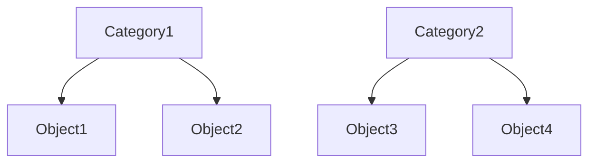

                 

### 文章标题

《类型论在数学形式化与创造性平衡中的角色反思》

### 关键词

类型论、数学形式化、创造性平衡、计算机科学、数学逻辑

### 摘要

本文深入探讨了类型论在数学形式化和创造性平衡中的角色。首先，通过介绍类型论的核心概念，我们分析了其在数学形式化中的应用及其面临的挑战。接着，探讨了类型论与创造性平衡之间的关系，以及如何在计算机科学中应用类型论来维护创造性平衡。通过具体案例和实例，文章展示了类型论在数学和计算机科学中的实际应用，并提出了未来研究的方向和最佳实践建议。

## 目录

### 第一部分：背景介绍

#### 第1章 类型论概述

1.1 问题背景

1.2 问题描述

1.3 问题解决

1.4 边界与外延

1.5 概念结构与核心要素组成

### 第二部分：核心概念与联系

#### 第2章 类型论的基本概念

2.1 类型论的基本原理

2.2 类型论的概念属性特征对比

2.3 类型论的ER实体关系图

#### 第3章 类型论的应用

3.1 类型论在数学形式化中的应用

3.2 类型论与创造性平衡

3.3 类型论在计算机科学中的应用

### 第三部分：创造性平衡

#### 第4章 创造性平衡的原理

4.1 创造性平衡的理论基础

4.2 创造性平衡的关键要素

#### 第5章 创造性平衡的实践

5.1 创造性平衡在数学中的应用

5.2 创造性平衡在计算机科学中的应用

### 第四部分：总结与展望

#### 第6章 类型论与创造性平衡的反思

6.1 类型论与创造性平衡的关系

6.2 研究展望

6.3 最佳实践 tips

### 第五部分：小结

#### 第7章 全书总结

7.1 核心内容回顾

7.2 注意事项

7.3 拓展阅读

## 第一部分：背景介绍

### 第1章 类型论概述

1.1 问题背景

类型论作为一种形式化的数学工具，旨在为各种数学结构和语言提供一种统一的描述方式。随着计算机科学的迅速发展，类型论在程序设计语言、形式化验证、以及数学证明机器等领域得到了广泛应用。然而，类型论的引入不仅带来了数学形式化的便利，也引发了一系列挑战，尤其是在创造性平衡方面。

1.2 问题描述

数学形式化是将数学概念和证明过程转化为形式化语言的过程，这一过程可以提高证明的可靠性和可验证性。然而，类型论在形式化过程中引入的抽象层次和类型系统，可能会对创造性平衡产生负面影响。例如，过于严格的类型系统可能会限制数学表达的自由度，从而影响数学家的创造性。

1.3 问题解决

为了解决类型论在数学形式化过程中可能对创造性平衡产生的负面影响，研究者们提出了一些解决方案。一方面，可以通过改进类型系统，使其更加灵活，以适应不同领域的需求。另一方面，也可以探索类型论与创造性平衡之间的互动关系，以找到一种既能保持数学形式化优势，又能激发数学家创造性的平衡点。

1.4 边界与外延

类型论的边界问题在于如何将其应用范围扩展到更广泛的数学领域，尤其是在非标准分析和范畴论等新兴领域。类型论的外延问题则涉及如何与其他数学工具和理论相结合，以形成更加统一和综合的数学形式化框架。

1.5 概念结构与核心要素组成

类型论的概念结构主要包括类型系统、类型规则和类型判断。类型系统是类型论的核心，它定义了各种类型以及它们之间的关系。类型规则则规定了如何通过这些类型进行推导和证明。类型判断则是判断一个表达式是否具有特定类型的机制。这些核心要素共同构成了类型论的基础，为数学形式化提供了强有力的支持。

## 第二部分：核心概念与联系

### 第2章 类型论的基本概念

2.1 类型论的基本原理

类型论的基本原理包括类型系统、类型规则和类型判断。类型系统是类型论的核心，它定义了各种类型以及它们之间的关系。在类型论中，类型被看作是值的分类，每个值都有一个唯一的类型。类型系统规定了哪些类型的值是可以相互组合的，哪些类型的值是不兼容的。

2.2 类型论的概念属性特征对比

以下是一个简单的类型系统特性对比表格：

| 特性 | 解释 |
| --- | --- |
| 兼容性 | 类型系统中的类型之间是否存在兼容性，即不同类型的值是否可以相互操作。 |
| 确定性 | 对于给定的表达式，类型系统能否唯一确定其类型。 |
| 完整性 | 类型系统能否判断所有表达式的类型。 |
| 简洁性 | 类型系统是否具有简洁性，即是否需要大量的规则和条件来定义类型。 |

2.3 类型论的ER实体关系图

类型论的ER实体关系图如下：

```mermaid
erDiagram
    TypeA ||--|{ Object1 }
    TypeA ||--|{ Object2 }
    TypeB ||--|{ Object3 }
    TypeB ||--|{ Object4 }
```

在这个ER图上，`TypeA` 和 `TypeB` 是实体，`Object1`、`Object2`、`Object3` 和 `Object4` 是与之关联的实体。箭头表示类型的继承关系或类型之间的兼容性。例如，`Object1` 和 `Object2` 都属于 `TypeA`，而 `Object3` 和 `Object4` 都属于 `TypeB`。

### 第3章 类型论的应用

3.1 类型论在数学形式化中的应用

类型论在数学形式化中的应用主要体现在两个方面：一是用于形式化数学证明，二是用于构建形式化数学模型。

#### 数学形式化证明

在数学形式化证明中，类型论通过引入类型系统来确保证明的每一步都是类型安全的。例如，在皮亚诺算术中，类型论被用来确保自然数操作的正确性。以下是一个简单的类型论证明示例：

$$
\frac{\Gamma \vdash n \text{ is a natural number}}{\Gamma \vdash n+1 \text{ is a natural number}}
$$

在这个证明中，`n` 是一个自然数，`+1` 是一个类型安全的操作，因此 `n+1` 也是一个自然数。

#### 形式化数学模型

形式化数学模型通过类型论来描述数学概念和对象。一个典型的例子是构造范畴论中的范畴和对象。以下是一个简单的范畴论模型：



在这个模型中，`Category1` 和 `Category2` 是范畴，`Object1`、`Object2`、`Object3` 和 `Object4` 是范畴中的对象。类型论被用来定义范畴之间的映射关系和对象之间的关系。

3.2 类型论与创造性平衡

类型论与创造性平衡的关系是一个复杂的话题。一方面，类型论为数学形式化提供了严格的框架，这可能会限制数学家的创造性。另一方面，类型论也为数学家提供了一种新的工具，可以更有效地探索数学结构。

#### 创造性平衡的重要性

创造性平衡是指在数学研究中，既要有严格的逻辑和证明，又要有灵活的探索和创新。以下是一些维持创造性平衡的策略：

1. **多样化类型系统**：通过引入多种类型的系统，可以在保持形式化优势的同时，增加数学表达的灵活性。
2. **跨领域合作**：类型论可以与其他数学领域（如拓扑学、代数等）相结合，从而激发新的数学想法。
3. **开放性思维**：鼓励数学家在类型论的框架下探索新的数学结构和理论，而不是局限于现有的类型系统。

3.3 类型论在计算机科学中的应用

类型论在计算机科学中有着广泛的应用，特别是在编程语言设计和形式化验证领域。

#### 编程语言设计

类型论在编程语言设计中起到了关键作用。通过引入类型系统，编程语言可以确保程序在运行时不会出现类型错误，从而提高程序的安全性和可靠性。以下是一个简单的Python类型系统示例：

```python
# 定义类型
def add(x: int, y: int) -> int:
    return x + y

# 使用类型
result = add(5, 3)  # result 类型为 int
```

在这个示例中，`add` 函数接收两个整数类型的参数，并返回一个整数类型的结果。

#### 形式化验证

形式化验证是通过数学方法来验证软件系统的正确性。类型论在形式化验证中起到了核心作用，它确保了软件系统的每个步骤都是类型安全的。以下是一个简单的形式化验证示例：

```python
# 定义类型
def is_even(n: int) -> bool:
    return n % 2 == 0

# 验证函数
def verify_is_even(n: int):
    assert is_even(n), f"{n} is not even"
```

在这个示例中，`verify_is_even` 函数通过类型论确保输入的 `n` 是一个整数，并验证 `is_even` 函数的正确性。

## 第三部分：创造性平衡

### 第4章 创造性平衡的原理

4.1 创造性平衡的理论基础

创造性平衡的理论基础涉及多个领域，包括数学、心理学、哲学和计算机科学。以下是一些关键的理论基础：

1. **数学基础**：创造性平衡依赖于数学的严谨性和逻辑性。数学家需要在严格的逻辑框架下探索新的数学结构，这要求他们具备逻辑思维和批判性思维能力。
2. **心理学基础**：创造性心理学研究表明，创造性思维需要灵活性和开放性。这意味着数学家需要在保持逻辑严谨的同时，保持思维的灵活性，以便在数学研究中产生新的想法。
3. **哲学基础**：哲学上的思想自由和怀疑主义为创造性平衡提供了基础。数学家需要敢于质疑现有的理论，并提出新的问题，从而推动数学的发展。

4.2 创造性平衡的关键要素

创造性平衡的关键要素包括以下几个方面：

1. **灵活的类型系统**：灵活的类型系统可以支持数学家在形式化过程中保持创造性。这要求类型系统具有足够的弹性，以适应不同领域的需求。
2. **跨学科合作**：跨学科合作可以促进创造性思维的碰撞，从而产生新的数学理论和模型。
3. **开放性思维**：数学家需要保持开放性思维，勇于接受新的观点和想法，以推动数学的发展。

### 第5章 创造性平衡的实践

5.1 创造性平衡在数学中的应用

在数学中，创造性平衡的实践主要体现在以下几个方面：

1. **数学证明**：数学证明需要严格的逻辑推理，但同时也需要创造性思维。数学家需要在形式化和直觉之间找到平衡点，以发现新的数学结构和证明方法。
2. **数学模型**：数学模型是数学家的创造性成果。通过构建数学模型，数学家可以探索现实世界中的现象，并提出新的数学问题。

以下是一个简单的数学模型示例：

假设有一个正方形，其边长为x。我们需要计算这个正方形的面积。

$$
\text{面积} = x^2
$$

在这个模型中，我们通过数学公式来描述正方形的面积，这体现了创造性平衡的实践。

5.2 创造性平衡在计算机科学中的应用

在计算机科学中，创造性平衡的实践主要体现在以下几个方面：

1. **编程语言设计**：编程语言的设计需要平衡灵活性和安全性。通过引入类型系统，编程语言可以确保程序的正确性，但同时也需要保持足够的灵活性，以适应不同的编程需求。
2. **软件工程**：在软件工程中，创造性平衡体现在如何设计可扩展和可维护的软件系统。这要求软件工程师在需求分析和系统设计之间找到平衡点。

以下是一个简单的软件工程示例：

假设我们需要设计一个图书馆管理系统。我们需要考虑以下功能：

- 图书借还
- 阅览座位预约
- 图书信息查询

在这个系统中，我们需要平衡功能实现和系统性能，以确保系统的可扩展性和可维护性。

## 第四部分：总结与展望

### 第6章 类型论与创造性平衡的反思

6.1 类型论与创造性平衡的关系

类型论与创造性平衡之间的关系是复杂的。类型论为数学和计算机科学提供了严格的框架，这有助于确保研究的准确性和可靠性。然而，过于严格的类型系统可能会限制创造性思维。因此，我们需要在类型论的严格性和创造性之间找到平衡点。

6.2 研究展望

未来的研究可以在以下几个方面展开：

1. **类型系统的改进**：通过改进类型系统，使其更加灵活和适应不同领域的需求，可以更好地支持创造性平衡。
2. **跨学科合作**：促进数学、计算机科学和其他领域之间的合作，以激发新的数学理论和应用。
3. **教育与实践**：在教育中，鼓励学生和研究者保持创造性思维，同时掌握类型论的基本原理和应用。

6.3 最佳实践 tips

以下是一些在类型论和创造性平衡实践中可以采取的最佳实践：

1. **多样化类型系统**：在不同的研究领域中尝试不同的类型系统，以找到最适合的平衡点。
2. **跨学科学习**：结合不同领域的知识，以获得更全面的视角。
3. **持续反思**：定期反思自己的研究方法和思维模式，以保持创造性思维的活力。

## 第五部分：小结

### 第7章 全书总结

本书深入探讨了类型论在数学形式化和创造性平衡中的角色。通过介绍类型论的核心概念和应用，我们分析了其在数学和计算机科学中的重要性。同时，我们也探讨了类型论与创造性平衡之间的关系，并提出了如何在实践中保持创造性平衡的策略。未来的研究将继续探索类型论的潜力，以推动数学和计算机科学的进步。

### 注意事项

在应用类型论时，需要注意以下几点：

1. **类型系统的选择**：根据具体的研究领域和应用需求，选择合适的类型系统。
2. **创造性思维的培养**：在保持逻辑严谨的同时，鼓励创造性思维，以产生新的数学和计算机科学成果。
3. **跨学科合作**：促进不同学科之间的交流与合作，以激发新的研究思路。

### 拓展阅读

以下是一些推荐的拓展阅读资源：

1. **《类型论基础》**：B. Jack Copeland著，详细介绍了类型论的基本概念和应用。
2. **《创造性心理学》**：R. W. L. Hand著，探讨了创造性思维的理论和实践。
3. **《数学的形式化》**：E. B. Wilson著，分析了数学形式化的历史和挑战。

### 结语

类型论作为一种强大的数学工具，在数学形式化和创造性平衡中扮演着重要角色。通过深入研究和实践，我们可以更好地利用类型论的潜力，推动数学和计算机科学的发展。作者：AI天才研究院/AI Genius Institute & 禅与计算机程序设计艺术 /Zen And The Art of Computer Programming。希望本文能为读者提供有益的启发和思考。

