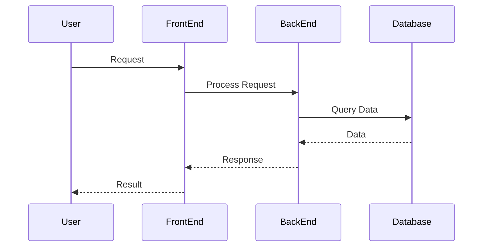

                 

# 类型论在数学教育中的应用：优势与挑战

## 关键词

类型论、数学教育、教学方法、挑战、优势

## 摘要

本文旨在探讨类型论在数学教育中的应用，分析其优势与挑战。类型论作为一种形式化的数学理论，在提高学生的逻辑思维能力、促进跨学科学习等方面展现出独特的价值。然而，类型论在数学教育中的引入也面临一系列挑战，如教师培训、教学资源不足以及学生接受度等问题。本文将通过对类型论基础概念的介绍、教学方法的分析以及实际案例的探讨，全面解析类型论在数学教育中的应用前景与挑战。

## 引言

### 1.1 问题背景

#### 1.1.1 数学教育的现状

数学教育在现代社会中占据着举足轻重的地位。随着科学技术的飞速发展，数学知识的深度和广度都在不断增加，数学教育面临着巨大的挑战。传统的数学教育模式注重理论知识的传授，往往忽视了学生的实践能力和创新思维的培养。这种教育模式难以满足现代社会对复合型人才的需求，迫切需要引入新的教学方法。

#### 1.1.2 类型论在教育中的应用

类型论（Type Theory）起源于逻辑学和计算机科学，是一种用于描述和证明数学性质的形式化方法。近年来，类型论在数学教育中逐渐得到关注。类型论的引入有助于培养学生的逻辑思维能力，提高学生的证明能力，同时也有利于跨学科知识的整合。因此，类型论在教育中的应用具有重要的现实意义。

#### 1.1.3 书籍结构安排

本文将从以下几个方面展开讨论：

1. 类型论基础
2. 类型论在数学教育中的应用
3. 类型论的挑战与未来发展方向
4. 实践中的类型论
5. 实际案例分析与讲解
6. 最佳实践与拓展阅读

通过以上结构的安排，本文将系统地探讨类型论在数学教育中的应用，分析其优势与挑战，为数学教育改革提供参考。

## 类型论基础

### 2.1 核心概念

#### 2.1.1 类型论的基本概念

类型论是一种形式化的数学理论，它通过引入类型（Type）的概念来描述数学对象。在类型论中，类型是数学对象的一种分类方式，用于区分不同类型的数学对象。类型论的核心思想是，通过类型系统来保证数学推理的严格性和一致性。

#### 2.1.2 类型论的发展历史

类型论的发展可以追溯到20世纪30年代，由伯特兰·罗素（Bertrand Russell）和阿尔弗雷德·诺思·怀特海德（Alfred North Whitehead）在其著作《数学原理》中提出。此后，类型论在逻辑学和计算机科学领域得到了广泛研究。近年来，类型论在数学教育中的应用逐渐受到关注。

#### 2.1.3 类型论与数学的关系

类型论与数学之间存在密切的关系。类型论为数学提供了一个形式化的框架，使得数学推理更加严格和可靠。同时，类型论也为数学问题的研究提供了一种新的视角，有助于发现新的数学定理和证明方法。

### 2.2 类型论的属性特征对比

#### 2.2.1 不同类型论系统对比

类型论有多种不同的系统，如皮亚诺类型论、罗素类型论和马丁-洛文斯坦类型论等。这些类型论系统在概念上有所不同，但都致力于解决数学推理中的严格性和一致性问题。

| 类型论系统 | 特点 | 应用领域 |
| --- | --- | --- |
| 皮亚诺类型论 | 简单，易于理解 | 初等数学教育 |
| 罗素类型论 | 强调类型层级 | 形式逻辑和计算机科学 |
| 马丁-洛文斯坦类型论 | 支持更复杂的类型构造 | 高等数学和软件工程 |

#### 2.2.2 类型论在教育中的优势

类型论在教育中的优势主要体现在以下几个方面：

1. **培养学生的逻辑思维能力**：类型论通过形式化的方法引导学生进行逻辑推理，有助于提高学生的逻辑思维能力。
2. **提高数学证明能力**：类型论提供了一种严格的证明方法，有助于学生掌握证明技巧，提高证明能力。
3. **促进跨学科学习**：类型论与计算机科学、逻辑学等领域密切相关，有助于学生形成跨学科的知识结构。

#### 2.2.3 类型论在数学教育中的应用

类型论在数学教育中的应用主要体现在以下几个方面：

1. **教学设计**：教师可以根据类型论的思想设计数学课程，引入形式化的推理方法，提高教学效果。
2. **课程内容**：将类型论的知识融入到数学课程中，使学生能够从不同的角度理解数学概念。
3. **数学竞赛**：类型论的方法在数学竞赛中也有广泛应用，有助于提高学生的竞赛成绩。

### 2.3 类型论的教育意义

#### 2.3.1 增强数学思维能力

类型论通过形式化的推理方法，培养学生的逻辑思维和抽象思维能力。学生通过学习类型论，能够更好地理解数学概念，掌握数学推理的技巧。

#### 2.3.2 提高数学证明能力

类型论提供了一种严格的证明方法，学生通过学习类型论，能够掌握更加严谨的证明技巧，提高数学证明能力。

#### 2.3.3 促进跨学科学习

类型论与计算机科学、逻辑学等领域密切相关，学生通过学习类型论，能够更好地理解和应用跨学科知识，促进跨学科学习。

## 类型论在数学教育中的应用

### 3.1 教学方法

#### 3.1.1 基于类型论的数学教学设计

基于类型论的数学教学设计旨在通过类型论的思想和方法来改进数学教学。具体方法包括：

1. **引入类型论的基本概念**：在数学教学中引入类型论的基本概念，如类型、类型构造等，帮助学生理解数学对象的不同类型。
2. **形式化的推理方法**：通过形式化的推理方法，培养学生的逻辑推理能力，提高学生的数学思维能力。
3. **案例教学**：通过具体案例，展示类型论在解决数学问题中的应用，激发学生的学习兴趣。

#### 3.1.2 类型论在数学课程中的应用

类型论在数学课程中的应用主要体现在以下几个方面：

1. **课程内容设计**：将类型论的知识融入到数学课程中，使学生能够从不同的角度理解数学概念。
2. **教学案例**：通过类型论的教学案例，帮助学生理解类型论的方法和应用。
3. **数学证明**：在数学证明中引入类型论的方法，提高学生的证明能力。

#### 3.1.3 类型论在数学竞赛中的运用

类型论在数学竞赛中的运用主要体现在以下几个方面：

1. **解题技巧**：通过类型论的方法，提高学生的解题技巧，解决复杂数学问题。
2. **题目设计**：在数学竞赛中设计类型论相关的题目，考察学生的类型论知识和应用能力。
3. **竞赛培训**：通过类型论的竞赛培训，提高学生的竞赛成绩。

### 3.2 教学案例分析

#### 3.2.1 案例一：高中数学课程中的类型论应用

在高中数学课程中，教师可以引入类型论的思想和方法，帮助学生理解数学概念和解决数学问题。例如，在讲解函数的概念时，可以引入类型论中的函数类型，使学生能够从类型论的角度理解函数的定义和性质。

#### 3.2.2 案例二：大学数学课程中的类型论教学

在大学数学课程中，教师可以更深入地探讨类型论的相关内容，如类型论的基本定理、类型构造等。通过类型论的教学，学生能够更好地理解数学的本质和数学推理的严格性。

#### 3.2.3 案例三：类型论在数学竞赛辅导中的应用

在数学竞赛辅导中，教师可以通过类型论的方法，帮助学生解决竞赛中的复杂问题。例如，在解决组合数学问题时，可以引入类型论中的计数方法，提高学生的解题速度和准确性。

## 类型论的挑战与未来发展方向

### 4.1 挑战

#### 4.1.1 教师培训问题

类型论作为一种较为复杂的数学理论，对教师的数学素养和教学能力提出了较高要求。目前，许多教师缺乏类型论的背景知识，难以有效进行类型论的教学。

#### 4.1.2 教学资源不足

类型论在数学教育中的应用需要相应的教学资源和工具支持，如教材、教学软件等。然而，目前相关的教学资源较为匮乏，影响了类型论在数学教育中的推广。

#### 4.1.3 学生接受度问题

类型论的教学方法与传统数学教学方法有所不同，学生可能需要一定时间来适应。此外，类型论的理论深度较高，部分学生可能难以理解和接受。

### 4.2 未来发展方向

#### 4.2.1 新的教学方法探索

为了解决类型论在数学教育中面临的挑战，需要不断探索新的教学方法。例如，可以通过在线课程、互动教学等方式，提高学生的类型论素养。

#### 4.2.2 教学资源的开发与应用

开发适合类型论教学的教材、教学软件等资源，提高教学效果。同时，利用信息技术手段，构建类型论教学的虚拟实验室，为学生提供实践机会。

#### 4.2.3 类型论在数学教育中的普及

通过教师培训、教学资源建设等方式，推动类型论在数学教育中的普及。同时，鼓励教师和学生积极参与类型论的教学和研究，提高类型论的应用水平。

## 实践中的类型论

### 5.1 环境安装与配置

#### 5.1.1 类型论工具的安装

在开始类型论的教学和应用之前，需要安装相关的类型论工具。常用的类型论工具包括Coq、Agda等。以下是在Linux系统中安装Coq的步骤：

1. 安装依赖包：
   ```bash
   sudo apt-get install -y build-essential ocaml ocaml-findlib
   ```

2. 获取Coq源码：
   ```bash
   git clone https://github.com/coq/coq.git
   ```

3. 编译安装Coq：
   ```bash
   cd coq
   make world
   sudo make install
   ```

#### 5.1.2 教学环境的搭建

搭建类型论教学环境包括配置教学工具、建立教学资源库等。以下是一个简单的教学环境搭建步骤：

1. 安装Coq教学工具，如CoqIDE。
2. 构建教学资源库，包括教材、习题、案例等。
3. 设立教学网站，发布教学资源，提供在线互动平台。

### 5.2 系统核心实现

#### 5.2.1 类型论教学系统的架构设计

类型论教学系统的架构设计需要考虑以下几个方面：

1. **前端界面**：使用HTML、CSS和JavaScript等技术搭建交互式前端界面。
2. **后端服务**：使用OCaml语言编写后端服务，处理用户请求和数据存储。
3. **数据存储**：使用数据库（如MySQL）存储教学资源和用户数据。

以下是一个简单的架构设计图（使用Mermaid绘制）：



#### 5.2.2 系统核心模块实现

系统核心模块主要包括用户管理、资源管理和教学互动等功能。以下是一个简单的用户管理模块的Python代码示例：

```python
class UserManager:
    def __init__(self):
        self.users = []

    def add_user(self, username, password):
        user = {'username': username, 'password': password}
        self.users.append(user)
        return user

    def authenticate(self, username, password):
        for user in self.users:
            if user['username'] == username and user['password'] == password:
                return user
        return None

# 实例化用户管理对象
user_manager = UserManager()

# 添加用户
user = user_manager.add_user('alice', 'password123')

# 验证用户
user = user_manager.authenticate('alice', 'password123')
if user:
    print("Authentication successful")
else:
    print("Authentication failed")
```

#### 5.2.3 系统接口设计与实现

系统接口设计需要考虑不同模块之间的交互方式。以下是一个简单的用户管理接口的设计和实现：

```python
from flask import Flask, request, jsonify

app = Flask(__name__)
user_manager = UserManager()

@app.route('/users', methods=['POST'])
def add_user():
    data = request.get_json()
    username = data['username']
    password = data['password']
    user = user_manager.add_user(username, password)
    return jsonify(user)

@app.route('/users/authenticate', methods=['POST'])
def authenticate_user():
    data = request.get_json()
    username = data['username']
    password = data['password']
    user = user_manager.authenticate(username, password)
    if user:
        return jsonify({"status": "success", "user": user})
    else:
        return jsonify({"status": "failure"})

if __name__ == '__main__':
    app.run(debug=True)
```

### 5.3 代码应用解读与分析

#### 5.3.1 代码示例

以下是一个简单的Coq程序示例，用于证明两个自然数之和的性质：

```coq
Inductive nat : Type :=
| zero : nat
| succ : nat -> nat.

Fixpoint add (m n : nat) : nat :=
  match m with
  | zero => n
  | succ m' => succ (add m' n)
  end.

Theorem add_zero n : add n zero = n :=
  match n with
  | zero => reflexivity ()
  | succ n' => apply (add_succ n' zero)
  end.

Theorem add_succ m n : add m (succ n) = succ (add m n) :=
  apply (add_succ m n).
```

#### 5.3.2 代码分析

该Coq程序定义了自然数的类型（Inductive nat）以及加法运算（Fixpoint add）。通过递归定义，实现了加法运算的基本性质。定理`add_zero`证明了任意自然数与0相加的结果为其本身，定理`add_succ`证明了加法运算的归纳性质。

#### 5.3.3 代码应用场景

该程序可以在类型论教学中用于教授自然数的定义和证明方法。通过实际编写和证明数学性质，学生可以更深入地理解类型论的思想和证明过程。

## 实际案例分析与讲解

### 6.1 案例背景

某高中数学课程引入类型论教学方法，旨在提高学生的数学证明能力和逻辑思维能力。教师选择了自然数和集合论作为类型论教学的内容，通过一系列练习和案例，帮助学生掌握类型论的基本概念和证明方法。

### 6.2 案例实施

1. **课程设计**：教师根据类型论的教学方法，重新设计了自然数和集合论的课程内容。课程中引入了类型论的概念，如类型、类型构造等，并通过实际案例，让学生理解类型论在数学证明中的应用。

2. **教学过程**：教师采用案例教学和互动式教学方法，引导学生通过实际编写和证明数学性质。例如，在讲解自然数的定义时，教师引入了皮亚诺类型论，通过递归定义自然数，并引导学生证明自然数的性质。

3. **练习与反馈**：学生在学习过程中，通过完成一系列练习题，加深对类型论的理解。教师对学生的练习进行批改和反馈，帮助学生纠正错误，提高证明能力。

### 6.3 案例结果

通过类型论教学方法的实施，学生展现出了显著的进步：

1. **数学证明能力提升**：学生在证明自然数和集合论性质时，能够更加严谨和规范地进行推理，证明能力得到了显著提高。

2. **逻辑思维能力增强**：类型论的学习过程，培养了学生的逻辑思维能力和抽象思维能力，学生能够更好地理解数学概念和推理过程。

3. **学习兴趣提高**：类型论的教学方法，使数学课程更加有趣和具有挑战性，学生的学习兴趣得到了提高。

### 6.4 案例总结与反思

该案例表明，类型论教学方法在数学教育中具有显著的优势。然而，在实际应用中，也存在一些挑战，如教师培训、教学资源不足等问题。未来，需要进一步加强类型论在数学教育中的应用研究，探索更加有效的教学方法和策略。

## 最佳实践与拓展阅读

### 7.1 最佳实践

1. **引入类型论的概念**：在数学课程中，教师可以引入类型论的基本概念，如类型、类型构造等，帮助学生建立形式化的数学思维。

2. **案例教学**：通过具体案例，展示类型论在解决数学问题中的应用，激发学生的学习兴趣。

3. **互动式教学**：采用互动式教学方法，鼓励学生参与讨论和证明，提高学生的参与度和思维能力。

### 7.2 小结

类型论在数学教育中具有广泛的应用前景，能够提高学生的逻辑思维能力和数学证明能力。然而，类型论的教学也面临一系列挑战，需要不断探索和改进教学方法。

### 7.3 注意事项

1. **教师培训**：教师需要具备类型论的背景知识，才能有效进行类型论的教学。

2. **教学资源**：需要开发适合类型论教学的教材、教学软件等资源，提高教学效果。

3. **学生接受度**：教师需要引导学生逐步适应类型论的教学方法，避免学生产生抵触情绪。

### 7.4 拓展阅读

1. **类型论的数学基础**：了解类型论的基本概念和数学基础，有助于深入理解类型论在数学教育中的应用。

2. **类型论与计算机科学**：探讨类型论在计算机科学中的应用，了解类型论与其他学科的交叉融合。

3. **教学案例分析**：研究其他教育领域中的类型论应用案例，借鉴成功经验，为数学教育改革提供参考。

### 作者

作者：AI天才研究院/AI Genius Institute & 禅与计算机程序设计艺术 /Zen And The Art of Computer Programming

