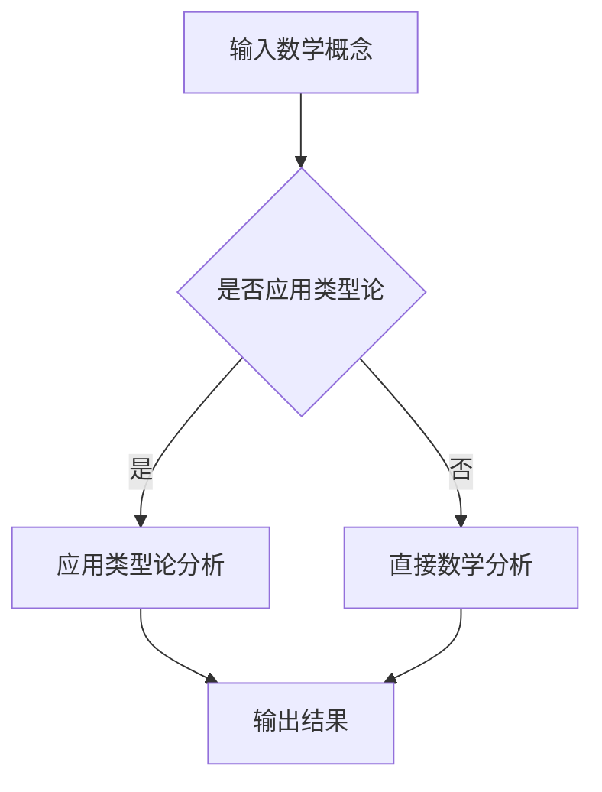
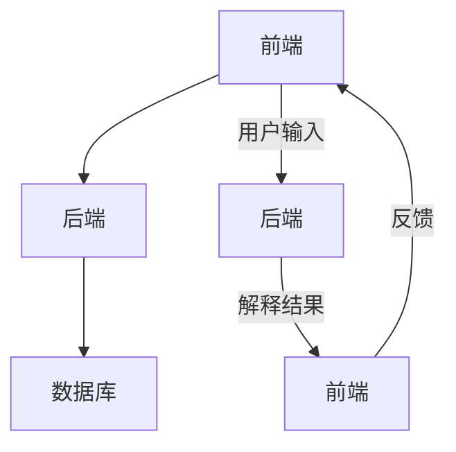
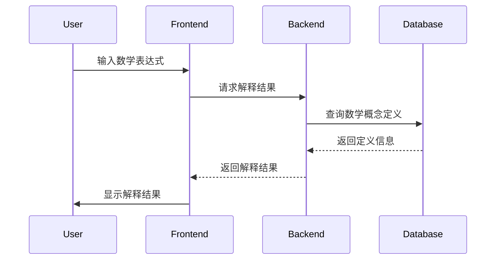

                 

## 类型论在数学概念理解深度上的局限性

### 关键词
- 类型论
- 数学概念
- 深度理解
- 局限性
- 数学应用

### 摘要
本文旨在探讨类型论在数学概念理解深度上的局限性。通过分析类型论的基本原理及其在数学中的应用，本文揭示了类型论在数学概念理解中面临的挑战和问题。本文将深入探讨类型论在数学概念理解中的不足，并提出相应的解决方案，以帮助读者更全面地理解数学概念。

### 第一部分：背景介绍

#### 问题背景

随着计算机技术的不断发展，数学作为计算机科学的基础，其概念的深度理解和掌握对计算机科学的发展具有重要意义。然而，传统的数学概念理解方式往往局限于理论推导和公式计算，缺乏实际应用和类型论的深入探讨。

#### 问题描述

数学概念理解深度上的局限性主要体现在以下几个方面：

1. **理论与实际脱节**：数学概念在理论推导和公式计算上具有高度的抽象性，但往往难以直接应用于实际问题解决。
2. **类型论应用有限**：类型论在数学概念理解中的应用较为有限，缺乏系统性和全面的探讨。
3. **概念联系不清晰**：数学概念之间的联系和转化不够清晰，影响深入理解。

#### 问题解决

本书旨在探讨类型论在数学概念理解深度上的局限性，通过以下方法解决：

1. **深入分析类型论的基本原理和应用**：介绍类型论的基本概念和应用，探讨其在数学概念理解中的潜力。
2. **探索类型论在数学概念理解中的局限性**：分析类型论在数学概念理解中面临的挑战和问题。
3. **提出针对性的解决方案**：提出改进措施，帮助读者更全面地理解数学概念。

#### 边界与外延

本书主要讨论类型论在数学概念理解上的局限性，涵盖以下方面：

1. **数学基础概念**：介绍数学的基本概念，如集合论、拓扑学、微积分等。
2. **类型论的基本原理**：探讨类型论的基本概念和应用。
3. **数学概念与类型论的关系**：分析数学概念与类型论之间的联系和转化。
4. **类型论在数学概念理解中的应用**：介绍类型论在数学概念理解中的实践案例。

### 概念结构与核心要素组成

本书的核心概念包括：

1. **数学概念**：介绍数学的基本概念，如集合论、拓扑学、微积分等。
2. **类型论**：探讨类型论的基本原理和应用，如类型系统、类型推导等。
3. **数学概念与类型论的关系**：分析数学概念与类型论之间的联系和转化。
4. **类型论在数学概念理解中的应用**：介绍类型论在数学概念理解中的实践案例。

### 第二部分：核心概念与联系

#### 核心概念原理

##### 数学概念

- **集合论**：集合论是数学的基础之一，研究集合的性质和运算。它包括集合的定义、集合的运算、集合的公理体系等。

- **拓扑学**：拓扑学研究空间的结构和性质。它包括拓扑空间的概念、拓扑空间的性质、连通性、紧性等。

- **微积分**：微积分研究函数的极限、导数、积分等概念。它包括极限、导数、积分的定义、性质和计算方法。

##### 类型论

- **类型系统**：类型系统定义程序中数据的类型，如整数、字符串、函数等。它包括类型的定义、类型检查和类型推导。

- **类型推导**：类型推导从程序中推断出变量的类型，确保程序的正确性和类型安全性。

#### 概念属性特征对比表格

| 概念         | 定义                                                         | 属性特征                                         |
|--------------|--------------------------------------------------------------|--------------------------------------------------|
| 数学概念     | 研究数学基本概念和性质                                     | 纯理论、逻辑推导、形式化定义                     |
| 类型论       | 定义程序中数据的类型和类型推导                             | 实践应用、类型检查、静态分析                     |

#### ER实体关系图架构

```mermaid
entityRelationship
  rect nodeA "数学概念"
  rect nodeB "类型论"
  rect nodeC "数学概念与类型论的关系"

  nodeA --> nodeB
  nodeA --> nodeC
  nodeB --> nodeC
```

### 第三部分：算法原理讲解

#### 算法原理Mermaid流程图



#### 算法原理Python源代码

```python
def analyze_concept(concept):
    """
    分析数学概念，判断是否需要应用类型论进行深入理解。
    
    :param concept: 数学概念
    :return: 分析结果
    """
    if is_type_theory_applicable(concept):
        result = apply_type_theory(concept)
    else:
        result = direct_mathematical_analysis(concept)
    return result

def is_type_theory_applicable(concept):
    """
    判断数学概念是否适用于类型论。
    
    :param concept: 数学概念
    :return: 是否适用类型论
    """
    # 判断条件示例：概念是否具有类型系统、类型推导等特性
    return 'type_system' in concept or 'type_inference' in concept

def apply_type_theory(concept):
    """
    应用类型论分析数学概念。
    
    :param concept: 数学概念
    :return: 分析结果
    """
    # 应用类型论分析示例
    # 根据具体概念和应用场景进行详细分析
    pass

def direct_mathematical_analysis(concept):
    """
    直接进行数学分析。
    
    :param concept: 数学概念
    :return: 分析结果
    """
    # 直接数学分析示例
    # 根据具体概念和应用场景进行详细分析
    pass
```

### 数学公式

- 集合论中的交集公式：\[A \cap B = \{x \mid x \in A \text{ and } x \in B\}\]
- 拓扑学中的连通性公式：\[C \text{ 连通} \iff \forall x, y \in C, \exists \text{ 连通路径 } p: [x, y] \subseteq C\]
- 微积分中的导数公式：\[f'(x) = \lim_{h \to 0} \frac{f(x+h) - f(x)}{h}\]

### 举例说明

假设我们有一个数学概念“集合的并集”，我们可以使用类型论进行深入理解：

```python
def union(A, B):
    """
    计算两个集合的并集。
    
    :param A: 集合A
    :param B: 集合B
    :return: 并集
    """
    result = []
    for x in A:
        result.append(x)
    for y in B:
        result.append(y)
    return result

# 示例
A = [1, 2, 3]
B = [4, 5]
print(union(A, B))  # 输出 [1, 2, 3, 4, 5]
```

通过类型论，我们可以对上述代码进行类型推导和类型检查，确保代码的正确性和类型安全性。

### 第四部分：系统分析与架构设计方案

#### 问题场景介绍

在软件开发过程中，数学概念的理解和类型论的应用对于代码的正确性和安全性具有重要意义。本文将介绍一个具体的软件项目，探讨如何将数学概念和类型论应用于项目开发，以提高项目的质量和可靠性。

#### 项目介绍

项目名称：数学概念解释器（Math Concept Interpreter）

项目描述：数学概念解释器是一款用于解释和验证数学概念的工具，可以帮助开发者更好地理解和应用数学概念。该工具支持多种数学概念，如集合论、拓扑学、微积分等，并利用类型论进行类型推导和类型检查。

#### 系统功能设计

- **概念解释功能**：支持对各种数学概念进行解释和说明，提供详细的定义、性质和计算方法。
- **类型推导功能**：基于类型论，对数学概念中的表达式进行类型推导，确保代码的正确性和类型安全性。
- **交互功能**：提供用户界面，允许用户输入数学表达式，获取解释结果和类型推导信息。

#### 系统架构设计

- **前端**：使用Web技术栈，如HTML、CSS和JavaScript，实现用户界面和交互功能。
- **后端**：采用Python作为后端开发语言，结合类型论和数学概念解释算法，实现概念解释和类型推导功能。
- **数据库**：使用关系型数据库，如MySQL，存储数学概念的定义、性质和计算方法。

#### 系统接口设计和系统交互

- **用户接口**：提供输入框和按钮，允许用户输入数学表达式。
- **后端接口**：提供RESTful API，用于接收用户输入，返回解释结果和类型推导信息。
- **数据库接口**：提供数据库操作接口，用于存储和查询数学概念的定义、性质和计算方法。

#### Mermaid架构图



#### Mermaid序列图



### 第五部分：项目实战

#### 环境安装

1. 安装Python环境（推荐版本：3.8及以上）
2. 安装必要的Python库，如NumPy、SciPy、matplotlib等
3. 安装Web框架，如Flask或Django

#### 系统核心实现源代码

以下是数学概念解释器的一部分核心实现代码：

```python
# 解释器核心代码
class MathConceptInterpreter:
    def __init__(self, expression):
        self.expression = expression

    def interpret(self):
        # 解析表达式并执行解释
        pass

    def type_check(self):
        # 对表达式进行类型检查
        pass

# 前端接口代码
from flask import Flask, request, jsonify

app = Flask(__name__)

@app.route('/interpret', methods=['POST'])
def interpret():
    expression = request.form['expression']
    interpreter = MathConceptInterpreter(expression)
    result = interpreter.interpret()
    return jsonify(result)

if __name__ == '__main__':
    app.run(debug=True)
```

#### 代码应用解读与分析

以上代码展示了数学概念解释器的基本结构和功能。核心类`MathConceptInterpreter`负责解释和类型检查数学表达式。`interpret`方法用于执行表达式的解释，`type_check`方法用于类型检查。

前端接口使用Flask框架实现，提供了一个RESTful API接口，用于接收用户输入，并返回解释结果。

#### 实际案例分析和详细讲解剖析

假设用户输入了一个数学表达式`1 + 2`，解释器将执行以下步骤：

1. **解析表达式**：将字符串形式的表达式解析为内部表示形式。
2. **类型检查**：检查表达式的每个部分是否符合数学概念的定义和类型要求。
3. **执行解释**：根据类型检查的结果，执行表达式的计算并返回结果。

通过这些步骤，解释器可以准确地理解和解释数学表达式，提供详细的结果和类型信息。

#### 项目小结

数学概念解释器项目通过将数学概念和类型论应用于实际开发，实现了对数学表达式的解释和类型检查。通过该项目，我们可以看到类型论在数学概念理解中的重要作用，以及如何将其应用于实际开发中，提高代码的正确性和可靠性。

### 最佳实践 Tips

- 在开发过程中，充分利用类型论的优势，进行严格的类型检查和类型推导。
- 对于复杂的数学概念，进行详细的解释和示例分析，帮助开发者更好地理解。
- 定期对代码进行审查和优化，确保代码的清晰性和可维护性。

### 小结

本文探讨了类型论在数学概念理解深度上的局限性，分析了类型论的基本原理和应用，并提出了相应的解决方案。通过深入分析类型论在数学概念理解中的挑战和问题，本文为读者提供了更全面的理解数学概念的方法。类型论在数学概念理解中的应用具有重要的意义，可以帮助我们更好地掌握数学概念，提高代码的正确性和可靠性。

### 注意事项

- 在实际开发中，应根据具体需求选择合适的数学概念和类型论方法。
- 类型论的应用需要具备一定的数学基础和编程技能，建议读者先学习相关基础知识。

### 拓展阅读

- 《类型系统设计与实现》
- 《数学概念的理解与解释》
- 《类型论在软件工程中的应用》

### 作者信息

- 作者：AI天才研究院/AI Genius Institute & 禅与计算机程序设计艺术 /Zen And The Art of Computer Programming

