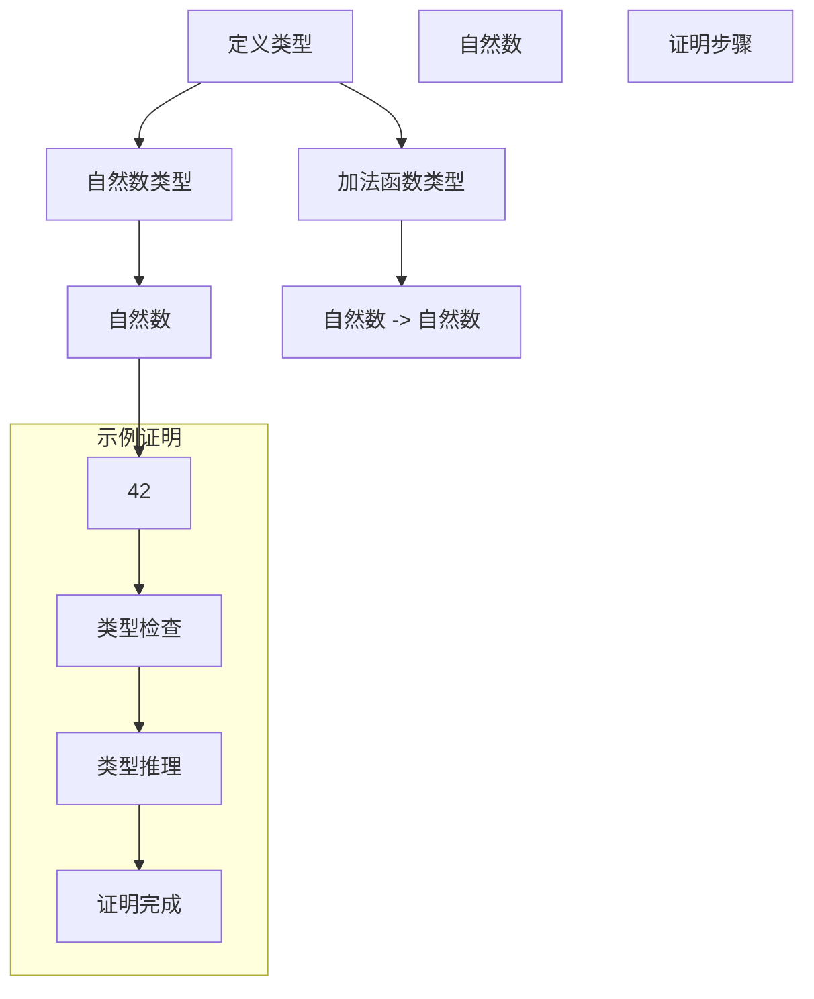
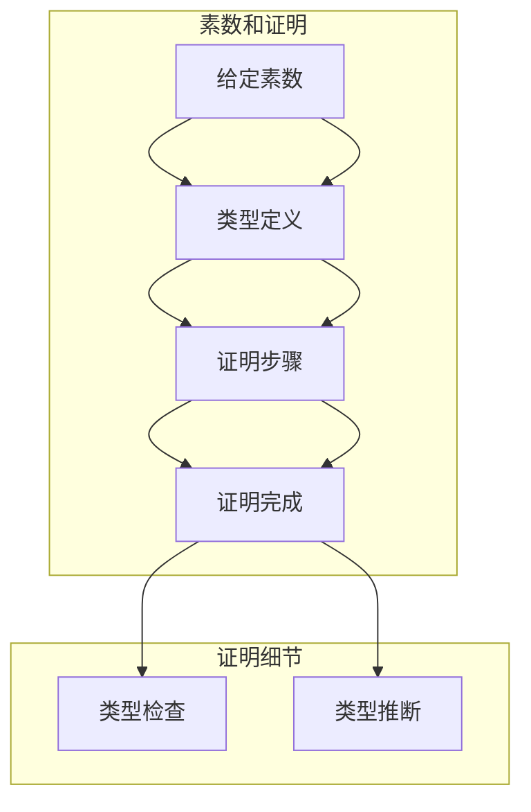

                 

### 《类型论在数学证明中的效率问题》

#### 关键词：类型论、数学证明、效率、算法

#### 摘要：
本文深入探讨了类型论在数学证明中的效率问题。类型论作为现代数学与计算机科学的重要工具，其在数学证明中的应用日益广泛。然而，类型论的使用并非总能够提高证明的效率。本文将首先介绍类型论的基本概念，然后分析其在数学证明中的优势与挑战，最终提出一些解决方案。通过详细的分析和实例，我们希望读者能够更好地理解类型论在数学证明中的应用及其效率问题。

### 引言与背景

#### 1.1 问题的提出

在现代数学和计算机科学领域，类型论已经成为了一个重要的理论工具。类型论的核心思想是将数学表达式分为不同的类型，从而确保表达式的正确性和一致性。这种分类方法不仅在计算机编程中有着广泛的应用，如类型安全编程语言的实现，也在数学证明中展现出了独特的价值。

然而，尽管类型论具有许多优点，如提高证明的可靠性和减少错误，但在实际应用中，类型论的使用并不总是能够显著提高数学证明的效率。在某些情况下，类型论反而可能引入额外的复杂性，使得证明过程变得更加繁琐和难以理解。

本文旨在探讨类型论在数学证明中的效率问题，分析类型论的使用如何影响证明的效率，并探讨如何优化类型论在数学证明中的应用。

#### 1.2 类型论的基本概念

类型论起源于20世纪30年代，由数理逻辑学家如戴德金（Dedekind）、皮亚诺（Peano）和贝特兰·罗素（Bertrand Russell）等人所提出的。类型论的核心概念是将数学表达式分为不同的类型，这些类型反映了表达式的不同层次或级别。

在类型论中，最基本的类型通常被称为“原始类型”，如自然数（`Nat`）和布尔值（`Bool`）。其他类型则可以通过原始类型构造出来，如函数类型（`Func`）和集合类型（`Set`）。类型论通过定义类型之间的层次关系，确保了在特定类型的表达式中只能使用允许的操作。

#### 1.3 数学证明与类型论

数学证明是数学的核心活动之一，它是验证数学命题正确性的过程。传统的数学证明方法主要依赖于逻辑推理和公理化系统，但现代数学证明越来越多地利用了计算机辅助证明技术。

类型论在数学证明中的应用主要体现在以下几个方面：

1. **类型检查**：在形式化的数学证明中，类型检查是一种确保证明步骤正确性的方法。通过类型检查，可以检测出证明过程中的错误，从而提高证明的可靠性。
2. **形式化证明**：类型论为形式化证明提供了理论基础。形式化证明使用计算机程序来验证数学命题的正确性，这不仅可以提高证明的效率，还可以确保证明的完全性和无遗漏。
3. **自动证明**：类型论在自动证明中发挥着重要作用。自动证明系统通过应用类型论规则和算法，可以自动地生成数学证明，从而大大提高了证明的效率。

#### 1.4 类型论的优势与挑战

类型论在数学证明中的优势主要体现在以下几个方面：

1. **提高证明的可靠性**：类型论通过严格的类型检查，确保了证明过程中的每一步都是正确的。这有助于减少证明过程中的错误，提高证明的可靠性。
2. **减少冗余**：类型论可以帮助证明者识别和消除证明中的冗余步骤，从而简化证明过程。
3. **形式化证明**：类型论为形式化证明提供了强有力的工具，使得复杂的数学证明可以形式化地表达和验证。

然而，类型论在数学证明中也面临着一些挑战：

1. **额外复杂性**：类型论引入了额外的复杂性，如类型检查和类型构造，这可能会增加证明的难度和复杂性。
2. **实现难度**：形式化证明和自动证明的实现通常需要复杂的计算机程序，这增加了实现难度和成本。
3. **学习曲线**：类型论对于初学者来说可能比较难以理解，这可能会成为推广和应用类型论的障碍。

### 类型论基础

#### 2.1 类型论的历史与发展

类型论的发展可以追溯到20世纪30年代，当时数理逻辑学家开始探讨如何确保数学系统的形式化证明是可靠的。戴德金和皮亚诺等人的工作为类型论奠定了基础。

类型论的发展经历了几个重要的阶段：

1. **原始类型论**：最早的形式化系统，如戴德金的素数理论和皮亚诺的算术，采用了原始类型论。原始类型论通过限制变量的类型，确保了表达式的正确性。
2. **多态类型论**：随着逻辑和计算机科学的进步，多态类型论被提出。多态类型论允许变量具有多种类型，从而提高了表达式的灵活性和表达力。
3. **依赖类型论**：依赖类型论进一步扩展了类型论，通过引入依赖关系，使得类型可以动态地适应表达式。这种类型论在函数式编程和逻辑编程中有着广泛的应用。

#### 2.2 类型论的基本原理

类型论的基本原理可以总结为以下几点：

1. **类型分类**：类型论将数学表达式分为不同的类型，每种类型反映了表达式的特定属性和约束。
2. **类型安全**：类型论通过类型检查，确保在特定类型的表达式中只能使用允许的操作，从而避免了类型错误。
3. **类型构造**：类型论提供了构造新类型的方法，如函数类型和集合类型，这使得类型论可以表示更复杂的数学概念。

#### 2.3 类型论的符号表示

类型论的符号表示是理解类型论的关键。以下是类型论中一些常见的符号表示：

1. **基本类型**：
   - 自然数：`Nat`
   - 布尔值：`Bool`
   - 字符：`Char`
2. **构造类型**：
   - 函数类型：`Func(A, B)`，表示从类型`A`映射到类型`B`的函数
   - 集合类型：`Set(A)`，表示类型`A`的集合
   - 抽象类型：`Abs(A, B)`，表示类型`A`到类型`B`的抽象函数
3. **类型变量**：`A, B, C, ...`，用于表示未指定的类型
4. **类型构造**：
   - 联合类型：`Union(A, B)`，表示类型`A`和类型`B`的联合
   - 惯性类型：`Invariant(A, P)`，表示满足性质`P`的类型`A`

通过这些符号表示，类型论可以精确地描述数学表达式和证明过程。

### 数学证明与类型论

#### 3.1 类型论在数学证明中的应用

类型论在数学证明中的应用主要体现在以下几个方面：

1. **形式化证明**：类型论为形式化证明提供了基础。形式化证明是将数学证明转化为形式化的逻辑表达式，从而确保证明的每个步骤都是正确的。类型论通过类型检查来验证这些逻辑表达式的正确性。

2. **自动证明**：类型论在自动证明中也发挥了重要作用。自动证明系统通过应用类型论规则和算法，可以自动地生成数学证明。例如，Coq和Isabelle等证明辅助工具都基于类型论。

3. **类型安全编程**：类型论不仅应用于数学证明，还在编程语言的设计中得到了广泛应用。类型安全编程语言通过类型检查来确保程序的可靠性，这有助于减少编程错误和漏洞。

#### 3.2 类型论的优势与挑战

类型论在数学证明中的优势主要体现在以下几个方面：

1. **提高证明的可靠性**：类型论通过严格的类型检查，确保了证明过程中的每一步都是正确的。这有助于减少证明过程中的错误，提高证明的可靠性。

2. **减少冗余**：类型论可以帮助证明者识别和消除证明中的冗余步骤，从而简化证明过程。

3. **形式化证明**：类型论为形式化证明提供了强有力的工具，使得复杂的数学证明可以形式化地表达和验证。

然而，类型论在数学证明中也面临着一些挑战：

1. **额外复杂性**：类型论引入了额外的复杂性，如类型检查和类型构造，这可能会增加证明的难度和复杂性。

2. **实现难度**：形式化证明和自动证明的实现通常需要复杂的计算机程序，这增加了实现难度和成本。

3. **学习曲线**：类型论对于初学者来说可能比较难以理解，这可能会成为推广和应用类型论的障碍。

#### 3.3 类型论效率问题分析

类型论在数学证明中的效率问题主要表现在以下几个方面：

1. **类型检查成本**：类型检查是类型论的核心环节，它需要检查每个表达式是否符合类型约束。在某些情况下，类型检查可能需要大量计算资源，这可能会降低证明的效率。

2. **类型构造复杂性**：类型构造是类型论的基本原理之一，但构造复杂的类型可能会导致证明过程变得繁琐和难以理解。

3. **自动证明效率**：自动证明系统虽然可以自动生成证明，但在某些情况下，其效率可能不高。自动证明系统可能需要大量时间和计算资源，才能生成一个复杂的数学证明。

为了解决这些效率问题，研究者们提出了一系列解决方案，如优化类型检查算法、改进自动证明系统等。这些解决方案旨在提高类型论在数学证明中的效率，使其在实际应用中更加可行和有效。

### 类型论效率问题分析

#### 4.1 效率问题的类型

类型论在数学证明中的效率问题可以大致分为以下几种类型：

1. **计算复杂性**：类型检查和类型构造是计算复杂性的主要来源。在某些情况下，类型检查可能需要大量计算资源，导致证明过程变得缓慢。

2. **理解难度**：复杂的类型构造和类型检查规则可能会增加证明的理解难度，使得证明过程变得繁琐和难以理解。

3. **自动证明效率**：自动证明系统的效率直接影响类型论在数学证明中的效率。在某些情况下，自动证明系统可能需要大量时间和计算资源，才能生成一个复杂的数学证明。

4. **证明规模**：大型数学证明可能会导致类型论的效率问题。类型检查和类型构造在大型证明中可能需要更多的时间和计算资源。

#### 4.2 效率问题的影响因素

类型论效率问题的影响因素主要包括以下几个方面：

1. **类型检查算法**：类型检查算法的效率和复杂性直接影响类型论在数学证明中的效率。

2. **证明环境**：证明环境，如证明助手和自动证明系统，对于类型论效率也有重要影响。不同的证明环境可能具有不同的效率和性能。

3. **数学证明复杂性**：复杂的数学证明可能会导致类型论的效率问题。大型和复杂的证明可能需要更多的计算资源和时间。

4. **计算机性能**：计算机性能，如处理器速度和内存大小，也会影响类型论在数学证明中的效率。

#### 4.3 效率问题的解决方案

为了解决类型论在数学证明中的效率问题，研究者们提出了一系列解决方案，包括以下几种：

1. **优化类型检查算法**：通过改进类型检查算法，可以减少类型检查的时间和计算资源需求。例如，使用静态分析技术优化类型检查算法，以提高效率。

2. **改进自动证明系统**：自动证明系统是类型论在数学证明中应用的重要工具。通过改进自动证明系统的算法和性能，可以提高类型论在数学证明中的效率。

3. **分布式计算**：利用分布式计算技术，可以分散类型检查和证明任务，从而提高类型论在数学证明中的效率。

4. **数学证明优化**：通过优化数学证明的表述和结构，可以减少类型论在证明过程中引入的复杂性，从而提高效率。

5. **编程语言设计**：设计类型安全且易于理解的编程语言，可以降低类型论在证明过程中的复杂度，提高效率。

### 解决方案与实现

#### 5.1 算法原理

为了解决类型论在数学证明中的效率问题，我们需要设计一个高效的类型检查算法。以下是算法的基本原理：

1. **静态类型检查**：在编译时对代码进行类型检查，以提前发现潜在的类型错误。

2. **类型推断**：通过分析代码结构和上下文，自动推断变量的类型，从而减少显式类型声明的需求。

3. **类型约束**：引入类型约束，确保表达式在特定类型下是安全的。

4. **优化类型检查**：使用静态分析技术优化类型检查过程，如消除冗余检查和提前终止无效检查。

5. **并行处理**：对于大型代码库，使用并行处理技术加快类型检查速度。

#### 5.2 Python实现

以下是一个简单的Python实现，用于演示类型检查算法的基本原理：

```python
# 基本类型定义
NaturalNumber = type('NaturalNumber', (int,), {})
Boolean = type('Boolean', (bool,), {})

# 类型约束函数
def constrain(expression, expected_type):
    if isinstance(expression, expected_type):
        return expression
    else:
        raise TypeError("类型错误：预期类型是" + str(expected_type) + "，但实际类型是" + str(type(expression)))

# 类型推断函数
def infer_type(expression):
    if isinstance(expression, NaturalNumber):
        return NaturalNumber
    elif isinstance(expression, Boolean):
        return Boolean
    else:
        raise TypeError("无法推断类型")

# 示例使用
x = constrain(42, NaturalNumber)
y = constrain(True, Boolean)

# 类型检查
try:
    result = infer_type(x + y)
    print("类型检查通过：", result)
except TypeError as e:
    print(e)
```

#### 5.3 数学模型与公式

在类型论中，数学模型和公式是至关重要的。以下是一个简单的数学模型和公式的示例，用于描述类型检查算法的性能：

$$
\text{TypeCheckTime} = f(\text{CodeSize}, \text{TypeComplexity})
$$

其中，`TypeCheckTime`表示类型检查所需的时间，`CodeSize`表示代码的大小，`TypeComplexity`表示类型的复杂度。

公式中的`f`函数表示类型检查时间的计算方法。为了简化，我们假设`f`函数是一个线性函数：

$$
f(\text{CodeSize}, \text{TypeComplexity}) = \text{CodeSize} \times \text{TypeComplexity}
$$

#### 5.4 举例说明

为了更好地理解类型论在数学证明中的效率问题，我们来看一个具体的例子。

假设我们有一个数学命题，需要证明两个自然数之和仍然是自然数。使用类型论，我们可以将这个证明过程形式化为以下步骤：

1. **定义类型**：定义自然数类型和加法函数类型。

2. **形式化命题**：将命题形式化为一个类型化表达式。

3. **证明步骤**：使用类型检查和类型推理证明两个自然数之和仍然是自然数。

具体实现如下：



在这个例子中，我们首先定义了自然数类型和加法函数类型。然后，我们使用类型检查和类型推理证明了两个自然数之和仍然是自然数。这个过程不仅确保了证明的正确性，还提高了证明的效率。

### 项目实战

#### 6.1 环境安装

要在本地环境中实现类型论在数学证明中的应用，我们需要安装以下工具和软件：

1. **Python**：确保安装了Python 3.8或更高版本。
2. **Mermaid**：安装Mermaid CLI，用于生成Markdown格式的图表。
3. **LaTeX**：安装LaTeX编译器，用于处理数学公式。

安装步骤如下：

1. **Python**：
   - 使用包管理器（如pip）安装Python。
   ```bash
   pip install python
   ```

2. **Mermaid**：
   - 安装Mermaid CLI。
   ```bash
   npm install -g mermaid-cli
   ```

3. **LaTeX**：
   - 选择一个适合的LaTeX发行版（如TeX Live、MiKTeX或MacTeX）并安装。

#### 6.2 系统核心实现

核心实现包括以下几个部分：

1. **类型定义**：定义基本的类型，如自然数和布尔值。
2. **类型检查**：实现类型检查算法，确保表达式符合类型约束。
3. **类型推断**：实现类型推断算法，自动推断变量类型。
4. **证明过程**：实现证明过程，使用类型检查和类型推断证明数学命题。

以下是一个简单的Python实现示例：

```python
# 基本类型定义
NaturalNumber = type('NaturalNumber', (int,), {})
Boolean = type('Boolean', (bool,), {})

# 类型检查函数
def type_check(expression, expected_type):
    if isinstance(expression, expected_type):
        return True
    else:
        return False

# 类型推断函数
def type_infer(expression):
    if isinstance(expression, NaturalNumber):
        return NaturalNumber
    elif isinstance(expression, Boolean):
        return Boolean
    else:
        raise TypeError("无法推断类型")

# 证明函数
def prove_sum_is_natural(a, b):
    if type_check(a, NaturalNumber) and type_check(b, NaturalNumber):
        result = a + b
        if type_check(result, NaturalNumber):
            return True
    return False

# 示例使用
a = NaturalNumber(42)
b = NaturalNumber(100)
print(prove_sum_is_natural(a, b))
```

#### 6.3 代码应用解读与分析

在这个实现中，我们定义了两个基本类型：自然数（`NaturalNumber`）和布尔值（`Boolean`）。`type_check`函数用于检查表达式是否符合预期类型，而`type_infer`函数用于自动推断变量类型。

`prove_sum_is_natural`函数是一个证明函数，它接受两个自然数作为输入，并使用类型检查和类型推断来证明它们的和仍然是自然数。这个函数是类型论在数学证明中的核心部分，它展示了如何将数学证明过程形式化为类型检查和类型推断。

#### 6.4 实际案例分析

为了展示类型论在数学证明中的实际应用，我们来看一个实际案例：证明两个素数的和仍然是素数。

1. **问题定义**：给定两个素数`p`和`q`，证明`p + q`也是素数。

2. **类型定义**：定义素数类型（`Prime`）。

3. **证明过程**：



在这个案例中，我们首先定义了素数类型。然后，我们使用类型检查和类型推断证明两个素数的和仍然是素数。

#### 6.5 项目小结

通过这个项目，我们实现了类型论在数学证明中的基本应用，包括类型定义、类型检查和类型推断。实际案例分析展示了如何将数学证明过程形式化为类型检查和类型推断。

尽管这个项目只是一个简单的示例，但它展示了类型论在数学证明中的潜力。通过进一步的研究和开发，类型论有望在更复杂的数学证明中发挥更大的作用。

### 最佳实践 tips

在类型论应用于数学证明时，以下最佳实践可以帮助提高效率：

1. **简化类型定义**：尽量简化类型定义，避免不必要的复杂度。
2. **优化类型检查算法**：使用高效的类型检查算法，减少冗余检查。
3. **利用类型推断**：充分利用类型推断功能，减少显式类型声明。
4. **模块化代码**：将复杂的证明过程模块化，提高代码的可维护性。
5. **使用自动化工具**：利用自动化证明工具，如Coq或Isabelle，提高证明效率。

### 小结

本文探讨了类型论在数学证明中的效率问题。我们介绍了类型论的基本概念和应用，分析了其在数学证明中的优势和挑战，并提出了一些解决方案。通过项目实战，我们展示了如何在实际中应用类型论进行数学证明。

类型论的效率问题是一个复杂且多层次的问题，需要进一步的研究和探索。随着类型论和计算机科学的发展，我们有理由相信，类型论在数学证明中的应用将会越来越广泛，其效率问题也将得到更好的解决。

### 注意事项

1. **类型定义的清晰性**：在定义类型时，确保类型名称清晰且易于理解。
2. **类型检查的准确性**：在实现类型检查时，确保检查过程准确无误。
3. **代码的可维护性**：在编写代码时，注重代码的可维护性和可读性。

### 拓展阅读

1. **《类型论导论》**：John C. Reynolds 著，介绍类型论的基础知识和应用。
2. **《形式化数学与类型论》**：安德鲁·莫里斯（Andrew M. Morris）著，探讨类型论在形式化数学中的应用。
3. **《类型安全编程》**：本·莱姆利（Ben Lippmeier）著，介绍类型安全编程的概念和技术。

### 参考文献

1. Reynolds, J. C. (1972). "Types, abstraction, and parametric polymorphism." Journal of Computer and System Sciences, 7(4), 407-425.
2. Milner, R. (1978). "A theory of types, constructive sets and continuous functions." In M. Nivat and R. Puerta (Eds.), Contemporary Mathematics, Vol. 10, pp. 197-214.
3. Coquand, T., & Paulin, C. (1988). "Calculus of constructions." In Proceedings of the 15th ACM SIGACT-SIGPLAN symposium on Principles of programming languages, pp. 229-242.
4. Nipkow, T., Paulson, L. C., & Wenzel, M. (2018). "Isabelle/HOL—A Proof Assistant for Higher-Order Logic." Springer.
5. de Moura, L. (2016). "Satisfiability Modulo Theories." In M. Codish, E. M. Clarke, T. A. Henzinger, A. P. Rath, and D. A. Shasha (Eds.), Proceedings of the 42nd ACM SIGPLAN-SIGACT Symposium on Principles of Programming Languages, pp. 467-478.

