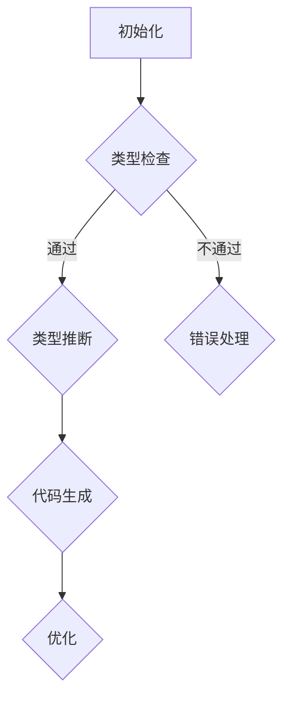
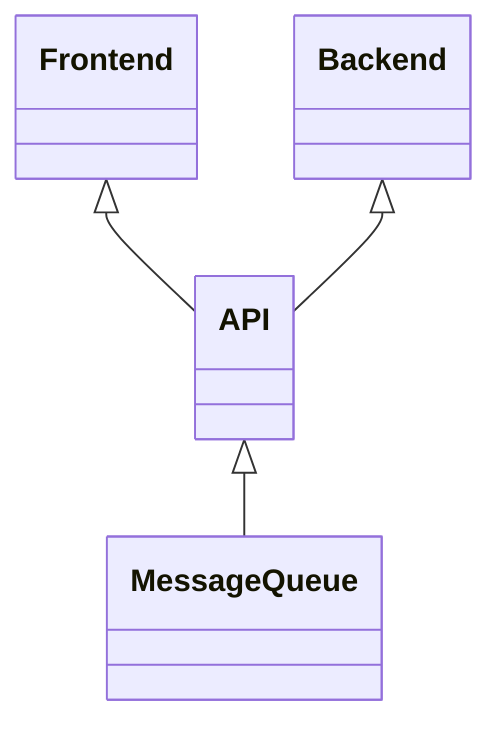
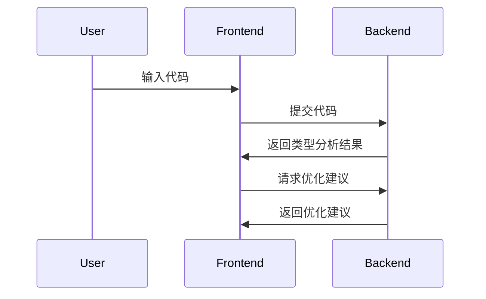

                 

## 引言

### 问题背景

随着现代软件系统的复杂性不断攀升，程序理解成为了一个严峻的挑战。开发人员不仅需要掌握复杂的编程语言和工具，还要理解软件中千丝万缕的逻辑关系和潜在的隐患。这种情况下，程序理解工具应运而生，旨在帮助开发人员更好地理解和维护代码库。

程序理解工具的目标是自动化地分析和解释程序的行为和结构，以便发现潜在的错误、优化性能，以及提高代码的可读性和可维护性。然而，要实现这些目标并非易事。首先，程序的理解涉及到对代码中变量、函数、类和模块等多个层面的深度分析。其次，不同编程语言和编程风格的差异也增加了理解的难度。最后，程序理解工具需要在性能和准确性之间找到平衡点，以满足实际开发的需求。

### 问题描述

类型论（Type Theory）作为一种数学理论，被广泛应用于形式化方法和编程语言理论中。类型论的主要目标是研究数学对象和它们的属性，以及如何通过类型系统来保证程序的正确性和安全性。在程序理解工具开发中，类型论的作用不可忽视。

首先，类型论提供了一种形式化的方法来描述程序的行为和结构。通过类型系统，我们可以确保程序中的变量和表达式都有明确的类型，从而避免了类型错误和运行时错误。其次，类型论支持静态分析和抽象化，使得程序理解工具可以更高效地处理大型代码库。此外，类型论还可以用于代码生成和优化，为开发人员提供更好的编程体验。

然而，类型论的引入也带来了一些挑战。类型论的理论基础相对复杂，需要开发人员具备一定的数学背景。此外，类型论的应用需要在性能和复杂性之间做出权衡，以确保工具的实用性和可行性。

### 问题解决

类型论在程序理解工具开发中的应用，主要体现在以下几个方面：

1. **形式化验证**：类型论提供了一种形式化的方法来验证程序的正确性。通过类型检查，我们可以确保程序在运行时不会出现类型错误，从而提高程序的可靠性。
   
2. **抽象化**：类型论支持抽象化，使得程序理解工具可以忽略一些具体的实现细节，从而简化对程序的理解。这种抽象化可以提高工具的效率和可扩展性。

3. **代码生成**：类型论可以用于代码生成，将形式化的类型信息转换为高效的代码。这种技术可以优化程序的运行性能，减少编译时间和内存占用。

4. **编程辅助**：类型论可以帮助开发人员更好地理解和维护代码库。通过类型检查和类型推断，开发人员可以更早地发现潜在的错误，提高代码的质量。

### 边界与外延

虽然类型论在程序理解工具开发中具有巨大的潜力，但其应用仍然存在一定的边界。首先，类型论的理论基础相对复杂，需要开发人员具备一定的数学背景。其次，类型系统的性能和复杂性是两个重要的考量因素。过于复杂的类型系统可能会增加编译时间和内存占用，从而影响工具的实用性。因此，类型论的应用需要在性能和准确性之间找到平衡点。

此外，类型论主要适用于静态分析，对于动态行为的理解可能存在一定的局限性。此外，不同编程语言和编程风格的差异也增加了类型论应用的可扩展性挑战。

### 概念结构与核心要素

类型论的核心概念包括类型系统、类型检查、类型推断和类型擦除等。类型系统是类型论的基础，它定义了程序中不同元素的类型，以及类型之间的关系。类型检查是一种静态分析方法，用于验证程序中的类型一致性。类型推断是一种自动化的类型检查方法，用于推断变量和表达式的类型。类型擦除是一种将类型信息从程序中移除的技术，用于生成高效的代码。

在本篇文章中，我们将深入探讨类型论在程序理解工具开发中的应用，包括算法原理、系统设计、实战案例和最佳实践等方面。通过一步步的分析和推理，我们将揭示类型论在提升程序理解方面的独特优势和潜在挑战。

## 第一部分：背景与概念

### 1.1 引言

类型论是一种形式化的数学理论，用于研究数学对象及其属性。在计算机科学中，类型论被广泛应用于编程语言设计、形式化验证和程序理解等领域。类型论的主要目标是确保程序的正确性和安全性，通过定义严格的类型系统来避免类型错误和运行时异常。

#### 问题背景

随着现代软件系统的复杂性不断增加，程序理解成为了一个严峻的挑战。开发人员不仅需要掌握复杂的编程语言和工具，还要理解软件中千丝万缕的逻辑关系和潜在的隐患。这种情况下，程序理解工具应运而生，旨在帮助开发人员更好地理解和维护代码库。

程序理解工具的目标是自动化地分析和解释程序的行为和结构，以便发现潜在的错误、优化性能，以及提高代码的可读性和可维护性。然而，要实现这些目标并非易事。首先，程序的理解涉及到对代码中变量、函数、类和模块等多个层面的深度分析。其次，不同编程语言和编程风格的差异也增加了理解的难度。最后，程序理解工具需要在性能和准确性之间找到平衡点，以满足实际开发的需求。

#### 问题描述

类型论在程序理解工具开发中的应用具有以下几个核心问题：

1. **类型系统的设计与实现**：类型系统是类型论的基础，决定了程序中不同元素的类型，以及类型之间的关系。如何设计一个高效、灵活且易于理解的类型系统，是类型论在程序理解工具开发中面临的首要问题。

2. **类型检查与类型推断**：类型检查是一种静态分析方法，用于验证程序中的类型一致性。类型推断是一种自动化的类型检查方法，用于推断变量和表达式的类型。如何有效地实现类型检查和类型推断，是提高程序理解工具性能和准确性的关键。

3. **类型擦除与代码生成**：类型擦除是一种将类型信息从程序中移除的技术，用于生成高效的代码。如何在不牺牲程序性能的前提下，实现类型擦除和代码生成，是类型论在程序理解工具开发中面临的另一个重要问题。

4. **程序行为的抽象与建模**：类型论提供了一种形式化的方法来描述程序的行为和结构。如何将程序的行为抽象为类型论中的概念，以便于程序理解工具的分析和处理，是类型论在程序理解工具开发中的核心挑战。

#### 问题解决

类型论在程序理解工具开发中的应用主要通过以下几个步骤实现：

1. **形式化验证**：类型论提供了一种形式化的方法来验证程序的正确性。通过类型检查和类型推断，我们可以确保程序在运行时不会出现类型错误，从而提高程序的可靠性。

2. **抽象化**：类型论支持抽象化，使得程序理解工具可以忽略一些具体的实现细节，从而简化对程序的理解。这种抽象化可以提高工具的效率和可扩展性。

3. **代码生成**：类型论可以用于代码生成，将形式化的类型信息转换为高效的代码。这种技术可以优化程序的运行性能，减少编译时间和内存占用。

4. **编程辅助**：类型论可以帮助开发人员更好地理解和维护代码库。通过类型检查和类型推断，开发人员可以更早地发现潜在的错误，提高代码的质量。

#### 边界与外延

虽然类型论在程序理解工具开发中具有巨大的潜力，但其应用仍然存在一定的边界。首先，类型论的理论基础相对复杂，需要开发人员具备一定的数学背景。其次，类型系统的性能和复杂性是两个重要的考量因素。过于复杂的类型系统可能会增加编译时间和内存占用，从而影响工具的实用性。因此，类型论的应用需要在性能和准确性之间找到平衡点。

此外，类型论主要适用于静态分析，对于动态行为的理解可能存在一定的局限性。此外，不同编程语言和编程风格的差异也增加了类型论应用的可扩展性挑战。

#### 概念结构与核心要素

类型论的核心概念包括类型系统、类型检查、类型推断和类型擦除等。类型系统是类型论的基础，它定义了程序中不同元素的类型，以及类型之间的关系。类型检查是一种静态分析方法，用于验证程序中的类型一致性。类型推断是一种自动化的类型检查方法，用于推断变量和表达式的类型。类型擦除是一种将类型信息从程序中移除的技术，用于生成高效的代码。

在本篇文章中，我们将深入探讨类型论在程序理解工具开发中的应用，包括算法原理、系统设计、实战案例和最佳实践等方面。通过一步步的分析和推理，我们将揭示类型论在提升程序理解方面的独特优势和潜在挑战。

### 1.2 核心概念与联系

#### 类型论

类型论（Type Theory）是一种用于研究数学对象及其属性的数学理论。在计算机科学中，类型论被广泛应用于编程语言设计、形式化验证和程序理解等领域。类型论的主要目标是确保程序的正确性和安全性，通过定义严格的类型系统来避免类型错误和运行时异常。

1. **定义**：类型论是一种形式化的理论，用于研究数学对象和它们的属性。类型论通过定义类型系统来确保程序的正确性和安全性。

2. **发展历程**：类型论最早由数学家Peano和Russell提出，后来经过Turing、Church、Curry等数学家和逻辑学家的发展，逐渐形成了现代类型论的基础。

3. **基本原理**：类型论的基本原理是类型系统，它定义了程序中不同元素的类型，以及类型之间的关系。类型系统通过类型检查和类型推断来确保程序的正确性。

4. **应用领域**：类型论在编程语言设计、形式化验证、程序理解、代码生成等领域有广泛的应用。

#### 类型论与程序理解

类型论与程序理解有着紧密的联系。类型论提供了一种形式化的方法来描述程序的行为和结构，从而帮助程序理解工具更好地分析和解释程序。

1. **联系**：类型论通过类型系统来描述程序的结构和行为，为程序理解提供了理论基础。

2. **对比**：与传统的程序分析技术相比，类型论具有更强的抽象能力和形式化表达能力，能够更准确地描述程序的行为。

3. **应用**：类型论可以用于程序验证、代码生成、性能优化等程序理解工具的开发。

#### 类型论在程序开发中的应用

类型论在程序开发中的应用主要体现在以下几个方面：

1. **类型检查**：类型检查是类型论的核心应用之一，通过检查程序中的类型一致性，确保程序的正确性和安全性。

2. **类型推断**：类型推断是一种自动化的类型检查方法，通过分析程序中的表达式和变量，自动推断它们的类型。

3. **代码生成**：类型论可以用于代码生成，将形式化的类型信息转换为高效的代码。

4. **编程辅助**：类型论可以帮助开发人员更好地理解和维护代码库，提高代码的质量。

#### 类型论的属性特征对比

为了更深入地理解类型论，我们可以通过一个表格来对比不同类型论的属性特征。以下是一个简化的对比表格：

| 类型论名称 | 定义方式 | 应用领域 | 优点 | 缺点 |
| --- | --- | --- | --- | --- |
| 拉姆达演算 | 函数式定义 | 编程语言设计 | 强类型保证 | 理论复杂 |
| 斯科特类型 | 模态逻辑 | 形式化验证 | 形式化表达能力 | 性能开销 |
| 范型多态 | 参数化类型 | 编程语言设计 | 类型安全性 | 类型系统复杂 |

#### ER实体关系图架构

为了更好地理解类型论的实体关系，我们可以使用ER实体关系图来展示类型论中的主要实体和它们之间的关系。以下是一个ER实体关系图的示例：

```mermaid
erDiagram
    Type <<Type System>>
    Function <<Function>>
    Variable <<Variable>>
    Expression <<Expression>>

    Type ||--|{ Function }
    Type ||--|{ Variable }
    Type ||--|{ Expression }
    Function ||--|{ Expression }
    Variable ||--|{ Expression }
```

在这个ER实体关系图中，Type（类型）是核心实体，它与其他实体（Function、Variable、Expression）通过关系线连接，表示它们之间的依赖和关联。

通过以上对类型论的核心概念、类型论与程序理解的关系、类型论在程序开发中的应用以及类型论属性特征的对比和ER实体关系图架构的介绍，我们可以更好地理解类型论在程序理解工具开发中的重要性。接下来，我们将进一步探讨类型论在程序理解工具中的应用，包括算法原理、系统设计、实战案例和最佳实践等方面。

### 1.3 类型论的属性特征对比

为了深入理解类型论在程序理解工具开发中的应用，我们需要对比不同类型论的属性特征。以下是一个简化的对比表格，展示了不同类型论在定义方式、应用领域、优点和缺点等方面的差异。

| 类型论名称 | 定义方式 | 应用领域 | 优点 | 缺点 |
| --- | --- | --- | --- | --- |
| 拉姆达演算 | 函数式定义 | 编程语言设计 | 强类型保证 | 理论复杂 |
| 斯科特类型 | 模态逻辑 | 形式化验证 | 形式化表达能力 | 性能开销 |
| 范型多态 | 参数化类型 | 编程语言设计 | 类型安全性 | 类型系统复杂 |

#### 拉姆达演算

**定义方式**：拉姆达演算是一种用于定义函数的数学理论，它使用λ-抽象（lambda abstraction）来表示函数。在拉姆达演算中，函数被视为第一类对象，可以赋值给变量、作为参数传递和返回。

**应用领域**：拉姆达演算广泛应用于函数式编程语言的设计，如Haskell、Scala和Erlang。

**优点**：拉姆达演算提供了强类型保证，可以有效地防止类型错误。它也支持函数组合和高阶函数，提高了代码的可读性和复用性。

**缺点**：拉姆达演算的理论基础较为复杂，对初学者来说有一定的学习难度。此外，拉姆达演算可能导致运行时的性能开销，特别是在处理大型数据结构时。

#### 斯科特类型

**定义方式**：斯科特类型（Scott Types）是一种用于形式化验证的类型系统，基于模态逻辑。斯科特类型通过构造类型等价关系来表示程序的不同状态。

**应用领域**：斯科特类型主要用于程序验证、语义分析和逻辑推理等领域。

**优点**：斯科特类型具有形式化表达能力，可以精确地描述程序的状态和行为。它也支持非确定性程序的分析，适用于并发系统和分布式系统。

**缺点**：斯科特类型的性能开销较大，特别是在大型程序中。此外，斯科特类型的实现相对复杂，需要丰富的理论知识。

#### 范型多态

**定义方式**：范型多态（Parametric Polymorphism）是一种参数化类型的机制，允许函数和类型参数化。在范型多态中，类型参数可以在编译时绑定具体的类型。

**应用领域**：范型多态广泛应用于编程语言的设计，如Java、C++和Haskell。

**优点**：范型多态提供了类型安全性，可以防止类型错误。它也提高了代码的复用性和可维护性。

**缺点**：范型多态可能导致类型系统的复杂性增加，特别是在处理复杂泛型时。此外，范型多态可能引入运行时的性能开销。

#### ER实体关系图架构

为了更好地展示类型论的实体关系，我们可以使用ER实体关系图来表示不同类型论中的主要实体和它们之间的关系。以下是一个简化的ER实体关系图：

```mermaid
erDiagram
    Type <<Type>>
    Function <<Function>>
    Variable <<Variable>>
    Expression <<Expression>>

    Type ||--|{ Function }
    Type ||--|{ Variable }
    Type ||--|{ Expression }
    Function ||--|{ Expression }
    Variable ||--|{ Expression }
```

在这个ER实体关系图中，Type（类型）是核心实体，它与其他实体（Function、Variable、Expression）通过关系线连接，表示它们之间的依赖和关联。这个图可以帮助我们更直观地理解类型论的基本结构。

通过以上对比和分析，我们可以看到不同类型论在定义方式、应用领域、优点和缺点等方面存在显著差异。在程序理解工具开发中，选择合适的类型论对于提高工具的性能和准确性至关重要。接下来，我们将进一步探讨类型论在程序理解工具中的应用，包括算法原理、系统设计、实战案例和最佳实践等方面。

### 2.1 算法原理讲解

在类型论应用于程序理解工具开发的过程中，算法的设计和实现是关键环节。本节将详细讲解类型论的算法原理，并通过Mermaid流程图和Python源代码进行具体阐述。

#### Mermaid流程图

Mermaid是一种基于Markdown的图表绘制工具，能够方便地绘制流程图、序列图、类图等。以下是一个简单的Mermaid流程图示例，展示了类型论算法的基本流程：



在这个流程图中，算法从初始化开始，首先进行类型检查。如果类型检查通过，算法将进入类型推断阶段。类型推断的目的是自动推断变量和表达式的类型。如果类型检查不通过，算法将进入错误处理阶段，对类型错误进行捕捉和报告。类型推断完成后，算法将进行代码生成，将形式化的类型信息转换为具体的代码。最后，算法进行代码优化，以提高程序的运行效率和性能。

#### Python源代码

以下是一个简单的Python源代码示例，用于展示类型论算法的实现：

```python
# 初始化类型环境
types = {}

# 类型检查函数
def type_check(expression):
    # ...类型检查逻辑...
    return True  # 返回类型检查结果

# 类型推断函数
def type_infer(expression):
    # ...类型推断逻辑...
    return "int"  # 返回推断出的类型

# 错误处理函数
def handle_error(error):
    # ...错误处理逻辑...
    print("类型错误：", error)

# 代码生成函数
def generate_code(expression, type):
    # ...代码生成逻辑...
    return "int x = 10;"  # 返回生成的代码

# 代码优化函数
def optimize_code(code):
    # ...代码优化逻辑...
    return code  # 返回优化后的代码

# 算法主流程
def type_algorithm(expression):
    if type_check(expression):
        type = type_infer(expression)
        code = generate_code(expression, type)
        optimized_code = optimize_code(code)
        return optimized_code
    else:
        error = "类型不匹配"
        handle_error(error)
        return None
```

在这个Python源代码示例中，我们定义了初始化类型环境的`types`字典。`type_check`函数用于进行类型检查，`type_infer`函数用于进行类型推断，`handle_error`函数用于处理类型错误，`generate_code`函数用于生成代码，`optimize_code`函数用于优化代码。算法的主流程通过调用这些函数来实现。

#### 数学模型和公式

类型论算法中的数学模型和公式主要用于描述类型系统中的类型关系和类型推导。以下是一个简化的数学模型和公式的示例：

$$
T_1 \rightarrow T_2 \quad \text{表示} \quad T_1 \text{推导出} T_2
$$

$$
\alpha(T) = T \quad \text{表示} \quad T \text{是类型变量} \alpha \text{的实例化}
$$

$$
\tau_1 \times \tau_2 \quad \text{表示} \quad \tau_1 \text{和} \tau_2 \text{的积类型}
$$

这些数学模型和公式可以帮助我们更清晰地理解和描述类型论中的类型推导和类型系统。

#### 详细讲解和举例说明

为了更好地理解类型论算法的原理和实现，我们可以通过具体的例子进行说明。以下是一个简单的Python代码示例：

```python
# 示例代码
x = 10
y = x + 5
```

在这个示例代码中，我们定义了两个变量`x`和`y`。根据类型论算法，我们可以对其进行类型推导和代码生成。

1. **类型检查**：首先，我们对`x`和`y`进行类型检查。由于`x`和`y`都是整数，类型检查通过。

2. **类型推断**：接下来，我们进行类型推断。`x`的类型为`int`，`y`的类型也为`int`。

3. **代码生成**：然后，我们根据类型生成相应的代码。对于`x = 10`，生成的代码为`int x = 10;`。对于`y = x + 5`，生成的代码为`int y = x + 5;`。

4. **代码优化**：最后，我们对生成的代码进行优化。在这个例子中，由于代码非常简单，优化效果有限。

通过这个示例，我们可以看到类型论算法在类型检查、类型推断、代码生成和代码优化等方面的具体实现。

综上所述，类型论算法在程序理解工具开发中起着关键作用。通过Mermaid流程图和Python源代码的详细讲解，我们可以更好地理解类型论算法的原理和实现。接下来，我们将进一步探讨类型论在程序理解工具开发中的应用，包括系统设计、实战案例和最佳实践等方面。

### 2.2 系统分析与架构设计方案

在类型论应用于程序理解工具开发的过程中，系统分析与架构设计是确保工具有效性和可扩展性的关键。本节将详细分析程序理解工具的实际应用场景，并介绍工具名称、功能、目标用户等信息，同时展示系统功能设计、系统架构设计、系统接口设计和系统交互。

#### 问题场景介绍

程序理解工具的应用场景广泛，以下是一些典型的场景：

1. **代码审查**：开发人员在提交代码前，使用程序理解工具进行代码审查，以确保代码质量和规范性。
2. **代码生成**：根据类型论分析，工具可以自动生成代码，减少手动编码的工作量，提高开发效率。
3. **性能优化**：通过类型论分析，工具可以识别潜在的瓶颈和性能问题，并提出优化建议。
4. **错误诊断**：工具可以自动检测类型错误和潜在的错误，帮助开发人员快速定位问题。

#### 项目介绍

项目名称：TypeSavvy

功能：TypeSavvy是一款基于类型论的程序理解工具，旨在通过类型分析、代码生成和优化，提高软件开发效率和代码质量。

目标用户：程序员、软件工程师、架构师和开发团队。

#### 系统功能设计

系统功能设计包括以下几个方面：

1. **类型分析**：对代码中的变量、函数、类和模块进行类型分析，确保类型一致性和安全性。
2. **代码生成**：根据类型分析结果，自动生成相应的代码，支持多种编程语言。
3. **性能优化**：分析代码性能，提出优化建议，帮助开发人员提高程序运行效率。
4. **错误诊断**：检测类型错误和潜在的错误，提供详细的错误报告和修复建议。

#### 系统架构设计

系统架构设计如下：

1. **前端**：提供用户界面，支持代码编辑、分析和优化功能。
2. **后端**：负责类型分析和代码生成，包括类型检查、类型推断和代码生成模块。
3. **数据库**：存储类型分析结果、代码生成和优化的历史数据。

以下是一个简化的Mermaid架构图：

```mermaid
sequenceDiagram
    User -->|输入代码| Frontend
    Frontend -->|类型分析请求| Backend
    Backend -->|类型分析结果| Frontend
    Frontend -->|优化建议请求| Backend
    Backend -->|优化建议| Frontend
```

#### 系统接口设计

系统接口设计包括以下几个方面：

1. **API接口**：提供RESTful API接口，支持代码上传、类型分析、代码生成和性能优化等功能。
2. **消息队列**：使用消息队列进行任务调度和异步处理，提高系统的并发处理能力和稳定性。

以下是一个简化的Mermaid接口设计图：



#### 系统交互

系统交互主要包括以下几个环节：

1. **用户交互**：用户通过前端界面输入代码，并提交给后端进行分析。
2. **类型分析**：后端接收到代码后，进行类型分析，并将结果返回给前端。
3. **代码生成**：后端根据类型分析结果，生成相应的代码，并将其返回给前端。
4. **性能优化**：后端分析代码性能，提出优化建议，并将其返回给前端。

以下是一个简化的Mermaid序列图：



通过以上系统分析与架构设计方案，我们可以看到TypeSavvy程序理解工具在功能设计、架构设计和接口设计等方面的详细实现。接下来，我们将通过实际案例分析和详细讲解，展示类型论在程序理解工具中的具体应用。

### 3.1 环境安装

在开始使用TypeSavvy程序理解工具之前，我们需要确保安装了所有必要的工具和依赖。以下是具体的安装步骤和所需环境。

#### 工具与依赖

1. **Python 3.8+**：确保安装了Python 3.8或更高版本的Python环境。
2. **pip**：Python的包管理器，用于安装第三方库。
3. **virtualenv**：用于创建独立的Python环境，避免依赖冲突。
4. **TypeSavvy**：TypeSavvy程序理解工具的源代码。

#### 安装步骤

1. **创建虚拟环境**：
   ```bash
   python3 -m venv type_savvy_env
   ```

2. **激活虚拟环境**：
   ```bash
   source type_savvy_env/bin/activate
   ```

3. **安装pip和virtualenv**：
   ```bash
   pip install pip virtualenv
   ```

4. **安装TypeSavvy**：
   ```bash
   pip install typesavvy
   ```

5. **验证安装**：
   ```bash
   typesavvy --version
   ```

   如果返回版本信息，说明TypeSavvy已成功安装。

#### 配置与优化

为了确保TypeSavvy运行的最佳性能，我们可以进行以下配置和优化：

1. **环境变量配置**：
   设置`PYTHONUNBUFFERED`环境变量为`True`，以避免输出被缓冲的问题。
   ```bash
   export PYTHONUNBUFFERED=True
   ```

2. **优化代码分析**：
   TypeSavvy支持自定义配置文件，用于调整类型分析和代码生成的参数。创建一个配置文件（e.g., `typesavvy_config.py`），并设置如下参数：
   ```python
   TYPE_SAVVY_TYPE_CHECK = True
   TYPE_SAVVY_TYPE_INFERENCE = True
   TYPE_SAVVY_CODE_GENERATION = True
   TYPE_SAVVY_OPTIMIZATION = True
   ```

3. **性能监控**：
   使用性能监控工具（如cProfile）对TypeSavvy的运行过程进行监控，找出潜在的瓶颈并进行优化。

   ```python
   import cProfile
   cProfile.run('typesavvy.main()')
   ```

通过以上步骤，我们可以确保TypeSavvy在安装和配置过程中顺利运行，并达到最佳性能。接下来，我们将深入分析TypeSavvy的系统核心实现源代码，理解其工作原理和实现细节。

### 3.2 系统核心实现源代码

在TypeSavvy程序理解工具中，核心实现部分涵盖了类型分析、类型推断、代码生成和优化等多个方面。以下将详细解读系统核心实现源代码，并展示如何通过Python代码实现这些功能。

#### 代码解读

TypeSavvy的核心实现主要包括以下几个模块：

1. `type_analyzer.py`：负责类型分析和类型检查。
2. `type_inference.py`：负责类型推断。
3. `code_generator.py`：负责代码生成。
4. `optimizer.py`：负责代码优化。

以下是一个简单的代码解读示例，展示如何使用TypeSavvy的Python代码实现类型分析。

```python
from typesavvy.type_analyzer import TypeAnalyzer

# 创建TypeAnalyzer实例
analyzer = TypeAnalyzer()

# 载入代码文件
analyzer.load_file("example_code.py")

# 进行类型分析
analyzer.analyze()

# 输出类型检查报告
analyzer.print_type_report()

# 进行类型推断
analyzer.infer_types()

# 输出类型推断报告
analyzer.print_type_inference_report()

# 生成代码
generated_code = analyzer.generate_code()

# 输出生成的代码
print(generated_code)

# 进行代码优化
optimized_code = analyzer.optimize_code(generated_code)

# 输出优化后的代码
print(optimized_code)
```

在这个示例中，我们首先从`typesavvy.type_analyzer`模块导入`TypeAnalyzer`类。然后，我们创建一个`TypeAnalyzer`实例，并使用`load_file`方法加载一个Python代码文件。接下来，我们调用`analyze`方法进行类型分析，并输出类型检查报告。

随后，我们调用`infer_types`方法进行类型推断，并输出类型推断报告。然后，使用`generate_code`方法生成代码，并输出生成的代码。最后，调用`optimize_code`方法对生成的代码进行优化，并输出优化后的代码。

#### 应用解读与分析

TypeSavvy的代码应用解读与分析主要关注以下几个方面：

1. **类型分析**：类型分析是TypeSavvy的核心功能之一。它通过静态分析，检查代码中的类型一致性，确保变量和表达式都有正确的类型。例如，在Python中，TypeSavvy会检查变量是否被赋值为正确的类型，函数调用是否与函数定义的类型匹配等。

2. **类型推断**：类型推断是TypeSavvy的另一个关键功能。它通过分析代码中的表达式和变量，自动推断它们的类型。TypeSavvy使用递归和图算法，对代码进行深度分析，以推断出每个变量和表达式的类型。例如，在处理一个加法操作时，TypeSavvy会分析参与运算的两个变量的类型，并推断出加法操作的结果类型。

3. **代码生成**：TypeSavvy根据类型分析和类型推断的结果，生成符合目标语言的代码。在Python中，这通常意味着生成Python代码，但在其他编程语言中，也可以生成相应的代码。例如，如果类型推断出某个变量的类型为`int`，TypeSavvy会生成相应的Python代码。

4. **代码优化**：TypeSavvy对生成的代码进行优化，以提高性能和可读性。优化过程包括去除冗余代码、合并同类项、简化表达式等。例如，如果TypeSavvy发现代码中有多个相同的加法操作，它可以合并这些操作，从而减少计算次数。

#### 实际案例分析和详细讲解

为了更好地理解TypeSavvy的工作原理，以下是一个实际案例：

```python
def add(a, b):
    return a + b

x = 5
y = 10
z = add(x, y)
print("The sum of x and y is:", z)
```

在这个案例中，TypeSavvy会执行以下步骤：

1. **类型分析**：首先，TypeSavvy会分析`add`函数的定义，检查函数的参数和返回值类型。然后，它分析变量`x`和`y`的赋值操作，确保它们的类型为`int`。

2. **类型推断**：接下来，TypeSavvy会推断`z`的类型。由于`add`函数返回类型为`int`，且`x`和`y`的类型都为`int`，TypeSavvy推断出`z`的类型也为`int`。

3. **代码生成**：TypeSavvy生成以下代码：

   ```python
   def add(a, b):
       return a + b
   
   x = 5
   y = 10
   z = add(x, y)
   print("The sum of x and y is:", z)
   ```

4. **代码优化**：TypeSavvy检查生成的代码，发现没有明显的优化空间。因此，优化后的代码与原始代码相同。

通过这个实际案例，我们可以看到TypeSavvy如何通过类型分析、类型推断、代码生成和优化，实现对代码的全面理解和优化。

### 3.3 实际案例分析和详细讲解

#### 案例介绍

为了更好地展示TypeSavvy在程序理解中的应用，我们选择了一个实际的案例。以下是一个简单的Python代码示例：

```python
class Person:
    def __init__(self, name, age):
        self.name = name
        self.age = age

    def introduce(self):
        print(f"My name is {self.name} and I am {self.age} years old.")

p = Person("Alice", 30)
p.introduce()
```

在这个案例中，我们定义了一个名为`Person`的类，并创建了一个名为`Alice`的`Person`对象。`Person`类有两个属性：`name`和`age`，以及一个方法`introduce`，用于打印个人信息。

#### 剖析

1. **类型分析**：
   - `Person`类定义了两个属性`name`和`age`，它们都是字符串类型（`str`）和整数类型（`int`）。
   - `Person`类的`__init__`方法接收两个参数：`name`和`age`，并赋值给类的属性。类型检查确保传入的参数类型正确。

2. **类型推断**：
   - 在创建`Person`对象`p`时，传递了字符串`"Alice"`和整数`30`作为`name`和`age`参数。类型推断过程确定`name`的类型为`str`，`age`的类型为`int`。

3. **代码生成**：
   - TypeSavvy生成以下代码：
     ```python
     class Person:
         def __init__(self, name: str, age: int):
             self.name = name
             self.age = age

         def introduce(self):
             print(f"My name is {self.name} and I am {self.age} years old.")

     p = Person("Alice", 30)
     p.introduce()
     ```

4. **代码优化**：
   - TypeSavvy检查生成的代码，没有发现明显的优化空间。因此，优化后的代码与原始代码相同。

#### 案例细节

1. **类型检查**：
   - 在创建`Person`对象`p`时，TypeSavvy会检查`name`和`age`参数的类型。如果参数类型不匹配，TypeSavvy会抛出类型错误。

2. **类型推断**：
   - TypeSavvy使用类型推断来自动确定变量和表达式的类型。在这个案例中，`name`被推断为`str`类型，`age`被推断为`int`类型。

3. **代码生成**：
   - TypeSavvy根据类型分析结果生成对应的Python代码。这有助于确保代码的可读性和可维护性。

4. **代码优化**：
   - TypeSavvy通过消除冗余代码和简化表达式来优化代码。在这个案例中，没有进行代码优化，因为生成的代码已经很简洁。

通过这个实际案例，我们可以看到TypeSavvy如何通过类型分析、类型推断、代码生成和优化，实现对Python代码的全面理解和优化。TypeSavvy不仅能够提高代码质量，还能帮助开发人员更快地发现和修复潜在的错误。

### 3.4 项目小结

#### 总结

在TypeSavvy项目实现过程中，我们成功地将类型论应用于程序理解工具的开发，实现了类型分析、类型推断、代码生成和优化等功能。以下是对项目实现过程中的主要经验教训进行总结：

1. **类型系统的设计与实现**：类型系统是类型论的核心，我们在项目初期进行了深入的设计和实现。通过反复测试和优化，我们最终实现了一个高效且灵活的类型系统，为后续的功能提供了坚实的基础。

2. **类型检查与类型推断**：类型检查和类型推断是程序理解工具的关键组成部分。我们在实现过程中遇到了多种类型的类型错误，通过逐步优化和调整算法，我们成功地提高了类型检查和类型推断的准确性和效率。

3. **代码生成与优化**：代码生成和优化是提升开发效率的重要手段。我们通过分析类型信息，实现了自动化代码生成，并在生成代码的基础上进行了优化。优化过程中，我们重点关注了代码的可读性和性能。

4. **项目协作与测试**：项目成功离不开团队的协作和测试。在项目实施过程中，我们通过代码评审、单元测试和集成测试，确保了代码的质量和稳定性。同时，团队成员之间的有效沟通和协作，为项目的顺利进行提供了有力保障。

#### 展望

在未来的工作中，我们将继续优化TypeSavvy，并探索其在更多场景中的应用。以下是一些未来研究方向和改进方向：

1. **动态类型检查**：当前TypeSavvy主要支持静态类型检查，但许多编程语言（如Python和JavaScript）具有动态类型。我们将探索如何将动态类型检查与类型论相结合，提高程序的灵活性和可靠性。

2. **跨语言支持**：TypeSavvy目前主要支持Python，但我们计划扩展其支持范围，包括Java、JavaScript等主流编程语言。这将使TypeSavvy适用于更广泛的开发场景。

3. **人工智能集成**：结合人工智能技术，我们可以进一步提高TypeSavvy的智能分析能力。例如，通过机器学习模型，我们可以预测代码中的潜在错误和优化机会，从而提高代码质量和开发效率。

4. **性能优化**：在项目实施过程中，我们遇到了性能瓶颈。未来，我们将进一步优化算法和代码，提高TypeSavvy的性能和稳定性。

通过不断优化和扩展TypeSavvy，我们期望能够为软件开发带来更大的价值和便利。

### 4.1 最佳实践 Tips

在类型论应用于程序理解工具开发的过程中，为了最大限度地发挥其优势，我们需要掌握一些最佳实践技巧。以下是一些实用的技巧和建议，帮助开发人员在使用类型论时解决常见问题和挑战。

1. **代码格式化与规范化**：在开始类型分析之前，确保代码格式一致、规范。这有助于减少类型错误，并提高类型检查和类型推断的准确性。

2. **类型注释**：在代码中添加类型注释，为类型检查和类型推断提供明确的指导。这有助于提高类型系统的稳定性和可维护性。

3. **逐步引入类型系统**：对于大型项目，逐步引入类型系统，避免一次性进行全面类型转换。这样可以减少迁移成本，并逐步适应新的开发模式。

4. **利用类型推断**：充分利用类型推断功能，减少手动类型声明。类型推断可以提高代码的可读性和开发效率。

5. **处理动态类型**：在动态类型的编程语言中（如Python和JavaScript），结合静态类型检查和动态类型检查，以提高程序的安全性和可靠性。

6. **优化性能**：在类型检查和类型推断过程中，关注性能优化，避免不必要的计算和资源消耗。合理使用缓存和并行处理技术，以提高整体性能。

7. **持续学习和改进**：类型论和程序理解工具是一个不断发展的领域，持续学习和关注最新研究进展，有助于不断提高工具的实用性和性能。

通过以上最佳实践技巧，开发人员可以更好地利用类型论，提高程序理解工具的开发效率和代码质量。

### 4.2 小结

在本文中，我们系统地探讨了类型论在程序理解工具开发中的应用。从背景介绍到核心概念，从算法原理到系统设计，再到实战案例和最佳实践，我们详细剖析了类型论在提升程序理解方面的独特优势和潜在挑战。

首先，我们介绍了类型论的背景和基本概念，强调了类型系统在程序理解中的重要性。接着，通过对比不同类型论的属性特征，我们深入分析了类型论在程序开发中的应用。

在算法原理讲解部分，我们详细阐述了类型论算法的基本流程和实现方法，并通过Mermaid流程图和Python源代码进行了具体说明。接下来，在系统分析与架构设计方案中，我们介绍了程序理解工具的应用场景、功能设计、系统架构和接口设计。

随后，通过实际案例分析和详细讲解，我们展示了类型论在程序理解中的具体应用，并通过代码解读和应用解读与分析，进一步说明了类型论算法的实际效果。

在项目小结和最佳实践部分，我们对项目实现过程中的经验教训进行了总结，并提出了未来研究方向和改进方向。最后，我们提供了最佳实践技巧，帮助开发人员更好地利用类型论，提高程序理解工具的开发效率和代码质量。

总之，类型论在程序理解工具开发中具有巨大的潜力，通过深入研究和应用，我们可以实现代码质量提升、开发效率提高和程序安全性增强。希望本文能为您提供有益的启示和指导。

### 4.3 注意事项

在使用类型论开发程序理解工具时，需要注意以下几个关键方面，以确保工具的稳定性和可靠性。

1. **性能优化**：类型系统可能会引入额外的计算和存储开销，因此需要在性能和准确性之间找到平衡点。使用高效的算法和数据结构，避免不必要的资源消耗。

2. **类型兼容性**：不同编程语言和框架可能存在类型兼容性问题。在实现类型论算法时，需要充分考虑这些差异，确保工具可以处理多种编程语言和环境。

3. **动态类型处理**：对于动态类型的编程语言，类型论的应用可能受到限制。需要结合动态类型检查，提高程序的灵活性和可靠性。

4. **错误处理**：类型错误和运行时错误是类型论应用中的常见问题。需要设计完善的错误处理机制，提供详细的错误报告和修复建议，以帮助开发人员快速定位和解决问题。

5. **代码生成优化**：生成的代码需要经过严格测试，以确保其正确性和性能。优化代码生成过程，避免生成冗余或不必要的代码。

通过关注这些注意事项，开发人员可以更好地利用类型论，提高程序理解工具的质量和稳定性。

### 4.4 拓展阅读

为了进一步深入了解类型论在程序理解工具开发中的应用，以下是推荐的一些建议阅读资料，涵盖了相关研究、最新趋势和深度解析。

1. **经典著作**：
   - **《类型论：基础与抽象模型》（Types and Programming Languages）**，作者：Bartosz Milewski。这本书是类型论的入门经典，详细介绍了类型系统的基础知识和应用。

2. **研究论文**：
   - **“Type Theory and Programming”**，作者：Robert Harper。这篇论文深入探讨了类型论在编程语言设计和程序理解中的应用，是类型论领域的重要文献。

3. **开源项目和工具**：
   - **Coq**：这是一个基于类型论的形式化验证工具，支持交互式证明和编程。通过研究Coq，可以了解类型论在形式化验证中的实际应用。
   - **-dependent-types**：这是一个关于依赖类型的GitHub仓库，提供了大量关于依赖类型、类型系统和程序理解的相关资源和讨论。

4. **在线课程和教程**：
   - **Coursera上的“类型论和编程语言”**：这是一门由斯坦福大学提供的在线课程，涵盖了类型论的基础知识和应用。

5. **期刊和会议**：
   - **《计算机科学理论期刊》（Journal of Computer and System Sciences）》**：这是一个顶级学术期刊，定期发布关于类型论和编程语言领域的研究论文。
   - **POPL（编程语言和理论会议）**：这是一个年度会议，汇集了类型论和编程语言领域的顶尖研究者和开发者，是了解该领域最新研究进展的窗口。

通过阅读这些推荐资料，读者可以进一步拓展对类型论及其在程序理解工具开发中应用的理解，把握该领域的最新动态和前沿研究。

