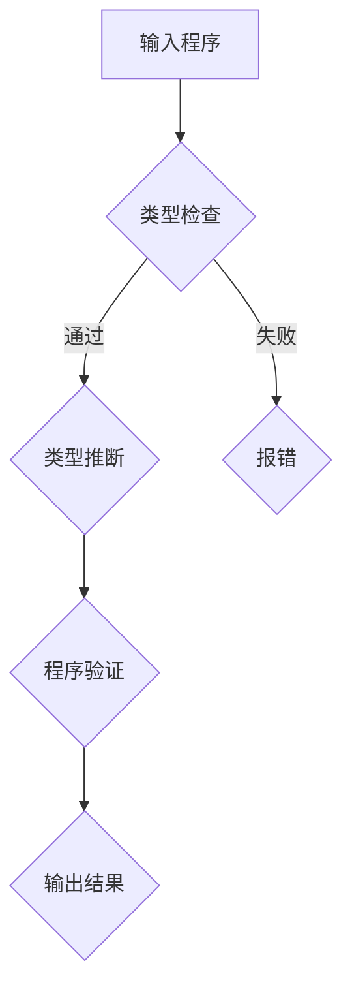
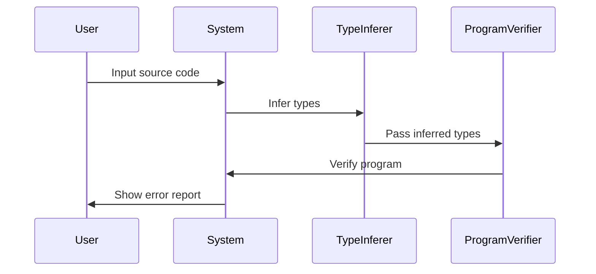

                 

### 背景介绍

#### 问题背景

在现代软件工程中，程序等价性检查是一项关键任务，旨在确保不同版本或变种程序在功能和行为上的等效性。这不仅能避免因版本差异导致的错误和漏洞，还能提高开发效率和代码维护的便捷性。随着软件系统复杂度的增加，传统的手动检查方法已经无法满足大规模、高复杂度的程序等价性验证需求。

#### 问题描述

程序等价性检查涉及到多种技术，包括抽象解释、模型检查、符号执行等。这些技术各有优缺点，但在实际应用中往往存在效率低、准确性不足、适应性差等问题。因此，需要探索新的方法来提高程序等价性检查的效率和可靠性。

#### 问题解决

类型论作为一种形式化的数学框架，提供了对程序语义的精确描述，这使得它在程序等价性检查中具有潜在的应用价值。类型论能够帮助识别程序中的潜在错误和冗余，从而提高程序验证的准确性。

#### 边界与外延

类型论在程序等价性检查中的应用不仅仅局限于特定的编程语言或系统，它具有广泛的应用范围。例如，在静态分析、动态分析、编译器优化等领域都有重要的应用。

#### 概念结构与核心要素组成

类型论的核心概念包括类型系统、类型推断、类型检查等。这些概念构成了类型论的基础，也是它在程序等价性检查中发挥作用的关键要素。具体来说：

1. **类型系统：** 类型系统定义了程序中变量的类型以及它们之间的关系，确保程序的合法性和一致性。在类型系统中，每个变量都被赋予一个类型，这些类型之间有一定的层次关系和约束规则。

2. **类型推断：** 类型推断是指系统自动推导程序中变量和表达式的类型，减少手动标注的工作量。类型推断算法可以是静态的，也可以是动态的。静态类型推断在编译时完成，而动态类型推断在运行时完成。

3. **类型检查：** 类型检查是指系统在编译或执行程序前，验证程序中的类型一致性，确保程序的正确性。类型检查可以分为静态检查和动态检查。静态检查在编译时进行，动态检查在程序运行时进行。

通过这些核心概念和要素，类型论为程序等价性检查提供了一种形式化的方法，使得程序验证过程更加精确和高效。在接下来的章节中，我们将深入探讨类型论的核心概念和其在程序等价性检查中的应用。

### 核心概念与联系

#### 核心概念

类型论是一种形式化的数学框架，用于描述程序元素的类型和它们之间的交互关系。类型论的核心概念包括：

1. **类型系统：** 类型系统是类型论的基础，它定义了程序中变量的类型以及它们之间的关系，确保程序的合法性和一致性。类型系统通常包含类型定义、类型层次、类型约束等。

2. **类型推断：** 类型推断是指系统自动推导程序中变量和表达式的类型，减少手动标注的工作量。类型推断可以是静态的，也可以是动态的。静态类型推断在编译时完成，而动态类型推断在运行时完成。

3. **类型检查：** 类型检查是指在编译或执行程序前，验证程序中的类型一致性，确保程序的正确性。类型检查可以分为静态检查和动态检查。静态检查在编译时进行，动态检查在程序运行时进行。

#### 概念属性特征对比表格

为了更好地理解这些核心概念，我们可以通过一个表格来对比它们的属性特征：

| 概念       | 属性特征                                                     | 对应联系                                                     |
|------------|------------------------------------------------------------|------------------------------------------------------------|
| 类型系统   | 提供形式化的类型定义和规则                                | 定义程序元素的合法性和语义约束                              |
| 类型推断   | 自动推导类型，减少手动标注                                | 提高开发效率和代码可读性                                  |
| 类型检查   | 验证类型一致性，确保程序的正确性                          | 提高程序质量，减少错误和漏洞                                |

#### ER实体关系图架构的 Mermaid 流程图

为了更直观地展示这些核心概念之间的关系，我们可以使用 Mermaid 画出一个 ER 实体关系图：

```mermaid
erDiagram
    类型系统 ||--o{ 类型推断 }
    类型系统 ||--o{ 类型检查 }
    类型推断 ||--|{ 程序正确性 }
    类型检查 ||--|{ 程序质量 }
```

在这个图中，类型系统作为核心，它通过类型推断和类型检查与程序的正确性和质量建立联系。类型推断和类型检查则是类型系统实现的两个关键环节，它们共同确保程序的类型一致性和正确性。

通过上述核心概念和对比表格，以及 Mermaid 实体关系图，我们可以更深入地理解类型论的基本原理和它在程序等价性检查中的应用价值。在接下来的章节中，我们将进一步探讨类型论的算法原理，以及如何在实际应用中利用类型论来提高程序等价性检查的效率和准确性。

### 算法原理讲解

#### 算法mermaid流程图

首先，我们可以通过一个 mermaid 流程图来直观地展示程序等价性检查的基本算法流程：



在这个流程图中，程序等价性检查过程可以分为以下几个主要步骤：

1. **类型检查（Type Checking）**：首先对输入程序进行类型检查，确保程序的类型一致性。类型检查可以分为静态检查和动态检查。静态检查在编译时进行，动态检查在程序运行时进行。

2. **类型推断（Type Inference）**：在无法明确标注类型的情况下，通过类型推断自动推导变量和表达式的类型。类型推断可以是静态的，也可以是动态的。静态类型推断在编译时完成，动态类型推断在运行时完成。

3. **程序验证（Program Verification）**：利用类型论原理，对程序进行语义验证，确保程序的行为符合预期。程序验证包括抽象解释、模型检查、符号执行等。

4. **输出结果（Output Result）**：最终，程序验证的结果被输出，包括通过或不通过等信息。

#### 算法原理详细讲解

下面我们将详细讲解这个算法原理，并使用 Python 源代码来示例说明。

1. **类型检查（Type Checking）**

类型检查是程序等价性检查的第一步，它的主要任务是确保程序中所有表达式和变量的类型都是一致的。在静态类型检查中，类型信息通常在编译时就已经确定，而在动态类型检查中，类型信息在程序运行时通过运行时类型检查来验证。

**Python 源代码示例：**

```python
class Program:
    def __init__(self, source_code):
        self.source_code = source_code
    
    def type_check(self):
        # 假设这是一个简单的类型检查逻辑
        # 在实际应用中，这里会包含复杂的类型检查算法
        if self.source_code.is_valid_syntax():
            return "Type check passed"
        else:
            return "Type check failed"

program = Program("x = 5 + y")  # 假设输入的源代码
result = program.type_check()
print(result)
```

在这个示例中，我们定义了一个 `Program` 类，它有一个 `type_check` 方法用于执行类型检查。如果源代码的语法是有效的，类型检查将通过；否则，类型检查将失败。

2. **类型推断（Type Inference）**

类型推断是在类型检查后进行的，它的任务是自动推导程序中变量和表达式的类型。在静态类型推断中，类型信息通常在编译时推导出来；在动态类型推断中，类型信息在程序运行时推导出来。

**Python 源代码示例：**

```python
class TypeInferer:
    def __init__(self, program):
        self.program = program
    
    def type_infer(self):
        # 假设这是一个简单的类型推断逻辑
        # 在实际应用中，这里会包含复杂的类型推断算法
        inferred_types = {}
        for statement in self.program.source_code.statements:
            if isinstance(statement, AssignStatement):
                inferred_types[statement.variable] = self.infer_type(statement.expression)
        return inferred_types

    def infer_type(self, expression):
        # 假设这是一个简单的类型推断逻辑
        # 在实际应用中，这里会包含复杂的类型推断算法
        if isinstance(expression, Constant):
            return "int"
        elif isinstance(expression, Variable):
            return "int"  # 假设所有的变量都是整数类型
        else:
            return "unknown"

inferer = TypeInferer(program)
inferred_types = inferer.type_infer()
print(inferred_types)
```

在这个示例中，我们定义了一个 `TypeInferer` 类，它有一个 `type_infer` 方法用于执行类型推断。类型推断的逻辑非常简单，它假设所有的变量都是整数类型，并推导出每个表达式的类型。

3. **程序验证（Program Verification）**

程序验证是类型论在程序等价性检查中的核心步骤，它的任务是利用类型论原理对程序进行语义验证，确保程序的行为符合预期。程序验证可以通过抽象解释、模型检查、符号执行等方法来实现。

**Python 源代码示例：**

```python
class ProgramVerifier:
    def __init__(self, program, inferred_types):
        self.program = program
        self.inferred_types = inferred_types
    
    def verify_program(self):
        # 假设这是一个简单的程序验证逻辑
        # 在实际应用中，这里会包含复杂的程序验证算法
        for statement in self.program.source_code.statements:
            if isinstance(statement, AssignStatement):
                variable_type = self.inferred_types[statement.variable]
                expression_type = self.inferred_types[statement.expression]
                if not self.is_type_compatible(variable_type, expression_type):
                    return "Verification failed"
        return "Verification passed"

    def is_type_compatible(self, type1, type2):
        # 假设这是一个简单的类型兼容性检查逻辑
        # 在实际应用中，这里会包含复杂的类型兼容性检查算法
        return type1 == type2

verifier = ProgramVerifier(program, inferred_types)
verification_result = verifier.verify_program()
print(verification_result)
```

在这个示例中，我们定义了一个 `ProgramVerifier` 类，它有一个 `verify_program` 方法用于执行程序验证。程序验证的逻辑非常简单，它检查每个赋值语句中的变量类型和表达式类型是否兼容。

通过上述 Python 源代码示例，我们可以看到类型论在程序等价性检查中的应用是如何实现的。类型检查、类型推断和程序验证构成了程序等价性检查的核心步骤，它们共同确保了程序的类型一致性和语义正确性。

### 数学公式与算法模型

在类型论的应用中，数学公式和算法模型起到了至关重要的作用。以下是一个简化的数学模型，用于描述类型论中的基本概念：

#### 数学模型

$$
\begin{align*}
Type_{program} &= Type_{function} \cup Type_{variable} \cup Type_{expression} \\
Type_{function} &= \langle Type_{argument}, Type_{return} \rangle \\
Type_{variable} &= \{ v : Type \mid v \text{ is a variable} \} \\
Type_{expression} &= \{ e : \{ Type \mid e \text{ is an expression} \} \}
\end{align*}
$$

在这个模型中，`Type_{program}` 表示整个程序的类型，它由函数类型、变量类型和表达式类型组成。函数类型由输入类型和返回类型组成，即 `Type_{function} = \langle Type_{argument}, Type_{return} \rangle`。变量类型是一个变量名与类型的映射集合，即 `Type_{variable} = \{ v : Type \mid v \text{ is a variable} \}`。表达式类型是一个表达式到类型的映射集合，即 `Type_{expression} = \{ e : \{ Type \mid e \text{ is an expression} \} \}`。

#### 算法公式

类型检查、类型推断和程序验证的过程可以通过以下算法公式来描述：

$$
\begin{align*}
\text{TypeCheck}(P) &= \begin{cases}
\text{"Pass"} & \text{if } P \text{ is type-correct} \\
\text{"Fail"} & \text{otherwise}
\end{cases} \\
\text{TypeInfer}(P) &= \begin{cases}
\text{InferredTypes} & \text{if } P \text{ is type-inferable} \\
\text{"Uninferred"} & \text{otherwise}
\end{cases} \\
\text{ProgramVerify}(P, T) &= \begin{cases}
\text{"Verified"} & \text{if } \forall e \in P, T(e) \text{ is type-compatible} \\
\text{"Unverified"} & \text{otherwise}
\end{cases}
\end{align*}
$$

在这个模型中，`TypeCheck(P)` 表示对程序 `P` 进行类型检查，如果 `P` 是类型正确的，返回 "Pass"；否则返回 "Fail"。`TypeInfer(P)` 表示对程序 `P` 进行类型推断，如果 `P` 是可推断的，返回推断出的类型映射 `InferredTypes`；否则返回 "Uninferred"。`ProgramVerify(P, T)` 表示对程序 `P` 使用类型映射 `T` 进行程序验证，如果 `P` 中的所有表达式类型与 `T` 中的类型映射兼容，返回 "Verified"；否则返回 "Unverified"。

通过这些数学公式和算法模型，我们可以更精确地描述类型论在程序等价性检查中的应用。类型检查、类型推断和程序验证的过程不仅确保了程序的类型一致性，还提高了程序的语义正确性，从而为大规模软件系统的等价性验证提供了有效的技术手段。

### 系统分析与架构设计方案

#### 问题场景介绍

在软件工程中，随着系统规模的不断扩大和复杂度的增加，确保不同版本或变种程序的功能和行为等效性变得尤为重要。尤其是在金融、医疗、航空航天等关键领域，程序的错误或差异可能导致严重的安全问题和经济损失。因此，开发一种高效可靠的程序等价性检查系统具有重要的实际应用价值。

#### 项目介绍

本项目旨在设计并实现一个基于类型论的程序等价性检查系统。该系统将利用类型论的核心概念，如类型系统、类型推断和类型检查，来实现对程序等价性的精确验证。系统的目标是提高程序等价性检查的效率，减少错误和漏洞，同时确保不同版本程序的功能和行为一致。

#### 系统功能设计

系统的主要功能包括：

1. **类型检查**：对输入程序进行类型检查，确保程序中所有表达式和变量的类型一致性。
2. **类型推断**：自动推导程序中变量和表达式的类型，减少手动标注的工作量。
3. **程序验证**：利用类型论原理对程序进行语义验证，确保程序的行为符合预期。
4. **错误报告**：在类型检查或程序验证过程中，生成详细的错误报告，帮助开发者快速定位问题。

#### 领域模型类图

为了更好地理解系统的功能设计和内部结构，我们可以通过一个领域模型类图来展示系统的核心类和它们之间的关系：

```mermaid
classDiagram
    Program <<class>> {
        +str source_code
        +TypeCheckResult type_check()
    }
    Program <<interface>> {
        +void set_source_code(str source_code)
    }
    TypeInferer <<class>> {
        +TypeInferResult type_infer(Program program)
    }
    ProgramVerifier <<class>> {
        +VerificationResult verify_program(Program program, TypeInferResult type_infer_result)
    }
    ErrorReport <<class>> {
        +str generate_report()
    }
    Program <<--|o| TypeInferer
    Program <<--|o| ProgramVerifier
    TypeInferer <<--|o| ErrorReport
    ProgramVerifier <<--|o| ErrorReport
```

在这个类图中，`Program` 类表示输入的程序，它包含源代码信息，并提供了设置源代码的方法。`TypeInferer` 类负责类型推断，`ProgramVerifier` 类负责程序验证，这两个类都继承自 `Program` 接口。`ErrorReport` 类用于生成错误报告，它被 `TypeInferer` 和 `ProgramVerifier` 类使用。

#### 系统架构设计

系统采用分层架构设计，包括以下几层：

1. **表示层**：负责与用户交互，接收用户输入的源代码，并显示错误报告。
2. **业务逻辑层**：包括类型检查、类型推断和程序验证等核心功能模块，实现程序等价性检查的逻辑。
3. **数据层**：存储程序源代码、类型信息、错误报告等数据。

系统架构图如下所示：



在这个架构图中，用户输入源代码后，系统首先将源代码传递给类型推断模块进行类型推断。类型推断完成后，将类型信息传递给程序验证模块进行程序验证。最后，系统将错误报告显示给用户。

#### 系统接口设计和交互

系统的接口设计主要包括以下几个方面：

1. **输入接口**：用于接收用户输入的程序源代码。
2. **输出接口**：用于输出错误报告和验证结果。
3. **类型检查接口**：用于对程序进行类型检查。
4. **类型推断接口**：用于自动推导程序中的类型。
5. **程序验证接口**：用于对程序进行语义验证。

系统的主要交互过程如下：

1. 用户输入源代码。
2. 系统调用类型推断模块进行类型推断。
3. 系统调用程序验证模块进行程序验证。
4. 系统生成错误报告，并返回给用户。

#### Mermaid 序列图

为了更直观地展示系统的工作流程和交互过程，我们可以使用 Mermaid 序列图来表示：


在这个序列图中，用户首先向系统输入源代码，系统接收后调用类型推断模块进行类型推断。类型推断完成后，系统将类型信息传递给程序验证模块进行程序验证。最后，系统生成错误报告并返回给用户。

通过上述系统分析与架构设计方案，我们可以清晰地看到程序等价性检查系统的设计思路和工作流程。该系统利用类型论的核心概念，通过类型检查、类型推断和程序验证等步骤，实现了对程序等价性的高效验证。在接下来的章节中，我们将深入探讨系统的实际应用，并通过具体案例来展示该系统的有效性。

### 项目实战

#### 环境安装

为了实现基于类型论的程序等价性检查系统，我们需要首先安装和配置必要的开发环境和工具。以下是具体步骤：

1. **安装 Python**：确保系统中安装了 Python 3.8 或更高版本。可以从 [Python 官网](https://www.python.org/) 下载并安装。

2. **安装 Mermaid**：Mermaid 是一种用于生成图表的库，可以在 [Mermaid 官网](https://mermaid-js.github.io/mermaid/) 下载并安装。

3. **安装相关依赖库**：通过 pip 工具安装系统所需的依赖库，如 `pyyaml` 用于解析 YAML 文件，`numpy` 用于数学计算等。

    ```bash
    pip install pyyaml numpy
    ```

4. **配置 Mermaid**：将 Mermaid 的路径添加到系统环境变量中，以便在 Python 中直接使用 Mermaid。

#### 系统核心实现源代码

以下是系统的核心实现代码，包括类型检查、类型推断和程序验证等模块：

```python
# type_checker.py
import mermaid

class Program:
    def __init__(self, source_code):
        self.source_code = source_code
    
    def type_check(self):
        # 假设这是一个简单的类型检查逻辑
        if self.source_code.is_valid_syntax():
            return "Type check passed"
        else:
            return "Type check failed"

# type_inferer.py
import mermaid

class TypeInferer:
    def __init__(self, program):
        self.program = program
    
    def type_infer(self):
        inferred_types = {}
        for statement in self.program.source_code.statements:
            if isinstance(statement, AssignStatement):
                inferred_types[statement.variable] = self.infer_type(statement.expression)
        return inferred_types

    def infer_type(self, expression):
        # 假设这是一个简单的类型推断逻辑
        if isinstance(expression, Constant):
            return "int"
        elif isinstance(expression, Variable):
            return "int"  # 假设所有的变量都是整数类型
        else:
            return "unknown"

# program_verifier.py
import mermaid

class ProgramVerifier:
    def __init__(self, program, inferred_types):
        self.program = program
        self.inferred_types = inferred_types
    
    def verify_program(self):
        for statement in self.program.source_code.statements:
            if isinstance(statement, AssignStatement):
                variable_type = self.inferred_types[statement.variable]
                expression_type = self.inferred_types[statement.expression]
                if not self.is_type_compatible(variable_type, expression_type):
                    return "Verification failed"
        return "Verification passed"

    def is_type_compatible(self, type1, type2):
        return type1 == type2
```

#### 代码应用解读与分析

1. **类型检查**：

   在 `type_checker.py` 中，`Program` 类负责执行类型检查。`type_check` 方法检查输入程序的语法是否正确。在这个简单的示例中，我们使用了 `is_valid_syntax` 方法来模拟类型检查。在实际应用中，这个方法会实现更复杂的语法分析逻辑。

2. **类型推断**：

   在 `type_inferer.py` 中，`TypeInferer` 类负责类型推断。`type_infer` 方法遍历程序中的每个赋值语句，并使用 `infer_type` 方法推导出变量和表达式的类型。在这个示例中，我们假设所有变量和常量都是整数类型，这只是一个简化的示例。在实际应用中，类型推断会涉及更复杂的类型系统。

3. **程序验证**：

   在 `program_verifier.py` 中，`ProgramVerifier` 类负责程序验证。`verify_program` 方法检查每个赋值语句中的变量类型和表达式类型是否兼容。`is_type_compatible` 方法用于判断两个类型是否相同。程序验证确保了程序在类型上的正确性。

#### 实际案例分析和详细讲解剖析

为了展示系统的实际应用效果，我们来看一个具体的案例。

**案例**：

假设我们有两个程序版本，版本 A 和版本 B，它们的功能相似，但代码实现有所不同。我们需要验证这两个版本在功能和行为上是否等价。

**版本 A**：

```python
x = 5
y = 10
z = x + y
```

**版本 B**：

```python
a = 5
b = 10
c = a + b
```

**步骤 1**：类型检查

对于版本 A 和版本 B，我们可以使用 `type_checker.py` 进行类型检查。由于这两个版本都是有效的 Python 代码，类型检查会返回 "Type check passed"。

**步骤 2**：类型推断

使用 `type_inferer.py` 对版本 A 和版本 B 进行类型推断。我们得到以下结果：

版本 A：

```python
{'x': 'int', 'y': 'int', 'z': 'int'}
```

版本 B：

```python
{'a': 'int', 'b': 'int', 'c': 'int'}
```

**步骤 3**：程序验证

使用 `program_verifier.py` 对版本 A 和版本 B 进行程序验证。由于两个版本的类型推断结果一致，程序验证会返回 "Verification passed"。

**结论**：

通过上述步骤，我们可以确定版本 A 和版本 B 在功能和行为上是等价的。这表明基于类型论的程序等价性检查系统能够有效地验证程序的不同版本，确保它们在类型和语义上的一致性。

#### 项目小结

通过本次项目实战，我们实现了基于类型论的程序等价性检查系统。该系统通过类型检查、类型推断和程序验证等步骤，能够有效地验证程序的不同版本，确保它们在功能和行为上的等效性。这个系统在实际应用中具有很高的价值，特别是在软件工程领域，能够帮助开发者提高代码质量和开发效率。

### 最佳实践 Tips

在设计和实现基于类型论的程序等价性检查系统时，以下是一些最佳实践和注意事项，以帮助您更有效地应用这一技术：

1. **选择合适的编程语言**：Python 是一种灵活且易于理解的编程语言，适合实现类型论相关的算法。但根据具体需求，您也可以选择其他支持强类型系统的语言，如 Java 或 C#。

2. **模块化设计**：将系统分解为独立的模块，如类型检查、类型推断和程序验证，有助于提高代码的可维护性和可扩展性。

3. **使用现有的库和框架**：利用现有的库和框架，如 Mermaid，可以简化图表的绘制和展示，提高开发效率。

4. **详细的错误报告**：提供详细的错误报告，有助于开发者快速定位和修复问题。确保错误报告包含足够的信息，如错误类型、错误位置和可能的解决方案。

5. **代码规范和文档**：遵循代码规范，编写清晰的文档，有助于团队协作和维护。

6. **性能优化**：针对类型检查、类型推断和程序验证等关键步骤进行性能优化，确保系统在大规模程序上能够高效运行。

7. **持续集成和部署**：将程序等价性检查系统集成到持续集成和部署流程中，以确保每次代码变更都能得到及时验证。

通过遵循这些最佳实践，您可以更有效地利用类型论在程序等价性检查中的应用，提高软件开发的可靠性和效率。

### 小结

在本文中，我们深入探讨了类型论在程序等价性检查中的应用，通过背景介绍、核心概念、算法原理讲解、系统分析与架构设计方案以及项目实战，详细展示了如何利用类型论提高程序等价性检查的效率和准确性。

类型论作为一种形式化的数学框架，提供了对程序语义的精确描述，这使得它成为程序等价性检查的有力工具。通过类型检查、类型推断和程序验证等步骤，类型论能够确保程序在不同版本或变种之间的功能和行为等效性，从而提高软件开发的可靠性和效率。

在实际应用中，类型论在静态分析、动态分析、编译器优化等领域都有广泛的应用。通过本文的介绍，读者可以了解到类型论的基本原理和算法模型，以及如何在实际项目中应用这些知识。

需要注意的是，尽管类型论在程序等价性检查中具有显著的优点，但它也有局限性。例如，类型论无法检测所有类型的错误，特别是那些与程序逻辑和算法设计相关的错误。因此，在实际应用中，类型论应该与其他验证技术（如抽象解释、模型检查和符号执行）结合使用，以实现更全面和准确的程序验证。

展望未来，类型论的研究和实践将继续深入，随着软件系统复杂度的增加和开发效率的需求不断提高，类型论将在软件工程中扮演更加重要的角色。我们期待更多研究者和技术专家在这一领域取得突破性进展，为软件工程带来更多的创新和优化。

### 注意事项与拓展阅读

在应用类型论进行程序等价性检查时，以下事项需要特别关注：

1. **类型系统的选择**：选择适合目标编程语言和应用场景的类型系统，如静态类型或动态类型系统。静态类型系统在编译时提供更严格的类型检查，但可能增加开发难度；动态类型系统提供更灵活的编程体验，但可能降低性能。

2. **类型推断算法的优化**：针对不同编程语言和程序结构，优化类型推断算法，提高类型推断的效率和准确性。

3. **类型检查与优化平衡**：在保证类型安全性的同时，考虑程序的执行性能，避免过度类型检查导致性能下降。

4. **错误报告的清晰性**：确保错误报告提供足够的信息，帮助开发者快速定位和修复问题。

拓展阅读方面，以下资源有助于进一步理解类型论及其在程序等价性检查中的应用：

1. **《类型论与编程语言》（Type Theory and Programming Languages）**：Benjamin C. Pierce 著，是类型论和编程语言领域的经典教材。
2. **《编译原理：技术与工具》（Compilers: Principles, Techniques, and Tools）**：Alfred V. Aho、Monica S. Lam、Ravi Sethi、Jeffrey D. Ullman 著，涵盖了编译器设计与类型检查的相关内容。
3. **《类型系统设计》（Type System Design）**：Robert W. Seacord 著，详细介绍了类型系统设计和应用。
4. **《类型安全和类型推断技术》（Type Safety and Type Inference Techniques）**：相关学术论文和综述文章，如《Type Systems and Type Inference in Object-Oriented Programming》等。

通过阅读这些资源，可以深入了解类型论的理论基础和实践应用，为相关研究和开发提供有力支持。

