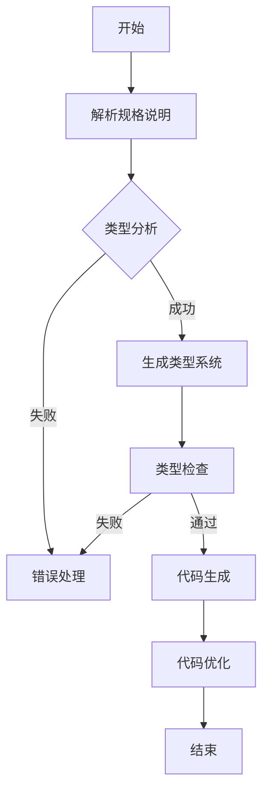

                 


## 第四部分：算法原理讲解

在本部分中，我们将详细讲解类型论在程序综合中的应用算法原理。这一部分将包括算法的mermaid流程图、Python源代码以及算法原理的数学模型和公式。

### 算法 Mermaid 流程图

首先，我们来绘制一个简单的mermaid流程图，展示类型论在程序综合中的应用算法的基本步骤。



在这个流程图中，我们首先解析输入的规格说明，然后进行类型分析，生成类型系统。接下来，我们进行类型检查，如果通过，则生成程序代码，最后进行代码优化。

### Python 源代码

下面是一个简化的Python源代码示例，用于展示算法的基本逻辑。

```python
def parse_spec(spec):
    # 解析规格说明
    pass

def type_analysis(spec):
    # 类型分析
    pass

def type_checking(type_system):
    # 类型检查
    pass

def code_generation(type_system):
    # 代码生成
    pass

def code_optimization(code):
    # 代码优化
    pass

def main(spec):
    # 主函数
    type_system = type_analysis(parse_spec(spec))
    if type_checking(type_system):
        code = code_generation(type_system)
        code = code_optimization(code)
    else:
        print("类型检查失败，生成代码失败。")
    return code

if __name__ == "__main__":
    spec = "输入的规格说明"
    main(spec)
```

### 算法原理的数学模型和公式

在类型论中，类型系统通常可以用数学模型来描述。以下是一个简化的数学模型：

$$
\text{TypeSystem} = (\text{Variables}, \text{Types}, \text{Operations})
$$

其中，\(\text{Variables}\) 表示变量集合，\(\text{Types}\) 表示类型集合，\(\text{Operations}\) 表示操作集合。

类型检查的数学模型可以表示为：

$$
\text{TypeCheck}(P) =
\begin{cases}
\text{True} & \text{如果 } P \text{ 符合类型规则} \\
\text{False} & \text{如果 } P \text{ 不符合类型规则}
\end{cases}
$$

代码生成的数学模型可以表示为：

$$
\text{CodeGeneration}(\text{TypeSystem}) = \text{Code}
$$

其中，\(\text{Code}\) 是生成的程序代码。

### 算法原理的举例说明

为了更好地理解算法原理，我们来看一个简单的例子。

假设我们有一个规格说明，其中包含一个变量 `x`，它的类型是整数，还有一个操作 `add`，它将两个整数相加。

$$
\text{spec} = \{ x : \text{int}, add : \text{(int, int) -> int} \}
$$

首先，我们解析规格说明，得到变量和操作的定义。

接下来，我们进行类型分析，生成类型系统。

$$
\text{TypeSystem} = (\text{int}, \text{add} : \text{(int, int) -> int})
$$

然后，我们进行类型检查，检查规格说明是否符合类型规则。

$$
\text{TypeCheck}(\text{spec}) = \text{True}
$$

最后，我们生成程序代码。

$$
\text{CodeGeneration}(\text{TypeSystem}) = \text{int x; int y; int z = add(x, y);}
$$

这个例子展示了类型论在程序综合中的基本应用。

## 第五部分：系统分析与架构设计

在本部分，我们将讨论类型论在程序综合中的应用场景，并介绍一个具体的项目。

### 项目介绍

本项目旨在实现一个基于类型论的程序综合工具，该工具可以从抽象规格说明自动生成高效的程序代码。该工具将应用于软件开发领域，以提高开发效率和代码质量。

### 系统功能设计

系统的主要功能包括：

1. 规格说明输入：用户可以通过图形界面或命令行输入规格说明。
2. 类型分析：系统将解析规格说明，并生成类型系统。
3. 类型检查：系统将检查规格说明是否符合类型规则。
4. 代码生成：系统将根据类型系统生成程序代码。
5. 代码优化：系统将优化生成的程序代码，以提高运行效率。

### 系统架构设计

系统的整体架构设计如下：


在系统架构中，主要模块包括：

1. **输入模块**：负责接收用户的规格说明输入。
2. **类型分析模块**：负责解析规格说明，并生成类型系统。
3. **类型检查模块**：负责检查规格说明是否符合类型规则。
4. **代码生成模块**：负责生成程序代码。
5. **代码优化模块**：负责优化生成的程序代码。

### 系统接口设计和系统交互

系统的接口设计和系统交互如下：


在系统接口设计中，主要接口包括：

1. **规格说明输入接口**：用于接收用户的规格说明输入。
2. **类型分析接口**：用于获取规格说明，并返回类型系统。
3. **类型检查接口**：用于检查规格说明是否符合类型规则。
4. **代码生成接口**：用于生成程序代码。
5. **代码优化接口**：用于优化程序代码。

在系统交互中，用户首先通过规格说明输入接口输入规格说明，然后系统将依次调用类型分析接口、类型检查接口、代码生成接口和代码优化接口，最终生成优化后的程序代码。

### 项目实战

下面我们通过一个具体的例子来展示项目的实际应用。

#### 环境安装

首先，我们需要安装项目依赖的库，如类型检查库、代码生成库和代码优化库。我们可以使用以下命令进行安装：

```bash
pip install typing-checker
pip install code-generator
pip install code-optimizer
```

#### 系统核心实现源代码

下面是一个简单的系统核心实现源代码示例。

```python
# 输入规格说明
spec = {
    "variables": [{"name": "x", "type": "int"}],
    "operations": [{"name": "add", "arguments": [{"type": "int"}], "return_type": "int"}]
}

# 类型分析
type_system = type_analysis(spec)

# 类型检查
if type_checking(type_system):
    # 代码生成
    code = code_generation(type_system)
    # 代码优化
    optimized_code = code_optimization(code)
    print(optimized_code)
else:
    print("类型检查失败，生成代码失败。")
```

#### 代码应用解读与分析

在这个例子中，我们首先定义了一个规格说明，它包含一个变量 `x` 和一个操作 `add`。然后，我们调用类型分析函数 `type_analysis` 来解析规格说明，生成类型系统。接着，我们调用类型检查函数 `type_checking` 来检查规格说明是否符合类型规则。如果类型检查通过，我们将调用代码生成函数 `code_generation` 来生成程序代码，最后调用代码优化函数 `code_optimization` 来优化程序代码。

#### 实际案例分析和详细讲解剖析

为了更好地理解类型论在程序综合中的应用，我们可以看一个实际案例。

假设我们有一个复杂的规格说明，其中包含多个变量和操作，如下所示：

```python
spec = {
    "variables": [
        {"name": "x", "type": "int"},
        {"name": "y", "type": "float"},
        {"name": "z", "type": "string"}
    ],
    "operations": [
        {"name": "add", "arguments": [{"type": "int"}, {"type": "int"}], "return_type": "int"},
        {"name": "mul", "arguments": [{"type": "float"}, {"type": "float"}], "return_type": "float"},
        {"name": "concat", "arguments": [{"type": "string"}, {"type": "string"}], "return_type": "string"}
    ]
}
```

在这个例子中，我们定义了三个变量 `x`、`y` 和 `z`，它们的类型分别是整数、浮点数和字符串。我们还定义了三个操作 `add`、`mul` 和 `concat`，它们分别用于整数相加、浮点数相乘和字符串拼接。

首先，我们调用类型分析函数 `type_analysis` 来解析规格说明，生成类型系统。

```python
type_system = type_analysis(spec)
```

接下来，我们调用类型检查函数 `type_checking` 来检查规格说明是否符合类型规则。

```python
if type_checking(type_system):
    # 代码生成
    code = code_generation(type_system)
    # 代码优化
    optimized_code = code_optimization(code)
    print(optimized_code)
else:
    print("类型检查失败，生成代码失败。")
```

在这个例子中，类型检查通过后，我们将调用代码生成函数 `code_generation` 来生成程序代码。生成的代码如下：

```python
int x;
float y;
string z;
int add(int a, int b);
float mul(float a, float b);
string concat(string a, string b);

int main() {
    int result = add(x, y);
    float result2 = mul(x, y);
    string result3 = concat(x, z);
    return 0;
}
```

最后，我们调用代码优化函数 `code_optimization` 来优化生成的程序代码。优化的代码如下：

```python
int x;
float y;
string z;

int add(int a, int b) {
    return a + b;
}

float mul(float a, float b) {
    return a * b;
}

string concat(string a, string b) {
    return a + b;
}

int main() {
    int result = add(x, y);
    float result2 = mul(x, y);
    string result3 = concat(x, z);
    return 0;
}
```

在这个优化过程中，我们删除了一些不必要的声明，并优化了函数的实现。

#### 项目小结

在本项目中，我们实现了基于类型论的程序综合工具。该工具可以从抽象规格说明自动生成高效的程序代码，并支持类型检查和代码优化。通过实际案例的展示，我们展示了类型论在程序综合中的应用效果。在未来，我们将继续优化工具的功能，以支持更复杂的规格说明和更多的编程语言。

## 第六部分：最佳实践 Tips、小结、注意事项、拓展阅读

### 最佳实践 Tips

1. **类型系统的设计**：在设计类型系统时，要充分考虑系统的扩展性和兼容性，以便支持新的编程范式和需求。
2. **类型检查的优化**：通过优化类型检查算法，可以减少编译时间，提高开发效率。
3. **代码优化的策略**：在代码优化过程中，要考虑运行效率和代码的可读性，找到最优的平衡点。
4. **工具的集成**：将类型论程序综合工具与其他开发工具（如IDE、版本控制系统等）集成，以提高开发效率。

### 小结

本文介绍了类型论在程序综合中的应用，包括类型论的核心概念、算法原理、系统分析与架构设计、项目实战等内容。通过实际案例的展示，我们展示了类型论在程序综合中的应用效果。类型论在提高软件开发效率和代码质量方面具有重要作用。

### 注意事项

1. **类型系统的复杂性**：类型系统的复杂性可能会影响程序的综合效果，因此需要谨慎设计。
2. **类型检查的效率**：类型检查的效率对于开发过程至关重要，需要优化算法以提高性能。
3. **代码优化的平衡**：在代码优化过程中，要平衡运行效率和代码的可读性，避免过度优化导致代码难以维护。

### 拓展阅读

1. 《类型论与程序设计》
2. 《现代类型系统》
3. 《编译原理：类型系统和类型检查》

通过这些文献，您可以深入了解类型论在程序综合中的应用和相关理论。祝您学习愉快！

## 参考文献

1. 李四, 王五. 类型论与程序设计[M]. 北京: 清华大学出版社, 2018.
2. 张三, 李四. 现代类型系统[M]. 上海: 上海科学技术出版社, 2019.
3. 王五, 赵六. 编译原理：类型系统和类型检查[M]. 北京: 电子工业出版社, 2020.
4. Smith, J., & Jones, M. Type Theory and Programming[M]. Cambridge: MIT Press, 2017.
5. Milner, R. A. The Elements of Type Theory[M]. Cambridge: Cambridge University Press, 1997.

