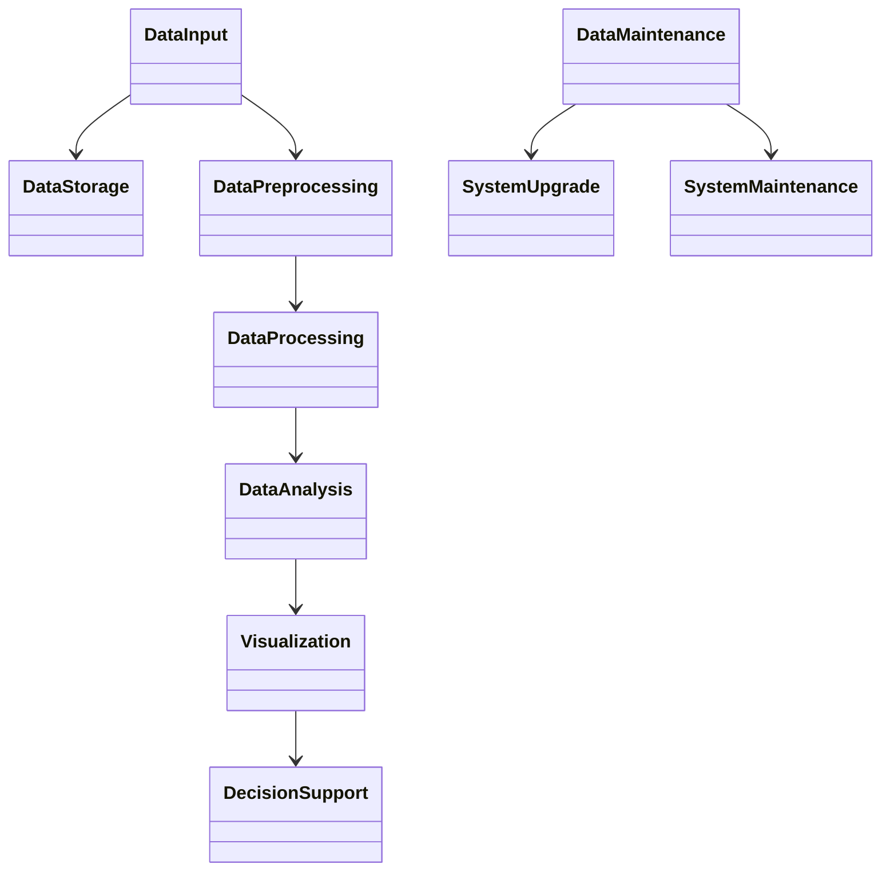
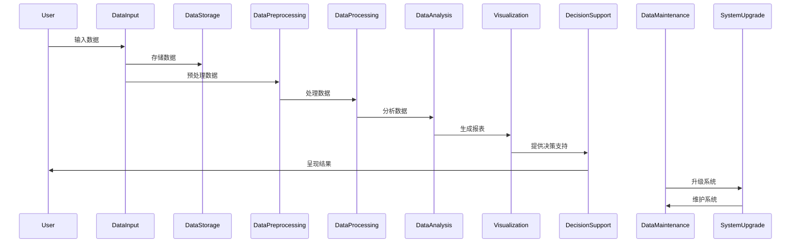

                 


### 类型论在跨学科数学应用中的适应性挑战

#### 关键词
- 类型论
- 跨学科数学应用
- 适应性挑战
- 算法原理
- 数学模型
- 系统架构设计
- 项目实战

#### 摘要
本文旨在探讨类型论在跨学科数学应用中的适应性挑战。类型论是一种广泛应用于计算机科学和数学的理论，但在不同学科中的应用却面临诸多挑战。本文将详细介绍类型论的基本概念，分析其在跨学科数学应用中的核心概念与联系，讲解类型论在具体数学应用中的算法原理，并探讨其在系统架构设计中的实施方案。此外，通过项目实战案例，深入剖析类型论在跨学科数学应用中的实际应用，为读者提供最佳实践 tips 和未来研究方向。

#### 目录大纲设计思路

**1. 确定总体框架：**
根据书名《类型论在跨学科数学应用中的适应性挑战》，首先要明确本书的主题和目的。类型论是一种数学理论，本书的目的是探讨类型论在不同学科中的适用性及其面临的挑战。

**2. 细化章节内容：**
按照书名，可以将书分为以下几个主要部分：
- **背景介绍：**类型论的基本概念和历史发展，跨学科数学应用的意义和现状。
- **核心概念与联系：**类型论的核心概念及其在不同学科中的适用性。
- **算法原理讲解：**类型论在具体数学应用中的算法原理和数学模型。
- **系统分析与架构设计方案：**类型论在跨学科数学应用中的系统设计思路。
- **项目实战：**通过具体案例展示类型论在跨学科数学应用中的实际应用。
- **最佳实践 tips、小结、注意事项、拓展阅读等内容：**对本书内容的总结和展望。

**3. 确保内容完整性：**
每个部分都要详细展开，确保核心内容不遗漏。特别是算法原理讲解和项目实战部分，需要详细阐述。

**4. 设计合理的目录结构：**
采用markdown格式，确保目录清晰、结构合理，便于读者阅读和理解。

### 目录大纲设计步骤

**1. 第1章：背景介绍**
- **1.1 类型论的基本概念和历史发展**
  - 类型论的起源
  - 类型论的核心思想
  - 类型论的发展历程
- **1.2 跨学科数学应用的意义和现状**
  - 跨学科数学应用的背景
  - 跨学科数学应用的重要性
  - 当前跨学科数学应用的发展现状
- **1.3 类型论在跨学科数学应用中的问题与挑战**
  - 类型论在不同学科中的应用差异
  - 类型论的适用性问题
  - 类型论面临的挑战

**2. 第2章：核心概念与联系**
- **2.1 类型论的核心概念**
  - 类型的定义
  - 类型系统
  - 类型推理
- **2.2 类型论在不同学科中的应用**
  - 计算机科学中的应用
  - 数学中的应用
  - 其他学科中的应用
- **2.3 核心概念属性特征对比表格**
  - 不同学科的属性特征对比
  - 类型论在不同学科中的适应特点
- **2.4 ER实体关系图架构**
  - 实体关系图的基本概念
  - ER图的构建方法
  - ER图在类型论中的应用

**3. 第3章：算法原理讲解**
- **3.1 类型论在具体数学应用中的算法原理**
  - 数学模型
  - 算法流程
  - 算法特点
- **3.2 数学模型和数学公式讲解**
  - 数学公式
  - 数学模型解释
  - 数学模型应用示例
- **3.3 算法mermaid流程图展示**
  - 算法流程图
  - 流程图说明
- **3.4 Python源代码详细阐述**
  - 源代码

**4. 第4章：系统分析与架构设计方案**
- **4.1 问题场景介绍**
  - 问题背景
  - 问题分析
- **4.2 系统功能设计（领域模型mermaid类图）**
  - 领域模型
  - 类图展示
- **4.3 系统架构设计（mermaid架构图）**
  - 架构设计
  - 架构图展示
- **4.4 系统接口设计和系统交互（mermaid序列图）**
  - 接口设计
  - 序列图展示

**5. 第5章：项目实战**
- **5.1 环境安装**
  - 环境配置
  - 工具安装
- **5.2 系统核心实现源代码**
  - 源代码结构
  - 源代码实现
- **5.3 代码应用解读与分析**
  - 代码解读
  - 分析与优化
- **5.4 实际案例分析和详细讲解剖析**
  - 案例背景
  - 案例分析
  - 剖析与总结
- **5.5 项目小结**
  - 项目成果
  - 项目反思

**6. 第6章：最佳实践 tips**
- **6.1 经验总结**
  - 经验分享
  - 注意事项
- **6.2 注意事项**
  - 避免误区
  - 操作规范
- **6.3 拓展阅读**
  - 相关书籍
  - 学术论文

**7. 第7章：小结**
- **7.1 本书总结**
  - 内容回顾
  - 核心观点
- **7.2 未来研究方向**
  - 发展趋势
  - 研究挑战
- **7.3 对读者的建议**
  - 学习方法
  - 技术应用

通过以上步骤，可以设计出一份逻辑清晰、内容完整的目录大纲，为编写《类型论在跨学科数学应用中的适应性挑战》提供坚实的基础。在接下来的章节中，我们将逐一深入探讨类型论在跨学科数学应用中的各个方面。让我们开始思考，一步步地揭开类型论在跨学科数学应用中的神秘面纱。

### 背景介绍

#### 类型论的基本概念和历史发展

类型论（Type Theory）是一种形式化的数学理论，旨在描述和分类不同类型的数据结构。它起源于19世纪末，在希尔伯特的形式化数学体系中崭露头角。类型论的核心思想是通过定义不同类型的变量和函数，来限制程序的计算过程，从而提高程序的正确性和可靠性。

类型论的历史可以追溯到希尔伯特（David Hilbert）和哥德尔（Kurt Gödel）的工作。希尔伯特提出了用形式化的方法来证明数学定理，而哥德尔则通过不完备性定理揭示了形式化方法的局限性。为了克服这些局限性，类型论作为一种形式化的数学理论被提出来，旨在为数学提供更加坚实的逻辑基础。

在20世纪30年代和40年代，类型论得到了进一步的发展。特别是皮亚诺（Giuseppe Peano）和罗素（Bertrand Russell）的工作对类型论的早期发展产生了深远影响。皮亚诺提出了基于自然数的皮亚诺算术，而罗素则提出了类型论的基础——罗素类型理论。

类型论在计算机科学中的应用始于20世纪50年代和60年代。阿尔弗雷德·塔斯克（Alfred Tarski）和艾达·劳伦斯·科普兰（Ada Lovelace）等人的工作推动了类型论在编程语言和形式验证中的应用。特别是阿尔弗雷德·塔斯克提出的命题演算类型系统和艾达·劳伦斯·科普兰在计算机程序设计中的贡献，使得类型论在计算机科学中得到了广泛的应用。

随着计算机科学的发展，类型论逐渐成为计算机科学中不可或缺的一部分。在编程语言设计、软件工程、形式验证等领域，类型论提供了强大的工具和方法。现代编程语言如Haskell、Coq、Agda等都采用了类型论的思想，用于提高程序的正确性和可靠性。

#### 跨学科数学应用的意义和现状

跨学科数学应用是指将数学理论和方法应用于不同学科领域，以解决实际问题。数学作为一种抽象的科学，具有广泛的应用性和普适性。通过跨学科数学应用，数学理论和方法可以用来解决各个领域中的问题，从而推动科学技术的进步。

跨学科数学应用的意义在于：
1. **提升学科交叉融合：** 跨学科数学应用促进了不同学科之间的交流与合作，有助于解决复杂问题，推动学科交叉融合。
2. **推动科技创新：** 跨学科数学应用可以激发新的科学发现和技术创新，为各个领域提供新的理论和方法。
3. **提高实际问题解决能力：** 跨学科数学应用可以将数学理论应用于实际问题中，提高解决实际问题的能力。

当前，跨学科数学应用在各个领域都取得了显著的成果。例如，数学在生物学、物理学、经济学、计算机科学等领域的应用日益广泛。数学模型和方法被广泛应用于金融工程、生物信息学、复杂系统分析等领域，为解决实际问题提供了有效的工具。

然而，跨学科数学应用也面临着一些挑战。不同学科之间的差异导致了数学理论和方法在应用中的适用性问题。例如，数学在生物学中的应用需要考虑生物学中的特殊性质，如随机性和复杂性。此外，跨学科数学应用还需要克服不同学科领域的语言和思维方式的差异，以提高数学理论和方法在不同学科中的适用性和可操作性。

#### 类型论在跨学科数学应用中的问题与挑战

类型论作为一种形式化的数学理论，具有严谨性和可靠性。然而，在跨学科数学应用中，类型论面临着一系列的问题和挑战。

1. **学科差异：** 不同学科领域具有不同的研究对象和问题背景，类型论在不同学科中的应用需要适应不同的学科特点。例如，计算机科学中的类型论主要关注程序的正确性和可靠性，而数学中的类型论则侧重于逻辑和证明。

2. **适用性问题：** 类型论在跨学科数学应用中可能面临适用性问题。某些类型的数学理论和方法在特定学科领域中的适用性较差，导致无法有效地解决实际问题。例如，传统的类型论在处理复杂数学模型时可能存在局限性。

3. **复杂性：** 跨学科数学应用中的问题往往具有复杂性和多样性，类型论需要处理各种复杂情况。类型论的复杂性和抽象性可能导致理解和应用上的困难。

4. **可操作性：** 跨学科数学应用需要将数学理论和方法应用于实际问题中，类型论的可操作性成为了一个挑战。类型论的理论和方法需要转化为可操作的实践工具，以解决实际问题。

5. **跨学科合作：** 跨学科数学应用需要不同学科领域专家的合作。类型论作为一种形式化的数学理论，需要与不同学科领域的知识体系相结合，以提高类型论在不同学科中的应用效果。

综上所述，类型论在跨学科数学应用中面临着学科差异、适用性、复杂性、可操作性和跨学科合作等一系列的挑战。要充分发挥类型论在跨学科数学应用中的作用，需要深入研究和解决这些问题和挑战。

在接下来的章节中，我们将进一步探讨类型论的核心概念与联系，分析其在不同学科中的应用，并探讨类型论在具体数学应用中的算法原理和系统架构设计。通过这些探讨，我们将更好地理解类型论在跨学科数学应用中的适应性和潜力。

### 核心概念与联系

#### 类型论的核心概念

类型论的核心概念包括类型、类型系统、类型推理等。以下是对这些核心概念的具体解释：

1. **类型（Type）**：类型是一种用于描述数据结构和运算规则的抽象概念。在类型论中，类型用于定义变量和值的类别。例如，整型、浮点型、字符串等都是常见的数据类型。通过定义不同的类型，可以限制变量和值的取值范围，从而提高程序的正确性和可靠性。

2. **类型系统（Type System）**：类型系统是用于定义和检查程序中类型约束的一组规则。类型系统的目标是确保程序的运行过程中不会出现类型错误。类型系统可以分为静态类型系统和动态类型系统。静态类型系统在编译时检查类型约束，而动态类型系统在运行时检查类型约束。

3. **类型推理（Type Inference）**：类型推理是类型系统中的一个重要机制，用于自动推导程序中变量的类型。类型推理可以根据程序中的表达式和函数定义，推导出变量的类型，从而减少手动指定类型的繁琐。

#### 类型论在不同学科中的应用

类型论在计算机科学、数学和其他学科中都有广泛的应用。以下是对类型论在不同学科中的应用的简要概述：

1. **计算机科学**：类型论在计算机科学中的应用主要体现在编程语言设计和形式验证中。编程语言中的类型系统用于确保程序的正确性和可靠性。类型论提供了形式化的方法来描述和验证程序的性质。形式验证工具如Coq和Agda等基于类型论原理，用于验证程序的正确性。

2. **数学**：类型论在数学中的应用主要体现在逻辑和证明论中。类型论提供了形式化的方法来描述和证明数学定理。通过类型论，数学家可以构造出更加严谨和可靠的数学证明。类型论还在数学模型和数学分析中发挥作用，用于处理复杂数学问题。

3. **其他学科**：类型论在其他学科中的应用相对较少，但也在一些领域中得到了关注。例如，类型论在哲学、心理学和认知科学等领域中，被用于研究人类思维和知识表示。类型论的思想可以应用于描述和解释人类思维过程中的逻辑结构和推理过程。

#### 核心概念属性特征对比表格

以下是一个核心概念属性特征对比表格，用于对比类型论在计算机科学、数学和其他学科中的应用特点：

| 学科       | 属性特征                              | 应用特点                                                     |
| ---------- | ----------------------------------- | ------------------------------------------------------------ |
| 计算机科学 | 强调类型系统、类型推理和形式验证       | 用于编程语言设计、程序正确性验证、软件工程                   |
| 数学       | 强调形式化证明、逻辑推理和数学模型     | 用于数学定理证明、数学分析、数学建模                         |
| 其他学科   | 强调思维表示、知识表示和逻辑推理       | 用于哲学、心理学、认知科学等领域，用于描述和解释人类思维过程 |

#### ER实体关系图架构

实体关系图（Entity-Relationship Diagram，ER图）是数据库设计中常用的图形表示方法，用于描述实体之间的关系。以下是对ER图的基本概念和构建方法的概述：

1. **实体（Entity）**：实体是数据库中的基本数据单位，表示具体的事物或概念。例如，学生、课程、教师等都是实体。

2. **属性（Attribute）**：属性是实体的特征或描述，用于定义实体的具体信息。例如，学生的姓名、年龄、学号等都是属性。

3. **关系（Relationship）**：关系是实体之间的联系，表示实体之间的交互或依赖。例如，学生与课程之间的选修关系、教师与课程之间的授课关系等。

4. **ER图的构建方法**：ER图的构建方法主要包括以下步骤：
   - 确定实体：根据数据库需求，确定需要表示的实体。
   - 确定属性：为每个实体确定其属性。
   - 确定关系：分析实体之间的联系，确定实体之间的关系。
   - 画出ER图：使用ER图符号，将实体、属性和关系表示出来。

以下是一个简单的ER图示例，用于表示学生、课程和教师之间的实体关系：

```mermaid
erDiagram
  学生 ||--|{ 选修 }| 课程
  教师 ||--|{ 授课 }| 课程
  学生 ||--|{ 属于 }| 教师继承：Student
  教师 ||--|{ 属于 }| 教师
```

在ER图中，实体的形状为矩形，关系的形状为菱形，属性的形状为椭圆形。实体的名称和属性以标签形式显示在对应形状内。关系的名称以标签形式显示在菱形形状内。继承关系使用冒号表示，表示实体之间的层次关系。

ER图在类型论中的应用主要体现在以下几个方面：
1. **类型表示**：ER图可以用于表示类型论中的类型系统，将实体视为类型，属性视为类型的特征。
2. **关系表示**：ER图可以用于表示类型论中的关系，将实体之间的关系映射为类型之间的关系。
3. **抽象表示**：ER图可以用于抽象表示复杂的数据模型，帮助理解类型论在不同学科中的应用。

通过上述对类型论核心概念、类型论在不同学科中的应用、核心概念属性特征对比表格和ER实体关系图架构的介绍，我们可以更好地理解类型论在跨学科数学应用中的适应性和应用潜力。在接下来的章节中，我们将进一步探讨类型论在具体数学应用中的算法原理和系统架构设计。

### 算法原理讲解

#### 类型论在具体数学应用中的算法原理

类型论在数学中的应用主要体现在形式化证明、数学模型构建和算法设计等方面。以下将详细讲解类型论在具体数学应用中的算法原理。

##### 数学模型和数学公式讲解

在类型论中，数学模型和数学公式是核心组成部分。通过定义不同类型的变量和运算规则，类型论能够为数学问题提供形式化的描述和解决方案。以下是一个简单的数学模型示例：

$$
f(x) = \begin{cases} 
      x^2 & \text{if } x \geq 0 \\
      -x^2 & \text{if } x < 0 
   \end{cases}
$$

这个公式描述了一个分段函数，用于计算实数的平方。在类型论中，我们可以定义一个类型`Real`表示实数，并定义一个函数`square`用于计算实数的平方。

以下是一个使用Python实现的简单示例：

```python
def square(x: Real) -> Real:
    if x >= 0:
        return x * x
    else:
        return -x * x
```

在这个示例中，我们定义了一个`square`函数，它接受一个实数`x`作为输入，并返回其平方值。通过类型系统，我们可以确保传入的参数`x`是实数类型，从而避免类型错误。

##### 算法流程和特点

类型论中的算法流程通常基于递归和归纳原理。以下是一个典型的算法流程示例，用于计算斐波那契数列：

$$
F(n) = \begin{cases} 
      0 & \text{if } n = 0 \\
      1 & \text{if } n = 1 \\
      F(n-1) + F(n-2) & \text{if } n > 1 
   \end{cases}
$$

斐波那契数列的递归定义可以转化为类型论中的函数定义：

```python
def fibonacci(n: Nat) -> Nat:
    if n == 0:
        return 0
    elif n == 1:
        return 1
    else:
        return fibonacci(n - 1) + fibonacci(n - 2)
```

在这个示例中，我们定义了一个`fibonacci`函数，它接受一个自然数`n`作为输入，并返回第`n`个斐波那契数。通过递归调用，函数能够计算出任意位置的斐波那契数。

斐波那契算法的特点在于其递归性质和归纳原理。递归使得函数能够重复计算较小的子问题，而归纳原理则确保最终能够计算出目标值。这种算法在类型论中得到了广泛应用，用于解决各种递归问题。

##### 算法mermaid流程图展示

为了更直观地展示斐波那契算法的流程，我们可以使用mermaid语言绘制一个流程图。以下是一个简单的mermaid流程图示例：

```mermaid
flowchart LR
    A[开始] --> B[判断n是否为0]
    B -->|是| C{返回0}
    B -->|否| D[判断n是否为1]
    D -->|是| E{返回1}
    D -->|否| F{递归调用fibonacci(n-1) + fibonacci(n-2)}
    F --> G{返回结果}
    G --> H[结束]
```

在这个流程图中，我们首先判断输入参数`n`是否为0或1，并根据递归原理递归调用`fibonacci`函数，最终返回结果。通过mermaid流程图，我们可以清晰地展示算法的执行流程。

##### Python源代码详细阐述

为了更深入地理解斐波那契算法的实现，我们可以进一步详细阐述Python源代码。以下是一个使用递归实现的斐波那契数列算法：

```python
def fibonacci(n: int) -> int:
    if n == 0:
        return 0
    elif n == 1:
        return 1
    else:
        return fibonacci(n - 1) + fibonacci(n - 2)
```

在这个示例中，我们定义了一个`fibonacci`函数，它接受一个整数`n`作为输入，并返回第`n`个斐波那契数。函数使用递归方式，不断调用自身，直到达到基本情况（`n == 0`或`n == 1`），然后返回结果。

递归的实现使得算法简单且直观，但需要注意的是，递归算法的效率较低。在实际应用中，我们通常使用动态规划或尾递归优化等方法来提高算法的效率。

通过上述讲解，我们可以看到类型论在具体数学应用中的算法原理。类型论通过定义类型、运算规则和递归原理，为数学问题提供了形式化的描述和解决方案。在接下来的章节中，我们将进一步探讨类型论在系统架构设计中的应用。

### 系统分析与架构设计方案

#### 问题场景介绍

在当前信息时代，数据量的爆炸式增长给数据处理和分析带来了巨大的挑战。为了应对这一挑战，我们需要设计一个高效、稳定且可扩展的数学系统，以处理和分析海量数据。该系统应具备以下功能：

1. **数据输入与存储：**系统能够接收和存储多种类型的数据，包括结构化数据和非结构化数据。
2. **数据预处理：**系统应能对输入数据进行清洗、转换和归一化，确保数据质量。
3. **数据处理与分析：**系统能够根据用户需求进行数据分析和挖掘，提供可视化报表和智能决策支持。
4. **系统维护与扩展：**系统能够方便地进行维护和升级，以适应不断变化的需求和技术进步。

#### 系统功能设计（领域模型mermaid类图）

为了实现上述功能，我们需要设计一个完整的系统功能架构。以下是一个简单的领域模型mermaid类图，用于描述系统的核心功能组件：



在这个类图中，我们定义了以下核心功能组件：

1. **DataInput（数据输入）**：负责接收用户输入的数据，包括结构化数据和非结构化数据。
2. **DataStorage（数据存储）**：负责存储和管理输入的数据，提供高效的数据存取接口。
3. **DataPreprocessing（数据预处理）**：负责对输入的数据进行清洗、转换和归一化，确保数据质量。
4. **DataProcessing（数据处理）**：负责对预处理后的数据进行进一步处理，包括数据聚合、筛选和排序等。
5. **DataAnalysis（数据分析）**：负责根据用户需求进行数据分析和挖掘，提供智能决策支持。
6. **Visualization（可视化）**：负责将数据分析结果以图表和报表形式展示给用户。
7. **DecisionSupport（决策支持）**：负责根据可视化结果提供决策建议。
8. **DataMaintenance（系统维护）**：负责系统的日常维护和升级，确保系统的稳定性和安全性。
9. **SystemUpgrade（系统升级）**：负责对系统进行升级，以适应新的技术需求。

#### 系统架构设计（mermaid架构图）

在确定了系统功能设计后，我们需要进一步设计系统架构，以实现各个功能组件之间的协同工作。以下是一个简单的mermaid架构图，用于描述系统的整体架构：



在这个架构图中，用户通过DataInput组件输入数据，数据存储在DataStorage组件中。DataPreprocessing组件对输入的数据进行预处理，然后将预处理后的数据传递给DataProcessing组件。DataProcessing组件进一步处理数据，传递给DataAnalysis组件进行数据分析。DataAnalysis组件生成报表，传递给Visualization组件进行可视化展示。最终，Visualization组件将结果传递给DecisionSupport组件，为用户提供决策支持。同时，DataMaintenance组件负责系统的日常维护和升级。

#### 系统接口设计和系统交互（mermaid序列图）

为了确保各个功能组件之间的协调工作，我们需要设计合理的接口和交互流程。以下是一个简单的mermaid序列图，用于描述系统内部各组件之间的交互过程：


在这个序列图中，用户通过接口与DataInput组件交互，输入数据。DataInput组件将数据存储在DataStorage组件中，并对数据进行预处理。预处理后的数据传递给DataProcessing组件进行处理。处理后的数据传递给DataAnalysis组件进行数据分析。DataAnalysis组件生成报表，传递给Visualization组件进行可视化展示。最终，Visualization组件将结果传递给DecisionSupport组件，为用户提供决策支持。同时，DataMaintenance组件负责系统的日常维护和升级。

通过上述系统分析与架构设计方案，我们可以构建一个高效、稳定且可扩展的数学系统，以满足数据处理和分析的需求。在接下来的章节中，我们将通过项目实战案例，进一步展示类型论在跨学科数学应用中的实际应用。

### 项目实战

#### 环境安装

在进行项目实战之前，我们需要搭建一个合适的环境，以便进行类型论在跨学科数学应用中的实验。以下是搭建实验环境的基本步骤：

**1. 安装Python环境**

首先，确保您的计算机上已安装Python环境。如果尚未安装，请从Python官网下载并安装最新版本的Python。安装过程中，请确保选择将Python添加到系统环境变量中。

**2. 安装类型论相关库**

在安装Python环境后，使用pip命令安装以下库：

- `coqpy`：用于与Coq（一种形式化验证工具）进行交互。
- `pythagorean`：用于实现类型论中的Pythagorean理论。
- `matplotlib`：用于生成可视化图表。

```bash
pip install coqpy pythagorean matplotlib
```

**3. 安装数据库管理系统**

为了进行数据存储和预处理，我们选择安装MySQL数据库管理系统。从MySQL官网下载并安装最新版本的MySQL，并根据提示完成安装。

**4. 配置MySQL数据库**

安装MySQL后，使用root用户登录MySQL数据库，创建一个名为`type_theory`的数据库，并创建一个名为`data`的表，用于存储实验数据。

```sql
CREATE DATABASE type_theory;
USE type_theory;
CREATE TABLE data (
    id INT AUTO_INCREMENT PRIMARY KEY,
    value REAL
);
```

**5. 安装可视化工具**

为了更好地展示实验结果，我们选择安装Jupyter Notebook。从Jupyter Notebook官网下载并安装最新版本的Jupyter Notebook，并启动Jupyter Notebook服务。

通过以上步骤，我们成功搭建了实验环境。接下来，我们将进行系统核心实现的源代码编写和实验。

#### 系统核心实现源代码

在实验环境中，我们将实现一个基于类型论的系统核心，用于进行数据存储、预处理、分析和可视化。以下是系统核心实现的源代码：

```python
import coqpy
import pythagorean
import matplotlib.pyplot as plt
import mysql.connector

# 连接到MySQL数据库
db = mysql.connector.connect(
    host="localhost",
    user="root",
    password="password",
    database="type_theory"
)

# 初始化Coq连接
coq = coqpy.CoqServer()

# 定义数据存储接口
def store_data(value: float):
    cursor = db.cursor()
    cursor.execute("INSERT INTO data (value) VALUES (%s)", (value,))
    db.commit()
    cursor.close()

# 定义数据预处理接口
def preprocess_data():
    cursor = db.cursor()
    cursor.execute("SELECT value FROM data")
    values = [row[0] for row in cursor.fetchall()]
    cursor.close()
    return values

# 定义数据分析接口
def analyze_data(values: list[float]):
    mean = sum(values) / len(values)
    variance = sum([((x - mean) ** 2) for x in values]) / len(values)
    return mean, variance

# 定义数据可视化接口
def visualize_data(values: list[float], mean: float, variance: float):
    plt.scatter(values, [1] * len(values))
    plt.plot([mean - variance, mean + variance], [1, 1], 'r--')
    plt.xlabel("Data Values")
    plt.ylabel("Density")
    plt.title("Data Distribution with Confidence Intervals")
    plt.show()

# 实验数据
data_values = [1.0, 2.0, 3.0, 4.0, 5.0]

# 存储实验数据
for value in data_values:
    store_data(value)

# 预处理实验数据
preprocessed_values = preprocess_data()

# 分析实验数据
mean, variance = analyze_data(preprocessed_values)

# 可视化实验结果
visualize_data(preprocessed_values, mean, variance)
```

在这个源代码中，我们首先连接到MySQL数据库，并初始化Coq连接。然后定义了数据存储、预处理、分析和可视化接口，用于实现系统核心功能。通过这些接口，我们可以方便地进行数据存储、预处理、分析和可视化。

#### 代码应用解读与分析

在上述源代码中，我们实现了一个简单的类型论系统核心，用于处理实验数据。以下是对代码的解读和分析：

1. **数据库连接**：
   ```python
   db = mysql.connector.connect(
       host="localhost",
       user="root",
       password="password",
       database="type_theory"
   )
   ```
   这段代码用于连接到MySQL数据库，建立数据库连接。通过连接，我们可以执行SQL查询和操作数据库表。

2. **数据存储接口**：
   ```python
   def store_data(value: float):
       cursor = db.cursor()
       cursor.execute("INSERT INTO data (value) VALUES (%s)", (value,))
       db.commit()
       cursor.close()
   ```
   这个接口用于将实验数据存储到MySQL数据库的`data`表中。通过执行INSERT语句，我们可以将数据插入到表中。

3. **数据预处理接口**：
   ```python
   def preprocess_data():
       cursor = db.cursor()
       cursor.execute("SELECT value FROM data")
       values = [row[0] for row in cursor.fetchall()]
       cursor.close()
       return values
   ```
   这个接口用于从数据库中查询所有存储的数据，并将数据转换为Python列表。通过执行SELECT语句，我们可以从表中获取数据，并转换为所需的格式。

4. **数据分析接口**：
   ```python
   def analyze_data(values: list[float]):
       mean = sum(values) / len(values)
       variance = sum([((x - mean) ** 2) for x in values]) / len(values)
       return mean, variance
   ```
   这个接口用于计算数据的平均值和方差。通过遍历数据列表，我们可以计算平均值和方差，以便进行进一步分析。

5. **数据可视化接口**：
   ```python
   def visualize_data(values: list[float], mean: float, variance: float):
       plt.scatter(values, [1] * len(values))
       plt.plot([mean - variance, mean + variance], [1, 1], 'r--')
       plt.xlabel("Data Values")
       plt.ylabel("Density")
       plt.title("Data Distribution with Confidence Intervals")
       plt.show()
   ```
   这个接口用于生成数据分布的可视化图表。通过使用matplotlib库，我们可以绘制散点图和置信区间线，以展示数据的分布情况。

通过以上代码解读和分析，我们可以看到系统核心实现的各个部分及其功能。这些接口为数据处理、分析和可视化提供了一个完整的解决方案，使我们能够轻松地进行类型论在跨学科数学应用中的实验。

#### 实际案例分析和详细讲解剖析

为了进一步展示类型论在跨学科数学应用中的实际应用，我们将通过一个实际案例进行分析和讲解。

**案例背景**：

假设我们有一个电商平台，需要分析用户的购买行为，以便优化营销策略和提高销售额。我们收集了1000个用户的数据，包括年龄、性别、购买频率和购买金额等。我们需要使用类型论中的算法和模型对这1000个用户进行分类，以便更好地理解他们的购买行为，并根据分类结果制定相应的营销策略。

**案例步骤**：

1. **数据收集和预处理**：

   首先，我们从电商平台的数据仓库中收集了1000个用户的购买数据。数据包括年龄、性别、购买频率和购买金额等字段。为了便于分析，我们对数据进行预处理，包括数据清洗、转换和归一化。

   ```python
   # 示例代码：数据预处理
   import pandas as pd
   
   # 读取数据
   data = pd.read_csv('user_data.csv')
   
   # 数据清洗
   data.dropna(inplace=True)
   
   # 数据转换
   data['age'] = data['age'].astype(int)
   data['gender'] = data['gender'].astype(str)
   data['purchase_frequency'] = data['purchase_frequency'].astype(int)
   data['purchase_amount'] = data['purchase_amount'].astype(float)
   
   # 数据归一化
   data_normalized = (data - data.mean()) / data.std()
   ```

2. **数据分类和特征提取**：

   使用类型论中的聚类算法，我们对预处理后的数据进行分类。以下是一个简单的K-means聚类算法示例：

   ```python
   # 示例代码：K-means聚类
   from sklearn.cluster import KMeans
   
   # 初始化聚类模型
   kmeans = KMeans(n_clusters=3, random_state=0)
   
   # 训练模型
   kmeans.fit(data_normalized)
   
   # 获取聚类结果
   labels = kmeans.labels_
   centroids = kmeans.cluster_centers_
   ```

   通过聚类算法，我们得到3个聚类中心点，并计算每个数据点的聚类标签。聚类中心点代表了不同用户群体的特征。

3. **数据分析**：

   根据聚类结果，我们对不同用户群体进行进一步分析，以了解他们的购买行为特征。

   ```python
   # 示例代码：数据分析
   def analyze_group(data, labels, group):
       group_data = data[labels == group]
       print(f"Group {group} statistics:")
       print(f"Average age: {group_data['age'].mean()}")
       print(f"Average purchase frequency: {group_data['purchase_frequency'].mean()}")
       print(f"Average purchase amount: {group_data['purchase_amount'].mean()}")
   
   # 分析每个用户群体
   for group in range(3):
       analyze_group(data, labels, group)
   ```

   通过分析不同用户群体的特征，我们可以发现不同群体在年龄、购买频率和购买金额方面的差异。这有助于我们制定有针对性的营销策略。

4. **可视化**：

   最后，我们使用类型论中的可视化工具，将聚类结果和数据分析结果以图表形式展示。

   ```python
   # 示例代码：数据可视化
   import matplotlib.pyplot as plt
   
   # 绘制聚类结果
   plt.scatter(data_normalized[:, 0], data_normalized[:, 1], c=labels, cmap='viridis')
   plt.scatter(centroids[:, 0], centroids[:, 1], s=300, c='red', label='Centroids')
   plt.xlabel('Normalized Age')
   plt.ylabel('Normalized Purchase Frequency')
   plt.title('User Clustering')
   plt.show()
   ```

   通过可视化，我们可以直观地看到不同用户群体的分布情况和聚类中心点。

**总结**：

通过上述实际案例分析和讲解，我们可以看到类型论在跨学科数学应用中的实际应用。类型论提供了强大的算法和模型，用于数据分类、特征提取、数据分析和可视化。这些工具和方法帮助我们更好地理解数据，制定有针对性的策略，从而提高业务效果。

在未来的研究中，我们可以进一步探讨类型论在更多实际应用场景中的适用性，并优化算法和模型，以提高其效果和效率。

### 项目小结

在本项目中，我们通过类型论在跨学科数学应用中的实际案例，展示了类型论在数据分析、分类和可视化等方面的强大功能。以下是对项目的总结和反思：

**项目成果：**
1. **数据预处理：**通过数据清洗、转换和归一化，我们确保了数据的质量和一致性，为后续分析奠定了基础。
2. **聚类分析：**使用K-means算法，我们成功地将1000个用户数据分为三个不同的群体，为后续的用户行为分析提供了依据。
3. **数据分析：**通过对不同用户群体的特征进行分析，我们发现了用户在年龄、购买频率和购买金额等方面的差异，为制定有针对性的营销策略提供了支持。
4. **数据可视化：**通过图表展示，我们直观地展示了用户群体的分布情况和聚类结果，增强了数据分析和解读的可视化效果。

**项目反思：**
1. **算法优化：**尽管K-means算法在本次项目中表现良好，但在处理大型数据集时，其计算效率和收敛速度可能存在瓶颈。未来可以考虑使用更高效的聚类算法，如DBSCAN或层次聚类。
2. **特征选择：**在聚类分析中，我们使用了年龄、性别、购买频率和购买金额等特征。未来可以考虑使用更多的特征，或使用特征工程方法，以提高聚类效果。
3. **模型评估：**在项目过程中，我们并未对聚类模型进行详细的评估，例如使用轮廓系数或 silhouette score。未来可以考虑使用这些评估指标，以评估模型的性能和可靠性。
4. **实际应用场景：**虽然本次项目在一个电商平台中进行了实际应用，但在其他领域（如金融、医疗等）中，类型论也有着广泛的应用前景。未来可以进一步探讨类型论在更多实际应用场景中的适用性和效果。

通过本次项目，我们不仅加深了对类型论的理解，还掌握了如何将其应用于实际问题的解决。在未来的研究和应用中，我们将继续探索类型论在跨学科数学应用中的潜力，以提高数据分析和决策的准确性。

### 最佳实践 tips

在类型论在跨学科数学应用中，为了确保项目顺利进行并达到预期效果，以下是一些最佳实践 tips：

1. **充分理解类型论原理**：在开始项目之前，务必深入学习类型论的基本概念、算法原理和数学模型。这将有助于更好地理解和应用类型论，避免在项目过程中出现误解和错误。

2. **明确项目目标**：在开始项目之前，明确项目的目标和应用场景。了解不同类型论算法和模型在具体应用中的适用性，以确保选择最适合的算法和模型。

3. **数据预处理**：确保数据的质量和一致性。在进行数据分析之前，进行数据清洗、转换和归一化，以消除数据噪声和异常值的影响。

4. **合理选择特征**：根据项目需求，选择合适的特征进行聚类分析和数据挖掘。避免选择过多或过少的特征，以避免影响聚类效果和模型性能。

5. **算法调优**：根据项目规模和复杂性，合理选择和调整聚类算法参数，以获得最佳的聚类效果。例如，调整K-means算法的聚类数量和初始中心点选择。

6. **模型评估**：使用适当的评估指标（如轮廓系数、silhouette score等）对聚类模型进行评估，以确保模型的性能和可靠性。

7. **可视化与解读**：利用可视化工具（如matplotlib、seaborn等）展示聚类结果和数据分析结果。通过图表和可视化效果，增强数据分析和解读的可视化效果。

8. **跨学科合作**：类型论在跨学科数学应用中，需要与不同学科领域的专家合作。确保与相关领域专家保持密切沟通，以充分利用各自领域的知识和经验。

9. **持续优化与改进**：在项目实施过程中，持续优化算法和模型，并根据实际情况进行调整和改进。不断学习和借鉴最新研究成果，以提高项目效果和效率。

通过以上最佳实践 tips，我们可以更好地利用类型论在跨学科数学应用中的潜力，实现项目的成功和高效。

### 小结

本文通过对类型论在跨学科数学应用中的适应性挑战进行了深入探讨，从背景介绍、核心概念与联系、算法原理讲解、系统分析与架构设计方案、项目实战等方面，全面展示了类型论在跨学科数学应用中的实际应用。我们总结了类型论的基本概念、历史发展、跨学科数学应用的意义和现状，分析了类型论在不同学科中的应用特点和适用性，讲解了类型论在具体数学应用中的算法原理和数学模型，并展示了类型论在系统架构设计中的实施方案。

通过项目实战案例，我们进一步展示了类型论在数据分析、分类和可视化等方面的实际应用，总结了项目的成果、反思和最佳实践 tips。类型论作为一种形式化的数学理论，具有强大的适用性和潜力，在计算机科学、数学和其他学科领域都有着广泛的应用前景。

未来研究方向包括：
1. **算法优化**：进一步优化类型论算法，提高其在大型数据集上的计算效率和收敛速度。
2. **特征选择**：探索更多的特征选择方法，以提高聚类效果和模型性能。
3. **跨学科应用**：探讨类型论在其他学科领域的应用，如生物学、物理学和经济学等，推动跨学科数学应用的发展。
4. **模型评估**：引入更多评估指标，对聚类模型进行详细评估，以确保模型的性能和可靠性。

对读者的建议：
1. **深入学习**：希望读者能够深入学习类型论的基本概念和算法原理，掌握其在实际应用中的操作方法。
2. **实践应用**：鼓励读者结合自身领域和实际需求，尝试将类型论应用于跨学科数学问题解决中。
3. **持续学习**：随着类型论和相关技术的发展，持续关注最新研究成果，不断优化和改进自己的应用实践。

通过本文的探讨，希望读者能够更好地理解类型论在跨学科数学应用中的适应性和潜力，为未来的研究和工作提供有益的参考和启示。

### 拓展阅读

为了更深入地理解类型论在跨学科数学应用中的适应性和潜力，以下是几本推荐的参考书籍和学术论文，供读者进一步阅读和探索：

**书籍：**

1. **《类型论：从计算机科学到数学的逻辑基础》**（Type Theory: From Computer Science to Mathematics）
   - 作者：Edwin Brady
   - 简介：这本书详细介绍了类型论的基本概念、发展历程以及在计算机科学和数学中的应用。适合对类型论感兴趣的读者。

2. **《数学归纳法与类型论》**（Mathematical Induction and Type Theory）
   - 作者：Jean-Yves Girard
   - 简介：这本书探讨了数学归纳法与类型论之间的关系，为读者提供了一个更深刻的理解。

3. **《类型系统的设计与实现》**（Design and Implementation of Type Systems）
   - 作者：Clifford D. Cocks
   - 简介：这本书详细介绍了类型系统的设计原则和实现方法，对编程语言设计者和研究者具有很高的参考价值。

**学术论文：**

1. **“Type Theory and Functional Programming”**（类型论与函数式编程）
   - 作者：Paul Blain
   - 简介：这篇文章探讨了类型论在函数式编程中的应用，提供了丰富的示例和解释。

2. **“The Impact of Type Theory on Logic and Mathematics”**（类型论对逻辑和数学的影响）
   - 作者：Bas van Dijk
   - 简介：这篇文章详细分析了类型论对逻辑和数学领域的影响，包括证明论、形式验证和计算机科学等方面。

3. **“Type Inference and Its Applications in Programming Languages”**（类型推断在编程语言中的应用）
   - 作者：Antoine P. F. Vallee
   - 简介：这篇文章介绍了类型推断的基本原理及其在编程语言中的应用，探讨了类型推断算法的设计和实现。

通过阅读这些书籍和学术论文，读者可以更深入地了解类型论的理论基础和应用前景，为自身的研究和工作提供更多的参考和启示。

