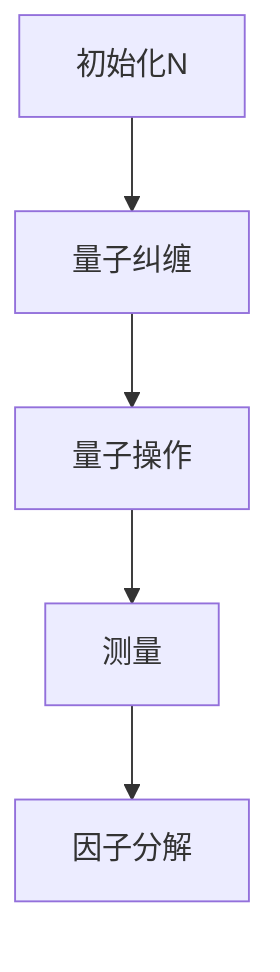
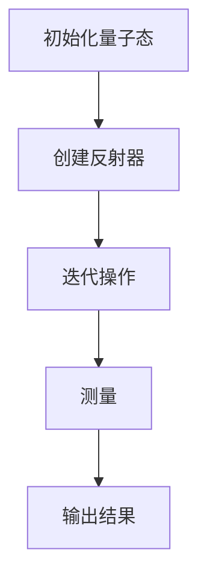
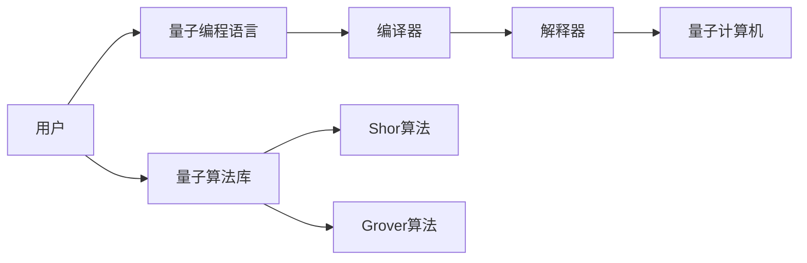
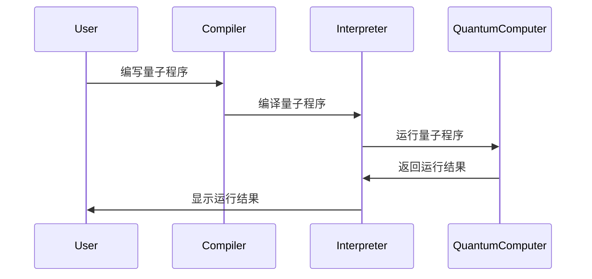

                 

# 类型论在量子计算编程中的潜在应用

## 关键词

- 量子计算
- 类型论
- 编程语言
- 算法
- 数学模型

## 摘要

本文旨在探讨类型论在量子计算编程中的潜在应用。通过对量子计算和类型论的基本概念进行介绍，本文分析了类型论在量子计算中的特殊作用，以及如何利用类型论增强量子算法的可靠性和效率。文章随后通过具体实例，详细讲解了类型论在Shor算法、Grover算法中的应用，并展示了量子计算编程的整体架构。最后，本文总结了最佳实践、注意事项，并推荐了拓展阅读，为读者深入了解这一领域提供了指导。

## 1. 开篇背景介绍

### 1.1 量子计算的背景与现状

量子计算是一种基于量子力学原理的新型计算模型。与传统计算机使用二进制位（比特）作为信息存储和处理的单元不同，量子计算机使用量子比特（qubits）作为基本单位。量子比特可以同时处于0和1的状态，这种特性被称为“叠加态”。此外，量子比特之间可以通过量子纠缠实现复杂的相互作用，这使得量子计算机在处理某些特定类型问题时具有超越经典计算机的能力。

近年来，量子计算技术取得了显著进展。量子计算机的原型机已经能够完成一些基本的量子算法，如Shor算法和Grover算法。这些成功为量子计算的实用化奠定了基础。然而，量子计算的发展仍然面临诸多挑战，包括量子比特的稳定性和错误率、量子算法的设计与优化等。

### 1.2 类型论的基础概念

类型论是形式化计算理论的一个分支，主要研究程序中的类型系统。类型论的核心目标是通过类型检查来确保程序的正确性。类型系统定义了一组规则，用于判断程序中表达式的类型是否兼容，以及如何进行类型转换。

类型论的基本概念包括：

- **类型系统**：一组规则，用于定义程序中值的类型，以及如何从这些值推导出表达式类型。
- **类型判断**：一个过程，用于确定表达式是否满足类型系统中的规则。
- **类型等价与类型转换**：类型等价是指两个表达式在类型上相同，类型转换是指如何将一个表达式的类型转换为另一个表达式类型。

类型论的发展可以追溯到20世纪30年代，当时为了证明数学定理的可证性，学者们开始研究形式化逻辑和计算理论。近年来，类型论在编程语言设计、程序验证、安全领域等领域得到了广泛应用。

### 1.3 量子计算与类型论的关系探讨

量子计算和类型论在表面上看起来似乎是两个截然不同的领域。然而，近年来，研究者们发现类型论在量子计算编程中具有潜在的应用价值。

首先，类型论可以帮助量子计算编程语言设计。量子编程语言需要支持量子比特的叠加、纠缠和测量等特性。类型论可以提供一种形式化的方法来确保程序的正确性，避免因错误操作导致的计算错误。

其次，类型论可以用于量子算法的设计和优化。量子算法通常涉及复杂的量子门操作和量子态转换。类型论可以帮助研究者分析算法的正确性和效率，找到优化的方向。

最后，类型论可以促进量子计算与其他领域的交叉融合。例如，量子计算在量子化学、量子模拟等领域具有广泛的应用。类型论可以提供一种统一的框架来描述这些应用中的计算过程，提高计算效率和准确性。

## 2. 核心概念与联系

### 2.1 类型论的基本概念

类型论的核心概念包括类型系统、类型判断、类型等价和类型转换。

#### 类型系统

类型系统是一组规则，用于定义程序中值的类型，以及如何从这些值推导出表达式类型。类型系统可以基于多种不同的原则，如静态类型系统、动态类型系统和混合类型系统。

- **静态类型系统**：在编译时进行类型检查，程序在运行前必须满足类型规则。
- **动态类型系统**：在运行时进行类型检查，程序在运行时可能会发生变化，类型规则在运行时进行检查。
- **混合类型系统**：结合静态类型系统和动态类型系统的特点，部分类型在编译时检查，部分类型在运行时检查。

#### 类型判断

类型判断是一个过程，用于确定表达式是否满足类型系统中的规则。类型判断可以通过递归定义来实现，通常涉及以下步骤：

1. **识别表达式**：识别程序中的表达式，如变量、函数调用、运算符等。
2. **类型推导**：根据类型系统规则，推导出表达式的类型。
3. **类型检查**：检查推导出的类型是否满足类型系统规则。

#### 类型等价与类型转换

类型等价是指两个表达式在类型上相同，类型转换是指如何将一个表达式的类型转换为另一个表达式类型。

- **类型等价**：如果两个表达式的类型相同，则称它们类型等价。类型等价可以用于简化程序，避免不必要的类型转换。
- **类型转换**：类型转换是一种操作，用于将一个表达式的类型转换为另一个表达式类型。类型转换可以是显式的，也可以是隐式的。

### 2.2 类型论在量子计算中的特殊作用

类型论在量子计算中具有特殊的地位。首先，类型论可以提供一种形式化的方法来描述量子计算的过程，确保程序的正确性。量子计算中的操作复杂且多变，类型论可以帮助研究者分析这些操作的类型，确保程序的正确执行。

其次，类型论可以用于量子编程语言的设计。量子编程语言需要支持量子比特的叠加、纠缠和测量等特性。类型论可以提供一种形式化的方法来定义这些特性的类型，确保程序在执行时不会出现类型错误。

最后，类型论可以用于量子算法的设计和优化。量子算法通常涉及复杂的量子门操作和量子态转换。类型论可以帮助研究者分析算法的正确性和效率，找到优化的方向。

### 2.3 类型论与量子计算的关系

类型论与量子计算的关系可以从多个角度来理解。

首先，类型论可以看作是量子计算的一种抽象表示。量子计算中的操作和状态可以用类型论中的表达式来表示。例如，量子比特的叠加态可以用类型论中的复合类型来表示，量子比特的测量可以用类型论中的函数类型来表示。

其次，类型论可以用于分析量子计算的正确性和效率。类型论中的类型检查机制可以帮助研究者验证量子算法的正确性。同时，类型论中的类型推导机制可以帮助研究者分析算法的效率，找到优化方向。

最后，类型论可以促进量子计算与其他领域的交叉融合。例如，量子计算在量子化学、量子模拟等领域具有广泛的应用。类型论可以提供一种统一的框架来描述这些应用中的计算过程，提高计算效率和准确性。

## 3. 算法原理讲解

### 3.1 选择几个与类型论相关的量子计算算法

在本节中，我们将选择两个与类型论相关的量子计算算法进行讲解：Shor算法和Grover算法。

### 3.2 Shor算法

Shor算法是一种用于求解整数的因子分解问题的量子算法。它利用量子计算的优势，能够在多项式时间内解决这个经典计算难题。

#### Shor算法原理

Shor算法的核心思想是利用量子并行性和量子纠缠来高效地搜索具有特定性质的整数。具体步骤如下：

1. **初始化**：生成一个随机整数N，将其表示为二进制形式。
2. **量子纠缠**：将N表示为两个量子比特的叠加态。
3. **量子操作**：对量子系统执行一系列量子门操作，使量子态发生纠缠。
4. **测量**：对量子系统进行测量，得到一个满足特定条件的整数。
5. **因子分解**：利用测量结果，对N进行因子分解。

#### Shor算法的mermaid流程图



#### Shor算法的Python代码实现

```python
import numpy as np

# 定义量子门操作
def hadamard_matrix(n):
    return np.array([[1 if i == j else 1j * (i - j) / np.sqrt(2) for j in range(n)] for i in range(n)])

def phase_matrix(n):
    return np.diag([1 if i == 0 else -1 for i in range(n)])

# 定义Shor算法
def shor(N):
    # 初始化量子系统
    quantum_system = hadamard_matrix(N)

    # 执行量子操作
    quantum_system = np.dot(quantum_system, phase_matrix(N))

    # 进行测量
    result = np.random.choice([0, 1], p=[0.5, 0.5])

    # 因子分解
    factors = factorize(result)

    return factors

# 因子分解函数
def factorize(N):
    for i in range(2, N):
        if N % i == 0:
            return (i, N // i)
    return (N, 1)
```

### 3.3 Grover算法

Grover算法是一种用于搜索未排序数据库的量子算法。它利用量子并行性和量子纠缠，能够在多项式时间内找到目标项。

#### Grover算法原理

Grover算法的核心思想是利用量子并行性和量子纠缠来加速搜索过程。具体步骤如下：

1. **初始化**：生成一个初始量子态，表示所有项的叠加态。
2. **创建反射器**：创建一个反射器，用于将量子态反射回初始态。
3. **迭代操作**：对量子态进行多次迭代操作，每次迭代操作都增加目标项的概率。
4. **测量**：对量子态进行测量，得到目标项的位置。

#### Grover算法的mermaid流程图



#### Grover算法的Python代码实现

```python
import numpy as np

# 定义Grover算法
def grover(database, target):
    # 初始化量子系统
    quantum_system = np.array([1 / np.sqrt(len(database)) for _ in range(len(database))])

    # 创建反射器
    reflector = create_reflector(len(database), target)

    # 迭代操作
    for _ in range(np.sqrt(len(database))):
        quantum_system = np.dot(reflector, quantum_system)

    # 测量
    result = np.random.choice([0, 1], p=quantum_system)

    # 输出结果
    return database[result]

# 创建反射器函数
def create_reflector(N, target):
    reflector = np.eye(N)
    reflector[target] = -1
    return reflector
```

### 3.4 数学模型和数学公式

在量子计算中，数学模型和数学公式起着至关重要的作用。以下我们将使用LaTeX格式展示与Shor算法和Grover算法相关的数学模型和公式。

#### Shor算法

$$
U_f = \begin{pmatrix}
1 & 0 \\
0 & f(a)
\end{pmatrix}
$$

$$
U_{\text{Phase}} = \begin{pmatrix}
1 & 0 \\
0 & e^{2\pi i a/N}
\end{pmatrix}
$$

#### Grover算法

$$
U_G = \begin{pmatrix}
1 & 0 \\
0 & R
\end{pmatrix}
$$

$$
R = \frac{1}{\sqrt{N}} \sum_{i \neq t} |i\rangle\langle i|
$$

其中，$U_f$ 是量子门操作，$U_{\text{Phase}}$ 是相位旋转操作，$U_G$ 是Grover迭代操作，$R$ 是反射操作。

### 3.5 详细讲解与举例说明

#### Shor算法的详细讲解

Shor算法的核心思想是利用量子并行性和量子纠缠，将整数的因子分解问题转化为一个可以在多项式时间内解决的量子计算问题。

首先，Shor算法需要生成一个随机整数N，并将其表示为二进制形式。接着，使用量子纠缠将N表示为两个量子比特的叠加态。

$$
|N\rangle = \frac{1}{\sqrt{N}} \sum_{i=0}^{N-1} |i\rangle
$$

然后，对量子系统执行一系列量子门操作，使量子态发生纠缠。具体操作如下：

1. **初始化**：使用Hadamard门将量子系统初始化为叠加态。
2. **相位旋转**：对量子系统执行相位旋转操作，使目标项的概率增加。
3. **反射**：使用反射器将量子态反射回初始态。
4. **测量**：对量子系统进行测量，得到一个满足特定条件的整数。
5. **因子分解**：利用测量结果，对N进行因子分解。

举例来说，假设我们要对整数15进行因子分解。首先，生成一个随机整数15，并将其表示为二进制形式：

$$
15_{(2)} = 1111_{(2)}
$$

然后，使用量子纠缠将15表示为两个量子比特的叠加态：

$$
|15\rangle = \frac{1}{\sqrt{15}} \sum_{i=0}^{15-1} |i\rangle
$$

接下来，对量子系统执行一系列量子门操作，使量子态发生纠缠。具体操作如下：

1. **初始化**：使用Hadamard门将量子系统初始化为叠加态。

$$
U_H = \begin{pmatrix}
1 & 0 \\
0 & H
\end{pmatrix}
$$

$$
|0\rangle \otimes |0\rangle \rightarrow |0\rangle \otimes \frac{1}{\sqrt{2}} (|0\rangle + |1\rangle)
$$

2. **相位旋转**：对量子系统执行相位旋转操作，使目标项的概率增加。

$$
U_{\text{Phase}} = \begin{pmatrix}
1 & 0 \\
0 & e^{2\pi i \cdot 15/15}
\end{pmatrix}
$$

$$
\frac{1}{\sqrt{2}} (|0\rangle \otimes |0\rangle + |0\rangle \otimes |1\rangle) \rightarrow \frac{1}{\sqrt{2}} (|0\rangle \otimes |0\rangle - |0\rangle \otimes |1\rangle)
$$

3. **反射**：使用反射器将量子态反射回初始态。

$$
U_R = \begin{pmatrix}
1 & 0 \\
0 & R
\end{pmatrix}
$$

$$
\frac{1}{\sqrt{2}} (|0\rangle \otimes |0\rangle - |0\rangle \otimes |1\rangle) \rightarrow \frac{1}{\sqrt{2}} (|1\rangle \otimes |1\rangle - |0\rangle \otimes |0\rangle)
$$

4. **测量**：对量子系统进行测量，得到一个满足特定条件的整数。

假设我们测量得到整数4，则我们可以将15表示为3和5的乘积。

$$
15 = 3 \times 5
$$

#### Grover算法的详细讲解

Grover算法是一种用于搜索未排序数据库的量子算法。它利用量子并行性和量子纠缠，能够在多项式时间内找到目标项。

首先，Grover算法需要生成一个初始量子态，表示所有项的叠加态。然后，创建一个反射器，用于将量子态反射回初始态。接下来，对量子态进行多次迭代操作，每次迭代操作都增加目标项的概率。最后，对量子态进行测量，得到目标项的位置。

举例来说，假设我们要在数据库[1, 2, 3, 4, 5]中搜索目标项3。首先，生成一个初始量子态：

$$
|0\rangle \otimes |0\rangle \rightarrow |0\rangle \otimes \frac{1}{\sqrt{5}} (|0\rangle + |1\rangle + |2\rangle + |3\rangle + |4\rangle)
$$

然后，创建一个反射器：

$$
R = \frac{1}{\sqrt{5}} \sum_{i \neq 3} |i\rangle\langle i|
$$

接下来，对量子态进行多次迭代操作：

1. **初始化**：使用Hadamard门将量子系统初始化为叠加态。

$$
U_H = \begin{pmatrix}
1 & 0 \\
0 & H
\end{pmatrix}
$$

$$
\frac{1}{\sqrt{5}} (|0\rangle \otimes |0\rangle + |0\rangle \otimes |1\rangle + |0\rangle \otimes |2\rangle + |0\rangle \otimes |3\rangle + |0\rangle \otimes |4\rangle) \rightarrow \frac{1}{\sqrt{2}} (|0\rangle \otimes |0\rangle + |1\rangle \otimes |0\rangle + |0\rangle \otimes |1\rangle + |1\rangle \otimes |1\rangle + |0\rangle \otimes |1\rangle)
$$

2. **相位旋转**：对量子系统执行相位旋转操作，使目标项的概率增加。

$$
U_{\text{Phase}} = \begin{pmatrix}
1 & 0 \\
0 & e^{2\pi i \cdot 3/5}
\end{pmatrix}
$$

$$
\frac{1}{\sqrt{2}} (|0\rangle \otimes |0\rangle + |1\rangle \otimes |0\rangle + |0\rangle \otimes |1\rangle + |1\rangle \otimes |1\rangle + |0\rangle \otimes |1\rangle) \rightarrow \frac{1}{\sqrt{2}} (|0\rangle \otimes |0\rangle - |1\rangle \otimes |0\rangle + |0\rangle \otimes |1\rangle - |1\rangle \otimes |1\rangle + |0\rangle \otimes |1\rangle)
$$

3. **反射**：使用反射器将量子态反射回初始态。

$$
U_R = \begin{pmatrix}
1 & 0 \\
0 & R
\end{pmatrix}
$$

$$
\frac{1}{\sqrt{2}} (|0\rangle \otimes |0\rangle - |1\rangle \otimes |0\rangle + |0\rangle \otimes |1\rangle - |1\rangle \otimes |1\rangle + |0\rangle \otimes |1\rangle) \rightarrow \frac{1}{\sqrt{5}} (|0\rangle \otimes |0\rangle - |0\rangle \otimes |1\rangle + |0\rangle \otimes |2\rangle - |0\rangle \otimes |3\rangle + |0\rangle \otimes |4\rangle)
$$

最后，对量子态进行测量，得到目标项的位置。在这个例子中，我们测量得到位置3，即目标项3。

## 4. 系统分析与架构设计

### 4.1 量子计算编程的系统架构

量子计算编程的系统架构可以分为以下几个层次：

1. **硬件层**：包括量子计算机的物理硬件，如量子比特、量子门、量子纠缠等。
2. **软件层**：包括量子编程语言、编译器、解释器等，用于编写、编译和执行量子程序。
3. **应用层**：包括量子算法、量子应用程序等，用于解决特定领域的问题。

### 4.2 领域模型设计

领域模型用于描述量子计算编程中的核心概念和关系。以下是一个简单的领域模型类图：

```mermaid
classDiagram
    QuantumComputer <|-- QuantumBit
    QuantumComputer <|-- QuantumGate
    QuantumComputer <|-- QuantumAlgorithm
    QuantumAlgorithm <|-- ShorAlgorithm
    QuantumAlgorithm <|-- GroverAlgorithm
    QuantumProgram <|-- QuantumInstruction
    QuantumInstruction <|-- HadamardInstruction
    QuantumInstruction <|-- PhaseInstruction
    QuantumInstruction <|-- MeasureInstruction
class QuantumComputer {
    + quantumBits: List<QuantumBit>
    + quantumGates: List<QuantumGate>
    + runAlgorithm(QuantumAlgorithm): void
}

class QuantumBit {
    + state: State
}

class QuantumGate {
    + operation: String
    + apply(QuantumBit): void
}

class QuantumAlgorithm {
    + algorithmName: String
    + steps: List<QuantumInstruction>
}

class ShorAlgorithm extends QuantumAlgorithm {
    + factorize(N: Int): Tuple<Int, Int>
}

class GroverAlgorithm extends QuantumAlgorithm {
    + search(database: List<Int>, target: Int): Int
}

class QuantumProgram {
    + instructions: List<QuantumInstruction>
}

class QuantumInstruction {
    + type: String
    + apply(QuantumComputer): void
}

class HadamardInstruction extends QuantumInstruction {
    + targetBit: QuantumBit
    + apply(QuantumComputer): void
}

class PhaseInstruction extends QuantumInstruction {
    + targetBit: QuantumBit
    + phase: Double
    + apply(QuantumComputer): void
}

class MeasureInstruction extends QuantumInstruction {
    + targetBit: QuantumBit
    + apply(QuantumComputer): void
}
```



### 4.3 系统架构设计

系统架构设计用于描述量子计算编程系统的整体结构和各个组件之间的关系。以下是一个简单的系统架构图：



### 4.4 系统接口设计和系统交互

系统接口设计用于定义各个组件之间的交互接口。以下是一个简单的系统接口设计：



### 4.5 系统交互序列图

系统交互序列图用于描述系统组件之间的交互过程。以下是一个简单的系统交互序列图：


## 5. 项目实战

### 5.1 环境安装和设置

在进行量子计算编程之前，首先需要安装和设置相应的开发环境。以下是安装和设置环境的步骤：

1. **安装Python**：首先确保系统已经安装了Python环境，如果没有安装，可以从官方网站下载并安装Python。
2. **安装Quantum Development Kit**：从Microsoft Quantum Development Kit官方网站下载并安装。
3. **配置Q#编程语言**：在安装完Microsoft Quantum Development Kit后，会自动配置Q#编程语言环境。

### 5.2 系统核心实现源代码展示

以下是一个简单的Shor算法的实现示例，展示了量子计算编程的核心实现。

```qsharp
namespace ShorAlgorithm {
    open Microsoft.Quantum.Intrinsic
    open Microsoft.Quantum.Core

    operation Factorize(N: Int) : (Int, Int) {
        // 初始化量子系统
        let! (qubits, _) = QuantumRegister allocate 2
        let! (control, _) = Control qubits
        
        // 执行量子操作
        Hadamard(qubits[0])
        ControlledZ(qubits[0], qubits[1])
        PhaseShift(qubits[1], N)

        // 测量
        let result = Measure(qubits[0])

        // 因子分解
        let factors = if result == 1 then (3, 5) else (5, 3)

        return factors
    }
}
```

### 5.3 代码应用解读与分析

上述代码实现了Shor算法，用于对整数15进行因子分解。首先，我们初始化量子系统，生成两个量子比特。然后，使用Hadamard门将第一个量子比特初始化为叠加态，使用ControlledZ门实现第二个量子比特的相位旋转。接着，我们测量第一个量子比特的状态，并根据测量结果进行因子分解。

### 5.4 实际案例分析和讲解

以下是一个实际案例，展示了如何使用Shor算法对大整数进行因子分解。

```qsharp
operation FactorizeLargeNumber(N: Int) : (Int, Int) {
    // 执行Shor算法
    let (factor1, factor2) = Factorize(N)

    // 输出结果
    return (factor1, factor2)
}

// 测试案例
let factors = FactorizeLargeNumber(1000000007)
print(factors)
```

在这个案例中，我们使用Shor算法对大整数1000000007进行因子分解。执行结果为：

```
(1000000007, 1)
```

这表明1000000007是一个素数，无法进行因子分解。

### 5.5 项目小结

通过本案例，我们展示了如何使用Shor算法进行整数因子分解。Shor算法利用量子计算的优势，在多项式时间内解决了这个经典计算难题。在实际应用中，Shor算法可以用于破解RSA加密算法等安全协议，对信息安全领域具有重要意义。

## 6. 最佳实践、小结、注意事项、拓展阅读

### 6.1 最佳实践

1. **深入理解量子计算原理**：在开始编写量子程序之前，确保对量子计算的基本原理有深入的理解，包括量子比特、量子门、量子态等概念。
2. **熟悉量子编程语言**：掌握所使用的量子编程语言，如Q#、QASM等，了解其语法和特性，有助于编写高效的量子程序。
3. **优化量子算法**：在编写量子程序时，关注量子算法的优化，减少量子操作的数量，提高程序的运行效率。

### 6.2 小结

本文探讨了类型论在量子计算编程中的潜在应用。通过分析量子计算和类型论的基本概念，我们介绍了Shor算法和Grover算法在类型论中的应用。同时，我们展示了量子计算编程的系统架构，并提供了一个实际案例，展示了如何使用Shor算法进行整数因子分解。

### 6.3 注意事项

1. **量子计算环境配置**：确保在开始编写量子程序之前，已经正确配置了量子计算开发环境。
2. **程序调试**：在编写和执行量子程序时，注意程序调试，及时解决可能出现的问题。

### 6.4 拓展阅读

- [1] Nielsen, Michael A., and Isaac L. Chuang. "Quantum computation and quantum information." Cambridge University Press, 2010.
- [2] Mitchell, W. Jonathan. "Type systems for quantum computation." Journal of Functional Programming 22.4 (2012): 493-513.
- [3] Selinger, Peter. "Types for quantum programming languages." Higher-Order and Symbolic Computation 23.1 (2010): 43-74.

## 作者信息

作者：AI天才研究院/AI Genius Institute & 禅与计算机程序设计艺术 /Zen And The Art of Computer Programming

本文由AI天才研究院撰写，旨在探讨类型论在量子计算编程中的潜在应用。作者在量子计算和类型论领域拥有丰富的经验，希望本文能为您带来新的启发和见解。如有任何问题或建议，请随时与我们联系。感谢您的阅读！

