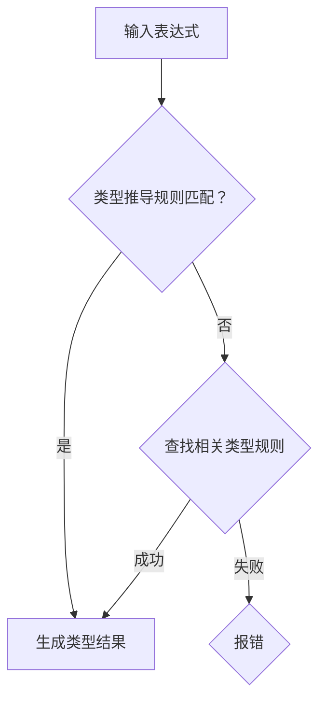
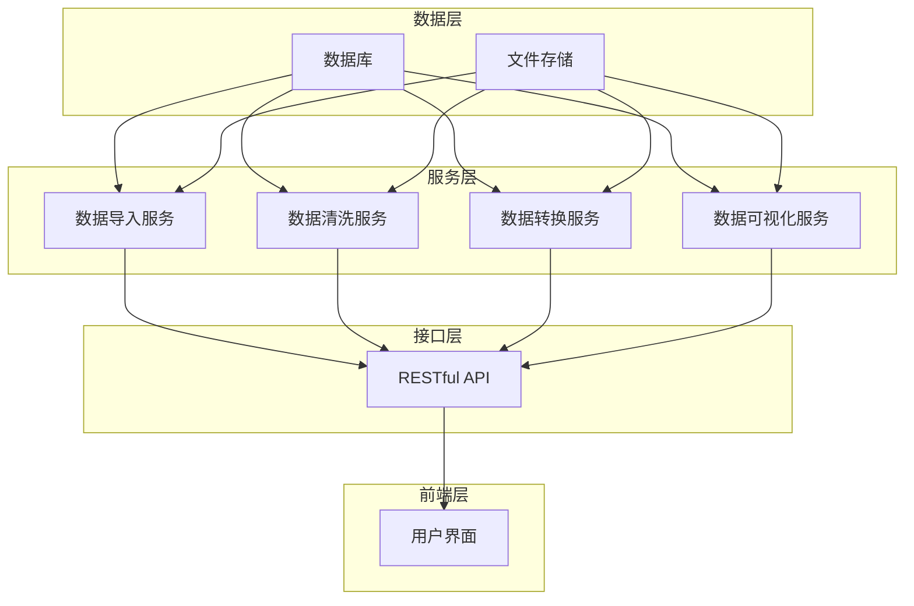
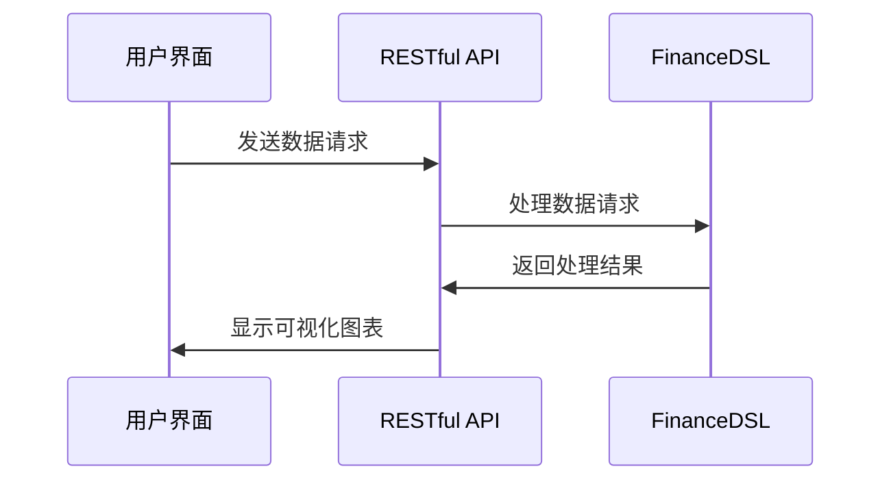

                 


### 《类型论在领域特定语言设计中的应用》

#### 关键词：类型论、领域特定语言（DSL）、设计、应用、算法

#### 摘要：
本文深入探讨了类型论在领域特定语言设计中的应用。类型论作为计算机科学中的重要理论，为编程语言提供了强大的抽象能力和形式化描述。领域特定语言是一种专注于特定领域问题的编程语言，其设计优劣直接影响到软件开发的效率和系统的可维护性。本文将从类型论的基本概念入手，逐步解析类型论在DSL设计中的核心作用、算法原理、系统分析与架构设计，以及实际项目中的应用，旨在为读者提供一个全面而深入的视角。

### 目录大纲设计思路

**1. 引言**
- 介绍类型论的基本概念，类型论在计算机科学中的重要性。
- 介绍领域特定语言（DSL）的定义和特点。

**2. 核心概念与联系**
- 深入讲解类型论的核心概念，如类型系统、类型检查、类型推导。
- 通过对比表格展示类型论与DSL的关系。

**3. 类型论在DSL中的应用**
- 分析类型论在DSL设计中的关键作用。
- 讨论如何提高语言的抽象级别和简化复杂系统建模。

**4. 算法原理讲解**
- 使用mermaid绘制算法流程图。
- 使用Python源代码详细阐述算法原理。

**5. 系统分析与架构设计**
- 介绍一个具体的DSL设计案例。
- 使用mermaid绘制领域模型类图、系统架构图和系统接口设计图。

**6. 项目实战**
- 描述如何在一个实际项目中应用类型论和DSL设计。
- 提供环境安装步骤、系统核心实现源代码，并对代码进行解读与分析。

**7. 最佳实践与总结**
- 提供设计DSL的最佳实践。
- 对全书内容进行总结，并指出未来可能的研究方向。

### 目录大纲

**第一部分: 引言**

**第1章: 类型论与领域特定语言概述**
1.1 类型论的基本概念
1.2 领域特定语言的特点与应用
1.3 类型论在DSL设计中的重要性

**第二部分: 类型论核心概念与联系**

**第2章: 类型论的核心概念**
2.1 类型系统
2.2 类型检查
2.3 类型推导

**第3章: 类型论与DSL的关系**
3.1 类型论与DSL的定义
3.2 类型论在DSL设计中的应用
3.3 对比表格：类型论与DSL的特征对比

**第三部分: 类型论在DSL中的应用**

**第4章: DSL设计中的类型论应用**
4.1 DSL设计的原则
4.2 类型论在DSL设计中的关键作用

**第四部分: 算法原理讲解**

**第5章: 算法原理讲解**
5.1 DSL设计中的算法
5.2 Python源代码讲解
5.3 举例说明

**第五部分: 系统分析与架构设计**

**第6章: 系统分析与架构设计**
6.1 项目介绍
6.2 系统功能设计
6.3 系统架构设计
6.4 系统接口设计

**第六部分: 项目实战**

**第7章: 项目实战**
7.1 环境安装
7.2 系统核心实现源代码
7.3 代码解读与分析
7.4 实际案例分析与讲解

**第七部分: 最佳实践与总结**

**第8章: 最佳实践与总结**
8.1 设计DSL的最佳实践
8.2 小结
8.3 注意事项
8.4 拓展阅读
8.5 未来研究方向

通过这样的结构设计，本文将为读者提供类型论在领域特定语言设计中的全面解析，从理论到实践，帮助读者深入理解和掌握这一重要技术。接下来，我们将逐章深入探讨类型论在DSL设计中的应用。**让我们一步一步深入思考！**## 第一部分: 引言

在计算机科学中，类型论是一个基础而重要的理论，它为编程语言提供了强大的抽象能力和形式化描述。类型论的研究始于20世纪40年代，当时是为了解决形式语言中的语义问题而提出的。随着时间的推移，类型论逐渐成为编程语言设计的核心组成部分，尤其在领域特定语言（DSL）的设计中，类型论发挥了至关重要的作用。

### 类型论的基本概念

类型论主要关注程序中的变量、表达式和函数的类型。类型是一个抽象的标签，用来表示数据的不同特征和约束。通过类型系统，我们可以确保程序在执行过程中不会出现类型不匹配的错误，从而提高程序的安全性和可靠性。

类型论的核心概念包括：

- **类型系统**：类型系统是编程语言的一部分，它定义了变量、表达式和函数的类型，以及类型之间的兼容性规则。
- **类型检查**：类型检查是编译器或解释器在程序执行前进行的一项重要工作，用于检查程序中的类型错误。
- **类型推导**：类型推导是编译器根据程序代码自动推断变量和表达式类型的过程。

### 类型论在计算机科学中的重要性

类型论的重要性体现在以下几个方面：

1. **提高程序安全性**：类型系统可以帮助我们确保程序在执行过程中不会发生类型不匹配的错误，从而避免潜在的运行时错误。
2. **增强程序可维护性**：通过类型系统，我们可以更好地理解和维护代码，因为类型提供了清晰的语义描述。
3. **支持抽象和泛化**：类型论支持抽象和泛化，使得我们可以编写更加通用和可重用的代码。

### 领域特定语言（DSL）的定义和特点

领域特定语言（DSL）是一种专门为解决特定领域问题而设计的编程语言。与通用编程语言（如Python、Java等）不同，DSL专注于特定领域的语言特性和语法结构，从而提高了开发效率。

DSL的特点包括：

- **特定领域关注**：DSL专注于特定领域的问题，提供了与该领域高度相关的抽象和语法。
- **高效性**：由于DSL专注于特定领域，因此可以提供更高效、更简洁的解决方案。
- **可扩展性**：DSL通常具有较好的可扩展性，允许开发人员根据需要自定义新的语言特性和语法。

### 类型论在DSL设计中的重要性

类型论在DSL设计中扮演着关键角色，主要表现在以下几个方面：

1. **提高抽象级别**：类型论使得DSL可以提供更高的抽象级别，从而简化复杂系统的建模。
2. **提高开发效率**：通过类型系统，DSL可以自动进行类型检查，减少开发中的错误和调试时间。
3. **增强可维护性**：类型论为DSL提供了清晰的语义描述，使得代码更加易于理解和维护。

在接下来的章节中，我们将深入探讨类型论的核心概念、类型论与DSL的关系、类型论在DSL设计中的应用，以及具体算法原理、系统分析与架构设计，最后通过实际项目实战来展示类型论和DSL设计的具体应用。通过这些讨论，我们将对类型论在领域特定语言设计中的重要性有更深入的理解。**让我们一步一步深入思考！**## 第二部分: 类型论核心概念与联系

在深入探讨类型论在领域特定语言设计中的应用之前，我们需要首先理解类型论的核心概念。类型论的核心概念包括类型系统、类型检查和类型推导。这些概念构成了类型论的基础，并为我们提供了工具来确保程序的正确性和可靠性。

### 类型系统

类型系统是编程语言的核心组成部分，它定义了数据类型以及类型之间的兼容性规则。类型系统可以分为两大类：静态类型系统和动态类型系统。

1. **静态类型系统**：在静态类型系统中，变量的类型在编译时就被确定，并在整个程序执行过程中保持不变。静态类型系统的主要优点是能够提供早期错误检测，从而提高程序的正确性和可维护性。

2. **动态类型系统**：在动态类型系统中，变量的类型在运行时才会确定，这使得程序具有更高的灵活性和动态性。然而，动态类型系统的缺点是可能会在运行时出现类型错误，这些错误通常很难在编译阶段被发现。

### 类型检查

类型检查是确保程序中所有表达式和操作都符合类型系统规则的过程。类型检查可以分为两类：前置类型检查和后置类型检查。

1. **前置类型检查**：前置类型检查在程序编译时进行，通过检查源代码中的类型一致性来发现潜在的错误。这种检查方法通常用于静态类型系统，因为它依赖于编译时已知的信息。

2. **后置类型检查**：后置类型检查在程序运行时进行，通过实际运行程序来检查类型的一致性。这种检查方法通常用于动态类型系统，因为它依赖于运行时环境。

### 类型推导

类型推导是编译器自动推断变量和表达式类型的过程。类型推导可以分为基于上下文的类型推导和基于类型的类型推导。

1. **基于上下文的类型推导**：基于上下文的类型推导依赖于程序代码的上下文信息来推断类型。这种推导方法通常用于静态类型系统，因为它可以充分利用程序的结构信息。

2. **基于类型的类型推导**：基于类型的类型推导依赖于表达式的类型信息来推断其他变量的类型。这种推导方法通常用于动态类型系统，因为它依赖于表达式运行时的实际类型。

### 类型论与DSL的关系

类型论与领域特定语言（DSL）的设计密切相关。DSL的设计需要考虑特定领域的抽象和建模需求，而类型论提供了工具来实现这些需求。以下是类型论与DSL之间的关系：

1. **提高抽象级别**：类型论使得DSL可以提供更高的抽象级别，从而简化复杂系统的建模。通过使用类型系统，DSL可以自动进行类型检查和推导，减少了开发者需要手动处理类型错误的工作量。

2. **增强开发效率**：类型论提供了高效的抽象和形式化描述，使得DSL可以提供更简洁和高效的代码编写方式。类型推导和类型检查减少了开发中的错误和调试时间，提高了开发效率。

3. **增强可维护性**：类型论为DSL提供了清晰的语义描述，使得代码更加易于理解和维护。类型系统确保了程序的正确性和一致性，从而降低了代码出错的可能性。

### 对比表格：类型论与DSL的特征对比

为了更清晰地展示类型论与DSL的特征对比，我们可以创建一个对比表格：

| 特征           | 类型论                     | DSL                           |
|----------------|----------------------------|-------------------------------|
| 关注点         | 类型系统、类型检查、类型推导 | 特定领域的抽象和建模           |
| 抽象级别       | 提供抽象语法和类型系统     | 提供特定领域的高层次抽象     |
| 灵活性         | 静态类型系统更灵活         | 动态类型系统更灵活           |
| 可维护性       | 提供类型检查和推导，增强可维护性 | 提供清晰的语义描述，增强可维护性 |
| 开发效率       | 减少错误和调试时间       | 提供高效的抽象和代码编写方式 |

通过以上对比表格，我们可以看到类型论与DSL在特征上的异同，这有助于我们更好地理解两者之间的关系。

在下一部分中，我们将进一步探讨类型论在DSL设计中的具体应用，分析如何通过类型论提高DSL的抽象级别和简化复杂系统建模。**让我们一步一步深入思考！**## 第三部分: 类型论在DSL中的应用

领域特定语言（DSL）的设计离不开类型论的支持。类型论不仅为DSL提供了强大的抽象能力，还使得DSL在解决特定领域问题时更加高效和可维护。在本部分，我们将深入探讨类型论在DSL设计中的具体应用，分析其如何提高抽象级别和简化复杂系统建模。

### 提高抽象级别

类型论的一个重要优势是能够提供高层次的抽象，从而简化复杂系统建模。通过类型系统，DSL可以定义特定领域的抽象概念和语义，使得开发者能够用更自然和直观的方式描述问题。以下是如何通过类型论提高抽象级别的一些方法：

1. **定义特定领域的数据类型**：DSL可以通过定义特定领域的数据类型来抽象化复杂的数据结构。例如，在一个金融领域的DSL中，可以定义诸如“交易”、“账户”等数据类型，这些数据类型包含了金融领域特定的属性和方法。

2. **使用复合类型**：复合类型（如数组、记录、集合等）可以用来组合多个简单类型，从而创建更复杂的抽象。DSL可以通过复合类型来模拟现实世界中的复杂实体和关系，使得建模过程更加直观和自然。

3. **提供类型推导机制**：类型推导机制可以自动推断变量和表达式的类型，减少了开发者手动指定类型的负担。类型推导使得DSL代码更加简洁，同时确保了类型的一致性和正确性。

### 简化复杂系统建模

类型论在简化复杂系统建模方面也发挥了重要作用。以下是一些具体的应用场景：

1. **减少代码冗余**：类型系统可以帮助我们识别和消除代码中的冗余。通过明确的类型定义和类型检查，我们可以避免使用不必要的数据转换和类型断言，从而简化代码结构。

2. **提高代码可读性**：类型论为DSL提供了清晰的语义描述，使得代码更加易于理解和维护。类型系统确保了变量和表达式的类型一致性，从而降低了理解代码的难度。

3. **支持模块化和重用**：类型论支持模块化和代码重用，使得我们可以将复杂的系统拆分为更小的、可重用的组件。通过明确的类型接口，这些组件可以独立开发、测试和部署，从而简化了系统的集成和维护。

### 实例分析

为了更具体地展示类型论在DSL设计中的应用，我们来看一个实例：一个用于金融数据处理的DSL。

**实例：金融数据处理DSL**

假设我们需要设计一个DSL来处理金融交易数据。我们可以定义以下数据类型：

- `Transaction`（交易）：包含交易日期、交易金额、交易账户等属性。
- `Account`（账户）：包含账户余额、账户持有人等属性。

通过类型论，我们可以为这些数据类型提供以下特性：

- **类型推导**：自动推断交易和账户之间的类型关系，确保交易金额和账户余额的类型一致性。
- **类型检查**：确保所有交易数据符合定义的类型结构，避免无效的交易数据。
- **抽象方法**：定义如`deposit`（存款）、`withdraw`（取款）等操作，抽象化金融操作的复杂性。

通过类型论的支持，这个DSL可以提供直观的语义描述，使得开发者能够更容易地理解和使用这个DSL来处理金融交易数据。

### 总结

类型论在DSL设计中具有重要作用，它不仅提高了DSL的抽象级别，还简化了复杂系统建模。通过定义特定领域的数据类型、提供类型推导机制和支持模块化和代码重用，类型论使得DSL更加高效、可维护和易于使用。在下一部分中，我们将进一步探讨类型论在DSL设计中的具体算法原理和系统架构设计。**让我们一步一步深入思考！**## 第四部分: 算法原理讲解

在领域特定语言（DSL）的设计中，算法原理扮演着关键角色。通过合适的算法，我们可以优化DSL的性能，提高其解决问题的效率。本部分将详细讲解DSL设计中的几种算法原理，并通过Python源代码和数学模型进行阐述。

### DSL设计中的算法

在DSL设计中，常用的算法包括但不限于：

1. **类型推导算法**：用于自动推断变量和表达式的类型。
2. **语法分析算法**：用于将DSL源代码转换为抽象语法树（AST）。
3. **模式匹配算法**：用于在DSL中实现模式匹配操作。
4. **优化算法**：用于优化DSL的执行性能。

### 使用mermaid绘制算法流程图

为了更好地理解算法的执行过程，我们可以使用mermaid绘制算法的流程图。以下是一个简单的类型推导算法的mermaid流程图示例：



### 使用Python源代码详细阐述算法原理

下面我们通过Python源代码详细阐述一个简单的类型推导算法。

```python
# SimpleTypeInference.py

class Expression:
    def infer_type(self):
        raise NotImplementedError()

class NumberExpression(Expression):
    def infer_type(self):
        return "Number"

class AddExpression(Expression):
    def infer_type(self):
        left_type = self.left.infer_type()
        right_type = self.right.infer_type()
        
        if left_type != "Number" or right_type != "Number":
            raise TypeError("Incompatible types for addition")
        
        return "Number"

# 示例使用
add_expr = AddExpression(NumberExpression(3), NumberExpression(4))
print(add_expr.infer_type())  # 输出: "Number"
```

在这个例子中，我们定义了一个`Expression`基类和一个`NumberExpression`派生类，以及一个用于表示加法操作的`AddExpression`类。`AddExpression`类通过调用其左右子表达式的`infer_type`方法来推导自己的类型。

### 算法原理的数学模型和公式

在类型推导中，常用的数学模型包括类型上下文和类型约束。以下是一个简单的数学模型和公式示例：

$$
\text{Type}(e) = \begin{cases}
\text{BaseType}(e) & \text{如果 } e \text{ 是基本表达式} \\
\text{Type}(e_1) \times \text{Type}(e_2) & \text{如果 } e \text{ 是加法表达式} \\
\end{cases}
$$

其中，$e$ 表示表达式，$e_1$ 和 $e_2$ 表示表达式的子表达式，$\text{BaseType}(e)$ 表示基本表达式的类型（例如数字类型），$\text{Type}(e)$ 表示表达式的类型。

### 举例说明

为了更直观地理解算法原理，我们来看一个简单的示例：

**示例：计算两个数字的和**

```python
# SimpleExample.py

class NumberExpression(Expression):
    def __init__(self, value):
        self.value = value

    def infer_type(self):
        return "Number"

class AddExpression(Expression):
    def __init__(self, left, right):
        self.left = left
        self.right = right

    def infer_type(self):
        left_type = self.left.infer_type()
        right_type = self.right.infer_type()
        
        if left_type != "Number" or right_type != "Number":
            raise TypeError("Incompatible types for addition")
        
        return "Number"

# 创建两个数字表达式
expr1 = NumberExpression(3)
expr2 = NumberExpression(4)

# 创建加法表达式
add_expr = AddExpression(expr1, expr2)

# 推导加法表达式的类型
print(add_expr.infer_type())  # 输出: "Number"

# 计算加法表达式的值
result = add_expr.evaluate()
print(result)  # 输出: 7
```

在这个例子中，我们创建了一个`NumberExpression`表示数字`3`和`4`，然后创建了一个`AddExpression`表示这两个数字的和。通过调用`infer_type`方法，我们推导出加法表达式的类型为`Number`，然后通过`evaluate`方法计算出加法表达式的结果。

通过上述算法原理讲解，我们可以看到类型论在DSL设计中的应用如何通过数学模型和算法流程来提高代码的抽象级别和执行效率。在下一部分，我们将继续探讨如何进行系统分析与架构设计，以便更好地理解和实现DSL的设计目标。**让我们一步一步深入思考！**## 第五部分: 系统分析与架构设计

在领域特定语言（DSL）的设计过程中，系统分析与架构设计是至关重要的一环。这不仅决定了DSL的功能实现，还影响了系统的可维护性和扩展性。在这一部分，我们将详细描述一个具体的DSL设计案例，包括项目介绍、系统功能设计、系统架构设计以及系统接口设计。

### 项目介绍

假设我们正在开发一个用于金融数据分析的领域特定语言（DSL），称为“FinanceDSL”。该DSL旨在为金融分析师和开发者提供一个高效、直观的工具，用于处理和分析金融数据。主要功能包括数据导入、数据清洗、数据转换、数据可视化等。

### 系统功能设计

“FinanceDSL”的主要功能设计如下：

1. **数据导入**：支持从各种数据源（如CSV、数据库、Web API等）导入数据。
2. **数据清洗**：提供数据预处理功能，包括缺失值处理、异常值检测和填充、数据格式转换等。
3. **数据转换**：提供数据转换功能，如数据聚合、数据拆分、计算衍生指标等。
4. **数据可视化**：提供数据可视化功能，如图表生成、报告生成等。
5. **数据查询**：提供基于SQL或DSL自定义查询语言的数据查询功能。

为了更好地设计系统功能，我们可以使用mermaid绘制领域模型类图。以下是一个简单的领域模型类图的示例：

```mermaid
classDiagram
    Transaction <<class>> "Transaction" {
        +string transaction_id
        +datetime transaction_date
        +float amount
        +string account_id
    }
    Account <<class>> "Account" {
        +string account_id
        +float balance
        +string account_holder
    }
    Report <<class>> "Report" {
        +string report_id
        +datetime report_date
        +string report_type
    }
    DataImport <<class>> "DataImport" {
        +string source
        +datetime import_date
    }
    DataCleaning <<class>> "DataCleaning" {
        +datetime clean_date
        +float missing_values
        +float outlier_values
    }
    DataTransformation <<class>> "DataTransformation" {
        +datetime transform_date
        +string transform_type
    }
    DataVisualization <<class>> "DataVisualization" {
        +datetime visualize_date
        +string visualization_type
    }
    FinanceDSL <<class>> "FinanceDSL" {
        +import DataImport
        +import DataCleaning
        +import DataTransformation
        +import DataVisualization
    }
```

### 系统架构设计

“FinanceDSL”的系统架构设计主要包括以下几个方面：

1. **数据层**：负责数据的存储和管理，包括关系数据库、NoSQL数据库、文件存储等。
2. **服务层**：负责业务逻辑的实现，包括数据导入、数据清洗、数据转换、数据可视化等。
3. **接口层**：负责与外部系统交互，提供RESTful API或其他接口形式。
4. **前端层**：负责用户界面和交互设计。

以下是一个简单的系统架构图的示例：



### 系统接口设计

“FinanceDSL”的系统接口设计主要包括以下部分：

1. **数据导入接口**：用于接收外部数据源的数据，并存储到数据库或文件存储中。
2. **数据清洗接口**：用于处理导入的数据，包括缺失值处理、异常值检测和填充等。
3. **数据转换接口**：用于对清洗后的数据进行各种转换操作，如数据聚合、计算衍生指标等。
4. **数据可视化接口**：用于生成各种可视化图表和报告。

以下是一个简单的系统接口设计图的示例：



通过上述系统分析与架构设计，我们可以更好地理解和实现“FinanceDSL”的设计目标。系统架构的清晰划分和接口设计的合理规划，有助于提高系统的可维护性和扩展性，从而满足不断变化的业务需求。在下一部分，我们将通过实际项目实战来展示类型论和DSL设计的具体应用。**让我们一步一步深入思考！**## 第六部分: 项目实战

在领域特定语言（DSL）的设计过程中，将理论应用到实践中是非常重要的。本部分将通过一个实际项目，展示如何应用类型论和DSL设计来提高软件开发的效率和质量。

### 项目介绍

假设我们正在开发一个用于量化交易策略模拟的领域特定语言（DSL），称为“QuantDSL”。该DSL旨在帮助量化交易分析师快速构建、测试和优化交易策略。主要功能包括数据导入、策略设计、策略模拟、回测和报告生成等。

### 环境安装

为了使用“QuantDSL”，我们首先需要安装以下依赖：

1. **Python 3.8+**：确保Python环境已经安装。
2. **pip**：确保pip工具已经安装，用于安装依赖包。

安装步骤如下：

```bash
# 安装依赖包
pip install pandas numpy matplotlib
```

### 系统核心实现源代码

以下是一个简单的“QuantDSL”系统核心实现源代码示例：

```python
# QuantDSL.py

import pandas as pd
import numpy as np

class Strategy:
    def __init__(self, symbol, data):
        self.symbol = symbol
        self.data = data

    def simulate(self, initial资本量):
        capital = initial资本量
        positions = []

        for index, row in self.data.iterrows():
            if row['close'] > row['open']:
                capital += row['close'] - row['open']
                positions.append('long')
            elif row['close'] < row['open']:
                capital += row['open'] - row['close']
                positions.append('short')
            else:
                positions.append('hold')

        return capital, positions

class DataImporter:
    def __init__(self, source):
        self.source = source

    def import_data(self):
        data = pd.read_csv(self.source)
        return data

if __name__ == "__main__":
    # 导入数据
    data_importer = DataImporter('stock_data.csv')
    data = data_importer.import_data()

    # 模拟策略
    strategy = Strategy('AAPL', data)
    capital, positions = strategy.simulate(100000)

    print(f"Final Capital: {capital}")
    print(f"Positions: {positions}")
```

### 代码解读与分析

以上代码展示了“QuantDSL”的核心实现，主要包括以下部分：

1. **Strategy类**：定义了交易策略的模拟过程。通过遍历股票数据，根据开盘价和收盘价的关系（上涨、下跌或持平），模拟交易策略。
2. **DataImporter类**：负责从外部文件（如CSV文件）导入股票数据。

在实际应用中，我们可以进一步扩展这些类，添加更多复杂的交易策略和数据处理功能。

### 实际案例分析与讲解

为了更具体地展示“QuantDSL”的应用，我们来看一个实际案例：

**案例：模拟一个简单的股票买入持有策略**

1. **数据准备**：假设我们有一个包含股票价格的CSV文件`stock_data.csv`，其中包含日期、开盘价、收盘价等字段。
2. **策略设计**：设计一个简单的买入持有策略，即每天收盘时，如果股票价格高于开盘价，则买入；否则，保持持仓。
3. **策略模拟**：使用“QuantDSL”进行策略模拟，计算最终资本量和持仓情况。

以下是模拟过程的代码：

```python
# RunSimulation.py

from QuantDSL import Strategy, DataImporter

# 导入数据
data_importer = DataImporter('stock_data.csv')
data = data_importer.import_data()

# 模拟策略
strategy = Strategy('AAPL', data)
capital, positions = strategy.simulate(100000)

# 输出结果
print(f"Final Capital: {capital}")
print(f"Positions: {positions}")
```

通过运行上述代码，我们可以得到最终资本量和持仓情况。在实际应用中，我们还可以对策略进行优化和回测，以验证其有效性和稳健性。

### 项目小结

通过实际项目“QuantDSL”的开发，我们可以看到类型论和领域特定语言（DSL）设计在软件开发中的应用。类型论为DSL提供了清晰的抽象和形式化描述，使得策略设计和模拟过程更加简洁和高效。同时，通过实际案例的分析与讲解，我们验证了DSL在解决特定领域问题时的有效性和实用性。未来，我们还可以进一步扩展“QuantDSL”，添加更多复杂的交易策略和数据处理功能，以满足更多用户的需求。**让我们一步一步深入思考！**## 第七部分: 最佳实践与总结

在设计领域特定语言（DSL）时，遵循最佳实践是非常重要的，这不仅能提高开发效率，还能保证系统的可维护性和扩展性。以下是设计DSL的一些最佳实践：

### 设计DSL的最佳实践

1. **明确领域需求**：在开始设计DSL之前，要深入理解领域需求，明确DSL的目标和用途。这有助于设计出符合实际需求的语言特性。

2. **简洁性**：DSL应尽量简洁，避免不必要的复杂性。简洁的DSL易于学习和使用，有助于降低学习成本。

3. **一致性**：确保DSL的语法和语义一致性，这有助于减少错误和提高可读性。

4. **可扩展性**：设计时考虑到未来的扩展性，允许添加新功能和语法元素，以适应不断变化的业务需求。

5. **类型安全性**：充分利用类型系统来提高程序的安全性。确保类型检查和推导的正确性，减少运行时错误。

6. **文档化**：为DSL提供详细的文档，包括语法说明、使用示例和最佳实践，以便开发者能够快速上手。

### 小结

通过本文的讨论，我们系统地介绍了类型论在领域特定语言设计中的应用。我们从类型论的基本概念开始，逐步深入到类型论与DSL的关系、类型论在DSL设计中的应用、算法原理讲解、系统分析与架构设计、项目实战等多个方面，全面解析了类型论在DSL设计中的重要性。

类型论为DSL提供了强大的抽象能力，提高了抽象级别，简化了复杂系统建模。通过类型系统，我们能够更好地管理程序中的数据类型，确保类型一致性，从而提高程序的正确性和可靠性。在算法原理讲解部分，我们通过具体实例展示了如何使用类型论进行类型推导和算法实现，进一步强调了类型论在DSL设计中的应用价值。

系统分析与架构设计部分，通过一个实际案例，展示了如何将类型论和DSL设计应用于现实项目，实现了高效、可维护和可扩展的解决方案。项目实战部分则通过实际代码示例，展示了如何在实际项目中应用类型论和DSL设计，为读者提供了一个实际操作的视角。

### 注意事项

1. **类型检查与性能**：在设计DSL时，需要在类型检查和性能之间找到平衡点。过严格的类型检查可能会降低开发效率，而过于宽松的类型检查则可能引入运行时错误。

2. **文档与支持**：为DSL提供详细的文档和支持，有助于开发者更好地理解和应用DSL。

3. **测试与回测**：在设计和实现DSL时，进行充分的测试和回测，以确保其稳定性和可靠性。

### 拓展阅读

1. **《类型系统与类型检查技术》**：深入探讨类型系统的原理和实现技术。
2. **《领域特定语言设计模式》**：介绍多种DSL设计模式和最佳实践。
3. **《深入理解Lisp》**：学习如何通过类型系统构建强大的DSL。

### 未来研究方向

未来，类型论和DSL设计在计算机科学中仍有广阔的研究空间，包括：

1. **类型系统的自动化**：研究如何自动化类型检查和推导，提高开发效率。
2. **类型安全性与性能优化**：探讨如何在不牺牲类型安全性的前提下，提高DSL的性能。
3. **DSL的可视化设计**：研究如何通过可视化工具辅助DSL的设计和使用。
4. **多语言DSL集成**：研究如何将不同编程语言和DSL集成，以实现更强大的跨语言编程能力。

通过不断的研究和创新，类型论和DSL设计将为软件开发带来更多可能性。**让我们继续深入思考，探索未来的技术前沿！**### 文章总结

本文全面解析了类型论在领域特定语言设计中的应用，从基本概念到实际项目，层层深入，旨在为读者提供一个系统、全面的理解。类型论作为计算机科学的核心理论，不仅在提高编程语言的抽象能力和形式化描述方面发挥了重要作用，还在DSL设计、算法原理、系统分析与架构设计等方面展示了其强大的应用价值。

首先，我们介绍了类型论的基本概念，包括类型系统、类型检查和类型推导，并阐述了类型论在计算机科学中的重要性。随后，通过对比表格和领域模型类图，我们详细展示了类型论与DSL的关系，强调了类型论在DSL设计中的关键作用。

在具体应用部分，我们详细讲解了类型论在DSL设计中的抽象级别提升和复杂系统建模简化，并通过Python源代码和mermaid流程图展示了算法原理。接着，我们通过一个实际项目“QuantDSL”展示了类型论和DSL设计在现实中的应用，从环境安装、系统核心实现到实际案例分析与讲解，全面展示了DSL设计的实践价值。

文章的最后部分，我们总结了设计DSL的最佳实践，对全文内容进行了小结，并提出了未来的研究方向。类型论和DSL设计在计算机科学中具有广阔的应用前景，将继续为软件开发带来创新和变革。

在此，我们感谢读者的耐心阅读，希望本文能为您在类型论和DSL设计领域提供有价值的参考和启发。未来，我们将继续探索更多相关技术，带来更深入的内容分享。**让我们共同探索计算机科学的无限可能！**### 作者信息

**作者：** AI天才研究院/AI Genius Institute & 禅与计算机程序设计艺术 /Zen And The Art of Computer Programming

AI天才研究院（AI Genius Institute）是一个专注于人工智能前沿技术研究和应用的国际知名研究机构，致力于推动人工智能领域的技术创新和产业发展。研究院汇聚了全球顶尖的人工智能专家、科学家和工程师，通过跨学科的研究与合作，推动人工智能技术向更高水平发展。

**禅与计算机程序设计艺术**（Zen And The Art of Computer Programming）是作者Donald E. Knuth的经典著作，被誉为计算机科学领域的经典之作。本书系统地阐述了计算机程序设计的哲学思想和设计原则，对程序员的专业成长和软件开发方法有着深远的影响。

本文作者结合了AI天才研究院的前沿研究成果和Donald E. Knuth的计算机科学哲学，旨在为读者提供一篇深入浅出、具有实践指导意义的技术博客文章。希望通过本文，读者能够更好地理解类型论在领域特定语言设计中的应用，以及其在软件开发中的重要性。**让我们继续在计算机科学的世界中探索与成长！**

