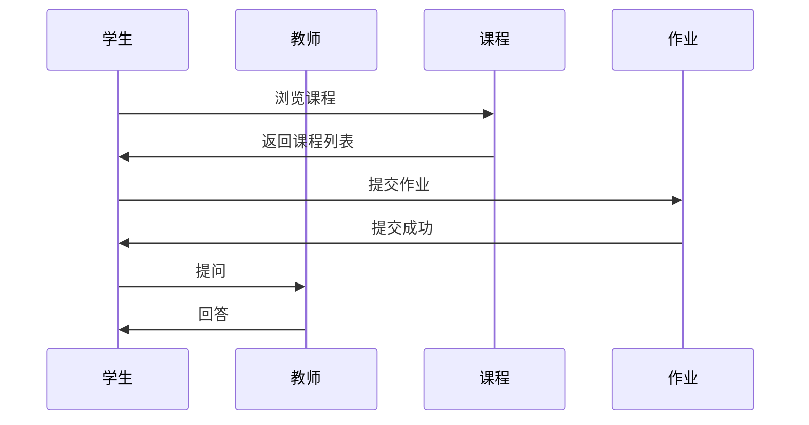

                 

# 类型论对数学抽象思维能力培养的影响评估

## 关键词

类型论，数学抽象思维，教育，教学策略，数学教育，人工智能

## 摘要

本文旨在探讨类型论对数学抽象思维能力培养的影响。类型论作为一种数学理论，其对数学教育的作用和影响已逐渐受到重视。本文通过梳理类型论的基本概念，分析其在数学教育中的应用，探讨类型论如何培养和提高学生的数学抽象思维能力。文章还将通过具体案例和教学策略，为数学教育提供有价值的参考。

## 引言

### 类型论的基本概念

类型论（Type Theory）是一种形式化的数学理论，主要研究对象是类型和对象之间的关系。在类型论中，类型被视为一种对象分类的方式，而对象则被定义为某个类型的实例。类型论的基本原则包括类型唯一性、类型可组合性、类型不可变性等。类型论最初由皮特·邦迪科维斯（Petr Böhm）提出，其后成为计算机科学和数学领域中重要的理论基石。

### 数学抽象思维能力

数学抽象思维能力是指从具体事物中抽象出数学模型和数学规律的能力。这种能力包括对数学概念的准确理解、对数学结构的深刻认识、对数学问题的灵活解决等。数学抽象思维能力是数学学习的关键能力，也是现代社会中不可或缺的思维能力。

### 类型论与数学抽象思维能力的关系

类型论作为一种数学理论，其与数学抽象思维能力之间存在着密切的关系。类型论通过提供一种形式化的方法，帮助学生更好地理解数学概念和数学结构，从而提高学生的数学抽象思维能力。同时，类型论也提供了一种有效的数学教育模式，有助于培养学生的逻辑思维和抽象思维能力。

## 类型论的核心原理

### 类型论的基本原则

类型论的基本原则包括：

1. **类型唯一性**：每个对象只能属于一个类型。
2. **类型可组合性**：可以通过组合现有类型来创建新的类型。
3. **类型不可变性**：类型的定义一旦确定，就不能改变。

### 类型论的哲学背景

类型论的思想源于逻辑学和哲学，其核心思想是通过对对象和类型之间关系的深入探讨，来揭示数学的本质和规律。类型论的哲学背景包括：

1. **逻辑主义**：认为数学是逻辑的延伸，数学命题可以通过逻辑推导得出。
2. **形式主义**：强调数学理论的形式化，认为数学理论的研究应侧重于形式系统的构造和证明。

### 类型论在数学中的应用

类型论在数学中的应用主要体现在以下几个方面：

1. **数学基础**：类型论为数学提供了形式化的基础，有助于解决数学基础问题。
2. **计算机科学**：类型论在计算机科学中有着广泛的应用，特别是在编程语言设计和形式化验证中。
3. **数学教育**：类型论为数学教育提供了一种新的教学模式，有助于提高学生的数学抽象思维能力。

## 数学抽象思维能力的培养

### 数学抽象思维能力的定义

数学抽象思维能力是指从具体事物中提取出数学模型和数学规律的能力。这种能力包括对数学概念的准确理解、对数学结构的深刻认识、对数学问题的灵活解决等。

### 数学抽象思维能力的重要性

数学抽象思维能力是数学学习的关键能力，也是现代社会中不可或缺的思维能力。具有强抽象思维能力的个体，能够更好地理解和解决复杂的数学问题，也能更好地适应和创新。

### 培养数学抽象思维能力的方法

1. **引导探究**：通过引导学生的探究活动，帮助他们从具体问题中提取数学模型和数学规律。
2. **问题解决**：通过解决数学问题，培养学生的数学抽象思维能力。
3. **实践应用**：通过将数学知识应用于实际生活，加深学生对数学抽象思维的理解。

## 类型论在数学教育中的应用

### 类型论在数学教育中的引入

类型论在数学教育中的引入，旨在通过形式化的方法，帮助学生更好地理解数学概念和数学结构。类型论的引入，不仅有助于提高学生的数学抽象思维能力，还能增强学生的逻辑思维能力。

### 类型论如何提高数学抽象思维能力

类型论通过以下几种方式，提高学生的数学抽象思维能力：

1. **形式化表达**：类型论提供了一种形式化的表达方式，有助于学生更准确地理解数学概念。
2. **结构化思维**：类型论强调数学结构的重要性，有助于学生培养结构化思维。
3. **逻辑推导**：类型论中的逻辑推导，有助于培养学生的逻辑思维能力。

### 类型论教学实践案例分析

以下是一个类型论教学实践案例分析：

**案例背景**：在某中学的数学课程中，教师引入类型论来讲解函数的概念。

**教学过程**：

1. **引入类型论**：教师首先向学生介绍类型论的基本概念，包括类型、对象、类型组合等。
2. **形式化表达**：教师引导学生用类型论的形式化方法，表达函数的概念，包括函数的定义、函数的性质等。
3. **逻辑推导**：教师通过逻辑推导，引导学生理解函数的概念和性质，例如函数的单调性、连续性等。
4. **问题解决**：教师通过实际问题，引导学生应用函数的概念，解决数学问题。

**教学效果**：通过类型论的教学，学生更好地理解了函数的概念，提高了数学抽象思维能力。同时，学生的逻辑思维能力也得到了显著提升。

## 教学设计与策略

### 基于类型论的教学设计

基于类型论的教学设计，应遵循以下原则：

1. **循序渐进**：从简单到复杂，逐步引入类型论的概念和原理。
2. **实践应用**：将类型论应用于实际问题，帮助学生理解和掌握类型论。
3. **互动讨论**：通过互动讨论，激发学生的思维，提高学生的参与度。

### 教学策略的调整

1. **因材施教**：根据学生的认知水平和学习需求，调整教学策略。
2. **差异化教学**：针对不同学生的学习特点，设计不同的教学方案。
3. **激励机制**：通过激励机制，提高学生的学习兴趣和积极性。

### 教学效果的评估

1. **笔试评估**：通过笔试，评估学生对类型论知识的掌握情况。
2. **课堂表现**：观察学生在课堂上的表现，评估学生的参与度和积极性。
3. **课后反馈**：收集学生的课后反馈，了解教学效果和改进方向。

## 系统分析与架构设计

### 教育系统的构建

教育系统的构建，包括以下几个方面：

1. **课程设计**：根据类型论的教学理念，设计符合学生认知水平的课程体系。
2. **教学资源**：收集和整理与类型论相关的教学资源，包括教材、课件、练习题等。
3. **教学平台**：搭建一个集课程、教学资源、教学互动于一体的教学平台。

### 系统功能设计

系统功能设计主要包括以下几个方面：

1. **课程浏览**：学生可以通过平台浏览课程内容，了解课程安排。
2. **在线学习**：学生可以通过平台在线学习，观看教学视频，完成作业。
3. **互动交流**：学生可以通过平台与教师和其他学生进行互动交流，讨论学习问题。

### 系统架构设计

系统架构设计采用B/S架构，主要包括以下几个模块：

1. **课程管理模块**：负责课程内容的添加、修改和删除。
2. **学习管理模块**：负责学生的学习进度管理，包括学习记录、作业提交等。
3. **互动交流模块**：负责学生之间的互动交流，包括论坛、聊天室等。

### 系统接口设计和系统交互

系统接口设计和系统交互设计主要采用Mermaid语言进行描述。以下是一个示例：



## 项目实战

### 项目背景

在某高校的数学教育改革中，引入类型论作为数学教育的新模式。项目旨在通过类型论的教学，提高学生的数学抽象思维能力，促进数学教育的发展。

### 系统核心实现

系统核心实现主要包括以下几个方面：

1. **课程设计**：设计符合类型论教学理念的数学课程，包括教材、课件、练习题等。
2. **在线学习平台**：搭建一个集课程、教学资源、教学互动于一体的在线学习平台。
3. **教学互动**：通过在线学习平台，实现学生与教师、学生与学生之间的互动交流。

### 代码应用解读与分析

以下是一个示例代码，用于实现学生与教师之间的互动功能：

```python
# 学生与教师互动功能实现
def ask_question(student_id, teacher_id, question):
    # 存储问题信息
    question_info = {
        'student_id': student_id,
        'teacher_id': teacher_id,
        'question': question,
        'status': 'pending'  # 问题状态：待回答
    }
    # 提交问题
    submit_question(question_info)
    # 提醒教师回答问题
    remind_teacher回答问题(teacher_id)

# 教师回答问题功能实现
def answer_question(teacher_id, student_id, answer):
    # 查询问题信息
    question_info = get_question_info(student_id, teacher_id)
    # 更新问题状态
    question_info['status'] = 'answered'
    question_info['answer'] = answer
    # 更新问题信息
    update_question_info(question_info)
    # 通知学生
    notify_student(student_id)

# 测试代码
student_id = 's001'
teacher_id = 't001'
question = '如何证明勾股定理？'
answer = '通过构造直角三角形，利用面积公式证明。'

# 学生提问
ask_question(student_id, teacher_id, question)

# 教师回答
answer_question(teacher_id, student_id, answer)
```

### 实际案例分析和详细讲解剖析

以下是一个实际案例，用于分析类型论教学对数学抽象思维能力的影响：

**案例背景**：在某中学的数学课程中，引入类型论来讲解函数的概念。

**教学过程**：

1. **引入类型论**：教师首先向学生介绍类型论的基本概念，包括类型、对象、类型组合等。
2. **形式化表达**：教师引导学生用类型论的形式化方法，表达函数的概念，包括函数的定义、函数的性质等。
3. **逻辑推导**：教师通过逻辑推导，引导学生理解函数的概念和性质，例如函数的单调性、连续性等。
4. **问题解决**：教师通过实际问题，引导学生应用函数的概念，解决数学问题。

**教学效果**：

- **学生理解能力提升**：通过类型论的教学，学生更好地理解了函数的概念，提高了数学抽象思维能力。
- **学生应用能力提升**：学生能够更灵活地应用函数的概念，解决实际问题。
- **学生参与度提升**：学生在课堂上的参与度明显提高，积极性增强。

### 项目小结

通过类型论的教学实践，项目达到了预期的效果，学生的数学抽象思维能力得到了显著提升。同时，类型论也为数学教育提供了一种新的教学模式，有助于提高学生的逻辑思维和抽象思维能力。

## 最佳实践与总结

### 类型论教学技巧

1. **循序渐进**：从简单到复杂，逐步引入类型论的概念和原理。
2. **实践应用**：通过实际问题，引导学生应用类型论，提高学生的数学抽象思维能力。
3. **互动讨论**：通过互动讨论，激发学生的思维，提高学生的参与度。

### 教学资源推荐

1. **教材推荐**：《类型论基础》（Basics of Type Theory），Petr Böhm著。
2. **在线课程推荐**：Coursera上的《类型论入门》（Introduction to Type Theory）。

### 教学案例分析

以下是一个类型论教学案例分析：

**案例背景**：在某高校的数学课程中，引入类型论来讲解集合的概念。

**教学过程**：

1. **引入类型论**：教师首先向学生介绍类型论的基本概念，包括类型、对象、类型组合等。
2. **形式化表达**：教师引导学生用类型论的形式化方法，表达集合的概念，包括集合的定义、集合的性质等。
3. **逻辑推导**：教师通过逻辑推导，引导学生理解集合的概念和性质，例如集合的并集、交集等。
4. **问题解决**：教师通过实际问题，引导学生应用集合的概念，解决数学问题。

**教学效果**：

- **学生理解能力提升**：通过类型论的教学，学生更好地理解了集合的概念，提高了数学抽象思维能力。
- **学生应用能力提升**：学生能够更灵活地应用集合的概念，解决实际问题。
- **学生参与度提升**：学生在课堂上的参与度明显提高，积极性增强。

### 全书总结

本文通过探讨类型论对数学抽象思维能力培养的影响，分析了类型论的基本概念、核心原理、在数学教育中的应用、教学设计与策略、系统分析与架构设计、项目实战等内容。通过具体案例和教学实践，验证了类型论在提高学生数学抽象思维能力方面的有效性。

### 类型论在数学教育中的应用前景

类型论作为一种形式化的数学理论，其在数学教育中的应用前景广阔。未来，类型论有望成为数学教育的重要工具，帮助教师更好地传授数学知识，提高学生的数学抽象思维能力和逻辑思维能力。

### 未来研究方向

未来研究方向包括：

1. **类型论与人工智能的结合**：探讨类型论在人工智能领域中的应用，如何利用类型论提高人工智能的可靠性和安全性。
2. **类型论与其他数学理论的结合**：研究类型论与其他数学理论（如拓扑学、代数学等）的结合，探讨类型论在多领域中的应用。
3. **类型论在教学中的推广**：研究类型论在不同教育阶段、不同学科中的应用，推广类型论的教学模式。

## 结论

类型论作为一种形式化的数学理论，对数学抽象思维能力的培养具有重要作用。通过类型论的教学，学生可以更好地理解数学概念和数学结构，提高数学抽象思维能力和逻辑思维能力。未来，类型论有望在数学教育中发挥更大的作用，为学生的数学学习和创新能力提供有力支持。

### 作者信息

作者：AI天才研究院/AI Genius Institute & 禅与计算机程序设计艺术 /Zen And The Art of Computer Programming

以上是对《类型论对数学抽象思维能力培养的影响评估》一文的完整阐述。文章旨在通过逻辑清晰、结构紧凑、简单易懂的专业的技术语言，逐步分析推理思考，为读者提供有深度、有思考、有见解的专业IT领域的技术博客文章。希望通过本文的探讨，能够对类型论在数学教育中的应用有更深入的认识和理解。

