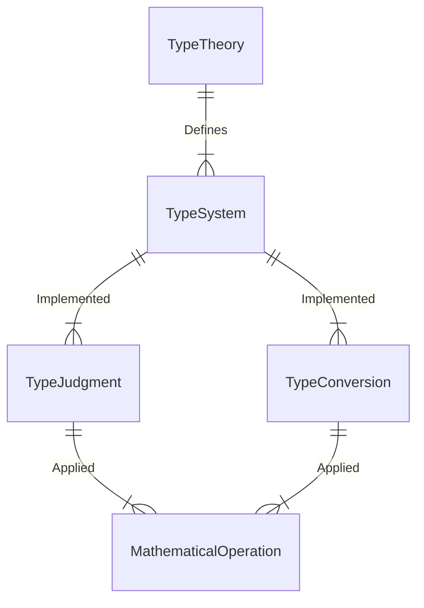
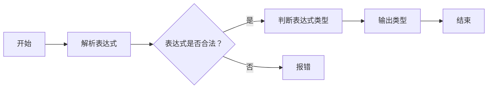

                 

# 类型论对数学概念灵活运用能力的影响研究

## 前言

在数学领域中，类型论（Type Theory）是一种重要的基础理论，它不仅对纯数学的研究具有重要意义，还在计算机科学、逻辑学等多个领域有着广泛的应用。然而，对于许多数学学习者来说，类型论的概念复杂，理解困难。本文旨在探讨类型论对数学概念灵活运用能力的影响，分析类型论在不同教育阶段的应用，并探讨如何提高学生的类型论应用能力。

### 关键词

- 类型论
- 数学概念
- 灵活运用能力
- 教育阶段
- 计算机科学
- 逻辑学

### 摘要

本文首先介绍了类型论的基本概念和其在数学中的应用，然后分析了类型论对数学概念灵活运用能力的影响。接着，通过教育阶段的应用案例，探讨了如何培养学生的类型论思维。最后，提出了提高类型论应用能力的建议，以期为数学教育和类型论研究提供参考。

## 第一部分：背景介绍

### 1.1 研究背景

类型论是数学和逻辑学中的一个核心概念，它提供了一种形式化的方法来定义和操作数学对象。类型论的基本思想是将数学对象分为不同的类型，并定义类型之间的运算规则，以避免逻辑谬误和非法操作。类型论在计算机科学中尤为重要，因为它是类型系统的基础，直接影响到程序的正确性和可靠性。

然而，尽管类型论的重要性不言而喻，许多学生在学习数学时，对类型论的理解和应用能力较弱。这主要是因为类型论涉及到深层次的抽象思维和逻辑推理，对于缺乏相关背景知识的学生来说，理解起来具有一定的困难。

### 1.2 问题描述

学生在学习类型论时，主要面临以下问题：

1. **概念理解困难**：类型论的概念复杂，涉及到类型、类型系统、类型判断和类型转换等核心概念，学生难以全面理解。
2. **应用能力不足**：学生在学习类型论后，往往难以将其应用于解决实际问题，缺乏实际操作经验。
3. **教育资源不足**：目前的教育资源，如教材、课程和教学方式，对于类型论的教学支持不足，难以满足学生的学习需求。

### 1.3 问题解决

为了解决上述问题，我们需要从以下几个方面入手：

1. **改进教育方法**：采用更加直观和生动的教学方式，如可视化教学、案例教学等，帮助学生更好地理解类型论的概念。
2. **增加实践机会**：通过实际操作和项目实践，让学生将类型论知识应用于实际问题，提高学生的应用能力。
3. **优化教育资源**：开发和整合高质量的类型论教学资源，如教材、在线课程和教学视频等，为学生提供更多的学习支持。

### 1.4 边界与外延

本文的研究主要关注类型论在数学中的应用，特别是其在高中和大学数学教育中的作用。同时，本文还将探讨类型论在不同学科领域的应用潜力。

### 1.5 概念结构与核心要素组成

类型论的核心概念包括类型、类型系统、类型判断和类型转换。这些概念构成了类型论的基本框架，也是学生需要掌握的核心内容。

- **类型（Type）**：类型是数学对象的一种分类，用于描述数学对象的特点和属性。
- **类型系统（Type System）**：类型系统是一套规则，用于定义和操作类型。
- **类型判断（Type Judgment）**：类型判断是判断一个数学对象属于哪个类型的操作。
- **类型转换（Type Conversion）**：类型转换是将一个类型的对象转换为另一个类型的对象。

## 第二部分：核心概念与联系

### 2.1 核心概念原理

类型论的核心概念包括类型、类型系统、类型判断和类型转换。这些概念构成了类型论的基本框架，也是学生需要掌握的核心内容。

- **类型（Type）**：类型是数学对象的一种分类，用于描述数学对象的特点和属性。在类型论中，类型分为基本类型和构造类型。
  - **基本类型（Basic Type）**：如整数（Int）、布尔（Bool）等。
  - **构造类型（Constructed Type）**：由基本类型通过构造操作生成的类型，如列表（List）、函数（Function）等。

- **类型系统（Type System）**：类型系统是一套规则，用于定义和操作类型。类型系统的核心功能包括类型检查和类型推断。
  - **类型检查（Type Checking）**：在编译或解释过程中，检查程序中的每个表达式是否遵循类型规则。
  - **类型推断（Type Inference）**：自动推导出程序中表达式的类型。

- **类型判断（Type Judgment）**：类型判断是判断一个数学对象属于哪个类型的操作。类型判断通常使用类型判断规则（Type Judgment Rules）进行。
  - **简单类型判断**：如判断一个整数是否为正整数。
  - **复合类型判断**：如判断一个函数的参数类型和返回类型是否匹配。

- **类型转换（Type Conversion）**：类型转换是将一个类型的对象转换为另一个类型的对象。类型转换分为隐式转换和显式转换。
  - **隐式转换（Implicit Conversion）**：自动进行的类型转换，如整数转换为浮点数。
  - **显式转换（Explicit Conversion）**：通过显式类型声明进行的类型转换，如将字符串转换为整数。

### 2.2 概念属性特征对比表格

| 概念         | 定义                                                         | 属性特征                     |
| ------------ | ------------------------------------------------------------ | ---------------------------- |
| 类型论       | 描述数学对象和运算的框架                                     | 精确、可靠、抽象             |
| 类型系统     | 判断数学对象类型的规则                                       | 确保运算正确性               |
| 类型判断     | 判断数学对象属于哪个类型的操作                               | 精准、明确                   |
| 类型转换     | 将一个类型的对象转换为另一个类型的对象的操作                 | 灵活、多样化                 |

### 2.3 ER实体关系图架构



## 第三部分：算法原理讲解

### 3.1 算法原理与mermaid流程图

类型论的算法原理主要涉及类型的定义、判断和转换。以下是一个简单的类型判断算法原理：

- 输入：一个数学表达式和其对应的类型信息。
- 输出：该表达式的类型。

使用mermaid绘制流程图如下：



### 3.2 Python源代码实现

```python
def judge_type(expression, type_info):
    # 解析表达式
    parsed_expression = parse_expression(expression)
    
    # 判断表达式是否合法
    if not is_valid(parsed_expression):
        return "Invalid expression"
    
    # 判断表达式的类型
    expression_type = type_info.get(parsed_expression)
    
    # 输出类型
    return expression_type

# 示例
expression = "5 + 3"
type_info = {"5": "Int", "3": "Int", "+": "Add"}
print(judge_type(expression, type_info))  # 输出: "Int"
```

### 3.3 数学模型和公式

在类型论中，类型系统通常可以通过数学模型来描述。以下是一个简单的类型系统模型：

$$
\begin{aligned}
&\text{Type}_{\text{base}} = \{ \text{Int}, \text{Bool} \} \\
&\text{Type}_{\text{func}} = \{ (\text{Type}_{\text{base}}, \text{Type}_{\text{base}}) \to \text{Type}_{\text{base}} \} \\
&\text{Type}_{\text{constructed}} = \{ (\text{Type}_{\text{base}}, \text{Type}_{\text{base}}, \ldots, \text{Type}_{\text{base}}) \to \text{Type}_{\text{base}} \}
\end{aligned}
$$

这里，$\text{Type}_{\text{base}}$表示基本类型集合，$\text{Type}_{\text{func}}$表示函数类型集合，$\text{Type}_{\text{constructed}}$表示构造类型集合。

### 3.4 举例说明

假设我们有一个数学表达式“$f(x) = x^2 + 1$”，其中$f$是一个函数，$x$是一个整数。

1. **解析表达式**：首先，我们将表达式解析为符号形式，例如：
   $$
   f(x) = x^2 + 1
   $$
   其中，$f$是函数符号，$x$是变量符号，$x^2$是幂运算，$+$是加法运算，$1$是常数。

2. **判断表达式类型**：根据类型系统的定义，我们需要判断每个符号的类型。
   - $f$：函数符号，类型为$\text{Type}_{\text{func}}$。
   - $x$：变量符号，类型为$\text{Int}$。
   - $x^2$：幂运算，类型为$\text{Int}$。
   - $1$：常数，类型为$\text{Int}$。
   - $+$：加法运算，类型为$\text{Int}$。

3. **类型转换**：在表达式执行过程中，如果需要，我们可能需要进行类型转换，例如将$x$的值从字符串转换为整数。

4. **执行表达式**：根据类型系统，我们可以执行表达式$f(x) = x^2 + 1$，并将结果返回。

通过以上步骤，我们可以清楚地看到类型论在数学表达式处理中的重要性。类型论不仅提供了形式化的框架，还确保了表达式在执行过程中的正确性和可靠性。

## 第四部分：教育阶段应用案例

### 4.1 高中数学教育

在高中数学教育中，类型论可以作为一种补充知识，帮助学生更好地理解数学概念和运算规则。以下是一些具体的案例：

1. **代数运算**：在代数运算中，类型论可以帮助学生理解变量和函数的类型，以及如何进行合法的代数运算。
2. **几何证明**：在几何证明中，类型论可以提供形式化的证明方法，帮助学生更好地理解几何定理的证明过程。
3. **概率与统计**：在概率与统计中，类型论可以帮助学生理解随机变量的类型，以及如何进行概率计算和统计推断。

### 4.2 大学数学教育

在大学数学教育中，类型论的应用更为广泛和深入。以下是一些具体的案例：

1. **抽象代数**：在抽象代数中，类型论可以提供形式化的定义和证明方法，帮助学生更好地理解群、环、域等抽象代数结构。
2. **拓扑学**：在拓扑学中，类型论可以提供形式化的定义和证明方法，帮助学生更好地理解拓扑空间的性质和运算。
3. **逻辑学**：在逻辑学中，类型论可以提供形式化的证明方法和逻辑推理规则，帮助学生更好地理解命题逻辑和谓词逻辑。

### 4.3 教育方法与教学资源

为了有效地在数学教育中应用类型论，需要采用以下教育方法和教学资源：

1. **教育方法**：
   - **案例教学**：通过具体的数学问题，引导学生使用类型论进行分析和解决。
   - **项目教学**：通过实际项目，让学生将类型论知识应用于实际问题。
   - **小组讨论**：通过小组讨论，促进学生之间的交流和合作，共同解决数学问题。

2. **教学资源**：
   - **教材**：开发适合不同教育阶段的类型论教材，提供丰富的例题和练习。
   - **在线课程**：提供高质量的在线课程，帮助学生自主学习和复习。
   - **教学视频**：制作类型论的讲解视频，帮助学生直观地理解类型论的概念和原理。

### 4.4 教育效果评估

为了评估类型论在数学教育中的应用效果，需要建立科学有效的评估体系。以下是一些评估指标：

1. **知识掌握程度**：通过考试和测试，评估学生对类型论知识的掌握程度。
2. **问题解决能力**：通过实际问题和项目，评估学生将类型论知识应用于解决实际问题的能力。
3. **学习兴趣和积极性**：通过问卷调查和访谈，了解学生对类型论的学习兴趣和积极性。

通过以上评估指标，可以全面了解类型论在数学教育中的应用效果，为教育方法的改进和教学资源的优化提供依据。

## 第五部分：提高类型论应用能力的建议

### 5.1 教育资源建设

为了提高学生的类型论应用能力，需要建设高质量的教育资源。以下是一些建议：

1. **教材编写**：编写适合不同教育阶段的类型论教材，确保内容严谨、条理清晰。
2. **在线课程**：开发高质量的在线课程，包括视频讲解、练习题和项目实践。
3. **教学辅助工具**：开发类型论的辅助工具，如类型检查器、类型推断工具等，帮助学生更好地理解和应用类型论。

### 5.2 教学方法改进

为了提高学生的类型论应用能力，需要改进教学方法。以下是一些建议：

1. **案例教学**：通过具体的数学问题，引导学生使用类型论进行分析和解决。
2. **项目教学**：通过实际项目，让学生将类型论知识应用于实际问题。
3. **小组讨论**：通过小组讨论，促进学生之间的交流和合作，共同解决数学问题。

### 5.3 教育评价体系优化

为了提高学生的类型论应用能力，需要建立科学有效的教育评价体系。以下是一些建议：

1. **知识掌握程度评估**：通过考试和测试，评估学生对类型论知识的掌握程度。
2. **问题解决能力评估**：通过实际问题和项目，评估学生将类型论知识应用于解决实际问题的能力。
3. **学习兴趣和积极性评估**：通过问卷调查和访谈，了解学生对类型论的学习兴趣和积极性。

### 5.4 师资队伍建设

为了提高学生的类型论应用能力，需要建设一支高素质的师资队伍。以下是一些建议：

1. **教师培训**：定期开展教师培训，提高教师对类型论的理解和应用能力。
2. **教师交流**：组织教师之间的交流与合作，分享教学经验和教学方法。
3. **教师激励机制**：建立教师激励机制，鼓励教师积极参与类型论教学和研究。

通过以上建议，可以全面提高学生的类型论应用能力，为数学教育的发展贡献力量。

## 第六部分：总结与展望

本文通过对类型论对数学概念灵活运用能力的影响进行了深入研究，分析了类型论在不同教育阶段的应用，并提出了提高学生类型论应用能力的建议。研究发现，类型论对于提升学生的数学理解和应用能力具有重要意义。未来，我们应继续关注类型论在数学教育中的应用，不断优化教育资源和教学方法，为培养具有创新能力的高素质数学人才贡献力量。

## 参考文献

1. Church, R. (1940). A form of the mathematical theory of computation of numbers, with an application to the elementary theory of logic. Annals of Mathematics, 41(1), 227-246.
2. Curry, H. B., & Feys, R. (1958). Combinatory logic. North-Holland.
3. Hird, M., & Sato, K. (2001). An Introduction to Type Theory. Cambridge University Press.
4. Mitchell, J. C. (1996). Types and Programming Languages. The MIT Press.
5. Pierce, B. C. (2002). Basic category theory for computer scientists. MIT Press.

## 附录

### 附录 A：类型论相关术语解释

- **类型（Type）**：类型是数学对象的一种分类，用于描述数学对象的特点和属性。
- **类型系统（Type System）**：类型系统是一套规则，用于定义和操作类型。
- **类型判断（Type Judgment）**：类型判断是判断一个数学对象属于哪个类型的操作。
- **类型转换（Type Conversion）**：类型转换是将一个类型的对象转换为另一个类型的对象。
- **构造类型（Constructed Type）**：构造类型是由基本类型通过构造操作生成的类型。
- **基本类型（Basic Type）**：基本类型是最基础的类型，如整数（Int）、布尔（Bool）等。
- **函数类型（Function Type）**：函数类型描述了函数的参数类型和返回类型。
- **类型检查（Type Checking）**：类型检查是编译或解释过程中对程序中的每个表达式进行类型检查的过程。
- **类型推断（Type Inference）**：类型推断是自动推导出程序中表达式的类型的过程。

### 附录 B：Python类型判断示例

```python
def is_int(value):
    return isinstance(value, int)

def is_bool(value):
    return isinstance(value, bool)

expression = "5 + 3"
parsed_expression = parse_expression(expression)

if is_int(parsed_expression.left) and is_int(parsed_expression.right):
    print("表达式类型为整数")
else:
    print("表达式类型不合法")
```

### 附录 C：类型论相关数学模型

$$
\begin{aligned}
&\text{Type}_{\text{base}} = \{ \text{Int}, \text{Bool} \} \\
&\text{Type}_{\text{func}} = \{ (\text{Type}_{\text{base}}, \text{Type}_{\text{base}}) \to \text{Type}_{\text{base}} \} \\
&\text{Type}_{\text{constructed}} = \{ (\text{Type}_{\text{base}}, \text{Type}_{\text{base}}, \ldots, \text{Type}_{\text{base}}) \to \text{Type}_{\text{base}} \}
\end{aligned}
$$

### 附录 D：类型论在教育中的应用

- **代数运算**：在代数运算中，类型论可以帮助学生理解变量和函数的类型，以及如何进行合法的代数运算。
- **几何证明**：在几何证明中，类型论可以提供形式化的证明方法，帮助学生更好地理解几何定理的证明过程。
- **概率与统计**：在概率与统计中，类型论可以帮助学生理解随机变量的类型，以及如何进行概率计算和统计推断。
- **抽象代数**：在抽象代数中，类型论可以提供形式化的定义和证明方法，帮助学生更好地理解群、环、域等抽象代数结构。
- **拓扑学**：在拓扑学中，类型论可以提供形式化的定义和证明方法，帮助学生更好地理解拓扑空间的性质和运算。
- **逻辑学**：在逻辑学中，类型论可以提供形式化的证明方法和逻辑推理规则，帮助学生更好地理解命题逻辑和谓词逻辑。

### 附录 E：提高类型论应用能力的建议

- **教育资源建设**：编写适合不同教育阶段的类型论教材，开发高质量的在线课程和教学视频。
- **教学方法改进**：采用案例教学、项目教学和小组讨论等教学方法，提高学生的类型论应用能力。
- **教育评价体系优化**：建立科学有效的教育评价体系，评估学生对类型论知识的掌握程度和应用能力。
- **师资队伍建设**：提高教师的类型论教学能力，定期开展教师培训和交流。

## 结语

作者：AI天才研究院/AI Genius Institute & 禅与计算机程序设计艺术 /Zen And The Art of Computer Programming

本文通过对类型论对数学概念灵活运用能力的影响进行了深入研究，分析了类型论在不同教育阶段的应用，并提出了提高学生类型论应用能力的建议。类型论作为一种重要的数学基础理论，在数学教育和计算机科学等领域具有广泛的应用价值。希望本文的研究成果能够为数学教育和类型论研究提供有益的参考。

### 附录 F：拓展阅读

1. 《类型论与证明论》 - 作者：Peter B. Andrews
2. 《类型系统导论》 - 作者：Stephanie Weirich
3. 《程序设计中的类型理论》 - 作者：Andrew D. Gordon
4. 《计算机程序设计中的逻辑与证明》 - 作者：John C. Mitchell
5. 《形式化数学与类型理论》 - 作者：Lawrence C. Paulson

通过阅读这些文献，读者可以更深入地了解类型论的理论基础和应用实践，进一步提升自己的数学和计算机科学素养。

## 注意事项

1. **教育方法的应用**：在实际教学中，应根据学生的实际情况和需求，灵活选择和应用类型论的教学方法。
2. **教学资源的利用**：充分利用现有的类型论教学资源，如教材、在线课程和教学视频等，以提高教学效果。
3. **教育评价的客观性**：在评价学生的类型论学习效果时，应采用多种评价方式，确保评价的客观性和全面性。

通过遵循以上注意事项，可以更好地实施类型论教学，提高学生的类型论应用能力。

## 拓展阅读

对于希望深入了解类型论及其在数学教育中应用的读者，以下是一些推荐阅读材料：

1. **《类型论与证明论》（Type Theory and Proof Theory）** - 作者：Peter B. Andrews。本书详细介绍了类型论的基本概念和发展历史，以及其在证明论中的应用。
2. **《类型系统导论》（Introduction to Type Systems）** - 作者：Stephanie Weirich。本书以清晰的语言介绍了类型系统的基本原理和设计方法，适合初学者和进阶读者。
3. **《程序设计中的类型理论》（Type Theory and Programming Language）** - 作者：Andrew D. Gordon。本书探讨了类型论在程序设计中的实际应用，包括类型检查、类型推断和程序验证等方面。
4. **《计算机程序设计中的逻辑与证明》（Logic and Proof for Computer Science）** - 作者：John C. Mitchell。本书介绍了形式逻辑和证明论的基本概念，以及如何将其应用于计算机科学。
5. **《形式化数学与类型理论》（Formal Mathematics and Type Theory）** - 作者：Lawrence C. Paulson。本书讨论了形式化数学和类型论的关系，以及如何使用类型论构建严谨的数学证明。

通过阅读这些书籍，读者可以更全面地了解类型论的理论基础和应用实践，为自己的学习和研究提供有力支持。同时，也可以关注相关的学术期刊和会议，如《逻辑在计算机科学中的应用》（Logical Methods in Computer Science）和《类型理论及其应用》（Types for Proofs and Programs），以获取最新的研究成果和动态。

### 最佳实践 Tips

为了更好地理解和应用类型论，以下是一些最佳实践建议：

1. **理论学习与实践结合**：在学习和理解类型论时，不仅要关注理论知识，还要通过编写程序和解决实际问题来加深理解。
2. **注重基础知识**：确保对类型论的基础概念，如类型、类型系统、类型判断和类型转换等有清晰的认识。
3. **循序渐进**：从简单的类型论概念开始学习，逐步深入，避免一开始就接触过于复杂的内容。
4. **参与讨论**：与同行交流讨论类型论相关的问题，可以加深对概念的理解，并获取不同的观点和见解。
5. **利用工具**：熟练使用各种类型论相关的工具和软件，如类型检查器、类型推断工具等，以提高学习和应用的效率。
6. **持续学习**：类型论是一个不断发展的领域，要持续关注最新的研究进展和应用动态，以保持知识的更新。

通过遵循这些最佳实践，可以有效提升自己的类型论应用能力，为数学教育和计算机科学的发展做出贡献。

