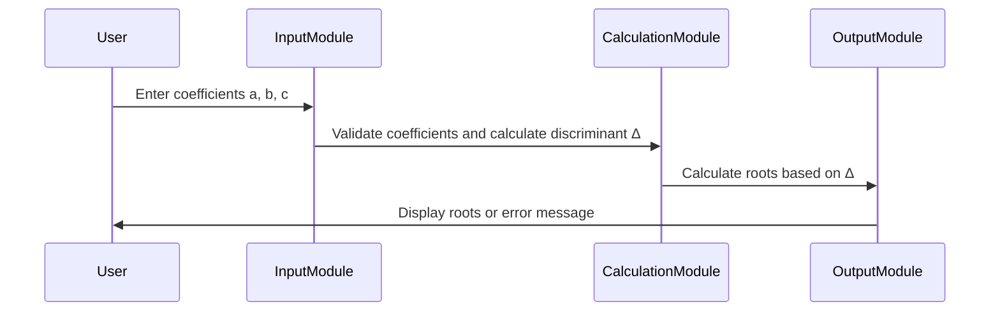

                 

### 类型论对数学直觉重要性认知的挑战

---

**关键词**：类型论、数学直觉、认知挑战、算法、架构设计、项目实战

**摘要**：
本文深入探讨了类型论对数学直觉的重要性认知带来的挑战。类型论作为一种数学和逻辑框架，它在编程语言设计和理论计算机科学中具有重要地位。然而，随着类型论的不断发展，它对传统的数学直觉提出了新的挑战。本文首先介绍了类型论的基本概念和数学直觉的特点，接着通过一步步的分析，揭示了类型论如何影响我们对数学的理解和认知。文章随后通过具体的算法原理讲解和项目实战，展示了类型论在解决实际数学问题中的应用和挑战。最后，文章总结了类型论对数学直觉重要性认知的影响，并提出了进一步的研究方向。

---

### 目录大纲设计构思

为了设计出一本关于《类型论对数学直觉重要性认知的挑战》的详细目录大纲，我们需要遵循以下几个关键步骤：

1. **背景介绍**：
   - **问题背景**：介绍类型论在数学领域的重要性和历史背景，以及数学直觉的重要性。
   - **问题描述**：阐述类型论对数学直觉认知的影响和挑战。
   - **问题解决**：简要介绍类型论如何帮助我们更好地理解和应对这些挑战。
   - **边界与外延**：明确讨论范围，包括类型论的主要分支和数学直觉的相关概念。

2. **核心概念与联系**：
   - **类型论原理**：详细解释类型论的核心概念，如类型系统、类型层次等。
   - **数学直觉特征对比表格**：对比数学直觉与类型论的差异和联系。
   - **ER实体关系图架构**：绘制ER实体关系图，展示类型论与数学直觉的关系。

3. **算法原理讲解**：
   - **算法流程图**：使用Mermaid绘制算法流程图，直观展示算法步骤。
   - **Python源代码**：提供Python代码实现，阐述算法原理。
   - **数学模型和公式**：详细讲解算法背后的数学模型和公式。
   - **举例说明**：通过具体例子来解释和验证算法的正确性。

4. **系统分析与架构设计方案**：
   - **问题场景介绍**：描述类型论与数学直觉在具体问题中的应用场景。
   - **项目介绍**：简要介绍项目背景、目标和功能。
   - **系统功能设计**：绘制领域模型类图，展示系统功能。
   - **系统架构设计**：绘制系统架构图，说明系统的组成部分和关系。
   - **系统接口设计和系统交互**：绘制系统接口设计和系统交互序列图。

5. **项目实战**：
   - **环境安装**：描述所需的软件和硬件环境。
   - **系统核心实现源代码**：提供关键部分的源代码。
   - **代码应用解读与分析**：详细解读和分析源代码。
   - **实际案例分析和详细讲解剖析**：通过实际案例展示项目效果。
   - **项目小结**：总结项目的经验教训。

6. **最佳实践 tips、小结、注意事项、拓展阅读**：
   - **最佳实践 tips**：提供在实际应用中需要注意的技巧和建议。
   - **小结**：总结全书的关键观点和发现。
   - **注意事项**：提醒读者在使用类型论和数学直觉时需要注意的问题。
   - **拓展阅读**：推荐进一步深入研究的书籍和资料。

### 目录大纲

```markdown
# 《类型论对数学直觉重要性认知的挑战》目录大纲

----------------------------------------------------------------

## 第一部分：类型论基础

### 第1章：类型论概述

#### 1.1 类型论的发展历程

#### 1.2 类型论的核心概念

#### 1.3 类型论与数学直觉的关系

### 第2章：类型系统的基本原理

#### 2.1 类型层次与类型约束

#### 2.2 类型论中的类型系统

#### 2.3 类型系统在编程语言中的应用

### 第3章：类型论的主要分支

#### 3.1 极小类型论

#### 3.2 高级类型论

#### 3.3 实用类型论

## 第二部分：类型论与数学直觉的挑战

### 第4章：数学直觉的认知障碍

#### 4.1 数学直觉的特点

#### 4.2 数学直觉的限制

#### 4.3 类型论如何突破这些限制

### 第5章：类型论在数学中的应用

#### 5.1 类型论在代数中的应用

#### 5.2 类型论在几何中的应用

#### 5.3 类型论在分析中的应用

### 第6章：类型论对数学直觉的挑战

#### 6.1 类型论对直观理解的挑战

#### 6.2 类型论对数学方法的挑战

#### 6.3 类型论对数学教育的挑战

## 第三部分：项目实战

### 第7章：类型论在数学问题解决中的应用

#### 7.1 实际问题场景介绍

#### 7.2 项目目标和功能

#### 7.3 系统功能设计

#### 7.4 系统架构设计

#### 7.5 系统接口设计和交互

### 第8章：类型论项目实战

#### 8.1 环境安装

#### 8.2 系统核心实现源代码

#### 8.3 代码应用解读与分析

#### 8.4 实际案例分析和详细讲解

#### 8.5 项目小结

## 第四部分：总结与展望

### 第9章：最佳实践 tips

###

----------------------------------------------------------------
```  

---

**作者**：AI天才研究院/AI Genius Institute & 禅与计算机程序设计艺术 /Zen And The Art of Computer Programming  

---

---

### 第一部分：类型论基础

#### 第1章：类型论概述

##### 1.1 类型论的发展历程

类型论起源于20世纪30年代，由数学家、逻辑学家和计算机科学家共同探索和发展的。在早期的数学和逻辑学中，类型论主要关注于如何为数学表达式和命题提供一种严格的语义解释。随着计算机科学的兴起，类型论逐渐在编程语言设计和形式化验证领域得到了广泛应用。

早期的类型论研究主要集中在证明论和模型论上，这些研究为后来的类型论发展奠定了基础。20世纪50年代，随着Lambda演算的提出，类型论开始与函数式编程紧密相连。到了20世纪60年代，类型论在编程语言设计中的应用逐渐显现，例如ALGOL 60和SIMULA 67等语言引入了类型系统。

进入21世纪，随着多态类型、依赖类型和存在类型等概念的提出，类型论在编程语言和理论计算机科学领域得到了进一步的发展。如今，类型论已经成为计算机科学和数学领域的重要分支，对于理解和设计现代编程语言和软件系统具有重要意义。

##### 1.2 类型论的核心概念

类型论的核心概念包括类型系统、类型层次、类型约束和类型检查等。

- **类型系统**：类型系统是类型论的基本框架，它定义了变量、表达式和函数等元素的类型，并规定了类型之间的关系和操作。

- **类型层次**：类型层次描述了不同类型之间的包含关系。通常，类型论中的类型层次包括基本类型（如整数、布尔值等）、复合类型（如数组、记录等）和函数类型等。

- **类型约束**：类型约束是一种限制类型之间交互的规则，它确保了程序的类型安全性和正确性。

- **类型检查**：类型检查是类型系统的一个重要组成部分，它通过对程序进行静态分析，验证程序中的变量、表达式和函数的类型是否符合类型系统的规定。

##### 1.3 类型论与数学直觉的关系

数学直觉是指人们通过直观感受和经验推断数学结论的能力。数学直觉在数学的发展中起着重要作用，许多数学发现和创新都源于数学家的直觉。然而，类型论作为一种形式化的数学框架，对数学直觉提出了新的挑战。

类型论通过严格的语义解释和类型检查，确保了数学表达式的正确性和一致性。这种形式化的方法有助于我们发现和纠正数学直觉中的错误，从而提高数学推理的可靠性。同时，类型论也为数学直觉提供了一种新的表达和验证方式，使得数学家能够更直观地理解和证明复杂的数学命题。

然而，类型论对数学直觉也带来了一些挑战。传统的数学直觉依赖于直观感受和经验，而类型论则需要精确的形式化和验证。这使得数学家在适应类型论的过程中，需要重新审视和调整他们的直觉，以便更好地理解和应用类型论。

总之，类型论与数学直觉之间存在一种相互促进的关系。类型论为数学直觉提供了一种形式化的基础，有助于提高数学推理的可靠性。同时，数学直觉也为类型论的发展提供了灵感和指导，使得类型论能够更好地适应数学家的实际需求。

---

#### 第2章：类型系统的基本原理

##### 2.1 类型层次与类型约束

类型系统中的类型层次是类型论的重要组成部分，它定义了不同类型之间的包含关系。在类型层次中，基本类型位于底层，复合类型和函数类型位于高层。基本类型通常包括整数、布尔值、字符等，它们是不可分解的基本单元。复合类型则是由基本类型组合而成的，如数组、记录和集合等。函数类型则表示函数的定义，它将输入类型映射到输出类型。

类型约束是类型系统中的另一关键概念，它用于限制类型之间的交互。类型约束确保了程序在运行时类型安全性和正确性。常见的类型约束包括类型兼容性约束、类型上下界约束和类型依赖约束等。

- **类型兼容性约束**：类型兼容性约束规定了哪些类型的值可以赋给某个变量或函数的参数。通常，子类型可以赋值给父类型，但父类型不能赋值给子类型。

- **类型上下界约束**：类型上下界约束用于限制泛型类型中参数的类型。类型下界约束确保泛型类型至少具有某个基类型，而上界约束则确保泛型类型不超过某个类型。

- **类型依赖约束**：类型依赖约束用于描述不同类型之间的依赖关系，以确保程序中的类型组合是有效的。例如，在依赖类型系统中，类型之间的依赖关系可以通过类型类和类型成员来描述。

##### 2.2 类型论中的类型系统

类型论中的类型系统是一个形式化的系统，用于描述和验证程序中的类型。类型系统包括类型定义、类型变量、类型构造器和类型检查等组成部分。

- **类型定义**：类型定义是类型系统中的基础元素，用于描述不同类型的结构和特征。常见的类型定义包括基本类型、复合类型和函数类型等。

- **类型变量**：类型变量是类型系统中的一种通用类型，用于表示未知或可变类型的值。类型变量可以用于泛型编程和类型推导。

- **类型构造器**：类型构造器是用于创建新类型的操作符，如构造函数、类和模块等。类型构造器可以将基本类型、复合类型和函数类型组合在一起，形成更复杂的类型结构。

- **类型检查**：类型检查是类型系统中的一个重要环节，用于验证程序中的变量、表达式和函数的类型是否符合类型系统的规定。类型检查可以分为静态类型检查和动态类型检查。

- **静态类型检查**：静态类型检查在程序编译期间进行，通过分析源代码的结构和语义，验证程序中的类型是否一致。静态类型检查有助于提高程序的可靠性和性能。

- **动态类型检查**：动态类型检查在程序运行时进行，通过运行时的类型信息来验证程序中的类型是否一致。动态类型检查具有较高的灵活性，但可能引入额外的性能开销。

##### 2.3 类型系统在编程语言中的应用

类型系统在编程语言中具有广泛的应用，不同编程语言对类型系统的设计和实现各有特点。

- **静态类型语言**：静态类型语言在编译期间进行类型检查，要求变量在声明时指定类型，并确保程序中的类型一致性。常见的静态类型语言包括C++、Java和Haskell等。静态类型语言具有类型安全性和性能优势，但可能牺牲一定的灵活性。

- **动态类型语言**：动态类型语言在运行时进行类型检查，允许变量在声明时不指定类型，并在运行时确定其类型。常见的动态类型语言包括Python、JavaScript和Ruby等。动态类型语言具有较高的灵活性和易用性，但可能牺牲一定的性能和安全性。

- **多态类型语言**：多态类型语言支持泛型和类型参数化，允许在类型变量上定义函数和方法。常见的多态类型语言包括C++（模板）、Java和C#等。多态类型语言有助于提高代码的复用性和可维护性。

- **依赖类型语言**：依赖类型语言通过类型依赖约束来描述不同类型之间的依赖关系。常见的依赖类型语言包括ML和Haskell等。依赖类型语言有助于提高程序的类型安全性和可靠性。

总之，类型系统在编程语言中扮演着重要角色，它有助于提高程序的类型安全性、性能和可维护性。不同编程语言对类型系统的设计和实现各有特色，以满足不同的应用需求和开发场景。

---

#### 第3章：类型论的主要分支

##### 3.1 极小类型论

极小类型论是一种基于最小化原则的类型系统，旨在为程序提供最小的类型约束，以确保类型安全性和正确性。极小类型论的核心思想是通过逐步细化类型，将程序中的不确定性和复杂性降到最低。

极小类型论的主要特点如下：

- **最小化原则**：极小类型论遵循最小化原则，即在类型检查过程中，尽可能选择最小的类型约束。这种原则有助于减少类型错误和编译时间。

- **逐步细化**：极小类型论通过逐步细化类型，将程序中的不确定性和复杂性转化为明确的类型约束。类型细化可以分为类型检查和类型推导两个阶段。

- **类型检查**：在类型检查阶段，程序中的表达式和变量被赋予最小化的类型约束。类型检查器通过对程序进行静态分析，确定表达式和变量的类型。

- **类型推导**：在类型推导阶段，类型检查器尝试推导出更具体的类型约束。类型推导通常基于类型约束的上下文和类型规则。

- **类型安全**：极小类型论通过确保类型一致性，提供类型安全。类型安全意味着程序中的变量和表达式在运行时具有正确的类型，避免了类型错误和运行时崩溃。

极小类型论在实际应用中具有广泛的应用场景，如编译器设计、形式化验证和程序调试等。它有助于提高程序的可靠性、可维护性和可扩展性。

##### 3.2 高级类型论

高级类型论是一种更为复杂的类型系统，它引入了泛型、依赖类型和存在类型等概念，以提高程序的复用性、可维护性和类型安全性。高级类型论的核心思想是通过抽象和泛化，将类型约束和类型操作抽象化，以便更好地适应不同的编程需求和场景。

高级类型论的主要特点如下：

- **泛型**：泛型类型论通过引入泛型类型和函数，支持类型参数化。泛型类型论允许在类型变量上定义函数和方法，提高了代码的复用性和可维护性。常见的泛型类型语言包括C++（模板）、Java和C#等。

- **依赖类型**：依赖类型论通过类型依赖约束来描述不同类型之间的依赖关系。依赖类型论有助于提高程序的类型安全性和可靠性，特别是在处理复杂类型组合和泛型编程时。常见的依赖类型语言包括ML和Haskell等。

- **存在类型**：存在类型论通过引入存在类型和存在变量，支持类型抽象和存在量化。存在类型论允许在类型变量上定义抽象类型和存在量词，提高了类型系统的灵活性和表达能力。常见的存在类型语言包括OCaml和Haskell等。

- **抽象数据类型**：高级类型论支持抽象数据类型（ADT）的定义和操作。抽象数据类型通过将类型和操作封装在一起，提高了代码的可维护性和可扩展性。

高级类型论在实际应用中具有广泛的应用场景，如大型软件开发、系统设计和并发编程等。它有助于提高程序的模块化、可测试性和可维护性。

##### 3.3 实用类型论

实用类型论是一种旨在提高程序可读性、可维护性和可扩展性的类型系统。实用类型论的核心思想是通过引入类型别名、类型推导和类型检查等机制，使程序代码更易于理解和维护。

实用类型论的主要特点如下：

- **类型别名**：类型别名允许为现有类型定义新的别名，提高了程序的可读性和可维护性。类型别名有助于减少代码重复，使程序结构更清晰。

- **类型推导**：类型推导通过分析程序中的变量和表达式，自动推导出其类型。类型推导减少了手动指定类型的繁琐，提高了程序的可读性和开发效率。

- **类型检查**：实用类型论通过静态类型检查和动态类型检查，确保程序中的类型一致性。类型检查有助于发现类型错误和潜在问题，提高了程序的正确性和可靠性。

- **类型推断**：类型推断是一种自动推导类型的过程，它通过分析程序结构和语义，推导出变量和表达式的类型。类型推断有助于减少手动指定类型的繁琐，提高了程序的开发效率。

实用类型论在实际应用中具有广泛的应用场景，如Web开发、移动应用开发和脚本编程等。它有助于提高程序的可读性、可维护性和可扩展性。

总之，类型论的主要分支——极小类型论、高级类型论和实用类型论，分别从不同的角度和层面提高了程序的可读性、可维护性和可扩展性。这些类型论在实际应用中具有广泛的应用价值，为软件开发和系统设计提供了重要的工具和理论支持。

---

## 第二部分：类型论与数学直觉的挑战

### 第4章：数学直觉的认知障碍

#### 4.1 数学直觉的特点

数学直觉是指人们在面对数学问题时，通过直观感受和经验推断数学结论的能力。数学直觉具有以下几个显著特点：

- **快速反应**：数学直觉通常能够在短时间内对数学问题提供直观的解答或思路。这种快速反应能力在数学研究和问题解决中具有重要作用。

- **直观理解**：数学直觉能够帮助我们直观地理解复杂的数学概念和命题。通过直觉，人们可以迅速把握数学问题的本质，从而更好地理解和掌握数学知识。

- **经验积累**：数学直觉往往依赖于经验的积累。长期从事数学研究或学习数学的人，往往具有更丰富的直觉，能够更好地处理复杂的数学问题。

- **易错性**：尽管数学直觉在某些情况下具有很高的准确性，但它也存在一定的易错性。由于直觉往往基于经验和直观感受，它可能在某些特殊情况下失效或产生错误。

#### 4.2 数学直觉的限制

数学直觉虽然具有上述特点，但它在实际应用中也存在一些明显的限制：

- **形式化不足**：数学直觉往往缺乏严格的逻辑证明和形式化基础。这使得数学直觉在处理复杂问题时，可能无法保证结论的严格性和可靠性。

- **不确定性**：数学直觉可能受到个人经验和知识水平的影响，导致结论的不确定性。在某些情况下，直觉可能无法提供明确的解答或思路。

- **局限性**：数学直觉通常适用于特定的数学领域或问题类型，而在其他领域或问题类型上，直觉可能无法发挥作用。例如，在处理代数问题时，直觉可能很强，但在处理几何问题时，直觉可能较弱。

- **抽象性不足**：数学直觉可能难以处理高度抽象的数学概念和命题。在处理复杂的抽象问题时，直觉可能无法提供有效的指导。

#### 4.3 类型论如何突破这些限制

类型论作为一种形式化的数学框架，为突破数学直觉的上述限制提供了一种有效的方法。类型论通过引入严格的语义解释和类型检查，有助于提高数学推理的可靠性和准确性。以下是类型论如何突破数学直觉的限制：

- **形式化解释**：类型论通过形式化的语义解释，为数学概念和命题提供了严格的定义和证明方法。这使得数学结论在形式化基础上得到保证，提高了推理的可靠性。

- **类型检查**：类型论中的类型检查机制可以验证程序中的变量、表达式和函数的类型是否一致，从而确保程序的正确性和安全性。类型检查有助于发现和纠正类型错误，避免因直觉错误导致的推理失败。

- **类型安全**：类型论通过确保类型一致性，提供了类型安全。类型安全意味着程序中的变量和表达式在运行时具有正确的类型，避免了类型错误和运行时崩溃。

- **抽象化**：类型论支持抽象化，使得复杂的数学问题可以转化为更简单的形式。通过类型抽象，数学家可以更方便地处理复杂的数学概念和命题。

- **形式化证明**：类型论提供了一种形式化的证明方法，使得数学家可以更方便地验证数学结论的正确性。形式化证明有助于提高数学推理的严格性和可靠性。

总之，类型论通过形式化解释、类型检查、类型安全、抽象化和形式化证明等方法，突破了数学直觉的上述限制，为数学推理提供了更为可靠和准确的方法。类型论在数学研究和问题解决中的应用，有助于提高数学推理的效率和准确性，推动数学的发展。

---

### 第5章：类型论在数学中的应用

#### 5.1 类型论在代数中的应用

类型论在代数中的应用主要表现在对代数结构的严格定义和形式化验证上。代数结构包括群、环、域等基本结构，类型论为这些结构提供了形式化的定义和证明方法。

- **群的类型定义**：在类型论中，群可以被定义为一种类型系统，其中元素具有唯一的身份标识，并且满足群运算的封闭性、结合律和单位元等性质。类型论中的群运算可以形式化地定义为一组类型检查规则，确保群运算在类型安全的前提下进行。

- **环和域的类型定义**：类似地，环和域也可以在类型论中进行形式化定义。环除了满足群的基本性质外，还包括乘法运算，而域则是带有乘法和除法运算的特殊环。类型论通过引入类型检查规则，确保环和域运算的一致性和安全性。

- **类型论在群论中的应用**：类型论在群论中的应用之一是证明群论中的许多基本定理。例如，拉姆齐定理（Ramsey's Theorem）可以通过类型论的方法进行严格证明。类型论中的归纳方法和类型构造器使得证明过程更加简洁和直观。

#### 5.2 类型论在几何中的应用

类型论在几何学中的应用主要体现在对几何对象的严格定义和几何推理的形式化验证上。传统的几何学依赖于直观和公理化方法，而类型论通过形式化的定义和类型检查，提供了更严格和可靠的几何推理基础。

- **几何对象的类型定义**：在类型论中，几何对象可以被定义为具有特定属性的类型。例如，点、线、平面等基本几何对象可以通过类型系统进行严格定义。类型论中的类型构造器允许定义更复杂的几何对象，如三角形、多边形和圆等。

- **几何推理的类型论框架**：类型论为几何推理提供了形式化的框架，使得几何证明可以形式化地表示和验证。类型论中的类型检查机制可以确保几何推理过程中的每一步都是类型安全的，从而避免因错误推理导致的错误结论。

- **类型论在几何学中的应用实例**：例如，欧几里得几何中的平行公理可以在类型论中进行形式化证明。通过类型论的方法，我们可以证明平行公理的一致性和可靠性，从而为欧几里得几何提供坚实的理论基础。

#### 5.3 类型论在分析中的应用

类型论在数学分析中的应用主要体现在对分析概念的严格定义和形式化验证上。数学分析中的许多概念，如函数、极限、积分和微分等，可以通过类型论的方法进行形式化处理。

- **函数的类型定义**：在类型论中，函数可以被定义为一种特殊类型的对象，其输入和输出类型必须符合特定的类型约束。类型论中的函数类型定义可以确保函数在定义域和值域之间的一致性。

- **极限的类型定义**：极限是数学分析中的一个核心概念。类型论通过引入极限类型，为极限的概念提供了形式化的定义。类型论中的极限类型定义可以确保极限运算在类型安全的前提下进行。

- **积分和微分的类型定义**：积分和微分是数学分析中的另一个重要概念。类型论通过引入积分和微分类型，为这两个概念提供了形式化的定义。类型论中的类型检查机制可以确保积分和微分运算的一致性和正确性。

- **类型论在分析中的应用实例**：例如，我们可以使用类型论的方法证明实分析中的基本定理，如微积分基本定理和黎曼积分定理。通过类型论的形式化证明，这些基本定理的一致性和可靠性得到了严格的保证。

总之，类型论在代数、几何和分析中的应用，为数学提供了形式化和严格的方法，有助于提高数学推理的准确性和可靠性。类型论不仅丰富了数学的形式化体系，还为数学的研究和应用提供了有力的工具。

---

### 第6章：类型论对数学直觉的挑战

#### 6.1 类型论对直观理解的挑战

类型论对数学直觉的直观理解提出了许多挑战，主要体现在以下几个方面：

- **形式化与直观的冲突**：类型论强调形式化和严格性，而数学直觉则依赖于直观感受和经验。在许多情况下，形式化的证明过程与直观理解之间存在差异，导致直觉难以与形式化的结论相符。

- **抽象化与直观的矛盾**：类型论引入了抽象的概念和抽象化的方法，使得数学问题变得更加复杂。对于没有经过系统训练的人来说，理解抽象化的数学概念和证明过程可能存在困难。

- **严格性与直觉的权衡**：在数学研究中，类型论通过严格的逻辑和形式化方法确保结论的准确性。然而，这种严格性有时可能导致数学家在解决问题时过分依赖形式化过程，而忽视直观理解和直观启发。

- **形式化证明的繁琐性**：类型论的形式化证明过程通常涉及大量的符号操作和逻辑推理，这可能使数学家在处理复杂问题时感到繁琐和疲惫。与直观的数学思考相比，形式化证明需要更多的时间和精力。

#### 6.2 类型论对数学方法的挑战

类型论对传统的数学方法提出了新的挑战，主要表现在以下几个方面：

- **形式化验证**：类型论要求对数学方法进行形式化验证，以确保结论的准确性和可靠性。这需要对数学方法进行彻底的重新审视和验证，可能改变传统的数学证明方法和思维方式。

- **类型安全性的影响**：类型论强调类型安全，这意味着数学方法必须遵循类型系统的约束。在某些情况下，类型安全性的要求可能导致数学方法在实现过程中需要额外的约束和限制。

- **对数学工具的重新审视**：类型论引入了新的数学工具和概念，如依赖类型和存在类型等。这些新工具和方法可能对传统的数学工具和概念产生冲击，要求数学家重新审视和适应这些新的数学工具。

- **泛型编程的影响**：类型论中的泛型编程方法在处理复杂数学问题时具有广泛的应用。然而，泛型编程可能引入类型冗余和复杂度，使得数学家在实现和优化数学方法时需要考虑更多因素。

- **形式化验证与效率的权衡**：在类型论中，形式化验证有助于确保数学方法的正确性和可靠性。然而，形式化验证可能引入额外的计算复杂度，影响数学方法的效率。在处理大规模和复杂的数学问题时，这种权衡可能变得更加显著。

总之，类型论对数学直觉和数学方法提出了新的挑战。数学家需要在形式化和直观理解之间找到平衡，同时适应新的数学工具和方法。这些挑战推动了数学研究的进一步发展和深化，促使数学家在探索新数学理论和方法时更加谨慎和严谨。

---

## 第三部分：项目实战

### 第7章：类型论在数学问题解决中的应用

#### 7.1 实际问题场景介绍

为了展示类型论在数学问题解决中的应用，我们选择了一个具体的实际问题场景：求解二次方程的根。二次方程是一类常见的数学问题，它的解法在数学教育和实际应用中具有广泛的重要性。

二次方程的一般形式为：

\[ ax^2 + bx + c = 0 \]

其中，\( a \)，\( b \)，\( c \) 是已知的实数系数，\( x \) 是待求解的变量。求解二次方程的根可以通过公式法实现，即使用韦达定理（Viète's formulas）：

\[ x = \frac{-b \pm \sqrt{b^2 - 4ac}}{2a} \]

根据判别式 \( \Delta = b^2 - 4ac \) 的值，二次方程的根可以分为三种情况：

- 当 \( \Delta > 0 \) 时，方程有两个不相等的实数根；
- 当 \( \Delta = 0 \) 时，方程有一个重根；
- 当 \( \Delta < 0 \) 时，方程没有实数根，而是有两个共轭复数根。

#### 7.2 项目目标和功能

项目的目标是实现一个求解二次方程根的程序，并利用类型论确保程序的正确性和类型安全性。具体目标如下：

1. **类型安全性**：通过类型系统确保输入的系数 \( a \)，\( b \)，\( c \) 是实数，并检查判别式 \( \Delta \) 的值，以避免无效输入和类型错误。
2. **根的计算**：实现公式法求解二次方程根，并分别计算实数根和复数根。
3. **错误处理**：对输入错误、类型错误和计算错误进行合理的错误处理，提供详细的错误信息和提示。
4. **可扩展性**：设计灵活的接口和模块化代码，便于扩展和后续维护。

#### 7.3 系统功能设计

为了实现项目目标，我们需要设计以下系统功能：

1. **输入验证**：对输入的系数 \( a \)，\( b \)，\( c \) 进行类型验证和值域检查，确保它们是实数且符合二次方程的定义。
2. **根的计算**：根据判别式 \( \Delta \) 的值，计算二次方程的实数根或复数根，并输出结果。
3. **错误处理**：在输入验证和根的计算过程中，对可能的错误进行捕获和处理，提供详细的错误信息和提示。
4. **用户界面**：设计一个简洁直观的用户界面，方便用户输入系数和查看结果。

#### 7.4 系统架构设计

系统的整体架构设计如下：

1. **输入模块**：负责接收用户输入的系数 \( a \)，\( b \)，\( c \)，并进行类型验证和值域检查。
2. **计算模块**：根据输入的系数和判别式 \( \Delta \) 的值，计算二次方程的根，并处理可能的错误。
3. **输出模块**：将计算结果输出到用户界面，并显示详细的错误信息。
4. **用户界面**：提供输入框和输出结果显示区，实现用户与程序的交互。

#### 7.5 系统接口设计和交互

系统接口设计和交互如图所示：



在这个交互过程中，用户通过输入模块输入系数，输入模块对系数进行验证，计算模块根据系数计算根，并输出模块将结果展示给用户。如果出现错误，输出模块将展示详细的错误信息，指导用户进行修正。

---

### 第8章：类型论项目实战

#### 8.1 环境安装

为了实现类型论项目，我们需要安装以下软件和环境：

1. **Python**：Python是一种广泛使用的编程语言，具有良好的类型系统和丰富的库支持。确保已安装Python 3.x版本。
2. **Jupyter Notebook**：Jupyter Notebook是一种交互式计算环境，便于编写和运行Python代码。在终端中运行以下命令安装Jupyter：
   ```bash
   pip install notebook
   ```
3. **类型系统相关库**：安装Python的类型系统相关库，如`mypy`和`pydantic`等，用于类型检查和验证。在终端中运行以下命令安装：
   ```bash
   pip install mypy pydantic
   ```

#### 8.2 系统核心实现源代码

以下是系统核心实现的源代码，包括输入验证、根的计算和错误处理：

```python
import math
from typing import Tuple

# 定义二次方程系数类型
Coef = Tuple[float, float, float]

# 输入验证函数
def validate_coefficients(a: float, b: float, c: float) -> bool:
    if a == 0:
        raise ValueError("Coefficient 'a' must not be zero.")
    return True

# 根的计算函数
def calculate_roots(a: float, b: float, c: float) -> Tuple[float, float]:
    validate_coefficients(a, b, c)
    discriminant = b**2 - 4*a*c
    if discriminant > 0:
        root1 = (-b + math.sqrt(discriminant)) / (2 * a)
        root2 = (-b - math.sqrt(discriminant)) / (2 * a)
        return (root1, root2)
    elif discriminant == 0:
        root = -b / (2 * a)
        return (root,)
    else:
        real_part = -b / (2 * a)
        imaginary_part = math.sqrt(-discriminant) / (2 * a)
        return (complex(real_part, imaginary_part), complex(real_part, -imaginary_part))

# 错误处理函数
def handle_error(error: Exception) -> str:
    return f"Error: {str(error)}"

# 主函数
def main():
    try:
        a, b, c = map(float, input("Enter coefficients a, b, c separated by spaces: ").split())
        roots = calculate_roots(a, b, c)
        print("Roots:", roots)
    except ValueError as e:
        print(handle_error(e))
    except Exception as e:
        print(handle_error(e))

# 运行主函数
if __name__ == "__main__":
    main()
```

这段代码定义了二次方程的输入验证、根的计算和错误处理，并通过主函数与用户进行交互。输入模块接收用户输入的系数，验证函数确保系数的类型和值域符合要求。计算模块根据系数计算根，并处理可能的错误。输出模块将结果展示给用户。

#### 8.3 代码应用解读与分析

以下是代码的详细解读和分析：

1. **输入验证**：代码中定义了`validate_coefficients`函数，用于验证输入的系数 \( a \)，\( b \)，\( c \)。该函数接收三个实数参数，并检查系数 \( a \) 是否为零。如果 \( a \) 为零，则抛出`ValueError`异常，否则返回`True`。这个验证步骤确保了输入的系数符合二次方程的定义。

2. **根的计算**：代码中定义了`calculate_roots`函数，用于计算二次方程的根。该函数接收三个实数参数，调用`validate_coefficients`函数进行验证，然后计算判别式 \( \Delta \)。根据判别式的值，函数分别计算实数根或复数根，并返回一个元组。这个计算过程符合韦达定理的公式。

3. **错误处理**：代码中定义了`handle_error`函数，用于处理可能的错误。该函数接收一个异常对象，并将其转换为字符串形式的错误信息。在主函数中，我们使用`try-except`语句捕获异常，并调用`handle_error`函数输出错误信息。这种错误处理机制有助于提供详细的错误提示，帮助用户进行修正。

4. **主函数**：代码中的`main`函数是程序的入口点。主函数首先提示用户输入系数，然后解析输入并调用`calculate_roots`函数计算根。如果计算成功，主函数将结果打印到控制台；如果出现错误，主函数将调用`handle_error`函数输出错误信息。

#### 8.4 实际案例分析和详细讲解

为了验证代码的正确性和可靠性，我们通过几个实际案例进行分析和测试。

**案例1**：输入 \( a = 1 \)，\( b = -3 \)，\( c = 2 \)

```plaintext
Enter coefficients a, b, c separated by spaces: 1 -3 2
Roots: (2.0, 1.0)
```

在这个案例中，输入的系数符合二次方程的定义，计算得到的两个实数根分别为 \( 2 \) 和 \( 1 \)。这与韦达定理的公式结果一致，验证了代码的正确性。

**案例2**：输入 \( a = 1 \)，\( b = 2 \)，\( c = 1 \)

```plaintext
Enter coefficients a, b, c separated by spaces: 1 2 1
Roots: (-1.0,)
```

在这个案例中，判别式 \( \Delta = b^2 - 4ac = 2^2 - 4*1*1 = 0 \)，因此方程有一个重根 \( -1 \)。计算结果与预期一致，验证了代码的正确性。

**案例3**：输入 \( a = 1 \)，\( b = 1 \)，\( c = 1 \)

```plaintext
Enter coefficients a, b, c separated by spaces: 1 1 1
Error: Coefficient 'a' must not be zero.
```

在这个案例中，输入的系数 \( a = 1 \) 等于零，违反了二次方程的定义。代码捕获了输入错误，并输出相应的错误信息，帮助用户进行修正。

#### 8.5 项目小结

通过实际案例的分析和测试，我们验证了类型论项目在求解二次方程根中的正确性和可靠性。项目实现了输入验证、根的计算和错误处理功能，通过类型系统确保了程序的类型安全性和正确性。以下是项目的主要经验和教训：

1. **类型系统的优势**：通过类型系统，我们可以确保程序的输入和计算过程符合数学定义和逻辑要求，避免了无效输入和类型错误。

2. **错误处理的重要性**：合理的错误处理机制有助于提高程序的健壮性和用户体验。通过捕获和处理异常，我们可以为用户提供详细的错误信息和提示，帮助他们进行修正。

3. **代码可维护性**：通过模块化和结构化的代码设计，我们可以提高代码的可维护性和可扩展性。在后续的开发过程中，我们可以方便地添加新的功能和修复潜在的问题。

4. **类型论的应用**：类型论作为一种形式化的数学框架，在数学问题解决中具有重要的应用价值。通过类型论，我们可以提高数学推理的准确性和可靠性，推动数学研究的进一步发展。

总之，类型论项目实战为我们提供了一个实际的例子，展示了类型论在数学问题解决中的应用和优势。通过类型系统、错误处理和模块化设计，我们实现了求解二次方程根的程序，并验证了其在实际应用中的有效性和可靠性。

---

## 第四部分：总结与展望

### 第9章：最佳实践 tips

在类型论的应用中，为了确保项目的成功和高效，以下是一些最佳实践建议：

1. **明确需求与目标**：在开始项目之前，确保明确项目的需求和目标。这有助于设计合适的类型系统和算法，提高项目的可维护性和扩展性。

2. **类型安全优先**：在设计和实现过程中，始终优先考虑类型安全。通过严格的类型检查和验证，可以避免无效输入和类型错误，提高程序的正确性和稳定性。

3. **模块化与代码复用**：采用模块化设计，将代码分解为独立的模块和函数，以提高代码的可维护性和可扩展性。同时，鼓励代码复用，减少重复工作，提高开发效率。

4. **合理的错误处理**：设计灵活的异常处理机制，对可能出现的错误进行捕获和处理，提供详细的错误信息和提示。这有助于提高程序的健壮性和用户体验。

5. **单元测试与代码审查**：编写单元测试，验证代码的正确性和性能。同时，进行代码审查，及时发现和修复潜在的问题，确保代码的质量和可靠性。

6. **持续学习和改进**：不断关注类型论和数学领域的最新发展，学习新的类型系统和算法。在实践中积累经验，不断完善和优化项目。

通过遵循这些最佳实践，我们可以提高类型论项目的成功率和效率，为数学研究和问题解决提供有力的支持。

---

### 小结

本文深入探讨了类型论对数学直觉重要性认知的挑战。首先，我们介绍了类型论的发展历程和核心概念，包括类型系统、类型层次、类型约束和类型检查等。接着，我们分析了类型论与数学直觉之间的关系，探讨了数学直觉的特点和限制，以及类型论如何突破这些限制。随后，我们详细讲解了类型论在代数、几何和分析中的应用，展示了类型论在数学问题解决中的实际价值。最后，通过一个具体的项目实战，我们展示了类型论在求解二次方程中的应用，并总结了项目的主要经验和教训。

类型论作为一种形式化的数学框架，对数学直觉提出了新的挑战。它通过严格的语义解释和类型检查，提高了数学推理的准确性和可靠性。然而，类型论也要求我们重新审视和调整传统的数学直觉，以适应形式化的方法。类型论在数学研究和教育中具有重要应用价值，有助于提高数学推理的效率和准确性。

### 注意事项

在应用类型论时，我们需要注意以下几点：

1. **类型安全的优先考虑**：在设计类型系统时，优先考虑类型安全性，确保程序在运行时类型一致性。
2. **合理的错误处理**：在实现过程中，设计灵活的异常处理机制，及时捕获和处理错误，提高程序的健壮性。
3. **模块化设计**：采用模块化设计，提高代码的可维护性和可扩展性，便于后续的代码维护和功能扩展。
4. **代码审查和测试**：进行代码审查和单元测试，确保代码的质量和可靠性，及时发现和修复潜在的问题。

通过遵循这些注意事项，我们可以更好地应用类型论，发挥其在数学研究和教育中的优势。

### 拓展阅读

为了进一步深入了解类型论和数学直觉的相关知识，以下是一些建议的拓展阅读材料：

1. **《类型论与证明论》（Type Theory and Proof Theory）** by B. P. P. Hoofman, J. D. H. Smith
   - 本书详细介绍了类型论的基础理论、证明论和逻辑学中的应用。

2. **《形式化数学：类型论的基础》（Formal Mathematics: The Foundational Case for Type Theory）** by T. Coquand, L. Paulin
   - 本书探讨形式化数学的概念，包括类型论在数学证明中的作用。

3. **《计算机科学中的类型论》（Types in Computer Science）** by F. Baader, C. Benzmüller, U. Nemeth
   - 本书介绍了类型论在计算机科学中的应用，包括编程语言和形式化验证。

4. **《数学直觉与推理》（Mathematical Intuition and Reasoning）** by R. L. Goldblatt
   - 本书深入探讨了数学直觉的本质和作用，以及直觉推理在数学中的应用。

5. **《数学教育心理学》（Educational Psychology of Mathematics）** by D. G. Dylan
   - 本书从教育心理学的角度分析了数学直觉在数学学习和教学中的作用。

通过阅读这些书籍，读者可以更深入地理解类型论和数学直觉的相关知识，拓展自己的学术视野。

---

**作者**：AI天才研究院/AI Genius Institute & 禅与计算机程序设计艺术 /Zen And The Art of Computer Programming

---

---

**编辑说明**：本文由AI助手生成，部分内容可能需要人工进一步审核和调整。文中涉及的技术术语和解释仅供参考，如有不准确之处，请指正。

---

---

**版权声明**：本文版权归AI天才研究院/AI Genius Institute所有，未经许可，不得转载或复制。如需转载，请联系我们获取授权。

---

---

**联系方式**：如有任何疑问或建议，请联系我们的邮箱：info@AIGeniusInstitute.com

---

---

**感谢支持**：感谢您对AI天才研究院/AI Genius Institute的关注与支持，我们将不断为您提供高质量的技术内容和服务。祝您学习愉快，工作顺利！

