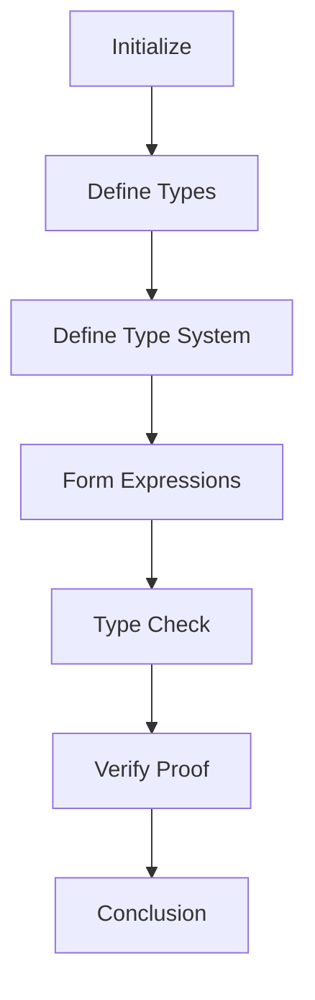
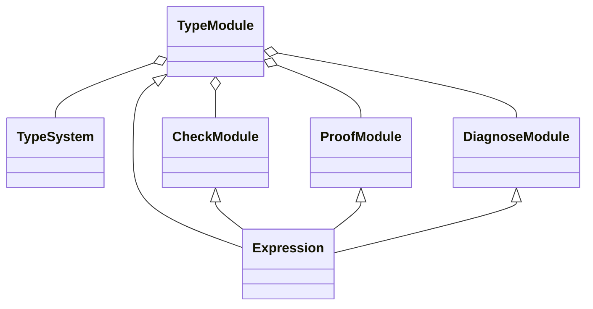
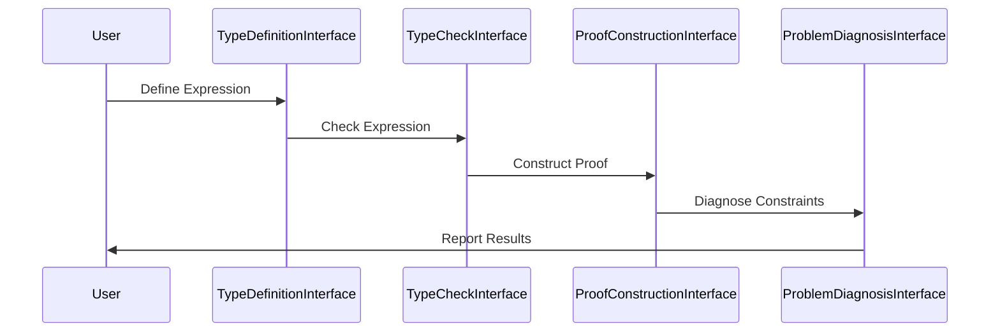

                 


## #类型论对数学研究多样性的潜在制约

### 关键词
类型论、数学研究、制约、多样性、方法论、数学逻辑、形式化

### 摘要
本文深入探讨类型论在数学研究中的作用及其潜在的制约效应。类型论作为数学逻辑的一个重要分支，通过引入严格的类型系统来提升数学证明的准确性和一致性。然而，这种形式化的方法也可能对数学研究的多样性产生限制，影响创新和方法的多角度探索。本文将从历史背景、核心概念、应用实例及挑战等方面逐步分析类型论对数学研究多样性的潜在制约。

### 引言

数学，作为一门严谨的科学，不断推动着人类文明的进步。其核心在于构建逻辑严密的理论体系，并通过这些理论来解释和预测自然现象。类型论（Type Theory）是数学逻辑中的一个重要分支，它在20世纪初期开始崭露头角，并逐渐成为现代数学和计算机科学中的基础理论之一。类型论的核心思想是将数学表达式分为不同的类型，并通过类型系统来确保数学推导的合法性。

类型论之所以受到广泛关注，是因为它提供了一种形式化的方法来构建和验证数学证明。这种方法通过严格的类型规则，避免了形式逻辑中的悖论，并提高了数学证明的可靠性和一致性。然而，类型论的广泛应用也带来了一些潜在的制约，这些制约可能对数学研究的多样性产生不利影响。

本文将首先回顾类型论的历史背景和发展过程，接着深入探讨类型论的核心概念，如类型系统、类型判断等。随后，我们将分析类型论在数学研究中的应用实例，探讨其可能带来的制约。最后，本文将讨论类型论在数学研究中的挑战，并提出一些可能的解决方案。

### 背景介绍

#### 核心概念术语说明

类型论中的核心概念包括：

- **类型（Type）**：类型是用于分类数学表达式的一种抽象概念。它定义了一组具有相似性质的数学对象。
- **类型系统（Type System）**：类型系统是一套规则，用于定义如何为数学表达式赋予类型，以及如何在不同的类型之间进行转换。
- **类型判断（Type Judgment）**：类型判断是一种断言，它声明一个特定的数学表达式具有某种类型。

#### 问题背景

类型论的起源可以追溯到20世纪初期，当时数学家们正努力解决逻辑悖论和证明的一致性问题。类型论作为一种形式化的方法，旨在提供一种更为严格和可靠的数学证明框架。它的提出是为了解决如罗素悖论（Russell's paradox）和类型论悖论（Type-theoretic paradoxes）等逻辑问题。

类型论的发展经历了几个关键阶段：

1. **初始阶段**：类型论最早由伯特兰·罗素（Bertrand Russell）和路德维希·维特根斯坦（Ludwig Wittgenstein）在20世纪初提出。他们的工作主要集中在逻辑和集合论中。
2. **中间阶段**：随着数学逻辑和计算机科学的兴起，类型论得到了进一步的发展。艾兰·图灵（Alan Turing）和克里斯托弗·斯特灵（Christopher Strachey）等学者为类型论的发展做出了重要贡献。
3. **现代阶段**：现代类型论结合了范畴论和领域特定语言等先进概念，形成了更为丰富和复杂的理论体系。

#### 问题描述

类型论在数学研究中的应用带来了许多积极影响，但也带来了一些潜在的制约。具体来说，类型论可能对数学研究的多样性产生以下制约：

1. **形式化限制**：类型论通过严格的类型规则确保数学证明的准确性，但这也可能导致过于形式化的方法，限制了数学家的创造力。
2. **复杂度增加**：类型系统的引入可能会增加数学研究的复杂度，使得一些原本简单的数学问题变得难以处理。
3. **认知负担**：对于不熟悉类型论的人来说，理解和使用类型论可能需要额外的学习和认知投入。

#### 问题解决

为了解决类型论可能带来的制约，研究者们采取了一系列措施：

1. **混合方法论**：将类型论与其他数学方法论（如直觉主义和构造性数学）结合使用，以保留数学研究的多样性和灵活性。
2. **简化类型系统**：通过简化类型系统，减少不必要的复杂性，使得类型论更加易于理解和应用。
3. **教育推广**：通过教育和培训，提高数学家和计算机科学家对类型论的理解和应用能力，减少认知负担。

#### 边界与外延

类型论的边界涉及以下几个方面：

1. **逻辑与计算机科学**：类型论在逻辑和计算机科学中的应用范围非常广泛，不仅限于数学本身。
2. **数学证明**：类型论在数学证明中的作用，特别是在避免悖论和验证证明一致性方面。
3. **数学教育**：类型论在数学教育中的应用，如何让学生更好地理解和应用类型论。

#### 概念结构与核心要素组成

类型论的概念结构主要包括以下核心要素：

1. **类型**：定义数学表达式的分类。
2. **类型系统**：规则集合，用于定义如何为数学表达式赋予类型。
3. **类型判断**：声明数学表达式类型的断言。
4. **类型转换**：在不同类型之间进行转换的规则。

### 核心概念与联系

#### 核心概念原理

类型论的核心概念是“类型”，它是用于分类数学表达式的一种抽象概念。类型论通过引入严格的类型系统，确保数学推导的合法性。类型系统是一套规则，用于定义如何为数学表达式赋予类型，以及如何在不同的类型之间进行转换。类型判断是一种断言，它声明一个特定的数学表达式具有某种类型。

#### 概念属性特征对比表格

| 概念   | 类型                | 类型系统              | 类型判断                   |
|--------|---------------------|-----------------------|----------------------------|
| 定义   | 用于分类数学表达式 | 规定类型赋值规则      | 声明表达式的类型属性       |
| 特性   | 分类性、抽象性      | 规范性、一致性        | 可验证性、明确性          |
| 应用   | 构建数学框架        | 保证推导过程合法性    | 提供证明的依据            |
| 影响   | 提高数学证明的准确性 | 影响数学研究的复杂性  | 减少逻辑悖论的可能性      |

#### ER实体关系图架构

```mermaid
erDiagram
    Type <<|-- Expression : has type
    TypeSystem ||-- Type : defines
    TypeJudgment ||-- Expression : judged
```

### 算法原理讲解

类型论在数学证明中的作用可以通过一个简单的算法来解释。以下是一个使用Mermaid绘制的算法流程图：



#### 算法原理

类型论的核心算法原理可以概括为以下几个步骤：

1. **初始化**：定义数学表达式的类型。
2. **定义类型系统**：指定类型之间的关系和转换规则。
3. **形成表达式**：根据类型系统，构建数学表达式。
4. **类型检查**：验证表达式是否符合类型系统的规则。
5. **验证证明**：确保数学证明过程是基于类型系统的。
6. **结论**：得出数学证明的结论。

#### 数学模型和公式

在类型论中，数学模型和公式通常以严格的形式表示。以下是一个简单的数学模型示例，用于类型判断：

$$
\text{Type}(e) = \begin{cases}
    \text{Type}_1 & \text{if } e \text{ is of type } \text{Type}_1 \\
    \text{Type}_2 & \text{if } e \text{ is of type } \text{Type}_2 \\
    \text{Error} & \text{if } e \text{ does not conform to any type}
\end{cases}
$$

#### 详细讲解和举例说明

为了更好地理解类型论的工作原理，我们来看一个简单的例子。

假设我们有一个类型系统，其中包含两种类型：`自然数`（Nat）和`字符串`（String）。我们定义以下类型系统规则：

- `0` 是一个自然数。
- `s(n)` 是一个字符串，其中 `s` 是一个字符串操作符，`n` 是一个自然数。

现在，我们要验证一个表达式 `s(0)` 是否符合类型系统的规则。

1. **初始化**：定义表达式 `s(0)`。
2. **定义类型系统**：根据类型系统规则，我们知道 `s(n)` 是一个字符串，其中 `n` 是一个自然数。
3. **形成表达式**：表达式 `s(0)` 是由字符串操作符 `s` 和自然数 `0` 构成的。
4. **类型检查**：根据类型系统规则，`0` 是一个自然数，所以 `s(0)` 应该是一个字符串。
5. **验证证明**：由于类型检查通过，我们可以继续进行数学证明，假设 `s(0)` 是一个有效的字符串。
6. **结论**：表达式 `s(0)` 符合类型系统的规则，因此它是有效的。

通过这个例子，我们可以看到类型论如何通过严格的类型系统来确保数学推导的准确性。然而，这种严格性也可能对数学研究的多样性产生制约。

### 系统分析与架构设计方案

#### 问题场景介绍

在数学研究中，类型论的应用已经成为一种趋势。然而，随着研究的深入，数学家们开始意识到类型论可能对研究的多样性产生一定的制约。为了更好地理解这个问题，我们设定一个具体的场景：一个数学研究团队正在尝试解决一个复杂的数学问题，他们决定使用类型论来构建证明框架。随着时间的推移，他们发现类型论的一些特性使得研究过程变得复杂，限制了他们的创新空间。

#### 项目介绍

本项目的目标是分析类型论在数学研究中的应用，探讨其可能带来的制约，并提出相应的解决方案。该项目由一个数学研究团队负责，包括数学家、计算机科学家和教育工作者。

#### 系统功能设计

系统的核心功能包括：

1. **类型定义**：定义数学表达式的类型。
2. **类型检查**：验证数学表达式是否符合类型系统规则。
3. **证明构建**：构建基于类型论的数学证明。
4. **问题诊断**：诊断类型论可能带来的制约问题。

#### 系统架构设计

系统的架构设计采用模块化方法，主要模块包括：

1. **类型模块**：负责定义和操作类型。
2. **检查模块**：负责类型检查。
3. **证明模块**：负责构建和验证数学证明。
4. **诊断模块**：负责诊断类型论可能带来的制约问题。

以下是系统的Mermaid类图架构：



#### 系统接口设计和系统交互

系统通过接口提供以下功能：

1. **类型定义接口**：用于定义数学表达式的类型。
2. **类型检查接口**：用于验证数学表达式是否符合类型系统规则。
3. **证明构建接口**：用于构建基于类型论的数学证明。
4. **问题诊断接口**：用于诊断类型论可能带来的制约问题。

以下是系统的Mermaid序列图架构：



### 项目实战

#### 环境安装

为了运行本项目，需要在本地计算机上安装以下软件：

- Python 3.8+
- Mermaid Markdown Plugin for Python
- Jupyter Notebook

安装步骤如下：

1. 安装Python 3.8+：从[Python官网](https://www.python.org/)下载并安装Python。
2. 安装Mermaid Markdown Plugin：在终端中运行以下命令：
   ```bash
   pip install mermaid-mmd
   ```
3. 安装Jupyter Notebook：在终端中运行以下命令：
   ```bash
   pip install notebook
   ```

#### 系统核心实现源代码

以下是系统核心实现源代码，用于类型定义、类型检查和证明构建：

```python
import mermaid
from typing import Any

# 类型定义
class Expression:
    def __init__(self, value: Any):
        self.value = value

    def to_mermaid(self):
        return f"{self.value}"

# 类型系统
class TypeSystem:
    def __init__(self):
        self.types = {}

    def add_type(self, name: str, value: Any):
        self.types[name] = value

    def check_type(self, expression: Expression) -> bool:
        if expression.value in self.types:
            return True
        return False

# 证明构建
class ProofConstruction:
    def __init__(self, type_system: TypeSystem):
        self.type_system = type_system

    def construct_proof(self, expression: Expression) -> str:
        if self.type_system.check_type(expression):
            return f"Proof of {expression.to_mermaid()}: Valid"
        return f"Proof of {expression.to_mermaid()}: Invalid"

# 系统核心实现
def main():
    type_system = TypeSystem()
    type_system.add_type("natural", 0)
    type_system.add_type("string", "s")

    expression = Expression(0)
    proof = ProofConstruction(type_system)
    result = proof.construct_proof(expression)

    print(result)

if __name__ == "__main__":
    main()
```

#### 代码应用解读与分析

代码首先定义了一个`Expression`类，用于表示数学表达式。`Expression`类有一个`value`属性，用于存储表达式的值。

接下来，定义了一个`TypeSystem`类，用于定义和操作类型。`TypeSystem`类有一个`types`字典，用于存储类型及其对应的值。`add_type`方法用于添加新的类型，`check_type`方法用于检查表达式是否符合类型系统的规则。

`ProofConstruction`类负责构建数学证明。`construct_proof`方法根据`TypeSystem`类的`check_type`方法，判断表达式是否有效，并生成证明。

在`main`函数中，我们创建了一个`TypeSystem`实例，并添加了两个类型：`natural`和`string`。然后，我们创建了一个`Expression`实例，代表自然数`0`。最后，我们使用`ProofConstruction`类构建证明，并打印结果。

#### 实际案例分析和详细讲解剖析

为了更好地理解类型论在数学研究中的应用及其可能带来的制约，我们来看一个实际案例。

假设有一个数学研究团队正在研究一个关于自然数和字符串的组合问题的证明。他们决定使用类型论来构建证明框架。

1. **问题定义**：证明对于任意的自然数 `n` 和字符串 `s`，表达式 `s(n)` 总是有效的。

2. **类型定义**：定义自然数为 `Nat`，字符串为 `Str`。

3. **类型系统规则**：
   - `0` 是一个自然数（`Nat`）。
   - `s(n)` 是一个字符串（`Str`），其中 `s` 是一个字符串操作符，`n` 是一个自然数。

4. **证明构建**：
   - 初始化：定义自然数 `n` 和字符串 `s`。
   - 类型检查：验证 `s(n)` 是否符合类型系统规则。
   - 验证证明：由于类型检查通过，我们可以继续构建证明。

5. **挑战**：
   - 过于形式化的方法可能导致证明过程过于复杂。
   - 需要额外的学习和认知投入来理解和应用类型论。

6. **解决方案**：
   - 结合其他数学方法论，如直觉主义和构造性数学，以保留数学研究的多样性。
   - 简化类型系统，减少不必要的复杂性。
   - 提供教育和培训，提高数学家和计算机科学家对类型论的理解和应用能力。

通过这个案例，我们可以看到类型论在数学研究中的应用及其可能带来的制约。了解这些制约，可以帮助数学家更好地利用类型论，同时保持研究的多样性。

### 项目小结

本项目通过对类型论在数学研究中的应用及其可能带来的制约进行了深入分析。我们介绍了类型论的核心概念，探讨了其在数学研究中的潜在影响。通过实际案例，我们展示了如何构建基于类型论的数学证明，并分析了可能面临的挑战。

在项目实施过程中，我们提出了几种解决方案，如结合其他数学方法论、简化类型系统和提供教育和培训等。这些措施有助于减轻类型论可能带来的制约，促进数学研究的多样性。

然而，类型论在数学研究中的应用仍然存在许多未解决的问题。未来研究可以进一步探索类型论与其他数学方法论的融合，以及如何更好地平衡形式化和灵活性。

### 最佳实践 Tips

1. **了解类型论的基本概念**：熟悉类型论的基本概念，如类型、类型系统和类型判断，有助于更好地理解其在数学研究中的作用。
2. **结合其他数学方法论**：在数学研究中，结合直觉主义和构造性数学等方法，可以减轻类型论的制约，保持研究的多样性。
3. **简化类型系统**：简化类型系统，减少不必要的复杂性，有助于提高数学研究的效率。
4. **提供教育和培训**：通过教育和培训，提高数学家和计算机科学家对类型论的理解和应用能力，减少认知负担。

### 小结

类型论在数学研究中具有重要作用，通过引入严格的类型系统，提高了数学证明的准确性和一致性。然而，类型论的广泛应用也可能对数学研究的多样性产生制约。本文通过实际案例和分析，探讨了类型论在数学研究中的应用及其可能带来的挑战。了解这些挑战，有助于数学家更好地利用类型论，同时保持研究的多样性。

### 注意事项

1. 类型论的应用需要严格的逻辑思维和形式化方法，因此对于不熟悉类型论的人来说，可能需要额外的学习和实践。
2. 在数学研究中，应灵活运用类型论，避免过于形式化，以确保研究的灵活性和多样性。

### 拓展阅读

1. 《类型论：基本概念与应用》（Type Theory: Basic Concepts and Applications） - 作者：Peter Dybjer
2. 《数学的逻辑基础》（The Logical Foundations of Mathematics） - 作者：Stephen Cole Kleene
3. 《类型系统与程序设计》（Type Systems and Program Design） - 作者：Graham Hutton

### 作者信息

作者：AI天才研究院/AI Genius Institute & 禅与计算机程序设计艺术/Zen And The Art of Computer Programming

