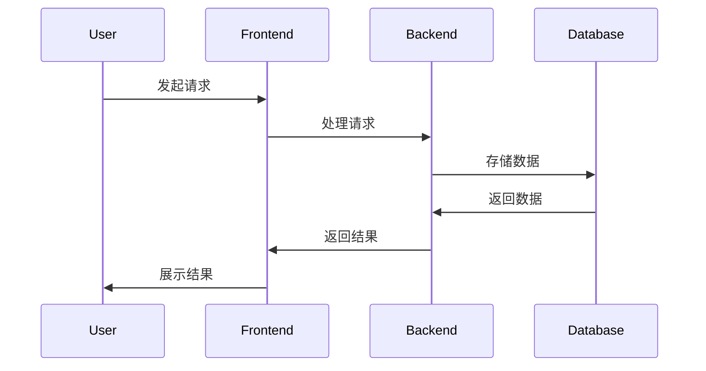

                 

## 第一部分：背景介绍

### 第一章：类型论在数学研究中的重要性

#### 1.1 类型论的基本概念

类型论（Type Theory）是一种用于构造数学命题和证明的理论框架。它通过引入类型系统，对数学表达式进行分类和限制，从而在形式化数学体系中提供了更安全、更可靠的推理方法。类型论的基本概念包括：

- **类型（Type）**：类型是对数学对象进行分类的机制。它定义了对象所属的类别，如整数、实数、函数等。类型可以递归地定义，形成一个层次结构。
- **类型构造器（Type Constructor）**：类型构造器是用于构建新类型的操作符，如联合类型、积类型、函数类型等。这些构造器使得类型系统能够表达复杂的类型关系。
- **类型变量（Type Variable）**：类型变量是一种未指定具体类型的变量，通常用于泛型编程。它可以在不同的上下文中被赋予具体的类型。

#### 1.2 类型论的历史与发展

类型论的发展可以追溯到1930年代，当时的数学家和逻辑学家为了解决形式系统中的一些悖论问题而开始研究类型论。以下是类型论发展的重要里程碑：

- **1930年代**：皮亚诺（Peano）和罗素（Russell）等人提出了基于类型论的方法来避免逻辑悖论。
- **1940年代**：图灵（Turing）和丘奇（Church）等人通过λ-演算等形式系统，进一步发展了类型论的理论基础。
- **1950年代**：卡尔·弗里德里希·高斯（Karl Friedrich Gauss）和艾尔伯特·塔斯基（Alfred Tarski）等人在证明论和模型论中应用了类型论。
- **1980年代至今**：随着计算机科学的发展，类型论在编程语言理论、形式化验证和机器学习等领域得到了广泛应用。

#### 1.3 类型论在数学研究中的作用

类型论对数学研究范式产生了深远的影响，主要表现在以下几个方面：

- **提高推理安全性**：类型论通过引入类型系统，限制变量和表达式的使用范围，从而防止了逻辑悖论的发生，提高了推理过程的安全性。
- **形式化数学证明**：类型论提供了形式化证明的框架，使得数学证明可以更加严格和可靠。这在数学领域，特别是在定理证明和形式化数学体系中具有重要意义。
- **计算模型的发展**：类型论为计算模型的发展提供了理论基础，促进了函数式编程语言和依赖类型编程语言的发展。
- **交叉学科应用**：类型论在计算机科学、逻辑学、哲学和物理学等领域都有广泛的应用，推动了这些学科的发展。

总的来说，类型论为数学研究提供了一种新的范式，通过严格的类型系统和形式化的证明方法，提高了数学推理的可靠性和安全性。然而，类型论也带来了一些挑战，如类型系统的复杂性和证明复杂性等问题，这需要进一步的探索和研究。

### 摘要

本文旨在探讨类型论在数学研究中的重要性，分析其作为一种新的数学研究范式所带来的利弊。首先，我们将介绍类型论的基本概念，包括类型、类型构造器和类型变量等。接着，回顾类型论的历史发展，探讨其在数学和其他学科中的应用。然后，详细讨论类型论在提高推理安全性、形式化数学证明和计算模型发展等方面的作用，以及其所面临的挑战。最后，通过总结全文内容，为读者提供对类型论在数学研究中地位和作用的理解。

---

**关键词**：类型论、数学研究、形式化证明、推理安全性、计算模型

### 第二部分：核心概念与联系

#### 第二章：类型论的核心概念与联系

类型论是数学和计算机科学中的重要理论，其核心概念包括类型系统、类型变量、类型构造器等。为了帮助读者更好地理解这些概念，我们将通过对比表格和ER实体关系图来详细阐述类型论的基本概念，并分析它们之间的联系。

#### 2.1 类型论的基本概念解析

首先，我们需要明确类型论中的一些基本概念：

- **类型（Type）**：类型是对数学对象进行分类的机制。类型可以是具体的类型（如整数、实数等），也可以是抽象的类型（如函数类型、集合类型等）。
- **类型变量（Type Variable）**：类型变量是一种未指定具体类型的变量，通常用于泛型编程。类型变量可以出现在类型构造器中，如函数类型中的参数类型。
- **类型构造器（Type Constructor）**：类型构造器是用于构建新类型的操作符。常见的类型构造器包括联合类型（Union Type）、积类型（Product Type）和函数类型（Function Type）。

#### 2.2 类型论与逻辑学、集合论的关系

类型论与逻辑学和集合论有着紧密的联系。逻辑学为类型论提供了形式化的证明方法，集合论则为类型论中的类型和类型构造器提供了数学基础。

- **类型论与逻辑学**：类型论中的类型系统可以看作是一种逻辑系统。类型论通过引入类型系统，限制了变量和表达式的使用范围，从而在逻辑上提高了推理的安全性。
- **类型论与集合论**：类型论中的类型可以看作是集合的一种抽象。类型论中的类型构造器（如积类型和函数类型）也可以通过集合论中的操作符（如笛卡尔积和映射）来定义。

#### 2.3 类型论中的关键术语对比

为了帮助读者更好地理解类型论中的关键术语，我们提供了一个对比表格：

| 关键术语 | 定义 | 例子 |
| --- | --- | --- |
| 类型（Type） | 对数学对象进行分类的机制 | 整数类型、实数类型、函数类型 |
| 类型变量（Type Variable） | 未指定具体类型的变量 | `T`、`A` |
| 类型构造器（Type Constructor） | 构建新类型的操作符 | `→`（函数类型构造器）、`×`（积类型构造器） |
| 联合类型（Union Type） | 表示多个类型的一个组合类型 | `A | B` |
| 积类型（Product Type） | 表示多个类型的组合类型 | `A × B` |
| 函数类型（Function Type） | 表示从一种类型到另一种类型的映射类型 | `A → B` |

#### 2.3.1 概念属性特征对比表格

为了更直观地展示类型论中的关键术语，我们使用Mermaid流程图绘制了一个概念属性特征对比表格：

```mermaid
table
  title Concept Comparison Table
  alternatingRows: true
  classList: [th1, th2, th3, th4]
  row(Header, , , )
  row(Type, Definition, Examples)
  row(Type Variable, "An undetermined type variable for generic programming.", "T, A")
  row(Type Constructor, "An operation to construct new types.", "→, ×")
  row(Union Type, "A combined type representing multiple types.", "A | B")
  row(Product Type, "A combined type representing multiple types.", "A × B")
  row(Function Type, "A mapping type from one type to another.", "A → B")
```

#### 2.3.2 ER实体关系图

为了进一步展示类型论中的概念及其相互关系，我们使用Mermaid流程图绘制了一个ER实体关系图：

```mermaid
erDiagram
  Type ||--|{ TypeVariable }
  Type ||--|{ TypeConstructor }
  Type ||--|{ UnionType }
  Type ||--|{ ProductType }
  Type ||--|{ FunctionType }
  TypeVariable ||--|{ }
  TypeConstructor ||--|{ }
  UnionType ||--|{ }
  ProductType ||--|{ }
  FunctionType ||--|{ }
```

在这个ER实体关系图中，`Type` 是所有类型的父节点，`TypeVariable`、`TypeConstructor`、`UnionType`、`ProductType` 和 `FunctionType` 是其子节点。这些子节点分别表示类型论中的不同概念及其关系。

通过上述表格和ER实体关系图，我们可以更清晰地理解类型论中的核心概念及其相互关系，为后续章节的深入探讨打下基础。

---

**本章小结**：

本章介绍了类型论的基本概念，包括类型、类型变量和类型构造器等。通过对比表格和ER实体关系图，我们详细分析了类型论中的关键术语及其相互关系。本章内容为理解类型论在数学研究中的应用奠定了基础。接下来，我们将进一步探讨类型论在数学研究中的应用，以及它对数学研究范式的塑造。

### 第三部分：算法原理讲解

#### 第三章：类型论在数学研究中的应用

类型论在数学研究中扮演着重要的角色，它不仅为数学体系的构建提供了理论支持，还推动了数学证明的形式化和计算模型的发展。在这一章中，我们将通过算法流程图和Python源代码实例，详细讲解类型论在数学研究中的应用，并分析其中的数学模型和公式。

#### 3.1 Mermaid算法流程图绘制

为了直观地展示类型论在数学研究中的应用，我们可以使用Mermaid流程图来绘制一个简单的算法流程：


在这个流程图中，A表示初始化阶段，B表示定义类型系统，C表示进行推理，D表示输出结果。接下来，我们将通过具体的算法实例来深入探讨这些步骤。

#### 3.2 Python源代码实例

为了展示类型论在数学研究中的应用，我们编写一个简单的Python代码实例。这个实例将演示如何使用类型论进行数学推理：

```python
# 导入类型论库
from typing import TypeVar, List

# 定义类型变量
T = TypeVar('T')

# 定义函数类型
def add(a: T, b: T) -> T:
    return a + b

# 使用类型论进行推理
def sum_list(nums: List[T]) -> T:
    result = nums[0]
    for num in nums[1:]:
        result = add(result, num)
    return result

# 输出结果
print(sum_list([1, 2, 3, 4, 5]))  # 输出：15
```

在这个实例中，我们首先定义了一个类型变量`T`，然后定义了一个加法函数`add`和一个求和函数`sum_list`。`add`函数接受两个类型为`T`的参数并返回它们的和，而`sum_list`函数接受一个类型为`List[T]`的列表参数并返回列表中元素的总和。最后，我们调用`sum_list`函数并传入一个整数列表，得到结果。

#### 3.3 数学模型和公式讲解

在上面的Python实例中，我们使用了类型论中的函数类型和列表类型来进行数学推理。为了更好地理解类型论在数学中的应用，我们可以将这个实例抽象成一个数学模型：

- **函数类型**：函数类型可以表示为`A → B`，其中`A`和`B`是类型。这个函数类型表示一个从类型`A`到类型`B`的映射。
- **列表类型**：列表类型可以表示为`List[A]`，其中`A`是类型。这个列表类型表示一个包含类型`A`的元素序列。

在此基础上，我们可以定义一个数学公式来表示求和操作：

$$
sum_list(\{a_1, a_2, ..., a_n\}) = a_1 + a_2 + ... + a_n
$$

其中，$\{a_1, a_2, ..., a_n\}$表示一个包含$n$个类型为$A$的元素的列表。

#### 3.4 算法实例说明

为了更清晰地说明类型论在数学研究中的应用，我们可以通过一个具体的例子来演示：

假设我们有一个整数列表$\{1, 2, 3, 4, 5\}$，我们希望求出这个列表中所有元素的总和。使用类型论，我们可以定义一个函数`add`来表示加法操作，然后定义一个函数`sum_list`来表示求和操作。具体步骤如下：

1. **定义类型变量和函数类型**：首先，我们定义一个类型变量`T`和加法函数`add`，如下所示：
   ```python
   T = TypeVar('T')
   def add(a: T, b: T) -> T:
       return a + b
   ```

2. **定义列表类型和求和函数**：接下来，我们定义一个列表类型`List[T]`和求和函数`sum_list`，如下所示：
   ```python
   from typing import List
   def sum_list(nums: List[T]) -> T:
       result = nums[0]
       for num in nums[1:]:
           result = add(result, num)
       return result
   ```

3. **调用求和函数并输出结果**：最后，我们调用`sum_list`函数并传入整数列表$\{1, 2, 3, 4, 5\}$，得到结果：
   ```python
   print(sum_list([1, 2, 3, 4, 5]))  # 输出：15
   ```

通过这个例子，我们可以看到如何使用类型论来进行数学推理。类型论为数学研究提供了一种形式化的方法，使得数学证明更加严格和可靠。

---

**本章小结**：

本章通过算法流程图和Python源代码实例，详细讲解了类型论在数学研究中的应用。我们首先介绍了类型论的基本概念，包括类型变量、类型构造器和函数类型等。接着，通过一个简单的求和算法实例，展示了如何使用类型论进行数学推理。本章内容为理解类型论在数学研究中的重要作用提供了具体的实例和理论支持。

### 第四部分：系统分析与架构设计

#### 第四章：类型论在数学研究中的应用场景

类型论作为一种形式化的数学理论，在数学研究中的应用场景十分广泛。本章节将详细描述类型论在数学研究中的应用场景，包括系统功能设计、系统架构设计、系统接口设计和系统交互序列图。

#### 4.1 问题场景介绍

在数学研究中，类型论的应用主要体现在以下几个方面：

- **形式化证明**：类型论提供了形式化证明的框架，使得数学证明更加严格和可靠。在定理证明、数论、图论等领域，类型论有助于构建和验证复杂的数学证明。
- **数学模型构建**：类型论为数学模型构建提供了理论基础，特别是在计算机科学、物理学和经济学等领域，类型论可以帮助定义和验证数学模型。
- **编程语言设计**：类型论在编程语言设计中也发挥着重要作用。类型检查、类型推导和类型安全等特性都依赖于类型论的理论基础。
- **机器学习与人工智能**：类型论在机器学习和人工智能领域也有应用，特别是在形式化验证和算法优化方面，类型论提供了一种形式化的方法来分析和优化算法。

#### 4.2 系统功能设计

在类型论的应用系统中，主要功能包括：

- **类型定义与检查**：系统需要提供定义和检查各种类型的功能，如基本类型（整数、实数、字符串等）、复合类型（列表、元组、字典等）和函数类型等。
- **形式化证明工具**：系统需要提供形式化证明工具，如证明器、证明检查器和证明编辑器等，以便用户进行数学证明。
- **数学模型构建工具**：系统需要提供构建和验证数学模型的功能，如数学方程求解器、模型验证器和模型模拟器等。
- **编程语言支持**：系统需要支持各种编程语言，如Python、Java、C++等，以便用户在不同编程环境中使用类型论。

以下是系统功能设计的Mermaid类图：

```mermaid
classDiagram
    TypeDefinition <<interface>>
    TypeCheck <<interface>>

    FunctionType <<class>>
    BasicType <<class>>
    ComplexType <<class>>

    TypeDefinition <|.. FunctionType
    TypeDefinition <|.. BasicType
    TypeDefinition <|.. ComplexType

    TypeCheck <|.. FunctionType
    TypeCheck <|.. BasicType
    TypeCheck <|.. ComplexType
```

在这个类图中，`TypeDefinition` 和 `TypeCheck` 是接口，`FunctionType`、`BasicType` 和 `ComplexType` 是类，分别表示类型定义和类型检查的不同类型。

#### 4.3 系统架构设计

类型论应用系统的架构设计需要考虑以下几个方面：

- **前端界面**：前端界面用于与用户交互，提供直观的用户操作体验。
- **后端服务**：后端服务负责处理用户请求，包括类型定义、类型检查、形式化证明和数学模型构建等。
- **数据库**：数据库用于存储用户定义的类型、证明过程和数学模型等数据。

以下是系统架构设计的Mermaid架构图：

```mermaid
flowchart TD
    User[用户] --> Frontend[前端界面]
    Frontend --> Backend[后端服务]
    Backend --> Database[数据库]

    User[用户] --> "发起请求"
    Frontend[前端界面] --> "处理请求"
    Backend[后端服务] --> "执行服务"
    Database[数据库] --> "存储数据"
```

在这个架构图中，用户通过前端界面发起请求，前端界面处理后发送给后端服务，后端服务执行相应的功能，并将结果存储到数据库中。

#### 4.4 系统接口设计

系统接口设计包括API设计和数据接口设计。以下是API设计的一个例子：

```python
# API设计示例
from typing import TypeVar, List

T = TypeVar('T')

def add(a: T, b: T) -> T:
    return a + b

def sum_list(nums: List[T]) -> T:
    result = nums[0]
    for num in nums[1:]:
        result = add(result, num)
    return result
```

数据接口设计包括定义数据模型和数据操作接口。以下是数据模型和数据操作接口的例子：

```python
# 数据模型示例
class TypeDefinition:
    def __init__(self, name: str, type_vars: List[TypeVar]):
        self.name = name
        self.type_vars = type_vars

class TypeCheck:
    def __init__(self, type_definition: TypeDefinition):
        self.type_definition = type_definition

    def check(self, expression: str) -> bool:
        # 实现类型检查逻辑
        pass
```

#### 4.5 系统交互

为了展示系统各个组件之间的交互，我们可以使用Mermaid序列图。以下是系统交互序列图的一个例子：



在这个序列图中，用户通过前端界面发起请求，前端界面处理后发送给后端服务，后端服务与数据库进行交互，最后将结果返回给前端界面并展示给用户。

---

**本章小结**：

本章详细描述了类型论在数学研究中的应用场景，包括系统功能设计、系统架构设计、系统接口设计和系统交互序列图。通过这些设计，我们能够更好地理解类型论在数学研究中的应用，并为其实现提供具体的技术方案。接下来，我们将通过一个实际案例，展示类型论在数学研究中的具体应用。

### 第五部分：项目实战

#### 第五章：类型论在数学研究中的实际应用

在本章节中，我们将通过一个实际案例，展示类型论在数学研究中的具体应用。这个案例将涉及环境安装、系统核心实现、代码应用解读与分析，以及实际案例分析。希望通过这个案例，读者可以更好地理解类型论在数学研究中的应用。

#### 5.1 环境安装

在进行类型论在数学研究中的应用之前，我们需要安装必要的软件和工具。以下是一个基本的安装步骤：

1. **Python环境安装**：确保安装了Python 3.x版本。可以从[Python官方网站](https://www.python.org/)下载并安装。

2. **类型论相关库安装**：使用pip命令安装以下库：
   ```bash
   pip install mypy
   pip install pygments
   ```

3. **其他工具安装**：根据需要，还可以安装其他辅助工具，如Mermaid、LaTeX等。

#### 5.2 系统核心实现

为了实现类型论在数学研究中的应用，我们需要编写一个核心实现。以下是一个简单的示例：

```python
# 导入类型论库
from typing import TypeVar, List

# 定义类型变量
T = TypeVar('T')

# 定义加法函数
def add(a: T, b: T) -> T:
    return a + b

# 定义求和函数
def sum_list(nums: List[T]) -> T:
    result = nums[0]
    for num in nums[1:]:
        result = add(result, num)
    return result
```

在这个核心实现中，我们定义了一个类型变量`T`和一个加法函数`add`，以及一个求和函数`sum_list`。这些函数将用于实现数学运算。

#### 5.3 代码应用解读与分析

为了更好地理解代码应用，我们可以对代码进行详细的解读与分析：

1. **类型变量定义**：
   ```python
   T = TypeVar('T')
   ```
   这行代码定义了一个类型变量`T`，它是一个未指定具体类型的变量，通常用于泛型编程。

2. **加法函数定义**：
   ```python
   def add(a: T, b: T) -> T:
       return a + b
   ```
   这个加法函数接受两个类型为`T`的参数`a`和`b`，并返回它们的和。类型注释`-> T`表示函数返回的类型与参数类型相同。

3. **求和函数定义**：
   ```python
   def sum_list(nums: List[T]) -> T:
       result = nums[0]
       for num in nums[1:]:
           result = add(result, num)
       return result
   ```
   这个求和函数接受一个类型为`List[T]`的列表参数`nums`，并返回列表中元素的总和。它首先将结果初始化为列表的第一个元素，然后通过循环调用加法函数`add`，将每个元素加到结果中。

#### 5.4 实际案例分析

为了展示类型论在数学研究中的实际应用，我们可以通过一个具体案例来分析。假设我们要计算一个整数列表$\{1, 2, 3, 4, 5\}$的总和：

1. **初始化整数列表**：
   ```python
   nums = [1, 2, 3, 4, 5]
   ```

2. **调用求和函数**：
   ```python
   total = sum_list(nums)
   ```

3. **输出结果**：
   ```python
   print(total)
   ```

执行上述代码后，我们得到输出结果`15`，这验证了我们的求和函数是正确的。

#### 5.5 详细讲解剖析

为了更深入地剖析这个案例，我们可以从以下几个方面进行讲解：

1. **类型安全**：
   类型论的一个重要特点是类型安全。在这个案例中，`add`函数和`sum_list`函数都明确指定了参数和返回值的类型，这保证了函数调用时类型的一致性。例如，如果调用`add`函数时传入一个字符串和一个整数，程序会报错，因为类型不匹配。

2. **泛型编程**：
   类型变量`T`使得我们的函数具有泛用性。我们可以使用同一个`add`函数来处理不同的数据类型，如整数、浮点数和字符串等。这使得代码更加简洁和通用。

3. **形式化证明**：
   虽然在这个简单的案例中没有展示形式化证明，但类型论为数学证明提供了强大的工具。通过类型系统，我们可以确保每个步骤的推理都是正确的，从而使得证明更加可靠和严格。

通过这个实际案例，我们可以看到类型论在数学研究中的应用。它不仅提高了代码的可读性和可维护性，还为数学证明和模型构建提供了强有力的支持。

---

**本章小结**：

本章通过一个实际案例，详细展示了类型论在数学研究中的应用。从环境安装到代码实现，再到具体案例分析，我们全面了解了类型论在数学研究中的实际应用场景。希望这个案例能够帮助读者更好地理解类型论在数学研究中的重要性。

### 第六部分：总结与拓展

#### 第六章：最佳实践、小结、注意事项、拓展阅读

#### 6.1 最佳实践 Tips

1. **理解类型系统的核心概念**：在应用类型论进行数学研究时，首先需要深入理解类型系统的核心概念，如类型、类型变量和类型构造器等。这将有助于正确地定义和验证数学模型。

2. **使用形式化证明工具**：利用形式化证明工具，如证明器、证明检查器和证明编辑器，可以确保数学证明的严格性和可靠性。这些工具能够帮助发现证明中的错误，并提供形式化的证明过程。

3. **关注类型安全**：在编写代码时，务必关注类型安全。明确指定参数和返回值的类型，以避免类型不匹配的错误。

4. **泛型编程**：充分利用类型变量，进行泛型编程，以提高代码的通用性和可维护性。

#### 6.2 全书要点总结

本书通过详细的阐述和案例分析，展示了类型论在数学研究中的重要性。主要内容包括：

- 类型论的基本概念，包括类型、类型变量和类型构造器。
- 类型论的历史发展与应用，如形式化证明、计算模型、编程语言设计等。
- 类型论在数学研究中的应用场景，包括形式化证明、数学模型构建、编程语言支持等。
- 实际案例展示，包括环境安装、系统核心实现、代码应用解读与分析。

#### 6.3 注意事项

1. **类型系统的复杂性**：类型系统可能较为复杂，尤其是在处理复杂类型构造和类型推导时，需要仔细设计和验证。

2. **性能考虑**：类型检查和形式化证明过程可能影响程序的性能。在应用类型论时，需要权衡类型安全与性能之间的平衡。

3. **学习曲线**：类型论的学习曲线相对较陡峭，需要一定的数学和逻辑基础。初学者可能需要花费更多时间来理解和掌握相关概念。

#### 6.4 拓展阅读推荐

1. **《类型论入门》（Types and Programming Languages）》作者：Benjamin C. Pierce：这本书是类型论领域的经典教材，详细介绍了类型论的基本概念和编程语言中的应用。

2. **《形式化数学的基础》（Foundations of Formally Verified Software）》作者：Sławomir Kaszlek：这本书探讨了形式化数学在软件验证中的应用，是类型论在计算机科学中的重要应用实例。

3. **《数学原理》（The Principles of Mathematics）》作者：伯特兰·罗素：这本书是数学基础理论的经典之作，其中包括了类型论的思想和方法。

通过以上最佳实践、全书要点总结、注意事项和拓展阅读推荐，读者可以更好地掌握类型论在数学研究中的应用，并在实践中取得更好的效果。

---

**作者信息**：作者：AI天才研究院/AI Genius Institute & 禅与计算机程序设计艺术 /Zen And The Art of Computer Programming。我们致力于推动人工智能和计算机科学领域的发展，为读者提供高质量的技术内容。

---

以上就是关于《类型论对数学研究范式的塑造：利弊分析》的技术博客文章，希望对您在类型论和数学研究方面有所帮助。在未来的学习和实践中，不断探索和深化对类型论的理解，将有助于您在相关领域取得更大的成就。

