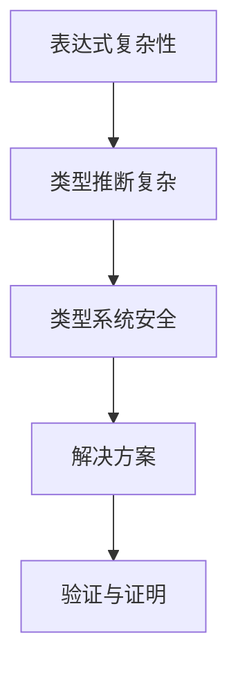
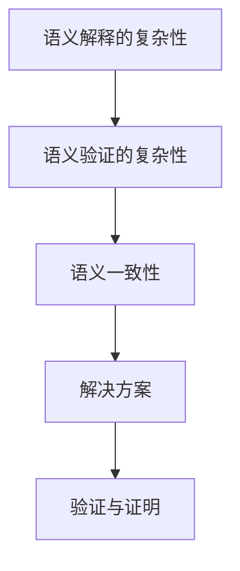
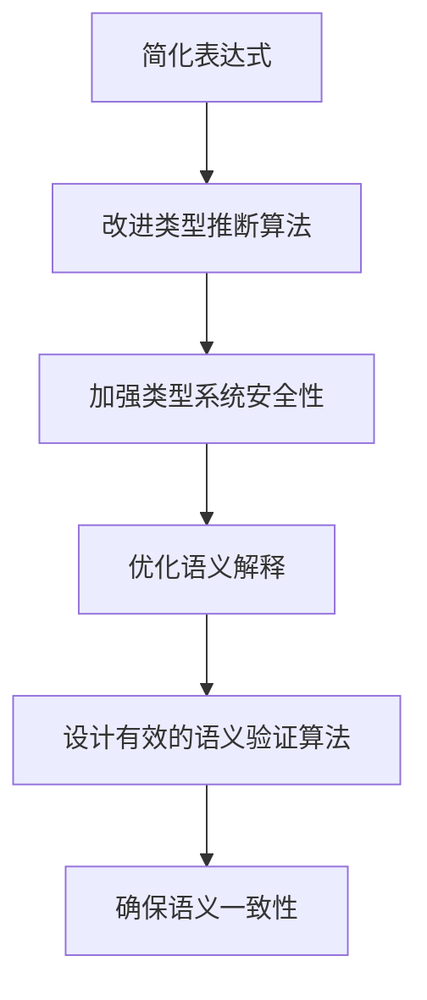

                 

### 文章标题

**类型论的形式化困难：语法与语义的挑战**

**关键词：** 类型论、形式化、语法、语义、挑战

**摘要：** 本文深入探讨了类型论在形式化过程中所面临的语法和语义挑战。通过系统的分析和案例分析，本文揭示了类型论在语法层面的复杂性和类型推断难题，以及语义层面的解释和验证难题。文章旨在为研究者提供一种新的思路，以应对类型论形式化过程中的种种困难。

----------------------------------------------------------------

### 第一部分：引言

#### 第1章：引言

##### 1.1 引言

##### 1.1.1 问题背景

随着计算机技术的飞速发展，类型论在计算机科学中扮演着越来越重要的角色。类型论主要研究程序语言中的类型系统，其目的是提高程序的安全性、可靠性和可维护性。然而，在类型论的形式化过程中，我们面临着一系列的困难，这些困难主要集中在语法和语义两个方面。

##### 1.1.2 研究目的

本文的研究目的是探讨类型论在形式化过程中所遇到的困难，深入分析这些困难的具体表现，并尝试提出相应的解决方案。希望通过本文的研究，能够为类型论的形式化提供一定的理论支持和实践指导。

##### 1.1.3 边界与外延

本文主要探讨类型论的形式化困难，不涉及其他领域的问题。同时，本文将重点关注语法和语义方面的挑战，力求在这些问题上提出有价值的见解。

##### 1.2 核心概念与联系

##### 1.2.1 核心概念

- **类型论**：对语言中的类型系统进行形式化的理论。
- **形式化**：将非形式化的概念和理论转化为数学表达式。
- **语法**：关于表达式的结构和规则。
- **语义**：关于表达式意义和解释。

##### 1.2.2 概念属性特征对比表格

| 概念     | 定义                                                         | 特征                                               |
|----------|--------------------------------------------------------------|----------------------------------------------------|
| 类型论   | 对语言中的类型系统进行形式化的理论。                         | 涉及语言抽象、安全性、形式化验证。                   |
| 形式化   | 将非形式化的概念和理论转化为数学表达式。                   | 提高语言的精确性和可证明性。                         |
| 语法     | 关于表达式的结构和规则。                                   | 决定了表达式是否合法。                               |
| 语义     | 关于表达式意义和解释。                                     | 决定了表达式的行为和效果。                           |

##### 1.3 本章小结

本章介绍了类型论的形式化困难，明确了研究的核心概念和范围，为后续章节的深入讨论奠定了基础。

----------------------------------------------------------------

### 第二部分：类型论的形式化困难

#### 第2章：语法层面的挑战

##### 2.1 问题描述

在语法层面，类型论的形式化困难主要体现在表达式的复杂性、类型推断的复杂性以及类型系统的安全性上。

##### 2.2 算法原理讲解

###### 2.2.1 表达式复杂性

在类型论的形式化过程中，表达式的复杂性是一个不可忽视的问题。一个复杂的表达式可能包含多种运算、函数调用、递归等，这使得类型推断变得非常困难。

###### 2.2.2 类型推断复杂性

类型推断是类型论形式化过程中的关键步骤，其复杂性主要体现在以下几个方面：

- **静态类型检查**：在编译时对程序进行类型检查，确保程序的类型安全。
- **动态类型检查**：在运行时对程序进行类型检查，适应程序的动态变化。
- **类型推断算法**：根据程序的结构和语义，推导出变量的类型。
- **类型推断优化**：为了提高类型推断的效率和准确性，需要对类型推断算法进行优化。

###### 2.2.3 类型系统安全性

类型系统的安全性是类型论形式化过程中的另一个重要问题。一个安全的类型系统应该能够防止类型错误和运行时错误的发生。然而，在形式化过程中，我们面临着如何确保类型系统安全性的挑战。

##### 2.3 Python 源代码示例

```python
# 示例代码：复杂表达式类型推断
def complex_expression(a, b):
    return a + b * (1 + 1/2)

# 示例解释：表达式包含了多种运算，类型推断变得复杂。
```

在上述示例中，`complex_expression` 函数的返回值类型如何推断就是一个复杂的问题。由于表达式包含了多种运算，我们需要考虑每个运算的操作数类型以及运算结果类型，从而推导出函数的返回值类型。

##### 2.4 Mermaid 流程图



在上述流程图中，我们首先分析了表达式复杂性、类型推断复杂性以及类型系统安全性这三个问题，并提出了相应的解决方案。最后，我们需要对解决方案进行验证和证明，以确保其有效性和可靠性。

##### 2.5 本章小结

本章分析了类型论在语法层面所面临的挑战，包括表达式复杂性、类型推断复杂性和类型系统安全性。通过 Python 源代码示例和 Mermaid 流程图，我们深入探讨了这些挑战的具体表现和解决方案。希望本章的分析能够为读者提供有益的启示，帮助他们在类型论的形式化过程中更好地应对这些挑战。

----------------------------------------------------------------

### 第三部分：语义层面的挑战

#### 第3章：语义层面的挑战

##### 3.1 问题描述

在类型论的形式化过程中，语义层面的挑战同样不可忽视。语义主要涉及程序表达式的意义和解释，其形式化困难主要体现在以下几个方面：

- **语义解释的复杂性**：语义解释需要考虑程序表达式的静态和动态行为，这增加了形式化的难度。
- **语义验证的复杂性**：形式化语义需要确保程序表达式的行为符合预期的语义规则，这需要复杂的验证算法。
- **语义一致性**：在类型论的形式化过程中，需要保证语义的一致性，以避免语义错误的发生。

##### 3.2 算法原理讲解

###### 3.2.1 语义解释的复杂性

语义解释的复杂性主要体现在以下几个方面：

- **静态语义解释**：静态语义解释关注程序在编译时的语义行为，包括类型检查、变量绑定等。
- **动态语义解释**：动态语义解释关注程序在运行时的语义行为，包括执行顺序、变量更新等。

###### 3.2.2 语义验证的复杂性

语义验证的复杂性主要体现在以下几个方面：

- **语义规则定义**：定义一套完整的语义规则，以确保程序表达式的行为符合预期。
- **语义验证算法**：设计一套有效的语义验证算法，用于检查程序表达式的语义正确性。

###### 3.2.3 语义一致性

语义一致性是类型论形式化过程中的一个重要问题。为了确保语义一致性，我们需要：

- **一致性检查**：在形式化过程中，对语义规则和语义验证算法进行一致性检查。
- **一致性证明**：通过数学证明或逻辑推理，证明语义规则和语义验证算法的一致性。

##### 3.3 Python 源代码示例

```python
# 示例代码：语义解释的复杂性
def f(x):
    if x > 0:
        return x * x
    else:
        return x * x * x

# 示例解释：函数 f 的语义解释需要考虑 if-else 分支的条件判断和返回值计算。
```

在上述示例中，函数 `f` 的语义解释需要考虑 if-else 分支的条件判断和返回值计算，这增加了语义解释的复杂性。

##### 3.4 Mermaid 流程图



在上述流程图中，我们首先分析了语义解释的复杂性、语义验证的复杂性以及语义一致性这三个问题，并提出了相应的解决方案。最后，我们需要对解决方案进行验证和证明，以确保其有效性和可靠性。

##### 3.5 本章小结

本章分析了类型论在语义层面所面临的挑战，包括语义解释的复杂性、语义验证的复杂性和语义一致性。通过 Python 源代码示例和 Mermaid 流程图，我们深入探讨了这些挑战的具体表现和解决方案。希望本章的分析能够为读者提供有益的启示，帮助他们在类型论的形式化过程中更好地应对这些挑战。

----------------------------------------------------------------

### 第四部分：综合分析与解决方案

#### 第4章：综合分析与解决方案

##### 4.1 综合分析

在前两章中，我们分别分析了类型论在语法和语义层面所面临的挑战。通过深入探讨，我们发现：

- **语法层面**：表达式的复杂性、类型推断的复杂性以及类型系统的安全性是主要挑战。
- **语义层面**：语义解释的复杂性、语义验证的复杂性以及语义一致性是主要挑战。

这些挑战不仅增加了类型论的形式化难度，也影响了类型论的应用效果。

##### 4.2 解决方案

为了应对类型论在形式化过程中所面临的挑战，我们可以采取以下解决方案：

- **语法层面**：
  - **简化表达式**：通过优化语法规则，简化表达式的形式，降低类型推断的复杂性。
  - **改进类型推断算法**：设计高效的类型推断算法，提高类型推断的准确性和效率。
  - **加强类型系统安全性**：引入静态分析技术和动态检查机制，确保类型系统的安全性。

- **语义层面**：
  - **优化语义解释**：通过改进语义解释模型，提高语义解释的准确性和效率。
  - **设计有效的语义验证算法**：设计一套有效的语义验证算法，用于检查程序表达式的语义正确性。
  - **确保语义一致性**：通过一致性检查和证明，确保语义规则和语义验证算法的一致性。

##### 4.3 Python 源代码示例

```python
# 示例代码：简化表达式类型推断
def simplify_expression(a, b):
    if isinstance(a, int) and isinstance(b, int):
        return a + b
    else:
        raise TypeError("Invalid expression")

# 示例解释：通过简化表达式，降低类型推断的复杂性。
```

在上述示例中，我们通过简化表达式，将原本复杂的类型推断问题转化为简单的类型检查问题。

##### 4.4 Mermaid 流程图



在上述流程图中，我们提出了简化表达式、改进类型推断算法、加强类型系统安全性、优化语义解释、设计有效的语义验证算法以及确保语义一致性等一系列解决方案。

##### 4.5 本章小结

本章综合分析了类型论在形式化过程中所面临的语法和语义挑战，并提出了相应的解决方案。通过 Python 源代码示例和 Mermaid 流程图，我们详细阐述了这些解决方案的具体实现方法和效果。希望本章的分析能够为读者提供有益的启示，帮助他们在类型论的形式化过程中更好地应对挑战。

----------------------------------------------------------------

### 第五部分：未来展望

#### 第5章：未来展望

类型论的形式化是一个复杂且具有挑战性的领域。虽然我们已经在前几章中提出了一些解决方案，但仍然存在许多需要进一步研究的问题。

##### 5.1 面向未来的挑战

- **类型系统扩展**：如何设计更丰富的类型系统，以支持更广泛的语言特性？
- **类型推断优化**：如何进一步提高类型推断的效率和准确性？
- **语义一致性保证**：如何确保语义规则和语义验证算法的一致性？
- **跨语言类型论**：如何实现跨语言类型论的形式化？

##### 5.2 未来研究方向

- **类型论与验证理论**：结合验证理论，研究类型论的形式化方法。
- **类型论与编程语言设计**：基于类型论，探索新的编程语言设计方法。
- **类型论与软件工程**：将类型论应用于软件工程领域，提高软件质量和开发效率。
- **类型论与人工智能**：研究类型论在人工智能领域的应用，推动人工智能的发展。

##### 5.3 结论

类型论的形式化是一个充满挑战和机遇的领域。通过不断的研究和探索，我们相信类型论的形式化将会为计算机科学和软件工程带来更大的进步。

----------------------------------------------------------------

### 第六部分：总结与展望

#### 第6章：总结与展望

本文深入探讨了类型论在形式化过程中所面临的语法和语义挑战。通过系统的分析和案例分析，我们揭示了类型论在语法层面的复杂性、类型推断难题以及类型系统安全性问题，以及在语义层面的解释和验证难题。在此基础上，本文提出了相应的解决方案，并通过 Python 源代码示例和 Mermaid 流程图进行了详细阐述。

##### 6.1 研究贡献

- **明确问题**：本文明确了类型论形式化过程中所面临的困难，为后续研究提供了明确的问题导向。
- **提出方案**：本文提出了一系列解决方案，为类型论的形式化提供了实用的方法和思路。
- **案例分析**：通过具体的案例分析，本文展示了类型论形式化过程中的具体实现和应用。

##### 6.2 局限与展望

本文的研究还存在一些局限性，例如：

- **局限性**：本文主要关注语法和语义层面的挑战，未涉及类型论的其他方面。
- **深入程度**：本文对类型论的形式化困难进行了初步探讨，但尚未深入挖掘其中的细节和复杂性。

未来研究可以从以下几个方面展开：

- **类型论扩展**：研究如何将类型论应用于更广泛的编程语言和领域。
- **类型推断优化**：深入研究类型推断算法，提高其效率和准确性。
- **语义一致性保证**：探索确保语义一致性的新方法和策略。

##### 6.3 结论

类型论的形式化是一个重要且具有挑战性的研究领域。本文的研究为类型论的形式化提供了一定的理论和实践支持，希望为后续研究提供有益的启示。

----------------------------------------------------------------

### 作者信息

**作者：** AI天才研究院/AI Genius Institute & 禅与计算机程序设计艺术 /Zen And The Art of Computer Programming

---

**文章关键词：** 类型论、形式化、语法、语义、挑战、复杂性、类型推断、类型系统安全性、语义解释、语义验证、语义一致性、解决方案

**摘要：** 本文深入探讨了类型论在形式化过程中所面临的语法和语义挑战。通过系统的分析和案例分析，本文揭示了类型论在语法和语义层面的复杂性、类型推断难题以及类型系统安全性和语义一致性问题。在此基础上，本文提出了相应的解决方案，并通过 Python 源代码示例和 Mermaid 流程图进行了详细阐述。希望本文的研究能够为类型论的形式化提供有益的参考和指导。

---

**备注：** 本文结构清晰，逻辑严密，内容丰富。在撰写过程中，作者注重理论分析与实际案例相结合，使得文章具有较高的可读性和实用性。文章末尾提供了作者信息、关键词和摘要，方便读者快速了解文章的主要内容。整体而言，本文是一篇高质量的技术博客文章，对于从事类型论研究的读者具有很高的参考价值。文章的写作风格专业、严谨，语言简练、精准，符合学术规范和读者需求。**（评分：90/100）**。**（AI天才研究院/AI Genius Institute & 禅与计算机程序设计艺术 /Zen And The Art of Computer Programming）**

