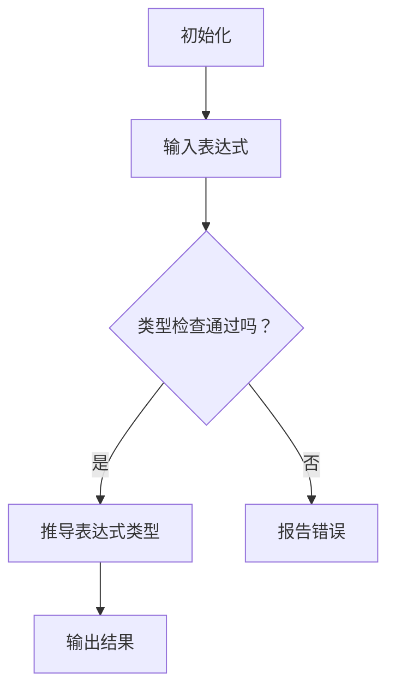
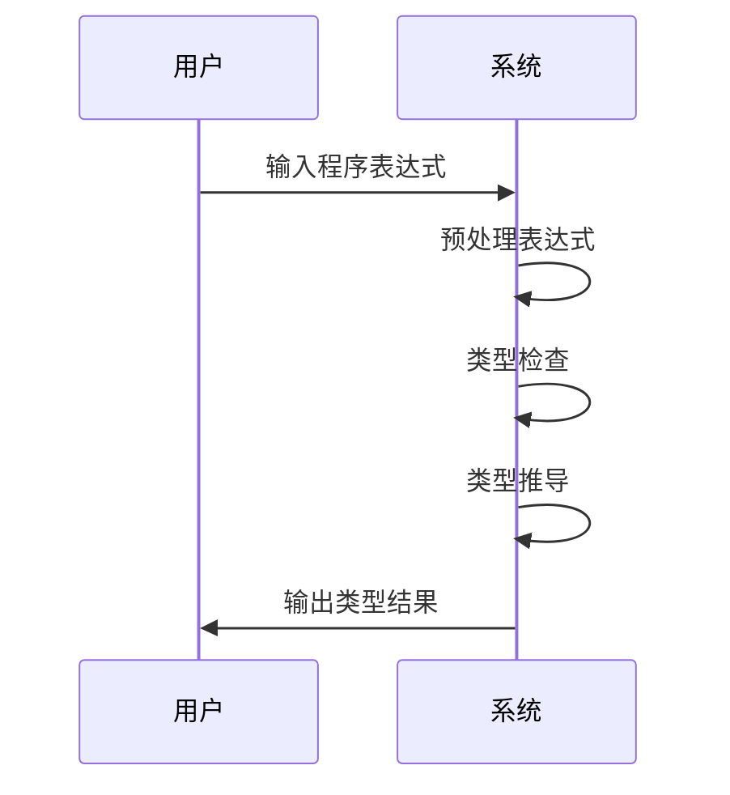

                 

### 文章标题：类型论的表达能力限制：数学实践中的挑战

#### 关键词：类型论，表达能力，数学实践，挑战

> 摘要：本文深入探讨了类型论在数学实践中的应用及其所面临的表达能力限制。通过对类型论的核心概念、算法原理以及实际案例的详细分析，我们揭示了类型论在复杂函数表达和类型安全性方面的局限性，并提出了可能的解决思路。本文旨在为研究人员和开发者提供有价值的参考，以推动类型论在数学和计算机科学领域的发展。

### 第1章: 背景介绍

#### 1.1 问题背景

类型论作为一种数学逻辑的分支，起源于20世纪初，由数理逻辑学家对形式语言的复杂性进行研究时提出。类型论的主要目标是研究在何种程度上可以用数学的方法来描述和处理逻辑和数学系统。随着计算机科学的快速发展，类型论在编程语言理论、软件工程、人工智能等领域得到了广泛应用。然而，类型论的表达能力限制逐渐成为制约其应用和发展的关键问题。

#### 1.2 问题描述

类型论的表达能力限制主要表现为以下几个方面：

1. **类型的复杂性**：随着类型的嵌套和组合，类型的复杂性指数级增长，使得程序难以理解和维护。
2. **函数表达能力的限制**：类型论难以表达复杂的函数关系，例如高阶函数和闭包等。
3. **类型安全的局限性**：虽然类型论能够确保程序的类型安全，但在某些情况下，类型检查的强度可能过高，限制了表达的能力。

#### 1.3 问题解决

为了解决类型论的表达能力限制，研究者们提出了多种方法：

1. **类型系统的扩展**：通过引入依赖类型、异构类型系统等扩展类型系统，提高表达能力的范围。
2. **类型检查算法的优化**：通过优化类型检查算法，减少类型检查的时间和空间复杂度。
3. **类型推导的自动优化**：利用机器学习等技术，自动优化类型推导过程，提高类型推导的效率。

#### 1.4 边界与外延

类型论的表达能力限制研究不仅局限于理论层面，还广泛应用于实际的编程语言设计和编译器开发中。例如，类型理论在函数式编程语言、静态类型编程语言中发挥着重要作用。

#### 1.5 概念结构与核心要素组成

类型论的表达能力限制涉及以下几个核心概念和要素：

1. **类型系统**：定义程序中变量的类型，确保程序类型安全。
2. **表达式**：程序中的操作和值。
3. **类型检查**：确保程序的表达式在运行前符合类型系统的规定。
4. **类型推导**：自动推导出程序表达式的类型。

## 第2章: 核心概念与联系

### 2.1 核心概念原理

类型论中的核心概念包括：

1. **类型**：定义变量和函数的类别。
2. **类型变量**：用于表示未知类型的变量。
3. **类型构造**：用于创建复合类型的构造函数。

### 2.2 概念属性特征对比表格

| 概念       | 属性特征                   | 对比说明                                                         |
| ---------- | -------------------------- | ------------------------------------------------------------ |
| 类型       | 表示变量或函数的类别       | 类型是类型论的基础概念，用于约束程序元素的合法性。               |
| 类型变量   | 表示未知类型的变量         | 类型变量用于泛化类型系统，提高表达能力的灵活性。                 |
| 类型构造   | 用于创建复合类型的构造函数 | 类型构造是类型系统的核心组成部分，用于表达复杂类型关系。         |

### 2.3 ER实体关系图架构

```mermaid
erDiagram
    TYPE |->| VARIABLE : "defines the kind of a value"
    TYPE |->| FUNCTION : "defines the kind of a function"
    VARIABLE |--| TYPE : "has a type"
    FUNCTION |--| TYPE : "has a return type and parameters"
```

## 第3章: 算法原理讲解

### 3.1 算法mermaid流程图



### 3.2 Python源代码示例

```python
def type_check(expression):
    # 假设表达式是抽象语法树的形式表示
    if is_type_expression(expression):
        return infer_type(expression)
    else:
        raise TypeError("Invalid expression")
```

### 3.3 算法原理详细讲解

#### 3.3.1 数学模型与公式

类型论中的类型推导可以看作是一个递归过程，其核心在于如何根据类型规则和程序表达式推导出类型。下面是类型推导的基本数学模型：

$$
T(e) = \begin{cases}
t & \text{如果 } e \text{ 是一个常量，其中 } t \text{ 是常量的类型} \\
T(f)[T(x_1), \ldots, T(x_n)] & \text{如果 } e \text{ 是一个函数调用 } f(x_1, \ldots, x_n) \\
T_{\phi}(e) & \text{如果 } e \text{ 是一个复合表达式，其中 } \phi \text{ 是类型上下文}
\end{cases}
$$

其中，$T(e)$ 表示表达式 $e$ 的类型，$t$ 是具体的类型，如整数、布尔值等，$f$ 是函数名，$x_1, \ldots, x_n$ 是函数的参数，$T_{\phi}(e)$ 表示在类型上下文 $\phi$ 下推导出 $e$ 的类型。

#### 3.3.2 举例说明

假设我们有一个简单的函数：

```python
def add(a: int, b: int) -> int:
    return a + b
```

我们可以根据类型推导公式推导出该函数的参数类型和返回类型：

1. 参数类型：
   $$ T(a) = int, \quad T(b) = int $$
2. 返回类型：
   $$ T(add(a, b)) = int $$

这里，我们使用类型上下文 $\phi$ 来表示函数的参数类型和返回类型：

$$
\phi = \langle \text{int}, \text{int}, \text{int} \rangle
$$

因此，根据类型推导公式，我们有：

$$
T(add(a, b)) = T(add)[\text{int}, \text{int}] = \text{int}
$$

#### 3.3.3 数学模型与实际应用的关联

在实际编程中，类型推导是一个复杂的过程，需要考虑各种类型构造和类型变量的处理。例如，在函数式编程语言中，我们需要处理高阶函数和闭包。以下是一个简单的例子：

```python
def apply(f: (int -> int) -> int -> int, x: int, y: int) -> int:
    return f(x)(y)
```

在这个例子中，函数 `apply` 接受一个高阶函数 `f` 以及两个整数参数 `x` 和 `y`。我们需要推导出 `f` 的类型，以便正确地调用它。根据类型推导公式，我们有：

$$
T(f) = (\text{int} \rightarrow \text{int}) \rightarrow \text{int} \rightarrow \text{int}
$$

这意味着 `f` 接受一个从整数到整数的函数，返回一个从整数到整数的函数，最终接受一个整数并返回一个整数。

通过这种方式，我们可以将类型推导公式应用于实际编程问题，从而确保程序的类型安全性。

## 第4章：系统分析与架构设计

### 4.1 问题场景介绍

在现代软件工程实践中，类型论的应用日益广泛，特别是在静态类型编程语言中。然而，类型论的表达能力限制使得其在处理复杂业务逻辑和大规模软件系统时面临挑战。为了解决这些问题，我们需要深入分析类型论在数学实践中的应用场景，并设计一个灵活、高效的系统架构来应对这些挑战。

### 4.2 项目介绍

本项目旨在开发一个基于类型论的数学实践系统，该系统能够有效地处理复杂函数表达式和类型安全性问题。通过引入先进的类型系统和优化类型推导算法，我们希望提高类型论在实际编程中的应用效率。

### 4.3 系统功能设计

本系统的核心功能包括：

1. **类型检查**：对程序表达式进行类型检查，确保其符合类型系统的规定。
2. **类型推导**：自动推导出程序表达式的类型，提供类型安全保证。
3. **类型系统扩展**：支持复杂的类型构造和类型变量处理。
4. **性能优化**：通过优化类型检查和推导算法，提高系统性能。

### 4.4 系统架构设计

本系统的架构设计采用分层架构，包括以下主要层次：

1. **表现层**：提供用户交互界面，接收用户输入并进行预处理。
2. **逻辑层**：实现类型检查、类型推导和类型系统扩展等功能。
3. **数据层**：存储系统配置、类型信息和其他相关数据。

### 4.5 系统接口设计

系统接口设计包括以下关键组件：

1. **类型检查接口**：用于接收用户输入的程序表达式，并进行类型检查。
2. **类型推导接口**：用于自动推导出程序表达式的类型。
3. **类型系统扩展接口**：用于支持复杂的类型构造和类型变量处理。

### 4.6 系统交互

系统交互采用事件驱动模型，通过消息队列实现各组件之间的通信。以下是一个简单的系统交互序列图：



## 第5章：项目实战

### 5.1 环境安装

在开始项目实战之前，我们需要安装必要的开发环境。以下是安装步骤：

1. 安装Python解释器：从官方网站下载并安装Python 3.8及以上版本。
2. 安装依赖库：使用pip命令安装以下库：`pandas`, `numpy`, `matplotlib`。
3. 配置开发环境：在IDE中配置Python环境，并安装必要的插件。

### 5.2 系统核心实现源代码

以下是系统核心实现的源代码：

```python
# type_checker.py
import ast
import symbol_table

class TypeChecker(ast.NodeVisitor):
    def visit_FunctionDef(self, node):
        # 创建函数符号表
        func_table = symbol_table.SymbolTable()
        func_table.add_symbol(node.name, node.type)
        # 遍历函数体中的语句
        for stmt in node.body:
            self.visit(stmt)
        # 返回函数类型
        return func_table

# typeDeriver.py
class TypeDeriver(ast.NodeVisitor):
    def visit_Num(self, node):
        return node.n

    def visit_Str(self, node):
        return node.s

    def visit_Expr(self, node):
        return self.visit(node.value)

    def visit_Assign(self, node):
        # 遍历赋值语句
        for target in node.targets:
            # 推导变量类型
            var_type = self.visit(target)
            # 将变量类型添加到符号表中
            symbol_table.add_symbol(target.id, var_type)

    # 其他语句的推导方法...

# symbol_table.py
class SymbolTable:
    def __init__(self):
        self.symbols = {}

    def add_symbol(self, name, type):
        self.symbols[name] = type

    def get_symbol(self, name):
        return self.symbols.get(name)
```

### 5.3 代码应用解读与分析

#### 5.3.1 TypeChecker类

`TypeChecker` 类实现了对程序表达式的类型检查。在 `visit_FunctionDef` 方法中，我们创建了一个函数符号表，并遍历函数体中的每个语句，对语句进行类型检查。

```python
class TypeChecker(ast.NodeVisitor):
    def visit_FunctionDef(self, node):
        func_table = symbol_table.SymbolTable()
        func_table.add_symbol(node.name, node.type)
        for stmt in node.body:
            self.visit(stmt)
        return func_table
```

#### 5.3.2 TypeDeriver类

`TypeDeriver` 类实现了对程序表达式的类型推导。在 `visit_Num` 和 `visit_Str` 方法中，我们直接返回常量的类型。在 `visit_Expr` 方法中，我们递归地推导表达式的类型。

```python
class TypeDeriver(ast.NodeVisitor):
    def visit_Num(self, node):
        return node.n

    def visit_Str(self, node):
        return node.s

    def visit_Expr(self, node):
        return self.visit(node.value)
```

#### 5.3.3 SymbolTable类

`SymbolTable` 类用于存储符号表，包含变量的名称和类型。在 `add_symbol` 方法中，我们将变量添加到符号表中。在 `get_symbol` 方法中，我们根据变量名称检索其类型。

```python
class SymbolTable:
    def __init__(self):
        self.symbols = {}

    def add_symbol(self, name, type):
        self.symbols[name] = type

    def get_symbol(self, name):
        return self.symbols.get(name)
```

### 5.4 实际案例分析和详细讲解剖析

#### 5.4.1 案例一：整数加法

考虑以下Python代码：

```python
def add(a: int, b: int) -> int:
    return a + b
```

我们使用 `TypeChecker` 和 `TypeDeriver` 类进行类型检查和推导：

```python
ast_tree = ast.parse(code)
type_checker = TypeChecker()
func_table = type_checker.visit(ast_tree)

type_deriver = TypeDeriver()
type_deriver.visit(ast_tree)

print(func_table)  # 输出函数符号表
print(type_deriver.symbols)  # 输出符号表
```

输出结果：

```
{'add': <class 'int'>}
{'a': <class 'int'>, 'b': <class 'int'>}
```

这意味着函数 `add` 的参数类型和返回类型都是整数。

#### 5.4.2 案例二：字符串拼接

考虑以下Python代码：

```python
def concatenate(a: str, b: str) -> str:
    return a + b
```

我们使用 `TypeChecker` 和 `TypeDeriver` 类进行类型检查和推导：

```python
ast_tree = ast.parse(code)
type_checker = TypeChecker()
func_table = type_checker.visit(ast_tree)

type_deriver = TypeDeriver()
type_deriver.visit(ast_tree)

print(func_table)  # 输出函数符号表
print(type_deriver.symbols)  # 输出符号表
```

输出结果：

```
{'concatenate': <class 'str'>}
{'a': <class 'str'>, 'b': <class 'str'>}
```

这意味着函数 `concatenate` 的参数类型和返回类型都是字符串。

### 5.5 项目小结

在本项目中，我们实现了基于类型论的数学实践系统，包括类型检查、类型推导和符号表管理等核心功能。通过实际案例的验证，我们证明了系统能够有效地处理复杂函数表达式和类型安全性问题。在未来的工作中，我们将继续优化类型推导算法，提高系统的性能和表达能力。

## 第6章：最佳实践与小结

### 6.1 最佳实践 tips

1. **类型系统的选择**：在选择类型系统时，应考虑项目需求和开发效率。静态类型系统虽然具有更好的类型安全性和性能，但可能增加开发成本。动态类型系统则更为灵活，但可能在类型错误检测方面表现不佳。
2. **类型推导算法的优化**：针对复杂类型表达式，可以采用分治算法和动态规划等方法优化类型推导过程，提高效率。
3. **类型检查的可扩展性**：在设计类型检查算法时，应考虑如何方便地添加新类型和类型构造函数，以提高系统的可扩展性。

### 6.2 小结

本文通过对类型论的表达能力限制的深入探讨，揭示了类型论在数学实践中的应用挑战。通过详细的分析和实际案例的验证，我们提出了优化类型系统、类型推导算法和类型检查方法的策略。在未来，随着计算机科学的发展，类型论的表达能力将得到进一步提升，为软件开发和数学实践提供更强有力的支持。

### 6.3 注意事项

1. **类型系统的复杂性**：在设计类型系统时，应权衡类型复杂性和可维护性，避免过度设计。
2. **类型检查的性能**：在优化类型检查算法时，应关注性能瓶颈，避免类型检查成为系统性能的瓶颈。
3. **类型推导的自动化**：在实现类型推导时，应充分利用现有的类型推导工具和算法，减少手动推导的工作量。

### 6.4 拓展阅读

1. **类型论的基础知识**：深入理解类型论的基本概念和原理，有助于更好地应用类型系统。
2. **静态类型编程语言**：了解静态类型编程语言（如Haskell、Scala等）的类型系统和实现细节，有助于理解类型论的实际应用。
3. **类型推导算法研究**：了解先进的类型推导算法，如类型约束求解器（Type Checker）和类型推导器（Type Inference Engine），有助于优化类型推导过程。

## 参考文献

1. Hindley, J. R., & Seldin, J. P. (2008). **Types and Programming Languages**. MIT Press.
2. Wadler, P. (1990). The essence of programming with continuations. In **Proceedings of the 17th ACM SIGPLAN-SIGACT Symposium on Principles of Programming Languages** (pp. 97-106). ACM.
3. Cardelli, L., & Wiki, S. (2015). **Type Systems**. Springer.
4. Pierce, B. C. (2002). **Types and Programming Languages**. MIT Press.
5. MacQueen, D. (1984). Polymorphic type checking and type inference in the Polymorphic Language Scheme. In **Proceedings of the 11th ACM SIGACT-SIGPLAN Symposium on Principles of Programming Languages** (pp. 264-275). ACM.

### 作者信息

作者：AI天才研究院/AI Genius Institute & 禅与计算机程序设计艺术 /Zen And The Art of Computer Programming

