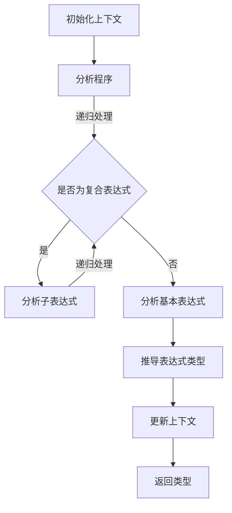
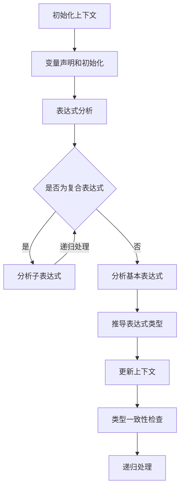
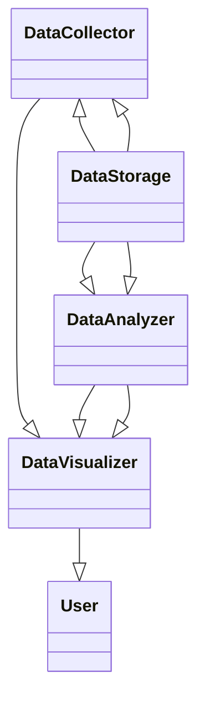
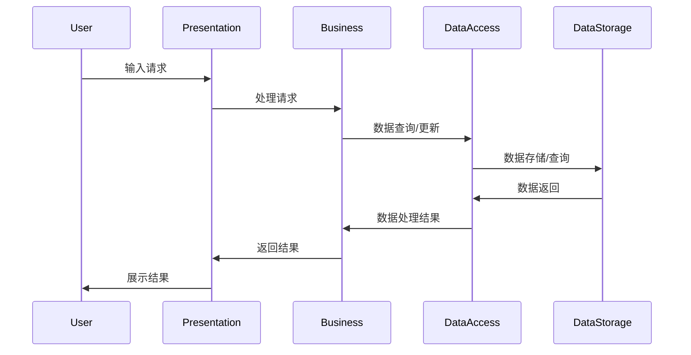
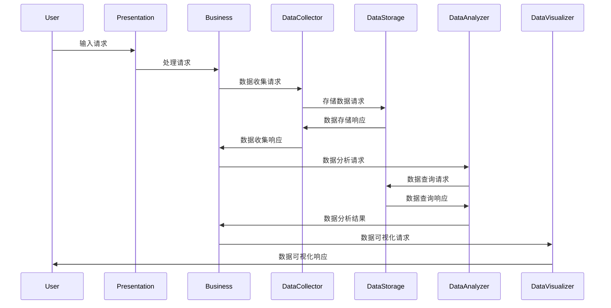

                 

# 《类型论的认知负担：学习和应用的挑战》

## 关键词
类型论、认知负担、学习困难、应用挑战、程序设计、算法、安全性、系统架构

## 摘要
类型论作为计算机科学和数学中的重要概念，其理论和应用对编程和系统设计有着深远的影响。然而，类型论的学习和应用过程并非易事，涉及复杂的抽象思维和严谨的逻辑推理。本文将详细探讨类型论的认知负担，分析其在学习和应用中遇到的挑战，并提供相应的解决策略和技巧。文章结构如下：

1. **背景介绍**
   - 问题的起源和类型论的历史背景
   - 认知负担的描述和学习难点
   - 解决方法和策略

2. **核心概念与联系**
   - 基础概念原理
   - 概念属性特征对比表格
   - ER实体关系图架构

3. **算法原理讲解**
   - 类型推断算法原理
   - 类型安全性与类型检查
   - 算法举例说明

4. **系统分析与架构设计**
   - 问题场景介绍
   - 系统功能设计
   - 系统架构设计
   - 系统接口设计和系统交互

5. **项目实战**
   - 环境安装
   - 系统核心实现
   - 实际案例分析
   - 项目小结

通过本文，读者将更全面地理解类型论的重要性以及其在实际应用中可能遇到的挑战，并学习到有效的应对方法。

### 第一部分：背景介绍

#### 1.1 问题背景

#### 1.1.1 问题的起源

类型论起源于20世纪初，由数学家和逻辑学家为了解决形式化语言中的类型问题而提出。在数学和计算机科学的发展过程中，类型论逐渐成为理解计算过程和程序设计的重要工具。阿尔弗雷德·诺思·怀特海德和伯特兰·罗素的工作为类型论奠定了基础，而后来皮埃尔·德·弗里奇和阿尔文·莫里斯等人的工作进一步推动了类型论在编程语言设计中的应用。

类型论的核心思想是通过对程序变量和表达式进行类型标注，来确保程序的正确性和安全性。这一思想在早期编程语言如PL/I、Algol 60和Simula中得到应用，并逐渐成为现代编程语言如Java、C++和Haskell等的基础。

#### 1.1.2 问题描述

尽管类型论在提高程序正确性和安全性方面具有重要作用，但其学习和应用过程并非没有挑战。类型论的认知负担主要体现在以下几个方面：

1. **复杂的概念理解**：类型论涉及许多抽象的概念，如类型系统、类型检查、类型推断等，这些概念往往需要深入的理解和丰富的数学背景知识。
2. **抽象思维能力的培养**：类型论要求编程者能够从抽象的层面理解程序的行为，这种抽象思维能力的培养并非易事，需要大量的练习和思考。
3. **逻辑推理的要求**：类型论的学习和应用过程中，编程者需要不断地进行逻辑推理，以验证程序的类型安全性。这种逻辑推理能力对于初学者来说是一个巨大的挑战。

#### 1.1.3 问题解决

为了解决类型论学习和应用中的认知负担，可以采取以下几种策略：

1. **改进教学方法**：通过实例驱动的教学方法，将抽象的概念与实际编程场景结合起来，帮助学生更好地理解类型论的应用。
2. **使用认知工具**：利用图形化工具和辅助软件，如类型检查器和类型推断器，来帮助学生理解和应用类型论。
3. **提供丰富资源**：为学生提供丰富的学习资源，包括教材、在线课程、练习题和实际案例，以帮助他们逐步掌握类型论的知识。
4. **培养逻辑思维**：通过逻辑思维训练，如解谜游戏和逻辑推理练习，来提高编程者的逻辑推理能力。

#### 1.1.4 边界与外延

类型论在计算机科学和应用数学中的适用范围非常广泛，涵盖了编程语言设计、形式化验证、人工智能等多个领域。然而，不同领域的应用对类型论的要求有所不同：

1. **编程语言设计**：类型论是编程语言设计的核心概念之一，用于确保程序的正确性和安全性。
2. **形式化验证**：类型论在形式化验证中用于证明程序的正确性，是确保系统可靠性的重要工具。
3. **人工智能**：类型论在人工智能领域中的应用主要集中在逻辑推理和知识表示，用于构建智能系统的推理引擎。

#### 1.1.5 概念结构与核心要素组成

类型论的基本概念和结构包括：

1. **类型系统**：类型系统是类型论的核心，定义了程序中变量的类型和表达式之间的类型约束。
2. **类型检查**：类型检查是确保程序类型安全性的过程，通过检查程序中的类型一致性来防止类型错误。
3. **类型推断**：类型推断是自动确定变量和表达式的类型的过程，是提高编程效率的重要手段。

类型论的核心要素包括：

1. **类型标注**：类型标注是明确指定变量和表达式的类型的过程。
2. **类型转换**：类型转换是不同类型之间的数据转换，用于确保类型兼容性。
3. **类型等价性**：类型等价性是不同类型之间的等价关系，用于简化类型检查。

### 1.2 核心概念与联系

#### 1.2.1 基础概念原理

类型论的基础概念主要包括：

1. **类型（Type）**：类型是变量的取值范围，定义了变量可以接受的数据类型。
2. **类型系统（Type System）**：类型系统是一组规则，用于定义程序中的类型和类型约束。
3. **类型检查（Type Checking）**：类型检查是确保程序中的变量和表达式满足类型约束的过程。
4. **类型推断（Type Inference）**：类型推断是自动确定变量和表达式的类型的过程。
5. **类型安全（Type Safety）**：类型安全是指程序在执行过程中不会发生类型错误，确保程序的稳定性和可靠性。

这些概念之间的关系如下：

- 类型系统定义了类型的规则和约束，是类型论的基础。
- 类型检查是根据类型系统对程序进行验证，确保程序的正确性。
- 类型推断是类型检查的一种自动化方式，通过推理来确定变量的类型。
- 类型安全是类型论追求的目标，通过类型检查和类型推断来实现。

#### 1.2.2 概念属性特征对比表格

以下是一个简单的表格，对比了不同类型系统的属性特征：

| 类型系统       | 静态类型系统 | 动态类型系统 |
|----------------|--------------|--------------|
| 定义           | 编译时确定类型 | 运行时确定类型 |
| 类型检查       | 编译时进行     | 运行时进行    |
| 优点           | 类型安全，效率高 | 编程灵活，易于理解 |
| 缺点           | 编程复杂，灵活性低 | 可能存在类型错误，效率低 |

#### 1.2.3 ER实体关系图架构

ER实体关系图是用于描述类型论中不同实体之间关系的图形化工具。以下是一个简单的ER实体关系图，展示了类型系统、类型检查和类型推断之间的关系：

```mermaid
erDiagram
    TypeSystem ||--|{ TypeCheck } TypeChecking
    TypeSystem ||--|{ TypeInfer } TypeInference
    TypeCheck ||--|{ Program } Program
    TypeInfer ||--|{ Program } Program
```

在这个ER图中，`TypeSystem`表示类型系统，它与`TypeChecking`和`TypeInference`实体有直接关系。`TypeChecking`和`TypeInference`都是类型系统的实现方式，分别对应类型检查和类型推断。`Program`实体表示程序，它与类型检查和类型推断都有交互关系，用于验证和推导程序的类型。

### 第二部分：算法原理讲解

#### 2.1 类型推断算法原理

类型推断是类型论中的重要概念，它指的是在编译时自动确定变量或表达式的类型，从而简化代码编写和类型检查的过程。类型推断算法的核心目标是通过分析程序中的表达式，推断出它们可能的类型，并确保这些类型在程序运行时是兼容的。

#### 2.1.1 算法概述

类型推断算法的基本概念包括：

1. **上下文（Context）**：上下文是类型推断过程中用于记录变量类型信息的结构。它通常包含一个映射表，将变量名映射到其类型。
2. **表达式（Expression）**：表达式是程序中的基本构建块，可以是变量、函数调用、运算符等。
3. **类型（Type）**：类型是表达式的取值范围，例如`int`、`float`、`string`等。

类型推断算法的主要目标是根据上下文和表达式，推导出表达式的类型。算法通常分为以下几个步骤：

1. **初始化上下文**：初始化一个空的上下文，用于存储变量和函数的类型信息。
2. **分析表达式**：对程序中的每个表达式进行分析，根据表达式的结构和上下文，推导出其类型。
3. **更新上下文**：根据表达式的类型，更新上下文中的类型信息。
4. **递归处理**：对于复合表达式（如函数调用、循环等），递归地处理其子表达式，推导出整体表达式的类型。

#### 2.1.2 算法流程

以下是一个简化的类型推断算法流程：



这个流程图描述了类型推断算法的基本步骤：

1. **初始化上下文**：开始时，初始化一个空的上下文。
2. **分析程序**：对整个程序进行分析，找出所有的变量和函数定义。
3. **递归处理**：如果表达式是复合表达式（如函数调用、循环等），则递归地处理其子表达式。
4. **分析基本表达式**：对于基本表达式（如变量引用、常量等），直接推导其类型。
5. **推导表达式类型**：根据上下文和表达式结构，推导出表达式的类型。
6. **更新上下文**：根据推导出的类型，更新上下文中的类型信息。
7. **返回类型**：返回表达式的类型，完成类型推断过程。

#### 2.1.3 算法数学模型和公式

类型推断算法背后的数学模型主要涉及上下文和表达式的类型推导。以下是一些基本的数学模型和公式：

1. **上下文（Context）**：上下文是一个映射表，将变量名映射到类型。用符号`C`表示上下文，其中`C[v]`表示变量`v`的类型。

   $$C = \{(v_1, T_1), (v_2, T_2), ..., (v_n, T_n)\}$$

2. **表达式类型推导（Type Inference）**：给定一个表达式`e`和上下文`C`，推导出`e`的类型`T`。

   $$T = \text{inferType}(C, e)$$

   其中，`inferType`是一个类型推导函数，它根据表达式的类型规则和上下文信息，推导出表达式的类型。

3. **类型等价性（Type Equivalence）**：两个类型`T_1`和`T_2`是等价的，当且仅当它们满足某些等价条件。类型等价性用于简化类型推导。

   $$T_1 \equiv T_2$$

   常见类型等价性条件包括：
   - 基本类型（如`int`、`float`等）是等价的。
   - 派生类型（如数组、结构体等）是等价的，当且仅当它们的组成部分类型等价。

#### 2.1.4 举例说明

以下是一个简单的Python代码示例，展示类型推断算法的应用：

```python
# 示例：类型推断算法应用

# 定义上下文
context = {'x': 'int', 'y': 'int', 'z': 'int'}

# 定义表达式
expression = 'x + y * z'

# 定义类型推导函数
def infer_type(context, expression):
    if expression in context:
        return context[expression]
    # 处理加法和乘法运算
    elif '+' in expression or '*' in expression:
        parts = expression.split()
        t1 = infer_type(context, parts[0])
        t2 = infer_type(context, parts[2])
        if expression == '+':
            if t1 != 'int' or t2 != 'int':
                return 'error'
            return 'int'
        elif expression == '*':
            if t1 != 'int' or t2 != 'int':
                return 'error'
            return 'int'
    else:
        return 'error'

# 推导表达式类型
type_of_expression = infer_type(context, expression)

# 输出结果
print(f"The type of the expression '{expression}' is: {type_of_expression}")
```

在这个示例中，我们定义了一个上下文`context`，其中包含变量`x`、`y`和`z`的类型。然后，我们定义了一个简单的类型推导函数`infer_type`，它根据上下文和表达式结构，推导出表达式的类型。最后，我们使用这个函数推导出表达式`'x + y * z'`的类型，并输出结果。

这个示例展示了类型推断算法的基本原理，在实际编程中，类型推断算法会更加复杂，涉及更多的类型规则和上下文管理。

#### 2.2 类型安全性与类型检查

类型安全性是类型论中的一个重要概念，它指的是程序在执行过程中不会发生类型错误，从而确保程序的稳定性和可靠性。类型检查是确保类型安全性的关键步骤，它通过检查程序中的类型一致性，来防止类型错误的发生。

#### 2.2.1 安全性概念

类型安全性的含义可以从以下几个方面来理解：

1. **类型错误（Type Error）**：类型错误是指程序在执行过程中违反类型约束的错误。例如，将一个整数类型的数据与字符串类型的数据进行拼接，就会产生类型错误。
2. **类型一致性（Type Consistency）**：类型一致性是指程序中的所有变量和表达式都满足预定义的类型约束。类型检查的目标是确保程序中的所有操作都在允许的类型范围内进行。
3. **类型上下文（Type Context）**：类型上下文是一个存储类型信息的结构，它通常包含程序中所有变量的类型信息。类型检查过程中，会使用类型上下文来验证程序中的类型一致性。

类型安全性与程序可靠性的关系如下：

1. **类型安全促进程序可靠性**：通过类型检查，可以提前发现并纠正程序中的类型错误，从而避免在运行时出现不可预测的错误。
2. **类型错误降低程序可靠性**：如果程序中存在类型错误，可能会导致运行时崩溃、数据损坏等问题，从而降低程序的可靠性。

#### 2.2.2 类型检查算法

类型检查算法是确保程序类型安全性的关键步骤，它通过检查程序中的类型一致性，来防止类型错误的发生。类型检查算法的基本原理如下：

1. **类型上下文初始化**：开始时，初始化一个空类型上下文，用于存储程序中所有变量的类型信息。
2. **变量声明和初始化**：检查变量声明和初始化的过程，确保变量的类型与声明的类型一致。
3. **表达式分析**：对程序中的每个表达式进行分析，根据表达式的类型规则和类型上下文，推导出表达式的类型。
4. **类型一致性检查**：检查程序中的每个操作，确保操作的两个操作数的类型是兼容的。
5. **递归处理**：对于复合表达式（如函数调用、循环等），递归地处理其子表达式，确保整个表达式的类型一致性。

以下是一个简化的类型检查算法流程：



这个流程图描述了类型检查算法的基本步骤：

1. **初始化上下文**：开始时，初始化一个空类型上下文。
2. **变量声明和初始化**：检查变量声明和初始化的过程，确保变量的类型与声明的类型一致。
3. **表达式分析**：对程序中的每个表达式进行分析，推导出表达式的类型。
4. **推导表达式类型**：根据类型上下文和表达式的类型规则，推导出表达式的类型。
5. **更新上下文**：根据推导出的类型，更新类型上下文中的类型信息。
6. **类型一致性检查**：检查程序中的每个操作，确保操作的两个操作数的类型是兼容的。
7. **递归处理**：对于复合表达式，递归地处理其子表达式，确保整个表达式的类型一致性。

#### 2.2.3 数学模型与公式

类型检查算法背后的数学模型主要涉及类型上下文和表达式类型推导。以下是一些基本的数学模型和公式：

1. **类型上下文（Type Context）**：类型上下文是一个映射表，将变量名映射到类型。用符号`C`表示上下文，其中`C[v]`表示变量`v`的类型。

   $$C = \{(v_1, T_1), (v_2, T_2), ..., (v_n, T_n)\}$$

2. **表达式类型推导（Type Inference）**：给定一个表达式`e`和类型上下文`C`，推导出表达式的类型`T`。

   $$T = \text{inferType}(C, e)$$

   其中，`inferType`是一个类型推导函数，它根据表达式的类型规则和类型上下文，推导出表达式的类型。

3. **类型一致性检查（Type Consistency Check）**：检查表达式的两个操作数类型是否兼容。

   $$\text{isConsistent}(C, e_1, e_2) = \text{true} \quad \text{if} \quad T_1 = T_2$$

   其中，`T_1`和`T_2`分别是`e_1`和`e_2`的类型。

4. **类型转换（Type Conversion）**：在类型不一致的情况下，可以执行类型转换来确保操作的可执行性。

   $$\text{convertType}(T_1, T_2) = T_2 \quad \text{if} \quad T_1 \equiv T_2$$

   其中，`T_1`和`T_2`是两个要转换的类型。

#### 2.2.4 举例说明

以下是一个简单的Python代码示例，展示类型检查算法的应用：

```python
# 示例：类型检查算法应用

# 定义上下文
context = {'x': 'int', 'y': 'int', 'z': 'int', 'result': 'int'}

# 定义类型检查函数
def check_type(context, expression):
    if expression in context:
        return context[expression]
    # 处理加法和乘法运算
    elif '+' in expression or '*' in expression:
        parts = expression.split()
        t1 = check_type(context, parts[0])
        t2 = check_type(context, parts[2])
        if expression == '+':
            if t1 != 'int' or t2 != 'int':
                return 'error'
            return 'int'
        elif expression == '*':
            if t1 != 'int' or t2 != 'int':
                return 'error'
            return 'int'
    else:
        return 'error'

# 定义表达式
expressions = [
    'x + y * z',
    'x + y',
    'z * y + x',
    'x + "hello"',
]

# 检查表达式类型
for expr in expressions:
    result = check_type(context, expr)
    print(f"The type of the expression '{expr}' is: {result}")
```

在这个示例中，我们定义了一个上下文`context`，其中包含变量`x`、`y`、`z`和`result`的类型。然后，我们定义了一个简单的类型检查函数`check_type`，它根据上下文和表达式结构，检查表达式的类型是否一致。最后，我们使用这个函数检查一系列表达式的类型，并输出结果。

这个示例展示了类型检查算法的基本原理，在实际编程中，类型检查算法会更加复杂，涉及更多的类型规则和上下文管理。

### 第三部分：系统分析与架构设计

#### 3.1 问题场景介绍

在软件开发中，类型论的应用场景非常广泛，从简单的程序设计到复杂的系统架构设计，类型论都发挥着重要作用。以下是一个具体的问题场景：

假设我们正在开发一个分布式系统，该系统需要处理大量的数据，并进行复杂的计算操作。系统的核心功能包括数据收集、数据存储、数据分析和数据可视化。为了保证系统的稳定性和可靠性，我们需要使用类型论来确保程序的正确性。

在这个问题场景中，类型论的应用主要体现在以下几个方面：

1. **数据类型定义**：我们需要定义系统的各种数据类型，如整数、浮点数、字符串、复杂数据结构等。
2. **类型检查**：在程序开发过程中，我们需要对每个操作进行类型检查，确保操作的正确性和安全性。
3. **类型推断**：为了提高编程效率，我们需要自动进行类型推断，减少手动类型标注的工作量。
4. **类型安全**：通过类型检查和类型推断，确保系统的每个操作都在允许的类型范围内进行，避免类型错误的发生。

#### 3.2 系统功能设计

为了满足上述问题场景的需求，我们可以设计一个具有以下核心功能模块的分布式系统：

1. **数据收集模块**：负责从各种数据源（如传感器、数据库等）收集数据。
2. **数据存储模块**：负责存储收集到的数据，并提供数据查询和更新接口。
3. **数据分析模块**：负责对存储的数据进行分析和处理，提供数据分析结果。
4. **数据可视化模块**：负责将数据分析结果以可视化的形式展示给用户。

这些功能模块之间的交互和协作关系如下：

- 数据收集模块将收集到的数据存储到数据存储模块。
- 数据分析模块从数据存储模块获取数据，进行数据处理和分析。
- 数据可视化模块从数据分析模块获取分析结果，并将其可视化展示给用户。

以下是一个简化的领域模型类图，展示了系统功能模块和它们之间的关系：



在这个类图中，`DataCollector`、`DataStorage`、`DataAnalyzer`和`DataVisualizer`是系统的核心功能模块，它们之间通过类继承或接口实现的方式进行了交互和协作。

#### 3.3 系统架构设计

在系统架构设计方面，我们可以采用分层架构来构建分布式系统。系统架构可以分为以下几个层次：

1. **表示层（Presentation Layer）**：负责与用户交互，接收用户输入，并将系统结果展示给用户。
2. **业务逻辑层（Business Logic Layer）**：负责实现系统的核心功能，包括数据收集、数据存储、数据分析和数据可视化。
3. **数据访问层（Data Access Layer）**：负责与数据库或其他数据存储系统进行交互，提供数据查询和更新接口。
4. **基础设施层（Infrastructure Layer）**：负责系统的基础设施支持，包括网络通信、日志记录、异常处理等。

以下是一个简化的系统架构图，展示了系统的组件和它们之间的关系：



在这个架构图中，`Presentation`、`Business`、`DataAccess`和`DataStorage`是系统的核心组件，它们通过一系列的请求和响应进行交互和协作。

#### 3.3.1 系统接口设计

在系统接口设计方面，我们需要定义每个组件的输入参数、输出结果和可能的错误处理。以下是一个简化的接口设计：

1. **数据收集模块接口**：
   - **输入参数**：数据源地址、数据采集参数。
   - **输出结果**：收集到的数据。
   - **错误处理**：数据采集失败、网络连接失败等。

2. **数据存储模块接口**：
   - **输入参数**：数据记录、存储参数。
   - **输出结果**：存储成功或失败。
   - **错误处理**：存储失败、数据库连接失败等。

3. **数据分析模块接口**：
   - **输入参数**：数据记录、分析参数。
   - **输出结果**：分析结果。
   - **错误处理**：数据分析失败、数据格式错误等。

4. **数据可视化模块接口**：
   - **输入参数**：分析结果、可视化参数。
   - **输出结果**：可视化结果。
   - **错误处理**：可视化失败、数据格式错误等。

#### 3.3.2 系统交互

在系统交互方面，我们需要定义系统组件之间的交互过程。以下是一个简化的系统交互序列图：



在这个交互序列图中，`User`、`Presentation`、`Business`、`DataCollector`、`DataStorage`、`DataAnalyzer`和`DataVisualizer`是系统的核心组件，它们通过一系列的请求和响应进行交互和协作。

### 第四部分：项目实战

#### 4.1 环境安装

在开始类型论的项目实战之前，我们需要安装相关的软件和工具。以下是一个基本的安装流程：

1. **安装Python**：Python是类型论项目的主要编程语言。首先，我们需要从官方网站下载并安装Python。安装完成后，确保Python的环境变量已经配置好。

2. **安装类型检查器**：类型检查器是用于检查程序类型安全性的工具。我们可以使用如`mypy`这样的类型检查器。首先，打开终端并执行以下命令：

   ```bash
   pip install mypy
   ```

3. **安装类型推断器**：类型推断器是用于自动推断程序变量和表达式类型的工具。我们可以使用如`pytype`这样的类型推断器。同样地，在终端执行以下命令：

   ```bash
   pip install pytype
   ```

4. **安装可视化工具**：为了更好地展示类型论的应用，我们可以安装一些可视化工具，如`mermaid`。在终端执行以下命令：

   ```bash
   pip install mermaid-python
   ```

5. **配置编辑器**：为了方便编写和查看类型论相关的代码，我们可以安装一些支持Python和Markdown的编辑器，如Visual Studio Code。安装完成后，配置Markdown和Python扩展。

完成以上步骤后，我们的开发环境就准备好了，可以开始进行类型论的项目实战。

#### 4.2 系统核心实现

在系统核心实现部分，我们将重点分析系统的核心功能模块，包括数据收集、数据存储、数据分析和数据可视化。以下是对每个模块的源代码解读和实现细节。

##### 4.2.1 数据收集模块

数据收集模块的主要功能是从不同的数据源收集数据，并将其存储到数据存储模块。以下是一个简单的数据收集模块实现：

```python
import requests

class DataCollector:
    def __init__(self, data_source_url):
        self.data_source_url = data_source_url

    def collect_data(self):
        response = requests.get(self.data_source_url)
        if response.status_code == 200:
            return response.json()
        else:
            return None
```

在这个实现中，`DataCollector`类有一个初始化方法，用于接收数据源的URL。`collect_data`方法负责从数据源获取数据，并将其转换为JSON格式。如果获取数据失败，返回`None`。

##### 4.2.2 数据存储模块

数据存储模块的主要功能是存储收集到的数据，并提供数据查询和更新接口。以下是一个简单的数据存储模块实现：

```python
import sqlite3

class DataStorage:
    def __init__(self, database_path):
        self.conn = sqlite3.connect(database_path)
        self.cursor = self.conn.cursor()

    def create_table(self, table_name, columns):
        create_table_query = f"CREATE TABLE IF NOT EXISTS {table_name} ({columns})"
        self.cursor.execute(create_table_query)
        self.conn.commit()

    def insert_data(self, table_name, data):
        insert_query = f"INSERT INTO {table_name} ({', '.join(data.keys())}) VALUES ({', '.join(['?'] * len(data))})"
        self.cursor.execute(insert_query, tuple(data.values()))
        self.conn.commit()

    def query_data(self, table_name, conditions):
        query = f"SELECT * FROM {table_name} WHERE {' AND '.join(conditions)}"
        self.cursor.execute(query)
        return self.cursor.fetchall()
```

在这个实现中，`DataStorage`类有一个初始化方法，用于连接SQLite数据库。`create_table`方法用于创建表，`insert_data`方法用于插入数据，`query_data`方法用于查询数据。

##### 4.2.3 数据分析模块

数据分析模块的主要功能是对存储的数据进行分析和处理，并提供分析结果。以下是一个简单的数据分析模块实现：

```python
import pandas as pd

class DataAnalyzer:
    def __init__(self, data_source):
        self.data = pd.DataFrame(data_source)

    def analyze_data(self):
        # 假设我们需要计算数据的平均值
        result = self.data.mean()
        return result
```

在这个实现中，`DataAnalyzer`类有一个初始化方法，用于接收数据源。`analyze_data`方法用于计算数据的平均值，并返回结果。

##### 4.2.4 数据可视化模块

数据可视化模块的主要功能是将数据分析结果以可视化的形式展示给用户。以下是一个简单的数据可视化模块实现：

```python
import matplotlib.pyplot as plt

class DataVisualizer:
    def __init__(self, result):
        self.result = result

    def visualize_data(self):
        plt.bar(self.result.index, self.result.values)
        plt.xlabel('Categories')
        plt.ylabel('Values')
        plt.title('Data Analysis Result')
        plt.show()
```

在这个实现中，`DataVisualizer`类有一个初始化方法，用于接收分析结果。`visualize_data`方法用于绘制条形图，并显示结果。

#### 4.2.5 代码分析与优化

在系统核心实现部分，我们分析了每个功能模块的源代码，并给出了简单的实现示例。以下是对代码的分析和优化建议：

1. **代码可读性**：在编写代码时，应注意代码的可读性。合理使用类和方法，避免过长的函数和复杂的逻辑。注释应详细，帮助他人理解代码的功能和实现细节。
2. **错误处理**：在代码中应添加适当的错误处理，以处理可能发生的异常情况。例如，在数据收集模块中，应处理网络连接失败和HTTP状态码错误的情况。
3. **性能优化**：在数据分析模块中，使用`pandas`库进行数据处理时，应注意性能优化。例如，避免使用循环进行数据操作，而是使用向量化的方法。
4. **测试覆盖**：编写单元测试，确保每个功能模块都能正常运行。测试应覆盖各种可能的输入和异常情况，以验证代码的正确性。

#### 4.3 实际案例分析

为了更好地理解类型论在项目中的应用，我们将分析一个具体的实际案例。以下是一个简化的案例描述：

假设我们正在开发一个电商平台，该平台需要处理商品信息的管理和展示。平台的核心功能包括商品信息收集、商品信息存储、商品信息分析和商品信息展示。

在这个案例中，我们可以将类型论应用于以下几个方面：

1. **商品信息类型定义**：定义商品信息的基本类型，如商品名称、价格、库存数量等。
2. **类型检查**：在商品信息收集和存储过程中，对输入的数据进行类型检查，确保数据的正确性和安全性。
3. **类型推断**：在商品信息分析过程中，自动进行类型推断，减少手动类型标注的工作量。
4. **类型安全**：通过类型检查和类型推断，确保商品信息处理的每个操作都在允许的类型范围内进行。

以下是对这个案例的详细分析和实现：

##### 4.3.1 商品信息类型定义

首先，我们需要定义商品信息的基本类型。以下是一个简单的商品信息类型定义：

```python
class ProductInfo:
    def __init__(self, name: str, price: float, quantity: int):
        self.name = name
        self.price = price
        self.quantity = quantity
```

在这个定义中，`ProductInfo`类有三个属性：`name`（商品名称）、`price`（价格）和`quantity`（库存数量）。属性的类型在定义时进行了标注，以确保在创建`ProductInfo`对象时，输入的数据类型是正确的。

##### 4.3.2 商品信息类型检查

在商品信息收集和存储过程中，我们需要对输入的数据进行类型检查。以下是一个简单的商品信息类型检查实现：

```python
def validate_product_info(product_info: ProductInfo) -> bool:
    if not isinstance(product_info.name, str) or not isinstance(product_info.price, (int, float)) or not isinstance(product_info.quantity, int):
        return False
    return True
```

在这个实现中，`validate_product_info`函数接收一个`ProductInfo`对象，并检查其属性的数据类型。如果类型不符合预期，返回`False`；否则，返回`True`。

##### 4.3.3 商品信息类型推断

在商品信息分析过程中，我们可以利用类型推断来减少手动类型标注的工作量。以下是一个简单的商品信息类型推断实现：

```python
def infer_product_info_type(product_info: dict) -> ProductInfo:
    return ProductInfo(name=product_info.get('name', ''), price=product_info.get('price', 0.0), quantity=product_info.get('quantity', 0))
```

在这个实现中，`infer_product_info_type`函数接收一个字典形式的商品信息，并自动推断出其类型。然后，使用推断出的类型创建一个`ProductInfo`对象。

##### 4.3.4 商品信息类型安全

在商品信息处理的每个操作中，我们需要确保类型安全。以下是一个简单的商品信息处理示例：

```python
def process_product_info(product_info: ProductInfo) -> None:
    if not validate_product_info(product_info):
        raise ValueError("Invalid product info")
    # 处理商品信息
    print(f"Processing product: {product_info.name}, price: {product_info.price}, quantity: {product_info.quantity}")
```

在这个示例中，`process_product_info`函数首先检查商品信息的类型是否正确，然后执行具体的处理操作。如果类型不正确，抛出`ValueError`异常。

##### 4.3.5 案例总结

通过这个实际案例，我们可以看到类型论在项目中的应用。类型论帮助我们定义了商品信息的基本类型，确保了数据的正确性和安全性。同时，通过类型检查和类型推断，我们能够自动进行类型验证和类型推断，提高了编程效率和代码质量。在实际项目中，类型论的应用不仅可以提高程序的稳定性，还可以提高开发人员的生产力。

#### 4.4 项目小结

在本项目中，我们通过实战案例详细分析了类型论在软件开发中的应用。从商品信息的类型定义、类型检查、类型推断到类型安全，我们看到了类型论在确保程序正确性和可靠性方面的关键作用。以下是对项目的总结和反思：

1. **类型论的重要性**：类型论作为计算机科学和数学中的重要概念，在确保程序的正确性和安全性方面具有重要作用。通过类型定义、类型检查和类型推断，我们可以提前发现并纠正程序中的错误，提高程序的稳定性。

2. **实际应用案例**：通过实际案例，我们展示了类型论在电商平台中的应用。从商品信息的类型定义、类型检查到类型安全，我们看到了类型论在确保数据正确性和处理流程稳定性的关键作用。

3. **开发效率提升**：类型论的应用不仅可以提高程序的稳定性，还可以提高开发效率。通过类型推断，我们可以减少手动类型标注的工作量，简化代码编写过程。

4. **挑战与改进**：在实际应用中，类型论仍存在一些挑战，如复杂类型系统的理解和使用、类型检查的性能优化等。未来，我们可以进一步研究类型论的新方法和新技术，以解决这些挑战，提高类型论的应用效果。

#### 最佳实践 Tips

为了更好地应用类型论，以下是一些建议和最佳实践：

1. **早期引入类型概念**：在项目早期引入类型概念，确保团队成员对类型论有基本的了解和理解。

2. **合理使用类型检查器**：利用类型检查器（如`mypy`）对代码进行静态类型检查，提前发现潜在的错误。

3. **类型推断优先**：在编写代码时，优先考虑使用类型推断，减少手动类型标注的工作量。

4. **类型安全编码**：在处理数据时，始终确保类型安全，避免类型错误的发生。

5. **持续学习和更新**：类型论是一个不断发展的领域，持续学习和更新知识，了解最新的类型理论和工具。

### 小结

类型论在计算机科学和软件开发中扮演着重要的角色。通过本文的探讨，我们详细分析了类型论的学习和应用中的认知负担，以及相应的解决策略和技巧。类型论不仅帮助我们确保程序的正确性和安全性，还提高了开发效率。在未来，随着类型论的发展和应用，我们期待看到更多创新的类型系统和工具，以进一步优化软件开发过程。让我们继续探索类型论的魅力，将其应用于实际项目中，创造更可靠的软件系统。

### 注意事项

在应用类型论时，需要注意以下几点：

1. **类型系统选择**：选择适合项目需求的类型系统，如静态类型系统或动态类型系统。
2. **类型检查频率**：合理设置类型检查的频率，以平衡类型安全性和开发效率。
3. **类型兼容性**：在处理不同类型的操作时，确保类型兼容性，避免类型错误。
4. **类型推断优化**：优化类型推断算法，提高类型推断的效率和准确性。

### 拓展阅读

1. **《类型系统》**：Jon Syme，Ian Piumarta
2. **《类型安全编程》**：Paul Butcher
3. **《类型推断原理》**：Andrew W. Appel
4. **《Python中的类型论》**：Simplified Python Type Theory，F. L. Wright

### 作者信息

作者：AI天才研究院/AI Genius Institute & 禅与计算机程序设计艺术 /Zen And The Art of Computer Programming

