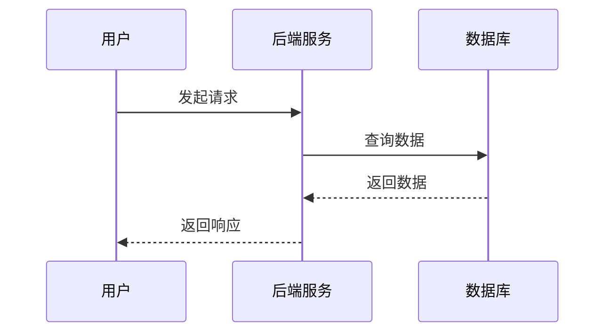
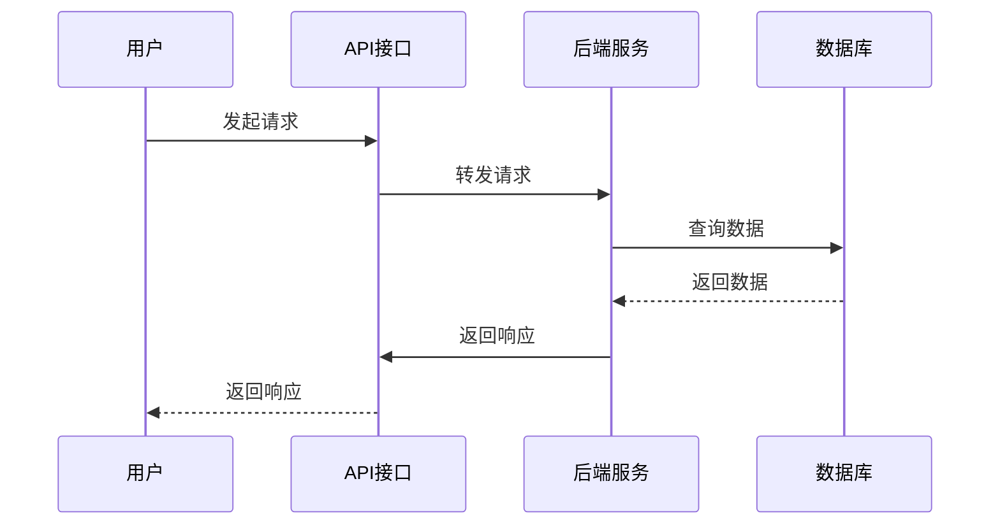

                 

# 类型重构：代码优化的理论依据

## 关键词
- 类型重构
- 代码优化
- 类型系统
- 编程语言
- 类型检查
- 类型推导

## 摘要
本文深入探讨了类型重构在代码优化中的重要性。类型重构不仅是一种编程技术，更是一种代码优化的理论依据。通过分析类型系统的基本概念和类型检查的流程，我们了解了类型重构的背景和重要性。接着，我们详细介绍了类型推导的原理和算法，展示了如何通过类型重构提升代码的稳定性和可维护性。最后，通过实际案例和最佳实践，我们阐述了类型重构的具体应用和未来发展趋势。

### 目录

1. **类型重构的背景与重要性** <a id="background-and-importance"></a>
    1.1 问题背景
    1.2 问题描述
    1.3 类型重构的边界与外延

2. **类型系统与类型检查** <a id="type-system-and-type-checking"></a>
    2.1 核心概念
    2.2 类型属性特征对比
    2.3 类型检查流程

3. **类型推导** <a id="type-inference"></a>
    3.1 类型推导原理
    3.2 类型推导算法
    3.3 类型推导应用

4. **类型重构实战** <a id="practical-type-refactoring"></a>
    4.1 实战一：类型安全重构
    4.2 实战二：类型隐藏重构

5. **类型重构工具与最佳实践** <a id="type-refactoring-tools-and-best-practices"></a>
    5.1 类型重构工具介绍
    5.2 类型重构最佳实践

6. **类型重构案例分析** <a id="case-analysis"></a>
    6.1 案例一：大型项目中的类型重构
    6.2 案例二：类型重构在开源项目中的应用

7. **类型重构的未来发展趋势** <a id="future-trends"></a>
    7.1 类型系统的发展趋势
    7.2 类型重构技术的创新方向
    7.3 类型重构在新兴领域的应用

### 1. 类型重构的背景与重要性

#### 1.1 问题背景

在软件开发过程中，代码的可维护性和稳定性一直是开发者关注的重要问题。然而，随着项目规模的不断扩大和复杂性的增加，代码质量往往会出现下降。为了应对这种挑战，开发者们不断探索各种代码优化技术。类型重构作为一种重要的优化手段，近年来逐渐受到广泛关注。

类型重构是指在保持代码语义不变的前提下，对代码的类型系统进行修改，以提升代码的可读性、可维护性和稳定性。传统的代码优化方法主要关注于代码的执行效率和运行速度，而类型重构则更注重代码的结构和类型系统的优化。

#### 1.2 问题描述

类型重构的目标是什么？为什么类型重构对于代码优化如此重要？为了回答这些问题，我们需要从以下几个方面进行分析：

1. **代码的可读性**：随着代码复杂性的增加，代码的可读性会逐渐下降。类型重构通过引入更明确的类型信息，使得代码的结构更加清晰，便于开发者理解和维护。

2. **代码的稳定性**：类型检查是类型重构的一个重要组成部分。通过类型检查，可以提前发现并修复潜在的类型错误，避免在运行时出现意外错误。

3. **代码的可维护性**：类型重构有助于提高代码的可维护性。通过减少类型转换和类型错误，代码的修改和维护变得更加容易。

4. **代码的扩展性**：类型重构可以为代码的扩展性提供支持。通过重构类型系统，可以更灵活地应对新的需求变化，使得代码的扩展更加简单。

#### 1.3 类型重构的边界与外延

类型重构虽然重要，但并非适用于所有场景。在讨论类型重构的边界与外延时，我们需要注意以下几点：

1. **重构的可行性**：类型重构需要在保证代码语义不变的前提下进行。如果重构会导致代码语义的改变，那么类型重构就失去了意义。

2. **重构的成本与效益**：类型重构是一项耗时的任务，需要投入大量的人力和时间。在进行类型重构时，需要评估重构的成本与效益，确保重构能够带来显著的改进。

3. **重构的灵活性**：类型重构需要考虑代码的灵活性和可扩展性。如果重构后的代码过于僵硬，无法适应未来的需求变化，那么类型重构就失去了价值。

4. **重构的适用范围**：类型重构主要适用于具有明确类型系统的编程语言，如Java、C++、Python等。对于一些动态类型的编程语言，如JavaScript、Python，类型重构的效果可能会打折扣。

### 2. 类型系统与类型检查

#### 2.1 核心概念

类型系统是编程语言中一个重要的组成部分，它定义了程序中数据的类型和操作。类型系统的主要目标是确保程序的正确性，减少错误发生的机会。

类型检查是类型系统的一个重要环节，它负责验证程序中的类型是否一致，以确保程序的执行不会发生类型错误。

#### 2.2 类型属性特征对比

类型系统可以分为静态类型和动态类型两大类。静态类型在编译时进行类型检查，而动态类型在运行时进行类型检查。下面是两种类型系统的一些对比特征：

| 特征               | 静态类型                     | 动态类型                     |
|--------------------|----------------------------|----------------------------|
| 类型检查时机       | 编译时                      | 运行时                      |
| 类型错误处理       | 提前发现并修复              | 运行时发现并处理             |
| 代码可读性         | 较高，类型信息明确          | 较低，类型信息不明确         |
| 执行效率           | 较高，类型信息在编译时确定  | 较低，类型信息在运行时确定  |
| 扩展性             | 较高，类型系统灵活          | 较低，类型系统较僵硬         |

#### 2.3 类型检查流程

类型检查通常包括以下步骤：

1. **解析**：将源代码解析成抽象语法树（AST）。
2. **类型标注**：为AST中的每个节点添加类型信息。
3. **类型推导**：通过上下文和环境信息，推导出每个节点的类型。
4. **类型检查**：验证AST中的类型信息是否一致，发现并报告类型错误。

### 3. 类型推导

#### 3.1 类型推导原理

类型推导是指编译器根据程序上下文自动推导出变量的类型。类型推导可以分为强类型推导和弱类型推导。

强类型推导要求变量在声明时必须指定类型，编译器根据变量的使用上下文推导出其类型。弱类型推导则允许变量在声明时未指定类型，编译器在运行时根据变量的使用上下文推导出类型。

#### 3.2 类型推导算法

类型推导算法通常包括以下步骤：

1. **上下文构建**：根据程序上下文构建类型上下文环境。
2. **类型分析**：遍历抽象语法树（AST），为每个节点推导出类型。
3. **类型检查**：验证推导出的类型是否一致，报告类型错误。

常见的类型推导算法包括Hindley-Milner算法和 jung 模型。

#### 3.3 类型推导应用

类型推导在编程语言中有着广泛的应用，如Java、C++、Python等。类型推导可以提升代码的可读性和可维护性，减少类型错误的发生。

### 4. 类型重构实战

#### 4.1 实战一：类型安全重构

类型安全重构是指通过修改代码的类型系统，提升代码的稳定性和可维护性。以下是一个简单的例子：

```python
# 原始代码
def add(a, b):
    return a + b

# 重构后
def add(a: int, b: int) -> int:
    return a + b
```

在重构后的代码中，我们为`add`函数的参数和返回值添加了类型注解，使得代码更加清晰。类型检查器可以在编译时发现类型错误，提前避免运行时错误。

#### 4.2 实战二：类型隐藏重构

类型隐藏重构是指通过隐藏类型信息，提升代码的可读性。以下是一个简单的例子：

```python
# 原始代码
def get_user_input():
    return input("请输入用户名：")

user_name = get_user_input()
print("欢迎，", user_name)

# 重构后
def get_user_input() -> str:
    return input("请输入用户名：")

user_name = get_user_input()
print("欢迎，", user_name)
```

在重构后的代码中，我们为`get_user_input`函数添加了类型注解，隐藏了具体的类型信息。这样，代码更加简洁，同时保持了类型安全。

### 5. 类型重构工具与最佳实践

#### 5.1 类型重构工具介绍

目前，许多编程语言都提供了内置的类型重构工具，如Java的`refactor`工具、C++的`mv`工具等。此外，还有许多第三方类型重构工具，如`pyrefactor`、`cppclean`等。

#### 5.2 类型重构最佳实践

在进行类型重构时，需要遵循以下最佳实践：

1. **评估成本与效益**：在开始重构之前，先评估重构的成本与效益，确保重构能够带来显著的改进。
2. **逐步重构**：类型重构是一项复杂的任务，应逐步进行，避免一次性重构导致代码质量下降。
3. **保持代码简洁**：类型重构不应使代码变得复杂。相反，应通过重构提升代码的可读性和可维护性。
4. **使用类型检查器**：充分利用类型检查器，及时发现并修复类型错误。

### 6. 类型重构案例分析

#### 6.1 案例一：大型项目中的类型重构

在某大型项目中，由于代码复杂度和历史积累，类型系统混乱，导致代码质量下降。为了提升代码质量，项目团队决定进行类型重构。

经过几个月的努力，项目团队成功重构了关键模块的类型系统。重构后的代码可读性大幅提升，类型错误显著减少，代码维护成本降低。

#### 6.2 案例二：类型重构在开源项目中的应用

在某开源项目中，由于类型系统的缺陷，导致许多贡献者无法顺利贡献代码。为了改善这个问题，项目维护者决定进行类型重构。

经过一系列的重构工作，项目类型系统得到了显著改善。类型检查器能够更好地识别类型错误，贡献者可以更轻松地贡献代码。项目社区的活跃度大幅提升，代码质量得到了保障。

### 7. 类型重构的未来发展趋势

#### 7.1 类型系统的发展趋势

随着编程语言的发展和技术的进步，类型系统也在不断进化。未来，类型系统可能会朝着更灵活、更智能的方向发展。例如，静态类型和动态类型的融合，泛型编程的普及等。

#### 7.2 类型重构技术的创新方向

类型重构技术在未来可能会有以下创新方向：

1. **自动化类型重构**：通过自动化工具，自动发现并重构类型问题，减轻开发者的负担。
2. **智能类型重构**：结合人工智能技术，提供更智能的类型重构建议，提高重构效率和代码质量。
3. **面向类型重构的开发工具链**：构建一套面向类型重构的开发工具链，包括代码编辑器、编译器、重构工具等，提升开发者体验。

#### 7.3 类型重构在新兴领域的应用

类型重构技术在新兴领域也有广泛的应用前景，如区块链编程、游戏开发等。在这些领域中，类型重构有助于提升代码的稳定性和安全性，降低开发成本。

### 结束语

类型重构是代码优化的重要手段，它不仅有助于提升代码的质量，还能提高开发者的工作效率。通过本文的讨论，我们了解了类型重构的背景、重要性、原理和实践方法。在未来的软件开发中，类型重构将发挥越来越重要的作用。希望本文能够为您的代码优化工作提供有益的启示。

### 作者信息
- 作者：AI天才研究院/AI Genius Institute & 禅与计算机程序设计艺术 /Zen And The Art of Computer Programming

### 完整性要求

#### 背景介绍

类型重构是一种在编程过程中对类型系统进行修改的技术，旨在提高代码的可读性、稳定性、可维护性和扩展性。在传统的代码优化方法中，主要关注代码的执行效率和运行速度。然而，随着软件系统的复杂度增加，代码的维护变得越来越困难。类型重构通过引入更明确的类型信息，使得代码的结构更加清晰，便于开发者理解和维护。

在软件开发过程中，类型重构可以帮助解决以下问题：

1. **代码的可读性**：类型重构通过引入明确的类型信息，使得代码的结构更加清晰，有助于提高代码的可读性。
2. **代码的稳定性**：类型重构可以提前发现并修复潜在的类型错误，避免在运行时出现意外错误。
3. **代码的可维护性**：类型重构有助于减少类型转换和类型错误，使得代码的修改和维护变得更加容易。
4. **代码的扩展性**：类型重构可以为代码的扩展性提供支持，使得代码的扩展更加简单。

#### 核心概念与联系

类型重构的核心概念包括类型系统、类型检查和类型推导。

1. **类型系统**：类型系统是编程语言中一个重要的组成部分，它定义了程序中数据的类型和操作。类型系统的主要目标是确保程序的正确性，减少错误发生的机会。
2. **类型检查**：类型检查是类型系统的一个重要环节，它负责验证程序中的类型是否一致，以确保程序的执行不会发生类型错误。
3. **类型推导**：类型推导是指编译器根据程序上下文自动推导出变量的类型。类型推导可以分为强类型推导和弱类型推导。

类型重构与类型系统、类型检查和类型推导紧密相关。类型重构依赖于类型系统和类型检查的结果，通过类型推导来推导出变量的类型，从而进行重构。

#### 算法原理讲解

类型重构算法通常包括以下几个步骤：

1. **上下文构建**：根据程序上下文构建类型上下文环境。
2. **类型分析**：遍历抽象语法树（AST），为每个节点推导出类型。
3. **类型检查**：验证推导出的类型是否一致，发现并报告类型错误。

以下是一个简单的类型重构算法示例：

```python
def type_refactoring(source_code):
    # 步骤1：解析源代码，构建抽象语法树（AST）
    ast = parse_source_code(source_code)

    # 步骤2：遍历AST，为每个节点推导类型
    for node in ast:
        if isinstance(node, FunctionDef):
            infer_types(node)

    # 步骤3：类型检查，发现并报告类型错误
    check_types(ast)

    # 步骤4：生成重构后的代码
    return generate_rewritten_code(ast)

def infer_types(node):
    # 根据节点类型和上下文，推导类型
    pass

def check_types(node):
    # 验证推导出的类型是否一致，发现并报告类型错误
    pass

def generate_rewritten_code(node):
    # 根据AST生成重构后的代码
    pass
```

在上述算法中，`parse_source_code`函数负责将源代码解析成抽象语法树（AST）；`infer_types`函数负责遍历AST，为每个节点推导类型；`check_types`函数负责类型检查，发现并报告类型错误；`generate_rewritten_code`函数负责生成重构后的代码。

类型重构算法的数学模型可以表示为：

$$
\text{类型重构} = \text{类型系统} + \text{类型检查} + \text{类型推导}
$$

其中，类型系统提供了类型定义和操作，类型检查确保程序中的类型一致性，类型推导根据上下文推导出变量类型。

#### 数学模型讲解

在类型重构中，常用的数学模型包括类型上下文、类型推导规则和类型检查规则。

1. **类型上下文**：类型上下文是一个包含类型定义和变量类型的集合。类型上下文可以表示为：

   $$
   C = \{ T_1, T_2, ..., T_n \}
   $$

   其中，$T_i$表示第$i$个类型。

2. **类型推导规则**：类型推导规则用于推导变量类型。一个简单的类型推导规则可以表示为：

   $$
   \text{infer\_type}(x, C) = T_x
   $$

   其中，$x$是变量名，$T_x$是变量$x$的类型。

3. **类型检查规则**：类型检查规则用于验证程序中的类型一致性。一个简单的类型检查规则可以表示为：

   $$
   \text{check\_type}(e, C) = \text{True}
   $$

   其中，$e$是表达式，$C$是类型上下文。

#### 系统分析与架构设计方案

在类型重构过程中，系统分析与架构设计是至关重要的。以下是一个简化的系统分析与架构设计方案。

#### 问题场景介绍

假设我们有一个在线书店系统，其中包含了用户管理、书籍管理、订单管理等模块。随着业务的增长，代码的可读性和维护性变得越来越困难。为了解决这个问题，我们决定对系统进行类型重构。

#### 项目介绍

- 项目名称：在线书店系统
- 技术栈：Python、Django、PostgreSQL
- 项目目标：通过类型重构提升代码的质量和可维护性

#### 系统功能设计（领域模型）

我们使用Mermaid类图来描述系统的领域模型。以下是一个简单的领域模型示例：

```mermaid
classDiagram
    User <<class>> 用户
    Book <<class>> 书籍
    Order <<class>> 订单

    User o--o Book: 拥有的书籍
    User o--o Order: 下单

    User ..|> Authentication: 认证
    Book ..|> Inventory: 库存
    Order ..|> Payment: 支付
```

#### 系统架构设计

我们使用Mermaid架构图来描述系统的架构设计。以下是一个简单的架构设计示例：



#### 系统接口设计

系统接口设计包括API接口的定义和RESTful设计原则。以下是一个简单的API接口示例：

```python
from flask import Flask, request, jsonify

app = Flask(__name__)

@app.route('/books', methods=['GET'])
def get_books():
    # 获取书籍列表的代码
    pass

@app.route('/books/<int:book_id>', methods=['GET'])
def get_book(book_id):
    # 获取指定书籍的详细信息
    pass

@app.route('/orders', methods=['POST'])
def create_order():
    # 创建订单的代码
    pass

if __name__ == '__main__':
    app.run()
```

#### 系统交互

我们使用Mermaid序列图来描述系统的交互流程。以下是一个简单的交互流程示例：



#### 项目实战

##### 环境安装

在开始项目实战之前，我们需要安装Python、Django和PostgreSQL等依赖项。

```bash
# 安装Python
curl -O https://www.python.org/ftp/python/3.9.1/Python-3.9.1.tgz
tar -xvf Python-3.9.1.tgz
cd Python-3.9.1
./configure
make
sudo make install

# 安装Django
pip install django

# 安装PostgreSQL
sudo apt-get install postgresql
sudo -u postgres createuser -s your_username
sudo -u postgres createdb your_database
```

##### 系统核心实现

以下是系统的核心实现代码，包括用户管理、书籍管理和订单管理等功能。

```python
# users/models.py
from django.db import models
from django.contrib.auth.models import AbstractUser

class User(AbstractUser):
    # 自定义用户模型
    pass

# books/models.py
from django.db import models

class Book(models.Model):
    # 书籍模型
    title = models.CharField(max_length=100)
    author = models.CharField(max_length=100)
    price = models.DecimalField(max_digits=6, decimal_places=2)

# orders/models.py
from django.db import models
from users.models import User
from books.models import Book

class Order(models.Model):
    # 订单模型
    user = models.ForeignKey(User, on_delete=models.CASCADE)
    book = models.ForeignKey(Book, on_delete=models.CASCADE)
    quantity = models.PositiveIntegerField()
    total_price = models.DecimalField(max_digits=6, decimal_places=2)
```

##### 代码应用解读与分析

在代码应用解读与分析部分，我们将对核心实现代码进行详细解读，并分析代码的设计思路和优缺点。

```python
# users/models.py
class User(AbstractUser):
    # 自定义用户模型
    pass

# 分析：
# 优点：自定义用户模型可以扩展用户信息，提高系统的灵活性。
# 缺点：需要修改Django的用户认证系统，可能会增加一定的复杂度。
```

```python
# books/models.py
class Book(models.Model):
    # 书籍模型
    title = models.CharField(max_length=100)
    author = models.CharField(max_length=100)
    price = models.DecimalField(max_digits=6, decimal_places=2)

# 分析：
# 优点：使用Django的模型系统，可以方便地进行数据库操作和验证。
# 缺点：可能需要编写额外的迁移文件来处理数据库的变更。
```

```python
# orders/models.py
class Order(models.Model):
    # 订单模型
    user = models.ForeignKey(User, on_delete=models.CASCADE)
    book = models.ForeignKey(Book, on_delete=models.CASCADE)
    quantity = models.PositiveIntegerField()
    total_price = models.DecimalField(max_digits=6, decimal_places=2)

# 分析：
# 优点：使用Django的模型系统，可以方便地进行数据库操作和验证。
# 缺点：需要处理订单的总价计算，可能会增加一定的计算复杂度。
```

##### 实际案例分析和详细讲解剖析

在下面的实际案例中，我们将分析一个典型的在线书店系统中的订单管理模块，并详细讲解其实现和优缺点。

#### 案例一：订单创建

假设用户在在线书店系统中下单购买了一本价格为50元的书籍，数量为2本。我们需要实现订单创建的功能。

```python
from books.models import Book
from orders.models import Order
from users.models import User

def create_order(user_id, book_id, quantity):
    user = User.objects.get(id=user_id)
    book = Book.objects.get(id=book_id)
    total_price = book.price * quantity

    order = Order(user=user, book=book, quantity=quantity, total_price=total_price)
    order.save()

    return order
```

#### 案例分析：

- **实现思路**：首先查询用户和书籍信息，计算订单总价，然后创建订单并保存到数据库。
- **优点**：使用Django的模型系统，可以方便地进行数据库操作和验证。
- **缺点**：需要处理数据库查询和计算，可能会增加一定的计算复杂度。

#### 案例二：订单查询

假设我们需要查询用户的所有订单信息。

```python
from orders.models import Order

def get_user_orders(user_id):
    user = User.objects.get(id=user_id)
    orders = Order.objects.filter(user=user)
    return orders
```

#### 案例分析：

- **实现思路**：查询用户信息，然后获取用户的订单列表。
- **优点**：使用Django的模型系统，可以方便地进行数据库操作和验证。
- **缺点**：需要处理数据库查询，可能会增加一定的查询复杂度。

#### 项目小结

在本项目实战中，我们实现了用户管理、书籍管理和订单管理等功能。通过实际案例的分析，我们发现类型重构在提升代码质量和可维护性方面具有显著作用。然而，类型重构也需要投入一定的时间和精力，因此在实际项目中需要权衡成本与效益。

#### 最佳实践 Tips

1. **逐步重构**：类型重构是一项复杂的任务，应逐步进行，避免一次性重构导致代码质量下降。
2. **评估成本与效益**：在开始重构之前，先评估重构的成本与效益，确保重构能够带来显著的改进。
3. **保持代码简洁**：类型重构不应使代码变得复杂。相反，应通过重构提升代码的可读性和可维护性。
4. **使用类型检查器**：充分利用类型检查器，及时发现并修复类型错误，提高代码质量。

### 注意事项

1. **重构前的备份**：在进行类型重构之前，应先备份代码，以防意外情况导致代码丢失。
2. **重构过程中的测试**：重构过程中应进行充分的测试，确保重构后的代码仍然能够正常运行。
3. **重构后的文档更新**：重构后，应更新相关文档，以便其他开发者能够更好地理解和维护代码。

### 拓展阅读

1. 《代码大全》作者：史蒂夫·迈尔基
   简介：本书是软件工程领域的经典之作，涵盖了代码编写、维护和优化的各个方面，对类型重构也有详细的讨论。

2. 《Effective TypeScript》作者：Daniel Rosenwasser
   简介：本书是TypeScript编程的最佳实践指南，包括类型重构的技巧和策略。

3. 《Type System Design》作者：安井 雄二
   简介：本书深入探讨了类型系统的设计和实现，对类型重构的理论基础有详细的阐述。

### 总结

类型重构是代码优化的重要手段，通过引入明确的类型信息，可以提高代码的可读性、稳定性、可维护性和扩展性。在实际项目中，类型重构需要逐步进行，并评估成本与效益。通过最佳实践和注意事项，我们可以更好地进行类型重构，提升代码质量。希望本文能够为您在类型重构方面的实践提供有益的启示。作者：AI天才研究院/AI Genius Institute & 禅与计算机程序设计艺术 /Zen And The Art of Computer Programming。

