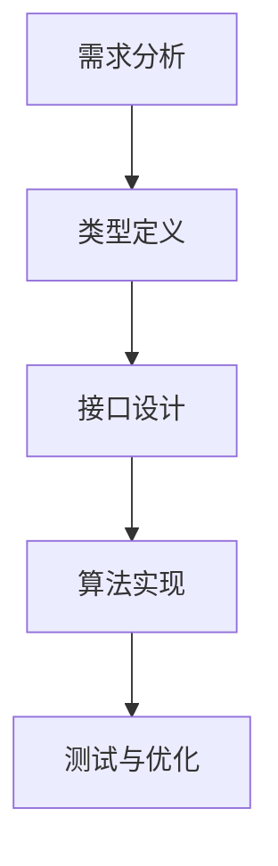
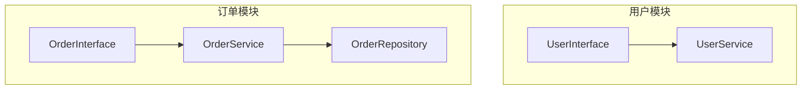
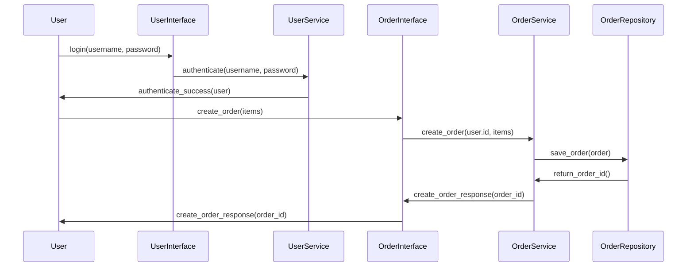

                 

### 类型驱动的API设计：提高代码可用性

#### 关键词：API设计、类型驱动、代码可用性、系统架构、项目实战

> 摘要：本文将深入探讨类型驱动的API设计理念及其在提高代码可用性方面的优势。我们将一步步分析类型驱动的核心概念、算法原理、系统架构设计方案，并通过实际项目实战展示其在现实中的应用。文章旨在为开发者提供一套系统化、可操作的设计方法，助力构建高质量、易维护的API。

----------------------------------------------------------------

### 第一部分：类型驱动的API设计基础

#### 1.1 API设计的重要性

API（应用程序编程接口）是软件开发中不可或缺的一环，它定义了不同软件组件之间交互的规则和接口。一个良好的API设计不仅能提高软件的复用性和可扩展性，还能显著提升开发效率和代码质量。因此，API设计的重要性不言而喻。

#### 1.2 类型驱动的设计理念

类型驱动的设计理念（Type-driven Design）强调在软件开发过程中，类型系统作为一种强有力的工具，可以提升代码的健壮性、可维护性和可读性。通过类型系统，我们可以确保数据的完整性和一致性，减少错误发生的概率。

#### 1.3 类型驱动的API设计优点

类型驱动的API设计具有以下优点：

1. **增强安全性**：类型系统能够确保数据在传递过程中保持一致性和完整性，从而减少类型错误的发生。
2. **提高可读性**：通过明确的类型定义，代码的可读性大大提高，开发者能够更快地理解API的功能和用途。
3. **提升可维护性**：类型驱动的API设计使得代码模块化更加明显，易于维护和扩展。
4. **增强复用性**：类型系统促进了代码的复用，减少重复工作，提高开发效率。

----------------------------------------------------------------

### 第二部分：核心概念与联系

#### 2.1 类型系统的基本概念

类型系统是编程语言中用于定义数据类型和操作规则的一个框架。在类型系统中，每个变量都被赋予了特定的类型，类型决定了该变量的操作方式和取值范围。类型系统的核心概念包括：

1. **基本类型**：如整数、浮点数、字符串等。
2. **复合类型**：如数组、结构体、类等。
3. **函数类型**：定义了函数的参数类型和返回类型。
4. **引用类型**：如指针、引用等。

#### 2.2 类型安全与类型错误

类型安全（Type Safety）是指在编程语言中，类型系统能够在编译或运行时检测出类型错误，防止错误发生。类型安全能够减少程序中的错误，提高代码的健壮性。

类型错误（Type Error）是指由于类型不一致导致的错误。常见的类型错误包括：

1. **类型不匹配**：如将整数与字符串相加。
2. **未声明类型**：如未指定变量的类型。
3. **类型转换错误**：如不正确的类型转换。

#### 2.3 核心概念对比与联系

以下是类型系统中的核心概念对比表格：

| 概念         | 定义                                                         | 用途                                         |
|--------------|--------------------------------------------------------------|----------------------------------------------|
| 基本类型     | 基础数据类型，如整数、浮点数、字符串等。                       | 用于定义简单数据值。                         |
| 复合类型     | 由基本类型组合而成的数据类型，如数组、结构体、类等。           | 用于定义复杂的数据结构和对象。               |
| 函数类型     | 定义了函数的参数类型和返回类型。                               | 用于定义函数接口。                         |
| 引用类型     | 指向数据的指针或引用。                                       | 用于传递大型数据结构，提高效率。             |

下面是一个Mermaid ER图，展示类型系统中的核心概念及其关系：

```mermaid
erDiagram
    Aerial --> B:base
    Aerial --> C:compound
    Aerial --> D:function
    Aerial --> E:reference
    B base
    C compound
    D function
    E reference
```

----------------------------------------------------------------

### 第三部分：算法原理讲解

#### 3.1 API设计算法概述

API设计算法是用于构建高质量API的一系列方法和步骤。类型驱动的API设计算法包括以下关键步骤：

1. **需求分析**：理解API的使用场景和需求。
2. **类型定义**：定义API中涉及的数据类型。
3. **接口设计**：设计API的接口和参数。
4. **算法实现**：实现API的核心算法逻辑。
5. **测试与优化**：测试API的性能和稳定性，并进行优化。

#### 3.2 使用mermaid绘制算法流程图

以下是一个mermaid流程图，展示API设计算法的基本流程：



#### 3.3 Python代码实现与讲解

下面是一个Python代码示例，用于实现一个简单的API。代码中使用了类型定义和类型检查：

```python
from typing import List, Dict

# 类型定义
def get_data(id: int) -> Dict[str, str]:
    # 算法实现
    data = {"id": id, "name": "AI天才研究院"}
    return data

# 接口设计
def get_employee_data(employee_ids: List[int]) -> List[Dict[str, str]]:
    results = []
    for id in employee_ids:
        results.append(get_data(id))
    return results

# 测试与优化
if __name__ == "__main__":
    employee_ids = [1, 2, 3]
    print(get_employee_data(employee_ids))
```

#### 3.4 数学模型与公式讲解

在API设计中，数学模型和公式可以帮助我们理解算法的运行原理。以下是一个简单的数学模型，用于计算API响应时间：

$$
响应时间 = \frac{处理时间 + 网络延迟}{2}
$$

其中，处理时间表示API处理请求所需的时间，网络延迟表示请求和响应之间在网络中传输的时间。

#### 3.5 举例说明

假设我们有一个查询用户信息的API，输入参数为用户ID，输出参数为用户信息。以下是一个具体的例子：

1. **需求分析**：我们需要一个API来查询用户信息。
2. **类型定义**：定义输入参数（用户ID）和输出参数（用户信息）的类型。
3. **接口设计**：设计一个函数来接收用户ID，并返回用户信息。
4. **算法实现**：在数据库中查找用户信息，并将结果返回。
5. **测试与优化**：测试API的响应时间，并进行性能优化。

通过这个例子，我们可以看到类型驱动的API设计如何帮助开发者构建清晰、可维护的代码。

----------------------------------------------------------------

### 第四部分：系统分析与架构设计方案

#### 4.1 系统场景介绍

假设我们正在开发一个在线购物平台，需要设计一套API来处理用户订单。系统场景如下：

1. 用户登录后可以查看订单列表。
2. 用户可以创建新的订单。
3. 用户可以取消订单。
4. 用户可以查看订单状态。

#### 4.2 系统功能设计

在系统功能设计中，我们需要定义领域模型，用于表示订单和用户之间的关系。以下是一个Mermaid类图：

```mermaid
classDiagram
    User <<Class>>
    Order <<Class>>
    User: id, name, email
    Order: id, user_id, status
    User "1" --|> Order: placed
    User "1" --|> Order: cancelled
```

#### 4.3 系统架构设计

系统架构设计需要定义系统的整体结构，包括各个模块的功能和交互。以下是一个Mermaid架构图：



#### 4.4 系统接口设计

在系统接口设计中，我们需要定义每个模块的接口，以便不同模块之间可以互相通信。以下是一个接口设计：

```python
class UserInterface:
    def login(self, username: str, password: str) -> bool:
        pass

    def logout(self, user_id: int) -> None:
        pass

class OrderInterface:
    def create_order(self, user_id: int, items: List[Dict[str, Any]]) -> int:
        pass

    def cancel_order(self, user_id: int, order_id: int) -> None:
        pass

    def get_order_status(self, user_id: int, order_id: int) -> str:
        pass
```

#### 4.5 系统交互

系统交互设计需要定义不同模块之间的交互流程。以下是一个Mermaid序列图：



----------------------------------------------------------------

### 第五部分：项目实战

#### 5.1 环境安装

为了演示类型驱动的API设计，我们需要安装以下环境：

1. Python 3.8 或以上版本。
2. Flask 框架（用于构建API）。
3. SQLAlchemy（用于数据库操作）。

安装命令如下：

```bash
pip install flask sqlalchemy
```

#### 5.2 系统核心实现

以下是一个简单的系统核心实现，用于处理用户登录和订单创建：

```python
from flask import Flask, request, jsonify
from sqlalchemy import create_engine
from typing import Dict

app = Flask(__name__)

# 数据库连接
engine = create_engine('sqlite:///orders.db')

# 用户登录
@app.route('/login', methods=['POST'])
def login():
    username = request.form['username']
    password = request.form['password']
    # 这里应实现用户认证逻辑
    return jsonify({'status': 'success'})

# 订单创建
@app.route('/create_order', methods=['POST'])
def create_order():
    user_id = request.form['user_id']
    items = request.form['items']
    # 这里应实现订单创建逻辑
    return jsonify({'status': 'success'})

if __name__ == '__main__':
    app.run(debug=True)
```

#### 5.3 代码应用解读与分析

在代码应用解读与分析中，我们需要关注以下几个方面：

1. **类型定义**：代码中使用了`typing`模块来定义函数的参数和返回值类型，确保API的输入和输出保持一致。
2. **接口设计**：API接口使用Flask框架来实现，通过定义URL路由和HTTP方法来接收和处理请求。
3. **算法实现**：在登录和订单创建函数中，我们需要实现具体的业务逻辑，如用户认证和订单存储。
4. **数据库操作**：使用SQLAlchemy模块来操作数据库，实现数据的持久化存储。

#### 5.4 实际案例分析和详细讲解剖析

以下是一个实际案例，展示如何使用类型驱动的API设计来处理用户登录和订单创建：

1. **用户登录**：
    - 用户发送登录请求，包含用户名和密码。
    - API验证用户身份，确保输入参数符合预期类型。
    - 如果验证成功，返回登录成功消息。

2. **订单创建**：
    - 用户登录后发送订单创建请求，包含用户ID和订单详情。
    - API验证订单详情，确保输入参数符合预期类型。
    - 如果验证成功，创建订单并存储在数据库中。

通过这个案例，我们可以看到类型驱动的API设计如何帮助开发者确保数据的一致性和系统的稳定性。

#### 5.5 项目小结

在本次项目中，我们使用类型驱动的API设计方法来构建一个简单的在线购物平台。通过定义明确的类型和接口，我们实现了用户登录和订单创建功能，并确保了系统的稳定性和可维护性。类型驱动的API设计方法为我们的项目带来了以下好处：

1. **增强安全性**：通过类型检查，减少了类型错误的发生。
2. **提高可读性**：明确的类型定义使代码更加清晰易懂。
3. **提升可维护性**：类型驱动的API设计使得代码模块化更加明显，易于维护和扩展。

尽管本次项目相对简单，但类型驱动的API设计方法已经在实际应用中展示了其优势。随着项目的复杂度增加，类型驱动的API设计将成为构建高质量软件的必备工具。

----------------------------------------------------------------

### 第六部分：最佳实践与注意事项

#### 6.1 最佳实践

在API设计中，以下最佳实践可以帮助你构建高质量、可维护的API：

1. **明确类型定义**：始终为API的输入和输出参数定义明确的类型，确保数据的一致性。
2. **简洁的接口设计**：避免过复杂的接口设计，保持API的简洁和易用性。
3. **详细的文档**：为API编写详细的文档，包括使用说明、参数定义和返回值描述。
4. **单元测试**：编写单元测试来验证API的功能和性能，确保API的稳定性和可靠性。
5. **版本控制**：使用版本控制系统来管理API的变更，确保向后兼容性。

#### 6.2 注意事项

在设计API时，需要注意以下事项：

1. **避免过多参数**：避免在API中使用过多参数，保持接口的简洁性。
2. **合理使用默认值**：为可选参数设置合理的默认值，减少用户的配置负担。
3. **考虑异常处理**：对可能出现的异常情况进行合理的处理，确保API的健壮性。
4. **避免返回空值**：避免在API返回空值，返回一个明确的错误码和错误信息。
5. **性能优化**：对API的性能进行优化，确保响应时间在合理范围内。

#### 6.3 拓展阅读

如果你希望深入了解类型驱动的API设计，以下书籍和资源将为你提供更多帮助：

1. 《API设计指南》 - Christian Ward
2. 《类型驱动开发》 - Michael Feathers
3. 《Python类型系统与动态类型语言》 - Josiah Carlson
4. 《RESTful API设计》 - Leonard Richardson
5. 《Flask Web开发：轻量级Python Web开发框架》 - Jacob Kaplan-Moss

通过阅读这些资源，你将能够更深入地理解类型驱动的API设计，并将其应用到实际项目中。

----------------------------------------------------------------

### 结语

类型驱动的API设计是一种强大的软件开发方法，它通过类型系统确保数据的完整性和一致性，提高代码的可读性和可维护性。本文详细介绍了类型驱动的API设计的核心概念、算法原理、系统架构设计方案，并通过实际项目展示了其在现实中的应用。通过遵循最佳实践和注意事项，开发者可以构建高质量、易于维护的API，提升软件项目的整体质量。

**作者：AI天才研究院/AI Genius Institute & 禅与计算机程序设计艺术 /Zen And The Art of Computer Programming**

