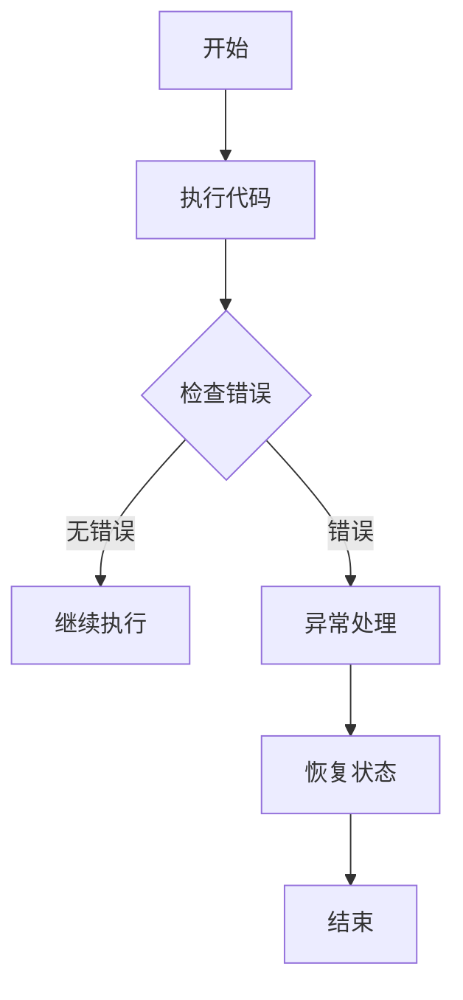

                 

### 深度剖析类型驱动的错误处理

## 类型驱动的错误处理：提高代码健壮性

### 关键词：类型驱动，错误处理，代码健壮性，异常处理，边界检查，状态管理

### 摘要：

本文将深入探讨类型驱动的错误处理方法，旨在提高代码的健壮性和可维护性。类型驱动错误处理利用类型系统的强大功能，通过类型检查、异常处理、边界检查和状态管理来减少错误发生，增强代码的可靠性。本文将分步骤详细分析类型驱动的错误处理机制，并给出实际案例和实践指南。

### 目录：

1. **背景介绍与核心概念** <sop>
2. **错误处理的核心概念** <sop>
3. **类型系统与错误处理** <sop>
4. **类型驱动的异常处理** <sop>
5. **类型驱动的边界检查** <sop>
6. **类型驱动的状态管理** <sop>
7. **代码健壮性实践** <sop>
8. **案例分析** <sop>
9. **总结与最佳实践** <sop>
10. **拓展阅读与深入研究** <sop>

### 1. 背景介绍与核心概念

在软件开发的漫长历史中，错误处理始终是开发者面临的一大挑战。随着软件系统的复杂性不断增加，传统的方法往往难以有效处理各种潜在的错误。类型驱动的错误处理方法应运而生，通过类型系统的强大功能来提高代码的健壮性。

#### 错误处理的背景

在软件开发中，错误是不可避免的。错误可能源自多种原因，包括逻辑错误、输入错误、资源不足、外部依赖等问题。有效的错误处理机制可以减少错误的产生，提高软件的稳定性和可靠性。

#### 错误处理的目的

错误处理的目的是确保软件在错误发生时能够做出正确的响应，避免系统崩溃或产生不可预期的行为。具体来说，错误处理的目标包括：

- **快速定位问题**：帮助开发者快速找到错误发生的位置。
- **恢复系统状态**：在错误发生后尝试恢复系统到稳定状态。
- **减少损失**：降低错误对用户和业务的影响。

#### 错误处理的传统方法

传统错误处理方法主要包括以下几种：

- **异常处理**：通过异常捕获和异常处理机制来处理程序运行中的错误。
- **边界检查**：对输入和变量进行检查，确保其符合预期的范围。
- **状态管理**：维护系统的状态，确保在错误发生时系统能够保持一致。

#### 类型驱动的错误处理的引入

类型驱动的错误处理利用类型系统的特性，通过静态类型检查和动态类型检查来预防错误。类型系统在编译或运行时检查代码中的类型一致性，从而减少错误发生的可能性。

#### 类型驱动的错误处理与传统方法的对比

- **性能对比**：类型驱动的方法可能在编译时增加一些性能开销，但在运行时可以减少错误检测和处理的成本。
- **安全性对比**：类型系统可以更有效地检测类型错误，提高代码的安全性。

#### 本书结构安排与学习目标

本书将按以下结构安排进行讲解：

- **第一部分：背景介绍与核心概念**：介绍错误处理的基本概念和类型驱动的错误处理方法。
- **第二部分：错误处理技术**：详细讲解异常处理、边界检查和状态管理。
- **第三部分：代码健壮性实践**：探讨如何在实际项目中应用类型驱动的错误处理。
- **第四部分：案例分析**：通过实际案例展示类型驱动的错误处理方法。
- **第五部分：总结与拓展**：总结全文内容，提供最佳实践和拓展阅读。

读者在学习过程中，可以通过以下步骤：

- **理解基本概念**：掌握错误处理和类型系统的基础知识。
- **学习技术方法**：了解如何使用类型系统进行错误处理。
- **实践应用**：通过实际案例和实践指南，学会如何在项目中应用类型驱动的错误处理。
- **拓展学习**：通过拓展阅读，深入了解相关领域的最新动态。

### 2. 错误处理的核心概念

#### 错误定义

在计算机科学中，错误是指程序在执行过程中未能按照预期执行的情况。错误可以分为以下几种类型：

- **逻辑错误**：程序在逻辑上出现了问题，导致程序行为与预期不符。
- **运行时错误**：程序在运行时遇到了无法处理的异常，例如除以零、空指针等。
- **输入错误**：用户输入的数据不符合程序的预期格式或范围。
- **外部依赖错误**：程序依赖于外部资源，如数据库、网络等，但这些资源未能正常工作。

#### 异常处理

异常处理是指程序在遇到错误时采取的响应措施。常见的异常处理机制包括：

- **捕获异常**：在程序中设置异常捕获块，当异常发生时，程序会跳转到相应的异常处理代码块。
- **抛出异常**：当程序遇到错误时，可以抛出一个异常对象，通知上层代码处理该错误。
- **异常传播**：异常在程序中逐层向上传递，直到被捕获并处理。

#### 边界检查

边界检查是指在程序中对输入和变量的边界进行检查，以确保其符合预期的范围。边界检查可以防止以下问题：

- **数组越界**：确保数组访问在数组边界内。
- **输入数据格式错误**：确保输入数据符合预期的格式。
- **资源限制**：确保程序在使用资源时不超过系统限制。

#### 状态管理

状态管理是指维护系统的状态，确保在错误发生时系统能够保持一致。状态管理策略包括：

- **单一状态**：系统在任一时刻只处于一个状态。
- **多状态**：系统可以在多个状态之间转换。
- **状态机**：使用状态机来描述系统的状态转换和行为。

#### Mermaid流程图展示

为了更好地理解错误处理的核心概念，我们可以使用Mermaid流程图来展示错误处理的流程。以下是一个简单的错误处理流程图：



在这个流程图中，程序从开始执行，并在执行过程中检查错误。如果没有错误，程序将继续执行；如果有错误，程序将进入异常处理流程，尝试恢复状态，并最终结束。

### 3. 类型系统与错误处理

类型系统是编程语言的核心特性之一，它定义了变量、函数和其他程序实体的类型，并提供了类型检查机制。类型系统可以分为静态类型和动态类型两种。

#### 静态类型

静态类型在编译时进行类型检查，确保代码在运行前满足类型约束。静态类型的主要优点包括：

- **早期错误检测**：类型错误在编译时被检测，可以避免在运行时发生错误。
- **性能优化**：编译器可以根据类型信息进行优化，提高代码性能。

常见的静态类型编程语言包括C、C++、Java和C#。

#### 动态类型

动态类型在运行时进行类型检查，允许变量在运行时改变类型。动态类型的主要优点包括：

- **灵活性**：程序可以根据运行时的情况动态调整类型。
- **代码简洁**：不需要显式声明变量类型，代码更简洁。

常见的动态类型编程语言包括Python、Ruby和JavaScript。

#### 类型检查

类型检查是类型系统的核心功能，它确保程序中的类型一致性。类型检查可以分为以下几种：

- **静态类型检查**：在编译时检查类型一致性。
- **动态类型检查**：在运行时检查类型一致性。

#### 类型推断

类型推断是编译器根据程序上下文自动推断变量类型的功能。类型推断可以分为以下几种：

- **显式类型推断**：编译器根据显式声明的类型进行推断。
- **隐式类型推断**：编译器根据程序上下文自动推断类型。

#### 类型安全

类型安全是指类型系统能够防止类型错误的特性。类型安全的主要优点包括：

- **减少错误**：类型系统能够在编译时检测类型错误，减少运行时错误。
- **提高可靠性**：类型安全可以提高程序的可靠性和稳定性。

#### 类型系统在错误处理中的作用

类型系统在错误处理中扮演了重要角色，它可以通过以下方式减少错误：

- **类型检查**：确保变量和函数参数的类型正确，防止类型错误。
- **异常处理**：通过类型检查和异常处理机制，快速定位和处理错误。
- **边界检查**：利用类型系统进行边界检查，防止数组越界和数据格式错误。

### 4. 类型驱动的异常处理

#### 异常类型

在类型驱动的错误处理中，异常是处理错误的重要机制。异常可以分为以下几种类型：

- **运行时异常**：在程序运行时发生的异常，如除以零、空指针等。
- **检查时异常**：在编译时发生的异常，如类型错误、语法错误等。
- **非检查时异常**：既不在编译时也不在运行时发生的异常，如资源耗尽等。

#### 异常处理机制

异常处理机制包括以下步骤：

1. **抛出异常**：当程序遇到错误时，抛出一个异常对象。
2. **捕获异常**：在程序中设置异常捕获块，当异常发生时，程序会跳转到相应的异常处理代码块。
3. **处理异常**：在异常处理代码块中，对异常进行分类和处理，例如打印错误信息、恢复系统状态等。

#### 类型驱动的异常处理

类型驱动的异常处理通过类型系统来提高异常处理的效率和安全性。具体来说，类型驱动的异常处理包括以下特点：

- **类型安全的异常**：异常类型与函数的返回类型一致，确保异常可以被正确处理。
- **异常分类**：根据异常类型进行分类处理，提高处理效率。
- **异常传播**：异常在程序中逐层向上传递，直到被捕获并处理。

#### 异常处理最佳实践

以下是一些异常处理的最佳实践：

- **尽早捕获异常**：在可能发生异常的代码块前设置异常捕获块。
- **明确异常处理策略**：根据异常的类型和影响，制定相应的异常处理策略。
- **避免异常处理链**：避免在异常处理中再次抛出异常，导致异常处理链过长。
- **记录异常信息**：记录异常的详细信息，便于调试和问题定位。

#### 实际案例

以下是一个简单的Python异常处理案例：

```python
try:
    result = 10 / 0
except ZeroDivisionError as e:
    print(f"错误信息：{e}")
    print("无法执行除法操作，请检查输入。")
finally:
    print("异常处理完成。")
```

在这个案例中，当程序尝试执行除以零的操作时，会抛出`ZeroDivisionError`异常。异常处理代码捕获该异常，并打印错误信息，最后完成异常处理。

### 5. 类型驱动的边界检查

#### 边界检查的重要性

边界检查是确保程序输入和变量符合预期范围的重要机制。边界检查可以防止以下问题：

- **数组越界**：确保数组访问在数组边界内。
- **输入数据格式错误**：确保输入数据符合预期的格式。
- **资源限制**：确保程序在使用资源时不超过系统限制。

类型驱动的边界检查通过类型系统来增强边界检查的效率和安全性。

#### 类型驱动的边界检查方法

类型驱动的边界检查方法包括以下几种：

- **静态边界检查**：在编译时检查变量的边界，确保变量在定义时符合预期范围。
- **动态边界检查**：在运行时检查变量的边界，确保变量在每次访问时都符合预期范围。

#### 实际案例

以下是一个简单的Python边界检查案例：

```python
array = [1, 2, 3, 4, 5]

# 静态边界检查
if 0 <= index < len(array):
    print(array[index])
else:
    print("数组索引越界。")

# 动态边界检查
try:
    print(array[index])
except IndexError as e:
    print(f"错误信息：{e}")
    print("数组索引越界。")
```

在这个案例中，我们使用静态边界检查和动态边界检查来确保数组访问在数组边界内。当索引超出数组边界时，程序会抛出`IndexError`异常，并打印错误信息。

### 6. 类型驱动的状态管理

#### 状态管理的重要性

状态管理是确保系统在错误发生时能够保持一致性和可靠性的关键。类型驱动的状态管理通过类型系统来维护状态的一致性。

#### 状态管理策略

类型驱动的状态管理策略包括以下几种：

- **单一状态**：系统在任一时刻只处于一个状态，状态转换简单。
- **多状态**：系统可以在多个状态之间转换，状态转换复杂。
- **状态机**：使用状态机来描述系统的状态转换和行为。

#### 状态管理最佳实践

以下是一些状态管理的最佳实践：

- **避免状态突变**：在状态转换时，确保状态的一致性和正确性。
- **使用枚举类型**：使用枚举类型来定义状态，确保状态转换的清晰和可维护性。
- **记录状态历史**：记录状态历史，便于调试和问题定位。

#### 实际案例

以下是一个简单的Java状态管理案例：

```java
public enum State {
    OPEN, CLOSED
}

public class Door {
    private State state;

    public Door() {
        this.state = State.OPEN;
    }

    public void close() {
        if (state == State.OPEN) {
            state = State.CLOSED;
            System.out.println("门已关闭。");
        } else {
            System.out.println("门已关闭。");
        }
    }

    public void open() {
        if (state == State.CLOSED) {
            state = State.OPEN;
            System.out.println("门已打开。");
        } else {
            System.out.println("门已打开。");
        }
    }
}
```

在这个案例中，我们使用枚举类型来定义门的状态，并实现状态转换的逻辑。当状态发生变化时，程序会打印相应的状态信息。

### 7. 代码健壮性实践

#### 单元测试与错误处理

单元测试是确保代码正确性的重要手段。类型驱动的错误处理可以通过以下方式提高单元测试的覆盖率：

- **类型安全的测试用例**：编写类型安全的测试用例，确保测试用例能够正确执行。
- **异常处理测试**：测试异常处理机制是否能够正确处理各种异常情况。
- **边界检查测试**：测试边界检查机制是否能够有效防止边界错误。

#### 集成测试与错误处理

集成测试是确保系统各个模块之间能够正确协作的重要手段。类型驱动的错误处理可以通过以下方式提高集成测试的效果：

- **类型检查**：在集成测试中，利用类型系统进行类型检查，确保模块之间的数据传输正确。
- **异常传播**：测试异常在模块之间的传播是否正常。
- **边界检查**：测试边界检查机制是否能够防止边界错误在模块之间的传播。

#### 性能测试与错误处理

性能测试是评估系统性能的重要手段。类型驱动的错误处理可以通过以下方式提高性能测试的准确性：

- **类型安全的性能测试**：编写类型安全的性能测试用例，确保性能测试能够准确反映系统的性能。
- **异常处理性能测试**：测试异常处理机制对性能的影响。
- **边界检查性能测试**：测试边界检查机制对性能的影响。

#### 实际案例

以下是一个简单的Python性能测试案例：

```python
import time

def divide(a, b):
    if b != 0:
        return a / b
    else:
        raise ValueError("除数不能为零。")

start_time = time.time()
try:
    result = divide(10, 2)
except ValueError as e:
    print(f"错误信息：{e}")
end_time = time.time()

print(f"结果：{result}")
print(f"耗时：{end_time - start_time}秒")
```

在这个案例中，我们使用性能测试来测量除法操作的时间。当除数为零时，程序会抛出`ValueError`异常，并记录错误信息。

### 8. 案例分析

#### 案例一：电商系统中的类型驱动错误处理

电商系统是一个复杂的系统，涉及用户、商品、订单等多个模块。类型驱动的错误处理可以帮助确保系统的高可靠性和稳定性。

- **用户模块**：使用类型系统确保用户数据的完整性，防止非法用户数据的输入。
- **商品模块**：使用类型系统进行商品库存和价格的校验，防止数据错误。
- **订单模块**：使用类型系统进行订单状态的校验，确保订单处理流程的准确性。

#### 案例二：金融系统中的类型驱动错误处理

金融系统对数据的准确性和安全性要求非常高。类型驱动的错误处理可以帮助确保金融系统的可靠性。

- **账户模块**：使用类型系统确保账户数据的完整性和一致性。
- **交易模块**：使用类型系统进行交易金额和货币类型的校验，防止交易错误。
- **报表模块**：使用类型系统确保报表数据的准确性和一致性。

#### 案例三：物联网系统中的类型驱动错误处理

物联网系统涉及大量的传感器和数据采集。类型驱动的错误处理可以帮助确保物联网系统的稳定性和可靠性。

- **传感器模块**：使用类型系统确保传感器数据的完整性和一致性。
- **数据处理模块**：使用类型系统进行数据过滤和校验，防止数据错误。
- **监控模块**：使用类型系统确保监控数据的准确性和及时性。

### 9. 总结与最佳实践

#### 总结

类型驱动的错误处理是一种提高代码健壮性的有效方法。通过利用类型系统的特性，我们可以减少错误发生的可能性，提高代码的可靠性和可维护性。

#### 最佳实践

以下是一些类型驱动错误处理的最佳实践：

- **尽早引入类型系统**：在项目初期引入类型系统，确保代码的一致性和可靠性。
- **全面覆盖边界检查**：对关键代码进行边界检查，防止边界错误。
- **类型安全的异常处理**：确保异常类型与函数的返回类型一致，提高异常处理的效率。
- **持续进行单元测试**：编写类型安全的测试用例，确保代码的正确性。

### 10. 拓展阅读与深入研究

类型驱动的错误处理是一个广泛的话题，涉及到多个领域。以下是一些建议的拓展阅读资源，供读者进一步学习：

- **《Effective Java》**：作者Joshua Bloch，介绍了Java中的类型系统最佳实践。
- **《C++ Error Handling with Exceptions》**：作者Herb Sutter，详细介绍了C++中的异常处理机制。
- **《Type Systems》**：作者Graham Hutton，介绍了类型系统的原理和应用。
- **《Static Typing for Dynamic Languages》**：作者Simon Peyton Jones，讨论了静态类型在动态语言中的应用。

通过阅读这些资源，读者可以更深入地了解类型驱动的错误处理技术，并将其应用到实际项目中。

### 结论

类型驱动的错误处理是一种强大的方法，可以提高代码的健壮性和可维护性。通过利用类型系统的特性，我们可以减少错误发生的可能性，提高代码的可靠性和性能。本文介绍了类型驱动的错误处理的核心概念、技术方法和实际案例，并给出了一些最佳实践。希望读者能够从中受益，并将其应用到实际项目中。

#### 作者信息

作者：AI天才研究院/AI Genius Institute & 禅与计算机程序设计艺术 /Zen And The Art of Computer Programming

