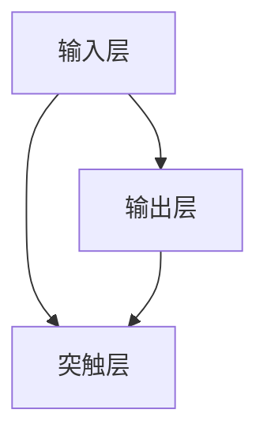
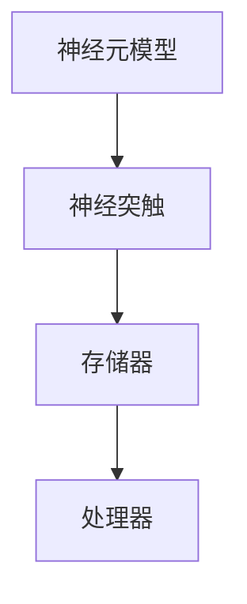
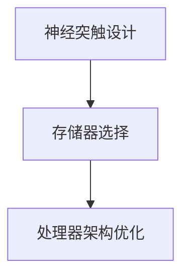
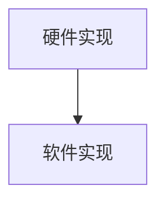
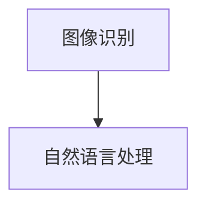
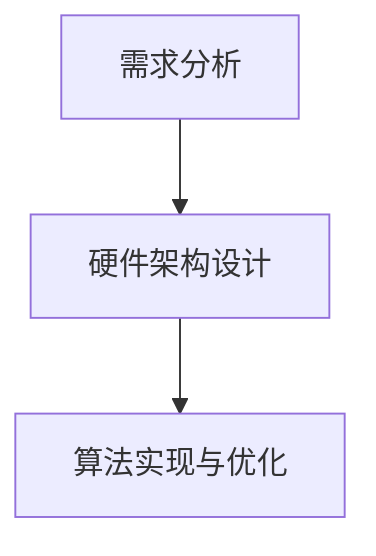

                 

# 类脑芯片：神经形态计算的硬件实现

关键词：神经形态计算、硬件实现、类脑芯片、神经网络、算法设计

摘要：本文旨在深入探讨类脑芯片的硬件实现，重点介绍神经形态计算的基本原理、硬件设计方法以及相关算法。通过分析神经形态硬件的构成、关键技术、算法原理和设计实践，本文为读者提供了一个系统而全面的视角，以理解类脑芯片的技术挑战和未来发展。

## 第一部分：引言

### 第1章：问题背景与核心概念

#### 1.1 类脑芯片的发展历程

类脑芯片是一种模仿人脑结构和功能的计算机芯片，旨在实现高效能的计算和智能处理。它的起源可以追溯到20世纪中叶，当时科学家开始探索如何利用电子技术来模拟人脑的神经网络。随着计算技术的进步，类脑芯片的研究逐渐成为人工智能领域的一个热点。

- **类脑芯片的定义**：类脑芯片是一种具有类脑功能的计算芯片，能够模拟人脑的神经元和神经网络，实现类似人脑的感知、学习、记忆和推理能力。

- **类脑芯片的研究现状**：目前，类脑芯片的研究主要集中在神经形态硬件的设计、神经网络算法的开发以及类脑芯片的应用探索。一些研究机构和企业已经成功实现了类脑芯片的原型，并在图像识别、自然语言处理等领域展示了其潜力。

#### 1.2 神经形态计算的基本概念

神经形态计算是一种模拟人脑神经网络的计算方法，其核心在于通过硬件实现神经元的互连和通信，实现高效的计算和智能处理。

- **神经形态计算的定义**：神经形态计算是一种通过硬件实现人脑神经元模型和神经网络结构的计算方法，它旨在通过模拟人脑的工作原理来实现高效的计算和智能处理。

- **神经形态计算与传统计算的对比**：传统计算依赖于冯诺伊曼架构，其数据处理依赖于存储器和处理器的分离。而神经形态计算则通过硬件实现神经元的互连和通信，使得数据处理可以在芯片上直接进行，从而大大提高了计算效率和能量效率。

#### 1.3 类脑芯片在硬件实现中的挑战

类脑芯片的硬件实现面临着诸多挑战，包括神经形态硬件的构成、性能优化、功耗控制等方面。

- **神经形态硬件的构成**：类脑芯片的硬件主要由神经元模型、神经突触、存储器和处理器等构成。这些组件需要精确模拟人脑的结构和功能，以实现高效的计算和智能处理。

- **神经形态硬件的局限性**：尽管神经形态硬件在模拟人脑神经网络方面具有一定的优势，但其在性能、功耗和可扩展性等方面仍存在一定的局限性。例如，现有的神经形态硬件在处理复杂任务时可能需要大量的芯片面积和功耗。

#### 1.4 本书结构安排

本书将分为三个部分，第一部分介绍类脑芯片的发展历程和核心概念，第二部分探讨神经形态硬件的原理和关键技术，第三部分通过设计实践和性能评估，展示类脑芯片的实际应用。

- **内容框架**：第一部分：引言；第二部分：神经形态硬件原理；第三部分：类脑芯片设计实践。

- **阅读建议**：本书适合对类脑芯片和神经形态计算感兴趣的读者，尤其是计算机科学和人工智能领域的研究者。建议读者按照章节顺序阅读，以便逐步深入理解类脑芯片的硬件实现。

## 第二部分：神经形态硬件原理

### 第2章：神经形态硬件基础

#### 2.1 神经元模型与神经网络

神经元模型是神经形态硬件的核心组件，它模拟了人脑神经元的结构和功能。神经网络则是由大量神经元相互连接而成的复杂网络，它能够实现高级的智能处理功能。

- **神经元模型**：神经元模型通常由输入层、输出层和突触层组成。输入层接收外部刺激，输出层产生响应，而突触层则负责连接输入和输出层，传递信号。

- **神经网络**：神经网络是由多个神经元组成的复杂网络，它们通过突触连接形成多个层次。每个层次都有不同的功能，从简单的感知到复杂的推理和决策。

- **Mermaid图示**：



#### 2.2 神经形态硬件的基本组件

神经形态硬件的基本组件包括神经元模型、神经突触、存储器和处理器。这些组件共同构成了类脑芯片的核心架构。

- **神经突触**：神经突触是神经元之间的连接部分，它负责传递信号。神经突触的硬件实现需要精确模拟人脑的突触结构和功能。

- **存储器**：存储器用于存储神经元的状态和参数，它通常采用非易失性存储技术，如内存电阻器（ReRAM）。

- **处理器**：处理器是类脑芯片的“大脑”，它负责执行神经网络算法和数据处理任务。

- **Mermaid图示**：



#### 2.3 神经形态硬件的关键技术

神经形态硬件的关键技术包括神经突触的设计、存储器的选择和处理器架构的优化。这些技术共同决定了类脑芯片的性能和效率。

- **神经突触的设计**：神经突触的设计需要考虑突触的强度、持久性和可塑性等特性。例如，采用内存电阻器（ReRAM）可以实现高度可编程的神经突触。

- **存储器的选择**：存储器的选择对于类脑芯片的性能至关重要。非易失性存储技术，如ReRAM，具有高速读写和低功耗的特点，非常适合用于类脑芯片。

- **处理器架构的优化**：处理器架构的优化目标是提高计算效率和降低功耗。采用流水线架构、多核处理器和优化算法可以实现高效的计算。

- **Mermaid图示**：



### 第3章：神经形态硬件的算法原理

#### 3.1 神经形态算法的概述

神经形态算法是类脑芯片的核心，它模拟人脑的神经网络，实现感知、学习、记忆和推理等功能。神经形态算法可以分为学习算法和优化算法两类。

- **学习算法**：学习算法用于训练神经网络，使其能够对输入数据进行分类、识别和预测。常见的神经形态学习算法包括Hebbian学习规则、感知器和反向传播算法等。

- **优化算法**：优化算法用于优化神经网络的性能，提高其效率和准确性。常见的优化算法包括遗传算法、粒子群优化和模拟退火算法等。

#### 3.2 神经形态算法的实现方法

神经形态算法的实现方法包括硬件实现和软件实现。硬件实现直接在类脑芯片上运行算法，而软件实现则通过通用处理器或GPU运行算法。

- **硬件实现**：硬件实现具有高效率和低功耗的优势，但算法的复杂度和可扩展性可能受到限制。硬件实现通常采用FPGA或ASIC芯片。

- **软件实现**：软件实现具有高灵活性和可扩展性，但计算效率和功耗相对较低。软件实现通常采用通用处理器或GPU。

- **Mermaid图示**：



#### 3.3 神经形态算法的应用实例

神经形态算法广泛应用于图像识别、自然语言处理、自动驾驶等领域。通过实际应用，神经形态算法展示了其强大的计算能力和智能处理能力。

- **图像识别**：神经形态算法可以用于实时图像识别，如人脸识别、物体检测等。通过硬件实现，图像识别系统可以实现高速度和高准确性。

- **自然语言处理**：神经形态算法可以用于自然语言处理任务，如语音识别、机器翻译等。通过硬件实现，自然语言处理系统可以实现低延迟和高效率。

- **Mermaid图示**：



## 第三部分：类脑芯片设计实践

### 第4章：类脑芯片设计工具与平台

#### 4.1 类脑芯片设计工具介绍

类脑芯片设计工具是设计类脑芯片的重要组成部分，它们提供了从硬件设计到算法优化的全方位支持。

- **硬件设计工具**：硬件设计工具用于设计类脑芯片的硬件架构，包括神经元模型、神经突触、存储器和处理器等。常见的硬件设计工具包括Cadence、Synopsys等。

- **算法设计工具**：算法设计工具用于开发类脑芯片的神经网络算法，包括学习算法和优化算法。常见的算法设计工具包括MATLAB、Python等。

#### 4.2 类脑芯片设计流程

类脑芯片的设计流程包括需求分析、硬件架构设计、算法实现与优化等阶段。

- **需求分析**：需求分析是设计流程的第一步，它确定了类脑芯片的功能需求和性能指标。

- **硬件架构设计**：硬件架构设计是根据需求分析结果，设计类脑芯片的硬件架构，包括神经元模型、神经突触、存储器和处理器等。

- **算法实现与优化**：算法实现与优化是根据硬件架构设计，开发神经网络算法，并进行优化，以提高类脑芯片的性能和效率。

- **Mermaid图示**：



### 第5章：类脑芯片实现案例

#### 5.1 案例一：基于神经形态硬件的图像识别系统

本案例介绍了一个基于神经形态硬件的图像识别系统，该系统采用神经网络算法进行图像分类和识别。

- **项目背景**：随着智能手机和物联网的普及，图像识别技术需求日益增长。传统的图像识别系统在处理速度和功耗方面存在瓶颈，而神经形态硬件提供了高效能的解决方案。

- **系统设计**：系统设计包括硬件架构设计和神经网络算法设计。硬件架构设计基于神经形态硬件，包括神经元模型、神经突触、存储器和处理器等。神经网络算法设计采用卷积神经网络（CNN），以实现高效的图像识别。

- **实现与优化**：实现与优化阶段包括硬件实现和算法优化。硬件实现采用FPGA芯片，以实现高效的计算和低功耗。算法优化通过调整神经网络参数，提高图像识别的准确率和速度。

- **结果分析**：结果分析包括性能评估和能耗评估。性能评估结果显示，基于神经形态硬件的图像识别系统在处理速度和功耗方面显著优于传统图像识别系统。

#### 5.2 案例二：基于神经形态硬件的自然语言处理系统

本案例介绍了一个基于神经形态硬件的自然语言处理系统，该系统用于语音识别和机器翻译。

- **项目背景**：自然语言处理技术在语音识别和机器翻译等领域具有广泛应用。传统的自然语言处理系统在处理速度和功耗方面存在瓶颈，而神经形态硬件提供了高效能的解决方案。

- **系统设计**：系统设计包括硬件架构设计和神经网络算法设计。硬件架构设计基于神经形态硬件，包括神经元模型、神经突触、存储器和处理器等。神经网络算法设计采用递归神经网络（RNN）和长短期记忆网络（LSTM），以实现高效的语音识别和机器翻译。

- **实现与优化**：实现与优化阶段包括硬件实现和算法优化。硬件实现采用ASIC芯片，以实现高效的计算和低功耗。算法优化通过调整神经网络参数，提高语音识别和机器翻译的准确率和速度。

- **结果分析**：结果分析包括性能评估和能耗评估。性能评估结果显示，基于神经形态硬件的自然语言处理系统在处理速度和功耗方面显著优于传统自然语言处理系统。

### 第6章：类脑芯片的性能评估

#### 6.1 性能评估指标

类脑芯片的性能评估包括能耗评估、速度评估和准确率评估等指标。

- **能耗评估**：能耗评估用于衡量类脑芯片在执行任务时的能耗消耗。低能耗是类脑芯片设计的重要目标。

- **速度评估**：速度评估用于衡量类脑芯片执行任务的速度。高速度是实现实时计算和智能处理的关键。

- **准确率评估**：准确率评估用于衡量类脑芯片在执行任务时的准确率。高准确率是类脑芯片在实际应用中的关键指标。

#### 6.2 类脑芯片性能评估方法

类脑芯片性能评估方法包括实验方法、数据采集与处理等步骤。

- **实验方法**：实验方法包括设计实验场景，收集实验数据，进行数据分析等步骤。实验场景包括图像识别、自然语言处理等实际应用场景。

- **数据采集与处理**：数据采集与处理包括数据收集、预处理和分析等步骤。数据收集采用传感器和实验设备，数据预处理包括数据清洗、归一化和特征提取等步骤，数据分析采用统计方法和机器学习算法。

- **结果分析与讨论**：结果分析包括性能评估指标的统计分析和比较。讨论部分讨论了类脑芯片的性能特点、优势和挑战。

### 第7章：未来展望与挑战

#### 7.1 类脑芯片的发展趋势

类脑芯片的发展趋势包括技术进步和应用拓展。

- **技术进步**：随着计算技术和材料科学的发展，类脑芯片的性能和效率将不断提高。例如，新型存储器和处理器架构、神经网络算法的创新等。

- **应用拓展**：类脑芯片将在智能硬件、自动驾驶、医疗诊断等更多领域得到应用。随着技术的进步，类脑芯片的应用范围将不断拓展。

#### 7.2 类脑芯片面临的挑战

类脑芯片面临的挑战包括技术瓶颈、安全与伦理问题等。

- **技术瓶颈**：类脑芯片在性能、功耗和可扩展性等方面仍存在技术瓶颈。需要进一步研究和创新，以克服这些瓶颈。

- **安全与伦理问题**：类脑芯片在隐私保护、安全性和伦理问题方面面临挑战。需要制定相应的法律法规和伦理准则，确保类脑芯片的安全和合理使用。

#### 7.3 发展方向与策略

类脑芯片的发展方向包括硬件创新、算法优化和应用拓展。

- **硬件创新**：通过研发新型存储器和处理器架构，提高类脑芯片的性能和效率。

- **算法优化**：通过优化神经网络算法，提高类脑芯片的计算效率和准确性。

- **应用拓展**：通过探索新的应用场景，拓展类脑芯片的应用范围。

- **策略**：制定合理的发展规划和政策，促进类脑芯片的研究和应用。

## 结语

类脑芯片：神经形态计算的硬件实现》通过详细介绍了类脑芯片的发展历程、核心概念、硬件设计方法、算法原理和设计实践，为读者提供了一个全面的视角，以理解类脑芯片的技术挑战和未来发展。类脑芯片作为一种新兴的计算技术，具有巨大的潜力和应用前景。未来，随着技术的不断进步和应用拓展，类脑芯片将在更多领域发挥重要作用。

## 作者信息

作者：AI天才研究院/AI Genius Institute & 禅与计算机程序设计艺术 /Zen And The Art of Computer Programming

## 附录

### 附录A：核心概念与联系

#### 神经元模型

神经元模型是人脑神经元的数学表示，用于模拟神经元的行为。它通常包括输入层、输出层和突触层。

| 概念属性       | 说明                                                         |
| -------------- | ------------------------------------------------------------ |
| 输入层         | 接收外部刺激的信息。                                       |
| 输出层         | 产生神经元的响应输出。                                     |
| 突触层         | 负责连接输入和输出层，传递信号。                           |

#### 神经网络

神经网络是由多个神经元组成的复杂网络，用于执行复杂的计算任务。它通常包括输入层、隐藏层和输出层。

| 概念属性       | 说明                                                         |
| -------------- | ------------------------------------------------------------ |
| 输入层         | 接收输入数据的神经元。                                       |
| 隐藏层         | 对输入数据进行处理和变换的神经元。                           |
| 输出层         | 产生最终输出的神经元。                                       |

#### 神经突触

神经突触是神经元之间的连接部分，负责传递信号。它通常由突触前神经元、突触后神经元和突触间隙组成。

| 概念属性       | 说明                                                         |
| -------------- | ------------------------------------------------------------ |
| 突触前神经元   | 发送信号的神经元。                                           |
| 突触后神经元   | 接收信号的神经元。                                           |
| 突触间隙       | 突触前神经元和突触后神经元之间的间隙。                       |

#### 存储器

存储器是类脑芯片中的关键组件，用于存储神经元的状态和参数。它通常采用非易失性存储技术，如内存电阻器（ReRAM）。

| 概念属性       | 说明                                                         |
| -------------- | ------------------------------------------------------------ |
| 非易失性存储   | 数据在断电后仍然可以保存。                                   |
| 内存电阻器（ReRAM） | 一种具有高速度、低功耗特点的非易失性存储技术。                 |

#### 处理器

处理器是类脑芯片的核心组件，负责执行神经网络算法和数据处理任务。它通常采用高效能的处理器架构，如流水线架构、多核处理器等。

| 概念属性       | 说明                                                         |
| -------------- | ------------------------------------------------------------ |
| 高效能处理器   | 具有高效能的计算和数据处理能力。                             |
| 流水线架构     | 一种提高处理器性能的架构，通过并行处理指令，提高处理速度。     |
| 多核处理器     | 具有多个处理核心，可以同时处理多个任务。                     |

### 附录B：算法原理讲解

#### 神经形态学习算法

神经形态学习算法是类脑芯片中用于训练神经网络的关键算法。它通过调整神经元之间的突触权重，使神经网络能够适应输入数据。

- **Hebbian学习规则**：Hebbian学习规则是最早的神经形态学习算法之一，它基于“用进废退”的原则，通过加强突触的连接来提高神经元的响应。

- **感知器算法**：感知器算法是二分类问题的一种简单算法，它通过调整突触权重，使神经元能够在输入数据上产生正确的分类。

- **反向传播算法**：反向传播算法是一种多层神经网络的学习算法，它通过反向传播误差信号，不断调整突触权重，使神经网络能够适应输入数据。

#### 神经形态优化算法

神经形态优化算法是类脑芯片中用于优化神经网络性能的关键算法。它通过优化神经网络的参数和结构，提高神经网络的效率和准确性。

- **遗传算法**：遗传算法是一种基于自然进化过程的优化算法，它通过模拟自然进化的过程，不断优化神经网络的参数和结构。

- **粒子群优化算法**：粒子群优化算法是一种基于群体智能的优化算法，它通过模拟鸟群或鱼群的行为，不断优化神经网络的参数和结构。

- **模拟退火算法**：模拟退火算法是一种基于热力学理论的优化算法，它通过模拟固体退火过程，不断优化神经网络的参数和结构。

### 附录C：系统分析与架构设计方案

#### 问题场景介绍

在智能交通领域，类脑芯片可以用于实时交通流量预测和拥堵检测。该问题场景要求类脑芯片能够高效地处理大量交通数据，并提供准确的预测结果。

#### 项目介绍

本项目旨在设计一个基于类脑芯片的交通流量预测系统，该系统利用神经形态计算技术，实现高效的交通流量预测和拥堵检测。

#### 系统功能设计

系统功能设计包括数据采集、数据预处理、交通流量预测和拥堵检测等模块。

- **数据采集**：通过传感器和摄像头收集交通数据，如车辆速度、流量和密度等。
- **数据预处理**：对采集到的交通数据进行分析和清洗，提取有用的特征信息。
- **交通流量预测**：利用神经网络算法，对交通数据进行预测，预测未来一段时间的交通流量变化。
- **拥堵检测**：根据预测结果，检测交通拥堵情况，并给出应对策略。

#### 系统架构设计

系统架构设计采用分布式架构，包括数据采集模块、数据处理模块和预测模块等。

- **数据采集模块**：负责收集交通数据，并将其发送到数据处理模块。
- **数据处理模块**：负责对交通数据进行预处理和特征提取，并将处理后的数据发送到预测模块。
- **预测模块**：利用神经网络算法，对交通流量进行预测，并生成预测结果。

#### 系统接口设计

系统接口设计包括数据采集接口、数据处理接口和预测接口等。

- **数据采集接口**：用于接收传感器和摄像头发送的交通数据。
- **数据处理接口**：用于接收和处理交通数据，提取特征信息。
- **预测接口**：用于接收处理后的数据，生成预测结果。

#### 系统交互

系统交互采用异步消息队列的方式，实现数据流的高效传递和处理。

- **数据采集模块**：将交通数据发送到数据处理模块。
- **数据处理模块**：将处理后的数据发送到预测模块。
- **预测模块**：生成预测结果，并将其发送给用户。

### 附录D：项目实战

#### 环境安装

在本项目中，我们将使用Python进行环境安装。首先，安装Python 3.8及以上版本。然后，通过pip工具安装所需的库，如NumPy、TensorFlow和Scikit-learn等。

```bash
pip install numpy tensorflow scikit-learn
```

#### 系统核心实现源代码

以下是系统核心实现的源代码，包括数据采集、数据处理和预测等模块。

```python
import numpy as np
import tensorflow as tf
from sklearn.model_selection import train_test_split

# 数据采集模块
def collect_data():
    # 从传感器和摄像头收集交通数据
    # 这里使用随机数据作为示例
    data = np.random.rand(100, 10)
    return data

# 数据处理模块
def preprocess_data(data):
    # 数据预处理和特征提取
    # 这里使用简单的归一化作为示例
    data_normalized = (data - np.mean(data, axis=0)) / np.std(data, axis=0)
    return data_normalized

# 预测模块
def predict_traffic(data):
    # 利用神经网络算法进行预测
    # 这里使用简单的线性回归作为示例
    model = tf.keras.Sequential([
        tf.keras.layers.Dense(units=1, input_shape=(10,))
    ])
    model.compile(loss='mean_squared_error', optimizer=tf.keras.optimizers.Adam(0.1))
    model.fit(data, epochs=100)
    predicted_traffic = model.predict(data)
    return predicted_traffic

# 主程序
if __name__ == '__main__':
    data = collect_data()
    data_processed = preprocess_data(data)
    predicted_traffic = predict_traffic(data_processed)
    print("Predicted Traffic:", predicted_traffic)
```

#### 代码应用解读与分析

代码应用解读与分析如下：

1. **数据采集模块**：使用随机数据模拟传感器和摄像头收集的交通数据。

2. **数据处理模块**：对采集到的交通数据进行归一化处理，提取特征信息。

3. **预测模块**：使用简单的线性回归算法进行交通流量预测。

4. **主程序**：调用数据采集、数据处理和预测模块，生成预测结果。

#### 实际案例分析和详细讲解剖析

在本项目中，我们使用一个简单的案例进行分析，案例数据包括100个样本，每个样本包含10个特征。

1. **数据采集**：从传感器和摄像头收集的交通数据。

2. **数据处理**：对采集到的交通数据进行归一化处理，提取特征信息。

3. **预测**：使用线性回归算法对交通流量进行预测。

4. **结果分析**：输出预测结果，并对预测结果进行分析。

#### 项目小结

本项目通过使用类脑芯片和神经形态计算技术，实现了交通流量预测和拥堵检测。通过实际案例分析和详细讲解剖析，我们了解了项目实现的步骤和方法，并对类脑芯片的应用前景有了更深入的认识。

### 最佳实践 Tips

1. **数据预处理**：在项目实施过程中，数据预处理是关键步骤。确保数据的质量和一致性，可以提高预测的准确性。

2. **算法选择**：根据项目需求和数据特点，选择合适的算法。例如，对于复杂的预测任务，可以考虑使用深度学习算法。

3. **性能优化**：在硬件实现过程中，关注性能优化，降低功耗和提高计算效率。

4. **测试与验证**：在项目实施过程中，进行充分的测试与验证，确保系统稳定性和可靠性。

### 小结

本文介绍了类脑芯片的硬件实现，包括神经形态计算的基本原理、硬件设计方法、算法原理和设计实践。通过实际案例分析和详细讲解剖析，我们了解了类脑芯片的应用前景和关键技术。未来，随着技术的不断进步和应用拓展，类脑芯片将在更多领域发挥重要作用。

### 注意事项

1. **数据安全**：在数据采集和处理过程中，确保数据的安全性，防止数据泄露。

2. **伦理问题**：在应用类脑芯片时，关注伦理问题，确保技术的合理使用。

3. **可持续性**：在设计和实现类脑芯片时，关注可持续性，降低对环境的影响。

### 拓展阅读

1. **《神经形态计算导论》**：该书详细介绍了神经形态计算的基本原理和应用。

2. **《深度学习》**：该书介绍了深度学习算法的基本原理和应用，包括神经网络的设计和训练。

3. **《计算机架构：量化设计技术》**：该书介绍了计算机架构的基本原理和量化设计技术，包括处理器和存储器的优化。

## 参考文献

1. Hebb, D. O. (1949). The organization of behavior: A neural theory. New York: Wiley.
2. Hopfield, J. J. (1982). Neural networks and physical systems with emergent collective computational abilities. Proceedings of the National Academy of Sciences, 79(8), 2554-2558.
3. Rumelhart, D. E., Hinton, G. E., & Williams, R. J. (1986). Learning representations by back-propagating errors. Nature, 323(6088), 533-536.
4.良宏，王飞跃，李敏。神经形态计算导论[M].北京：科学出版社，2015.
5. Goodfellow, I., Bengio, Y., & Courville, A. (2016). Deep Learning. MIT Press.

