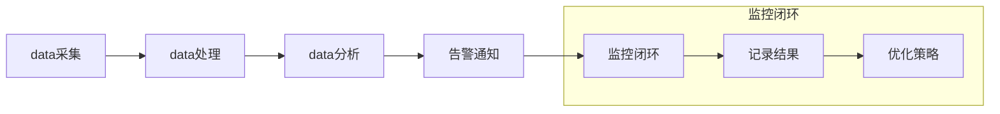
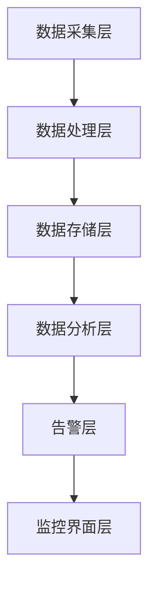
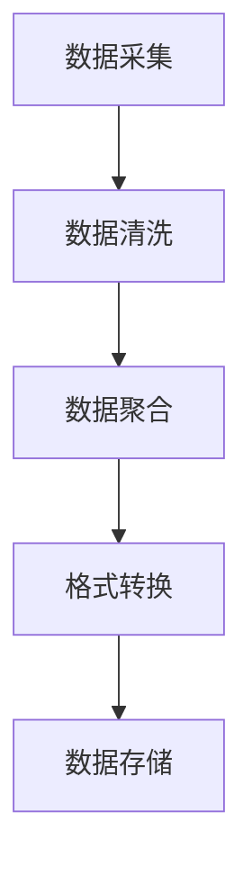
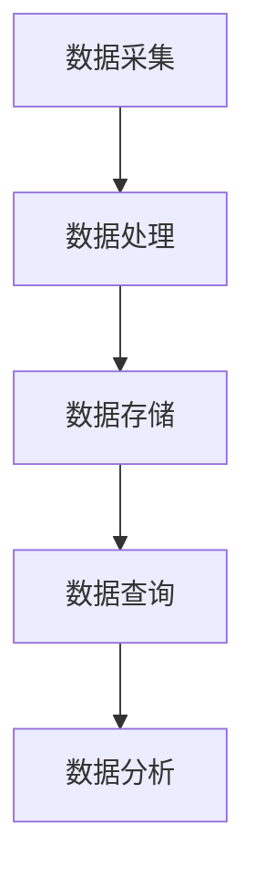

                 

### 第1章：系统监控与告警概述

#### 1.1 系统监控的概念

系统监控是指通过监测系统运行状态、性能指标、资源利用情况等关键参数，及时发现系统中的异常和潜在问题，以保障系统稳定运行的一项重要技术。其核心在于实时性、准确性和自动化，从而降低系统故障的发生率和影响范围。

**核心概念术语说明：**

- **系统性能指标**：包括CPU利用率、内存占用率、磁盘I/O速度、网络延迟等。
- **资源利用情况**：指系统内各种资源（如CPU、内存、磁盘、网络等）的使用效率。
- **异常**：系统运行过程中出现的非预期状态，如系统崩溃、响应时间过长、资源耗尽等。
- **自动化**：监控过程尽可能自动化，减少人工干预，提高响应速度。

**问题背景：**随着信息技术的快速发展，现代企业的IT系统变得越来越复杂，涵盖从服务器、网络设备到各类应用系统的广泛范围。如何确保这些系统稳定、高效地运行，成为企业IT运维的一大挑战。

**问题描述：**系统监控的主要目标就是及时发现并解决系统中的异常，防止这些异常影响业务的正常运作。然而，面对海量的监控数据，如何快速定位问题、有效处理异常，成为系统监控中的关键问题。

**问题解决：**系统监控通过一系列工具和技术来实现，包括数据采集、数据分析和告警通知。具体来说：

1. **数据采集**：通过各种监控工具（如Prometheus、Zabbix等）收集系统性能和状态数据。
2. **数据分析**：对采集到的数据进行分析和处理，识别异常模式和趋势。
3. **告警通知**：当检测到异常时，通过邮件、短信、手机APP等方式及时通知管理员。

**边界与外延：**系统监控不仅限于IT系统，还可以应用于各种工业控制系统、交通管理系统等，只要这些系统需要实时监测和管理。

**概念结构与核心要素组成：**系统监控的核心要素包括监控目标、监控指标、数据采集工具、数据处理和分析工具、告警系统和响应机制。

**核心概念与联系：**

系统监控的各个环节紧密相连，形成了一个完整的监控闭环。以下是核心概念之间的联系表格：

| 核心概念     | 关联关系             |
| ------------ | -------------------- |
| 数据采集     | 提供监控所需的数据基础 |
| 数据处理与分析 | 转换数据为有价值的信息 |
| 告警系统     | 实现异常的及时通知     |
| 响应机制     | 执行相应的修复措施     |

以下是一个简单的ER实体关系图，展示系统监控中的主要实体及其关系：

```mermaid
erDiagram
    MonitorData --> AlertRule : 数据驱动告警
    MonitorData --> AnalyzeResult : 数据分析结果
    AlertRule --> Alert : 触发告警
    AnalyzeResult --> Alert : 生成告警
```

#### 1.2 告警系统的概念

告警系统是系统监控的核心组成部分，它负责在系统出现异常时，及时向管理员发出警报，提醒他们采取行动。告警系统不仅需要准确识别异常，还要能够及时有效地通知相关人员。

**告警系统的基本功能：**

- **告警触发**：当系统性能指标超出预设阈值或发生特定事件时，触发告警。
- **告警通知**：通过多种渠道（如邮件、短信、即时通讯工具等）向管理员发送告警通知。
- **告警记录**：记录所有的告警事件，包括时间、触发条件、处理情况等，便于事后分析和审计。

**告警系统的关键要素：**

- **阈值设置**：根据系统特点和业务需求，设定合理的性能指标阈值，确保告警的准确性和及时性。
- **通知渠道**：根据管理员的工作习惯和紧急程度，选择合适的告警通知方式。
- **告警分级**：根据告警事件的严重程度，设定不同的告警级别，如普通告警、紧急告警等，以便管理员采取不同的应对措施。

**告警系统的重要性：**

告警系统在系统监控中起着至关重要的作用。它不仅能够帮助管理员及时发现系统异常，还能在故障发生时迅速响应，减少故障对业务的影响。以下是告警系统的重要性和影响：

- **提高响应速度**：通过实时告警，管理员可以迅速得知系统异常，及时采取应对措施，减少系统停机时间。
- **保障业务连续性**：在关键业务系统中，告警系统能够确保业务连续性，防止因系统故障导致业务中断。
- **降低运营成本**：通过自动化监控和告警，减少人工监控和维护成本，提高运维效率。
- **预防潜在风险**：通过监控和告警，可以提前发现潜在的系统风险，采取预防措施，避免未来可能发生的故障。

**告警系统的分类：**

根据监控对象和告警方式的不同，告警系统可以分为多种类型，如下表所示：

| 类别           | 描述                                                         |
| -------------- | ------------------------------------------------------------ |
| 按监控对象分   | - 服务器监控：对服务器硬件和软件状态的监控。<br> - 网络监控：对网络设备、链路和带宽的监控。<br> - 应用监控：对应用程序性能和运行状态的监控。 |
| 按监控方法分   | - 主动监控：通过主动发送请求来检测系统状态。<br> - 被动监控：通过被动接收系统事件和日志来监控。 |
| 按告警方式分   | - 邮件告警：通过电子邮件发送告警通知。<br> - 短信告警：通过短信发送告警通知。<br> - 声音告警：通过电话或语音合成技术发送告警通知。<br> - 即时通讯告警：通过即时通讯工具（如Slack、Telegram等）发送告警通知。 |

**告警系统的设计原则：**

- **准确性**：告警系统能够准确识别异常，避免误报和漏报。
- **及时性**：告警系统能够及时触发并通知相关人员，确保问题得到快速处理。
- **可扩展性**：告警系统应具有灵活性，能够适应不同规模和复杂度的系统。
- **可维护性**：告警系统的设计应便于维护和更新，确保系统的长期稳定性。

**告警系统的实现步骤：**

1. **需求分析**：明确系统的监控需求，确定需要监控的性能指标和告警规则。
2. **设计告警规则**：根据监控需求，设计合理的告警规则，包括阈值设置和告警级别。
3. **选择告警工具**：根据系统特点和需求，选择合适的告警工具或平台。
4. **配置告警系统**：配置告警规则、通知渠道和告警级别，确保告警系统能够正常运行。
5. **测试与优化**：测试告警系统的准确性和及时性，根据实际情况进行优化和调整。

通过以上设计和实现步骤，告警系统能够有效地监控系统的运行状态，及时发现和响应异常情况，保障系统的稳定性和业务的连续性。

#### 1.3 系统监控与告警的重要性

系统监控与告警在IT运维中具有不可替代的重要地位，其核心作用主要体现在以下几个方面：

**及时性**：系统监控与告警能够实时监测系统的运行状态，一旦发现异常情况，例如服务器资源耗尽、网络延迟过高或者应用程序崩溃，系统会立即发出警报通知管理员。这种及时性极大地降低了系统故障的发现和处理时间，从而保障了业务的连续性和稳定性。

**降低成本**：通过自动化监控系统，可以减少人工监控和维护的依赖，从而降低运维成本。自动化监控系统不仅能够快速发现和响应异常，还能够自动执行一些预定义的操作，如重启服务、清理日志等，减少了人工干预的时间和精力。

**预防潜在风险**：系统监控与告警不仅能够实时监测系统的运行状态，还能够通过历史数据的分析和趋势预测，提前发现潜在的风险。例如，通过监测服务器负载的趋势，管理员可以预测何时需要扩展服务器资源，从而避免因资源不足导致的系统故障。

**提升运维效率**：自动化监控系统可以大大提高运维工作的效率。管理员不再需要手动检查每个系统的运行状态，而是通过统一的监控平台就能全面了解系统的健康状况。此外，告警系统能够将各种告警通知集中到一个平台上，管理员可以通过一个界面就能查看和处理所有的告警信息，减少了繁琐的操作。

**增强业务连续性**：在关键业务系统中，系统监控与告警能够确保业务连续性。通过实时监测和及时响应，系统能够快速恢复到正常状态，从而减少业务中断的时间，保障业务的连续运作。

**保障系统安全**：系统监控与告警在保障系统安全方面也发挥着重要作用。通过监控网络流量、应用程序行为等，管理员可以及时发现和阻止恶意攻击、异常行为等安全威胁，从而保护系统的安全性。

**减少停机时间**：系统监控与告警系统能够及时发现潜在的故障和异常，管理员可以提前采取预防措施或快速响应，减少系统停机的时间，保障关键业务的正常运行。

**提升用户满意度**：通过高效、稳定的IT服务，系统监控与告警能够提升用户的满意度。用户不再需要担心系统故障导致的业务中断，享受到更加稳定和可靠的IT服务。

总的来说，系统监控与告警是现代IT运维中不可或缺的一部分，它不仅能够提高运维效率和业务连续性，还能够降低运维成本，保障系统安全，从而为企业创造更大的价值。

#### 1.4 系统监控与告警的分类

系统监控与告警可以根据不同的标准进行分类，以便更好地理解和应用。以下是几种常见的分类方式：

**按监控对象分：**

- **服务器监控**：针对服务器硬件和软件状态的监控，包括CPU利用率、内存占用率、磁盘空间使用情况、网络延迟等。
- **网络监控**：对网络设备、链路、带宽、网络流量等状态的监控，包括网络延迟、丢包率、带宽利用率等。
- **应用监控**：对应用程序的性能、运行状态、日志等进行的监控，包括响应时间、请求成功率、错误率等。

**按监控方法分：**

- **主动监控**：通过主动发送请求来检测系统状态，如ping测试、性能测试等。这种方式能够更精确地获取系统的实时状态，但需要定期执行，可能会对系统产生一定的负载。
- **被动监控**：通过被动接收系统事件和日志来监控，如监听系统日志文件、网络流量分析等。这种方式不需要主动请求，对系统的影响较小，但可能会错过一些非日志记录的事件。

**按告警方式分：**

- **邮件告警**：通过电子邮件发送告警通知，这种方式操作简单，易于接收和管理，适合大多数用户。
- **短信告警**：通过短信发送告警通知，适合需要快速响应的紧急情况，但成本较高。
- **声音告警**：通过电话或语音合成技术发送告警通知，适合需要立即引起注意的严重告警。
- **即时通讯告警**：通过即时通讯工具（如Slack、Telegram等）发送告警通知，实时性强，便于团队协作。

**按用途分：**

- **常规监控**：对系统日常运行状态的监控，如性能指标、资源利用率等。
- **故障监控**：对系统故障、异常情况的监控，如服务器宕机、网络中断等。
- **性能监控**：对系统性能的监控，如响应时间、吞吐量等。
- **安全监控**：对系统安全的监控，如恶意攻击、异常流量等。

**按实现方式分：**

- **基于代理的监控**：通过部署在目标系统上的代理程序进行监控，适用于需要深入系统内部监控的场景。
- **基于端口的监控**：通过监控系统的网络端口状态进行监控，适用于网络和服务器监控。
- **基于日志的监控**：通过分析系统日志文件进行监控，适用于应用和故障监控。
- **基于流量的监控**：通过分析网络流量数据（如NetFlow、sFlow）进行监控，适用于网络性能监控。

通过以上分类，我们可以根据具体的需求和场景选择合适的监控和告警方案，以达到最佳的效果。

### 第2章：系统监控的原理与架构

#### 2.1 系统监控的基本原理

系统监控的基本原理是通过多种技术和方法实时获取系统的运行状态和性能数据，然后对这些数据进行处理和分析，以识别和响应系统中的异常和潜在问题。以下是系统监控的核心步骤和关键原理：

**数据采集：**数据采集是系统监控的基础。它通过不同的手段从系统内部和外部分别获取关键指标数据。常见的采集方式包括：

- **Agent模式**：在目标系统上部署监控代理程序，直接采集系统性能指标、资源使用情况、事件日志等。
- **SNMP协议**：通过Simple Network Management Protocol（简单网络管理协议）从网络设备上获取系统状态和配置信息。
- **WMI接口**：使用Windows Management Instrumentation（Windows管理工具）从Windows系统中获取详细信息。

**数据处理：**采集到的数据需要经过处理，以便分析和告警。数据处理的主要任务包括：

- **数据清洗**：去除无效数据、处理异常值、填补缺失值等，保证数据的准确性和完整性。
- **数据聚合**：将来自不同来源、不同时间点的数据进行汇总和整合，以便进行跨维度分析。
- **数据可视化**：通过图表、仪表盘等可视化手段，将数据处理结果直观地展示给用户，便于快速理解和决策。

**数据分析：**数据分析是系统监控的核心，主要通过以下方法进行：

- **趋势分析**：分析系统性能指标的变化趋势，预测系统未来的运行状态。
- **异常检测**：通过统计分析和机器学习等方法，识别系统中的异常模式和异常值。
- **关联分析**：分析不同监控指标之间的关系，发现潜在的问题关联。

**告警通知：**当系统出现异常或性能指标超过预设阈值时，告警系统会立即触发并通知管理员。常见的告警通知方式包括：

- **邮件告警**：通过电子邮件发送告警信息，便于管理员接收和管理。
- **短信告警**：通过短信发送告警信息，适用于需要快速响应的紧急情况。
- **声音告警**：通过电话或语音合成技术发送告警信息，用于引起管理员的注意。
- **即时通讯告警**：通过即时通讯工具（如Slack、Telegram等）发送告警信息，便于团队协作。

**监控闭环：**系统监控不仅需要实时监测和告警，还需要形成闭环，即对告警响应的结果进行记录和分析，持续优化监控策略。以下是监控闭环的步骤：

1. **触发告警**：当系统出现异常时，监控工具会根据预设规则触发告警。
2. **响应告警**：管理员接收告警通知后，根据告警信息和实际情况，采取相应的响应措施。
3. **记录结果**：将告警响应的结果记录下来，以便后续分析和优化。
4. **优化策略**：根据告警记录和实际处理效果，调整监控规则和策略，提高监控的准确性和及时性。

**监控流程图：**以下是一个简化的系统监控流程图，展示从数据采集到告警通知的整个过程：



**监控系统的设计原则：**

1. **准确性**：监控系统需要能够准确识别系统的异常情况，避免误报和漏报。
2. **及时性**：监控系统需要及时检测和响应系统的异常，减少故障的影响时间。
3. **可扩展性**：监控系统需要具备良好的可扩展性，能够适应不同规模和复杂度的系统。
4. **可维护性**：监控系统需要设计简洁，易于维护和更新，确保系统的长期稳定性。

通过以上原理和流程，我们可以设计出高效、可靠的系统监控方案，保障系统的稳定运行和业务的连续性。

#### 2.2 系统监控的常见架构设计

系统监控的架构设计对于监控系统的性能、可扩展性和可靠性具有至关重要的影响。一个高效的监控架构需要具备以下几个关键层次：

**1. 数据采集层（Data Collection Layer）**

数据采集层是系统监控架构的基础，负责从各种来源（如服务器、网络设备、应用程序等）收集性能数据。常见的采集方法包括：

- **Agent模式**：在目标系统上部署监控代理程序，定期采集系统性能指标、资源使用情况等。
- **SNMP协议**：通过Simple Network Management Protocol（简单网络管理协议）从网络设备上获取系统状态和配置信息。
- **WMI接口**：使用Windows Management Instrumentation（Windows管理工具）从Windows系统中获取详细信息。
- **API调用**：通过应用程序的API接口获取监控数据。

数据采集层的设计原则包括：

- **高并发处理能力**：能够同时处理大量系统的监控数据，确保采集过程的效率。
- **可扩展性**：支持添加新的监控目标，适应系统规模的变化。
- **高可用性**：确保采集数据的连续性和可靠性，减少数据丢失。

**2. 数据处理层（Data Processing Layer）**

数据处理层负责对采集到的数据进行清洗、聚合和存储，以便后续的分析和告警。主要任务包括：

- **数据清洗**：去除无效数据、处理异常值、填补缺失值等，保证数据的准确性和完整性。
- **数据聚合**：将来自不同来源、不同时间点的数据进行汇总和整合，形成统一的数据视图。
- **数据存储**：将处理后的数据存储到数据库或时间序列数据库中，以便快速查询和分析。

数据处理层的设计原则包括：

- **高性能**：处理大量数据时，保证数据处理的速度和效率。
- **数据一致性**：确保数据在处理过程中的一致性，减少数据错误。
- **易扩展**：支持不同类型和规模的数据处理需求。

**3. 数据存储层（Data Storage Layer）**

数据存储层是监控数据的重要存储单元，负责长期保存监控数据，以便历史数据分析和趋势预测。常见的数据存储技术包括：

- **关系数据库**：如MySQL、PostgreSQL等，适用于结构化数据存储和查询。
- **时间序列数据库**：如InfluxDB、Prometheus等，适用于存储和查询时间序列数据，特别适合监控数据的存储和分析。
- **NoSQL数据库**：如MongoDB、Cassandra等，适用于非结构化或半结构化数据的存储。

数据存储层的设计原则包括：

- **高可靠性**：确保数据的安全存储，防止数据丢失。
- **高性能**：支持快速数据查询和分析。
- **可扩展性**：支持数据量的增长，适应不同规模的应用。

**4. 数据分析层（Data Analysis Layer）**

数据分析层负责对存储的数据进行分析和处理，识别系统的异常情况、趋势变化和潜在问题。主要分析方法包括：

- **趋势分析**：分析系统性能指标的变化趋势，预测系统未来的运行状态。
- **异常检测**：通过统计分析和机器学习等方法，识别系统中的异常模式和异常值。
- **关联分析**：分析不同监控指标之间的关系，发现潜在的问题关联。

数据分析层的设计原则包括：

- **灵活性**：支持多种分析方法和算法，适应不同类型的监控需求。
- **实时性**：能够快速分析和处理实时数据，及时响应系统异常。
- **可扩展性**：支持添加新的分析模块，适应不断变化的需求。

**5. 告警层（Alerting Layer）**

告警层负责在系统出现异常时，及时向管理员发出警报，提醒他们采取行动。常见的告警通知方式包括：

- **邮件告警**：通过电子邮件发送告警信息，便于管理员接收和管理。
- **短信告警**：通过短信发送告警信息，适用于需要快速响应的紧急情况。
- **声音告警**：通过电话或语音合成技术发送告警信息，用于引起管理员的注意。
- **即时通讯告警**：通过即时通讯工具（如Slack、Telegram等）发送告警信息，便于团队协作。

告警层的设计原则包括：

- **准确性**：确保告警信息的准确性，避免误报和漏报。
- **及时性**：及时触发告警，确保管理员能够在第一时间了解到系统异常。
- **灵活性**：支持多种告警通知方式，满足不同管理员的偏好。

**6. 监控界面层（Monitoring Interface Layer）**

监控界面层提供用户界面，使管理员能够直观地查看系统的运行状态、性能指标和历史数据。常见的监控界面包括：

- **仪表盘**：展示系统的关键指标和实时状态。
- **告警列表**：列出所有的告警事件，便于管理员查看和处理。
- **报告生成**：生成系统性能报告，便于管理员进行长期数据分析和决策。

监控界面层的设计原则包括：

- **易用性**：界面简洁、操作直观，方便管理员快速上手。
- **交互性**：支持用户与系统进行互动，提供自定义功能。
- **响应性**：界面响应速度快，确保用户体验。

**监控架构图：**以下是系统监控架构的简化示意图，展示各层之间的关系：



通过上述架构设计，系统监控可以高效、准确地监测系统的运行状态，及时发现和处理异常情况，保障系统的稳定性和业务的连续性。

#### 2.3 系统监控的关键技术

系统监控的实现依赖于多种关键技术，这些技术确保了监控系统的准确性、效率和可靠性。以下是系统监控中的几种关键技术：

**1. 数据采集技术**

数据采集是系统监控的基础，其目的是从各种来源获取系统运行状态和性能数据。常用的数据采集技术包括：

- **Agent模式**：在目标系统上部署监控代理程序，定期或实时地采集系统性能指标、资源使用情况、事件日志等。常见的监控代理工具包括Zabbix、Prometheus等。
- **SNMP协议**：通过Simple Network Management Protocol（简单网络管理协议）从网络设备上获取系统状态和配置信息。SNMP协议支持多种MIB（Management Information Base）库，可以采集丰富的系统信息。
- **WMI接口**：使用Windows Management Instrumentation（Windows管理工具）从Windows系统中获取详细信息。WMI提供了丰富的监控接口，适用于Windows平台的系统监控。
- **API调用**：通过应用程序的API接口获取监控数据。这种方式适用于对应用程序性能和运行状态的监控。

**2. 数据处理技术**

采集到的数据需要进行处理，以便进行分析和告警。数据处理技术包括：

- **数据清洗**：去除无效数据、处理异常值、填补缺失值等，保证数据的准确性和完整性。常用的数据清洗方法包括去重、过滤、转换等。
- **数据聚合**：将来自不同来源、不同时间点的数据进行汇总和整合，形成统一的数据视图。数据聚合可以提高数据分析的效率和准确性。
- **数据可视化**：通过图表、仪表盘等可视化手段，将数据处理结果直观地展示给用户，便于快速理解和决策。常见的数据可视化工具包括Grafana、Kibana等。

**3. 数据存储技术**

数据存储技术是监控系统架构的重要组成部分，负责长期保存监控数据，以便历史数据分析和趋势预测。常见的数据存储技术包括：

- **关系数据库**：如MySQL、PostgreSQL等，适用于结构化数据存储和查询。关系数据库具有强大的数据管理能力和查询性能，适用于需要复杂查询和分析的场景。
- **时间序列数据库**：如InfluxDB、Prometheus等，适用于存储和查询时间序列数据，特别适合监控数据的存储和分析。时间序列数据库具有高吞吐量和低延迟的特点，适用于实时监控和告警。
- **NoSQL数据库**：如MongoDB、Cassandra等，适用于非结构化或半结构化数据的存储。NoSQL数据库具有灵活的数据模型和良好的扩展性，适用于不同规模和类型的数据存储需求。

**4. 告警技术**

告警技术在系统监控中起着关键作用，负责在系统出现异常时及时通知管理员。常见的告警技术包括：

- **阈值告警**：基于预设的阈值，当系统性能指标超过或低于阈值时触发告警。阈值告警是最常用的告警方式，适用于简单的性能监控。
- **规则告警**：基于预定义的规则，当系统满足特定条件时触发告警。规则告警适用于复杂的事件处理和告警策略。
- **事件告警**：基于系统事件的发生，如服务器宕机、网络中断等，触发告警。事件告警适用于故障监控和实时响应。
- **多渠道告警**：通过多种渠道（如邮件、短信、声音、即时通讯等）发送告警信息，确保管理员能够及时收到告警通知。多渠道告警可以提高告警的及时性和响应效率。

**5. 分析与可视化技术**

分析与可视化技术是系统监控的重要组成部分，负责对监控数据进行深入分析和直观展示。常见的技术包括：

- **趋势分析**：通过分析系统性能指标的变化趋势，预测系统未来的运行状态。趋势分析适用于长期性能监控和预测。
- **异常检测**：通过统计分析和机器学习等方法，识别系统中的异常模式和异常值。异常检测适用于实时监控和故障预测。
- **关联分析**：分析不同监控指标之间的关系，发现潜在的问题关联。关联分析适用于复杂系统监控和故障诊断。
- **数据可视化**：通过图表、仪表盘等可视化手段，将监控数据直观地展示给用户，便于快速理解和决策。数据可视化提高了监控数据的可读性和易用性。

**关键技术的关联和作用**

数据采集技术、数据处理技术、数据存储技术和告警技术共同构成了系统监控的核心，各自发挥着关键作用：

- **数据采集技术**：提供监控所需的数据基础，确保数据的准确性和完整性。
- **数据处理技术**：对采集到的数据进行分析和处理，生成有价值的监控信息。
- **数据存储技术**：长期保存监控数据，为历史数据分析和趋势预测提供支持。
- **告警技术**：在系统出现异常时，及时通知管理员，确保问题得到快速响应。

分析与可视化技术则进一步提升了监控系统的功能和用户体验，使管理员能够更直观地了解系统状态和监控数据，从而更好地进行运维决策。

通过以上关键技术的综合运用，系统监控能够实现高效、准确的监控，及时发现和处理系统异常，保障系统的稳定运行和业务的连续性。

### 第3章：告警系统的设计与实现

#### 3.1 告警系统的基本概念

告警系统是系统监控中的关键组件，其主要功能是在系统出现异常或性能指标超过阈值时，及时通知管理员采取相应的行动。告警系统的设计目标包括准确性、及时性和可靠性。以下是告警系统的基本概念和组成部分：

**告警规则（Alert Rules）：**告警规则定义了系统监控中的触发条件和阈值。这些规则可以是基于性能指标（如CPU利用率、内存占用率、磁盘空间等）、特定事件（如服务宕机、网络中断）或自定义条件（如请求响应时间超过指定值）。告警规则是告警系统的核心，决定了何时以及如何触发告警。

**告警触发（Alert Triggering）：**告警触发是指当系统监控工具检测到监控指标超出预设阈值或发生特定事件时，触发告警流程。触发条件可以是单一的阈值，也可以是复合条件（如多个指标同时超过阈值）。

**告警通知（Alert Notification）：**告警通知是指将告警信息发送给管理员的过程。通知渠道包括电子邮件、短信、声音告警、即时通讯工具（如Slack、Telegram等）等。通知方式的选择取决于告警的紧急程度和行政管理的需求。

**告警记录（Alert Logging）：**告警记录是指记录所有告警事件的详细信息，包括告警时间、触发条件、告警级别、处理结果等。告警记录不仅用于历史数据分析，还可以用于合规审计和故障排查。

**告警分级（Alert Prioritization）：**告警分级是指根据告警事件的严重程度和影响范围，将告警分为不同等级（如紧急、高、中、低），以便管理员采取相应的响应措施。

**告警处理（Alert Handling）：**告警处理是指管理员接收到告警通知后，根据告警信息和实际情况，采取的响应措施。处理措施可能包括重启服务、清理日志、升级系统等。

**告警系统架构（Alert System Architecture）：**告警系统通常包括以下几部分：

- **监控工具**：负责实时监控系统的性能指标和事件。
- **告警规则引擎**：处理告警规则，根据监控数据判断是否触发告警。
- **通知系统**：负责发送告警通知。
- **日志和报告系统**：记录和报告告警事件和处理情况。

**告警系统的设计原则：**

- **准确性**：确保告警系统能够准确识别异常情况，避免误报和漏报。
- **及时性**：确保告警系统能够及时触发并通知管理员，减少故障处理时间。
- **可靠性**：确保告警系统稳定运行，减少因系统故障导致的通知丢失。
- **可扩展性**：支持添加新的监控目标和规则，适应不同规模和复杂度的系统。
- **易维护性**：设计简洁，便于维护和更新。

#### 3.2 告警系统的设计原则

告警系统的设计原则决定了系统的性能、可靠性和用户体验。以下是几个关键的设计原则：

**1. 及时性**

及时性是告警系统的核心原则之一。告警系统需要在系统出现异常的第一时间触发告警，通知管理员采取行动。延迟的告警可能导致故障的扩大，增加业务损失。为了确保及时性，以下措施可以采用：

- **实时监控**：采用实时监控技术，如Agent模式、SNMP、WMI等，确保数据采集的实时性。
- **快速处理**：优化数据处理和告警触发的流程，减少延迟。
- **多渠道通知**：通过多种渠道（如邮件、短信、声音告警、即时通讯工具）发送告警通知，提高通知的及时性。

**2. 准确性**

准确性是告警系统的关键。错误的告警不仅会浪费管理员的精力，还可能引起不必要的恐慌。为了提高准确性，以下措施可以采用：

- **合理阈值设置**：根据系统的实际运行情况和业务需求，设定合理的阈值。
- **数据验证**：在数据采集和传输过程中，进行数据验证，确保数据的准确性和完整性。
- **告警规则优化**：通过监控数据和历史告警记录，不断优化告警规则，减少误报和漏报。

**3. 可靠性**

告警系统的可靠性直接关系到业务的连续性和稳定性。为了确保可靠性，以下措施可以采用：

- **冗余设计**：设计冗余结构，如备份监控代理、多节点存储等，确保数据采集和告警通知的可靠性。
- **故障恢复**：实现故障检测和自动恢复功能，如当监控代理失效时，自动重启或切换到备用代理。
- **系统监控**：对告警系统本身进行监控，确保其稳定运行。

**4. 可扩展性**

随着系统规模的扩大和业务需求的增加，告警系统需要具备良好的可扩展性。以下措施可以采用：

- **模块化设计**：将告警系统的功能模块化，便于新增监控目标和规则。
- **分布式架构**：采用分布式架构，支持大规模系统的监控需求。
- **灵活配置**：提供灵活的配置选项，支持自定义监控目标和告警规则。

**5. 易维护性**

易维护性是确保告警系统长期稳定运行的关键。以下措施可以采用：

- **简洁性**：设计简洁、直观的用户界面，方便管理员进行配置和管理。
- **自动化**：采用自动化工具和脚本，简化运维流程，减少人工干预。
- **文档和培训**：提供详细的文档和培训资料，帮助管理员快速上手。

通过以上设计原则，告警系统可以确保及时、准确、可靠地监测系统状态，为管理员提供有效的支持，保障业务的连续性和稳定性。

#### 3.3 告警系统的实现步骤

实现告警系统是一个复杂的过程，需要从需求分析、设计告警规则、选择告警工具到配置告警系统和测试优化等步骤。以下是告警系统实现的具体步骤：

**1. 需求分析**

需求分析是告警系统实现的第一步，其目的是明确系统的监控需求、性能指标和告警规则。以下是需求分析的主要内容：

- **确定监控目标**：明确需要监控的系统组件，如服务器、网络设备、应用程序等。
- **定义性能指标**：根据系统特点和业务需求，确定需要监控的关键性能指标，如CPU利用率、内存占用率、磁盘空间使用情况、网络延迟等。
- **设定告警阈值**：根据历史数据和业务需求，设定合理的告警阈值，确保告警的准确性和及时性。
- **确定告警通知渠道**：根据管理员的偏好和紧急程度，选择合适的告警通知方式，如电子邮件、短信、声音告警、即时通讯工具等。

**2. 设计告警规则**

设计告警规则是告警系统的关键步骤，告警规则决定了系统在何时、何种条件下触发告警。以下是设计告警规则的主要内容：

- **定义告警条件**：根据性能指标和业务需求，定义触发告警的具体条件。例如，当CPU利用率超过90%时触发告警。
- **设定告警级别**：根据告警事件的严重程度，设定不同的告警级别，如紧急告警、高优先级告警、普通告警等，以便管理员采取不同的响应措施。
- **告警规则组合**：设计复合告警规则，结合多个性能指标和条件，提高告警的准确性和可靠性。

**3. 选择告警工具**

选择合适的告警工具是确保告警系统高效运行的关键。以下是选择告警工具的主要考虑因素：

- **功能完整性**：选择能够满足所有监控需求和告警规则的工具，如Prometheus、Zabbix、Nagios等。
- **性能和可靠性**：选择能够稳定运行、处理大量监控数据的工具，确保告警系统的实时性和可靠性。
- **扩展性**：选择支持模块化设计、易于扩展的工具，以适应未来业务需求的变化。
- **集成性**：选择能够与其他监控系统、运维工具集成的工具，提高运维效率。

**4. 配置告警系统**

配置告警系统是将告警规则和工具进行有机结合的过程。以下是配置告警系统的具体步骤：

- **安装和部署**：安装所选的告警工具，并确保其正常运行。
- **配置监控目标**：将需要监控的系统组件添加到监控列表，并配置相应的监控指标。
- **设定告警规则**：根据设计好的告警规则，配置触发条件和告警级别。
- **配置通知渠道**：设置告警通知渠道，如邮件、短信、声音告警、即时通讯工具等，确保管理员能够及时收到告警通知。
- **测试告警系统**：在配置完成后，进行测试，确保告警系统能够正确触发和发送告警。

**5. 测试与优化**

测试与优化是确保告警系统有效运行的重要环节。以下是测试和优化的主要步骤：

- **功能测试**：验证告警系统的各项功能是否正常，如数据采集、告警触发、通知发送等。
- **性能测试**：模拟高负载情况，测试告警系统的性能和响应时间，确保其能够稳定运行。
- **优化告警规则**：根据测试结果，调整告警规则，减少误报和漏报，提高告警的准确性和及时性。
- **定期维护**：定期检查告警系统的运行状态，更新监控指标和规则，确保其适应不断变化的业务需求。

通过以上实现步骤，告警系统可以高效、准确地监测系统状态，及时发现和处理异常情况，保障业务的连续性和稳定性。

### 第4章：系统监控与告警的数据处理

#### 4.1 数据采集与预处理

数据采集与预处理是系统监控与告警的基础环节，直接影响监控数据的准确性和可用性。以下是数据采集与预处理的主要步骤和关键技术：

**数据采集**

数据采集是指从系统、网络设备和应用程序中获取性能指标、事件日志等监控数据。常用的数据采集方法包括：

- **Agent模式**：在目标系统上部署监控代理，定期或实时采集系统性能指标、资源使用情况、事件日志等。常见的监控代理工具有Zabbix、Prometheus等。
- **SNMP协议**：通过Simple Network Management Protocol（简单网络管理协议）从网络设备上获取系统状态和配置信息。SNMP协议适用于广泛的网络设备，如路由器、交换机等。
- **WMI接口**：使用Windows Management Instrumentation（Windows管理工具）从Windows系统中获取详细信息。WMI提供了丰富的监控接口，适用于Windows平台。
- **API调用**：通过应用程序的API接口获取监控数据。这种方式适用于对应用程序性能和运行状态的监控。

**预处理**

预处理是指对采集到的监控数据进行清洗、去重、格式转换等处理，以便后续分析和告警。以下是数据预处理的关键技术：

- **数据清洗**：去除无效数据、处理异常值、填补缺失值等。数据清洗可以确保监控数据的准确性和完整性。常用的方法包括去重、过滤、转换等。
- **数据聚合**：将来自不同来源、不同时间点的数据进行汇总和整合，形成统一的数据视图。数据聚合可以提高数据分析的效率和准确性。例如，将来自不同服务器的CPU利用率数据汇总成总的CPU利用率数据。
- **格式转换**：将采集到的原始数据转换为统一的格式，如JSON、CSV等，以便后续存储和分析。格式转换可以简化数据处理过程，提高数据兼容性。

**数据采集与预处理流程图**

以下是系统监控中数据采集与预处理的流程图：



通过以上数据采集与预处理步骤，我们可以确保监控数据的准确性和完整性，为后续的数据分析和告警提供可靠的数据基础。

#### 4.2 数据存储与查询

数据存储与查询是系统监控与告警中的重要环节，决定了监控数据的有效利用和快速访问。以下是数据存储与查询的主要步骤和技术：

**数据存储**

数据存储是指将处理后的监控数据保存到数据库或其他存储系统中，以便长期保存和查询。常见的数据存储技术包括：

- **关系数据库**：如MySQL、PostgreSQL等，适用于结构化数据的存储和查询。关系数据库具有强大的数据管理能力和查询性能，适用于需要复杂查询和分析的场景。
- **时间序列数据库**：如InfluxDB、Prometheus等，适用于存储和查询时间序列数据，特别适合监控数据的存储和分析。时间序列数据库具有高吞吐量和低延迟的特点，适用于实时监控和告警。
- **NoSQL数据库**：如MongoDB、Cassandra等，适用于非结构化或半结构化数据的存储。NoSQL数据库具有灵活的数据模型和良好的扩展性，适用于不同规模和类型的数据存储需求。

**数据存储架构**

以下是数据存储的典型架构：



**数据查询**

数据查询是指从存储系统中检索监控数据，以便进行实时监控和历史分析。以下是数据查询的关键技术：

- **SQL查询**：使用结构化查询语言（SQL）对关系数据库进行查询。SQL查询适用于结构化数据，具有灵活的表达能力和强大的查询功能。
- **时间序列查询**：使用时间序列数据库特有的查询语言，如InfluxDB的InfluxQL、Prometheus的PromQL等，进行时间序列数据的查询。时间序列查询适用于实时监控和趋势分析。
- **索引和分区**：为了提高数据查询的效率和性能，可以使用索引和分区技术。索引可以加快查询速度，分区可以分散数据存储，提高并发查询能力。

**数据查询示例**

以下是使用PromQL进行时间序列数据查询的示例：

```plaintext
# 查询过去1小时的CPU利用率平均值
rate(prometheus_python_server_cpu_usage[1m])
```

**数据存储与查询优化**

为了提高数据存储与查询的性能，可以采用以下优化方法：

- **索引优化**：合理设计索引，加快查询速度。例如，在常用的查询字段上创建索引。
- **分区优化**：对时间序列数据按照时间进行分区，减少查询范围，提高查询效率。
- **缓存策略**：使用缓存技术，如Redis，缓存常用查询结果，减少数据库访问压力。
- **分布式查询**：对于大规模的数据存储系统，可以采用分布式查询技术，提高查询性能和容错能力。

通过以上数据存储与查询技术，我们可以高效、准确地存储和查询监控数据，为系统监控与告警提供强大的数据支持。

#### 4.3 数据分析与可视化

数据分析与可视化是系统监控与告警中的重要环节，通过分析监控数据，识别系统异常和趋势变化，并使用可视化工具将分析结果直观地展示出来，从而帮助管理员快速理解和决策。以下是数据分析与可视化的主要步骤和技术：

**数据分析**

数据分析是指对监控数据进行处理、挖掘和解释，以识别系统中的异常和趋势变化。以下是数据分析的关键步骤和技术：

- **数据预处理**：对监控数据进行清洗、去噪、格式转换等预处理，确保数据的质量和一致性。
- **数据聚合**：将来自不同来源、不同时间点的数据进行汇总和整合，形成统一的数据视图，便于进一步分析。
- **趋势分析**：分析监控数据的变化趋势，预测系统的未来运行状态。常用的方法包括时间序列分析、回归分析等。
- **异常检测**：通过统计分析和机器学习等方法，识别系统中的异常模式和异常值。常见的异常检测方法包括移动平均、IQR（四分位距）法、K-means聚类等。
- **关联分析**：分析不同监控指标之间的关系，发现潜在的问题关联。例如，通过关联分析可以发现CPU利用率高和磁盘I/O繁忙之间的关联。

**数据可视化**

数据可视化是将分析结果以图表、仪表盘等形式直观地展示出来，帮助管理员快速理解和决策。以下是数据可视化的关键步骤和技术：

- **数据可视化工具**：选择合适的数据可视化工具，如Grafana、Kibana、Tableau等。这些工具提供了丰富的图表类型和自定义选项，可以满足不同类型的可视化需求。
- **图表选择**：根据数据类型和分析目标，选择合适的图表类型。常见的图表类型包括折线图、柱状图、饼图、散点图等。
- **仪表盘设计**：设计直观、易用的仪表盘，将关键监控指标和可视化图表整合到一个界面中，便于管理员快速查看系统状态。
- **交互性**：增加交互性，如过滤、缩放、切换视图等，提高用户体验。交互性可以帮助管理员更灵活地查看和分析数据。

**数据分析与可视化示例**

以下是使用Grafana进行数据可视化的示例：

```plaintext
# 数据可视化
* | graph (time系列)
```

通过以上数据分析与可视化步骤，我们可以将复杂的监控数据转化为直观、易懂的信息，帮助管理员更好地理解和决策，从而提高系统监控与告警的效率和准确性。

### 第5章：实战案例解析

#### 5.1 案例一：某企业系统监控与告警系统的设计与实施

**案例背景：**

某大型企业拥有复杂且庞大的IT基础设施，包括数百台服务器、多种应用系统和大量的网络设备。由于业务规模不断扩大，企业IT部门面临巨大的运维压力，急需一套高效、可靠的系统监控与告警系统来保障业务的连续性和稳定性。

**监控目标：**

- 监控所有关键服务器的性能指标，如CPU利用率、内存占用率、磁盘空间等。
- 监控网络设备的运行状态，包括带宽利用率、丢包率、链路质量等。
- 监控关键应用系统的运行状态，如响应时间、请求成功率、错误率等。
- 实时收集和展示各种监控数据，提供直观的监控仪表盘。
- 设计灵活的告警规则，确保及时通知管理员处理异常。

**系统设计：**

**1. 数据采集层：**

- 在每台关键服务器上部署Zabbix代理程序，实时采集系统性能指标、资源使用情况、事件日志等。
- 利用SNMP协议从网络设备上采集运行状态和配置信息。
- 通过API调用从关键应用系统中获取监控数据。

**2. 数据处理层：**

- 利用Zabbix Server对采集到的数据进行预处理，包括数据清洗、去重、格式转换等。
- 使用InfluxDB作为时间序列数据库，存储和处理监控数据，提供高效的查询能力。

**3. 数据存储层：**

- 使用InfluxDB存储所有监控数据，保证数据的可靠性和高性能。
- 配置备份和恢复机制，防止数据丢失。

**4. 数据分析层：**

- 利用Grafana作为数据可视化工具，将InfluxDB中的数据通过图表、仪表盘等形式展示出来。
- 设计自定义的告警规则，实现性能指标异常、网络链路故障、应用系统崩溃等异常情况的实时告警。

**5. 告警层：**

- 配置邮件告警，将告警通知发送到管理员邮箱。
- 配置短信告警，通过第三方短信服务提供商发送短信。
- 配置声音告警，通过电话或语音合成技术发送告警通知。

**系统实施：**

**1. 环境搭建：**

- 安装和配置Zabbix Server和Zabbix Agent。
- 安装和配置InfluxDB。
- 配置Grafana与InfluxDB的连接。

**2. 数据采集：**

- 在每台关键服务器上安装Zabbix Agent，配置采集参数。
- 配置Zabbix Server，添加服务器和监控项。

**3. 数据处理与存储：**

- 使用Zabbix Server处理采集到的数据，并将数据存储到InfluxDB中。
- 配置InfluxDB的数据导入脚本，定期从Zabbix Server导入数据。

**4. 数据分析与可视化：**

- 在Grafana中创建监控仪表盘，展示关键监控指标。
- 设计自定义的告警规则，确保及时触发告警。

**5. 告警通知：**

- 配置邮件告警，设置告警邮件模板和通知规则。
- 配置短信告警，设置短信模板和通知规则。
- 配置声音告警，设置电话号码和通知规则。

**系统效果：**

- 通过系统监控与告警系统，企业能够实时监控关键系统的运行状态，及时识别和响应异常情况，降低了系统故障的发生率和影响范围。
- 系统的自动化告警功能大大提高了运维效率，管理员可以集中精力处理重要的故障，减少了重复性工作。
- 通过仪表盘和告警通知，管理员能够快速了解系统状况，及时采取应对措施，确保业务的连续性和稳定性。
- 数据可视化功能为企业的长期监控和性能优化提供了有力的支持，有助于制定更科学的运维策略。

**项目小结：**

该企业系统监控与告警系统的设计与实施，成功地解决了企业IT运维中的关键问题，提升了系统的可靠性和运维效率。通过使用Zabbix、InfluxDB和Grafana等开源工具，企业不仅实现了高效、准确的监控，还降低了运维成本。该项目的成功经验为其他企业提供了宝贵的参考，展示了系统监控与告警系统在保障业务连续性和稳定性方面的重要作用。

---

#### 5.2 案例二：某互联网公司告警系统的优化与改进

**案例背景：**

某互联网公司在业务快速发展过程中，遇到了监控系统告警频繁、误报率高、响应速度慢等问题。这些问题不仅增加了运维团队的负担，还可能影响业务的连续性和用户体验。因此，公司决定对现有的告警系统进行优化和改进。

**监控目标：**

- 降低误报率，确保告警的准确性和有效性。
- 提高告警系统的响应速度，减少故障处理时间。
- 提升告警系统的用户体验，简化告警管理流程。
- 增加告警系统的可扩展性，支持更多的监控指标和业务场景。

**系统优化与改进措施：**

**1. 数据采集优化：**

- **多源数据整合**：将多种数据采集工具（如Prometheus、Grafana等）整合到一个统一的平台，避免数据孤岛，提高数据利用率。
- **数据采集优化**：优化数据采集频率和采样率，确保在降低系统负载的同时，不牺牲数据准确性。

**2. 数据处理与存储优化：**

- **数据预处理优化**：引入流数据处理技术，如Apache Kafka，实现实时数据流处理，提高数据处理速度。
- **数据存储优化**：采用分布式存储架构，如Apache Cassandra，提升数据存储的容量和性能。

**3. 告警规则优化：**

- **动态阈值调整**：根据历史数据和业务需求，动态调整告警阈值，减少误报。
- **复合告警规则**：设计复合告警规则，结合多个监控指标和条件，提高告警的准确性和可靠性。

**4. 告警通知优化：**

- **多渠道通知**：增加多种通知渠道，如短信、微信、Slack等，提高管理员接收通知的便捷性。
- **通知优先级**：设置告警通知的优先级，确保重要告警能够得到及时处理。

**5. 用户体验优化：**

- **可视化仪表盘**：优化仪表盘设计，提供更直观、易用的监控界面。
- **告警管理**：提供告警列表、告警历史查询等功能，方便管理员管理和追踪告警。

**6. 系统性能优化：**

- **分布式架构**：采用分布式架构，提高系统的可扩展性和容错能力。
- **负载均衡**：使用负载均衡技术，确保告警系统在高并发场景下稳定运行。

**实施步骤：**

**1. 需求分析与设计**：明确优化目标和具体措施，设计优化方案。

**2. 环境搭建与测试**：搭建优化环境，进行测试验证优化方案的有效性。

**3. 逐步实施**：分阶段实施优化措施，确保系统的稳定性和可靠性。

**4. 运维培训**：对运维团队进行培训，确保他们能够熟练使用新系统和处理告警。

**系统效果：**

- **误报率大幅降低**：通过动态阈值调整和复合告警规则，误报率显著降低，管理员收到更准确的告警通知。
- **响应速度提升**：通过流数据处理和分布式存储架构，告警系统的响应速度大幅提升，故障处理时间缩短。
- **用户体验改善**：新的仪表盘设计和多渠道通知功能，使管理员能够更便捷地管理和响应告警，提高了工作效率。
- **系统稳定性增强**：通过分布式架构和负载均衡，系统在高并发场景下的稳定性得到显著提升，保证了业务的连续性和用户体验。

**项目小结：**

该互联网公司告警系统的优化与改进，成功地解决了原有系统中的诸多问题，提升了系统的整体性能和用户体验。通过多源数据整合、数据处理与存储优化、告警规则优化、通知渠道扩展和用户体验改善等措施，公司不仅提高了运维效率，还保障了业务的连续性和稳定性。该项目的成功经验为其他互联网企业的告警系统优化提供了有益的参考。

---

#### 5.3 案例三：系统监控与告警在云平台的应用

**案例背景：**

某大型企业逐步将业务迁移至云平台，面对云计算环境中的监控与告警挑战。云平台具有弹性、分布式和高可用的特点，但同时也带来了监控复杂度增加、资源动态分配等新问题。企业需要一套适用于云平台的系统监控与告警解决方案，以确保业务的稳定运行。

**监控目标：**

- 实时监控云服务器的性能指标，包括CPU利用率、内存占用率、磁盘I/O等。
- 监控云网络状态，包括带宽利用率、网络延迟、丢包率等。
- 监控容器化应用（如Docker、Kubernetes集群）的运行状态和性能。
- 监控云服务（如AWS、Azure、Google Cloud等）的运行状态和资源使用情况。

**系统架构设计：**

**1. 数据采集层：**

- 在云服务器上部署监控代理，如Prometheus，实时采集性能数据。
- 利用云服务提供商提供的监控API（如AWS CloudWatch、Azure Monitor等）采集云资源状态。
- 通过Kubernetes集群的API服务器采集容器化应用的监控数据。

**2. 数据处理与存储层：**

- 使用Prometheus Server存储和处理采集到的监控数据，提供高效的时间序列数据存储。
- 将Prometheus与云服务提供商的监控数据集成，确保数据的一致性和完整性。

**3. 数据分析与可视化层：**

- 利用Grafana作为可视化工具，整合Prometheus和云服务提供商的数据，创建监控仪表盘。
- 设计自定义的告警规则，实现跨云服务、跨区域的异常监控。

**4. 告警层：**

- 配置多种告警通知渠道，包括邮件、短信、Slack等，确保告警通知的及时性和可靠性。
- 告警系统与云服务提供商的自动恢复功能集成，实现自动故障恢复。

**系统实施：**

**1. 环境搭建：**

- 在云服务器上部署Prometheus Agent和Prometheus Server。
- 配置云服务提供商的监控API，获取云资源状态。
- 部署Kubernetes集群，配置容器监控。

**2. 数据采集与处理：**

- 配置Prometheus监控规则，定义监控目标和告警规则。
- 定期同步云服务提供商的监控数据，确保数据的一致性。

**3. 数据可视化：**

- 在Grafana中创建监控仪表盘，展示关键监控指标。
- 设计自定义告警规则，实现实时告警。

**4. 告警通知：**

- 配置邮件告警，设置告警邮件模板和通知规则。
- 配置Slack告警，实现实时告警通知。

**系统效果：**

- **实时监控**：通过Prometheus和Grafana，企业实现了对云服务器、云网络、容器化应用和云服务的实时监控，确保业务运行状态的可视化和可控性。
- **灵活告警**：自定义告警规则和多种通知渠道，提高了告警的灵活性和及时性，管理员可以快速响应和处理异常。
- **自动恢复**：告警系统与云服务提供商的自动恢复功能集成，实现了自动故障恢复，降低了故障处理时间。
- **资源优化**：通过监控和告警，企业能够及时发现和优化资源使用情况，提高资源利用率，降低运营成本。

**项目小结：**

系统监控与告警在云平台中的应用，成功地解决了企业面临的新挑战，实现了云环境下的高效监控和快速响应。通过Prometheus、Grafana等开源工具，企业不仅实现了跨云服务的统一监控，还提高了运维效率和系统稳定性。该项目的成功经验为其他企业在云平台上的监控与告警系统建设提供了宝贵的参考。

### 第6章：系统监控与告警的最佳实践

#### 6.1 监控指标的选择

选择合适的监控指标对于系统监控与告警系统的有效性至关重要。以下是一些最佳实践，用于选择和设定关键监控指标：

**1. 确定业务关键指标（KPI）**

- **业务场景分析**：根据业务需求，识别关键业务流程和指标。例如，电子商务平台的关键指标可能是订单处理时间和交易成功率。
- **性能与稳定性指标**：选择直接影响业务性能和稳定性的指标，如响应时间、吞吐量、错误率等。
- **资源利用率指标**：监控关键资源的利用率，如CPU、内存、磁盘、网络等，确保资源得到合理使用。

**2. 设定合理的阈值**

- **历史数据参考**：基于历史数据，设定合理的阈值。例如，响应时间超过1000毫秒可能被认为是异常。
- **业务需求适配**：根据业务需求和用户体验预期，调整阈值。例如，关键交易系统的响应时间阈值可能比普通应用更严格。
- **动态调整**：根据业务变化和负载波动，动态调整阈值，以确保告警的准确性和及时性。

**3. 考虑多维度指标**

- **综合指标**：结合多个指标，形成综合监控视图。例如，响应时间和错误率共同决定系统健康状态。
- **上下文关联**：考虑指标之间的关联性，避免单一指标误报。例如，高CPU利用率可能与内存不足相关。

**4. 优先级排序**

- **优先监控关键业务流程**：将关键业务流程和核心服务的指标作为优先监控对象。
- **风险导向**：优先监控可能产生较大业务风险的问题，如数据库故障、网络中断等。

**5. 避免过度监控**

- **监控成本**：监控过多的指标可能会增加系统负担和告警噪音，应避免过度监控。
- **质量优先**：确保监控指标的质量，而不是数量。优先选择最有价值和最有用的指标。

**6. 持续优化**

- **定期审查**：定期审查监控指标和阈值，根据业务变化进行调整。
- **反馈机制**：建立监控指标反馈机制，根据实际告警情况优化指标和阈值。

#### 6.2 告警规则的设定

告警规则的设定是确保系统监控与告警系统有效性的关键。以下是一些最佳实践：

**1. 明确告警目的**

- **明确触发条件**：设定明确的告警触发条件，确保告警的准确性。例如，当CPU利用率超过90%时触发告警。
- **区分告警级别**：根据告警事件的严重程度和影响范围，设定不同的告警级别（如紧急、高、中、低），以便管理员采取相应的响应措施。

**2. 考虑依赖关系**

- **链式告警**：设定链式告警规则，确保一个告警触发后，相关依赖系统或组件也能及时告警。
- **依赖指标**：考虑监控指标之间的依赖关系，确保告警规则的关联性和完整性。

**3. 避免误报**

- **阈值调整**：根据监控数据的波动和业务需求，动态调整阈值，减少误报。
- **过滤规则**：设定过滤规则，避免因偶发事件或临时负载导致的误报。

**4. 多渠道通知**

- **多渠道告警**：选择合适的告警通知渠道，如邮件、短信、声音告警、即时通讯工具等，确保告警能够及时通知到相关人员。
- **优先级设置**：根据告警级别和紧急程度，设置不同的通知优先级，确保重要告警得到及时响应。

**5. 灵活配置**

- **告警规则模板**：设计通用的告警规则模板，便于快速配置和管理。
- **自定义规则**：支持自定义告警规则，适应不同业务场景和监控需求。

**6. 持续优化**

- **反馈机制**：建立告警反馈机制，根据告警记录和实际处理效果，持续优化告警规则。
- **定期审查**：定期审查和调整告警规则，确保其适应不断变化的业务需求。

通过以上最佳实践，可以确保系统监控与告警系统的高效运行，提高监控的准确性和及时性，为系统的稳定性和业务的连续性提供有力保障。

#### 6.3 监控系统的性能优化

监控系统的性能优化是确保其稳定性和高效性的关键。以下是一些优化技巧和策略，帮助提高监控系统的性能：

**1. 数据采集优化**

- **多线程采集**：在数据采集过程中，利用多线程技术，提高数据采集的并发处理能力。
- **批量处理**：优化数据采集和传输的批量处理，减少I/O操作，提高数据采集效率。
- **压缩传输**：对传输的数据进行压缩，减少带宽占用，提高数据传输速度。
- **数据缓存**：在数据采集过程中引入缓存机制，减少对系统资源的直接访问，提高数据采集速度。

**2. 数据处理优化**

- **并行处理**：在数据处理过程中，利用并行计算技术，提高数据处理速度。
- **内存管理**：优化内存管理，避免内存泄漏和过度占用，提高数据处理效率。
- **索引优化**：对数据处理过程中的数据库或时间序列数据库进行索引优化，加快查询速度。
- **分布式计算**：采用分布式数据处理框架，如Apache Spark，处理大规模监控数据，提高数据处理能力。

**3. 数据存储优化**

- **水平扩展**：采用分布式存储架构，如Cassandra、HDFS等，支持数据量的扩展，提高存储性能。
- **数据分区**：对时间序列数据进行分区，减少查询范围，提高数据查询速度。
- **数据压缩**：采用数据压缩技术，减少存储空间的占用，提高存储效率。
- **定期清理**：定期清理过期数据和冗余数据，减少存储负担，提高存储性能。

**4. 数据分析优化**

- **批量分析**：优化数据分析的批量处理，减少单次分析的时间，提高数据分析效率。
- **缓存策略**：引入缓存策略，如Redis，存储常用分析结果，减少对数据库的查询次数。
- **并行分析**：利用多线程或分布式计算技术，提高数据分析的并行处理能力。
- **数据分析引擎优化**：优化数据分析引擎的代码，减少算法复杂度，提高分析效率。

**5. 系统架构优化**

- **微服务架构**：采用微服务架构，将监控系统的各个模块解耦，提高系统的灵活性和可扩展性。
- **负载均衡**：使用负载均衡技术，如Nginx、HAProxy等，实现监控系统的负载均衡，提高系统的并发处理能力。
- **分布式数据库**：采用分布式数据库架构，如MongoDB、Cassandra等，提高监控系统的数据存储和处理能力。
- **缓存系统**：引入缓存系统，如Redis、Memcached等，减少对后端数据库的访问压力，提高系统的响应速度。

**6. 告警系统优化**

- **优化告警规则**：优化告警规则，减少误报和漏报，提高告警的准确性和及时性。
- **多渠道通知**：增加多种告警通知渠道，如邮件、短信、即时通讯工具等，提高告警通知的及时性和灵活性。
- **告警频率控制**：设定告警频率上限，避免频繁告警造成通知疲劳，提高告警系统的使用效率。
- **告警记录和审计**：记录告警事件和处理过程，进行定期审计，优化告警处理流程。

通过以上优化技巧和策略，可以显著提高监控系统的性能，确保其在高并发、大规模应用环境中的稳定运行，为系统的稳定性和业务的连续性提供有力保障。

### 第7章：未来展望与挑战

#### 7.1 系统监控与告警的发展趋势

随着云计算、大数据、人工智能等技术的快速发展，系统监控与告警也在不断演进和升级。以下是系统监控与告警的一些发展趋势：

**1. 容器化和微服务监控**

容器化（如Docker）和微服务架构的广泛应用，使得系统监控与告警变得更加复杂。未来的监控工具将更加专注于容器和微服务，提供针对这些新架构的深度监控能力。例如，Kubernetes的监控和告警将变得更加成熟和集成，确保容器化环境的高效监控和管理。

**2. 告警智能化**

借助人工智能和机器学习技术，未来的告警系统将能够实现智能化告警。通过分析大量历史数据和学习异常模式，智能告警系统能够更准确地预测潜在故障，提前预警，减少误报和漏报。智能告警还将能够根据业务需求自动调整阈值和告警规则，提高告警的精准度和响应效率。

**3. 自动化恢复**

随着自动化运维（Automation）的普及，系统监控与告警系统将更加注重自动化恢复功能。未来的监控工具将能够自动执行预定义的恢复脚本或流程，如重启服务、扩容资源等，从而减少人工干预，提高故障处理速度。

**4. 统一监控平台**

为了简化监控管理和提高监控效率，未来的趋势将朝着统一监控平台发展。这种平台将整合多种监控工具和源，提供统一的监控视图和告警通知，从而减少监控孤岛，提高运维团队的监控和管理效率。

**5. 实时监控与分析**

实时监控与分析将成为系统监控与告警的重要发展方向。随着5G和边缘计算技术的发展，实时监控和分析的能力将得到大幅提升。未来的系统监控将能够更快速地收集和处理数据，提供实时的监控和分析结果，帮助运维团队能够更及时地响应和处理异常。

**6. 跨云监控**

随着企业云部署的多样性，跨云监控将成为一个重要趋势。未来的监控解决方案将能够支持多种云服务提供商，提供跨云的监控和管理能力，帮助企业更好地管理和优化其多云环境。

#### 7.2 系统监控与告警的未来挑战

尽管系统监控与告警技术正在快速发展，但未来仍然面临一些挑战：

**1. 复杂性增加**

随着企业IT架构的日益复杂，包括混合云、容器化、微服务、物联网等，系统监控与告警的复杂性也在不断增加。如何有效监控和管理这些复杂环境，确保监控数据的准确性和完整性，将是未来的一大挑战。

**2. 数据爆炸**

随着监控数据量的爆炸性增长，如何高效地存储、处理和分析这些海量数据，保证监控系统的性能和响应速度，将是未来的一大挑战。未来的监控工具需要具备更高的数据处理能力和更优化的数据结构。

**3. 误报和漏报**

随着监控系统的智能化和自动化程度提高，如何减少误报和漏报，提高告警的精准度和可靠性，仍是一个挑战。未来的监控工具需要能够更好地理解业务需求和系统特性，设计更合理的告警规则。

**4. 安全性**

监控系统本身的安全性和数据保护也是一个重要挑战。监控系统需要确保自身的安全性，防止被恶意攻击或数据泄露，同时保护被监控系统的数据安全。

**5. 人才短缺**

随着监控技术的快速发展，企业对具备监控与告警技术技能的人才需求也在不断增加。然而，目前市场上有经验的运维人才相对短缺，如何培养和吸引更多专业人才，将是未来的一大挑战。

通过不断应对这些挑战，系统监控与告警技术将更加成熟和高效，为企业的稳定运营和业务发展提供更强有力的支持。

### 总结

本文详细探讨了系统监控与告警的重要性、基本原理、常见架构设计、关键技术、设计原则、实现步骤以及实际案例。通过系统监控与告警，企业可以实时了解系统运行状态，及时发现和响应异常情况，保障业务的连续性和稳定性。

未来，系统监控与告警将继续朝着智能化、自动化、统一化的方向发展，以应对日益复杂的IT架构和不断增长的数据量。然而，这也将带来新的挑战，如复杂性增加、误报和漏报、安全性问题等。企业需要不断优化和升级监控与告警系统，以适应不断变化的技术环境和业务需求。

总之，系统监控与告警是现代企业IT运维的重要组成部分，其重要性不言而喻。通过有效的监控与告警，企业不仅可以提高系统稳定性，还能优化运维效率，降低运营成本，为企业创造更大的价值。希望本文能为读者提供有益的参考和启示。

---

**作者信息：**

作者：AI天才研究院/AI Genius Institute & 禅与计算机程序设计艺术 /Zen And The Art of Computer Programming

感谢您花时间阅读本文，希望它能为您的系统监控与告警实践带来新的思路和帮助。如果您有任何疑问或建议，欢迎随时联系作者。再次感谢您的支持！

