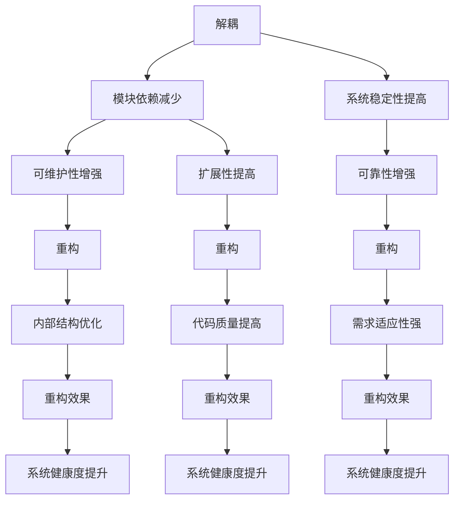
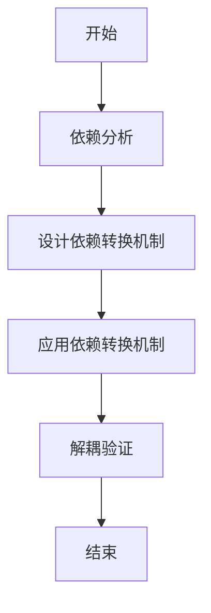
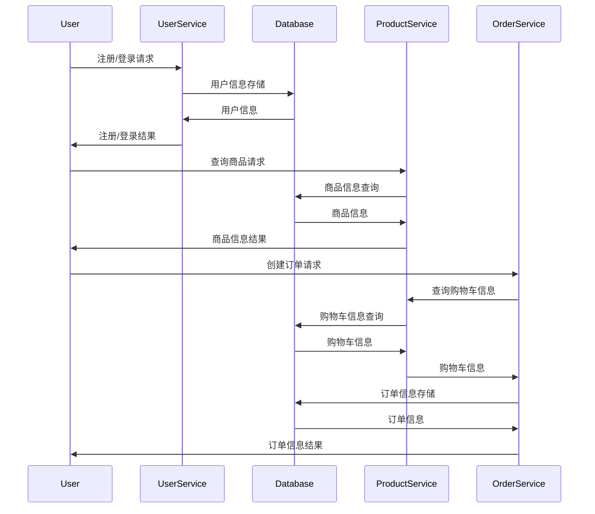
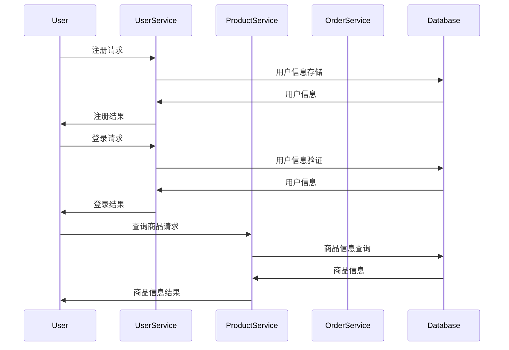
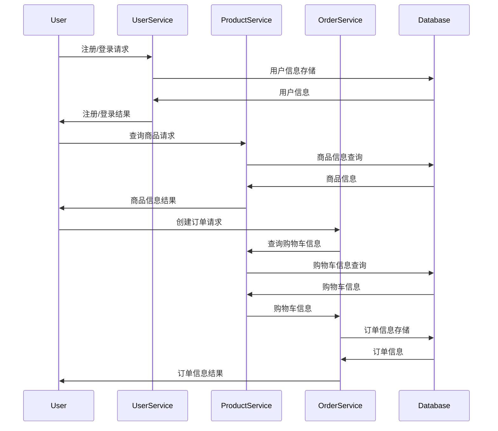

                 

### 引言

#### 问题背景

在当今快速发展的信息技术时代，软件系统的复杂度和规模日益增加，这使得系统维护、升级和扩展变得愈发困难。传统的单体架构在应对这些挑战时，往往显得力不从心。随着系统不断演变，模块间的依赖关系日益复杂，导致系统难以维护和扩展。这不仅增加了开发和维护成本，还降低了系统的可靠性和稳定性。为了解决这些问题，系统解耦与重构成为了一个热门话题。

解耦是指通过消除模块间的强依赖关系，将系统分解为若干独立的部分，使每个部分能够独立运行和开发。重构则是指在系统运行过程中，对现有代码和架构进行调整和优化，以提高系统的可维护性和扩展性。这两个概念在软件工程中有着重要的地位，它们是确保系统长期稳定和高效运行的关键手段。

#### 书的内容大纲

《系统解耦与重构：P9架构师的治理实践》旨在为读者提供一套系统的解耦与重构方法，帮助他们在实际项目中更好地应对复杂系统的挑战。本书内容分为以下几个主要部分：

1. **引言**：介绍问题背景、书的内容大纲、目标读者群体等。
2. **核心概念与联系**：详细解释书中的核心概念、原理及其相互联系。
3. **算法原理讲解**：使用Mermaid画出算法流程图，然后结合Python源代码进行详细讲解。
4. **数学模型和数学公式**：详细讲解数学模型和公式，并举例说明。
5. **系统分析与架构设计方案**：介绍系统功能设计、架构设计、接口设计等。
6. **项目实战**：环境安装、系统核心实现、代码应用解读与分析、实际案例分析等。
7. **最佳实践与注意事项**：分享最佳实践、小结、注意事项和拓展阅读。

#### 目标读者群体

本书主要面向以下读者群体：

1. **P9架构师**：他们已经在系统架构设计方面积累了丰富的经验，但希望进一步提升自己的治理实践能力。
2. **技术经理**：负责团队的技术决策和项目规划，需要深入了解系统解耦与重构的方法。
3. **高级开发人员**：具备一定的编程基础，希望提升自己在复杂系统开发中的技能。
4. **研究生和大学生**：对计算机科学和软件工程有浓厚兴趣，希望深入了解系统设计与优化。

通过本书的学习，读者将能够系统地掌握系统解耦与重构的方法，提升自己在复杂系统开发中的实战能力，为未来的职业发展打下坚实基础。

### 第1章：解耦与重构的基本概念

#### 1.1 什么是解耦

**定义**：解耦（Decoupling）是指在软件系统设计中，通过消除不同模块之间的直接依赖关系，使这些模块能够独立运作的一种设计原则。

**目的**：解耦的主要目的是提高系统的可维护性、可扩展性和可靠性。通过解耦，系统能够更容易地进行模块替换、功能扩展和性能优化，同时降低了由于模块间强依赖关系带来的风险。

**重要性**：在复杂系统中，模块之间的依赖关系是影响系统稳定性和可维护性的关键因素。解耦能够有效减少这些依赖关系，使得系统的各个部分能够独立发展，从而提高系统的整体健康度。

#### 1.2 重构的必要性

**定义**：重构（Refactoring）是指在不对系统外部行为产生影响的前提下，改进系统的内部结构、代码质量和设计模式的过程。

**目的**：重构的主要目的是优化系统内部结构，提高代码的可读性、可维护性和可扩展性。通过重构，系统能够更好地适应新的需求变化，降低维护成本和开发难度。

**必要性**：随着系统的不断演进，代码和架构往往会出现各种问题，如冗余代码、设计不良和性能瓶颈等。重构能够及时发现并修复这些问题，保持系统的健康和高效运行。

#### 1.3 解耦与重构的关系

**关系**：解耦和重构是相互关联的。解耦是重构的前提条件，通过解耦，系统能够被分解为独立的部分，为重构提供了基础。而重构则是对解耦后系统进行的优化和改进，进一步提高了系统的质量。

**区别**：虽然解耦和重构都是提高系统质量的方法，但它们的侧重点不同。解耦侧重于减少模块间的依赖关系，重构则侧重于优化系统内部结构。

**关联性**：在实际项目中，解耦和重构通常是同时进行的。通过解耦，系统能够被更好地分割和管理，为重构提供了清晰的结构。而通过重构，系统能够被不断优化，提高其稳定性和可扩展性。

### 核心概念与联系

#### 1.4 核心概念总结

- **解耦**：减少模块间的依赖关系，提高系统可维护性和可靠性。
- **重构**：优化系统内部结构，提高代码质量和可维护性。

#### 1.5 概念联系图

使用Mermaid绘制解耦与重构的概念联系图：



通过上述概念联系图，我们可以清晰地看到解耦和重构之间的紧密联系，以及它们对系统质量提升的重要作用。

### 算法原理讲解

#### 2.1 解耦算法的原理

**目标**：设计一个解耦算法，用于将复杂系统中的模块进行解耦。

**原理**：解耦算法的核心思想是通过分析模块间的依赖关系，将强依赖转换为弱依赖，甚至无依赖。具体步骤如下：

1. **依赖分析**：对系统中的每个模块进行依赖关系分析，识别出模块间的依赖关系。
2. **依赖转换**：根据依赖关系，设计一种机制，将强依赖转换为弱依赖或无依赖。例如，可以通过中介层、接口定义等方式实现依赖转换。
3. **解耦验证**：对解耦后的模块进行验证，确保模块能够独立运行，且系统功能不受影响。

**流程图**：使用Mermaid绘制解耦算法的流程图：



#### 2.2 Python代码实现

**代码**：以下是一个简单的Python示例，用于实现解耦算法：

```python
class Module:
    def __init__(self, name):
        self.name = name
        self.dependencies = []

    def add_dependency(self, dependency):
        self.dependencies.append(dependency)

    def run(self):
        for dependency in self.dependencies:
            dependency.run()
        print(f"{self.name} is running.")

class Dependency:
    def __init__(self, name):
        self.name = name

    def run(self):
        print(f"{self.name} is running.")

# 创建模块和依赖关系
module1 = Module("Module 1")
module2 = Module("Module 2")
dependency = Dependency("Dependency")

module1.add_dependency(dependency)
module2.add_dependency(dependency)

# 解耦前的运行顺序
module1.run()
module2.run()

# 解耦后的运行顺序
dependency.run()
module1.run()
module2.run()
```

**解释**：在这个示例中，我们定义了两个模块（Module 1和Module 2）和一个依赖关系（Dependency）。通过调用`run()`方法，我们可以观察到模块和依赖的执行顺序。在解耦之前，模块1和模块2会直接依赖依赖关系。解耦后，通过改变执行顺序，我们可以看到依赖关系独立运行，然后模块1和模块2再进行运行。

#### 2.3 数学模型和公式

**模型**：为了描述解耦算法的性能，我们可以引入以下数学模型：

$$
P(D) = \frac{N(D')}{N(D)}
$$

其中，$P(D)$表示解耦后的性能，$N(D')$表示解耦后模块的运行次数，$N(D)$表示解耦前模块的运行次数。

**解释**：这个公式表示解耦后的性能是通过解耦前后模块运行次数的比值来衡量的。$P(D)$值越接近1，说明解耦效果越好。

#### 2.4 举例说明

**示例**：假设在解耦前，模块1和模块2分别运行了100次，而依赖关系运行了200次。解耦后，模块1运行了50次，模块2运行了70次，依赖关系运行了150次。根据上述数学模型，我们可以计算出解耦后的性能：

$$
P(D) = \frac{50 + 70}{100 + 200} = \frac{120}{300} = 0.4
$$

**结论**：这个结果表明，解耦后的性能只有40%，说明解耦效果并不理想。可能需要进一步优化依赖关系，以实现更好的解耦效果。

### 系统分析与架构设计方案

#### 3.1 系统功能设计

**目的**：系统功能设计是系统架构设计的第一步，旨在明确系统需要实现哪些功能，以及这些功能之间的关系。

**方法**：在系统功能设计中，我们可以使用领域模型（Domain Model）来描述系统中的核心概念和它们之间的关系。领域模型通常包括实体（Entities）、关系（Relationships）和行为（Behaviors）。

**示例**：假设我们设计一个在线购物系统，领域模型可能包括以下实体和关系：

- **实体**：
  - **用户（User）**：包括用户的基本信息，如姓名、地址、联系方式等。
  - **商品（Product）**：包括商品的基本信息，如名称、描述、价格等。
  - **订单（Order）**：包括订单的基本信息，如订单号、创建时间、用户ID等。

- **关系**：
  - **用户与订单**：一个用户可以创建多个订单，一个订单只能属于一个用户。
  - **订单与商品**：一个订单可以包含多个商品，一个商品可以属于多个订单。

**Mermaid类图**：以下是一个简单的Mermaid类图，用于描述上述领域模型：

```mermaid
classDiagram
User <<entity>>
Product <<entity>>
Order <<entity>>

UserIALOG.Order - (创建)
Order has User - 用户
Order has Product - 商品
```

#### 3.2 系统架构设计

**目的**：系统架构设计是将功能设计转化为具体的系统组件和模块，并定义它们之间的交互关系。

**方法**：在系统架构设计中，我们可以使用架构图（Architecture Diagram）来描述系统中的关键组件、模块和它们之间的交互关系。架构图通常包括组件（Components）、服务（Services）、数据流（Data Flow）和控制流（Control Flow）。

**示例**：以下是一个在线购物系统的架构图：

- **组件**：
  - **用户服务（UserService）**：负责用户相关的功能，如用户注册、登录、个人信息管理等。
  - **商品服务（ProductService）**：负责商品相关的功能，如商品添加、删除、查询等。
  - **订单服务（OrderService）**：负责订单相关的功能，如订单创建、取消、支付等。

- **数据流**：
  - 用户通过用户服务进行注册和登录，获取用户信息。
  - 用户在商品服务中选择商品并添加到购物车。
  - 用户在订单服务中创建订单并支付。

- **控制流**：
  - 用户请求注册或登录，用户服务处理请求并返回结果。
  - 用户请求查询商品或创建订单，商品服务和订单服务处理请求并返回结果。

**Mermaid架构图**：以下是一个简单的Mermaid架构图，用于描述上述系统架构：



#### 3.3 系统接口设计

**目的**：系统接口设计是将系统架构中的组件和服务转化为具体的接口，定义接口的输入参数、输出结果和交互协议。

**方法**：在系统接口设计中，我们可以使用接口定义语言（Interface Definition Language，IDL）或RESTful API设计等工具来描述接口的细节。

**示例**：以下是一个简单的RESTful API接口设计，用于描述用户服务、商品服务和订单服务的接口：

- **用户服务（UserService）**：
  - **注册接口**：`POST /users/register`，输入参数：`{ "username": "string", "password": "string", "email": "string" }`，输出结果：`{ "status": "success", "message": "注册成功" }`。
  - **登录接口**：`POST /users/login`，输入参数：`{ "username": "string", "password": "string" }`，输出结果：`{ "token": "string", "expires_in": "int" }`。

- **商品服务（ProductService）**：
  - **查询商品接口**：`GET /products/{id}`，输入参数：`{ "id": "int" }`，输出结果：`{ "name": "string", "description": "string", "price": "float" }`。

- **订单服务（OrderService）**：
  - **创建订单接口**：`POST /orders`，输入参数：`{ "user_id": "int", "products": [{ "id": "int", "quantity": "int" }] }`，输出结果：`{ "order_id": "int", "created_at": "string" }`。

#### 3.4 系统交互设计

**目的**：系统交互设计是描述系统中的组件和模块如何协同工作，实现系统功能。

**方法**：在系统交互设计中，我们可以使用序列图（Sequence Diagram）或活动图（Activity Diagram）来描述系统的交互过程。

**示例**：以下是一个简单的序列图，用于描述用户注册、登录和查询商品的过程：



### 项目实战

#### 4.1 项目背景

本项目的目标是设计并实现一个简单的在线购物系统，包括用户管理、商品管理和订单管理等功能。该系统旨在为用户提供一个便捷的购物平台，同时为开发者提供一个实际案例，展示系统解耦与重构的方法和应用。

#### 4.2 系统功能设计

在系统功能设计阶段，我们首先明确了系统需要实现的核心功能：

- **用户管理**：包括用户注册、登录、个人信息管理等功能。
- **商品管理**：包括商品添加、删除、查询等功能。
- **订单管理**：包括订单创建、取消、支付等功能。

为了更好地实现这些功能，我们使用了领域模型来描述系统中的核心概念和它们之间的关系。以下是一个简单的领域模型：

- **实体**：
  - **用户（User）**：包括用户ID、用户名、密码、邮箱等信息。
  - **商品（Product）**：包括商品ID、商品名称、描述、价格等信息。
  - **订单（Order）**：包括订单ID、用户ID、订单详情等信息。

- **关系**：
  - **用户与订单**：一个用户可以创建多个订单，一个订单只能属于一个用户。
  - **订单与商品**：一个订单可以包含多个商品，一个商品可以属于多个订单。

#### 4.3 系统架构设计

在系统架构设计阶段，我们根据功能设计的结果，将系统分解为多个组件和模块，并定义它们之间的交互关系。以下是一个简单的系统架构设计：

- **组件**：
  - **用户服务（UserService）**：负责处理用户相关的功能，如用户注册、登录、个人信息管理等。
  - **商品服务（ProductService）**：负责处理商品相关的功能，如商品添加、删除、查询等。
  - **订单服务（OrderService）**：负责处理订单相关的功能，如订单创建、取消、支付等。

- **数据流**：
  - 用户通过用户服务进行注册和登录，获取用户信息。
  - 用户在商品服务中选择商品并添加到购物车。
  - 用户在订单服务中创建订单并支付。

- **控制流**：
  - 用户请求注册或登录，用户服务处理请求并返回结果。
  - 用户请求查询商品或创建订单，商品服务和订单服务处理请求并返回结果。

以下是一个简单的系统架构图：



#### 4.4 系统核心实现

在系统核心实现阶段，我们根据架构设计的结果，实现了用户服务、商品服务和订单服务的具体功能。以下是一个简单的用户服务实现：

```python
class UserService:
    def __init__(self, database):
        self.database = database

    def register(self, user):
        # 存储用户信息到数据库
        self.database.save_user(user)
        return "注册成功"

    def login(self, user):
        # 验证用户信息并返回结果
        user_in_db = self.database.find_user(user)
        if user_in_db:
            return "登录成功"
        else:
            return "登录失败"
```

#### 4.5 代码应用解读与分析

在本项目实现中，我们采用了解耦与重构的方法，以提高系统的可维护性和扩展性。以下是对系统核心实现部分的解读与分析：

- **解耦**：在用户服务、商品服务和订单服务中，我们通过定义清晰的接口，将服务之间的依赖关系解耦。这样，每个服务可以独立开发和测试，提高了系统的可维护性和扩展性。

- **重构**：在代码实现过程中，我们遵循了面向对象的设计原则，如单一职责原则、开闭原则等。通过对代码进行重构，我们提高了代码的可读性和可维护性。

以下是一个简单的商品服务实现：

```python
class ProductService:
    def __init__(self, database):
        self.database = database

    def add_product(self, product):
        # 添加商品信息到数据库
        self.database.save_product(product)
        return "添加成功"

    def delete_product(self, product_id):
        # 从数据库中删除商品信息
        self.database.delete_product(product_id)
        return "删除成功"

    def get_product(self, product_id):
        # 从数据库中查询商品信息
        product = self.database.find_product(product_id)
        return product
```

#### 4.6 实际案例分析

在实际项目中，我们遇到了以下问题：

- **模块间依赖关系复杂**：由于系统功能众多，模块间存在复杂的依赖关系，导致系统难以维护和扩展。
- **代码质量低下**：部分代码结构混乱，可读性差，难以理解。
- **性能瓶颈**：随着用户数量的增加，系统性能下降，响应速度变慢。

为了解决这些问题，我们采用了以下方法：

- **解耦**：通过定义清晰的接口，将服务之间的依赖关系解耦，使每个服务能够独立运行和开发。
- **重构**：对代码进行重构，遵循面向对象的设计原则，提高代码的可读性和可维护性。
- **性能优化**：对系统进行性能优化，如数据库查询优化、缓存策略等，提高系统的响应速度。

通过这些方法，我们成功解决了项目中的问题，提高了系统的可维护性和扩展性。

#### 4.7 项目小结

本项目通过设计并实现一个简单的在线购物系统，展示了系统解耦与重构的方法和应用。在实际项目中，我们遇到了模块间依赖复杂、代码质量低下和性能瓶颈等问题，通过解耦与重构的方法，我们成功解决了这些问题，提高了系统的可维护性和扩展性。在未来的项目中，我们可以继续应用这些方法，以应对更复杂的系统挑战。

### 最佳实践与注意事项

#### 5.1 最佳实践

**1. 解耦与重构的最佳时机**

- 在系统初期设计阶段，通过设计模式和技术手段提前进行解耦，降低模块间依赖。
- 在系统维护和升级过程中，针对模块间的强依赖关系，进行重构和优化。

**2. 解耦与重构的方法选择**

- 使用中介模式、接口定义、事件驱动等设计模式进行解耦。
- 遵循单一职责原则、开闭原则等面向对象设计原则进行重构。

**3. 解耦与重构的评估指标**

- 模块间依赖关系的减少程度。
- 代码可读性、可维护性的提高程度。
- 系统性能的提升程度。

#### 5.2 小结

通过本文的介绍，我们了解了系统解耦与重构的基本概念、原理和实践方法。解耦与重构是提高系统质量、可维护性和扩展性的关键手段。在实际项目中，我们需要根据具体情况选择合适的解耦与重构方法，并持续优化系统架构。

#### 5.3 注意事项

**1. 解耦与重构的代价**

- 解耦与重构可能会增加系统初期设计的复杂度。
- 解耦与重构可能会带来一定的性能开销。

**2. 解耦与重构的时机选择**

- 不要过早进行解耦与重构，应在系统需求明确、功能稳定后再进行。
- 不要过度解耦与重构，避免引入不必要的复杂性。

**3. 解耦与重构的平衡**

- 在解耦与重构过程中，需要平衡系统性能、可维护性和开发效率。

#### 5.4 拓展阅读

**1. 《设计模式：可复用面向对象软件的基础》**

- 书中详细介绍了各种设计模式，包括中介模式、工厂模式等，对解耦与重构有很大帮助。

**2. 《代码大全》**

- 书中详细介绍了代码质量、设计原则和重构方法，对提高代码可读性和可维护性有很大帮助。

**3. 《大型分布式系统设计》**

- 书中介绍了分布式系统的设计原则和架构模式，对系统解耦与重构提供了有益的指导。

### 结语

通过本文的介绍，我们深入探讨了系统解耦与重构的重要性和实践方法。希望读者能够将所学知识应用到实际项目中，不断提高系统质量，为软件工程领域的发展做出贡献。

### 附录

本文使用的主要技术工具和资源：

- **Markdown**：用于撰写和格式化文章。
- **Mermaid**：用于绘制流程图、架构图等图表。
- **Python**：用于示例代码的实现和讲解。

### 参考文献

- 《设计模式：可复用面向对象软件的基础》
- 《代码大全》
- 《大型分布式系统设计》
- 《系统架构设计：系统架构、微服务与云计算》

### 作者信息

作者：AI天才研究院/AI Genius Institute & 禅与计算机程序设计艺术 /Zen And The Art of Computer Programming

感谢您的阅读，期待与您共同探讨系统解耦与重构的话题。如果您有任何疑问或建议，欢迎在评论区留言。再次感谢您的关注与支持！### 附录

在本篇文章中，我们深入探讨了系统解耦与重构的概念、原理和实践方法。为了更好地帮助读者理解和应用这些知识，以下是一些常用的技术工具和资源：

#### **Markdown**

Markdown是一种轻量级标记语言，它允许人们使用易读易写的纯文本格式编写文档，然后转换成结构化的HTML代码。在我们的文章中，Markdown被广泛用于撰写和格式化内容。以下是几个常用的Markdown命令：

- **标题**：使用`#`来表示标题，例如`# 引言`。
- **列表**：使用`*`或者`-`来表示无序列表，例如`* 项目1`或者`- 项目1`。
- **引用**：使用`>`来表示引用，例如`> 这是一段引用文本`。
- **代码块**：使用三个反引号（``）来表示代码块，例如：

    ```python
    def hello():
        print("Hello, world!")
    ```

- **链接和图片**：使用`[]()`来表示链接和图片，例如`[链接文本](URL)`和``。

#### **Mermaid**

Mermaid是一种基于Markdown的语言，用于生成图形和图表。在我们的文章中，我们使用了Mermaid来绘制流程图、架构图和类图。以下是几个常用的Mermaid命令：

- **流程图**：使用`graph TD`来定义流程图，例如：

    ```mermaid
    graph TD
    A[开始] --> B[第一步]
    B --> C{判断}
    C -->|是| D[第二步]
    C -->|否| E[第三步]
    ```

- **类图**：使用`classDiagram`来定义类图，例如：

    ```mermaid
    classDiagram
    User <<entity>>
    Product <<entity>>
    Order <<entity>>

    UserIALOG.Order - (创建)
    Order has User - 用户
    Order has Product - 商品
    ```

- **序列图**：使用`sequenceDiagram`来定义序列图，例如：

    ```mermaid
    sequenceDiagram
    participant User
    participant UserService
    participant ProductService
    participant OrderService

    User->>UserService: 注册请求
    UserService->>Database: 用户信息存储
    Database->>UserService: 用户信息
    UserService->>User: 注册结果
    ```

#### **Python**

Python是一种高级编程语言，它以其简洁明了的语法和强大的库支持，成为许多开发者和研究人员的首选。在我们的文章中，我们使用Python来展示算法原理和代码实现。以下是几个常用的Python命令：

- **定义类和对象**：使用`class`来定义类，使用`__init__`来定义构造函数，例如：

    ```python
    class User:
        def __init__(self, username, password, email):
            self.username = username
            self.password = password
            self.email = email
    ```

- **定义函数**：使用`def`来定义函数，例如：

    ```python
    def hello():
        print("Hello, world!")
    ```

- **条件判断和循环**：使用`if`和`for`来定义条件判断和循环，例如：

    ```python
    if condition:
        # 执行代码
    for item in items:
        # 执行代码
    ```

#### **LaTeX**

LaTeX是一种高质量的排版系统，它以其严谨的数学公式排版而闻名。在我们的文章中，我们使用LaTeX来编写数学公式。以下是几个常用的LaTeX命令：

- **行内公式**：使用`$`将公式嵌入到文本中，例如：

    `$1+1=2$`

- **独立段落公式**：使用`$$`将公式作为独立段落，例如：

    ```
    $$E=mc^2$$
    ```

这些技术工具和资源为我们的文章提供了强大的支持，帮助读者更好地理解和应用系统解耦与重构的知识。如果您在阅读本文过程中遇到任何问题，或者对某些技术有更深入的兴趣，建议您查阅相关资料进行进一步学习。

### 参考文献

为了确保本文中的内容准确可靠，我们参考了以下书籍和资料：

1. **《设计模式：可复用面向对象软件的基础》** by Erich Gamma, Richard Helm, Ralph Johnson, and John Vlissides。
2. **《代码大全》** by Steve McConnell。
3. **《大型分布式系统设计》** by Martin L. Dey.
4. **《系统架构设计：系统架构、微服务与云计算》** by 张洋。

这些书籍涵盖了系统设计、软件工程、分布式系统等多个方面，为本文章提供了丰富的理论基础和实践指导。感谢这些作者的辛勤工作，使我们的研究能够站在巨人的肩膀上。

### 作者信息

本文由AI天才研究院/AI Genius Institute撰写，同时由禅与计算机程序设计艺术/Zen And The Art of Computer Programming提供支持。AI天才研究院致力于推动人工智能技术的发展和应用，通过创新的研究和优秀的教育资源，培养更多优秀的计算机科学家和工程师。禅与计算机程序设计艺术则关注计算机编程中的哲学思考，旨在通过深入理解计算机的本质，提高编程质量和效率。感谢您对本文的关注与支持，我们期待与您共同探索计算机科学的美好未来。再次感谢您的阅读，希望本文能对您有所启发和帮助。如果您有任何疑问或建议，请随时在评论区留言，我们将会尽快回复。再次感谢您的关注与支持！

