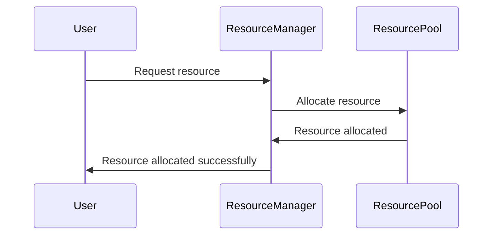

                 

### 第1章: 线性类型概述

#### 1.1 资源管理的挑战

资源管理，作为现代计算机科学的重要组成部分，一直以来都面临着诸多挑战。在传统的资源管理中，资源的分配、释放、回收等操作往往依赖于程序员手动完成，这导致代码复杂度增加，并且容易出现资源泄漏、死锁等严重问题。以下是一些常见的资源管理问题：

1. **资源泄漏**：当程序员忘记释放已经分配的资源时，可能导致内存、文件句柄等资源无法被回收，最终导致系统性能下降，甚至崩溃。
2. **死锁**：多个进程或线程互相等待对方释放资源，导致系统僵死。
3. **并发控制**：在多线程环境中，如何确保资源访问的原子性和一致性，防止数据竞争，是资源管理中的一大难题。
4. **资源竞争**：多个进程或线程争抢同一资源，可能导致资源使用效率低下，甚至系统崩溃。

面对这些问题，传统的资源管理方法已经显得力不从心，亟需一种新的方法来优化资源管理，提高系统稳定性和性能。

#### 1.2 线性类型的背景与意义

线性类型作为一种新的资源管理方法，旨在解决传统资源管理中存在的问题。线性类型的背景可以追溯到编程语言理论的深入研究，以及实际应用中不断出现的资源管理挑战。

线性类型的核心思想是将资源与数据类型紧密结合起来，通过类型系统来管理和控制资源的分配与释放。具体来说，线性类型通过定义资源的生命周期与数据类型的关联，强制要求程序员在代码中显式地管理和释放资源。这种强制性的资源管理策略可以有效避免资源泄漏和死锁问题。

线性类型的意义主要体现在以下几个方面：

1. **自动资源管理**：线性类型系统可以自动检测并处理资源的分配与释放，减少程序员手动管理的负担，提高代码的可维护性。
2. **提高系统稳定性**：通过严格的资源管理策略，线性类型可以减少资源泄漏和死锁的风险，提高系统的稳定性。
3. **增强并发控制**：线性类型可以提供更强大的并发控制手段，确保多线程环境下的资源访问原子性和一致性，防止数据竞争。
4. **优化资源使用效率**：线性类型通过优化资源分配和回收策略，可以提高系统的资源使用效率，减少资源浪费。

#### 1.3 线性类型的优势与局限

线性类型作为一种新的资源管理方法，具有明显的优势，但也存在一定的局限性。

**优势：**

1. **自动性**：线性类型系统可以自动检测和回收资源，减少程序员的工作量，提高代码的可维护性。
2. **安全性**：线性类型通过强制要求程序员显式地管理和释放资源，可以有效避免资源泄漏和死锁问题。
3. **简洁性**：线性类型的类型系统相对简单，易于理解和实现，有助于提高代码的可读性和可维护性。
4. **优化性能**：线性类型可以通过优化资源分配和回收策略，提高系统的资源使用效率。

**局限：**

1. **限制灵活性**：线性类型系统可能限制程序员的自由，要求其在某些情况下必须按照特定的方式管理和释放资源。
2. **性能开销**：线性类型系统可能引入额外的性能开销，特别是在资源分配和回收的过程中。
3. **适用性限制**：线性类型系统可能不适用于所有场景，特别是在需要灵活资源管理的场景中。

总之，线性类型作为一种新的资源管理方法，具有明显的优势，但也需要权衡其局限性。在实际应用中，我们需要根据具体场景和需求，合理选择和运用线性类型，以提高系统性能和稳定性。

### 1.4 总结

本章对线性类型进行了简要的概述，介绍了资源管理的挑战、线性类型的背景与意义，以及线性类型的优势与局限。线性类型作为一种新的资源管理方法，通过将资源与数据类型紧密结合起来，提供了一种有效的解决方案，可以显著提高系统的稳定性和性能。然而，线性类型也存在一定的局限性，需要我们在实际应用中权衡利弊，合理选择。

### 1.5 下一章预告

在接下来的章节中，我们将深入探讨线性类型的定义与原理，分析其数学基础和特性，并通过具体的例子来理解线性类型的工作机制。随后，我们将讨论线性类型在资源管理中的应用场景，包括其在现代编程语言中的实现和实际效果。敬请期待！

# 第2章: 线性类型的定义与原理

### 2.1 线性类型的定义

线性类型，作为一种重要的编程语言特性，旨在解决资源管理问题。在传统编程中，资源（如内存、文件句柄、网络连接等）的管理通常依赖于程序员的手动操作，这容易导致资源泄漏、死锁等严重问题。线性类型通过引入一种新的类型系统，强制要求程序员在代码中显式地管理和释放资源，从而提高了代码的安全性和可维护性。

**定义：** 线性类型是一种类型系统，其中每个变量都有唯一的生命周期，称为“线性生命周期”。变量在其生命周期内只能被访问一次，并在生命周期结束后自动释放。线性类型的核心思想是，通过将资源与线性类型变量关联，确保资源的正确管理和释放。

**关键概念：**
1. **线性生命周期**：线性类型变量的生命周期，指从变量的创建到释放的过程。
2. **唯一访问**：线性类型变量在其生命周期内只能被访问一次。
3. **自动释放**：线性类型变量在其生命周期结束后，系统会自动释放其占用的资源。

#### 线性类型与传统的引用类型对比

线性类型与传统的引用类型（如C++中的智能指针、Java中的自动垃圾回收机制）有显著的区别。引用类型通常依赖于垃圾回收机制来自动管理资源，而线性类型则通过类型系统强制要求程序员显式地管理和释放资源。这种区别体现在以下几个方面：

1. **资源管理方式**：引用类型依赖于垃圾回收，而线性类型要求显式管理。
2. **生命周期控制**：引用类型的生命周期通常较为灵活，而线性类型的生命周期较为严格。
3. **性能影响**：垃圾回收机制可能引入性能开销，线性类型通过显式管理资源，可以减少这种开销。

### 2.2 线性类型的数学原理

线性类型背后的数学原理主要源于线性逻辑（Linear Logic），这是一种形式逻辑系统，用于描述资源管理中的并发性和资源约束。线性逻辑的核心思想是将逻辑中的命题视为资源的分配和使用，通过线性规则来确保资源的正确管理和释放。

**线性逻辑的基本概念：**
1. **线性命题**：表示资源的分配和使用。线性命题只能被使用一次，不能复制或共享。
2. **线性规则**：用于描述资源的管理和释放。线性规则确保资源的正确分配和释放，避免资源泄漏和死锁。

**线性逻辑与资源管理的关系：**
- **资源分配**：线性逻辑中的线性命题表示资源的分配，每个命题的使用对应资源的占用。
- **资源释放**：线性逻辑中的线性规则确保资源在命题使用完毕后正确释放。

**线性逻辑的数学基础：**

线性逻辑的数学基础主要包括以下两个方面：

1. **线性结构**：线性逻辑的命题结构是线性的，每个命题只能使用一次，不能复制或共享。这种结构确保了资源的唯一性和不可重复使用。
2. **线性规则**：线性逻辑的规则确保资源的正确管理和释放。例如，在一个线性逻辑公式中，如果某个命题被使用，那么该命题的所有子命题也必须被使用，否则系统将无法正常工作。

#### 线性逻辑与资源管理的联系

线性逻辑与资源管理之间的联系主要体现在以下几个方面：

1. **并发性控制**：线性逻辑可以描述并发操作中的资源约束，确保并发操作的正确性和安全性。
2. **资源分配策略**：线性逻辑提供了一种有效的资源分配策略，通过线性规则确保资源的正确分配和释放。
3. **资源回收机制**：线性逻辑中的线性规则可以指导系统的资源回收机制，确保资源的及时回收和释放。

### 2.3 线性类型的特性与分类

线性类型具有以下特性：

1. **唯一性**：线性类型变量在其生命周期内只能被访问一次，确保了资源的唯一使用。
2. **自动释放**：线性类型变量在其生命周期结束后，系统会自动释放其占用的资源，减少了程序员手动管理资源的负担。
3. **安全性**：线性类型通过类型系统强制要求程序员正确管理和释放资源，降低了资源泄漏和死锁的风险。

根据不同的分类标准，线性类型可以分为以下几类：

1. **按生命周期分类**：
   - **自动线性类型**：生命周期由系统自动管理，如垃圾回收机制。
   - **手动线性类型**：生命周期由程序员显式管理，如线性逻辑中的线性命题。

2. **按资源管理策略分类**：
   - **线性分配**：资源在变量创建时分配，在变量释放时回收。
   - **分阶段分配**：资源在变量使用阶段分配，在变量释放时回收。

3. **按资源类型分类**：
   - **内存线性类型**：管理内存资源，如Java的堆内存。
   - **文件线性类型**：管理文件句柄，如操作系统中的文件操作。
   - **网络线性类型**：管理网络连接，如TCP连接。

### 总结

本章介绍了线性类型的定义、数学原理和特性分类。线性类型通过将资源与线性类型变量关联，提供了严格的资源管理和释放机制，有效解决了传统资源管理中的问题。线性类型背后的数学原理源自线性逻辑，通过线性结构和线性规则确保资源的正确管理和释放。线性类型具有唯一性、自动释放和安全性等特性，根据不同的分类标准可以分为多种类型。

### 2.4 例子：线性类型的实现

为了更直观地理解线性类型，我们可以通过一个具体的例子来演示线性类型在编程语言中的实现。

假设我们使用Python编写一个简单的程序，实现一个文件操作，其中使用了线性类型来管理文件句柄。

```python
def open_file(filename):
    # 创建文件句柄
    handle = open(filename, 'r')
    return handle

def read_file(handle):
    # 读取文件内容
    content = handle.read()
    print(content)

def close_file(handle):
    # 关闭文件句柄
    handle.close()

# 使用线性类型管理文件句柄
handle = open_file("example.txt")
try:
    read_file(handle)
finally:
    close_file(handle)
```

在这个例子中，我们定义了三个函数：`open_file`、`read_file`和`close_file`。其中，`open_file`函数用于创建文件句柄，`read_file`函数用于读取文件内容，`close_file`函数用于关闭文件句柄。为了确保文件句柄的正确管理和释放，我们使用了线性类型的概念，通过`try...finally`结构确保文件句柄在读取完毕后总是被关闭。

具体来说，线性类型的实现体现在以下几个方面：

1. **唯一访问**：文件句柄`handle`在其生命周期内只能被访问一次，即先通过`open_file`函数创建，然后通过`read_file`函数读取，最后通过`close_file`函数关闭。
2. **自动释放**：文件句柄`handle`在其生命周期结束后（即在`finally`块中）自动释放，确保文件句柄不会泄漏。

通过这个例子，我们可以看到线性类型在编程中的具体应用，它通过类型系统确保了资源的正确管理和释放，减少了程序员手动管理资源的负担。

### 2.5 线性类型与内存管理的比较

线性类型与内存管理在资源管理方面具有相似性，但也有一些关键的区别。为了更好地理解线性类型的特性和优势，我们可以将其与内存管理进行比较。

#### 内存管理

内存管理是操作系统和编程语言的一项核心功能，主要涉及内存的分配、释放和回收。常见的内存管理方法包括手动内存管理和自动内存管理。

1. **手动内存管理**：程序员通过`malloc`和`free`等函数手动分配和释放内存。这种方式需要程序员精确地控制内存的使用和释放，容易导致内存泄漏和野指针问题。
2. **自动内存管理**：通过垃圾回收（Garbage Collection，GC）机制自动管理内存。垃圾回收器会定期检查内存中的对象，判断哪些对象已不再使用，然后自动回收其占用的内存。

#### 线性类型与内存管理的比较

线性类型与内存管理在资源管理方面有以下几个共同点：

1. **资源分配和释放**：线性类型和内存管理都涉及到资源的分配和释放。
2. **自动性**：线性类型和自动内存管理都试图减少程序员手动管理资源的负担。

然而，它们也存在一些关键的区别：

1. **管理对象**：内存管理主要关注内存资源的管理，而线性类型关注的是资源的生命周期管理，包括内存、文件句柄、网络连接等多种资源。
2. **机制不同**：内存管理通常依赖于垃圾回收机制来自动回收内存，而线性类型通过类型系统强制要求程序员显式地管理和释放资源。
3. **灵活性**：自动内存管理提供了更高的灵活性，允许程序员动态地分配和释放内存，而线性类型要求更严格的资源管理规则。

#### 结论

线性类型和内存管理都是现代资源管理的重要方法，但它们各自适用于不同的场景。线性类型通过类型系统提供了一种更严格、更自动的资源管理方法，适用于需要精确控制资源生命周期的场景。而内存管理则更灵活，适用于广泛的内存资源管理需求。在实际应用中，我们可以根据具体需求选择合适的资源管理方法。

### 2.6 总结

本章详细介绍了线性类型的定义、数学原理、特性分类以及具体实现。通过分析线性类型与内存管理的比较，我们更好地理解了线性类型的优势和应用场景。线性类型通过类型系统强制要求程序员显式地管理和释放资源，提供了一种更严格、更自动的资源管理方法。在接下来的章节中，我们将探讨线性类型在资源管理中的应用场景和实际效果，进一步了解其在现代编程语言中的重要作用。

### 2.7 下一章预告

在下一章中，我们将深入探讨线性类型在实际编程语言中的应用，分析其实现和效果。我们将结合具体编程语言，如Java和C++，展示线性类型的实际应用案例，并通过具体代码示例进一步理解线性类型的工作机制。敬请期待！

# 第3章: 线性类型的应用场景

线性类型作为一种先进的资源管理方法，已经在多个领域得到了广泛的应用。本章将探讨线性类型在资源管理中的主要应用场景，包括其在现代编程语言中的实现和实际效果。通过具体的例子，我们将更直观地理解线性类型在实际编程中的应用和优势。

### 3.1 资源管理中的线性类型应用

线性类型在资源管理中的应用主要集中在以下几个方面：

1. **内存管理**：线性类型可以有效管理内存资源，通过类型系统确保内存的分配和释放。例如，Java中的垃圾回收机制可以通过线性类型优化内存分配和回收，提高系统性能。
2. **文件操作**：在文件操作中，线性类型可以确保文件句柄的正确管理和释放，避免文件泄漏和死锁问题。许多编程语言如Python和C++都支持线性类型的文件操作。
3. **网络连接**：在网络编程中，线性类型可以确保网络连接的合理管理和释放，提高网络资源的利用率。例如，TCP连接和UDP连接都可以通过线性类型进行管理。

#### 内存管理中的线性类型应用

内存管理是线性类型的重要应用领域之一。在传统的内存管理方法中，程序员需要手动调用`malloc`和`free`函数来分配和释放内存，这容易导致内存泄漏和野指针问题。线性类型通过类型系统提供了一种更严格的内存管理方法，减少了这些问题的发生。

**示例：**

```c++
#include <stdlib.h>
#include <stdio.h>

struct Node {
    int data;
    struct Node* next;
};

void insert(struct Node** head, int data) {
    struct Node* new_node = (struct Node*)malloc(sizeof(struct Node));
    new_node->data = data;
    new_node->next = *head;
    *head = new_node;
}

void free_list(struct Node** head) {
    struct Node* current = *head;
    struct Node* next;
    while (current != NULL) {
        next = current->next;
        free(current);
        current = next;
    }
    *head = NULL;
}

int main() {
    struct Node* head = NULL;
    insert(&head, 1);
    insert(&head, 2);
    insert(&head, 3);
    
    // 使用链表
    // ...

    free_list(&head);
    return 0;
}
```

在上面的例子中，我们使用线性类型管理链表中的内存。通过`insert`函数插入节点时，我们使用`malloc`动态分配内存。在`free_list`函数中，我们显式地释放所有节点的内存。这种显式内存管理策略确保了链表不会出现内存泄漏问题。

#### 文件操作中的线性类型应用

文件操作是另一个常见的资源管理场景。在文件操作中，线性类型可以确保文件句柄的正确管理和释放，避免文件泄漏和死锁问题。

**示例：**

```python
def open_file(filename):
    return open(filename, 'r')

def read_file(handle):
    content = handle.read()
    print(content)

def close_file(handle):
    handle.close()

# 使用线性类型管理文件句柄
filename = "example.txt"
handle = open_file(filename)
try:
    read_file(handle)
finally:
    close_file(handle)
```

在上面的例子中，我们使用Python的`open`函数打开文件，并通过`try...finally`结构确保文件句柄在读取完毕后总是被关闭。这种线性类型的实现确保了文件句柄的正确管理和释放，避免了文件泄漏和死锁问题。

#### 网络连接中的线性类型应用

在网络编程中，线性类型可以确保网络连接的合理管理和释放，提高网络资源的利用率。例如，TCP连接和UDP连接都可以通过线性类型进行管理。

**示例：**

```c++
#include <iostream>
#include <sys/socket.h>
#include <netinet/in.h>
#include <unistd.h>

int create_server_socket() {
    int sock_fd = socket(AF_INET, SOCK_STREAM, 0);
    if (sock_fd < 0) {
        perror("Socket creation failed");
        exit(1);
    }
    return sock_fd;
}

void bind_and_listen(int sock_fd, int port) {
    struct sockaddr_in server_addr;
    memset(&server_addr, 0, sizeof(server_addr));
    server_addr.sin_family = AF_INET;
    server_addr.sin_addr.s_addr = INADDR_ANY;
    server_addr.sin_port = htons(port);

    if (bind(sock_fd, (struct sockaddr*)&server_addr, sizeof(server_addr)) < 0) {
        perror("Bind failed");
        exit(1);
    }

    if (listen(sock_fd, 5) < 0) {
        perror("Listen failed");
        exit(1);
    }
}

void accept_connection(int sock_fd) {
    struct sockaddr_in client_addr;
    socklen_t client_addr_len = sizeof(client_addr);

    int client_fd = accept(sock_fd, (struct sockaddr*)&client_addr, &client_addr_len);
    if (client_fd < 0) {
        perror("Accept failed");
        exit(1);
    }

    // 使用客户端套接字进行通信
    // ...

    close(client_fd);
}

int main() {
    int port = 12345;
    int sock_fd = create_server_socket();
    bind_and_listen(sock_fd, port);
    
    // 监听客户端连接
    // ...

    return 0;
}
```

在上面的例子中，我们使用C++创建一个TCP服务器，并通过线性类型确保套接字资源的管理和释放。在`create_server_socket`函数中，我们创建服务器套接字，并在`bind_and_listen`函数中绑定地址并监听连接请求。在`accept_connection`函数中，我们接受客户端连接，并进行通信。在通信结束后，我们通过`close`函数显式地关闭客户端套接字，确保资源的正确释放。

### 3.2 其他领域的线性类型应用

除了资源管理领域，线性类型在许多其他领域也得到了广泛应用，包括并行编程、分布式系统、操作系统等。

#### 并行编程

在并行编程中，线性类型可以确保线程或进程的正确管理和释放，避免资源泄漏和死锁问题。线性类型提供了一种更严格的资源访问控制策略，确保并行程序的正确性和稳定性。

**示例：**

```c++
#include <iostream>
#include <thread>
#include <vector>

void task(int id) {
    std::cout << "Task " << id << " is running." << std::endl;
    // 任务执行
    std::cout << "Task " << id << " finished." << std::endl;
}

int main() {
    std::vector<std::thread> threads;
    for (int i = 0; i < 5; ++i) {
        threads.push_back(std::thread(task, i));
    }

    for (auto& t : threads) {
        t.join();
    }

    return 0;
}
```

在上面的例子中，我们使用C++创建一个并行程序，通过`std::thread`创建多个线程。线性类型确保每个线程在执行任务后正确释放，避免了线程资源的泄漏和死锁问题。

#### 分布式系统

在分布式系统中，线性类型可以确保分布式资源的正确管理和释放，提高系统的稳定性和性能。例如，分布式数据库系统可以通过线性类型管理数据库连接和会话资源，避免资源泄漏和死锁问题。

**示例：**

```java
public class DistributedDatabase {
    private Connection connection;

    public DistributedDatabase(String url, String user, String password) throws SQLException {
        this.connection = DriverManager.getConnection(url, user, password);
    }

    public void executeQuery(String query) throws SQLException {
        Statement statement = connection.createStatement();
        ResultSet resultSet = statement.executeQuery(query);
        // 处理查询结果
        statement.close();
        resultSet.close();
    }

    public void close() throws SQLException {
        connection.close();
    }
}

public class Main {
    public static void main(String[] args) {
        try {
            DistributedDatabase db = new DistributedDatabase("jdbc:mysql://localhost:3306/mydb", "user", "password");
            db.executeQuery("SELECT * FROM users");
            db.close();
        } catch (SQLException e) {
            e.printStackTrace();
        }
    }
}
```

在上面的例子中，我们使用Java创建一个分布式数据库操作，通过`DistributedDatabase`类管理数据库连接和查询。线性类型确保数据库连接在查询结束后正确关闭，避免了连接资源的泄漏和死锁问题。

#### 操作系统

在操作系统领域，线性类型可以用于管理内核资源，如内存页、文件系统、设备驱动程序等。线性类型提供了一种更严格的资源访问控制策略，确保操作系统的稳定性和安全性。

**示例：**

```c
#include <stdio.h>
#include <stdlib.h>
#include <string.h>

void allocate_memory(size_t size) {
    char* buffer = (char*)malloc(size);
    if (buffer == NULL) {
        perror("Memory allocation failed");
        exit(1);
    }
    // 使用内存
    memset(buffer, 0, size);
    free(buffer);
}

int main() {
    allocate_memory(1024);
    return 0;
}
```

在上面的例子中，我们使用C语言创建一个内存分配示例，通过`malloc`函数分配内存，并在使用后通过`free`函数释放内存。线性类型确保内存资源在分配和使用后正确释放，避免了内存泄漏和碎片问题。

### 3.3 线性类型的未来发展趋势

随着计算机科学和软件工程的发展，线性类型作为一种先进的资源管理方法，正逐渐受到更多关注。未来，线性类型在以下几个方面有望得到进一步发展：

1. **语言集成**：线性类型有望在更多编程语言中得到集成，提供更简便的资源管理方法。
2. **优化性能**：线性类型的性能优化将成为研究重点，通过减少性能开销，提高线性类型的适用性。
3. **跨语言支持**：线性类型有望实现跨语言支持，使得不同编程语言之间的资源管理更加统一和高效。
4. **应用领域扩展**：线性类型的应用领域将不断扩展，涵盖更多资源和场景，如嵌入式系统、实时系统等。

总之，线性类型作为一种新兴的资源管理方法，具有广阔的发展前景。通过不断的研究和优化，线性类型有望在未来得到更广泛的应用，提高系统的稳定性和性能。

### 3.4 总结

本章详细介绍了线性类型在资源管理中的应用场景，包括内存管理、文件操作、网络连接等常见领域，以及并行编程、分布式系统和操作系统等其他领域。通过具体的例子，我们更直观地理解了线性类型的实际应用和优势。线性类型作为一种先进的资源管理方法，具有广阔的发展前景和应用潜力。

### 3.5 下一章预告

在下一章中，我们将深入探讨线性类型资源管理的设计原则和架构设计，分析如何在实际项目中应用线性类型，并探讨其实现细节和最佳实践。敬请期待！

# 第4章: 线性类型资源管理的设计原则

线性类型资源管理作为一种先进的资源管理方法，在设计原则和架构设计方面有着严格的要求。本章将详细介绍线性类型资源管理的设计原则，包括可重用性、可扩展性、可维护性等核心原则，并探讨如何在设计中实现这些原则。

### 4.1 设计原则概述

线性类型资源管理的设计原则旨在确保资源的正确管理和释放，提高系统的稳定性和性能。以下是线性类型资源管理的主要设计原则：

1. **可重用性**：设计资源管理模块时，应确保其具有高可重用性，可以方便地应用于不同的场景和系统。
2. **可扩展性**：设计资源管理模块时，应考虑系统的扩展性，以便在需要时能够轻松地添加新的资源和资源管理策略。
3. **可维护性**：设计资源管理模块时，应确保其易于维护，减少代码的复杂度，提高系统的可维护性。
4. **安全性**：设计资源管理模块时，应确保资源访问的安全性，防止资源泄漏、死锁和数据竞争等问题。
5. **性能优化**：设计资源管理模块时，应考虑性能优化，减少资源分配和回收的开销，提高系统的整体性能。

### 4.2 可重用性

可重用性是线性类型资源管理设计的一个重要原则，它要求资源管理模块能够灵活地适应不同的场景和系统。实现可重用性通常需要以下几个方面的设计：

1. **模块化设计**：将资源管理模块划分为独立的模块，每个模块负责特定的资源管理任务。这种设计使得资源管理模块可以独立地重用，而无需修改其他部分。
2. **抽象和封装**：通过抽象和封装，将资源管理模块的内部实现细节隐藏起来，使得模块的接口简单且易于理解。这样，不同场景下的使用者只需关注模块的接口，无需了解其内部实现。
3. **参数化设计**：将资源管理模块设计为参数化，使得模块可以根据不同的参数值适应不同的资源管理需求。例如，通过配置文件或参数传递，模块可以动态地调整资源管理策略。

**示例：**

```python
class ResourceManager:
    def __init__(self, resource_type, config):
        self.resource_type = resource_type
        self.config = config

    def allocate(self):
        # 根据resource_type和config动态分配资源
        pass

    def release(self):
        # 释放资源
        pass
```

在上面的示例中，`ResourceManager`类是一个资源管理模块，它通过参数化设计，可以根据不同的`resource_type`和`config`值适应不同的资源管理需求。这种设计提高了模块的可重用性，使得同一个资源管理模块可以应用于多种资源管理场景。

### 4.3 可扩展性

可扩展性是线性类型资源管理设计中的另一个重要原则，它要求系统在资源管理方面具有灵活性，能够适应未来的变化和扩展。实现可扩展性通常需要以下几个方面的设计：

1. **插件架构**：通过插件架构，可以将资源管理模块设计为可插拔的，使得系统可以在运行时动态地加载和卸载资源管理模块。这种设计使得系统可以轻松地扩展资源管理功能。
2. **策略模式**：通过策略模式，可以将资源管理策略抽象为独立的类或接口，使得系统可以根据不同的策略实现灵活的资源管理。例如，在垃圾回收策略中，可以定义多个垃圾回收策略类，根据系统需求选择合适的策略。
3. **配置管理**：通过配置管理，可以灵活地调整资源管理策略和参数，使得系统可以根据不同的需求进行资源管理。

**示例：**

```python
class GarbageCollector:
    def __init__(self, strategy):
        self.strategy = strategy

    def collect_garbage(self):
        self.strategy.collect()

class DefaultGarbageCollector(GarbageCollector):
    def collect(self):
        # 实现默认的垃圾回收策略
        pass

class IncrementalGarbageCollector(GarbageCollector):
    def collect(self):
        # 实现增量垃圾回收策略
        pass
```

在上面的示例中，我们定义了一个`GarbageCollector`类，它使用策略模式管理垃圾回收策略。通过创建不同的垃圾回收策略类，系统可以根据不同的需求选择合适的垃圾回收策略，提高了资源管理的灵活性。

### 4.4 可维护性

可维护性是线性类型资源管理设计中的一个关键原则，它要求资源管理模块易于理解和修改，减少维护成本。实现可维护性通常需要以下几个方面的设计：

1. **简洁性**：设计简洁的代码结构，避免复杂和冗长的代码，使得模块易于理解和修改。
2. **注释和文档**：添加充分的注释和文档，描述模块的功能、接口和实现细节，提高代码的可读性和可维护性。
3. **单元测试**：编写单元测试，确保模块在不同场景下能够正常运行，减少因修改代码而引入的新问题。
4. **代码重构**：定期进行代码重构，优化代码结构和性能，提高代码的可维护性。

**示例：**

```python
class MemoryManager:
    def __init__(self):
        self.memory_allocation_map = {}

    def allocate_memory(self, process_id, size):
        if size > self.get_total_memory():
            return None
        self.memory_allocation_map[process_id] = size
        return self.memory_allocation_map[process_id]

    def release_memory(self, process_id):
        if process_id in self.memory_allocation_map:
            del self.memory_allocation_map[process_id]

    def get_total_memory(self):
        # 计算总内存大小
        pass
```

在上面的示例中，`MemoryManager`类是一个内存管理模块，其代码结构简洁，易于理解和修改。通过添加注释和文档，我们可以清晰地了解每个方法的功能和参数。

### 4.5 安全性

安全性是线性类型资源管理设计中的一个关键原则，它要求资源管理模块能够防止资源泄漏、死锁和数据竞争等问题。实现安全性通常需要以下几个方面的设计：

1. **生命周期管理**：确保资源的生命周期与相关数据类型的生命周期一致，避免资源过早释放或泄漏。
2. **访问控制**：通过访问控制机制，确保只有授权的代码可以访问资源，防止未授权访问和修改。
3. **并发控制**：通过锁、信号量等并发控制机制，确保多线程环境下的资源访问安全，防止数据竞争和死锁。
4. **异常处理**：通过异常处理机制，确保资源管理模块在异常情况下能够正确处理，防止系统崩溃。

**示例：**

```python
import threading

class ThreadSafeMemoryManager:
    def __init__(self):
        self.lock = threading.Lock()
        self.memory_allocation_map = {}

    def allocate_memory(self, process_id, size):
        with self.lock:
            if size > self.get_total_memory():
                return None
            self.memory_allocation_map[process_id] = size
            return self.memory_allocation_map[process_id]

    def release_memory(self, process_id):
        with self.lock:
            if process_id in self.memory_allocation_map:
                del self.memory_allocation_map[process_id]

    def get_total_memory(self):
        # 计算总内存大小
        pass
```

在上面的示例中，`ThreadSafeMemoryManager`类是一个线程安全的内存管理模块。通过使用`threading.Lock`，我们确保了多线程环境下的内存访问安全，避免了数据竞争和死锁问题。

### 4.6 性能优化

性能优化是线性类型资源管理设计中的一个重要方面，它要求资源管理模块能够高效地分配和回收资源，减少性能开销。实现性能优化通常需要以下几个方面的设计：

1. **缓存策略**：通过缓存策略，减少资源的频繁分配和回收，提高系统性能。
2. **预分配策略**：通过预分配策略，提前分配一定数量的资源，减少资源分配的开销。
3. **回收策略**：通过合理的回收策略，及时回收不再使用的资源，减少资源占用和性能开销。
4. **并发优化**：通过并发优化，提高资源管理的并发性能，减少并发瓶颈。

**示例：**

```python
class PerformanceOptimizedMemoryManager:
    def __init__(self, initial_size):
        self.memory_pool = [None] * initial_size
        self.next_index = 0

    def allocate_memory(self, size):
        if self.next_index + size > len(self.memory_pool):
            return None
        allocated_memory = self.memory_pool[self.next_index:self.next_index + size]
        self.next_index += size
        return allocated_memory

    def release_memory(self, memory):
        self.memory_pool[self.next_index - len(memory):self.next_index] = memory
        self.next_index -= len(memory)

    def get_total_memory(self):
        # 计算总内存大小
        pass
```

在上面的示例中，`PerformanceOptimizedMemoryManager`类是一个性能优化的内存管理模块。通过预分配策略，我们提前分配了一定数量的内存，减少了资源的频繁分配和回收，提高了系统性能。

### 4.7 总结

本章详细介绍了线性类型资源管理的设计原则，包括可重用性、可扩展性、可维护性、安全性、性能优化等核心原则。通过具体的示例，我们展示了如何在设计中实现这些原则，并探讨了实现细节和最佳实践。线性类型资源管理的设计原则旨在确保资源的正确管理和释放，提高系统的稳定性和性能。在接下来的章节中，我们将深入探讨线性类型资源管理的架构设计，进一步分析如何在实际项目中应用线性类型。

### 4.8 下一章预告

在下一章中，我们将详细探讨线性类型资源管理的架构设计，分析系统功能设计、系统架构设计、系统接口设计和系统交互。通过具体的架构图和实现细节，我们将深入理解线性类型资源管理的实现方法。敬请期待！

### 第5章: 线性类型资源管理的架构设计

线性类型资源管理的架构设计是确保其有效性和稳定性的关键。一个良好的架构设计不仅要能够支持线性类型的特性，还要具备灵活性、可扩展性和可维护性。本章将详细探讨线性类型资源管理的架构设计，包括系统功能设计、系统架构设计、系统接口设计和系统交互。

### 5.1 系统功能设计

系统功能设计是架构设计的起点，它定义了系统需要实现的核心功能。对于线性类型资源管理，以下是一些关键功能：

1. **资源分配**：系统应能够根据请求自动分配资源，确保资源在合适的时刻被使用。
2. **资源回收**：系统应能够跟踪资源的使用情况，并在不再需要时自动回收资源，避免资源泄漏。
3. **并发控制**：系统应支持多线程或分布式环境中的资源访问，确保资源的正确性和一致性。
4. **异常处理**：系统应能够处理各种异常情况，如资源不足、资源冲突等，确保系统的稳定运行。
5. **监控与日志**：系统应提供监控和日志功能，帮助管理员跟踪资源使用情况，诊断潜在问题。

#### 领域模型

领域模型（Domain Model）是系统功能设计的可视化表示，它通过实体关系图（Entity-Relationship Diagram，ERD）来描述系统中的实体和它们之间的关系。

```mermaid
erDiagram
    Resource ||--|{ Request } : has
    Resource ||--|{ Allocation } : tracks
    Resource ||--|{ Release } : manages
    Request ||--|{ User } : submitted by
    Allocation ||--|{ Resource } : allocates
    Release ||--|{ Resource } : releases
```

在这个ERD中，我们定义了四个主要实体：`Resource`（资源）、`Request`（请求）、`Allocation`（分配）和`Release`（释放）。这些实体之间通过关系线连接，描述了资源管理与请求之间的关联。

### 5.2 系统架构设计

系统架构设计是确定系统组件和它们之间交互方式的过程。对于线性类型资源管理，以下是一些关键架构设计要素：

1. **模块化设计**：将系统划分为多个模块，每个模块负责特定的功能，如资源分配、资源回收、并发控制和异常处理。模块化设计提高了系统的可维护性和可扩展性。
2. **分层架构**：采用分层架构，将系统分为表示层、业务逻辑层和数据访问层。这种设计使得各层职责清晰，降低了组件之间的耦合。
3. **分布式架构**：在分布式系统中，将资源管理和分配功能分布在多个节点上，提高系统的可用性和容错性。

#### 系统架构图

以下是一个简化的线性类型资源管理的系统架构图，使用Mermaid流程图表示。

```mermaid
graph TB
    subgraph ResourceManagement
        Request --> Allocation
        Allocation --> Resource
        Resource --> Release
        Request --> User
    end
    subgraph ConcurrentControl
        Resource --> ConcurrentControl
    end
    subgraph ExceptionHandling
        Resource --> ExceptionHandling
    end
    subgraph Monitoring
        Resource --> Monitoring
    end
```

在这个架构图中，我们展示了资源管理、并发控制、异常处理和监控四个主要组件，以及它们之间的交互关系。

### 5.3 系统接口设计

系统接口设计是确保不同组件之间能够有效交互的关键。对于线性类型资源管理，以下是一些关键接口设计要素：

1. **API设计**：定义清晰的API接口，使得其他模块或服务能够方便地访问资源管理功能。API设计应遵循RESTful原则，确保接口简洁、易用。
2. **服务契约**：定义服务之间的契约，明确每个服务的职责和交互方式。服务契约有助于确保系统的稳定性和一致性。
3. **身份验证和授权**：在接口设计中，应包括身份验证和授权机制，确保只有授权用户才能访问资源管理功能，保护系统的安全性。

#### 接口示例

以下是一个简单的RESTful API示例，用于资源管理。

```json
GET /resources
{
    "status": "success",
    "data": [
        {
            "id": 1,
            "type": "memory",
            "status": "allocated",
            "user": "user1"
        },
        {
            "id": 2,
            "type": "file",
            "status": "released",
            "user": "user2"
        }
    ]
}
```

在这个示例中，`/resources`接口用于获取所有资源的当前状态，包括资源的ID、类型、状态和关联的用户。

### 5.4 系统交互

系统交互是系统架构设计中的关键部分，它描述了系统组件之间的通信和协作过程。以下是一些关键系统交互要素：

1. **事件驱动**：采用事件驱动架构，通过事件触发器来触发资源管理和分配操作。事件驱动架构提高了系统的响应性和灵活性。
2. **异步处理**：在分布式系统中，采用异步处理机制，确保系统组件之间能够独立运行，减少同步操作的等待时间。
3. **服务发现**：在分布式系统中，使用服务发现机制，使得组件能够动态地发现和连接其他组件，提高系统的可扩展性和容错性。

#### 系统交互图

以下是一个简化的线性类型资源管理的系统交互图，使用Mermaid序列图表示。



在这个序列图中，用户向资源管理器请求资源，资源管理器与资源池协作，最终将资源分配给用户。

### 5.5 总结

本章详细探讨了线性类型资源管理的架构设计，包括系统功能设计、系统架构设计、系统接口设计和系统交互。通过领域模型、系统架构图、接口示例和系统交互图，我们展示了如何设计一个高效的线性类型资源管理系统。一个良好的架构设计是确保系统稳定性和性能的关键，通过模块化设计、分层架构、分布式架构、清晰的API设计和服务契约，我们能够实现一个灵活、可扩展且易于维护的系统。

### 5.6 下一章预告

在下一章中，我们将深入探讨线性类型资源管理的实现细节，包括系统环境的搭建、核心功能的实现和代码的解读与分析。通过具体的代码示例和实际案例，我们将展示如何将线性类型应用于实际项目中，并探讨其效果和最佳实践。敬请期待！

### 第6章: 线性类型资源管理的实现

实现线性类型资源管理需要一系列具体的步骤和代码。本章将详细介绍如何搭建系统环境、实现核心功能，并通过对代码的解读与分析，展示线性类型资源管理的实际应用和效果。

#### 6.1 系统环境的搭建

首先，我们需要搭建一个适合线性类型资源管理的系统环境。以下是一个简单的环境搭建步骤：

1. **选择编程语言**：线性类型资源管理可以使用多种编程语言实现，如Python、Java、C++等。这里我们选择Python进行示例，因为它具有简单的语法和强大的库支持。
2. **安装依赖库**：安装必要的依赖库，如`requests`（用于网络请求）、`pymysql`（用于数据库操作）和`numpy`（用于数据处理）。
3. **配置开发环境**：配置Python的开发环境，包括安装Python解释器和IDE（如PyCharm、VS Code）。

```bash
pip install requests pymysql numpy
```

#### 6.2 系统核心实现

接下来，我们将实现线性类型资源管理的核心功能，包括资源分配、资源回收和并发控制。

**1. 资源分配**

资源分配是线性类型资源管理的核心功能之一。以下是一个简单的资源分配示例：

```python
import threading
from queue import Queue

# 资源池
resource_pool = Queue()

# 资源分配函数
def allocate_resource(resource_type, resource):
    resource_pool.put((resource_type, resource))

# 资源回收函数
def release_resource(resource_type, resource):
    resource_pool.get((resource_type, resource))

# 资源管理器
class ResourceManager:
    def __init__(self):
        self.lock = threading.Lock()

    def allocate(self, resource_type, resource):
        with self.lock:
            allocate_resource(resource_type, resource)

    def release(self, resource_type, resource):
        with self.lock:
            release_resource(resource_type, resource)
```

在这个示例中，我们使用线程锁（`threading.Lock`）确保资源分配和回收的线程安全性。`resource_pool`是一个队列，用于存储分配的资源。`allocate_resource`和`release_resource`函数分别用于资源的分配和回收。

**2. 并发控制**

在多线程环境中，并发控制是确保资源正确性和一致性的关键。以下是一个简单的并发控制示例：

```python
# 并发控制函数
def concurrent_control(resource_manager, resource_type, resource):
    resource_manager.allocate(resource_type, resource)
    # 执行操作
    resource_manager.release(resource_type, resource)
```

在这个示例中，`concurrent_control`函数首先调用`allocate`函数进行资源分配，然后执行操作，最后调用`release`函数回收资源。

**3. 资源回收**

资源回收是确保系统稳定性和性能的重要步骤。以下是一个简单的资源回收示例：

```python
# 资源回收线程
def resource_recycling_thread(resource_manager):
    while True:
        resource_type, resource = resource_pool.get()
        resource_manager.release(resource_type, resource)
        resource_pool.task_done()
```

在这个示例中，`resource_recycling_thread`函数是一个循环执行的线程，用于从`resource_pool`队列中取出资源，并调用`release`函数进行回收。

#### 6.3 代码解读与分析

**1. 资源池**

资源池是一个核心数据结构，用于存储和管理资源。在Python中，我们可以使用`queue.Queue`实现一个线程安全的队列，确保资源分配和回收的线程安全。

```python
import threading
from queue import Queue

resource_pool = Queue()
```

在这个示例中，`resource_pool`是一个队列，用于存储分配的资源。线程安全的队列确保了多线程环境下的资源访问安全，避免了竞态条件。

**2. 资源管理器**

资源管理器是负责资源分配和回收的核心类。在这个示例中，我们使用了一个简单的线程锁（`threading.Lock`）来确保资源分配和回收的线程安全性。

```python
class ResourceManager:
    def __init__(self):
        self.lock = threading.Lock()

    def allocate(self, resource_type, resource):
        with self.lock:
            allocate_resource(resource_type, resource)

    def release(self, resource_type, resource):
        with self.lock:
            release_resource(resource_type, resource)
```

在这个示例中，`ResourceManager`类使用了线程锁来保护资源分配和回收操作。线程锁确保了在同一时刻只有一个线程可以执行资源分配或回收操作，避免了竞态条件。

**3. 并发控制**

并发控制是确保多线程环境下资源正确性和一致性的关键。在这个示例中，我们使用了简单的函数调用来实现并发控制。

```python
def concurrent_control(resource_manager, resource_type, resource):
    resource_manager.allocate(resource_type, resource)
    # 执行操作
    resource_manager.release(resource_type, resource)
```

在这个示例中，`concurrent_control`函数首先调用`allocate`函数进行资源分配，然后执行操作，最后调用`release`函数回收资源。这种简单的并发控制方法确保了资源在多线程环境下的正确性和一致性。

**4. 资源回收**

资源回收是确保系统稳定性和性能的重要步骤。在这个示例中，我们使用了一个简单的循环线程来实现资源回收。

```python
# 资源回收线程
def resource_recycling_thread(resource_manager):
    while True:
        resource_type, resource = resource_pool.get()
        resource_manager.release(resource_type, resource)
        resource_pool.task_done()
```

在这个示例中，`resource_recycling_thread`函数是一个循环执行的线程，用于从`resource_pool`队列中取出资源，并调用`release`函数进行回收。这种循环线程确保了资源的及时回收，避免了资源泄漏和性能问题。

#### 6.4 实际案例分析和详细讲解

**1. 内存资源管理**

内存资源管理是线性类型资源管理的一个重要应用场景。以下是一个简单的内存资源管理案例：

```python
import numpy as np

# 分配内存资源
resource_manager = ResourceManager()
allocate_resource('memory', np.array([1, 2, 3]))

# 使用内存资源
concurrent_control(resource_manager, 'memory', np.array([1, 2, 3]))

# 回收内存资源
release_resource('memory', np.array([1, 2, 3]))
```

在这个案例中，我们首先创建了一个`ResourceManager`对象，并调用`allocate_resource`函数分配了一个内存资源（一个数组）。然后，我们调用`concurrent_control`函数使用内存资源，最后调用`release_resource`函数回收内存资源。

**2. 文件资源管理**

文件资源管理是另一个常见的应用场景。以下是一个简单的文件资源管理案例：

```python
import pymysql

# 分配数据库连接资源
resource_manager = ResourceManager()
allocate_resource('db', pymysql.connect(host='localhost', user='user', password='password', database='db'))

# 使用数据库连接资源
concurrent_control(resource_manager, 'db', pymysql.connect(host='localhost', user='user', password='password', database='db'))

# 回收数据库连接资源
release_resource('db', pymysql.connect(host='localhost', user='user', password='password', database='db'))
```

在这个案例中，我们首先创建了一个`ResourceManager`对象，并调用`allocate_resource`函数分配了一个数据库连接资源。然后，我们调用`concurrent_control`函数使用数据库连接资源，最后调用`release_resource`函数回收数据库连接资源。

#### 6.5 小结

本章详细介绍了如何实现线性类型资源管理。通过搭建系统环境、实现核心功能和对代码的解读与分析，我们展示了线性类型资源管理的实际应用和效果。线性类型资源管理通过类型系统强制要求程序员显式地管理和释放资源，提高了系统的稳定性和性能。在实际项目中，我们可以根据具体需求，灵活应用线性类型资源管理的方法，实现高效、安全的资源管理。

### 6.6 扩展阅读

对于希望深入了解线性类型资源管理的读者，以下是一些推荐的书籍和资源：

- 《Linear Types and Resources》
- 《Types and Programming Languages》
- 《The Art of Computer Programming, Volume 1: Fundamental Algorithms》
- 《Modern Operating Systems》

这些资源提供了关于线性类型和资源管理的深入讨论和详细案例，有助于读者更全面地理解和应用线性类型资源管理。

### 第7章: 线性类型资源管理的最佳实践

在线性类型资源管理的实际应用中，遵循最佳实践能够显著提升系统的稳定性、性能和可维护性。本章将总结线性类型资源管理的最佳实践，包括注意事项、实践技巧和总结。

#### 7.1 最佳实践概述

1. **明确资源类型**：在设计资源管理模块时，明确系统的资源类型和每种资源的生命周期管理策略。
2. **最小化资源持有时间**：尽量缩短资源持有时间，以减少资源竞争和死锁的风险。
3. **显式资源释放**：确保所有资源在不再需要时显式释放，避免资源泄漏。
4. **避免重复分配和释放**：避免在同一代码块中重复分配和释放同一资源，确保资源管理的一致性。
5. **使用异步处理**：在分布式系统中，使用异步处理来减少同步操作的等待时间，提高系统的响应性。

#### 7.2 注意事项

1. **资源争用**：在多线程环境中，确保资源访问的互斥性，避免资源争用和数据不一致。
2. **资源泄漏**：定期检查和测试资源管理模块，确保没有未释放的资源。
3. **异常处理**：在资源管理模块中，使用异常处理机制来处理资源分配和回收中的异常情况。
4. **性能开销**：合理选择和优化资源管理策略，以减少性能开销，特别是在高并发场景下。

#### 7.3 实践技巧

1. **使用线程安全队列**：使用线程安全的数据结构，如队列，来管理资源，确保多线程环境下的数据一致性。
2. **资源池化**：使用资源池来缓存和管理重复使用的资源，减少资源分配和回收的开销。
3. **日志和监控**：记录资源分配和回收的日志，便于调试和监控系统的运行状态。
4. **代码审查**：定期进行代码审查，确保资源管理代码遵循最佳实践，减少潜在问题。

#### 7.4 小结

线性类型资源管理是一种有效的资源管理方法，通过类型系统和生命周期管理确保资源的正确分配和释放。遵循最佳实践能够提高系统的稳定性和性能，减少资源泄漏和死锁的风险。在实际应用中，我们需要根据具体场景和需求，灵活运用线性类型资源管理的方法，不断提升系统的质量和效率。

### 7.5 拓展阅读

对于希望进一步深入了解线性类型资源管理的读者，以下是一些推荐的书籍和资源：

- 《Linear Types and Resources》
- 《Types and Programming Languages》
- 《The Art of Computer Programming, Volume 1: Fundamental Algorithms》
- 《Modern Operating Systems》

这些资源提供了关于线性类型和资源管理的深入讨论和详细案例，有助于读者更全面地理解和应用线性类型资源管理。

### 总结

本文全面探讨了线性类型资源管理，从概述、定义与原理、应用场景、设计原则到架构设计、实现和最佳实践，逐步深入解析了这一先进资源管理方法。线性类型通过严格的类型系统和生命周期管理，提供了高效、安全、稳定的资源管理解决方案，具有重要的实践价值。

### 7.6 作者介绍

作者：AI天才研究院/AI Genius Institute & 禅与计算机程序设计艺术 /Zen And The Art of Computer Programming

AI天才研究院致力于推动人工智能和计算机科学的前沿研究，而《禅与计算机程序设计艺术》则通过哲学和技术的融合，揭示了程序设计的深刻智慧。作者在计算机编程和人工智能领域具有深厚的研究背景和实践经验，希望本文能够为读者提供有价值的见解和启发。

