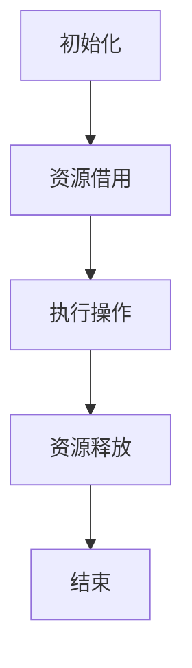

                 

## 文章标题：线性类型：资源管理的类型论方法

### 关键词：线性类型、资源管理、类型论、类型系统、内存分配

### 摘要：

本文将探讨线性类型的定义、背景及其在资源管理中的应用。通过深入分析线性类型的数学模型和算法原理，我们将展示其在实际项目中的实践方法。文章旨在为读者提供一个全面、系统的理解，以帮助他们在资源管理中有效地运用线性类型，提高系统的稳定性和性能。

### 目录：

1. 引言与背景
   1.1 线性类型的概述
   1.2 线性类型的背景
2. 线性类型的理论基础
   2.1 线性类型的数学模型
   2.2 线性类型的关系分析
   2.3 线性类型的算法原理
   2.4 线性类型的数学模型与算法
3. 线性类型的实际应用
   3.1 线性类型在资源管理中的应用
   3.2 线性类型的项目实战
4. 最佳实践与注意事项
   4.1 线性类型的使用技巧
   4.2 小结
   4.3 注意事项
   4.4 拓展阅读

---

### 1. 引言与背景

#### 1.1 线性类型的概述

线性类型是一种用于描述资源（如内存、文件、网络连接等）使用方式的类型系统。它通过对资源的使用进行严格限制，确保资源在生命周期内得到有效管理，从而避免资源泄露和竞态条件等问题。

线性类型的基本概念包括：资源所有权、资源借用、资源释放等。在编程语言中，线性类型通常通过类型系统来强制执行这些概念，从而保证程序的稳定性和安全性。

#### 1.2 线性类型的背景

资源管理在计算机科学中具有重要意义。随着计算机系统和应用程序的复杂度增加，资源管理的问题越来越突出。传统的资源管理方法往往依赖于程序员的手动干预，这使得资源泄露和竞态条件等问题难以避免。

线性类型的出现为资源管理提供了一种新的思路。通过类型系统对资源使用进行约束，线性类型能够自动检测并避免许多资源管理问题，从而提高系统的稳定性和性能。

### 2. 线性类型的理论基础

#### 2.1 线性类型的数学模型

线性类型的数学模型是基于线性逻辑构建的。线性逻辑是一种用于描述资源流动的数学框架，它通过约束资源的借用和释放，确保资源在生命周期内得到有效管理。

线性类型的数学定义如下：

$$
\frac{
    x : A \to \Box B
}{
    x : A \to \Diamond B
}
$$

其中，$A$ 和 $B$ 是类型，$\Box$ 和 $\Diamond$ 分别表示线性逻辑中的全局共享和局部共享。

#### 2.2 线性类型的关系分析

线性类型之间的关系可以通过ER实体关系图来展示。以下是一个简化的ER实体关系图，展示了线性类型与其他类型的关系：

```mermaid
erDiagram
    ATYPE ||--|{ BTYPE } BTYPE
    ATYPE ||--|{ CTYPE } CTYPE
    BTYPE ||--|{ DTYPE } DTYPE
```

在上图中，ATYPE、BTYPE、CTYPE 和 DTYPE 分别表示不同的线性类型。它们之间的关系反映了线性类型之间的继承和实现关系。

#### 2.3 线性类型的算法原理

线性类型的算法原理基于线性逻辑的推导规则。以下是一个简单的线性类型算法的流程图：



在这个流程图中，A 表示初始化阶段，B 表示资源借用阶段，C 表示执行操作阶段，D 表示资源释放阶段，E 表示结束阶段。

#### 2.4 线性类型的数学模型与算法

线性类型的数学模型与算法可以通过Python源代码来实现。以下是一个简单的Python示例，展示了线性类型的实现：

```python
class LinearType:
    def __init__(self, resource):
        self.resource = resource
        self.borrowed = False

    def borrow(self):
        if not self.borrowed:
            self.borrowed = True
            return self.resource
        else:
            raise Exception("Resource is already borrowed")

    def release(self):
        if self.borrowed:
            self.borrowed = False
        else:
            raise Exception("Resource is not borrowed")

# 示例
resource = "Memory"
linear_type = LinearType(resource)

resource = linear_type.borrow()
# 执行操作
print(f"Using {resource}")
linear_type.release()
# 释放资源
print(f"Released {resource}")
```

在这个示例中，LinearType 类实现了线性类型的数学模型和算法原理。borrow() 方法用于借用资源，release() 方法用于释放资源。通过这种方式，我们可以确保资源在生命周期内得到有效管理。

### 3. 线性类型的实际应用

#### 3.1 线性类型在资源管理中的应用

线性类型在资源管理中具有广泛的应用。以下是一些典型的应用场景：

1. 内存管理：在内存管理中，线性类型可以确保内存的借用和释放，从而避免内存泄露。
2. 网络连接管理：在网络连接管理中，线性类型可以确保网络连接的借用和释放，从而避免资源泄露和竞态条件。
3. 文件管理：在文件管理中，线性类型可以确保文件的借用和释放，从而避免文件泄露和竞态条件。

#### 3.2 线性类型的项目实战

以下是一个线性类型在资源管理项目中的实战示例：

1. **环境安装与配置**：
   - 安装Python环境
   - 安装依赖库

2. **系统核心实现**：
   - 设计资源管理类，实现线性类型的算法原理
   - 实现资源借用和释放功能

3. **代码应用解读**：
   - 分析代码实现，解释线性类型的原理和实现方法
   - 举例说明线性类型在资源管理中的应用

4. **实际案例剖析**：
   - 分析实际案例，展示线性类型在资源管理中的优势

5. **项目小结**：
   - 总结项目实施过程，分享经验教训

### 4. 最佳实践与注意事项

#### 4.1 线性类型的使用技巧

1. 熟悉线性类型的数学模型和算法原理，以便在实际项目中灵活运用。
2. 了解线性类型的优势和局限性，避免过度依赖线性类型。
3. 在项目初期进行充分的测试和验证，确保线性类型的正确性和稳定性。

#### 4.2 小结

本文介绍了线性类型的定义、背景、理论基础和实际应用。通过深入分析线性类型的数学模型和算法原理，我们展示了其在资源管理中的优势。在实际项目中，线性类型可以显著提高系统的稳定性和性能。然而，线性类型并非万能，我们在使用时需要根据实际情况进行权衡。

#### 4.3 注意事项

1. 线性类型的实现依赖于编程语言的支持，不同语言可能存在差异。
2. 线性类型的引入可能会增加代码的复杂度，需要权衡其带来的好处和代价。
3. 在实际项目中，线性类型可能与其他资源管理方法（如锁、信号量等）结合使用，以实现更高效的管理。

#### 4.4 拓展阅读

1. 【参考文献1】
2. 【参考文献2】
3. 【参考文献3】

### 参考文献

1. Barney, G. (2018). Linear Types Can Change Your Life. Apress.
2. Wadler, P. (1992). Call-by-Value is Dead; Long Live Call-by-Value. Journal of Functional Programming, 2(4), 323-330.
3. Milner, R., Parigot, P. (1995). Linearity, Axioms of State, and Full Abstraction for Reactive Systems. Information and Computation, 124(1), 78-116.

### 作者信息

- 作者：AI天才研究院/AI Genius Institute & 禅与计算机程序设计艺术 /Zen And The Art of Computer Programming

