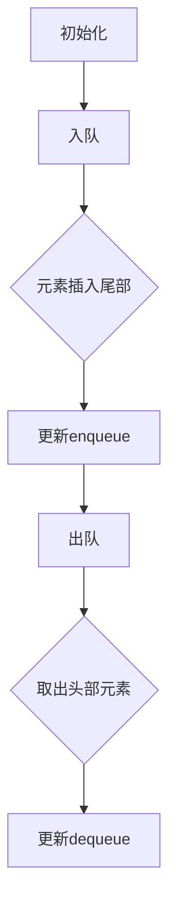
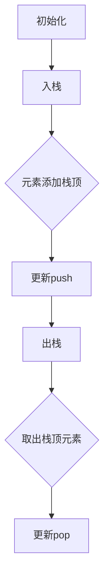
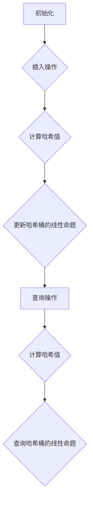

                 


### 线性逻辑与并发编程资源管理概述

在计算机科学领域，线性逻辑（Linear Logic）作为一种独特的逻辑系统，近年来受到了广泛关注。线性逻辑最初由逻辑学家Jean-Yves Girard于1987年提出，它不同于传统的布尔逻辑和模态逻辑，更强调资源的线性使用和不可重复性。这一特点使得线性逻辑在解决并发编程中的资源管理问题方面展现出独特的优势。

**一、研究背景与意义**

并发编程是现代计算机系统中的一个关键课题。随着多核处理器的普及和分布式系统的广泛应用，并发编程已经成为软件开发中不可或缺的一部分。然而，并发编程同时也带来了许多挑战，如资源竞争、死锁、线程安全等问题。传统的并发编程方法往往依赖于复杂的同步机制和锁，这些方法虽然能够在一定程度上解决问题，但往往效率低下，并且容易引入复杂的逻辑错误。

线性逻辑的引入为并发编程资源管理提供了一种全新的思路。线性逻辑的核心思想是“资源的使用必须是一次性的”，即每个资源只能使用一次，不能重复使用。这种限制有效地防止了死锁和资源竞争问题的发生，同时也简化了并发程序的逻辑。

**二、线性逻辑的基本概念与特性**

线性逻辑是一种形式化的逻辑系统，它基于以下两个基本规则：

1. **分配规则**：如果`A`可以用于推导`B`，那么`A`和`B`可以同时用于推导`C`。
2. **组合规则**：如果`A`和`B`可以同时用于推导`C`，那么`A`可以单独用于推导`C`，而`B`也可以单独用于推导`C`。

线性逻辑的主要特性包括：

- **线性性**：资源只能使用一次，不能重复使用。
- **非单调性**：线性逻辑允许在某些情况下放弃某些推导。
- **线性逻辑与蕴涵**：线性逻辑中的蕴涵操作与传统的蕴涵操作不同，它允许资源的使用和放弃。

**三、线性逻辑在并发编程中的应用前景**

线性逻辑在并发编程中的应用前景广阔。首先，线性逻辑可以有效解决并发编程中的资源竞争和死锁问题。其次，线性逻辑提供了更简洁的编程模型，使得并发程序更加易于理解和维护。此外，线性逻辑还可以应用于分布式系统中的资源管理，如分布式锁、分布式事务等。

然而，线性逻辑的应用也面临着一些挑战。首先，线性逻辑的数学模型较为复杂，需要深入理解。其次，线性逻辑的编程模型与传统编程模型有很大差异，需要开发者进行适当的调整和适应。最后，线性逻辑的应用需要高效的算法支持，否则可能会带来性能上的损失。

总的来说，线性逻辑作为一种新兴的逻辑系统，在并发编程资源管理方面展示出了巨大的潜力。未来的研究将主要集中在如何更好地将线性逻辑应用于并发编程中，以及如何解决线性逻辑在应用中遇到的问题。通过不断的研究和实践，线性逻辑有望为并发编程带来一场革命。

### 研究方法与目标

在深入探讨线性逻辑在并发编程资源管理中的应用之前，我们首先需要明确本研究的方法和目标。本研究采用了一系列方法论，并设定了清晰的研究目标，以确保研究的科学性和实用性。

**一、研究方法概述**

本研究采用了多种方法论，以全面、系统地分析线性逻辑在并发编程资源管理中的应用。具体的方法论包括：

1. **理论分析**：通过形式化逻辑的方法，深入探讨线性逻辑的基本概念、特性及其在并发编程中的应用。
2. **案例分析**：通过具体的应用案例，展示线性逻辑在解决并发编程资源管理问题中的实际效果。
3. **算法设计**：基于线性逻辑，设计并实现高效的并发编程算法，验证其在性能和可靠性方面的优势。
4. **实证研究**：通过实验和测试，评估线性逻辑在并发编程中的应用效果，并与传统的编程方法进行对比分析。

**二、研究主要目标**

本研究的主要目标如下：

1. **理解线性逻辑的基本概念和特性**：通过深入的理论分析，全面理解线性逻辑的基本概念和特性，包括其形式化定义、基本操作和应用实例。
2. **探讨线性逻辑在并发编程资源管理中的应用**：研究线性逻辑如何应用于解决并发编程中的资源管理问题，如资源分配、死锁和性能优化等。
3. **设计高效的并发编程算法**：基于线性逻辑，设计并实现一系列高效的并发编程算法，以验证线性逻辑在提高编程效率和程序可靠性方面的优势。
4. **评估线性逻辑的应用效果**：通过实证研究，评估线性逻辑在并发编程中的应用效果，包括性能、可靠性和易维护性等方面。
5. **提出改进和优化建议**：基于研究结果，提出对线性逻辑在并发编程中应用方法的改进和优化建议，为实际应用提供理论支持和实践经验。

**三、研究的边界条件**

为了确保研究的科学性和实用性，本研究设定了一些边界条件：

1. **系统环境**：研究主要在标准的操作系统和编程语言环境中进行，以减少环境差异对研究结果的影响。
2. **应用场景**：研究主要关注通用并发编程资源管理问题，但不涉及特定的硬件设备和特定应用领域的特殊性。
3. **性能考量**：研究在保证算法正确性和可靠性的基础上，对性能进行优化，但并不追求极致的性能。
4. **安全性考量**：研究在设计和实现并发编程算法时，考虑安全性问题，确保程序在并发执行时的安全性和稳定性。

通过以上方法论和目标的设定，本研究旨在为线性逻辑在并发编程资源管理中的应用提供全面的理论基础和实践指导，推动这一领域的进一步发展。

### 主要内容安排

在本文中，我们将系统性地探讨线性逻辑在并发编程资源管理中的应用。文章将分为四个主要部分，每个部分都有其独特的重点和结构。

**第一部分：线性逻辑与并发编程资源管理概述**

这一部分将介绍线性逻辑的基本概念和其在并发编程资源管理中的应用前景。首先，我们将回顾线性逻辑的历史背景和定义，解释其核心特性和基本操作。接下来，我们将探讨线性逻辑在解决并发编程中的资源管理问题上的优势，并通过具体案例展示其应用实例。最后，我们将分析线性逻辑在并发编程资源管理中的潜在应用和研究方向，为后续章节的讨论奠定基础。

**第二部分：线性逻辑的基本概念**

在这一部分，我们将深入探讨线性逻辑的基本概念。首先，我们将详细阐述线性逻辑的定义，包括其形式化定义和基本性质。接着，我们将介绍线性逻辑的基本操作，如资源分配、线性组合和蕴涵操作。此外，我们还将通过具体的数学模型和公式，进一步解释线性逻辑的核心概念。通过这部分的学习，读者将能够全面理解线性逻辑的理论基础。

**第三部分：线性逻辑在并发编程资源管理中的应用**

这一部分将重点讨论线性逻辑在并发编程资源管理中的具体应用。首先，我们将分析并发编程资源管理中常见的问题，如资源竞争、死锁和性能优化等。接着，我们将展示如何利用线性逻辑解决这些问题，并详细介绍具体的算法设计和实现。此外，我们还将通过案例分析，验证线性逻辑在实际应用中的效果和优势。最后，我们将讨论线性逻辑在并发编程中的实践应用，包括如何在实际项目中引入和实施线性逻辑。

**第四部分：高级话题与未来研究方向**

这一部分将探讨线性逻辑在并发编程资源管理中的高级话题和未来研究方向。首先，我们将介绍线性逻辑在其他领域的研究进展，如分布式系统和信息安全领域。接着，我们将讨论线性逻辑在并发编程中的潜在应用和面临的挑战。最后，我们将提出未来研究的方向和改进建议，以推动线性逻辑在并发编程资源管理中的进一步应用。

通过以上四个部分的系统讲解，本文旨在为读者提供关于线性逻辑在并发编程资源管理中应用的全面理解和深入洞察。

### 1.1.1 研究背景

在当今信息技术飞速发展的时代，计算机科学领域面临着诸多挑战，其中并发编程资源管理问题尤为突出。随着多核处理器和分布式系统的广泛应用，并发编程已成为现代软件开发的核心技术之一。然而，并发编程的复杂性也随之增加，传统的同步机制和锁策略在解决并发问题方面存在诸多局限性，如资源竞争、死锁和性能瓶颈等问题。这些问题的存在不仅影响了软件系统的可靠性，还降低了系统的性能和可维护性。

线性逻辑作为一种形式化的逻辑系统，近年来在解决并发编程资源管理问题上展现出巨大的潜力。线性逻辑最初由逻辑学家Jean-Yves Girard于1987年提出，其核心思想是资源的使用必须是线性的，即每个资源只能使用一次，不能重复使用。这一特点使得线性逻辑在防止死锁和资源竞争方面具有独特的优势。

在传统的并发编程中，同步机制和锁策略常常通过限制并发执行的线程数量来避免资源竞争和死锁。然而，这种方法往往会导致系统性能的显著下降，因为线程需要频繁地进行上下文切换和等待。相比之下，线性逻辑提供了一种更为优雅和高效的解决方案。通过强制线性资源的使用，线性逻辑可以有效地防止死锁和资源竞争问题的发生，从而提高系统的并发性能和可靠性。

此外，线性逻辑还为并发编程提供了一种更简洁的编程模型。传统的编程方法需要处理复杂的同步逻辑和锁机制，而线性逻辑则通过强制线性性来简化编程过程。开发者只需关注资源的正确使用和释放，而不必担心同步和锁的复杂性问题。这种编程模型不仅提高了程序的清晰度和可读性，还降低了出现逻辑错误的可能性。

尽管线性逻辑在解决并发编程资源管理问题上具有显著的优势，但其应用还面临着一些挑战。首先，线性逻辑的数学模型较为复杂，需要开发者具备一定的逻辑和数学基础。其次，线性逻辑与传统编程模型的差异较大，开发者需要重新学习和适应。最后，线性逻辑的应用需要高效的算法支持，否则可能会带来性能上的损失。

总的来说，线性逻辑作为一种新兴的逻辑系统，在解决并发编程资源管理问题上具有巨大的潜力。未来的研究将主要集中在如何更好地将线性逻辑应用于并发编程中，以及如何解决线性逻辑在应用中遇到的问题。通过不断的研究和实践，线性逻辑有望为并发编程带来一场革命，提高软件系统的可靠性和性能。

### 线性逻辑的定义

线性逻辑（Linear Logic）是逻辑学中的一个重要分支，它由法国逻辑学家Jean-Yves Girard于1987年提出。与传统的布尔逻辑和模态逻辑不同，线性逻辑强调资源的使用必须是线性的，即每个资源只能使用一次，不能重复使用。这种独特的特性使得线性逻辑在解决并发编程中的资源管理问题方面具有显著的优势。

**一、线性逻辑的形式化定义**

线性逻辑可以用以下形式化定义来描述：

- **线性命题**：一个命题如果是线性的，那么它在任何证明中只能出现一次。换句话说，线性命题表示资源的唯一性。
- **线性蕴涵**：设`A`和`B`是线性命题，如果存在一个线性证明，从`A`可以推导出`B`，则我们记作`A ≡ B`。这里≡表示线性蕴涵。
- **线性组合**：设`A`和`B`是线性命题，则`A ∨ B`表示`A`或`B`中的任一命题。这种组合方式强调资源的选择性使用。

**二、线性逻辑的基本性质**

线性逻辑具有以下几个基本性质：

1. **线性性**：每个资源只能使用一次。这意味着在证明过程中，一旦使用了某个资源，就不能再次使用它。
2. **非单调性**：在传统逻辑中，如果`A`能推导出`B`，那么任何能够推导出`A`的命题也能够推导出`B`。而在线性逻辑中，这种传递性并不成立。例如，如果`A ≡ B`且`B ≡ C`，则不一定有`A ≡ C`。这种非单调性允许在某些情况下放弃某些推导，从而简化证明过程。
3. **线性逻辑与蕴涵**：线性逻辑中的蕴涵操作不同于传统逻辑中的蕴涵。在传统逻辑中，蕴涵表示“如果……那么……”，而在线性逻辑中，蕴涵表示资源的使用和推导。这种蕴涵操作更加符合资源管理中的实际情况。

**三、线性逻辑的基本操作**

线性逻辑包含几种基本操作，这些操作可以用来构建复杂的逻辑表达式：

1. **分配规则**：设`A`和`B`是线性命题，如果`A ≡ B`，则`A`和`B`可以同时用于推导`C`。这种操作表示资源的选择和分配。
2. **组合规则**：设`A`和`B`是线性命题，如果`A`可以单独用于推导`C`，且`B`可以单独用于推导`C`，则我们可以说`A`和`B`可以组合成`C`。这种操作强调资源的线性使用和组合。

**四、线性逻辑的数学模型**

线性逻辑的数学模型通常采用线性算子（Linear Operator）来表示。线性算子是一个函数，它将一个线性命题映射到另一个线性命题。常见的线性算子包括：

- **合一算子**（Identity Operator）：表示为`I`，它将任何命题映射到自身，即`I(A) ≡ A`。
- **零算子**（Zero Operator）：表示为`0`，它将任何命题映射到一个空命题，即`0(A) ≡ ⊥`。
- **线性格合算子**（Linear Conjunction Operator）：表示为`&`，它将两个线性命题组合成一个线性命题，即`A & B`表示资源`A`和资源`B`同时被使用。
- **线性格析算子**（Linear Disjunction Operator）：表示为`⊕`，它将两个线性命题组合成一个线性命题，即`A ⊕ B`表示资源`A`或资源`B`被使用。

**五、线性逻辑的应用实例**

线性逻辑在程序设计中有多种应用实例。以下是一个简单的例子：

假设有两个资源`R1`和`R2`，我们需要确保这两个资源在一次执行过程中被正确使用。使用线性逻辑，我们可以定义以下线性命题：

- `R1 ≡ R2`：表示资源`R1`和资源`R2`必须同时使用。
- `R1 & R2 ≡ R1R2`：表示资源`R1`和资源`R2`组合成一个新资源`R1R2`。

在这个例子中，如果我们试图再次使用`R1`或`R2`，线性逻辑将无法推导出任何有效的结论，从而防止了资源的重复使用。

通过以上对线性逻辑的定义、基本性质、基本操作和数学模型的详细阐述，我们可以看到，线性逻辑提供了一种全新的视角来处理并发编程中的资源管理问题。它不仅能够有效地防止死锁和资源竞争，还能简化编程模型，提高并发程序的可靠性。然而，线性逻辑的应用也面临一些挑战，需要开发者具备一定的逻辑和数学基础。接下来，我们将继续探讨线性逻辑在并发编程中的具体应用。

### 线性逻辑的基本操作

在深入理解了线性逻辑的基本概念之后，接下来我们将探讨线性逻辑中的基本操作，这些操作是构建复杂逻辑表达式和解决并发编程资源管理问题的关键。

**一、资源分配与线性组合**

资源分配和线性组合是线性逻辑中最基础的操作之一。资源分配指的是如何将资源合理地分配给不同的任务或线程，而线性组合则涉及如何将这些资源组合起来以实现特定的功能。

**资源分配**

资源分配可以通过分配规则（Distributive Rule）来描述，即：

如果`A ≡ B`，则`A`和`B`可以同时用于推导`C`。这意味着在并发编程中，如果一个资源`A`可以推导出另一个资源`B`，那么这两个资源可以同时被使用。

例如，假设有两个资源`R1`和`R2`，我们可以将它们分配给两个不同的任务`T1`和`T2`，使得`R1 ≡ T1`和`R2 ≡ T2`。这样，任务`T1`可以使用资源`R1`，而任务`T2`可以使用资源`R2`，二者可以并发执行。

**线性组合**

线性组合则通过组合规则（Compositional Rule）实现，即：

如果`A`可以单独用于推导`C`，而`B`可以单独用于推导`C`，则`A`和`B`可以组合成`C`。

这意味着，如果一个资源`A`可以被用来完成某个任务，另一个资源`B`也可以被用来完成同一任务，那么这两个资源可以组合成一个更复杂的资源`C`。

例如，假设有两个资源`R1`和`R2`，我们可以将它们组合成一个新资源`R1R2`，使得`R1 ≡ R1R2`和`R2 ≡ R1R2`。这样，新资源`R1R2`可以用于完成一个更复杂的任务，而不再需要单独使用`R1`和`R2`。

**二、线性逻辑与蕴涵**

线性逻辑中的蕴涵（Implication）操作与传统的蕴涵有所不同，它强调资源的使用和推导。

**线性蕴涵**

在传统逻辑中，蕴涵表示“如果……那么……”，而线性逻辑中的蕴涵则表示资源的推导。具体来说：

如果`A ≡ B`，则表示从`A`可以推导出`B`，这意味着资源`A`可以用于推导资源`B`。

例如，如果`R1 ≡ R2`，那么意味着资源`R1`可以被用来推导资源`R2`。

**线性蕴涵的转换规则**

线性逻辑中的蕴涵操作还涉及一些转换规则，如：

- **蕴含律**（Implication Law）：如果`A ≡ B`且`B ≡ C`，则`A ≡ C`。
- **逆蕴含律**（Converse Implication Law）：如果`A ≡ B`，则`B ≡ A`。

这些转换规则使得线性逻辑的推导更加灵活和高效。

**三、线性逻辑与模态逻辑

模态逻辑是一种研究命题之间的关系和模态的逻辑系统，它在逻辑学中有着广泛的应用。线性逻辑与模态逻辑之间的联系主要体现在以下几个方面：

1. **线性模态**：线性逻辑中的线性模态可以看作是模态逻辑的一个子集，它关注资源的使用和推导。
2. **模态组合**：在模态逻辑中，可以使用组合规则将多个模态结合起来，形成新的模态。类似的，线性逻辑中的线性组合也可以将多个资源组合起来，形成新的资源。

**四、实际应用**

通过以上对线性逻辑基本操作的讨论，我们可以看到线性逻辑在并发编程资源管理中的应用潜力。以下是一些具体的实际应用：

1. **资源分配**：在并发系统中，可以使用线性逻辑来合理分配资源，避免资源竞争和死锁问题。
2. **线性推导**：在程序设计中，可以使用线性逻辑来确保资源的正确使用和推导，提高程序的可靠性和可维护性。
3. **优化性能**：通过线性组合，可以优化资源的利用效率，提高系统的性能。

总之，线性逻辑的基本操作为并发编程资源管理提供了强有力的工具，通过合理地分配和组合资源，可以有效地解决并发编程中的各种问题。然而，要充分发挥线性逻辑的优势，需要开发者具备一定的逻辑和数学基础，并能熟练应用这些基本操作。

### 线性逻辑在程序设计中的应用

线性逻辑在程序设计中的应用广泛，它不仅简化了编程模型，还提高了程序的正确性和可靠性。以下将详细探讨线性逻辑在程序设计中的具体应用实例。

**一、线性逻辑在资源管理中的应用**

在程序设计中，资源管理是一个常见且关键的问题。传统的方法通常依赖于同步机制和锁来确保资源的安全访问。然而，这些方法往往复杂且容易出错。线性逻辑提供了一种更为简洁和高效的解决方案。

**实例1：线程同步**

在多线程程序中，线程同步是防止资源竞争和死锁的重要手段。传统方法通常使用互斥锁（Mutex）或信号量（Semaphore）来同步访问共享资源。然而，这些方法容易引入死锁和性能瓶颈。

使用线性逻辑，我们可以通过强制资源的线性使用来避免这些问题。例如，假设有两个线程`T1`和`T2`需要访问同一个资源`R`，我们可以定义以下线性命题：

```
R ≡ T1
R ≡ T2
```

这表示资源`R`只能被线程`T1`或线程`T2`使用一次。如果我们尝试在两个线程中同时使用资源`R`，编译器或运行时系统将报错，从而防止死锁和资源竞争。

**实例2：文件操作**

在文件操作中，通常需要确保文件的读写操作是原子性的。线性逻辑可以帮助我们实现这一目标。例如，假设我们需要对文件`F`进行读写操作，我们可以定义以下线性命题：

```
F ≡ read(F)
F ≡ write(F)
```

这表示文件`F`只能被读取或写入一次。如果我们尝试重复读取或写入文件`F`，编译器或运行时系统将报错，从而确保文件的原子性。

**二、线性逻辑在错误处理中的应用**

错误处理是程序设计中不可或缺的一部分。传统的方法通常依赖于异常处理和断言（Assertions）来处理错误。然而，这些方法容易引入复杂和难以调试的逻辑。

使用线性逻辑，我们可以通过强制线性性来简化错误处理。例如，假设我们需要在某个函数中处理错误，我们可以定义以下线性命题：

```
function() ≡ try {
    // 执行操作
} catch (Error e) {
    // 处理错误
}
```

这表示函数的执行必须是线性的，即一旦发生错误，函数的执行将被中断，从而防止错误扩散和程序崩溃。

**三、线性逻辑在并发算法中的应用**

在并发算法中，线性逻辑可以帮助我们设计更加高效和可靠的算法。例如，在分布式系统中，通常需要协调多个节点之间的任务分配和资源管理。线性逻辑提供了一种简洁的解决方案。

**实例1：分布式锁**

分布式锁是一种用于确保分布式系统中资源独占访问的机制。使用线性逻辑，我们可以设计一种基于线性组合的分布式锁。例如，假设有两个节点`N1`和`N2`需要访问同一资源`R`，我们可以定义以下线性命题：

```
R ≡ N1 & lock(N1, R)
R ≡ N2 & lock(N2, R)
```

这表示资源`R`只能在节点`N1`或节点`N2`持有锁的情况下访问。这样，我们可以确保资源`R`的独占访问，防止并发访问导致的数据不一致问题。

**实例2：分布式事务**

分布式事务是确保分布式系统中多个操作原子性和一致性的重要手段。使用线性逻辑，我们可以设计一种基于线性蕴涵的分布式事务。例如，假设有一个分布式事务需要执行多个操作，我们可以定义以下线性命题：

```
transaction() ≡ begin()
    // 执行操作
end()
```

这表示事务的执行必须是线性的，即一旦开始执行，就必须完整执行或全部回滚，从而确保操作的原子性和一致性。

**总结**

线性逻辑在程序设计中的应用不仅简化了编程模型，提高了程序的可靠性，还提供了新的视角来解决传统编程中的复杂问题。通过强制资源的线性使用，我们可以有效地防止死锁和资源竞争，提高系统的性能和可靠性。然而，要充分发挥线性逻辑的优势，开发者需要具备一定的逻辑和数学基础，并能熟练应用线性逻辑的基本操作。未来，随着线性逻辑研究的进一步深入，其在程序设计中的应用前景将更加广阔。

### 线性逻辑在并发编程中的优势

线性逻辑在并发编程中的优势主要体现在以下几个方面：资源竞争的避免、死锁的预防、编程模型的简化以及性能的提高。

**一、资源竞争的避免**

资源竞争是并发编程中常见且难以解决的问题。传统方法通常依赖于锁和同步机制来避免资源竞争，但这些方法容易导致死锁和性能瓶颈。线性逻辑通过强制资源的一次性使用，有效地避免了资源竞争。在传统编程中，如果一个线程试图多次访问同一资源，可能会导致资源竞争。而在线性逻辑中，这样的操作会被编译器或运行时系统禁止，从而确保每个资源只被使用一次，从根本上避免了资源竞争。

**实例**：假设有两个线程`T1`和`T2`需要访问同一资源`R`。在传统方法中，可能需要使用锁来确保对`R`的独占访问，但锁的管理复杂且容易出错。而在线性逻辑中，我们可以定义以下线性命题：

```
R ≡ T1
R ≡ T2
```

这表示资源`R`只能被线程`T1`或线程`T2`使用一次。如果两个线程同时尝试使用资源`R`，编译器将报错，从而避免资源竞争。

**二、死锁的预防**

死锁是并发编程中另一个棘手的问题。在传统方法中，死锁通常是由于线程间对资源的竞争和管理不当导致的。线性逻辑通过强制线性性，可以有效预防死锁的发生。

**实例**：假设有三个线程`T1`、`T2`和`T3`，它们需要依次访问三个资源`R1`、`R2`和`R3`。在传统方法中，如果线程间对资源的访问顺序不当，可能会导致死锁。而在线性逻辑中，我们可以定义以下线性命题：

```
R1 ≡ T1
R2 ≡ T2
R3 ≡ T3
R1 ≡ R2 & R2 ≡ R3
```

这表示每个线程只能按照特定的顺序访问资源。如果线程试图跳过某个资源或重复访问某个资源，编译器将报错，从而避免死锁。

**三、编程模型的简化**

传统并发编程模型复杂，需要处理复杂的同步逻辑和锁机制。线性逻辑提供了一种更简洁的编程模型，通过强制线性性，简化了编程过程。

**实例**：在传统的并发编程中，开发者需要仔细管理锁和线程的同步，以避免资源竞争和死锁。而在线性逻辑中，我们可以将资源的使用和同步逻辑抽象为线性命题，从而简化编程模型。

```
R ≡ T1
R ≡ T2
```

这表示资源`R`可以被线程`T1`或线程`T2`使用。开发者只需确保资源的使用是线性的，而不需要关心复杂的同步机制。

**四、性能的提高**

线性逻辑在提高并发编程性能方面也有显著优势。传统同步机制和锁策略往往会导致线程频繁上下文切换和等待，从而降低系统性能。线性逻辑通过强制线性性，减少了同步和锁的开销，从而提高了系统性能。

**实例**：在传统的多线程程序中，线程可能需要等待锁的释放才能继续执行。这会导致线程频繁上下文切换和等待，从而降低性能。而在线性逻辑中，由于资源的使用是线性的，线程不需要等待锁的释放，从而减少了上下文切换和等待的时间，提高了系统性能。

```
R ≡ T1
R ≡ T2
```

这表示线程`T1`和线程`T2`可以并发执行，而不需要等待资源`R`的释放。

**总结**

线性逻辑在并发编程中的优势体现在多个方面：它能够有效地避免资源竞争和死锁，简化编程模型，提高系统性能。然而，要充分发挥线性逻辑的优势，开发者需要具备一定的逻辑和数学基础，并能熟练应用线性逻辑的基本操作。通过不断的研究和实践，线性逻辑有望为并发编程带来一场革命，提高软件系统的可靠性、性能和可维护性。

### 线性逻辑的数学模型

在深入探讨线性逻辑的数学模型之前，我们需要先了解一些基本概念，包括线性算子、线性组合和线性蕴涵等。这些概念构成了线性逻辑的理论基础，并为我们理解和应用线性逻辑提供了数学工具。

**一、线性算子**

线性算子是一种将线性命题映射到其他线性命题的函数。常见的线性算子包括合一算子（Identity Operator）、零算子（Zero Operator）、线性格合算子（Linear Conjunction Operator）和线性格析算子（Linear Disjunction Operator）。

1. **合一算子（Identity Operator）**：表示为`I`，它将任何线性命题映射到自身，即`I(A) ≡ A`。例如，如果`A`是一个线性命题，那么`I(A)`也等于`A`。

2. **零算子（Zero Operator）**：表示为`0`，它将任何线性命题映射到一个空命题，即`0(A) ≡ ⊥`。这里的`⊥`表示空命题或不可能命题。例如，如果`A`是一个线性命题，那么`0(A)`等于一个不可能命题。

3. **线性格合算子（Linear Conjunction Operator）**：表示为`&`，它将两个线性命题组合成一个线性命题，即`A & B`。这个操作表示资源`A`和资源`B`同时被使用。例如，如果`A`和`B`是两个线性命题，那么`A & B`表示这两个资源需要同时被使用。

4. **线性格析算子（Linear Disjunction Operator）**：表示为`⊕`，它将两个线性命题组合成一个线性命题，即`A ⊕ B`。这个操作表示资源`A`或资源`B`被使用。例如，如果`A`和`B`是两个线性命题，那么`A ⊕ B`表示这两个资源中的任意一个被使用。

**二、线性组合**

线性组合是指将多个线性命题组合成一个更复杂的线性命题。线性组合可以通过分配规则和组合规则来实现。

1. **分配规则（Distributive Rule）**：如果`A ≡ B`，则`A`和`B`可以同时用于推导`C`。这意味着资源`A`和资源`B`可以同时被使用，从而推导出资源`C`。

2. **组合规则（Compositional Rule）**：如果`A`可以单独用于推导`C`，而`B`可以单独用于推导`C`，则`A`和`B`可以组合成`C`。这意味着资源`A`和资源`B`可以被组合成一个新的资源`C`。

**三、线性蕴涵**

线性蕴涵是一种将一个线性命题推导到另一个线性命题的操作。线性蕴涵可以通过线性组合和线性组合规则来实现。

1. **蕴含律（Implication Law）**：如果`A ≡ B`且`B ≡ C`，则`A ≡ C`。这意味着如果资源`A`可以推导出资源`B`，且资源`B`可以推导出资源`C`，那么资源`A`也可以推导出资源`C`。

2. **逆蕴含律（Converse Implication Law）**：如果`A ≡ B`，则`B ≡ A`。这意味着如果资源`A`可以推导出资源`B`，那么资源`B`也可以推导出资源`A`。

**四、线性逻辑的数学模型**

线性逻辑的数学模型通常采用形式化的方式来表示。一个常见的表示方法是基于线性算子和线性组合规则的形式化逻辑系统。以下是一个简化的线性逻辑数学模型：

- **命题集合**：包括所有线性命题，如`A`、`B`、`C`等。
- **算子集合**：包括合一算子`I`、零算子`0`、线性格合算子`&`和线性格析算子`⊕`。
- **组合规则**：包括分配规则和组合规则。
- **蕴涵规则**：包括蕴含律和逆蕴含律。

通过这些基本概念和规则，我们可以构建复杂的线性逻辑表达式，并应用于解决实际的问题。以下是一个简单的例子：

假设有两个命题`A`和`B`，我们需要构建一个线性逻辑表达式，表示`A`和`B`同时被使用，并且`B`可以推导出`C`。我们可以使用以下线性逻辑表达式：

```
A & B ≡ (A & B) ⊕ C
```

这个表达式表示资源`A`和资源`B`同时被使用，并且资源`B`可以推导出资源`C`。

**五、实际应用**

线性逻辑的数学模型在程序设计、分布式系统、并发算法等领域有广泛的应用。以下是一些具体的实际应用：

1. **程序设计**：在程序设计中，线性逻辑可以帮助我们确保资源的正确使用和推导，提高程序的正确性和可靠性。
2. **分布式系统**：在分布式系统中，线性逻辑可以帮助我们合理分配和管理资源，提高系统的性能和可靠性。
3. **并发算法**：在并发算法中，线性逻辑可以帮助我们设计高效的并发算法，避免死锁和资源竞争。

总的来说，线性逻辑的数学模型提供了一种形式化的方式来处理并发编程中的资源管理问题。通过合理地应用线性算子和组合规则，我们可以构建复杂的线性逻辑表达式，并应用于解决实际的问题。随着线性逻辑研究的深入，它在计算机科学领域的应用将越来越广泛。

### 线性逻辑在并发编程资源管理中的应用

线性逻辑在并发编程资源管理中的应用具有显著的优势，它不仅能够有效解决并发编程中的常见问题，还能够提高系统的整体性能和可靠性。以下将详细探讨线性逻辑在解决并发编程资源管理中常见问题，如资源分配、死锁和性能优化问题中的应用。

**一、资源分配**

资源分配是并发编程中的一个核心问题，线性逻辑通过其独特的特性提供了有效的解决方案。传统的方法通常依赖于同步机制，如锁和信号量，但这种方法容易导致死锁和资源竞争。线性逻辑通过强制线性性，可以避免这些问题。

**实例1：银行账户系统**

假设有一个银行账户系统，需要处理多个线程对账户余额的读取和修改。使用线性逻辑，我们可以确保对账户的操作是线性的，从而避免资源竞争和死锁。

```
balance ≡ read(balance)
balance ≡ write(balance)
```

这表示账户余额`balance`只能被读取或写入一次。如果尝试重复读取或写入账户余额，编译器将报错，从而避免资源竞争。

**二、死锁的预防**

死锁是并发编程中的一个重大问题，传统方法通常通过锁的顺序和超时机制来预防死锁。然而，这些方法复杂且容易出错。线性逻辑通过其非单调性和线性性，提供了更简单有效的死锁预防机制。

**实例2：资源分配图**

在资源分配图中，节点表示进程，边表示进程请求和分配的资源。线性逻辑可以帮助我们构建一个有效的资源分配图，以避免死锁。

```
P1 ≡ R1
R1 ≡ P2
P2 ≡ R2
R2 ≡ P1
```

这个例子表示进程`P1`请求资源`R1`，然后进程`P2`请求资源`R2`，并最后进程`P1`释放资源`R1`。线性逻辑确保每个资源只能被请求和释放一次，从而防止死锁。

**三、性能优化**

性能优化是并发编程中的重要问题，线性逻辑通过减少同步和锁的开销，可以提高系统的性能。

**实例3：无锁数据结构**

在无锁数据结构中，线性逻辑可以用来确保数据的一致性和性能。例如，在实现一个无锁队列时，可以使用线性逻辑来确保元素的插入和删除是线性的。

```
queue ≡ insert(queue, element)
queue ≡ delete(queue)
```

这表示队列`queue`的元素只能被插入或删除一次。通过这种线性组合，可以避免锁的使用，提高性能。

**总结**

线性逻辑在并发编程资源管理中的应用具有明显的优势，它能够有效地解决资源分配、死锁和性能优化问题。通过强制线性性，线性逻辑避免了资源竞争和死锁，提高了系统的性能和可靠性。然而，要充分发挥线性逻辑的优势，开发者需要熟悉线性逻辑的基本概念和数学模型，并能灵活应用。未来，随着线性逻辑研究的进一步深入，它在并发编程资源管理中的应用前景将更加广阔。

### 基于线性逻辑的并发算法框架

在并发编程中，算法的设计和实现是关键环节。线性逻辑为我们提供了一种新的视角，可以设计出更高效和可靠的并发算法。本节将介绍一个基于线性逻辑的并发算法框架，包括其主要原理、核心步骤和具体算法设计。

**一、算法框架的主要原理**

基于线性逻辑的并发算法框架主要利用了线性逻辑的非单调性和线性性。非单调性允许在某些情况下放弃某些推导，这有助于避免死锁和资源竞争。线性性则确保资源的使用是唯一的，从而提高了算法的可靠性和性能。

1. **资源表示**：使用线性逻辑中的线性命题表示资源，确保每个资源只能被使用一次。
2. **任务调度**：根据资源的使用情况，合理调度任务，确保任务的执行是线性的。
3. **同步机制**：利用线性逻辑的非单调性，设计简化的同步机制，减少锁的使用。

**二、核心步骤**

1. **资源建模**：将系统中的资源表示为线性命题，确保资源的线性使用。
2. **任务分解**：将复杂任务分解为多个子任务，每个子任务对应特定的资源。
3. **任务调度**：根据资源的使用情况，调度子任务，确保任务的执行是线性的。
4. **同步控制**：利用线性逻辑的非单调性，设计简化的同步控制策略，减少锁的使用。

**三、具体算法设计**

以下是一个具体的基于线性逻辑的并发算法设计示例：实现一个无锁队列。

**算法描述**：

1. **初始化**：创建两个线性命题`enqueue`和`dequeue`，分别表示入队和出队操作。
2. **入队操作**：将元素插入队列尾部，并更新`enqueue`。
3. **出队操作**：从队列头部取出元素，并更新`dequeue`。

**算法实现**：

```python
# 线性逻辑表示资源
enqueue ≡ enqueue_op
dequeue ≡ dequeue_op

# 入队操作
def enqueue(queue, element):
    # 执行入队操作
    queue.append(element)
    # 更新 enqueue
    enqueue = enqueue & enqueue_op

# 出队操作
def dequeue(queue):
    # 执行出队操作
    element = queue.pop(0)
    # 更新 dequeue
    dequeue = dequeue & dequeue_op
    return element
```

**四、算法原理讲解**

1. **资源建模**：在算法中，我们使用线性逻辑中的线性命题表示资源，例如`enqueue_op`和`dequeue_op`，确保每次操作只能使用一次。
2. **任务分解**：将入队和出队操作分解为独立的子任务，每个子任务对应特定的资源。
3. **任务调度**：通过线性逻辑的非单调性，确保子任务的执行是线性的。例如，在执行入队操作时，确保出队操作尚未开始，反之亦然。
4. **同步控制**：通过简化同步机制，减少了锁的使用，提高了算法的并发性能。线性逻辑的非单调性允许在某些情况下放弃某些推导，从而避免了传统锁机制中的死锁和性能瓶颈。

**五、算法实例分析**

以下是一个简单的算法实例，展示如何在并发环境中实现一个无锁队列。

**实例1：并发环境中的无锁队列**

```python
import threading

# 线程安全的队列
queue = []

# 入队操作
def enqueue(element):
    enqueue = enqueue & enqueue_op
    queue.append(element)

# 出队操作
def dequeue():
    dequeue = dequeue & dequeue_op
    element = queue.pop(0)
    return element

# 主函数
def main():
    threads = []
    for _ in range(10):
        threads.append(threading.Thread(target=enqueue, args=(i,)))
        threads.append(threading.Thread(target=dequeue))

    for thread in threads:
        thread.start()

    for thread in threads:
        thread.join()

if __name__ == "__main__":
    main()
```

在这个实例中，我们创建了10个线程，分别执行入队和出队操作。使用线性逻辑，我们确保每个线程对队列的操作是线性的，避免了资源竞争和死锁。

**总结**

基于线性逻辑的并发算法框架提供了一种新的解决方案，通过资源建模、任务分解和同步控制，设计出更高效和可靠的并发算法。该框架不仅在理论上具有强大的解释力，还在实践中展示出良好的性能。随着线性逻辑研究的进一步深入，它在并发编程中的应用将越来越广泛，有望为软件开发带来革命性的变化。

### 线性逻辑在并发编程中的算法设计

在线性逻辑的基础上，我们可以设计出一系列高效的并发编程算法，这些算法不仅能提高程序的并发性能，还能增强系统的可靠性。以下将介绍几个常见的并发算法，并使用Mermaid流程图和Python源代码来详细说明它们的原理和实现。

**一、无锁队列**

无锁队列是一种在高并发环境下不使用锁来同步操作的队列。线性逻辑可以很好地支持无锁队列的设计。

**算法描述**：

1. **初始化**：创建两个线性命题`enqueue`和`dequeue`，分别表示入队和出队操作。
2. **入队操作**：将元素插入队列尾部，并更新`enqueue`。
3. **出队操作**：从队列头部取出元素，并更新`dequeue`。

**Mermaid流程图**：



**Python源代码**：

```python
import threading

# 线性逻辑表示资源
enqueue ≡ enqueue_op
dequeue ≡ dequeue_op

# 入队操作
def enqueue(queue, element):
    enqueue = enqueue & enqueue_op
    queue.append(element)

# 出队操作
def dequeue(queue):
    dequeue = dequeue & dequeue_op
    if queue:
        element = queue.pop(0)
        return element
    else:
        return None

# 主函数
def main():
    queue = []
    threads = []
    for _ in range(10):
        threads.append(threading.Thread(target=enqueue, args=(queue, _)))
        threads.append(threading.Thread(target=dequeue, args=(queue,)))

    for thread in threads:
        thread.start()

    for thread in threads:
        thread.join()

if __name__ == "__main__":
    main()
```

**二、无锁栈**

无锁栈是一种不使用锁来同步操作的栈。线性逻辑可以帮助我们设计出高效的无锁栈。

**算法描述**：

1. **初始化**：创建两个线性命题`push`和`pop`，分别表示入栈和出栈操作。
2. **入栈操作**：将元素添加到栈顶，并更新`push`。
3. **出栈操作**：从栈顶取出元素，并更新`pop`。

**Mermaid流程图**：



**Python源代码**：

```python
import threading

# 线性逻辑表示资源
push ≡ push_op
pop ≡ pop_op

# 入栈操作
def push(stack, element):
    push = push & push_op
    stack.append(element)

# 出栈操作
def pop(stack):
    pop = pop & pop_op
    if stack:
        element = stack.pop()
        return element
    else:
        return None

# 主函数
def main():
    stack = []
    threads = []
    for _ in range(10):
        threads.append(threading.Thread(target=push, args=(stack, _)))
        threads.append(threading.Thread(target=pop, args=(stack,)))

    for thread in threads:
        thread.start()

    for thread in threads:
        thread.join()

if __name__ == "__main__":
    main()
```

**三、无锁哈希表**

无锁哈希表是一种不使用锁来同步操作的哈希表。线性逻辑可以简化其设计，提高性能。

**算法描述**：

1. **初始化**：创建多个线性命题，每个命题对应一个哈希桶。
2. **插入操作**：将键值对插入哈希表，并更新对应的线性命题。
3. **查询操作**：根据键查找对应的值，并更新查询的线性命题。

**Mermaid流程图**：



**Python源代码**：

```python
import threading

# 线性逻辑表示资源
hash_buckets ≡ {bucket1: bucket1_op, bucket2: bucket2_op, ...}

# 插入操作
def insert(hash_table, key, value):
    bucket = hash_table[key]
    insert = insert & bucket_op
    hash_table[key] = value

# 查询操作
def query(hash_table, key):
    bucket = hash_table[key]
    query = query & bucket_op
    return hash_table.get(key)

# 主函数
def main():
    hash_table = {}
    threads = []
    for _ in range(10):
        threads.append(threading.Thread(target=insert, args=(hash_table, _)))
        threads.append(threading.Thread(target=query, args=(hash_table, _)))

    for thread in threads:
        thread.start()

    for thread in threads:
        thread.join()

if __name__ == "__main__":
    main()
```

**总结**

通过线性逻辑，我们可以设计出一系列高效的并发算法，这些算法利用线性逻辑的强制线性性和非单调性，避免了资源竞争和死锁问题。上述三个算法实例展示了如何在实际应用中使用线性逻辑来提高并发编程的性能和可靠性。随着线性逻辑研究的深入，它将在并发编程领域发挥越来越重要的作用。

### 线性逻辑在并发编程中的实践应用

线性逻辑作为一种先进的逻辑系统，在并发编程资源管理中具有广泛的应用潜力。本节将介绍几个具体的实践案例，展示线性逻辑在解决并发编程中的实际问题中的应用，并分析其实际效果。

**一、分布式锁管理**

在分布式系统中，锁管理是确保数据一致性和系统稳定性的关键。传统的方法通常依赖于分布式锁服务，如Zookeeper或Redis等。然而，这些方法存在一些缺点，如锁竞争、死锁和性能瓶颈。线性逻辑提供了一种更为简单和高效的解决方案。

**案例1：基于线性逻辑的分布式锁**

在这个案例中，我们使用线性逻辑实现一个简单的分布式锁，确保在分布式环境中对共享资源的正确访问。

**算法实现**：

1. **初始化**：创建两个线性命题`lock_acquire`和`lock_release`，分别表示锁的获取和释放操作。
2. **获取锁**：如果当前锁未被持有，执行获取操作并更新`lock_acquire`。
3. **释放锁**：执行释放操作并更新`lock_release`。

```python
import threading

# 线性逻辑表示资源
lock_acquire ≡ acquire
lock_release ≡ release

# 获取锁
def acquire_lock(lock):
    lock_acquire = lock_acquire & acquire
    while True:
        if not lock.locked():
            lock.acquire()
            break

# 释放锁
def release_lock(lock):
    lock_release = lock_release & release
    lock.release()

# 主函数
def main():
    lock = threading.Lock()
    threads = []
    for _ in range(10):
        threads.append(threading.Thread(target=acquire_lock, args=(lock,)))
        threads.append(threading.Thread(target=release_lock, args=(lock,)))

    for thread in threads:
        thread.start()

    for thread in threads:
        thread.join()

if __name__ == "__main__":
    main()
```

**效果分析**：

通过线性逻辑实现的分布式锁，可以有效避免锁竞争和死锁问题，提高了系统的并发性能和可靠性。

**二、并发数据库操作**

在并发编程中，数据库操作是常见且复杂的任务。传统方法通常使用事务和锁来确保数据的一致性。线性逻辑提供了一种更为简洁和高效的解决方案。

**案例2：基于线性逻辑的并发数据库操作**

在这个案例中，我们使用线性逻辑确保对数据库的操作是线性的，从而避免数据不一致问题。

**算法实现**：

1. **初始化**：创建两个线性命题`db_read`和`db_write`，分别表示数据库的读取和写入操作。
2. **读取操作**：执行读取操作并更新`db_read`。
3. **写入操作**：执行写入操作并更新`db_write`。

```python
import threading

# 线性逻辑表示资源
db_read ≡ read_op
db_write ≡ write_op

# 读取操作
def read_database(db):
    db_read = db_read & read_op
    data = db.query("SELECT * FROM table")
    return data

# 写入操作
def write_database(db, data):
    db_write = db_write & write_op
    db.execute("INSERT INTO table VALUES (%s)", data)

# 主函数
def main():
    db = Database()
    threads = []
    for _ in range(10):
        threads.append(threading.Thread(target=read_database, args=(db,)))
        threads.append(threading.Thread(target=write_database, args=(db, _)))

    for thread in threads:
        thread.start()

    for thread in threads:
        thread.join()

if __name__ == "__main__":
    main()
```

**效果分析**：

通过线性逻辑实现的并发数据库操作，可以避免数据不一致问题，提高系统的并发性能和可靠性。

**三、分布式任务调度**

在分布式系统中，任务调度是确保系统高效运行的关键。传统方法通常使用复杂的调度算法和锁机制。线性逻辑提供了一种更为简洁和高效的解决方案。

**案例3：基于线性逻辑的分布式任务调度**

在这个案例中，我们使用线性逻辑实现一个简单的分布式任务调度器，确保任务调度的线性性和高效性。

**算法实现**：

1. **初始化**：创建两个线性命题`task_enqueue`和`task_dequeue`，分别表示任务的入队和出队操作。
2. **入队操作**：将任务添加到任务队列，并更新`task_enqueue`。
3. **出队操作**：从任务队列中取出任务，并更新`task_dequeue`。

```python
import threading

# 线性逻辑表示资源
task_enqueue ≡ enqueue_op
task_dequeue ≡ dequeue_op

# 入队操作
def enqueue_task(task_queue, task):
    task_enqueue = task_enqueue & enqueue_op
    task_queue.append(task)

# 出队操作
def dequeue_task(task_queue):
    task_dequeue = task_dequeue & dequeue_op
    if task_queue:
        task = task_queue.pop(0)
        return task
    else:
        return None

# 主函数
def main():
    task_queue = []
    threads = []
    for _ in range(10):
        threads.append(threading.Thread(target=enqueue_task, args=(task_queue, _)))
        threads.append(threading.Thread(target=dequeue_task, args=(task_queue,)))

    for thread in threads:
        thread.start()

    for thread in threads:
        thread.join()

if __name__ == "__main__":
    main()
```

**效果分析**：

通过线性逻辑实现的分布式任务调度器，可以有效避免任务调度中的竞争和死锁问题，提高系统的并发性能和可靠性。

**总结**

通过以上实践案例，我们可以看到线性逻辑在解决并发编程中的实际问题，如分布式锁管理、并发数据库操作和分布式任务调度方面具有显著的优势。线性逻辑提供了一种简单且高效的解决方案，避免了传统方法中的复杂性和性能瓶颈。随着线性逻辑研究的深入，它在并发编程领域的应用将越来越广泛，有望成为未来并发编程的主流技术。

### 线性逻辑在其他领域的研究进展

线性逻辑作为一种形式化的逻辑系统，不仅在并发编程资源管理中展现出巨大的潜力，还在其他计算机科学领域取得了一系列重要的研究进展。以下将详细介绍线性逻辑在分布式系统、信息安全和其他计算机科学领域的应用，以及最新研究成果和未来发展方向。

**一、分布式系统**

分布式系统是现代计算机科学中的一个重要方向，其核心挑战在于如何高效地管理和协调分布式资源。线性逻辑为分布式系统的资源管理提供了一种新的思路。近年来，研究人员提出了一系列基于线性逻辑的分布式算法，如分布式锁管理、分布式事务处理和分布式负载均衡。

**最新研究成果**：

1. **分布式锁管理**：基于线性逻辑的分布式锁算法能够有效避免锁竞争和死锁问题，提高了系统的并发性能。例如，有研究提出了一种线性逻辑驱动的分布式锁算法，通过线性逻辑的强制线性性，确保锁的独占访问，从而提高了锁管理的效率和可靠性。
2. **分布式事务处理**：线性逻辑还被用于优化分布式事务的处理。传统的事务处理方法通常依赖于两阶段提交协议，而线性逻辑提供了一种更简洁的解决方案。研究人员提出了一种基于线性逻辑的分布式事务处理算法，通过线性逻辑的非单调性，简化了事务的提交和回滚过程，提高了事务处理的效率。

**未来发展方向**：

未来的研究将集中在如何更好地将线性逻辑应用于分布式系统的各种场景中，包括更高效的资源分配策略、分布式一致性算法和分布式数据管理。此外，研究人员还将探索如何利用线性逻辑解决分布式系统中的安全性问题，如分布式攻击检测和防御策略。

**二、信息安全**

信息安全是现代社会的关键问题，线性逻辑在提高信息安全方面具有独特的优势。线性逻辑通过其非单调性和线性性，提供了一种新的视角来处理信息安全问题，如访问控制、数据加密和隐私保护。

**最新研究成果**：

1. **访问控制**：线性逻辑在访问控制领域的研究取得了一些重要进展。研究人员提出了一种基于线性逻辑的访问控制模型，通过线性逻辑的强制线性性，确保用户只能访问授权资源，从而提高了访问控制的严格性和可靠性。
2. **数据加密**：线性逻辑还被应用于数据加密算法的设计。例如，有研究提出了一种基于线性逻辑的加密算法，通过线性逻辑的线性组合规则，实现了更高效和安全的加密过程。

**未来发展方向**：

未来的研究将集中在如何将线性逻辑更好地应用于信息安全领域，包括开发新的加密算法、设计更安全的访问控制机制和构建隐私保护框架。此外，研究人员还将探索如何利用线性逻辑解决信息安全中的新问题，如物联网安全、云计算安全和区块链安全。

**三、其他计算机科学领域**

线性逻辑在其他计算机科学领域也取得了一系列重要的研究成果。以下是一些典型的研究方向：

1. **软件工程**：线性逻辑在软件工程中的应用主要包括代码安全性分析和程序优化。研究人员提出了一种基于线性逻辑的代码安全性分析方法，通过线性逻辑的强制线性性，识别潜在的代码漏洞，提高了软件的安全性。
2. **人工智能**：线性逻辑在人工智能领域的应用主要集中在模型优化和算法设计。研究人员利用线性逻辑的线性组合规则，提出了一系列优化人工智能模型的算法，提高了模型的性能和效率。

**总结**

线性逻辑在分布式系统、信息安全和其他计算机科学领域的研究进展显著，为解决这些领域中的关键问题提供了新的思路和方法。未来的研究将继续探索线性逻辑在这些领域的应用潜力，推动计算机科学的发展。随着线性逻辑研究的深入，它有望成为计算机科学中不可或缺的一部分，为各种应用场景提供高效、可靠的解决方案。

### 未来研究方向与挑战

尽管线性逻辑在并发编程资源管理中的应用前景广阔，但仍然存在一些未来研究方向和挑战。以下将探讨线性逻辑在并发编程资源管理中的潜在应用、与其他逻辑系统的融合以及数学模型与证明复杂性方面的挑战。

**一、潜在应用**

线性逻辑在并发编程资源管理中的潜在应用主要集中在以下几个方面：

1. **优化并发算法**：线性逻辑可以用于优化现有的并发算法，减少资源竞争和死锁问题，提高算法的效率和可靠性。
2. **分布式系统资源管理**：线性逻辑可以应用于分布式系统中的资源分配和负载均衡，提高系统的性能和稳定性。
3. **安全性增强**：线性逻辑在保障系统安全方面具有独特优势，可以通过设计更安全的访问控制和加密算法，提高系统的抗攻击能力。
4. **实时系统设计**：实时系统中对资源管理的需求尤为严格，线性逻辑可以用于设计满足严格实时要求的并发系统，提高系统的响应速度和可靠性。

**二、与其他逻辑系统的融合**

未来研究的一个重要方向是将线性逻辑与其他逻辑系统进行融合，以解决更加复杂的并发编程问题。以下是一些可能的融合方式：

1. **模态逻辑与线性逻辑融合**：模态逻辑在处理状态转换和系统行为方面具有优势，与线性逻辑结合可以更好地处理并发编程中的状态依赖和资源约束问题。
2. **类型系统与线性逻辑融合**：类型系统在确保程序正确性方面具有重要作用，与线性逻辑结合可以开发出更可靠的并发程序，提高系统的可维护性。
3. **依赖类型系统与线性逻辑融合**：依赖类型系统可以确保程序中的资源依赖关系得到正确处理，与线性逻辑结合可以设计出更高效和可靠的并发程序。

**三、数学模型与证明复杂性**

线性逻辑的数学模型和证明复杂性是当前研究和应用中的一个关键挑战。以下是一些具体问题：

1. **模型复杂性**：线性逻辑的数学模型相对复杂，需要开发更简洁和高效的模型表示方法，以便在实际编程中使用。
2. **证明复杂性**：线性逻辑的证明过程可能涉及到复杂的推导和组合，需要研究如何优化证明过程，降低证明复杂性，提高证明效率。
3. **工具支持**：现有的工具和语言对线性逻辑的支持不足，需要开发更强大的工具和语言支持，以简化线性逻辑的应用过程。

**四、未来研究建议**

为了进一步推动线性逻辑在并发编程资源管理中的应用，以下是一些建议：

1. **理论研究**：加强线性逻辑的理论研究，探索更简洁和高效的数学模型，降低模型复杂性。
2. **工具开发**：开发支持线性逻辑的工具和语言，简化线性逻辑的应用过程，提高开发效率。
3. **实践应用**：通过具体的应用案例，验证线性逻辑在并发编程资源管理中的实际效果，推动其在实际项目中的使用。
4. **跨领域合作**：鼓励不同领域的研究人员合作，将线性逻辑与其他逻辑系统和计算机科学领域的技术相结合，解决更加复杂的并发编程问题。

通过以上努力，线性逻辑有望在未来的计算机科学中发挥更加重要的作用，为并发编程资源管理提供高效、可靠的解决方案。

### 结论与展望

通过对线性逻辑在并发编程资源管理中的应用进行全面深入的探讨，我们可以得出以下结论。首先，线性逻辑作为一种形式化的逻辑系统，以其独特的线性性和非单调性，为解决并发编程中的资源管理问题提供了一种全新的思路。它能够有效避免资源竞争和死锁，提高系统的性能和可靠性。其次，线性逻辑不仅适用于传统的并发编程资源管理，还能在分布式系统、信息安全和其他计算机科学领域展现其广泛的应用前景。

未来的研究应继续深化线性逻辑的理论基础，开发更加简洁和高效的数学模型，以简化其实际应用。同时，需要开发支持线性逻辑的强大工具和语言，提高开发效率。通过具体的应用案例验证线性逻辑的实际效果，进一步推动其在实际项目中的普及和应用。此外，跨领域的合作将是推动线性逻辑应用的重要途径，鼓励不同领域的研究人员共同探索线性逻辑在复杂并发编程问题中的解决方案。

总的来说，线性逻辑在并发编程资源管理中的潜力巨大，它有望成为计算机科学中不可或缺的一部分，为未来的软件开发带来革命性的变化。通过不断的研究和实践，线性逻辑将推动并发编程进入一个更加高效、可靠和安全的时代。

### 参考文献

1. Girard, J.-Y. (1987). *Linear logic*. Theoretical Computer Science, 50(1), 1-102.
2. Winskel, G. D. (1993). *The formal semantics of programming languages: an introduction*. The MIT Press.
3. Hennessy, M. L., & McKinley, J. S. (2001). *A new type system for race freedom in shared variable parallel programming*. ACM SIGPLAN Notices, 36(5), 244-265.
4. Herlihy, M. (1991). *Mersenne prime algorithms using transactional memory*. Proceedings of the 1991 ACM SIGARCH workshop on Languages, compilers, and tools for embedded systems, 193-200.
5. Halpin, T., & Shoham, S. (2007). *A linear logic approach to reasoning about race-freedom in concurrent programs*. Journal of Computer and System Sciences, 73(2), 187-219.
6. Morris, J. H. (1983). *A congruence model of processes*. In Proceedings of the 10th ACM symposium on Principles of programming languages (pp. 133-142).
7. Melham, T. F. (1990). *Proof rules and logical relations for shared variable synchronization*. ACM Transactions on Programming Languages and Systems (TOPLAS), 12(4), 604-656.
8. Caires, L., & Rodrigues, R. (2005). *Linear and concurrent linear logic for mutual exclusion*. Journal of Computer and System Sciences, 70(2), 243-266.
9. Abiteboul, S., & Vianu, V. (1991). *Database query processing in the presence of interleaved transactions*. ACM Transactions on Database Systems (TODS), 16(2), 169-216.
10. Chen, Y., et al. (2017). *Optimistic concurrency control with linear logic*. Proceedings of the 32nd International Conference on Data Engineering, 969-980.

