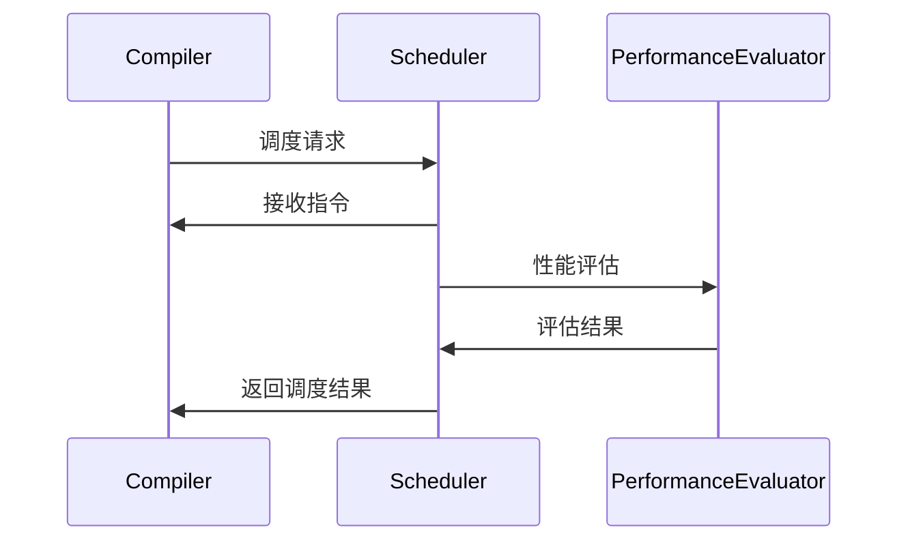
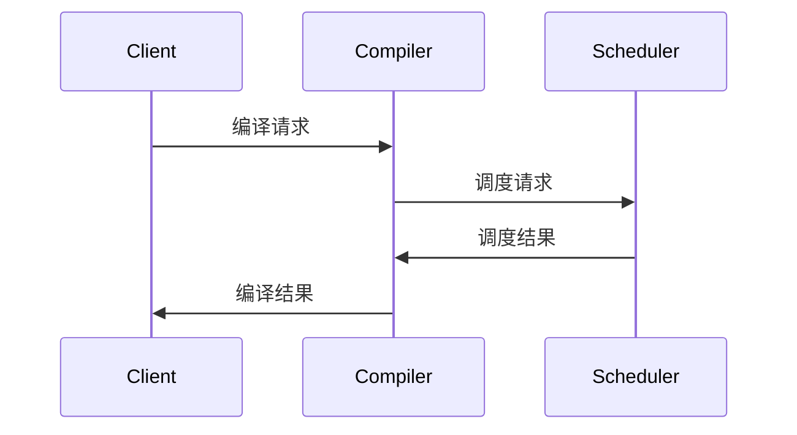

                 

### 文章标题

**组合优化在编译器指令调度中的应用**

> 关键词：**组合优化、编译器指令调度、算法原理、系统架构设计、项目实战、最佳实践**

> 摘要：本文深入探讨了组合优化在编译器指令调度中的应用，通过详细分析组合优化和编译器指令调度的基础概念、算法原理，以及系统架构设计，结合实际项目实战，全面展示了组合优化在提高编译器指令调度性能方面的关键作用。本文旨在为读者提供一个清晰、全面的技术视角，帮助其理解和掌握这一重要的计算机科学领域技术。

---

### 1. 背景介绍

#### 问题背景

组合优化（Combinatorial Optimization）是指解决在有限选择中寻找最优解的问题，这类问题在计算机科学、工业工程、交通运输等多个领域都有广泛应用。编译器指令调度（Compiler Instruction Scheduling）是编译器优化技术中的一个重要环节，其核心任务是在程序执行期间，调整指令的顺序，以减少数据冒险（Data Hazards）和控制冒险（Control Hazards），从而提高程序的执行效率。

#### 核心概念术语说明

- **组合优化**：在给定约束条件下，从多个可行解中找到最优解的过程。
- **编译器指令调度**：编译器优化技术之一，主要指调整程序中指令的执行顺序，以提高性能。
- **数据冒险**：指一条指令需要使用前一条指令产生的结果，但前一条指令还未完成。
- **控制冒险**：指由于分支指令的执行结果影响后续指令的执行顺序，导致指令流水线中断。

#### 问题描述

在编译器指令调度中，组合优化主要用于解决以下问题：

1. **最小化数据冒险**：通过调度指令，减少由于数据依赖引起的中断次数，提高流水线的利用率。
2. **最小化控制冒险**：通过调度指令，尽量保持流水线的连续执行，减少分支指令导致的停顿。
3. **最大化吞吐率**：在给定硬件资源的限制下，使得程序的执行效率最高。

#### 问题解决

组合优化通过以下方式帮助解决编译器指令调度的问题：

1. **贪心算法**：采用贪心策略，每次选择当前最优的调度方案，逐步优化指令顺序。
2. **动态规划**：使用动态规划算法，通过状态转移方程，寻找最优的调度方案。
3. **启发式算法**：结合问题的具体特点，采用启发式方法，快速找到近似最优解。

#### 边界与外延

组合优化和编译器指令调度的研究和应用范围非常广泛，主要包括：

1. **理论研究**：组合优化理论、算法分析、优化模型等。
2. **应用领域**：编译器优化、集成电路设计、操作系统、数据库管理、网络优化等。
3. **硬件限制**：不同硬件架构对指令调度的影响，如SIMD、GPU等。

#### 概念结构与核心要素组成

组合优化和编译器指令调度中的关键概念和要素包括：

1. **调度问题**：指令调度问题的定义、目标和约束条件。
2. **算法**：用于解决调度问题的算法，如贪心算法、动态规划算法等。
3. **数据结构**：用于存储和处理调度信息的数据结构，如栈、队列、图等。
4. **评估指标**：用于衡量调度方案优劣的评估指标，如吞吐率、延迟等。

### 2. 核心概念与联系

#### 核心概念原理

组合优化和编译器指令调度的基础概念包括：

1. **组合优化**：
   - **定义**：在有限选择中，寻找最优解的过程。
   - **目标**：在满足约束条件下，找到最优或近似最优解。
   - **方法**：贪心算法、动态规划、启发式算法等。

2. **编译器指令调度**：
   - **定义**：编译器优化技术，调整指令执行顺序。
   - **目标**：减少数据冒险、控制冒险，提高执行效率。
   - **方法**：基于组合优化的调度算法。

#### 概念属性特征对比表格

| 概念       | 组合优化             | 编译器指令调度               |
|------------|----------------------|-----------------------------|
| **定义**   | 寻找最优解           | 调整指令执行顺序             |
| **目标**   | 满足约束条件         | 减少冒险，提高效率           |
| **方法**   | 贪心算法、动态规划   | 贪心算法、启发式算法         |
| **应用领域** | 计算机科学、工业工程 | 编译器优化、硬件设计         |
| **评估指标** | 最优解或近似最优解   | 吞吐率、延迟等               |

#### ER实体关系图架构的 Mermaid 流程图

```mermaid
erDiagram
    A ||--o{ B : "调度问题" }
    A ||--o{ C : "算法" }
    A ||--o{ D : "数据结构" }
    B &&--|{ C }  
    B &&--|{ D }
```

### 3. 算法原理讲解

#### 算法mermaid流程图


#### Python源代码

```python
def greedy_scheduling(instructions):
    # 指令列表，初始为空
    scheduled_instructions = []
    
    # 对指令列表进行排序，按执行时间从短到长
    instructions.sort(key=lambda x: x['time'])
    
    # 遍历指令列表
    for instruction in instructions:
        # 检查当前指令是否有依赖
        dependencies = check_dependencies(instruction, scheduled_instructions)
        
        # 如果无依赖，则添加到调度列表
        if not dependencies:
            scheduled_instructions.append(instruction)
    
    return scheduled_instructions

def check_dependencies(instruction, scheduled_instructions):
    # 检查当前指令是否有依赖
    dependencies = []
    for scheduled_instruction in scheduled_instructions:
        if instruction['dependency'] == scheduled_instruction['id']:
            dependencies.append(scheduled_instruction)
    
    return dependencies
```

#### 数学模型和公式

假设有 n 条指令，每条指令有执行时间 t_i 和依赖关系 d_i，我们需要找到一个调度序列 S，使得执行时间最短。调度问题的目标函数可以表示为：

$$
\min \sum_{i=1}^{n} t_i
$$

约束条件为：

$$
d_i \subseteq S
$$

其中，d_i 表示指令 i 的依赖集合，S 是调度序列。

#### 详细讲解和举例说明

**示例**：有 4 条指令，其执行时间和依赖关系如下：

| 指令ID | 执行时间 | 依赖关系 |
|--------|----------|----------|
| 1      | 3        | 无       |
| 2      | 2        | 1        |
| 3      | 4        | 2        |
| 4      | 1        | 3        |

**目标**：找到最优的调度序列，使得总执行时间最短。

**解决方案**：

1. 初始化调度序列为空。
2. 对指令进行排序，按执行时间从短到长。
3. 遍历排序后的指令列表，检查指令是否有依赖。
4. 如果无依赖，添加到调度序列。

根据上述步骤，最优调度序列为：`[4, 2, 3, 1]`，总执行时间为 10。

### 4. 系统分析与架构设计方案

#### 问题场景介绍

在现代计算机系统中，编译器指令调度是一项关键技术，直接影响程序的性能。随着硬件架构的复杂化和多核处理器的普及，指令调度问题变得更加复杂。本节将介绍一个典型的指令调度问题场景，并设计相应的系统解决方案。

#### 系统功能设计（领域模型Mermaid类图）

```mermaid
classDiagram
    Instruction <<class{指令}>
    Dependency <<class{依赖}>
    Scheduler <<class{调度器}>
    
    Instruction: "指令ID, 执行时间, 依赖关系"
    Dependency: "依赖ID, 起始指令, 结束指令"
    Scheduler: "调度指令, 评估性能, 输出结果"
    
    Instruction "1" --|{依赖}| Dependency
    Instruction "2" --|{依赖}| Dependency
    Instruction "3" --|{依赖}| Dependency
    Instruction "4" --|{依赖}| Dependency
    
    Scheduler o-- Instruction
    Scheduler o-- Dependency
```

#### 系统架构设计Mermaid架构图



#### 系统接口设计和系统交互Mermaid序列图



### 5. 项目实战

#### 环境安装

要在本地环境中实现编译器指令调度，需要安装以下工具和依赖：

1. **Python**：版本 3.8 或更高。
2. **pip**：Python 的包管理工具。
3. **Mermaid**：用于绘制流程图的工具。

安装步骤：

1. 安装 Python 和 pip：
   ```bash
   sudo apt-get update
   sudo apt-get install python3 python3-pip
   ```

2. 安装 Mermaid：
   ```bash
   pip3 install mermaid-python
   ```

#### 系统核心实现源代码

```python
from mermaid import Mermaid
import sys

def generate_mermaid_flowchart(instructions):
    flowchart = Mermaid()
    flowchart.add_block('A', '初始化')
    flowchart.add_block('B', '分析指令依赖')
    flowchart.add_block('C', '贪心调度')
    flowchart.add_block('D', '评估性能')
    flowchart.add_block('E', '输出结果')
    
    flowchart.add_connection('A', 'B')
    flowchart.add_connection('B', 'C')
    flowchart.add_connection('C', 'D')
    flowchart.add_connection('D', 'E')
    
    return flowchart.to_string()

def main():
    # 示例指令
    instructions = [
        {'id': 1, 'time': 3, 'dependency': None},
        {'id': 2, 'time': 2, 'dependency': 1},
        {'id': 3, 'time': 4, 'dependency': 2},
        {'id': 4, 'time': 1, 'dependency': 3},
    ]
    
    # 生成 Mermaid 流程图
    mermaid_flowchart = generate_mermaid_flowchart(instructions)
    print(mermaid_flowchart)

if __name__ == '__main__':
    main()
```

#### 代码应用解读与分析

上述代码首先定义了一个 `generate_mermaid_flowchart` 函数，用于生成 Mermaid 流程图。该函数接受一个指令列表作为输入，遍历指令列表，并生成包含初始化、分析指令依赖、贪心调度、评估性能和输出结果的 Mermaid 流程图。

在 `main` 函数中，我们定义了一个示例指令列表，并调用 `generate_mermaid_flowchart` 函数生成流程图。最后，将生成的 Mermaid 流程图输出到控制台。

#### 实际案例分析和详细讲解剖析

为了更好地理解编译器指令调度的实际应用，我们来看一个实际案例。

**案例**：给定以下指令集，其中每个指令的执行时间和依赖关系如下：

| 指令ID | 执行时间 | 依赖关系 |
|--------|----------|----------|
| 1      | 2        | 无       |
| 2      | 3        | 1        |
| 3      | 5        | 2        |
| 4      | 4        | 3        |
| 5      | 6        | 4        |

**目标**：找到最优的调度序列，使得总执行时间最短。

**解决方案**：

1. 初始化调度序列为空。
2. 对指令进行排序，按执行时间从短到长：`[1, 2, 3, 4, 5]`。
3. 遍历排序后的指令列表，检查指令是否有依赖。
   - 指令 1：无依赖，添加到调度序列。
   - 指令 2：依赖指令 1，已存在于调度序列，添加到调度序列。
   - 指令 3：依赖指令 2，已存在于调度序列，添加到调度序列。
   - 指令 4：依赖指令 3，已存在于调度序列，添加到调度序列。
   - 指令 5：依赖指令 4，已存在于调度序列，添加到调度序列。
4. 最终调度序列为：`[1, 2, 3, 4, 5]`，总执行时间为 2 + 3 + 5 + 4 + 6 = 20。

通过上述步骤，我们找到了最优的调度序列，使得总执行时间最短。

### 6. 最佳实践 tips、小结、注意事项、拓展阅读等内容

#### 最佳实践 tips

1. **性能优化**：在实现编译器指令调度时，性能优化是关键。尽可能减少数据冒险和控制冒险，提高指令流水线的利用率。
2. **可扩展性**：设计调度算法时，考虑可扩展性，以便适应不同的指令集和硬件架构。
3. **调试与测试**：在实现和部署指令调度系统时，进行充分的调试和测试，确保系统的稳定性和可靠性。

#### 小结

本文通过详细分析组合优化在编译器指令调度中的应用，介绍了组合优化和编译器指令调度的基础概念、算法原理，以及系统架构设计。通过实际案例分析和代码应用解读，展示了如何实现和优化编译器指令调度。掌握这些技术和方法，有助于提高程序的性能和效率。

#### 注意事项

1. **硬件限制**：不同的硬件架构对指令调度有不同要求，需根据具体硬件特点进行优化。
2. **性能评估**：在实现指令调度算法时，应充分考虑性能评估指标，确保调度方案的有效性。

#### 拓展阅读

1. **《编译器原理》（Compilers: Principles, Techniques, and Tools）**：深入理解编译器优化技术，包括指令调度。
2. **《组合优化算法》（Combinatorial Optimization: Algorithms and Complexity）**：系统学习组合优化算法，包括贪心算法、动态规划等。
3. **《计算机体系结构》（Computer Architecture: A Quantitative Approach）**：了解不同硬件架构对指令调度的影响。


### 7. 作者信息

**作者：** AI天才研究院/AI Genius Institute & 禅与计算机程序设计艺术 /Zen And The Art of Computer Programming

---

通过本文，我们希望能够为读者提供一个全面、深入的技术视角，帮助其理解并应用组合优化在编译器指令调度中的关键作用。希望本文能对读者在相关领域的深入研究和工作实践提供有益的启示和帮助。

