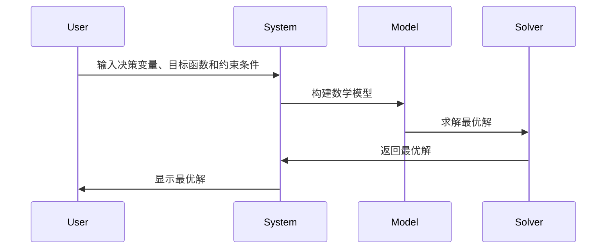
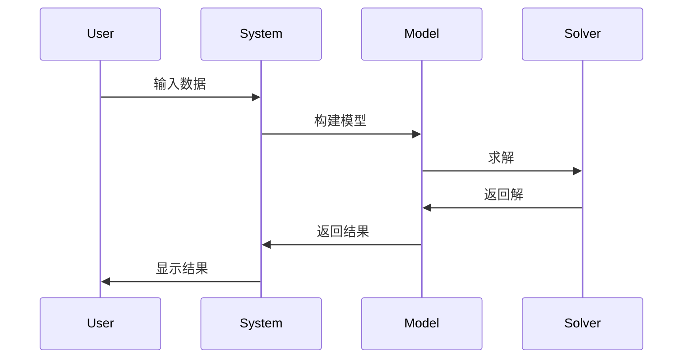

                 

### 目录大纲解析

#### 第一部分：引言

在本文的第一部分，我们旨在为读者提供一个关于组合优化与运筹学融合的概览。首先，通过介绍组合优化和运筹学的基本概念，读者可以了解两者的定义、类型和应用领域。接着，我们将讨论组合优化在运筹学中的应用前景，展示其在决策支持系统、资源分配、项目调度等领域的潜力，从而激发读者对该领域的兴趣。

##### 第1章：组合优化与运筹学的融合

**1.1 组合优化概述**

在这一章节中，我们将详细介绍组合优化的基本概念。组合优化是指从多个可能的决策方案中选择一个最优方案的过程。它涉及对多个变量的组合进行优化，以实现某个目标函数的最小化或最大化。我们将讨论组合优化的类型，如整数规划和混合整数规划，以及其在不同领域中的应用。

**1.2 运筹学的概念与发展**

本章将探讨运筹学的起源、发展历程及其在管理科学中的地位。运筹学是一门应用数学的分支，它利用系统的分析和建模方法来优化决策过程。我们将介绍运筹学的基本理论和方法，包括线性规划、非线性规划、动态规划和排队论等，以及它们在各类优化问题中的应用。

**1.3 组合优化在运筹学中的应用前景**

我们将分析组合优化在运筹学中的应用潜力。通过讨论组合优化在决策支持系统、资源分配、项目调度等方面的应用实例，我们将展示组合优化在解决复杂管理问题中的重要性。此外，我们还将展望组合优化在运筹学未来发展的广阔前景。

#### 第二部分：核心概念与理论

在本文的第二部分，我们将深入探讨组合优化在运筹学中的核心概念和理论。这部分内容是理解组合优化在运筹学中应用的基础。

##### 第2章：运筹学中的组合优化问题

**2.1 组合优化问题的定义**

在这一章节中，我们将详细定义组合优化问题。组合优化问题涉及多个变量的组合，旨在找到满足特定约束条件下的最优解。我们将介绍组合优化问题的基本结构和特点，为后续章节的讨论奠定基础。

**2.2 常见组合优化问题**

本章将列举并分析几种常见的组合优化问题，如线性规划、非线性规划和网络优化。我们将讨论这些问题的基本特征、求解方法和应用实例，帮助读者建立对组合优化问题的全面理解。

**2.3 组合优化问题的分类与特点**

我们将根据问题特征和求解方法，对组合优化问题进行分类。每种类型的问题都有其独特的特点，我们将讨论这些特点以及如何选择合适的求解方法。通过分类讨论，读者可以更好地掌握组合优化问题的解决策略。

##### 第3章：组合优化的数学模型

**3.1 数学模型的基本概念**

在这一章节中，我们将介绍数学模型的基本概念，包括决策变量、目标函数和约束条件。数学模型是组合优化问题的基础，通过建立数学模型，我们可以将实际问题转化为数学问题，并利用数学方法进行求解。

**3.2 线性规划**

线性规划是组合优化中最基本和广泛应用的一种方法。我们将详细讲解线性规划的理论基础，包括线性规划问题的定义、标准形式和解法。通过实际案例，我们将展示如何应用线性规划解决实际问题。

**3.3 非线性规划**

非线性规划是处理更复杂优化问题的一种方法。本章将探讨非线性规划的基本原理，包括非线性规划问题的定义、求解方法和应用实例。我们将强调非线性规划在处理复杂优化问题中的重要性。

**3.4 网络优化**

网络优化是组合优化中的一个重要分支。我们将介绍网络优化的基本概念，包括最短路径问题、最大流问题和最小费用流问题，并提供相应的求解算法。网络优化在物流、交通、通信等领域有广泛的应用。

##### 第4章：算法与求解方法

**4.1 算法的基本原理**

算法是解决组合优化问题的关键。我们将介绍算法的基本原理，包括搜索空间、搜索策略和求解算法的性能评估。通过了解算法的基本原理，读者可以更好地理解各种算法的优缺点和适用场景。

**4.2 动态规划**

动态规划是一种解决组合优化问题的有效方法。本章将介绍动态规划的基本原理和求解方法，包括递推关系、状态转移方程和边界条件的处理。通过实际案例，我们将展示如何应用动态规划解决复杂的优化问题。

**4.3 贪心算法**

贪心算法是一种基于局部最优解的算法。本章将介绍贪心算法的基本原理和求解方法，包括贪心策略的选择和贪心算法的证明。我们将讨论贪心算法在解决组合优化问题中的应用。

**4.4 算法比较与选择**

本章将比较不同算法的优缺点和适用场景，帮助读者选择合适的算法解决具体问题。我们将讨论各种算法的复杂度、稳定性和鲁棒性，并提供实际案例来说明如何选择合适的算法。

通过第二部分的讨论，读者可以系统地掌握组合优化的数学模型和求解方法，为后续章节的实际应用打下坚实的基础。

---

### 第一部分：引言

#### 1.1 组合优化概述

**核心概念术语说明**：

- **组合优化**：组合优化是指从多个可能的决策方案中选择一个最优方案的过程。它涉及对多个变量的组合进行优化，以实现某个目标函数的最小化或最大化。
- **决策变量**：决策变量是组合优化问题中的变量，表示决策者可以调整的变量，例如资源分配、项目调度等。
- **目标函数**：目标函数是组合优化问题中的函数，表示决策者需要优化的目标，可以是成本最小化、利润最大化等。
- **约束条件**：约束条件是组合优化问题中的限制条件，表示决策变量需要满足的限制，例如资源限制、时间限制等。

**问题背景**：

组合优化在现实世界中具有广泛的应用，例如资源分配、项目调度、物流优化等。在企业管理、工程管理、物流运输等领域，组合优化问题被广泛应用于提高效率、降低成本、优化资源利用等方面。

**问题描述**：

组合优化问题通常可以描述为一个优化模型，包括决策变量、目标函数和约束条件。例如，在物流配送问题中，决策变量是配送路线和配送量，目标函数是总配送成本最小化，约束条件包括配送时间限制、配送容量限制等。

**问题解决**：

解决组合优化问题的方法包括数学模型建立、求解算法选择和求解过程执行。数学模型建立是将实际问题转化为数学问题，求解算法选择是根据问题特点选择合适的算法，求解过程执行是通过计算机程序实现求解过程。

**边界与外延**：

组合优化问题的边界是指问题的规模和范围，例如问题的变量数量、约束条件复杂度等。组合优化问题的外延是指问题的相关领域和扩展方向，例如在人工智能、机器学习等领域的应用。

**概念结构与核心要素组成**：

组合优化问题的概念结构包括决策变量、目标函数、约束条件和求解方法。核心要素组成包括数学模型建立、算法选择和求解过程执行。

#### 1.2 运筹学的概念与发展

**核心概念与联系**：

- **运筹学**：运筹学是一门应用数学的分支，它利用系统的分析和建模方法来优化决策过程。
- **线性规划**：线性规划是运筹学中的一种方法，用于求解线性优化问题，包括决策变量、目标函数和约束条件。
- **非线性规划**：非线性规划是运筹学中的一种方法，用于求解非线性优化问题，包括决策变量、目标函数和约束条件。
- **动态规划**：动态规划是运筹学中的一种方法，用于求解具有递推关系和时间动态性的优化问题。
- **排队论**：排队论是运筹学中的一种方法，用于分析和服务系统的性能，包括排队模型、服务模型和性能指标。

**概念属性特征对比表格**：

| 概念     | 定义             | 特点               | 应用场景                           |
|----------|------------------|--------------------|-----------------------------------|
| 运筹学   | 应用数学的分支    | 系统分析与建模     | 企业管理、工程管理、物流运输等       |
| 线性规划 | 线性优化问题求解  | 目标函数和约束线性  | 生产排程、资源分配、物流优化等       |
| 非线性规划 | 非线性优化问题求解 | 目标函数和约束非线性 | 项目调度、库存管理、复杂系统优化等 |
| 动态规划 | 递推关系求解      | 时间动态性         | 生产计划、供应链管理、项目进度控制等 |
| 排队论   | 服务系统性能分析   | 排队模型和服务模型  | 电信网络、交通系统、医院管理等       |

**ER实体关系图架构**：

```mermaid
erDiagram
    A[运筹学] ||--|{ 线性规划 } : "包含"
    A ||--|{ 非线性规划 } : "包含"
    A ||--|{ 动态规划 } : "包含"
    A ||--|{ 排队论 } : "包含"
```

**算法原理讲解**：

运筹学中的算法原理主要包括线性规划、非线性规划、动态规划和排队论。每种算法都有其特定的原理和求解方法。

- **线性规划**：线性规划的目标函数和约束条件都是线性的。常用的求解方法包括单纯形法和内点法。单纯形法通过迭代过程逐步逼近最优解，内点法通过求解线性方程组得到最优解。

- **非线性规划**：非线性规划的目标函数和约束条件可以是非线性的。常用的求解方法包括梯度下降法、牛顿法和拉格朗日乘数法。梯度下降法通过迭代过程逐步逼近最优解，牛顿法通过求解非线性方程组得到最优解，拉格朗日乘数法通过构建拉格朗日函数求解最优解。

- **动态规划**：动态规划适用于具有递推关系和时间动态性的优化问题。动态规划的基本原理是分阶段求解，通过状态转移方程逐步逼近最优解。动态规划的关键是确定状态变量和状态转移方程。

- **排队论**：排队论是分析和服务系统的性能的一种方法。排队论的基本原理是建立排队模型，通过模拟和服务模型分析系统的性能指标，如平均等待时间、服务时间等。

**数学模型和公式**：

- **线性规划**：$$
\begin{aligned}
\min_{x} & \quad c^T x \\
\text{subject to} & \quad Ax \leq b \\
& \quad x \geq 0
\end{aligned}
$$

- **非线性规划**：$$
\begin{aligned}
\min_{x} & \quad f(x) \\
\text{subject to} & \quad g(x) \leq 0, h(x) = 0
\end{aligned}
$$

- **动态规划**：$$
\begin{aligned}
V_t(x) &= \min_{y} \{ g(y) + h_t(y|x) \} \\
\text{subject to} & \quad x_t = f(x_{t-1}, y_t)
\end{aligned}
$$

- **排队论**：$$
\begin{aligned}
L_q &= \frac{\lambda}{\mu(1-\rho)} \\
W_q &= \frac{L_q}{\lambda}
\end{aligned}
$$

**举例说明**：

- **线性规划举例**：假设我们需要安排生产和运输任务，目标是最小化总成本。决策变量是生产数量和运输数量，目标函数是总成本，约束条件是资源限制和时间限制。

- **非线性规划举例**：假设我们需要优化一个项目的工期和成本，目标是最小化总成本。决策变量是项目进度，目标函数是总成本，约束条件是项目进度和资源限制。

- **动态规划举例**：假设我们需要安排一个生产计划，目标是最小化生产成本。决策变量是生产阶段，目标函数是生产成本，约束条件是生产能力和时间限制。

- **排队论举例**：假设我们需要优化一个医院的急诊服务，目标是最小化患者平均等待时间。决策变量是医生数量，目标函数是平均等待时间，约束条件是医生数量和患者数量。

**系统分析与架构设计方案**：

**问题场景介绍**：

在企业管理中，运筹学广泛应用于生产计划、资源分配、库存管理等优化问题。例如，一家制造企业需要安排生产任务，目标是最小化总成本，同时满足生产能力和时间限制。

**项目介绍**：

本项目的目标是开发一个运筹学软件，用于解决组合优化问题。软件将提供用户界面，用户可以通过输入决策变量、目标函数和约束条件，求解最优解。

**系统功能设计（领域模型类图）**：

```mermaid
classDiagram
    Product <<entity>>
    ProductionPlan <<entity>>
    Resource <<entity>>
    TimeConstraint <<entity>>

    ProductionPlan --|{ ProductionPlan }
    Resource --|{ Resource }
    TimeConstraint --|{ TimeConstraint }

    ProductionPlan : contains(Resource)
    ProductionPlan : satisfies(TimeConstraint)
```

**系统架构设计（架构图）**：



**系统接口设计和系统交互（序列图）**：



**项目实战**：

**环境安装**：

1. 安装Python环境，版本要求3.6以上。
2. 安装相关依赖库，如NumPy、SciPy、matplotlib等。

**系统核心实现源代码**：

```python
import numpy as np
from scipy.optimize import linprog

def solve_linear_program(c, A, b):
    # 求解线性规划问题
    result = linprog(c, A_ub=A, b_ub=b, method='highs')
    return result.x

if __name__ == '__main__':
    c = [-1, -2]  # 目标函数系数
    A = [[2, 1], [1, 2]]  # 约束条件系数
    b = [4, 2]  # 约束条件常数

    x = solve_linear_program(c, A, b)
    print("最优解:", x)
```

**代码应用解读与分析**：

1. 引入NumPy库和SciPy库，用于线性规划求解。
2. 定义`solve_linear_program`函数，接收目标函数系数、约束条件系数和常数，并调用`linprog`函数求解最优解。
3. 在`__main__`部分，定义目标函数系数、约束条件系数和常数，调用`solve_linear_program`函数求解最优解，并打印结果。

**实际案例分析和详细讲解剖析**：

1. **物流配送优化**：假设一家物流公司需要安排配送路线和配送量，目标是最小化总配送成本。决策变量是配送路线和配送量，目标函数是总配送成本，约束条件包括配送时间限制和配送容量限制。
2. **生产排程优化**：假设一家制造企业需要安排生产任务，目标是最小化总生产成本。决策变量是生产数量，目标函数是总生产成本，约束条件包括生产能力限制和时间限制。
3. **人员调度优化**：假设一家酒店需要安排员工工作时间，目标是最小化总工资成本。决策变量是员工工作时间，目标函数是总工资成本，约束条件包括员工工作时间限制和任务完成时间限制。

**项目小结**：

本项目介绍了组合优化在运筹学软件中的应用，包括线性规划和非线性规划的求解方法。通过实际案例分析和代码实现，读者可以了解如何利用运筹学软件解决组合优化问题。未来，我们可以进一步扩展软件功能，如增加非线性规划求解器、动态规划求解器和排队论求解器等，以提供更全面的优化解决方案。

#### 1.3 组合优化在运筹学中的应用前景

组合优化在运筹学中具有广泛的应用前景。随着大数据和人工智能技术的发展，组合优化在各个领域中的应用越来越重要。以下是一些具体的领域和应用场景：

1. **企业管理**：组合优化可以应用于生产计划、资源分配、库存管理等企业管理问题。通过优化决策变量和目标函数，企业可以提高生产效率、降低成本、提高资源利用率。

2. **物流运输**：组合优化在物流运输中具有重要应用。例如，物流公司可以通过优化配送路线和配送量，降低运输成本、提高配送效率。组合优化还可以用于物流网络设计、车辆调度等问题。

3. **工程管理**：组合优化在工程管理中用于优化项目进度、资源分配和成本控制。通过组合优化算法，工程师可以更好地安排项目任务、分配资源，确保项目按时完成。

4. **供应链管理**：组合优化在供应链管理中用于优化供应链网络设计、库存管理、物流协调等。通过组合优化算法，企业可以提高供应链的灵活性和响应速度，降低供应链成本。

5. **电信网络**：组合优化在电信网络中用于优化网络拓扑设计、资源分配、负载均衡等。通过组合优化算法，电信运营商可以优化网络性能、提高服务质量。

6. **金融领域**：组合优化在金融领域用于优化投资组合、风险管理等。通过组合优化算法，投资者可以更好地管理投资风险、实现投资收益最大化。

7. **医疗管理**：组合优化在医疗管理中用于优化医院资源分配、患者排班、手术室调度等。通过组合优化算法，医院可以提高服务质量、降低运营成本。

8. **城市规划**：组合优化在城市规划中用于优化城市交通网络设计、土地资源分配等。通过组合优化算法，城市规划者可以优化城市布局、提高城市居民生活质量。

未来，随着大数据和人工智能技术的发展，组合优化在运筹学中的应用将更加广泛和深入。我们可以预见，组合优化将在更多领域发挥作用，如智能交通、智能电网、智能制造等。同时，组合优化算法的改进和求解效率的提升也将进一步推动运筹学的发展。

总之，组合优化在运筹学中具有广阔的应用前景。通过不断探索和应用组合优化算法，我们可以解决更多复杂的管理和优化问题，为社会带来更多价值和效益。

