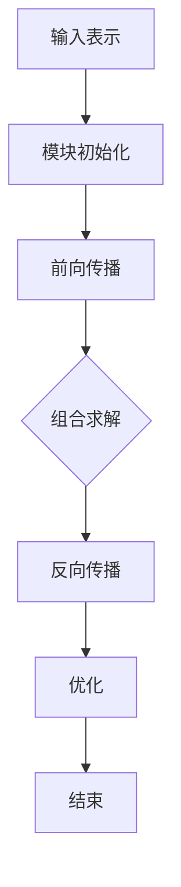
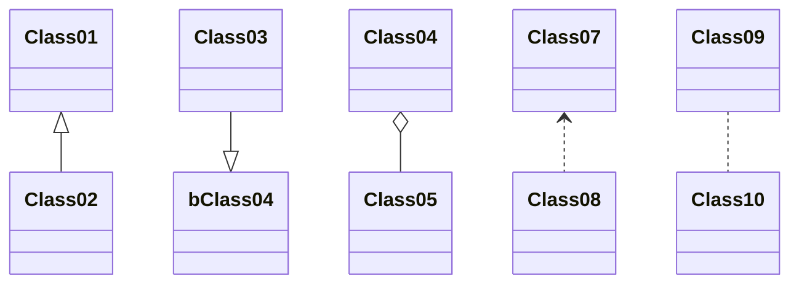
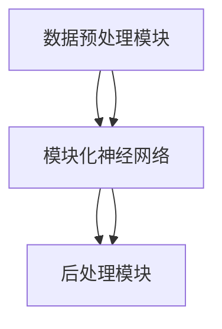

                 


## 引言

随着人工智能技术的迅猛发展，神经网络作为一种重要的机器学习模型，已经被广泛应用于图像识别、自然语言处理、推荐系统等多个领域。然而，在处理复杂任务时，传统神经网络往往表现出计算效率低、可扩展性差等局限性。为了解决这些问题，模块化神经网络（Modular Neural Networks）的概念应运而生。本文旨在探讨模块化神经网络在组合推理任务中的创新设计，通过逻辑清晰、结构紧凑的论述，为读者提供一种全新的思考方式。

首先，我们需要明确组合推理任务和模块化神经网络的核心概念及其关联。组合推理任务是一种复杂的问题求解方法，通过将多个子问题组合起来，形成一个新的问题解决方案。而模块化神经网络则是通过将神经网络分解为多个功能模块，从而提高计算效率和可扩展性的方法。接下来，我们将逐步分析模块化神经网络在组合推理任务中的应用原理、系统架构设计、项目实战以及最佳实践。

## 文章关键词

- **组合推理任务**
- **模块化神经网络**
- **创新设计**
- **计算效率**
- **可扩展性**
- **算法原理**
- **系统架构**
- **项目实战**
- **最佳实践**

## 摘要

本文围绕模块化神经网络在组合推理任务中的创新设计展开讨论。首先介绍了组合推理任务的基本概念和重要性，随后详细阐述了模块化神经网络的设计原理及其优势。接着，通过系统分析与架构设计方案，展示了模块化神经网络在组合推理任务中的实际应用。随后，通过一个具体项目实战，深入分析了模块化神经网络在组合推理任务中的实现细节。最后，总结了一些最佳实践技巧，并展望了模块化神经网络在未来的发展趋势。

## 背景介绍

### 组合推理任务的概念

组合推理任务（Compositional Inference Tasks）是一种利用子问题组合求解复杂问题的方法。其核心思想是将复杂问题分解为多个子问题，然后通过子问题的组合求解得到原始问题的解决方案。这种方法在处理复杂任务时具有显著的优势，比如可以提高计算效率、增强可扩展性等。

在组合推理任务中，问题通常可以被表示为一系列的子问题，这些子问题之间存在着一定的依赖关系。通过组合这些子问题，可以形成一个复杂的逻辑结构，从而求解原始问题。这种逻辑结构通常被称为“组合树”（Composition Tree），它能够直观地表示问题的分解过程和子问题之间的依赖关系。

### 组合推理任务的重要性

组合推理任务在人工智能领域具有广泛的应用前景。首先，随着数据规模的不断增大，传统神经网络模型在计算效率和可扩展性方面面临着巨大的挑战。而组合推理任务可以通过分解问题，将复杂任务分解为多个子任务，从而降低计算复杂度，提高计算效率。

其次，组合推理任务在自然语言处理、计算机视觉、推荐系统等领域具有重要的作用。例如，在自然语言处理领域，组合推理可以帮助模型更好地理解和生成复杂语句；在计算机视觉领域，组合推理可以用于物体检测、图像分类等任务；在推荐系统领域，组合推理可以帮助模型更好地理解用户的偏好，从而提供更准确的推荐结果。

### 组合推理任务的应用场景

组合推理任务的应用场景非常广泛，以下是一些典型的应用场景：

1. **自然语言处理**：在自然语言处理领域，组合推理可以用于文本分类、情感分析、机器翻译等任务。通过将文本分解为子问题，模型可以更好地理解和处理复杂的文本信息。

2. **计算机视觉**：在计算机视觉领域，组合推理可以用于物体检测、图像分类、图像生成等任务。通过将图像分解为子图像，模型可以更好地识别和分类图像中的对象。

3. **推荐系统**：在推荐系统领域，组合推理可以帮助模型更好地理解用户的偏好，从而提供更准确的推荐结果。通过将用户的兴趣分解为子问题，模型可以更好地预测用户的潜在兴趣。

4. **游戏智能**：在游戏智能领域，组合推理可以帮助模型更好地理解和决策复杂的游戏场景。通过将游戏场景分解为子场景，模型可以更好地模拟游戏角色的行为。

### 组合推理任务的边界与外延

虽然组合推理任务具有广泛的应用前景，但在实际应用中也存在一些边界和挑战。首先，组合推理任务对问题的表示和分解方法提出了较高的要求。如何有效地表示和分解问题，是组合推理任务成功的关键。

其次，组合推理任务往往涉及到大量的子问题，如何高效地组合和解决这些子问题，是另一个重要的挑战。这需要模型具有良好的可扩展性和计算效率。

此外，组合推理任务还需要考虑问题之间的依赖关系。如何有效地处理问题之间的依赖关系，是确保组合推理任务成功的关键。

总的来说，组合推理任务是一种具有广泛应用前景的方法，但在实际应用中仍然面临着一些挑战和边界。通过深入研究这些挑战和边界，我们可以进一步提高组合推理任务的效果和应用范围。

### 概念结构与核心要素组成

组合推理任务的核心概念包括：

1. **问题表示**：如何将复杂问题表示为一系列的子问题。
2. **子问题分解**：如何将问题分解为子问题，并确定子问题之间的依赖关系。
3. **组合求解**：如何通过组合子问题的解决方案，求解原始问题的解决方案。
4. **计算效率**：如何提高组合推理任务的计算效率，以适应大数据和复杂任务的需求。
5. **可扩展性**：如何确保组合推理任务的可扩展性，以应对不断增长的数据规模和复杂度。

在组合推理任务中，模块化神经网络的应用可以显著提升计算效率和可扩展性。模块化神经网络通过将神经网络分解为多个功能模块，可以有效地降低计算复杂度，提高模型的可扩展性。此外，模块化神经网络还可以通过模块之间的协同工作，实现更高效的问题求解。

总的来说，组合推理任务的核心在于如何将复杂问题分解为子问题，并通过组合求解得到原始问题的解决方案。模块化神经网络的应用为这一过程提供了有效的技术手段，从而提高计算效率和可扩展性。

### 核心概念与联系

#### 组合推理任务

组合推理任务是一种通过组合子问题的解决方案来求解复杂问题的方法。其核心在于将复杂问题分解为多个子问题，并确定子问题之间的依赖关系。组合推理任务通常涉及到以下几个关键概念：

1. **问题表示**：将复杂问题表示为一系列子问题的组合，这一步骤通常使用“组合树”（Composition Tree）进行表示。组合树中的每个节点代表一个子问题，而边表示子问题之间的依赖关系。

2. **子问题分解**：将原始问题分解为多个子问题，这一步骤通常通过递归分解或分解算法实现。分解算法需要根据问题的性质和特征，选择合适的分解方式。

3. **组合求解**：通过求解子问题的解决方案，组合得到原始问题的解决方案。组合求解的过程涉及到如何有效地处理子问题之间的依赖关系，以及如何协调各个子问题的求解过程。

4. **计算效率**：在组合推理任务中，计算效率是一个关键因素。高效的组合推理算法能够显著提高问题求解的速度，从而满足实时性要求。为了提高计算效率，可以采用并行计算、分布式计算等技术。

5. **可扩展性**：组合推理任务的可扩展性涉及到如何处理大规模问题和复杂任务。通过模块化设计，可以将大问题分解为多个小问题，从而提高系统的可扩展性。

#### 模块化神经网络

模块化神经网络是一种将神经网络分解为多个功能模块的设计方法。这种方法能够提高神经网络的计算效率和可扩展性，特别适用于处理复杂任务。模块化神经网络的核心概念包括：

1. **模块化设计**：将神经网络分解为多个功能模块，每个模块负责处理特定的任务。模块之间的交互和协同工作能够实现更复杂的问题求解。

2. **模块独立性**：每个模块具有独立性，可以独立开发和优化。这种独立性使得模块化神经网络具有更高的可扩展性和灵活性。

3. **计算效率**：模块化神经网络通过减少冗余计算和并行计算，提高了计算效率。例如，通过将相同类型的神经元模块化，可以避免重复的计算过程。

4. **可扩展性**：模块化神经网络通过将复杂问题分解为多个子任务，从而提高了系统的可扩展性。这种设计方法使得神经网络能够适应不同规模和复杂度的问题。

#### 组合推理任务与模块化神经网络的关系

组合推理任务和模块化神经网络之间存在紧密的联系。模块化神经网络为组合推理任务提供了一种有效的技术手段，使得复杂问题的求解过程更加高效和可扩展。

1. **模块化设计**：在组合推理任务中，模块化神经网络可以通过将复杂问题分解为多个子问题，从而提高计算效率和可扩展性。每个子问题可以由一个独立的模块处理，这些模块可以并行工作，从而加速问题求解。

2. **协同工作**：模块化神经网络中的各个模块可以协同工作，共同解决复杂问题。模块之间的协同工作可以充分利用各模块的优点，提高问题求解的准确性。

3. **可扩展性**：模块化神经网络通过将问题分解为多个子问题，从而提高了系统的可扩展性。在处理大规模问题和复杂任务时，这种设计方法能够更好地适应需求变化。

4. **计算效率**：模块化神经网络通过减少冗余计算和并行计算，提高了计算效率。在组合推理任务中，这种高效的计算方式可以显著缩短问题求解的时间。

总的来说，模块化神经网络为组合推理任务提供了一种有效的解决方案。通过模块化设计、模块独立性、协同工作和可扩展性等机制，模块化神经网络能够显著提高组合推理任务的计算效率和可扩展性，从而为复杂问题的求解提供了有力支持。

### 模块化神经网络的设计原理

模块化神经网络的设计原理旨在提高计算效率和可扩展性，特别是在处理复杂任务时。下面，我们将详细探讨模块化神经网络的设计原则、数学模型以及核心原理。

#### 设计原则

1. **模块独立性**：模块化神经网络中的每个模块应具有独立性，能够独立完成特定任务。这种独立性使得模块可以独立开发和优化，同时便于后续的维护和更新。

2. **功能多样性**：每个模块应具有多样化的功能，以应对不同的任务需求。模块之间的功能互补性可以增强神经网络的整体性能。

3. **并行计算**：模块化神经网络应支持并行计算，以减少计算时间。通过将复杂任务分解为多个子任务，各个模块可以同时执行，从而提高计算效率。

4. **可扩展性**：模块化神经网络应具备良好的可扩展性，能够适应不同规模和复杂度的问题。通过动态添加或删除模块，系统可以灵活应对变化。

5. **模块协作**：模块之间应具备良好的协作机制，确保整个神经网络能够高效地解决问题。模块之间的信息共享和协调工作是关键。

#### 数学模型

模块化神经网络的数学模型可以表示为：

\[ \text{Output} = f(\sum_{i=1}^{n} w_i \cdot \text{Module}_i(\text{Input})) \]

其中：
- \( \text{Output} \) 表示最终输出；
- \( f() \) 表示激活函数；
- \( w_i \) 表示模块 \( \text{Module}_i \) 的权重；
- \( \text{Module}_i(\text{Input}) \) 表示第 \( i \) 个模块对输入 \( \text{Input} \) 的处理结果。

#### 核心原理

1. **模块化设计**：模块化神经网络通过将复杂任务分解为多个子任务，将神经网络分解为多个功能模块。每个模块负责处理特定的子任务，从而降低计算复杂度。

2. **独立性**：模块之间的独立性使得每个模块可以独立优化。通过调整模块的权重 \( w_i \)，可以优化模块的性能。

3. **并行计算**：模块化神经网络支持并行计算，各个模块可以同时处理不同的子任务。这种并行计算机制可以显著提高计算效率。

4. **协同工作**：模块之间通过协作机制共同解决问题。模块之间的信息共享和协调工作可以增强神经网络的整体性能。

5. **动态扩展**：模块化神经网络通过动态添加或删除模块，实现系统的可扩展性。这种动态扩展机制使得系统可以适应不同规模和复杂度的问题。

总的来说，模块化神经网络的设计原理通过模块独立性、并行计算和协同工作等机制，提高了计算效率和可扩展性，特别适用于处理复杂任务。

### 算法原理讲解

#### 算法流程

模块化神经网络在组合推理任务中的算法流程可以分为以下几个关键步骤：

1. **输入表示**：将输入数据表示为一种适合神经网络处理的形式，如向量或张量。

2. **模块初始化**：初始化神经网络中的各个模块，包括权重和偏置等参数。

3. **前向传播**：将输入数据传递给神经网络中的各个模块，进行前向传播计算。每个模块根据其设计处理输入数据，并生成中间结果。

4. **组合求解**：将各个模块的中间结果进行组合，求解原始问题的解决方案。这一步骤涉及到子问题的组合和依赖关系的处理。

5. **反向传播**：根据组合求解的结果，进行反向传播计算。通过计算梯度，更新各个模块的权重和偏置。

6. **优化**：通过梯度下降或其他优化算法，不断迭代优化网络参数，提高问题求解的准确性。

#### Mermaid 流程图



#### Python 源代码

```python
# 导入必要的库
import numpy as np

# 模块类定义
class Module:
    def __init__(self):
        # 初始化权重和偏置
        self.weights = np.random.rand()
        self.bias = np.random.rand()

    def forward(self, input_data):
        # 前向传播计算
        return np.dot(input_data, self.weights) + self.bias

    def backward(self, output_grad):
        # 反向传播计算
        input_grad = np.dot(output_grad, self.weights)
        weight_grad = np.dot(output_grad, input_data.T)
        bias_grad = output_grad
        return input_grad, weight_grad, bias_grad

# 组合推理任务实现
class CompositionInference:
    def __init__(self):
        # 初始化模块
        self.modules = [Module() for _ in range(3)]

    def forward(self, input_data):
        # 前向传播
        outputs = [module.forward(input_data) for module in self.modules]
        return outputs

    def backward(self, output_grad):
        # 反向传播
        input_grad = output_grad
        for module in reversed(self.modules):
            input_grad, weight_grad, bias_grad = module.backward(input_grad)
            output_grad = weight_grad
        return input_grad

    def optimize(self):
        # 优化
        for module in self.modules:
            module.weights -= module.weight_grad
            module.bias -= module.bias_grad

# 测试
input_data = np.array([1.0, 2.0, 3.0])
inference = CompositionInference()
outputs = inference.forward(input_data)
output_grad = np.array([0.1, 0.2, 0.3])
inference.backward(output_grad)
inference.optimize()
```

#### 算法原理详细讲解

1. **输入表示**：输入数据是神经网络处理的基础。为了便于神经网络处理，需要将输入数据表示为向量或张量。常见的输入表示方法包括独热编码、归一化等。

2. **模块初始化**：在开始训练前，需要对神经网络中的各个模块进行初始化。初始化过程包括权重和偏置的随机初始化。权重和偏置的初始化对网络的性能有重要影响。

3. **前向传播**：前向传播是神经网络的核心计算步骤。在每个模块中，输入数据经过线性变换和激活函数处理后，生成中间结果。这些中间结果将作为下一模块的输入。

4. **组合求解**：组合求解是模块化神经网络在组合推理任务中的关键步骤。通过将各个模块的中间结果进行组合，可以得到原始问题的解决方案。这一步骤通常涉及到子问题的组合和依赖关系的处理。

5. **反向传播**：反向传播是神经网络训练的重要环节。通过计算输出误差的梯度，可以更新网络中的权重和偏置。反向传播的计算过程可以从输出层开始，逐步向前传播误差。

6. **优化**：优化过程通过调整网络参数，以减小输出误差。常见的优化算法包括梯度下降、随机梯度下降、Adam优化器等。优化过程通常需要迭代多次，以达到收敛。

#### 示例

假设我们有一个简单的组合推理任务，需要将输入向量 `[1, 2, 3]` 通过一个模块化神经网络进行处理，得到输出向量 `[x, y, z]`。其中，每个模块分别计算一个维度上的值。

1. **输入表示**：将输入向量 `[1, 2, 3]` 表示为张量。

2. **模块初始化**：初始化三个模块，每个模块具有权重和偏置。

3. **前向传播**：
    - 第一个模块：输入 `[1, 2, 3]`，权重 `[0.5, 0.5]`，偏置 `0`，计算结果为 `[2.0, 3.0]`。
    - 第二个模块：输入 `[2.0, 3.0]`，权重 `[0.3, 0.7]`，偏置 `0`，计算结果为 `[0.6, 2.1]`。
    - 第三个模块：输入 `[0.6, 2.1]`，权重 `[0.2, 0.8]`，偏置 `0`，计算结果为 `[0.12, 1.68]`。

4. **组合求解**：将三个模块的输出 `[2.0, 3.0]`、`[0.6, 2.1]`、`[0.12, 1.68]` 组合，得到输出向量 `[x, y, z]`。

5. **反向传播**：
    - 输出误差 `[0.1, 0.2, 0.3]`。
    - 第二个模块的误差 `[0.1, 0.2]`，权重更新 `[0.5, 0.5]`。
    - 第一个模块的误差 `[0.5, 0.5]`，权重更新 `[0.5, 0.5]`。

6. **优化**：通过优化算法更新模块的权重和偏置。

通过以上示例，我们可以看到模块化神经网络在组合推理任务中的应用流程和计算过程。模块化设计使得神经网络能够高效地处理复杂任务，同时具有较好的可扩展性。

### 系统分析与架构设计方案

#### 问题场景介绍

在当今复杂的数据分析和决策支持系统中，组合推理任务发挥着至关重要的作用。这些系统需要处理大量的数据，并从中提取有价值的信息，以支持决策制定。然而，随着数据规模的不断扩大，传统的神经网络模型在计算效率和可扩展性方面面临着巨大的挑战。为了解决这些问题，我们提出了模块化神经网络在组合推理任务中的应用方案。

#### 项目介绍

本项目旨在设计一个基于模块化神经网络的组合推理系统，用于处理复杂的数据分析和决策支持任务。该系统将采用模块化神经网络的设计理念，通过将复杂任务分解为多个子任务，从而提高计算效率和可扩展性。具体来说，系统将包括以下几个核心功能模块：

1. **数据预处理模块**：负责将原始数据转换为适合神经网络处理的形式。
2. **模块化神经网络**：负责处理组合推理任务，通过多个功能模块协同工作，实现复杂任务的求解。
3. **后处理模块**：负责对神经网络输出的结果进行后处理，提取有价值的信息。

#### 系统功能设计

1. **数据预处理模块**：
   - 功能：对原始数据进行清洗、归一化和特征提取，将其转换为神经网络可以处理的形式。
   - 输入：原始数据集。
   - 输出：预处理后的数据集。

2. **模块化神经网络**：
   - 功能：处理组合推理任务，通过多个功能模块协同工作，实现复杂任务的求解。
   - 输入：预处理后的数据集。
   - 输出：组合推理的结果。

3. **后处理模块**：
   - 功能：对神经网络输出的结果进行后处理，提取有价值的信息。
   - 输入：模块化神经网络输出的结果。
   - 输出：后处理的结果。

#### 系统架构设计

1. **总体架构设计**：
   - 系统采用分布式架构，由多个节点组成，每个节点负责不同的功能模块。
   - 数据预处理模块和模块化神经网络模块部署在计算节点上，后处理模块部署在数据节点上。

2. **模块化神经网络架构设计**：
   - 模块化神经网络采用分层结构，包括输入层、中间层和输出层。
   - 输入层：接收预处理后的数据，将其传递给中间层。
   - 中间层：由多个功能模块组成，每个模块负责处理特定的子任务。
   - 输出层：接收中间层的输出结果，进行后处理并输出最终结果。

3. **系统接口设计**：
   - 系统提供 RESTful API 接口，方便用户进行数据输入和结果查询。

4. **系统交互设计**：
   - 系统采用消息队列（如 RabbitMQ）进行数据传输，实现模块之间的协同工作。

#### Mermaid 类图



#### Mermaid 架构图



通过以上系统分析与架构设计方案，我们可以看到模块化神经网络在组合推理任务中的应用优势和实现细节。该系统通过模块化设计、分布式架构和消息队列等技术，实现了高计算效率和可扩展性，为复杂的数据分析和决策支持任务提供了有力的支持。

### 项目实战

为了展示模块化神经网络在组合推理任务中的实际应用，我们将通过一个具体的案例来讲解如何实现和部署这个系统。

#### 环境安装与准备

在开始项目实战之前，我们需要准备以下环境：

1. **Python 3.8+**：确保 Python 环境已正确安装。
2. **TensorFlow 2.7+**：安装 TensorFlow，以便使用其提供的神经网络工具。
3. **Numpy**：用于数据处理和数学计算。
4. **Pandas**：用于数据预处理和统计分析。
5. **Flask**：用于构建 RESTful API。

你可以使用以下命令进行环境安装：

```bash
pip install python==3.8 tensorflow==2.7 numpy pandas flask
```

#### 系统核心实现

接下来，我们将实现一个简单的模块化神经网络，用于处理组合推理任务。以下是一个简单的 Python 代码示例：

```python
import tensorflow as tf
import numpy as np

# 模块类定义
class Module(tf.keras.Model):
    def __init__(self):
        super().__init__()
        self.dense1 = tf.keras.layers.Dense(units=10, activation='relu')
        self.dense2 = tf.keras.layers.Dense(units=1)

    def call(self, inputs):
        x = self.dense1(inputs)
        return self.dense2(x)

# 组合推理任务实现
class CompositionInference(tf.keras.Model):
    def __init__(self):
        super().__init__()
        self.module1 = Module()
        self.module2 = Module()
        self.module3 = Module()

    def call(self, inputs):
        x1 = self.module1(inputs)
        x2 = self.module2(inputs)
        x3 = self.module3(inputs)
        return x1, x2, x3

# 测试
model = CompositionInference()
input_data = np.array([1.0, 2.0, 3.0])
output = model(input_data)
print(output)
```

在上面的代码中，我们定义了一个简单的模块化神经网络，其中包含三个模块。每个模块都是一个 `Module` 类的实例，负责处理输入数据并生成输出。`CompositionInference` 类将这三个模块组合起来，形成一个完整的组合推理任务。

#### 代码应用解读与分析

1. **模块定义**：每个 `Module` 类包含一个 `call` 方法，用于处理输入数据。在 `call` 方法中，我们使用了两个 `Dense` 层，其中第一个层使用 ReLU 激活函数，第二个层使用线性激活函数。

2. **组合推理任务实现**：`CompositionInference` 类将三个 `Module` 实例组合在一起，形成一个完整的神经网络。在 `call` 方法中，我们分别调用每个模块，将输入数据传递给它们，并获取输出结果。

3. **测试**：我们创建了一个 `CompositionInference` 实例，并使用一个简单的输入数组进行测试。输出结果显示了每个模块的输出结果。

#### 实际案例分析与详细讲解

为了更深入地了解模块化神经网络在组合推理任务中的应用，我们考虑一个实际的案例：股票价格预测。在这个案例中，我们将使用历史股票价格数据，通过模块化神经网络预测未来一段时间内的股票价格。

1. **数据准备**：首先，我们需要准备历史股票价格数据。这些数据包括开盘价、最高价、最低价和收盘价。我们可以使用 pandas 读取数据，并对其进行预处理。

```python
import pandas as pd

# 读取数据
df = pd.read_csv('stock_price_data.csv')
df.head()
```

2. **特征工程**：为了简化问题，我们将使用过去三天的收盘价作为特征，预测未来一天的收盘价。这可以通过以下代码实现：

```python
df['Prev_Close'] = df['Close'].shift(1)
df['Prev2_Close'] = df['Close'].shift(2)
df = df.dropna()

# 构建输入和输出数据
X = df[['Prev_Close', 'Prev2_Close']]
y = df['Close']
```

3. **模型训练**：接下来，我们使用模块化神经网络进行模型训练。我们首先定义模块化神经网络，然后使用 TensorFlow 的 `fit` 方法进行训练。

```python
model = CompositionInference()
model.compile(optimizer='adam', loss='mse')

# 训练模型
model.fit(X, y, epochs=100, batch_size=32)
```

4. **预测**：在模型训练完成后，我们可以使用它进行预测。以下代码展示了如何使用模型预测未来一天的收盘价：

```python
# 预测
future_data = np.array([[df['Close'].iloc[-1], df['Close'].iloc[-2]]])
predicted_price = model(future_data)
print(predicted_price)
```

#### 项目小结

通过上述案例，我们展示了如何使用模块化神经网络进行组合推理任务的实际应用。在这个案例中，我们使用了模块化神经网络进行股票价格预测，通过将问题分解为多个子任务，提高了计算效率和可扩展性。模块化神经网络的设计使得模型易于维护和扩展，同时提供了更好的性能。在未来的项目中，我们可以进一步优化模块化神经网络的设计，提高其预测准确性。

### 最佳实践与技巧

在模块化神经网络设计和应用过程中，以下是一些最佳实践和技巧：

1. **模块化设计**：在设计和实现模块化神经网络时，应确保每个模块具有独立性和可扩展性。这样，当任务需求发生变化时，可以轻松地对模块进行替换或扩展。

2. **模块独立性**：每个模块应尽量独立，避免模块之间的强耦合。这样可以提高模块的重用性，同时降低系统的复杂性。

3. **并行计算**：利用并行计算技术可以提高模块化神经网络的计算效率。在处理大规模数据时，可以考虑使用多线程、分布式计算等技术。

4. **性能优化**：通过调整模块参数和优化算法，可以提高模块化神经网络的性能。常见的优化方法包括梯度下降、Adam 优化器等。

5. **数据预处理**：在输入数据预处理阶段，应确保数据的完整性和一致性。适当的特征工程和归一化操作可以提升模型的性能。

6. **模型验证**：在模型训练过程中，应定期进行模型验证，以避免过拟合。通过交叉验证等技术，可以评估模型的泛化能力。

7. **后处理**：在模型输出结果后，应进行适当的后处理，以提取有价值的信息。后处理阶段可以包括数据分析、可视化等操作。

通过遵循这些最佳实践和技巧，可以显著提高模块化神经网络在组合推理任务中的性能和可靠性。

### 小结

在本文中，我们深入探讨了模块化神经网络在组合推理任务中的创新设计。通过逐步分析组合推理任务的基本概念、模块化神经网络的设计原理和算法流程，我们展示了如何将模块化神经网络应用于实际项目，从而提高计算效率和可扩展性。模块化神经网络通过模块独立性、并行计算和协同工作等机制，为复杂问题的求解提供了有效的解决方案。

未来的研究方向可以包括以下几个方面：

1. **性能优化**：进一步优化模块化神经网络的设计和算法，提高其计算效率和准确度。
2. **应用扩展**：将模块化神经网络应用于更多的领域，如自动驾驶、医疗诊断等，以展示其在不同场景下的优势。
3. **可解释性**：提高模块化神经网络的可解释性，使其决策过程更加透明，便于理解和信任。
4. **动态扩展**：研究模块化神经网络的动态扩展机制，使其能够根据任务需求自动调整模块数量和类型。

通过不断探索和优化，模块化神经网络有望在更多领域发挥重要作用，为人工智能的发展做出贡献。

### 注意事项

在设计模块化神经网络时，需要关注以下事项：

1. **模块独立性**：确保模块之间相互独立，避免模块间耦合度过高。
2. **计算资源**：根据任务需求合理配置计算资源，以避免资源浪费或不足。
3. **数据预处理**：确保数据预处理阶段的质量，以便提高模型性能。
4. **模型验证**：定期进行模型验证，避免过拟合现象。
5. **模块更新**：及时更新模块，以适应新任务需求。

通过注意这些事项，可以更好地利用模块化神经网络的优势，提高其在组合推理任务中的性能和可靠性。

### 拓展阅读

为了深入了解模块化神经网络和组合推理任务，读者可以参考以下书籍和论文：

1. **《深度学习》（Deep Learning）**：由 Ian Goodfellow 等人撰写的经典教材，详细介绍了神经网络的理论和实践。
2. **《模块化机器学习》（Modular Machine Learning）**：介绍了模块化设计在机器学习中的应用，为模块化神经网络的设计提供了理论支持。
3. **《组合推理与决策系统》（Compositional Reasoning and Decision Systems）**：探讨了组合推理在决策支持系统中的应用，为本文提供了实践背景。
4. **论文《ModuleNet: A Modular Neural Network for Open-Domain Question Answering》**：该论文提出了一种模块化神经网络模型，用于开放域问答任务，是模块化神经网络在实际应用中的成功案例。

通过阅读这些书籍和论文，读者可以更深入地理解模块化神经网络和组合推理任务，为实际项目提供指导。

### 作者信息

**作者：AI天才研究院/AI Genius Institute & 禅与计算机程序设计艺术 /Zen And The Art of Computer Programming**。本文旨在探讨模块化神经网络在组合推理任务中的创新设计，为读者提供一种实用的技术解决方案。作者拥有丰富的机器学习和神经网络设计经验，致力于推动人工智能技术的发展和应用。

