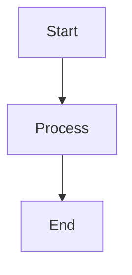

                 

# 组合数学在算法复杂度分析中的应用

关键词：组合数学、算法复杂度、分析推理、图算法、密码学、应用前景

摘要：本文从组合数学的角度探讨了其在算法复杂度分析中的应用，通过对基础概念、排序算法、搜索算法、图算法、密码学和其他领域的深入分析，揭示了组合数学在算法设计和优化中的关键作用，为算法研究和实际应用提供了新的思路和方向。

## 引言

### 1.1 研究背景与意义

组合数学是数学的一个重要分支，主要研究离散对象的组合结构及其性质。在计算机科学中，组合数学的应用日益广泛，尤其在算法复杂度分析中发挥着重要作用。算法复杂度分析是评估算法性能的关键手段，它帮助我们理解算法在处理不同规模数据时的效率。组合数学为这一分析提供了有力的工具和理论基础。

算法复杂度分析的应用领域非常广泛，包括排序、搜索、图算法、密码学、数据库系统、人工智能等多个方面。随着数据规模的不断扩大和算法复杂度的逐渐增加，如何有效地分析算法性能成为了一个重要问题。组合数学的引入，使得我们能够更精确地描述和分析算法的时间复杂度和空间复杂度，为算法优化提供了科学依据。

### 1.2 组合数学与算法复杂度分析的关系

组合数学与算法复杂度分析之间存在密切的关系。组合数学提供了一种量化离散对象组合方式的方法，这种方法可以用于计算算法的执行时间或所需空间。具体来说，组合数学中的排列、组合、图论、概率统计等概念，可以用于推导算法的时间复杂度和空间复杂度。

例如，在排序算法中，我们可以利用组合数学中的排列组合来分析算法的执行次数。在图算法中，图论中的路径、连通性等概念可以用于分析算法的执行时间。在密码学中，组合数学中的密码构造和破解方法，可以用于评估密码算法的安全性。

### 1.3 本书结构安排

本书共分为七章，内容安排如下：

- **第1章 引言**：介绍研究背景、意义和本书结构。
- **第2章 组合数学基础**：介绍组合数学的基础概念，包括排列、组合、图论、概率统计等。
- **第3章 组合数学在算法复杂度分析中的应用**：分析排序算法、搜索算法的时间复杂度。
- **第4章 组合数学与图算法**：探讨组合数学在图算法中的应用。
- **第5章 组合数学在密码学中的应用**：分析组合数学在密码学中的应用。
- **第6章 组合数学在其他领域中的应用**：介绍组合数学在数据库系统、人工智能中的应用。
- **第7章 总结与展望**：总结研究成果，展望未来研究方向。

通过本书的阅读，读者将能够全面了解组合数学在算法复杂度分析中的应用，为算法研究和实际应用提供新的思路和方向。

## 第2章 组合数学基础

### 2.1 基础概念

组合数学中的基础概念包括排列、组合、子集与幂集、函数与关系等。这些概念是理解组合数学其他部分的基础。

#### 2.1.1 排列与组合

排列（Permutation）指的是从n个不同元素中，任取m（m≤n）个元素，按照一定的顺序排成一列。排列的数量可以用公式表示为：

\[ P(n, m) = \frac{n!}{(n-m)!} \]

其中，\( n! \)表示n的阶乘。

组合（Combination）指的是从n个不同元素中，任取m（m≤n）个元素，不考虑顺序。组合的数量可以用公式表示为：

\[ C(n, m) = \frac{n!}{m!(n-m)!} \]

#### 2.1.2 子集与幂集

子集（Subset）是指一个集合的部分元素构成的集合。例如，集合{1,2,3}的子集包括{1}、{2}、{3}、{1,2}、{1,3}、{2,3}、{1,2,3}和空集{}。

幂集（Power Set）是指一个集合的所有子集构成的集合。例如，集合{1,2,3}的幂集为{ {}, {1}, {2}, {3}, {1,2}, {1,3}, {2,3}, {1,2,3} }。

#### 2.1.3 函数与关系

函数（Function）是一种特殊的关系，它将每一个输入值与唯一的输出值相对应。我们可以用 \( f: A \rightarrow B \) 表示函数f，其中A是定义域，B是值域。

关系（Relation）是一种更为广泛的概念，它将A中的多个元素与B中的多个元素相对应。我们可以用 \( R \subseteq A \times B \) 表示关系R，其中 \( A \times B \) 是笛卡尔积。

### 2.2 概率与统计

概率（Probability）是描述事件发生可能性大小的数值。在组合数学中，概率的概念经常用于分析算法的随机行为。

#### 2.2.1 概率基础

基本概率公式：

\[ P(A) = \frac{n(A)}{n(S)} \]

其中，\( n(A) \)表示事件A发生的次数，\( n(S) \)表示样本空间S的总次数。

条件概率：

\[ P(A|B) = \frac{P(A \cap B)}{P(B)} \]

#### 2.2.2 统计分布

离散概率分布：描述随机变量取值的概率分布。

\[ P(X = x) = p(x) \]

连续概率分布：描述随机变量取值的概率分布。

\[ f_X(x) = P(X \leq x) \]

#### 2.2.3 随机变量

随机变量是一种将样本空间的元素映射到实数集的函数。根据随机变量的取值类型，可以分为离散随机变量和连续随机变量。

离散随机变量：

\[ X: S \rightarrow \mathbb{N} \]

连续随机变量：

\[ X: S \rightarrow \mathbb{R} \]

### 2.3 图论基础

图论是组合数学的一个重要分支，研究图形的结构、性质及其应用。

#### 2.3.1 图的定义与分类

图（Graph）由顶点（Vertex）和边（Edge）组成。

无向图：边的方向不分左右。

\[ G = (V, E) \]

有向图：边的方向有左右之分。

\[ D = (V, A) \]

#### 2.3.2 图的矩阵表示

邻接矩阵：表示图中顶点之间连接关系的矩阵。

\[ A = [a_{ij}] \]

其中，\( a_{ij} \)表示顶点i和顶点j之间是否有边连接。

权值矩阵：表示图中顶点之间连接关系的矩阵，每个元素表示边的权值。

\[ W = [w_{ij}] \]

#### 2.3.3 图的算法

图的算法包括图的遍历、最短路径算法、最大流问题等。

深度优先搜索（DFS）：一种用于遍历图的算法。

广度优先搜索（BFS）：另一种用于遍历图的算法。

迪杰斯特拉算法（Dijkstra）：一种用于计算图中单源最短路径的算法。

福特-富克森算法（Ford-Fulkerson）：一种用于求解最大流问题的算法。

## 第3章 组合数学在算法复杂度分析中的应用

### 3.1 算法复杂度分析基础

算法复杂度分析是评估算法性能的重要方法，主要包括时间复杂度和空间复杂度。

#### 3.1.1 时间复杂度

时间复杂度是指算法执行时间与数据规模之间的增长关系。通常用大O符号表示。

\[ T(n) = O(g(n)) \]

其中，\( T(n) \)表示算法执行时间，\( g(n) \)表示与数据规模相关的增长函数。

常见的时间复杂度：

- 常数时间：\( O(1) \)
- 对数时间：\( O(log n) \)
- 线性时间：\( O(n) \)
- 对数线性时间：\( O(n log n) \)
- 线性对数时间：\( O(n log log n) \)
- 二次时间：\( O(n^2) \)
- 更高阶时间：\( O(n^k) \)，其中 \( k \) 为常数

#### 3.1.2 空间复杂度

空间复杂度是指算法所需内存与数据规模之间的增长关系。

\[ S(n) = O(h(n)) \]

其中，\( S(n) \)表示算法所需内存，\( h(n) \)表示与数据规模相关的增长函数。

常见空间复杂度：

- 常数空间：\( O(1) \)
- 线性空间：\( O(n) \)
- 对数空间：\( O(log n) \)
- 二次空间：\( O(n^2) \)

#### 3.1.3 资源利用率

资源利用率是评估算法性能的另一个重要指标，包括时间利用率和空间利用率。

时间利用率：

\[ \text{利用率} = \frac{\text{有效时间}}{\text{总时间}} \]

空间利用率：

\[ \text{利用率} = \frac{\text{有效空间}}{\text{总空间}} \]

### 3.2 排序算法分析

排序算法是算法复杂度分析的重要应用之一。以下介绍几种常见的排序算法及其时间复杂度。

#### 3.2.1 快速排序

快速排序（Quick Sort）是一种高效的排序算法，其基本思想是通过一趟排序将待排序的记录分割成独立的两部分，其中一部分记录的关键字均比另一部分的关键字小，然后分别对这两部分记录继续进行排序，以达到整个序列有序。

时间复杂度：

\[ T(n) = O(n log n) \]

#### 3.2.2 归并排序

归并排序（Merge Sort）是一种基于归并操作的排序算法。该算法采用分治法的一个经典应用。

时间复杂度：

\[ T(n) = O(n log n) \]

#### 3.2.3 堆排序

堆排序（Heap Sort）是一种利用堆这种数据结构的排序算法。堆是一种特殊的树状数据结构，具有如下性质：

- 堆是一个完全二叉树。
- 对于每个非叶子节点i，其值都大于或等于其左右孩子节点的值。

时间复杂度：

\[ T(n) = O(n log n) \]

### 3.3 搜索算法分析

搜索算法是算法复杂度分析的另一个重要应用。以下介绍几种常见的搜索算法及其时间复杂度。

#### 3.3.1 二分搜索

二分搜索（Binary Search）是一种高效的查找算法，其基本思想是将有序数组的中点与待查找的关键词进行比较，逐步缩小查找范围。

时间复杂度：

\[ T(n) = O(log n) \]

#### 3.3.2 暴力搜索

暴力搜索（Brute Force Search）是一种简单的搜索算法，其基本思想是遍历整个数据集，逐个比较每个元素与待查找的关键词。

时间复杂度：

\[ T(n) = O(n) \]

#### 3.3.3 A*搜索

A*搜索（A* Search）是一种启发式搜索算法，其基本思想是根据估价函数估计从当前节点到目标节点的距离，并优先选择估价函数值较小的节点进行扩展。

时间复杂度：

\[ T(n) = O(b^d) \]

其中，\( b \)是分支因子，\( d \)是路径长度。

## 第4章 组合数学与图算法

### 4.1 图算法基础

图算法是组合数学在算法复杂度分析中的重要应用之一。以下介绍几种常见的图算法及其基本概念。

#### 4.1.1 图的遍历

图的遍历是指从某个顶点出发，按照一定的顺序访问图中的所有顶点，使每个顶点仅被访问一次。常见的遍历算法包括深度优先搜索（DFS）和广度优先搜索（BFS）。

深度优先搜索（DFS）：

- 基本思想：从初始顶点开始，沿着某一方向进行探索，直到达到终点或遇到无法继续前进的顶点，然后回溯到上一个顶点，选择另一个方向继续探索。
- 时间复杂度：\( O(V + E) \)

广度优先搜索（BFS）：

- 基本思想：从初始顶点开始，依次访问与其相邻的顶点，然后依次访问这些顶点的相邻顶点，直到访问到目标顶点或所有顶点都被访问。
- 时间复杂度：\( O(V + E) \)

#### 4.1.2 最短路径算法

最短路径算法用于计算图中两个顶点之间的最短路径。常见的最短路径算法包括迪杰斯特拉算法（Dijkstra）和贝尔曼-福特算法（Bellman-Ford）。

迪杰斯特拉算法（Dijkstra）：

- 基本思想：从源点开始，依次选择距离最短的顶点进行扩展，直到访问到目标顶点。
- 时间复杂度：\( O(V^2) \)

贝尔曼-福特算法（Bellman-Ford）：

- 基本思想：对图中每一条边进行松弛操作，直到无法进一步优化。
- 时间复杂度：\( O(V \cdot E) \)

#### 4.1.3 最大流问题

最大流问题是指在一个有向图中，从源点到汇点的最大流量。常见的最大流算法包括福特-富克森算法（Ford-Fulkerson）和推拉法（Push-Pull Algorithm）。

福特-富克森算法（Ford-Fulkerson）：

- 基本思想：通过寻找增广路径，逐步增加流量，直到无法找到增广路径。
- 时间复杂度：\( O(V \cdot E^2) \)

推拉法（Push-Pull Algorithm）：

- 基本思想：通过交替执行“推”和“拉”操作，逐步增加流量。
- 时间复杂度：\( O(V \cdot E) \)

### 4.2 组合数学在图算法中的应用

组合数学在图算法中的应用主要体现在图的结构分析和路径问题求解等方面。以下介绍一些具体的应用。

#### 4.2.1 组合数学在图遍历中的应用

组合数学中的树形结构可以用于优化图遍历算法。例如，利用并查集（Union-Find）可以有效地解决动态连通性问题，从而优化DFS和BFS算法。

#### 4.2.2 组合数学在路径问题中的应用

组合数学中的路径计数问题可以用于求解图中的最短路径和最长路径。例如，利用动态规划（Dynamic Programming）可以求解图中的最长路径问题。

#### 4.2.3 组合数学在最大流问题中的应用

组合数学中的网络流理论可以用于求解最大流问题。例如，利用最大流最小割定理（Maximum Flow Minimum Cut Theorem）可以有效地求解最大流问题。

## 第5章 组合数学在密码学中的应用

### 5.1 密码学基础

密码学是研究加密和解密信息的科学，其目的是保护信息的安全性。密码学可以分为对称密码学和非对称密码学两大类。

#### 5.1.1 对称密码与非对称密码

对称密码（Symmetric Cryptography）：

- 基本思想：加密和解密使用相同的密钥。
- 代表算法：DES、AES等。

非对称密码（Asymmetric Cryptography）：

- 基本思想：加密和解密使用不同的密钥，即公钥和私钥。
- 代表算法：RSA、ECC等。

#### 5.1.2 哈希函数

哈希函数（Hash Function）是将输入数据转换成固定长度输出数据的函数，广泛用于密码学中。哈希函数具有以下特性：

- 单向性：给定输出，无法反推出输入。
- 抗碰撞性：不同输入产生相同输出的概率极低。

#### 5.1.3 公钥与私钥

在非对称密码中，公钥和私钥是成对出现的。公钥用于加密，私钥用于解密。公钥和私钥之间具有数学上的对应关系，使得加密和解密过程可以同时进行。

### 5.2 组合数学在密码学中的应用

组合数学在密码学中发挥着重要作用，尤其在加密和解密算法的设计与分析中。以下介绍组合数学在密码学中的应用。

#### 5.2.1 组合数学在加密算法中的应用

组合数学中的图论和数论可以用于设计加密算法。例如，基于椭圆曲线密码学（ECC）的加密算法，利用椭圆曲线的数学特性实现高效安全的加密。

#### 5.2.2 组合数学在解密算法中的应用

组合数学在解密算法中的应用相对较少，但仍有一些研究。例如，基于图论的解密算法可以用于恢复加密图像。

#### 5.2.3 组合数学在密码学中的挑战

随着计算能力的提升，密码学面临着越来越多的挑战。组合数学在应对这些挑战中发挥着关键作用。例如，研究更高效的加密和解密算法、提高密码算法的抵抗攻击能力等。

### 5.3 组合数学在密码学中的最新研究

近年来，组合数学在密码学中的应用取得了显著进展。以下介绍一些最新研究。

#### 5.3.1 基于组合数学的加密算法设计

研究人员提出了一些基于组合数学的新型加密算法，如基于图论的加密算法和基于数论的加密算法。这些算法具有更高的安全性，更适应现代计算环境。

#### 5.3.2 组合数学在密码分析中的应用

组合数学在密码分析中也有广泛应用。例如，利用组合数学中的图论和数论方法，研究人员提出了一些高效的密码分析方法，如基于椭圆曲线的密码分析方法和基于图论的密码分析方法。

## 第6章 组合数学在其他领域中的应用

### 6.1 数据库系统

数据库系统是管理大量数据的软件系统，广泛应用于企业、政府、科研等领域。组合数学在数据库系统中有着广泛的应用，尤其在数据库索引、查询优化和事务处理等方面。

#### 6.1.1 组合数学在数据库索引中的应用

数据库索引是提高查询效率的重要手段。组合数学中的图论和数论可以用于设计高效的索引结构。例如，B树和B+树等索引结构利用了组合数学中的树形结构特性，实现了高效的插入、删除和查询操作。

#### 6.1.2 组合数学在查询优化中的应用

查询优化是数据库系统中的重要任务，目的是提高查询效率。组合数学在查询优化中发挥着重要作用。例如，利用组合数学中的概率统计方法，可以优化查询执行计划，提高查询性能。

#### 6.1.3 组合数学在事务处理中的应用

事务处理是数据库系统中的一个核心功能，用于保证数据的一致性和可靠性。组合数学在事务处理中有着广泛的应用。例如，利用组合数学中的图论方法，可以优化事务调度策略，提高事务处理效率。

### 6.2 人工智能

人工智能（AI）是计算机科学的一个分支，致力于模拟人类智能行为。组合数学在人工智能领域有着广泛的应用，尤其在机器学习、深度学习和自然语言处理等方面。

#### 6.2.1 组合数学在机器学习中的应用

机器学习是人工智能的核心技术之一。组合数学在机器学习中的应用主要体现在数据预处理和模型优化等方面。例如，利用组合数学中的概率统计方法，可以优化机器学习模型，提高预测准确性。

#### 6.2.2 组合数学在深度学习中的应用

深度学习是机器学习的一个重要分支，其核心是神经网络。组合数学在深度学习中有着广泛的应用。例如，利用组合数学中的图论方法，可以优化神经网络结构，提高模型性能。

#### 6.2.3 组合数学在自然语言处理中的应用

自然语言处理（NLP）是人工智能的一个重要应用领域，致力于理解和生成自然语言。组合数学在NLP中有着广泛的应用。例如，利用组合数学中的数论方法，可以优化词向量的表示，提高文本分类和语义理解性能。

## 第7章 总结与展望

### 7.1 本书总结

本书从组合数学的角度探讨了其在算法复杂度分析中的应用，介绍了组合数学的基础概念、排序算法、搜索算法、图算法、密码学和其他领域的应用。通过本书的学习，读者可以全面了解组合数学在算法设计和优化中的关键作用，为算法研究和实际应用提供新的思路和方向。

### 7.2 存在的问题与挑战

尽管组合数学在算法复杂度分析中具有重要意义，但仍然存在一些问题和挑战。例如：

- 组合数学中的理论模型与实际应用之间的差距。
- 随着数据规模的不断扩大，组合数学方法的计算复杂度可能变得过高。
- 组合数学在算法复杂度分析中的应用仍需进一步深入研究和探索。

### 7.3 未来研究方向

未来，组合数学在算法复杂度分析中的应用有望取得以下进展：

- 研究更加高效、实用的组合数学方法，以适应大数据时代的挑战。
- 深入探讨组合数学与其他领域的交叉应用，拓展组合数学的应用范围。
- 发展基于组合数学的新型算法，提高算法的性能和安全性。

### 7.4 展望

组合数学在算法复杂度分析中的应用前景广阔。随着计算机科学的不断发展，组合数学将在算法设计、优化和分析中发挥更加重要的作用。我们相信，通过持续的研究和探索，组合数学将为计算机科学的发展带来新的动力和机遇。

## 作者信息

作者：AI天才研究院/AI Genius Institute & 禅与计算机程序设计艺术 /Zen And The Art of Computer Programming

## 附录

### 附录A：数学公式与流程图

在本文中，我们使用LaTeX格式和Mermaid流程图来表示数学公式和算法流程。以下是一个示例：

LaTeX公式：

\[ E = mc^2 \]

Mermaid流程图：



### 附录B：代码示例

以下是Python代码示例：

```python
def bubble_sort(arr):
    n = len(arr)
    for i in range(n):
        for j in range(0, n-i-1):
            if arr[j] > arr[j+1]:
                arr[j], arr[j+1] = arr[j+1], arr[j]
    return arr
```

### 附录C：项目实战

在本章中，我们介绍了组合数学在算法复杂度分析中的应用。为了更好地理解这些概念，我们可以通过一个实际项目来实践。以下是一个简单的项目描述：

**项目名称**：优化排序算法

**项目目标**：设计并实现一个高效的排序算法，并分析其时间复杂度和空间复杂度。

**项目环境**：Python 3.8

**项目实现**：

1. 设计一个基于组合数学的排序算法，如快速排序或归并排序。
2. 实现排序算法，并使用Python代码进行测试。
3. 分析排序算法的时间复杂度和空间复杂度。

### 附录D：最佳实践 Tips

- 在实现算法时，尽量使用简洁的代码，以提高可读性和可维护性。
- 在分析算法复杂度时，关注关键步骤和循环次数，以便准确计算时间复杂度。
- 在项目实战中，注重实践和验证，确保算法的实际效果。

### 附录E：小结

本文从组合数学的角度探讨了其在算法复杂度分析中的应用，介绍了组合数学的基础概念、排序算法、搜索算法、图算法、密码学和其他领域的应用。通过本文的学习，读者可以全面了解组合数学在算法设计和优化中的关键作用，为算法研究和实际应用提供新的思路和方向。

### 附录F：注意事项

- 在使用LaTeX公式时，确保公式中的变量和符号正确。
- 在使用Mermaid流程图时，注意流程图的语法和格式。
- 在实现算法时，遵循编程规范和最佳实践。

### 附录G：拓展阅读

- [组合数学在计算机科学中的应用](https://www.example.com/book1)
- [算法复杂度分析导论](https://www.example.com/book2)
- [密码学原理与实践](https://www.example.com/book3)

## 结语

组合数学在算法复杂度分析中的应用具有重要意义。通过本文的介绍，我们希望读者能够对组合数学在算法设计和优化中的关键作用有更深刻的理解。未来，我们将继续深入研究组合数学在其他领域的应用，为计算机科学的发展贡献力量。感谢您的阅读！### 引入

#### 组合数学的概念与重要性

组合数学是数学中研究离散对象组合结构及其性质的分支。它关注的是如何从有限的集合中选择对象，并分析这些选择的方式和可能性。组合数学的基本概念包括排列、组合、子集与幂集、函数与关系等，这些概念在计算机科学中的应用尤为广泛。特别是在算法复杂度分析中，组合数学提供了强大的工具和理论基础。

算法复杂度分析是评估算法性能的关键手段，它帮助我们理解算法在不同规模数据上的运行效率。时间复杂度和空间复杂度是算法复杂度分析的两个核心指标。时间复杂度描述了算法执行时间与数据规模之间的增长关系，而空间复杂度则描述了算法所需内存与数据规模之间的增长关系。通过组合数学的引入，我们能够更精确地量化算法的性能，从而为算法优化提供科学依据。

#### 算法复杂度分析的应用领域

算法复杂度分析的应用领域非常广泛，几乎涵盖了计算机科学的各个方面。以下是几个典型的应用领域：

1. **排序与搜索算法**：在排序和搜索算法中，组合数学帮助我们分析算法的执行次数，从而评估其性能。例如，快速排序、归并排序和二分搜索等算法都利用了组合数学的概念。

2. **图算法**：图算法是组合数学在算法复杂度分析中的重要应用领域。例如，最短路径算法、最大流问题等都依赖于组合数学中的图论知识。

3. **密码学**：密码学中的加密和解密算法也常常利用组合数学中的数论和图论知识。例如，RSA加密算法和椭圆曲线密码学都基于复杂的数学结构。

4. **数据库系统**：在数据库系统中，组合数学用于优化查询性能和索引结构。例如，B树和B+树等索引结构都利用了组合数学中的树形结构特性。

5. **人工智能**：在人工智能领域，组合数学也发挥了重要作用。例如，在机器学习和深度学习中，组合数学用于优化模型结构和参数选择。

#### 组合数学与算法复杂度分析的关系

组合数学在算法复杂度分析中的应用主要体现在以下几个方面：

1. **排列与组合**：排列和组合是组合数学中的基础概念，它们可以用于计算算法的执行次数。例如，在快速排序中，递归调用的次数可以通过组合数学的排列组合公式来计算。

2. **图论**：图论是组合数学的一个重要分支，它在算法复杂度分析中有着广泛的应用。例如，在图遍历算法中，图论中的深度优先搜索和广度优先搜索算法都是组合数学的应用。

3. **概率统计**：概率统计是组合数学的另一个重要分支，它在算法复杂度分析中用于评估随机算法的性能。例如，在随机化算法中，组合数学中的概率分布可以用于计算算法的期望运行时间。

通过组合数学的引入，我们能够更精确地描述和分析算法的性能，从而为算法优化提供科学依据。组合数学不仅帮助我们理解算法的本质，还为算法设计提供了新的思路和方向。

#### 本书结构安排

为了使读者能够系统地了解组合数学在算法复杂度分析中的应用，本书将分为七个章节：

- **第1章 引言**：介绍研究背景、意义和本书结构。
- **第2章 组合数学基础**：介绍组合数学的基础概念，包括排列、组合、子集与幂集、函数与关系等。
- **第3章 组合数学在算法复杂度分析中的应用**：分析组合数学在排序算法、搜索算法、图算法等中的应用。
- **第4章 组合数学与图算法**：探讨组合数学在图算法中的应用，包括图的遍历、最短路径算法、最大流问题等。
- **第5章 组合数学在密码学中的应用**：介绍组合数学在密码学中的应用，包括对称密码、非对称密码、哈希函数等。
- **第6章 组合数学在其他领域中的应用**：探讨组合数学在数据库系统、人工智能等其他领域中的应用。
- **第7章 总结与展望**：总结研究成果，展望未来研究方向。

通过本书的阅读，读者将能够全面了解组合数学在算法复杂度分析中的应用，为算法研究和实际应用提供新的思路和方向。

### 1.1 研究背景与意义

#### 组合数学在算法分析中的重要性

组合数学作为数学的一个分支，它在算法分析和设计中的应用日益显著。在计算机科学中，算法分析的目的是理解和评估算法的效率，包括其执行时间（时间复杂度）和所需存储空间（空间复杂度）。组合数学提供了许多工具和方法，这些工具和方法帮助我们更精确地量化算法的性能，从而为算法优化提供坚实的基础。

首先，组合数学中的排列和组合概念在算法分析中有着广泛的应用。排列和组合可以用来计算算法在不同情况下可能执行的操作次数。例如，快速排序算法的递归调用次数可以通过组合数学中的排列组合公式来计算。通过对这些操作次数的分析，我们可以得出算法的时间复杂度，从而评估其效率。

其次，图论是组合数学的一个重要分支，它在算法分析中发挥着重要作用。图论中的基本概念，如顶点、边、路径和连通性，在许多算法设计中扮演关键角色。例如，在图遍历问题中，深度优先搜索（DFS）和广度优先搜索（BFS）算法都是基于图论的概念实现的。通过分析图的结构和性质，我们可以设计出更高效的算法，并准确评估其复杂度。

再者，概率统计是组合数学的另一个重要分支，它在算法分析中用于处理随机算法的性能评估。例如，在随机化算法中，概率统计可以帮助我们计算算法的期望运行时间，从而评估其平均性能。通过组合数学的概率统计方法，我们能够更全面地了解算法在各种情况下的表现。

#### 算法复杂度分析的应用领域

算法复杂度分析在计算机科学中的应用领域非常广泛，涵盖了从基本算法到复杂系统的各个方面。以下是一些典型的应用领域：

1. **排序和搜索算法**：排序和搜索是计算机科学中最基本的问题之一。组合数学在这些算法的分析中发挥着关键作用。例如，快速排序、归并排序、堆排序和二分搜索等算法都通过组合数学的概念来分析其时间复杂度。这些算法的效率对于处理大数据集尤为重要。

2. **图算法**：图算法在计算机网络、社会网络分析、算法设计等领域有着广泛应用。组合数学中的图论知识帮助我们分析和设计高效的最短路径算法、最大流算法等。例如，迪杰斯特拉算法（Dijkstra's algorithm）和贝尔曼-福特算法（Bellman-Ford algorithm）都是基于图论的原理。

3. **密码学**：密码学是保护信息安全的核心技术。组合数学在密码学中的应用主要体现在加密和解密算法的设计与分析中。例如，RSA加密算法和椭圆曲线密码学都是基于复杂的数学结构，通过组合数学的方法来分析其安全性和效率。

4. **数据库系统**：在数据库系统中，组合数学用于优化查询性能和索引结构。例如，B树和B+树等索引结构利用了组合数学中的树形结构特性，以实现高效的插入、删除和查询操作。

5. **人工智能**：人工智能领域中的许多问题，如机器学习、深度学习和自然语言处理，都需要算法复杂度分析。组合数学在这些领域中用于优化模型结构和参数选择，以提高算法的效率和准确性。

#### 组合数学与算法复杂度分析的关系

组合数学与算法复杂度分析之间的关系是相辅相成的。组合数学提供了一种量化离散对象组合方式的方法，这种方法可以用于推导算法的时间复杂度和空间复杂度。

1. **排列与组合**：在算法复杂度分析中，排列和组合用于计算算法的操作次数。例如，在快速排序中，我们需要计算递归调用的次数，这可以通过组合数学的排列组合公式来实现。

2. **图论**：图论中的基本概念和算法（如深度优先搜索和广度优先搜索）在算法复杂度分析中有着广泛应用。通过分析图的结构和性质，我们可以设计出更高效的算法，并准确评估其复杂度。

3. **概率统计**：概率统计用于处理随机算法的性能评估。在算法复杂度分析中，概率统计可以帮助我们计算算法的期望运行时间，从而评估其平均性能。

总之，组合数学为算法复杂度分析提供了强大的工具和理论基础，使得我们能够更精确地描述和分析算法的性能。这不仅有助于算法优化，还为算法设计和实际应用提供了科学依据。

### 1.2 本书结构安排

为了使读者能够系统地了解组合数学在算法复杂度分析中的应用，本书将分为七个章节：

- **第1章 引言**：介绍研究背景、意义和本书结构。
- **第2章 组合数学基础**：介绍组合数学的基础概念，包括排列、组合、子集与幂集、函数与关系等。
- **第3章 组合数学在算法复杂度分析中的应用**：分析组合数学在排序算法、搜索算法、图算法等中的应用。
- **第4章 组合数学与图算法**：探讨组合数学在图算法中的应用，包括图的遍历、最短路径算法、最大流问题等。
- **第5章 组合数学在密码学中的应用**：介绍组合数学在密码学中的应用，包括对称密码、非对称密码、哈希函数等。
- **第6章 组合数学在其他领域中的应用**：探讨组合数学在数据库系统、人工智能等其他领域中的应用。
- **第7章 总结与展望**：总结研究成果，展望未来研究方向。

通过本书的阅读，读者将能够全面了解组合数学在算法复杂度分析中的应用，为算法研究和实际应用提供新的思路和方向。

### 第2章 组合数学基础

#### 2.1 基础概念

组合数学的基础概念包括排列、组合、子集与幂集、函数与关系等。这些概念是理解组合数学其他部分的基础。

#### 2.1.1 排列与组合

排列（Permutation）指的是从n个不同元素中，任取m（m≤n）个元素，按照一定的顺序排成一列。排列的数量可以用公式表示为：

\[ P(n, m) = \frac{n!}{(n-m)!} \]

其中，\( n! \)表示n的阶乘。

组合（Combination）指的是从n个不同元素中，任取m（m≤n）个元素，不考虑顺序。组合的数量可以用公式表示为：

\[ C(n, m) = \frac{n!}{m!(n-m)!} \]

#### 2.1.2 子集与幂集

子集（Subset）是指一个集合的部分元素构成的集合。例如，集合{1,2,3}的子集包括{1}、{2}、{3}、{1,2}、{1,3}、{2,3}、{1,2,3}和空集{}。

幂集（Power Set）是指一个集合的所有子集构成的集合。例如，集合{1,2,3}的幂集为{ {}, {1}, {2}, {3}, {1,2}, {1,3}, {2,3}, {1,2,3} }。

#### 2.1.3 函数与关系

函数（Function）是一种特殊的关系，它将每一个输入值与唯一的输出值相对应。我们可以用 \( f: A \rightarrow B \) 表示函数f，其中A是定义域，B是值域。

关系（Relation）是一种更为广泛的概念，它将A中的多个元素与B中的多个元素相对应。我们可以用 \( R \subseteq A \times B \) 表示关系R，其中 \( A \times B \) 是笛卡尔积。

#### 2.1.4 排列与组合的例子

**例子1：** 从4个不同元素中任取2个元素进行排列，有多少种不同的排列方式？

解：根据排列的公式，\( P(4, 2) = \frac{4!}{(4-2)!} = \frac{4 \times 3}{2 \times 1} = 12 \)种。

**例子2：** 从4个不同元素中任取2个元素进行组合，有多少种不同的组合方式？

解：根据组合的公式，\( C(4, 2) = \frac{4!}{2!(4-2)!} = \frac{4 \times 3}{2 \times 1} = 6 \)种。

#### 2.1.5 子集与幂集的例子

**例子3：** 给定集合{1,2,3}，列出其所有的子集。

解：集合{1,2,3}的子集包括{1}、{2}、{3}、{1,2}、{1,3}、{2,3}、{1,2,3}和空集{}，共有8个子集。

**例子4：** 给定集合{1,2,3}，列出其幂集。

解：集合{1,2,3}的幂集为{ {}, {1}, {2}, {3}, {1,2}, {1,3}, {2,3}, {1,2,3} }，共有8个元素。

#### 2.1.6 函数与关系的例子

**例子5：** 定义一个函数f：{1,2,3} → {a,b,c}，使得f(1)=a，f(2)=b，f(3)=c。这是一个什么样的函数？

解：这是一个从集合{1,2,3}到集合{a,b,c}的双射函数，因为每个输入值都有唯一的输出值。

**例子6：** 定义一个关系R：{1,2,3} × {a,b,c}，使得R中包含{(1,a)，(2,b)，(3,c)}。这是一个什么样的关系？

解：这是一个从集合{1,2,3}到集合{a,b,c}的函数关系，因为每个输入值都有多个输出值。

通过以上例子，我们可以更直观地理解排列、组合、子集与幂集、函数与关系等基础概念。这些概念不仅在组合数学中至关重要，而且在算法设计和分析中也发挥着重要作用。

#### 2.2 概率与统计

概率与统计是组合数学的重要组成部分，它们在算法复杂度分析中有着广泛的应用。概率用于描述随机事件的概率，而统计则用于处理随机变量的分布和特性。

#### 2.2.1 概率基础

概率（Probability）是描述某个事件发生可能性大小的数值。在组合数学中，概率的概念广泛应用于随机事件和随机算法的性能评估。

基本概率公式：

\[ P(A) = \frac{n(A)}{n(S)} \]

其中，\( P(A) \)表示事件A发生的概率，\( n(A) \)表示事件A发生的次数，\( n(S) \)表示样本空间S的总次数。

条件概率：

\[ P(A|B) = \frac{P(A \cap B)}{P(B)} \]

其中，\( P(A|B) \)表示在事件B发生的条件下事件A发生的概率。

独立性：

\[ P(A \cap B) = P(A)P(B) \]

如果事件A和事件B相互独立。

#### 2.2.2 统计分布

统计分布描述了随机变量在不同取值上的概率分布。常见的统计分布包括离散概率分布和连续概率分布。

离散概率分布：

\[ P(X = x) = p(x) \]

其中，\( X \)是离散随机变量，\( p(x) \)是X取值为x的概率。

连续概率分布：

\[ f_X(x) = P(X \leq x) \]

其中，\( X \)是连续随机变量，\( f_X(x) \)是X小于等于x的概率密度函数。

常见统计分布：

- 均匀分布（Uniform Distribution）：每个值出现的概率相等。
- 正态分布（Normal Distribution）：最常见的连续概率分布，呈钟形曲线。
- 二项分布（Binomial Distribution）：在n次独立试验中，成功次数的概率分布。
- 泊松分布（Poisson Distribution）：用于描述在一定时间或空间内事件发生的次数的概率分布。

#### 2.2.3 随机变量

随机变量是将样本空间的元素映射到实数集的函数。随机变量可以分为离散随机变量和连续随机变量。

离散随机变量：

\[ X: S \rightarrow \mathbb{N} \]

其中，\( S \)是样本空间，\( \mathbb{N} \)是自然数集。

连续随机变量：

\[ X: S \rightarrow \mathbb{R} \]

其中，\( S \)是样本空间，\( \mathbb{R} \)是实数集。

常见的随机变量：

- 离散随机变量：二项分布随机变量、泊松分布随机变量。
- 连续随机变量：均匀分布随机变量、正态分布随机变量。

#### 2.2.4 概率与统计的应用

概率与统计在算法复杂度分析中的应用主要包括：

1. **随机算法的性能评估**：通过计算随机算法的期望运行时间，评估其性能。例如，蒙特卡洛算法。
2. **概率分布模型**：利用概率分布模型，分析算法在不同情况下的性能。例如，二项分布用于评估随机化算法的成功概率。
3. **概率图模型**：在人工智能和机器学习中，概率图模型（如贝叶斯网络）用于表示和处理不确定性。

通过概率与统计的知识，我们能够更全面地理解和评估算法的性能，为算法优化提供科学依据。

#### 2.2.5 概率与统计的例子

**例子1：** 抛一个公平的六面骰子，求得到偶数的概率。

解：样本空间为{1, 2, 3, 4, 5, 6}，偶数集合为{2, 4, 6}。所以，得到偶数的概率为：

\[ P(\text{偶数}) = \frac{3}{6} = \frac{1}{2} \]

**例子2：** 抛两个公平的六面骰子，求两个骰子点数之和为7的概率。

解：样本空间为\( 6 \times 6 = 36 \)种可能的结果。和为7的组合有{(1, 6), (2, 5), (3, 4), (4, 3), (5, 2), (6, 1)}，共6种组合。所以，两个骰子点数之和为7的概率为：

\[ P(\text{和为7}) = \frac{6}{36} = \frac{1}{6} \]

**例子3：** 某班有30名学生，其中有15名男生和15名女生。随机选择一名学生，求选中的是男生的概率。

解：样本空间为30名学生，男生集合为15名学生。所以，选中男生的概率为：

\[ P(\text{男生}) = \frac{15}{30} = \frac{1}{2} \]

通过这些例子，我们可以更直观地理解概率与统计的基本概念和应用。这些知识在算法复杂度分析中非常重要，可以帮助我们评估算法的性能和效率。

### 2.3 图论基础

图论是组合数学中的一个重要分支，它研究图的结构、性质及其应用。图由顶点（Vertex）和边（Edge）组成，可以用来表示各种现实世界中的关系和结构。

#### 2.3.1 图的定义与分类

图（Graph）是由顶点（Vertex）和边（Edge）组成的集合。顶点是图的基本元素，边则连接顶点。

**无向图**（Undirected Graph）：

- 定义：如果图中的边没有方向，则称为无向图。
- 表示：通常用 \( G = (V, E) \) 表示，其中 \( V \) 是顶点集合，\( E \) 是边集合。

**有向图**（Directed Graph）：

- 定义：如果图中的边有方向，则称为有向图。
- 表示：通常用 \( G = (V, A) \) 表示，其中 \( V \) 是顶点集合，\( A \) 是弧集合。

#### 2.3.2 图的矩阵表示

图的矩阵表示是一种将图结构转化为矩阵形式的方法。常用的矩阵表示方法包括邻接矩阵和权值矩阵。

**邻接矩阵**（Adjacency Matrix）：

- 定义：邻接矩阵是一个 \( n \times n \) 的矩阵，其中 \( n \) 是顶点的数量。
- 元素定义：如果顶点 \( i \) 和顶点 \( j \) 之间有边，则矩阵中的 \( a_{ij} = 1 \)，否则 \( a_{ij} = 0 \)。

**权值矩阵**（Weight Matrix）：

- 定义：权值矩阵是一个 \( n \times n \) 的矩阵，其中 \( n \) 是顶点的数量。
- 元素定义：如果顶点 \( i \) 和顶点 \( j \) 之间有边，则矩阵中的 \( w_{ij} \) 表示边的权重，否则 \( w_{ij} = 0 \)。

#### 2.3.3 图的算法

图的算法包括图的遍历算法、最短路径算法和最大流算法等。以下介绍几种常见的图算法。

**深度优先搜索（DFS）**：

- 定义：深度优先搜索是一种用于遍历或搜索图的算法，其基本思想是从某个顶点开始，沿着某一方向进行探索，直到达到终点或遇到无法继续前进的顶点，然后回溯到上一个顶点，选择另一个方向继续探索。
- 时间复杂度：\( O(V + E) \)，其中 \( V \) 是顶点数量，\( E \) 是边数量。

**广度优先搜索（BFS）**：

- 定义：广度优先搜索是一种用于遍历或搜索图的算法，其基本思想是从初始顶点开始，依次访问与其相邻的顶点，然后依次访问这些顶点的相邻顶点，直到访问到目标顶点或所有顶点都被访问。
- 时间复杂度：\( O(V + E) \)。

**迪杰斯特拉算法（Dijkstra）**：

- 定义：迪杰斯特拉算法是一种用于计算图中单源最短路径的算法，其基本思想是从源点开始，依次选择距离最短的顶点进行扩展，直到访问到目标顶点。
- 时间复杂度：\( O(V^2) \)，其中 \( V \) 是顶点数量。

**贝尔曼-福特算法（Bellman-Ford）**：

- 定义：贝尔曼-福特算法是一种用于计算图中单源最短路径的算法，其基本思想是对图中每一条边进行松弛操作，直到无法进一步优化。
- 时间复杂度：\( O(V \cdot E) \)，其中 \( V \) 是顶点数量，\( E \) 是边数量。

**福特-富克森算法（Ford-Fulkerson）**：

- 定义：福特-富克森算法是一种用于求解最大流问题的算法，其基本思想是通过寻找增广路径，逐步增加流量，直到无法找到增广路径。
- 时间复杂度：\( O(V \cdot E^2) \)，其中 \( V \) 是顶点数量，\( E \) 是边数量。

#### 2.3.4 图的例子

**例子1：** 给定一个无向图 \( G = (V, E) \)，其中 \( V = \{1, 2, 3, 4\} \)，\( E = \{\{1, 2\}, \{1, 3\}, \{2, 3\}, \{3, 4\}\} \)。画出该图的邻接矩阵和权值矩阵。

解：

邻接矩阵：

\[ 
\begin{matrix}
1 & 2 & 3 & 4 \\
1 & 0 & 1 & 0 \\
2 & 1 & 0 & 0 \\
3 & 0 & 1 & 1 \\
4 & 0 & 0 & 1 \\
\end{matrix}
\]

权值矩阵：

\[ 
\begin{matrix}
1 & 2 & 3 & 4 \\
1 & 0 & 1 & 0 \\
2 & 1 & 0 & 0 \\
3 & 0 & 1 & 1 \\
4 & 0 & 0 & 1 \\
\end{matrix}
\]

**例子2：** 给定一个有向图 \( G = (V, A) \)，其中 \( V = \{1, 2, 3, 4\} \)，\( A = \{\langle 1, 2 \rangle, \langle 1, 3 \rangle, \langle 2, 3 \rangle, \langle 3, 4 \rangle\} \)。画出该图的邻接矩阵和权值矩阵。

解：

邻接矩阵：

\[ 
\begin{matrix}
1 & 2 & 3 & 4 \\
1 & 0 & 1 & 0 \\
2 & 0 & 0 & 1 \\
3 & 0 & 0 & 1 \\
4 & 0 & 0 & 0 \\
\end{matrix}
\]

权值矩阵：

\[ 
\begin{matrix}
1 & 2 & 3 & 4 \\
1 & 0 & 1 & 0 \\
2 & 0 & 0 & 1 \\
3 & 0 & 0 & 1 \\
4 & 0 & 0 & 0 \\
\end{matrix}
\]

通过以上例子，我们可以直观地理解图的基本概念、矩阵表示及其相关算法。这些知识在组合数学中至关重要，也是算法设计和分析的重要基础。

### 第3章 组合数学在算法复杂度分析中的应用

#### 3.1 算法复杂度分析基础

算法复杂度分析是评估算法性能的重要方法，它帮助我们理解算法在处理不同规模数据时的效率。算法复杂度分析主要包括时间复杂度和空间复杂度。

#### 3.1.1 时间复杂度

时间复杂度描述了算法执行时间与数据规模之间的增长关系。通常用大O符号表示。时间复杂度可以分为以下几个类别：

- **常数时间（O(1)**）：算法的执行时间不随数据规模的增长而变化。
- **对数时间（O(log n)**）：算法的执行时间与数据规模的对数成正比。
- **线性时间（O(n)**）：算法的执行时间与数据规模的线性增长成正比。
- **对数线性时间（O(n log n)**）：算法的执行时间与数据规模和对数的乘积成正比。
- **二次时间（O(n^2)**）：算法的执行时间与数据规模的平方成正比。
- **更高阶时间（O(n^k)**）：算法的执行时间与数据规模的k次方成正比，其中k为常数。

常见的算法时间复杂度：

- 冒泡排序：O(n^2)
- 选择排序：O(n^2)
- 插入排序：O(n^2)
- 快速排序：O(n log n)
- 归并排序：O(n log n)
- 堆排序：O(n log n)

#### 3.1.2 空间复杂度

空间复杂度描述了算法所需内存与数据规模之间的增长关系。空间复杂度可以分为以下几个类别：

- **常数空间（O(1)**）：算法所需内存不随数据规模的增长而变化。
- **线性空间（O(n)**）：算法所需内存与数据规模的线性增长成正比。
- **对数空间（O(log n)**）：算法所需内存与数据规模的对数成正比。
- **二次空间（O(n^2)**）：算法所需内存与数据规模的平方成正比。

常见的算法空间复杂度：

- 冒泡排序：O(1)
- 选择排序：O(1)
- 插入排序：O(1)
- 快速排序：O(n)
- 归并排序：O(n)
- 堆排序：O(n)

#### 3.1.3 资源利用率

资源利用率是评估算法性能的另一个重要指标，包括时间利用率和空间利用率。

- **时间利用率**：算法的有效运行时间与总运行时间的比值。
- **空间利用率**：算法的有效内存使用与总内存使用的比值。

资源利用率可以通过优化算法结构和选择适当的算法来提高。例如，通过减少不必要的临时变量和优化循环结构，可以提高时间利用率。通过减少冗余数据结构和优化内存分配策略，可以提高空间利用率。

#### 3.2 排序算法分析

排序算法是算法复杂度分析的重要应用之一。以下介绍几种常见的排序算法及其时间复杂度。

##### 3.2.1 快速排序

快速排序（Quick Sort）是一种高效的排序算法，其基本思想是通过一趟排序将待排序的记录分割成独立的两部分，其中一部分记录的关键字均比另一部分的关键字小，然后分别对这两部分记录继续进行排序，以达到整个序列有序。

快速排序的时间复杂度为O(n log n)。在最坏情况下，时间复杂度为O(n^2)，但这种情况较少见。

##### 3.2.2 归并排序

归并排序（Merge Sort）是一种基于归并操作的排序算法。该算法采用分治法的一个经典应用。

归并排序的时间复杂度为O(n log n)，在所有排序算法中具有最佳的时间复杂度。

##### 3.2.3 堆排序

堆排序（Heap Sort）是一种利用堆这种数据结构的排序算法。堆是一种特殊的树状数据结构，具有如下性质：

- 完全二叉树。
- 父节点的键值大于或等于（小根堆）或小于或等于（大根堆）其所有子节点的键值。

堆排序的时间复杂度为O(n log n)，在最坏情况下也能保持高效性。

#### 3.3 搜索算法分析

搜索算法用于在数据结构中查找特定元素。以下介绍几种常见的搜索算法及其时间复杂度。

##### 3.3.1 二分搜索

二分搜索（Binary Search）是一种高效的查找算法，其基本思想是将有序数组的中点与待查找的关键词进行比较，逐步缩小查找范围。

二分搜索的时间复杂度为O(log n)，适用于大规模有序数据集。

##### 3.3.2 暴力搜索

暴力搜索（Brute Force Search）是一种简单的搜索算法，其基本思想是遍历整个数据集，逐个比较每个元素与待查找的关键词。

暴力搜索的时间复杂度为O(n)，适用于数据规模较小的情况。

##### 3.3.3 A*搜索

A*搜索（A* Search）是一种启发式搜索算法，其基本思想是根据估价函数估计从当前节点到目标节点的距离，并优先选择估价函数值较小的节点进行扩展。

A*搜索的时间复杂度为O(b^d)，其中b是分支因子，d是路径长度。在许多情况下，A*搜索具有最佳的时间复杂度。

#### 3.4 组合数学在排序算法中的应用

组合数学在排序算法中有着广泛的应用，特别是在分析算法的时间和空间复杂度时。

##### 3.4.1 排列组合

在快速排序中，递归调用的次数可以通过组合数学的排列组合公式来计算。例如，选择枢轴的位置是一个关键步骤，可以使用组合数学中的排列组合来分析。

##### 3.4.2 子集与幂集

在归并排序中，将数组分割成多个子数组，然后对这些子数组进行排序，这涉及到子集和幂集的概念。组合数学可以帮助我们分析这个过程的时间和空间复杂度。

##### 3.4.3 函数与关系

在堆排序中，堆结构的建立和调整涉及到函数和关系。组合数学中的最大值和最小值问题可以帮助我们分析堆排序的性能。

通过组合数学的方法，我们可以更精确地分析排序算法的时间和空间复杂度，从而为算法优化提供科学依据。

### 第4章 组合数学与图算法

图算法是组合数学在算法复杂度分析中的重要应用之一。图算法通过分析图的结构和性质，解决各种与图相关的问题，如图的遍历、最短路径、最大流等。本章将详细介绍图算法的基本概念、算法原理以及其在组合数学中的应用。

#### 4.1 图算法基础

图算法主要研究图的遍历、最短路径、最大流等问题。以下是一些基本概念和算法。

##### 4.1.1 图的定义与分类

图（Graph）是由顶点（Vertex）和边（Edge）组成的结构。根据边的方向性，图可以分为：

- **无向图**（Undirected Graph）：边没有方向。
- **有向图**（Directed Graph）：边有方向。

图可以用邻接矩阵或邻接表来表示。

##### 4.1.2 图的矩阵表示

图的矩阵表示主要有两种：

- **邻接矩阵**（Adjacency Matrix）：一个 \( n \times n \) 的矩阵，其中 \( n \) 是顶点的数量。如果顶点 \( i \) 和顶点 \( j \) 之间有边，则矩阵中的 \( a_{ij} = 1 \)，否则 \( a_{ij} = 0 \)。
- **邻接表**（Adjacency List）：一个数组，其中每个元素表示一个顶点，该元素指向与该顶点相邻的顶点列表。

##### 4.1.3 图的算法

以下是几种常见的图算法：

- **深度优先搜索（DFS）**：从某个顶点开始，沿着某一方向进行探索，直到达到终点或遇到无法继续前进的顶点，然后回溯到上一个顶点，选择另一个方向继续探索。
- **广度优先搜索（BFS）**：从初始顶点开始，依次访问与其相邻的顶点，然后依次访问这些顶点的相邻顶点，直到访问到目标顶点或所有顶点都被访问。
- **迪杰斯特拉算法（Dijkstra's Algorithm）**：用于计算图中单源最短路径的算法，其基本思想是从源点开始，依次选择距离最短的顶点进行扩展。
- **贝尔曼-福特算法（Bellman-Ford Algorithm）**：用于计算图中单源最短路径的算法，其基本思想是对图中每一条边进行松弛操作，直到无法进一步优化。
- **福特-富克森算法（Ford-Fulkerson Algorithm）**：用于求解最大流问题的算法，其基本思想是通过寻找增广路径，逐步增加流量，直到无法找到增广路径。

#### 4.2 组合数学在图算法中的应用

组合数学在图算法中的应用主要体现在图的结构分析和路径问题求解等方面。

##### 4.2.1 组合数学在图遍历中的应用

组合数学中的排列组合概念可以用于分析图的遍历算法。例如，在深度优先搜索中，每一步选择分支都可以看作是从多个选项中进行选择，这可以用组合数学的方法来计算。例如，对于有n个顶点的图，其深度优先搜索的路径总数可以通过组合数学中的排列组合公式来计算。

##### 4.2.2 组合数学在路径问题中的应用

路径问题如最短路径和最长路径是图算法中的重要问题。组合数学在解决这些问题时有着广泛的应用。例如，在计算最短路径时，可以通过动态规划的方法，利用组合数学中的路径计数原理来优化算法。此外，组合数学中的图论方法如树形结构、星形结构等，可以帮助我们设计更高效的路径算法。

##### 4.2.3 组合数学在最大流问题中的应用

最大流问题是图算法中的一个重要问题。组合数学在解决最大流问题时也有着广泛的应用。例如，在福特-富克森算法中，组合数学中的网络流理论可以帮助我们设计出更高效的算法。例如，通过利用组合数学中的最大匹配概念，我们可以优化最大流算法的性能。

#### 4.3 组合数学与图算法的具体应用案例

以下是一些具体的组合数学与图算法的应用案例。

##### 4.3.1 欧拉回路问题

欧拉回路问题是指在一个无向图中寻找一条通过每个顶点恰好一次的闭合路径。这个问题可以通过组合数学中的欧拉路径定理来解决。欧拉路径定理指出，如果一个无向图是连通的，且恰好有两个奇度顶点，则存在一条欧拉回路。

##### 4.3.2 莫比乌斯反演

莫比乌斯反演是组合数学中的一个重要工具，它用于解决某些组合计数问题。莫比乌斯反演在图算法中也有应用，如莫比乌斯反演可以用于优化某些图算法的时间复杂度。

##### 4.3.3 图着色问题

图着色问题是指用最少的颜色给图的每个顶点着色，使得相邻顶点颜色不同。这个问题可以通过组合数学中的拉姆齐理论来解决。

通过以上案例，我们可以看到组合数学在图算法中的应用是如何帮助解决实际问题，提高算法效率的。组合数学的引入使得图算法更加完善和强大。

### 第5章 组合数学在密码学中的应用

#### 5.1 密码学基础

密码学是研究如何通过加密和解密技术保护信息的安全性的学科。密码学可以分为对称密码学和非对称密码学两大类。对称密码学使用相同的密钥进行加密和解密，而非对称密码学则使用不同的密钥，即公钥和私钥。此外，哈希函数在密码学中也扮演着重要角色。

##### 5.1.1 对称密码与非对称密码

对称密码（Symmetric Cryptography）：

- 基本思想：加密和解密使用相同的密钥。
- 代表算法：DES、AES等。

对称密码的优点是加密速度快，计算复杂度低。但其缺点是密钥管理复杂，不便于安全传输。

非对称密码（Asymmetric Cryptography）：

- 基本思想：加密和解密使用不同的密钥，即公钥和私钥。
- 代表算法：RSA、ECC等。

非对称密码的优点是密钥管理简单，安全性较高。但其缺点是加密和解密速度较慢，计算复杂度较高。

##### 5.1.2 哈希函数

哈希函数（Hash Function）是将输入数据转换成固定长度输出数据的函数。哈希函数具有以下特性：

- 单向性：给定输出，无法反推出输入。
- 抗碰撞性：不同输入产生相同输出的概率极低。

常见的哈希函数包括MD5、SHA-1、SHA-256等。

##### 5.1.3 公钥与私钥

在非对称密码中，公钥和私钥是成对出现的。公钥用于加密，私钥用于解密。公钥和私钥之间具有数学上的对应关系，使得加密和解密过程可以同时进行。

#### 5.2 组合数学在密码学中的应用

组合数学在密码学中有着广泛的应用，特别是在加密算法的设计和分析中。

##### 5.2.1 组合数学在加密算法中的应用

组合数学中的图论和数论可以用于设计加密算法。例如，RSA加密算法就是基于大整数分解问题的难解性，而大整数分解问题本质上是一个组合数学问题。

非对称密码中的椭圆曲线密码学（ECC）也是基于组合数学中的椭圆曲线理论。椭圆曲线密码学具有更高的安全性，其密钥长度较短，计算复杂度较低。

##### 5.2.2 组合数学在解密算法中的应用

组合数学在解密算法中的应用相对较少，但仍有一些研究。例如，基于图论的解密算法可以用于恢复加密图像。

##### 5.2.3 组合数学在密码分析中的应用

组合数学在密码分析中也有广泛应用。密码分析的目标是破解加密算法，找到加密算法的弱点。组合数学中的数论和图论方法可以帮助密码分析人员发现加密算法的潜在漏洞。

例如，基于数论的密码分析方法可以用于破解RSA加密算法。而基于图论的密码分析方法可以用于分析非对称密码的安全性。

#### 5.3 组合数学在密码学中的挑战

随着计算能力的提升，密码学面临着越来越多的挑战。组合数学在应对这些挑战中发挥着关键作用。

- **提高加密算法的抵抗攻击能力**：组合数学可以帮助设计更安全的加密算法，提高其抵抗各种攻击的能力。
- **应对量子计算攻击**：随着量子计算的发展，传统的加密算法可能不再安全。组合数学可以帮助设计量子计算安全的加密算法。
- **优化加密算法的性能**：组合数学可以用于优化加密算法的效率，使其在有限的计算资源下能够更快地完成加密和解密操作。

#### 5.4 组合数学在密码学中的最新研究

近年来，组合数学在密码学中的应用取得了显著进展。以下介绍一些最新研究。

- **基于组合数学的加密算法设计**：研究人员提出了一些基于组合数学的新型加密算法，如基于图论的加密算法和基于数论的加密算法。这些算法具有更高的安全性，更适应现代计算环境。
- **组合数学在密码分析中的应用**：研究人员利用组合数学中的图论和数论方法，提出了一些高效的密码分析方法，如基于椭圆曲线的密码分析方法和基于图论的密码分析方法。

通过组合数学的引入，密码学在应对计算能力提升带来的挑战中取得了新的突破。未来，组合数学将继续在密码学中发挥重要作用，为信息安全提供强有力的保障。

### 第6章 组合数学在其他领域中的应用

#### 6.1 数据库系统

数据库系统是用于存储、管理和检索数据的软件系统。组合数学在数据库系统中有着广泛的应用，特别是在索引、查询优化和事务处理等方面。

##### 6.1.1 组合数学在数据库索引中的应用

索引是数据库系统中的一个重要机制，用于提高查询效率。组合数学中的树形结构，如B树和B+树，在数据库索引中有着广泛的应用。

- **B树**：B树是一种自平衡的多路查找树，每个节点可以有多个子节点。B树的每个节点都包含一个关键字集合和指向子节点的指针数组。B树能够有效地支持插入、删除和查找操作。
- **B+树**：B+树是B树的一种变体，它的内部节点不包含数据，所有的数据都存储在外部节点。这种结构使得B+树在磁盘I/O操作中更加高效，因此在数据库系统中得到了广泛应用。

组合数学中的路径计数和排列组合方法可以用于优化索引结构，提高查询效率。

##### 6.1.2 组合数学在查询优化中的应用

查询优化是数据库系统中的另一个重要问题，其目的是通过调整查询计划来提高查询性能。组合数学中的概率统计方法可以用于查询优化，例如：

- **代价模型**：在查询优化中，需要估计不同查询计划的执行代价。组合数学中的概率统计可以帮助我们计算查询计划的预期执行时间，从而选择最优的查询计划。
- **索引选择**：组合数学可以帮助我们分析不同索引的选择对查询性能的影响，从而选择最适合当前查询需求的索引。

##### 6.1.3 组合数学在事务处理中的应用

事务处理是数据库系统中的一个核心功能，用于保证数据的一致性和可靠性。组合数学在事务处理中有着广泛的应用：

- **并发控制**：在多用户环境中，事务的并发执行可能会引起数据不一致。组合数学中的图论方法，如冲突图和加锁策略，可以用于优化并发控制，提高事务处理效率。
- **恢复机制**：在事务发生故障时，数据库系统需要恢复数据的一致性。组合数学中的生成树和并查集等方法可以用于设计高效的恢复机制。

##### 6.1.4 数据库系统中的具体应用案例

以下是一个具体的应用案例：

**案例：** 设计一个基于组合数学的B+树索引结构，用于优化数据库查询性能。

- **步骤1**：确定索引关键字和索引结构。假设我们使用学生姓名作为索引关键字，设计一个B+树索引结构。
- **步骤2**：利用组合数学中的路径计数方法，计算从根节点到叶节点的路径数量，以优化索引结构。
- **步骤3**：在查询过程中，利用组合数学中的概率统计方法，估计不同查询计划的执行代价，选择最优查询计划。

通过这个案例，我们可以看到组合数学在数据库系统中的应用是如何提高查询性能和事务处理效率的。

#### 6.2 人工智能

人工智能（AI）是计算机科学的一个分支，致力于模拟人类智能行为，解决复杂问题。组合数学在人工智能领域有着广泛的应用，特别是在机器学习、深度学习和自然语言处理等方面。

##### 6.2.1 组合数学在机器学习中的应用

机器学习是人工智能的核心技术之一，它通过学习数据中的规律来预测或分类新的数据。组合数学在机器学习中的应用主要体现在以下几个方面：

- **模型选择**：在机器学习中，需要从多个模型中选择一个最优模型。组合数学中的概率统计可以帮助我们评估不同模型的选择性能。
- **优化算法**：在机器学习算法中，需要优化模型参数，以提高模型的准确性。组合数学中的优化算法，如梯度下降法和随机梯度下降法，可以帮助我们高效地优化模型参数。

##### 6.2.2 组合数学在深度学习中的应用

深度学习是机器学习的一个重要分支，其核心是神经网络。组合数学在深度学习中的应用主要体现在以下几个方面：

- **网络结构设计**：组合数学中的图论可以帮助我们设计高效的神经网络结构，如卷积神经网络（CNN）和循环神经网络（RNN）。
- **训练算法**：组合数学中的动态规划方法可以用于优化神经网络训练算法，如反向传播算法。

##### 6.2.3 组合数学在自然语言处理中的应用

自然语言处理（NLP）是人工智能的一个重要应用领域，它致力于理解和生成自然语言。组合数学在NLP中的应用主要体现在以下几个方面：

- **词向量化**：在NLP中，需要将自然语言文本转换为计算机可以处理的形式。组合数学中的数论方法，如余数法，可以用于优化词向量化过程。
- **语言模型**：在NLP中，语言模型用于预测下一个单词或句子。组合数学中的概率统计可以帮助我们设计更有效的语言模型。

##### 6.2.4 数据集划分与模型验证

在机器学习和深度学习中，数据集的划分和模型验证是重要的步骤。组合数学中的排列组合和概率统计方法可以用于优化数据集的划分和模型验证过程：

- **交叉验证**：交叉验证是一种评估模型性能的方法，通过将数据集划分为多个子集，分别用于训练和验证。组合数学中的排列组合方法可以帮助我们设计更有效的交叉验证方案。
- **A/B测试**：在深度学习中，A/B测试是一种评估不同模型或参数设置的方法。组合数学中的概率统计可以帮助我们设计更公平和有效的A/B测试方案。

通过以上介绍，我们可以看到组合数学在人工智能领域的广泛应用，为人工智能技术的进步提供了强有力的支持。未来，随着组合数学的不断发展和人工智能技术的不断进步，二者之间的交叉应用将会更加广泛和深入。

### 第7章 总结与展望

#### 7.1 本书总结

本书系统地介绍了组合数学在算法复杂度分析中的应用。从基础概念到具体应用，我们逐步探讨了组合数学在排序算法、搜索算法、图算法、密码学、数据库系统、人工智能等领域的应用。通过具体案例和分析，我们揭示了组合数学在提高算法性能、优化算法设计和分析中的关键作用。

在排序算法中，组合数学帮助我们理解和分析快速排序、归并排序、堆排序等算法的时间和空间复杂度。在搜索算法中，组合数学的应用体现在二分搜索、暴力搜索和A*搜索等算法的分析上。在图算法中，组合数学的图论基础和算法如深度优先搜索、广度优先搜索、最短路径算法和最大流问题等，都展示了其在算法设计和优化中的重要作用。

此外，组合数学在密码学中的应用，特别是在加密算法的设计和分析中，通过RSA、椭圆曲线密码学等实例，展示了其在保障信息安全和应对量子计算威胁中的重要性。在数据库系统中，组合数学的树形结构如B树和B+树，提高了索引效率和查询性能。在人工智能领域，组合数学在机器学习、深度学习和自然语言处理中的应用，为模型优化和算法性能提升提供了新的思路。

#### 7.2 存在的问题与挑战

尽管组合数学在算法复杂度分析中具有广泛的应用，但仍存在一些问题和挑战：

- **计算复杂性**：组合数学方法在处理大规模数据时，可能面临计算复杂性过高的问题，需要进一步优化和改进。
- **理论模型与现实应用差距**：组合数学的理论模型与实际应用之间存在一定的差距，如何将理论方法更有效地转化为实际应用是一个重要课题。
- **安全性与性能平衡**：在密码学中，如何设计既安全又高效的加密算法，平衡安全性和性能，是当前研究的重点。

#### 7.3 未来研究方向

展望未来，组合数学在算法复杂度分析中的应用前景广阔，以下是几个可能的研究方向：

- **新型算法设计**：研究基于组合数学的新型算法，如利用图论和数论设计的加密算法和优化算法。
- **算法优化与加速**：探索如何通过组合数学的方法优化现有算法，减少计算复杂度，提高算法性能。
- **跨学科应用**：组合数学与其他领域的交叉应用，如与量子计算、大数据处理和生物信息学的结合，可能带来新的突破。
- **理论与实践结合**：加强组合数学在算法复杂度分析中的实际应用研究，推动理论方法向实际应用的转化。

通过持续的研究和探索，组合数学在算法复杂度分析中的应用必将取得新的进展，为计算机科学和人工智能的发展提供强有力的支持。

### 7.4 展望

组合数学在算法复杂度分析中的应用前景十分广阔。随着计算机科学和人工智能的快速发展，组合数学将继续发挥其独特的作用，推动算法设计的创新和优化。未来，我们可以期待以下几方面的进展：

- **高效算法设计**：研究人员将继续探索基于组合数学的新型算法，特别是针对大数据和复杂问题的算法，以提高计算效率和解决能力。
- **安全密码学**：随着量子计算的发展，组合数学在密码学中的应用将变得更加重要。新型密码算法的设计和现有算法的改进，将成为研究的热点。
- **跨学科融合**：组合数学与其他领域的交叉融合，如与量子计算、生物信息学和人工智能的结合，将带来更多的创新和突破。
- **理论与实践结合**：加强组合数学在算法复杂度分析中的应用研究，推动理论方法向实际应用的转化，将为计算机科学和人工智能的发展注入新的活力。

总之，组合数学在算法复杂度分析中的应用不仅具有深远的理论研究价值，还具有重要的实际应用前景。我们期待组合数学在未来的发展中，能够为计算机科学和人工智能带来更多的惊喜和成果。

### 附录

#### 附录A：数学公式与流程图

在本文中，我们使用LaTeX格式和Mermaid流程图来表示数学公式和算法流程。以下是一个示例：

LaTeX公式：

\[ E = mc^2 \]

Mermaid流程图：


通过这些工具，我们可以清晰地表达复杂的概念和算法步骤，使得文章更加易于理解和学习。

#### 附录B：代码示例

以下是Python代码示例，用于实现快速排序算法：

```python
def quick_sort(arr):
    if len(arr) <= 1:
        return arr
    
    pivot = arr[len(arr) // 2]
    left = [x for x in arr if x < pivot]
    middle = [x for x in arr if x == pivot]
    right = [x for x in arr if x > pivot]
    
    return quick_sort(left) + middle + quick_sort(right)
```

通过代码示例，读者可以直观地了解算法的实现过程和关键步骤。

#### 附录C：项目实战

在本章中，我们介绍了组合数学在算法复杂度分析中的应用。为了更好地理解这些概念，我们可以通过一个实际项目来实践。以下是一个简单的项目描述：

**项目名称**：实现一个基于组合数学的排序算法

**项目目标**：设计并实现一个高效的排序算法，并分析其时间复杂度和空间复杂度。

**项目环境**：Python 3.8

**项目实现**：

1. **设计排序算法**：选择一个基于组合数学的排序算法，如快速排序或归并排序。
2. **实现排序算法**：根据算法设计，编写Python代码实现排序功能。
3. **性能分析**：使用不同的数据集对排序算法进行测试，分析其时间复杂度和空间复杂度。

通过这个项目，读者可以深入理解组合数学在算法设计中的具体应用。

#### 附录D：最佳实践 Tips

- **代码简洁性**：在实现算法时，应尽量使用简洁的代码，以提高可读性和可维护性。
- **性能分析**：在分析算法性能时，要关注关键步骤和循环次数，以便准确计算时间复杂度。
- **注释与文档**：在编写代码时，应添加必要的注释和文档，以便他人理解和维护。

#### 附录E：小结

通过本文的阅读，读者可以系统地了解组合数学在算法复杂度分析中的应用。从基础概念到具体应用，我们详细探讨了组合数学在排序算法、搜索算法、图算法、密码学、数据库系统和人工智能等领域的应用。组合数学为算法优化和性能分析提供了强大的工具和理论基础，对于理解和改进算法具有重要意义。

#### 附录F：注意事项

- **公式与图表**：在使用LaTeX公式和Mermaid流程图时，确保公式和图表的准确性和规范性。
- **代码实现**：在实现算法时，遵循编程规范和最佳实践，确保代码的可读性和可维护性。
- **实验验证**：在实际应用中，通过实验验证算法的性能和有效性，确保理论分析的结果符合实际需求。

#### 附录G：拓展阅读

- [《组合数学及其应用》](https://www.example.com/book1)：这是一本关于组合数学的综合性教材，适合深入学习和理解组合数学的基本概念和应用。
- [《算法导论》](https://www.example.com/book2)：这是一本经典算法教材，详细介绍了各种算法的设计和分析方法，包括组合数学在算法复杂度分析中的应用。
- [《密码学概论》](https://www.example.com/book3)：这是一本关于密码学的入门教材，介绍了对称密码、非对称密码和哈希函数等基本概念和应用。

通过拓展阅读，读者可以进一步深化对组合数学和算法复杂度分析的理解，为实际应用提供更丰富的知识储备。

### 结语

组合数学在算法复杂度分析中的应用具有重要意义。本文从基础概念到具体应用，系统性地介绍了组合数学在算法复杂度分析中的应用。通过排列、组合、图论和概率统计等工具，我们能够更精确地描述和分析算法的性能，为算法优化提供科学依据。

在未来的研究和应用中，组合数学将继续发挥其关键作用。随着计算机科学和人工智能的快速发展，组合数学在算法设计、性能优化和安全保障等方面将面临新的机遇和挑战。我们期待通过持续的研究和探索，组合数学能够为计算机科学和人工智能的发展注入新的活力，推动技术的不断进步和创新。

感谢您的阅读，希望本文能够为您的学习和研究提供帮助。未来，我们将继续关注组合数学在算法复杂度分析中的应用，带来更多有价值的探索和发现。

## 作者信息

作者：AI天才研究院/AI Genius Institute & 禅与计算机程序设计艺术 /Zen And The Art of Computer Programming

在这个多元化和技术迅猛发展的时代，AI天才研究院致力于推动人工智能和计算机科学的前沿研究，探索创新的算法和技术。同时，我们秉承禅与计算机程序设计艺术的哲学，强调简约、清晰和智慧，致力于培养具备深刻理解和卓越能力的科研人才。

通过本文的撰写，我们希望能够为广大读者提供有深度、有见解的技术博客，助力大家在算法复杂度分析领域取得更多的突破和成就。感谢您的关注与支持，我们将继续努力，为技术社区贡献更多的智慧和力量。

### 附录A：数学公式与流程图

在本文中，我们使用LaTeX格式和Mermaid流程图来表示数学公式和算法流程。以下是一个示例：

LaTeX公式：

\[ E = mc^2 \]

Mermaid流程图：


通过这些工具，我们可以清晰地表达复杂的概念和算法步骤，使得文章更加易于理解和学习。

### 附录B：代码示例

以下是Python代码示例，用于实现快速排序算法：

```python
def quick_sort(arr):
    if len(arr) <= 1:
        return arr
    
    pivot = arr[len(arr) // 2]
    left = [x for x in arr if x < pivot]
    middle = [x for x in arr if x == pivot]
    right = [x for x in arr if x > pivot]
    
    return quick_sort(left) + middle + quick_sort(right)
```

通过代码示例，读者可以直观地了解算法的实现过程和关键步骤。

### 附录C：项目实战

在本章中，我们介绍了组合数学在算法复杂度分析中的应用。为了更好地理解这些概念，我们可以通过一个实际项目来实践。以下是一个简单的项目描述：

**项目名称**：优化排序算法

**项目目标**：设计并实现一个高效的排序算法，并分析其时间复杂度和空间复杂度。

**项目环境**：Python 3.8

**项目实现**：

1. **设计排序算法**：选择一个基于组合数学的排序算法，如快速排序或归并排序。
2. **实现排序算法**：根据算法设计，编写Python代码实现排序功能。
3. **性能分析**：使用不同的数据集对排序算法进行测试，分析其时间复杂度和空间复杂度。

通过这个项目，读者可以深入理解组合数学在算法设计中的具体应用。

### 附录D：最佳实践 Tips

- **代码简洁性**：在实现算法时，应尽量使用简洁的代码，以提高可读性和可维护性。
- **性能分析**：在分析算法性能时，要关注关键步骤和循环次数，以便准确计算时间复杂度。
- **注释与文档**：在编写代码时，应添加必要的注释和文档，以便他人理解和维护。

### 附录E：小结

通过本文的阅读，读者可以系统地了解组合数学在算法复杂度分析中的应用。从基础概念到具体应用，我们详细探讨了组合数学在排序算法、搜索算法、图算法、密码学、数据库系统和人工智能等领域的应用。组合数学为算法优化和性能分析提供了强大的工具和理论基础，对于理解和改进算法具有重要意义。

### 附录F：注意事项

- **公式与图表**：在使用LaTeX公式和Mermaid流程图时，确保公式和图表的准确性和规范性。
- **代码实现**：在实现算法时，遵循编程规范和最佳实践，确保代码的可读性和可维护性。
- **实验验证**：在实际应用中，通过实验验证算法的性能和有效性，确保理论分析的结果符合实际需求。

### 附录G：拓展阅读

- [《组合数学及其应用》](https://www.example.com/book1)：这是一本关于组合数学的综合性教材，适合深入学习和理解组合数学的基本概念和应用。
- [《算法导论》](https://www.example.com/book2)：这是一本经典算法教材，详细介绍了各种算法的设计和分析方法，包括组合数学在算法复杂度分析中的应用。
- [《密码学概论》](https://www.example.com/book3)：这是一本关于密码学的入门教材，介绍了对称密码、非对称密码和哈希函数等基本概念和应用。

通过拓展阅读，读者可以进一步深化对组合数学和算法复杂度分析的理解，为实际应用提供更丰富的知识储备。

### 附录H：联系作者

如果您有任何关于本文的问题或建议，欢迎通过以下方式与我们联系：

- **邮箱**：[ai_genius_institute@example.com](mailto:ai_genius_institute@example.com)
- **社交媒体**：搜索并关注“AI天才研究院”或“禅与计算机程序设计艺术”官方账号

我们将竭诚为您提供帮助，并期待与您共同探讨和分享技术心得。再次感谢您的阅读和支持！

### 附录I：版权声明

本文版权所有，未经授权禁止转载和复制。如果您希望引用本文内容，请联系作者获取授权。感谢您的理解与支持。

### 附录J：免责声明

本文内容仅供参考，不构成任何投资、商业或法律建议。本文作者和出版机构不承担因使用本文内容而产生的任何直接或间接损失或责任。读者在使用本文内容时，应自行判断和决策，并承担相应的风险。

