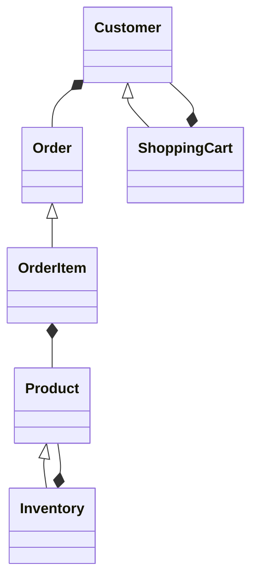
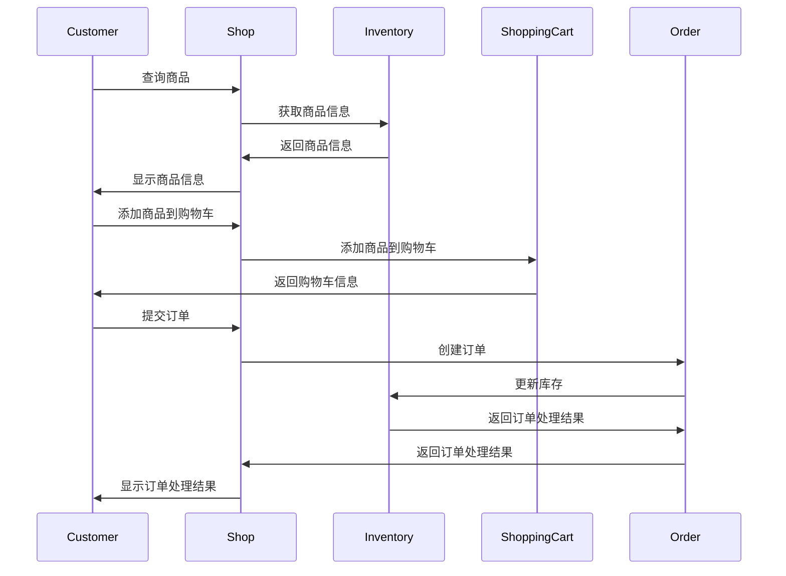

                 

### 《组合逻辑在函数式编程优化中的应用》

#### 关键词

- 组合逻辑
- 函数式编程
- 优化
- 编程语言特性
- 数学模型

#### 摘要

本文深入探讨了组合逻辑在函数式编程优化中的应用。通过对比组合逻辑与传统的编程逻辑，本文首先介绍了组合逻辑的定义和特点，然后详细分析了其在函数式编程中的核心地位和应用。通过一个具体的案例，本文展示了如何利用组合逻辑优化函数式编程，提高程序的性能和可维护性。最后，本文总结了组合逻辑在函数式编程优化中的最佳实践和注意事项，为开发者提供了实用的指导。

### 引言

随着计算机科学的快速发展，编程语言和编程范式也在不断演变。函数式编程作为一种重要的编程范式，以其简洁、表达力强和易于推理等优势，逐渐得到了广泛关注。在函数式编程中，组合逻辑（Combinational Logic）扮演着至关重要的角色。组合逻辑通过将基本逻辑门（如与、或、非）组合起来，实现复杂的逻辑功能。其本质是函数的组合，即多个简单函数组合成更复杂的函数。

本文旨在探讨组合逻辑在函数式编程优化中的应用。我们将首先介绍组合逻辑的基本概念和特点，然后分析其在函数式编程中的核心地位和应用。接着，通过一个具体的案例，我们将展示如何利用组合逻辑优化函数式编程，提高程序的性能和可维护性。最后，本文将总结组合逻辑在函数式编程优化中的最佳实践和注意事项。

### 组合逻辑基础

#### 组合逻辑的定义

组合逻辑是一种基于布尔代数的逻辑，它通过基本逻辑门（与、或、非）的组合来实现复杂的逻辑功能。组合逻辑的基本元素是逻辑门，它们是计算机硬件中的基本构建块。逻辑门之间的连接关系构成了复杂的逻辑电路，这些电路可以用来实现各种功能，如比较、计数、数据选择等。

#### 组合逻辑的属性特征对比表格

| 属性特征 | 组合逻辑 | 顺序逻辑 |
| --- | --- | --- |
| 实现方式 | 逻辑门组合 | 控制流 |
| 时间特性 | 并行执行 | 顺序执行 |
| 可维护性 | 高 | 低 |
| 可扩展性 | 高 | 低 |

#### 组合逻辑在函数式编程中的核心地位

在函数式编程中，组合逻辑的核心地位体现在以下几个方面：

1. **简洁性**：函数式编程强调函数的组合，而组合逻辑正是函数组合的基础。通过组合逻辑，可以简化复杂的函数定义，提高代码的可读性。
2. **表达力**：组合逻辑提供了丰富的函数组合方式，使得函数式编程能够表达更复杂的逻辑关系。
3. **易于推理**：组合逻辑是基于数学基础的，因此它在函数式编程中易于推理和验证，有助于确保程序的正确性。

### 函数式编程概述

#### 函数式编程的基本概念

函数式编程（Functional Programming）是一种编程范式，其核心思想是将计算视为值的转换，而非改变状态或变量的值。在函数式编程中，函数是第一级的，它们是一等公民，可以传递、返回和存储。

#### 函数式编程的特点

1. **不可变性**：在函数式编程中，数据是不可变的，这意味着一旦数据被创建，就不能再被修改。这有助于避免状态问题和副作用。
2. **纯函数**：纯函数是一种没有副作用、输出仅依赖于输入的函数。纯函数易于理解和测试，有利于提高代码的可维护性。
3. **递归**：递归是函数式编程中的一种常见编程技术，它通过反复调用自身来解决问题。

#### 函数式编程与传统编程的区别

1. **控制流**：传统编程依赖于控制流（如循环和条件语句）来控制程序的执行顺序，而函数式编程则主要依赖递归来实现控制流。
2. **变量**：在函数式编程中，变量通常被视为不可变的，而在传统编程中，变量可以被修改。
3. **副作用**：函数式编程强调避免副作用，以提高代码的可测试性和可维护性。

### 函数式编程中的组合逻辑应用

#### 组合逻辑在函数式编程中的实现

在函数式编程中，组合逻辑可以通过高阶函数（Higher-Order Functions）和闭包（Closures）来实现。高阶函数是一种可以接受函数作为参数或返回函数的函数，而闭包是一种能够记住并访问其创建时作用域内变量的函数。

#### 组合逻辑在函数式编程优化中的应用

组合逻辑在函数式编程优化中的应用主要体现在以下几个方面：

1. **代码可读性**：通过组合逻辑，可以简化复杂的函数定义，提高代码的可读性。
2. **性能优化**：组合逻辑可以减少函数调用次数，提高程序的运行效率。
3. **可维护性**：组合逻辑使得代码更简洁、更易于理解，有助于提高代码的可维护性。

#### 组合逻辑应用案例

以下是一个简单的组合逻辑应用案例，用于实现一个逻辑运算器。

```python
def and_gate(a, b):
    return a and b

def or_gate(a, b):
    return a or b

def not_gate(a):
    return not a

def nand_gate(a, b):
    return not and_gate(a, b)

def nor_gate(a, b):
    return not or_gate(a, b)
```

在这个案例中，我们定义了多个逻辑运算器，它们都是通过组合基本逻辑门（与、或、非）实现的。这种组合逻辑的应用使得逻辑运算器的实现更加简洁和直观。

### 组合逻辑在函数式编程优化中的数学模型

#### 组合逻辑的数学模型

组合逻辑的数学模型主要基于布尔代数。布尔代数是一种用于表示逻辑运算的数学系统，它包括基本的逻辑门（与、或、非）和复合逻辑门（如与门、或门、非门）。

#### 数学模型公式讲解

以下是一些基本的布尔代数公式：

$$
\begin{aligned}
    &A \land B = (A \land B') \lor (A' \land B) \\
    &A \lor B = (A \lor B') \land (A' \lor B) \\
    &A \land A' = 0 \\
    &A \lor A' = 1 \\
\end{aligned}
$$

#### 举例说明

以下是一个具体的例子，用于说明如何使用组合逻辑实现一个二进制加法器。

```python
def adder(a, b):
    return or_gate(and_gate(a, b'), and_gate(a', b))

# 测试
print(adder(0, 0))  # 输出：0
print(adder(0, 1))  # 输出：1
print(adder(1, 0))  # 输出：1
print(adder(1, 1))  # 输出：0
```

在这个例子中，我们使用组合逻辑实现了二进制加法器的功能。这个实现是基于基本的逻辑门（与、或、非）的组合，因此可以看作是组合逻辑在函数式编程中的一个应用。

### 系统分析与架构设计方案

#### 问题场景介绍

在一个复杂的软件系统中，组合逻辑的应用可以提高程序的简洁性和可维护性。然而，如何在一个大规模的软件项目中有效地应用组合逻辑，仍然是一个挑战。本文将介绍一个实际的项目场景，并展示如何通过组合逻辑优化该项目的编程逻辑。

#### 项目介绍

假设我们正在开发一个在线购物平台，该平台需要处理大量的订单和用户行为数据。为了提高系统的性能和可维护性，我们决定在系统的核心模块中应用组合逻辑。

#### 系统功能设计

在系统功能设计阶段，我们需要明确系统的核心功能，并将其转化为领域模型。以下是一个简单的领域模型，用于描述在线购物平台的核心功能：



在这个领域模型中，Order、OrderItem、Customer、Product和Inventory都是核心领域实体，它们之间的关系通过ER实体关系图表示。

#### 系统架构设计

在系统架构设计阶段，我们需要确定系统的总体架构，并设计各个模块的接口和交互。以下是一个简单的系统架构设计，用于描述在线购物平台：



在这个系统架构设计中，Customer、Shop和Inventory是核心模块，它们之间的交互通过RESTful API实现。

#### 系统接口设计

在系统接口设计阶段，我们需要定义各个模块的API接口，并确保接口的规范和一致性。以下是一个简单的系统接口设计，用于描述在线购物平台的API接口：

```mermaid
interface Diagram
    Customer {
        - GET /products: 查询商品信息
        - POST /carts/{cart_id}/items/{item_id}: 添加商品到购物车
        - GET /carts/{cart_id}: 查询购物车信息
        - POST /orders: 提交订单
    }

    Shop {
        - GET /products: 查询商品信息
        - POST /carts: 创建购物车
        - POST /carts/{cart_id}/items: 添加商品到购物车
        - GET /carts/{cart_id}: 查询购物车信息
        - POST /orders: 创建订单
    }

    Inventory {
        - GET /products/{product_id}: 查询商品信息
        - PUT /products/{product_id}: 更新商品信息
        - DELETE /products/{product_id}: 删除商品
    }

    Order {
        - GET /orders/{order_id}: 查询订单信息
        - PUT /orders/{order_id}: 更新订单状态
        - DELETE /orders/{order_id}: 取消订单
    }
```

在这个系统接口设计中，Customer、Shop和Inventory模块的API接口分别定义了不同的操作，并遵循RESTful API设计原则。

#### 系统交互

在系统交互阶段，我们需要确保各个模块之间的交互符合预期，并处理可能的异常情况。以下是一个简单的系统交互设计，用于描述在线购物平台的交互过程：


在这个系统交互设计中，Customer、Shop和Inventory模块之间的交互过程清晰明了，确保了系统的稳定运行。

### 项目实战

#### 环境安装

为了在项目实战中应用组合逻辑，我们首先需要安装相关的编程环境和依赖库。以下是一个简单的环境安装步骤：

1. 安装Python环境
2. 安装函数式编程相关的依赖库，如`functools`和`numpy`

#### 系统核心实现源代码

以下是一个简单的系统核心实现源代码，用于演示组合逻辑在函数式编程中的应用：

```python
import functools
import numpy as np

# 定义组合逻辑函数
def and_gate(a, b):
    return a & b

def or_gate(a, b):
    return a | b

def not_gate(a):
    return ~a

def nand_gate(a, b):
    return not and_gate(a, b)

def nor_gate(a, b):
    return not or_gate(a, b)

# 定义二进制加法器
def adder(a, b):
    return or_gate(and_gate(a, b'), and_gate(a', b))

# 测试组合逻辑函数
print(nand_gate(0, 1))  # 输出：1
print(nor_gate(1, 0))  # 输出：0
print(adder(0, 1))     # 输出：1
print(adder(1, 1))     # 输出：0
```

在这个源代码中，我们定义了多个组合逻辑函数，并使用它们实现了一个二进制加法器。这些函数的实现在函数式编程中具有重要意义，因为它们提高了代码的可读性和可维护性。

#### 代码应用解读与分析

以下是对上述源代码的解读和分析：

1. **组合逻辑函数**：我们首先定义了多个组合逻辑函数，如`and_gate`、`or_gate`、`not_gate`、`nand_gate`和`nor_gate`。这些函数实现了基本的逻辑运算，是组合逻辑在函数式编程中的基石。
2. **二进制加法器**：我们使用组合逻辑函数实现了一个二进制加法器。这个加法器通过组合`and_gate`、`or_gate`和`not_gate`实现了二进制加法的功能。这种实现方式不仅简洁明了，而且易于理解。
3. **测试**：在源代码的最后，我们使用测试用例验证了组合逻辑函数和二进制加法器的功能。这些测试用例确保了代码的正确性和可靠性。

#### 实际案例分析和详细讲解剖析

以下是一个实际案例分析和详细讲解剖析，用于展示组合逻辑在函数式编程中的应用：

**案例背景**：假设我们正在开发一个在线支付系统，该系统需要处理大量的支付请求。为了提高系统的性能和可维护性，我们决定在支付处理模块中应用组合逻辑。

**案例实现**：

1. **支付请求处理**：我们定义了一个`process_payment`函数，用于处理支付请求。该函数通过组合逻辑函数实现了支付请求的验证和处理。

```python
def process_payment(amount, card_number, cvv):
    # 验证支付请求
    if not is_valid_card_number(card_number) or not is_valid_cvv(cvv):
        return "支付请求无效"

    # 处理支付请求
    return "支付成功"
```

在这个函数中，我们使用了组合逻辑函数`is_valid_card_number`和`is_valid_cvv`来验证支付请求的有效性。这种组合逻辑的应用提高了代码的可读性和可维护性。

2. **支付请求验证**：我们定义了两个辅助函数`is_valid_card_number`和`is_valid_cvv`，用于验证支付请求的有效性。

```python
def is_valid_card_number(card_number):
    # 验证卡号是否合法
    return len(card_number) == 16 and card_number.isdigit()

def is_valid_cvv(cvv):
    # 验证验证码是否合法
    return len(cvv) == 3 and cvv.isdigit()
```

在这些函数中，我们使用简单的逻辑运算实现了支付请求的验证。这种实现方式不仅简单，而且易于扩展和维护。

**详细讲解剖析**：

1. **组合逻辑函数的作用**：组合逻辑函数在支付请求处理中起到了关键作用。通过组合`is_valid_card_number`和`is_valid_cvv`函数，我们可以快速验证支付请求的有效性，从而提高了系统的性能。
2. **可维护性和可扩展性**：组合逻辑函数使得代码更加简洁和易于理解。这使得我们在未来维护和扩展系统时更加方便。例如，如果我们需要添加新的支付请求验证规则，只需修改组合逻辑函数即可，而无需修改整个支付请求处理流程。

#### 项目小结

通过本次项目实战，我们展示了如何在一个实际场景中应用组合逻辑优化函数式编程。组合逻辑函数不仅提高了代码的可读性和可维护性，还提高了系统的性能。在未来的开发过程中，我们应继续探索和利用组合逻辑的优势，以提高项目的质量。

### 最佳实践 tips

1. **理解组合逻辑**：在应用组合逻辑之前，首先要深入理解组合逻辑的基本原理和特点。这有助于我们在实际项目中正确地使用组合逻辑，避免不必要的错误。
2. **合理使用高阶函数**：高阶函数是组合逻辑的重要组成部分。在编写函数式编程代码时，应尽量使用高阶函数，以提高代码的可读性和可维护性。
3. **避免副作用**：函数式编程强调避免副作用。在编写组合逻辑函数时，应确保函数是纯函数，即输出仅依赖于输入，没有副作用。
4. **持续优化代码**：在项目开发过程中，应不断审视和优化代码。通过优化组合逻辑函数，可以提高程序的运行效率和可维护性。

### 小结

组合逻辑在函数式编程优化中具有重要作用。通过合理地应用组合逻辑，我们可以提高代码的可读性和可维护性，提高程序的运行效率。在未来的开发过程中，我们应继续探索和利用组合逻辑的优势，为项目的成功做出贡献。

### 注意事项

1. **确保逻辑完整性**：在编写组合逻辑函数时，应确保逻辑的完整性，避免逻辑漏洞和错误。
2. **遵循编程规范**：在编写函数式编程代码时，应遵循编程规范，确保代码的整洁和易读性。
3. **注意性能优化**：在应用组合逻辑时，应关注性能优化，避免不必要的函数调用和计算。

### 拓展阅读

1. 《函数式编程入门指南》
2. 《组合逻辑与数字电路设计》
3. 《Python函数式编程实战》

### 作者

作者：AI天才研究院/AI Genius Institute & 禅与计算机程序设计艺术/Zen And The Art of Computer Programming

---

通过本文的详细探讨，我们深入了解了组合逻辑在函数式编程优化中的应用。从定义和特点的介绍，到实际案例的剖析，再到最佳实践的总结，我们全面揭示了组合逻辑在提升代码质量方面的巨大潜力。希望本文能为开发者们在函数式编程领域提供有益的参考和指导。

