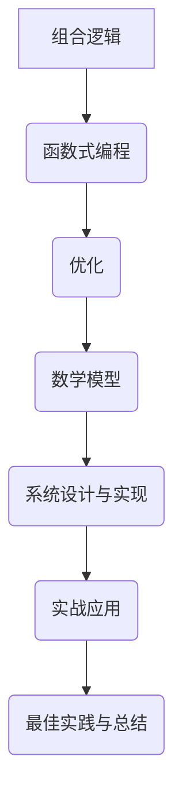
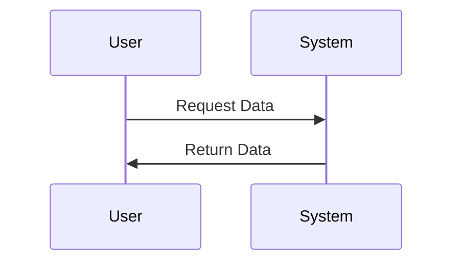

                 


### 设计目录大纲的步骤如下：

#### 1. 确定书籍的基本结构
首先，明确书籍的整体结构，包括引言、背景介绍、核心概念、算法原理、系统设计与实现、实战应用、总结与展望等部分。

#### 2. 设计具体章节内容
根据书籍的基本结构，逐一设计各个章节的内容。对于每一章节，确定其主要的小节和子小节，确保内容丰富且逻辑清晰。

#### 3. 重点关注内容完整性
确保书籍目录大纲的完整性，特别是核心章节的内容，如背景介绍、核心概念与联系、算法原理讲解、数学模型和数学公式、系统分析与架构设计方案、项目实战等。

#### 4. 使用 Markdown 格式
按照要求使用 Markdown 格式编写目录大纲，确保格式正确，如使用 #, ##, ### 等符号来区分不同级别的标题。

#### 5. 控制字数在2000字以内
在编写过程中注意控制字数，确保目录大纲的总字数不超过2000字。

### 开始设计目录大纲：

```markdown
# 《组合逻辑在函数式编程优化中的应用》目录大纲

# 第一部分：背景介绍

## 1. 引言

### 1.1 问题背景

### 1.2 问题描述

### 1.3 问题解决

### 1.4 边界与外延

## 2. 组合逻辑基础

### 2.1 组合逻辑的定义

### 2.2 组合逻辑的属性特征对比表格

### 2.3 组合逻辑在函数式编程中的核心地位

## 3. 函数式编程概述

### 3.1 函数式编程的基本概念

### 3.2 函数式编程的特点

### 3.3 函数式编程与传统编程的区别

## 4. 函数式编程中的组合逻辑应用

### 4.1 组合逻辑在函数式编程中的实现

### 4.2 组合逻辑在函数式编程优化中的应用

### 4.3 组合逻辑应用案例

## 5. 组合逻辑在函数式编程优化中的数学模型

### 5.1 组合逻辑的数学模型

### 5.2 数学模型公式讲解

### 5.3 举例说明

## 6. 系统分析与架构设计方案

### 6.1 问题场景介绍

### 6.2 系统功能设计

### 6.3 系统架构设计

### 6.4 系统接口设计

### 6.5 系统交互

## 7. 项目实战

### 7.1 环境安装

### 7.2 系统核心实现源代码

### 7.3 代码应用解读与分析

### 7.4 实际案例分析和详细讲解剖析

### 7.5 项目小结

## 8. 最佳实践与总结

### 8.1 最佳实践 tips

### 8.2 小结

### 8.3 注意事项

### 8.4 拓展阅读
```

以上目录大纲涵盖了书籍的核心内容，并且遵循了 Markdown 格式的要求。接下来，可以进一步细化每一章节的内容，确保目录大纲的完整性和逻辑性。每一章节的小节和子小节都需要包含具体、详细的讲解内容，使得读者能够系统地了解组合逻辑在函数式编程优化中的应用。

---

### 具体章节内容的细化：

#### 1. 引言

在这一部分，我们将简要介绍组合逻辑和函数式编程的背景，说明为什么组合逻辑在函数式编程优化中具有重要意义。具体包括以下内容：

- **问题背景**：介绍组合逻辑和函数式编程的发展历史及其在现代编程中的重要地位。
- **问题描述**：描述组合逻辑在函数式编程中面临的挑战和优化目标。
- **问题解决**：概述本文将要介绍的组合逻辑优化方法及其应用场景。
- **边界与外延**：明确本文的研究范围和限制条件，为后续内容打下基础。

#### 2. 组合逻辑基础

在这一部分，我们将深入探讨组合逻辑的基本概念和属性，为读者提供坚实的理论基础。具体包括以下内容：

- **组合逻辑的定义**：给出组合逻辑的正式定义，并解释其基本原理。
- **组合逻辑的属性特征对比表格**：通过对比表格展示组合逻辑与其他逻辑形式的区别，帮助读者更好地理解其独特性。
- **组合逻辑在函数式编程中的核心地位**：讨论组合逻辑在函数式编程中的作用和重要性，引出后续内容。

#### 3. 函数式编程概述

在这一部分，我们将简要介绍函数式编程的基本概念、特点以及与传统编程的区别。具体包括以下内容：

- **函数式编程的基本概念**：解释函数式编程的核心概念，如纯函数、不可变性等。
- **函数式编程的特点**：讨论函数式编程的优势和不足之处，帮助读者全面了解这种编程范式。
- **函数式编程与传统编程的区别**：对比函数式编程和面向对象编程等传统编程方法，强调其独特性和适用场景。

#### 4. 函数式编程中的组合逻辑应用

在这一部分，我们将详细讨论组合逻辑在函数式编程中的应用，包括其实现方法、优化策略以及实际案例。具体包括以下内容：

- **组合逻辑在函数式编程中的实现**：介绍如何将组合逻辑应用于函数式编程，如使用函数组合、高阶函数等。
- **组合逻辑在函数式编程优化中的应用**：讨论组合逻辑在优化函数式编程性能方面的作用，如减少重复代码、提高代码可读性等。
- **组合逻辑应用案例**：通过具体案例展示组合逻辑在实际开发中的应用效果和优势。

#### 5. 组合逻辑在函数式编程优化中的数学模型

在这一部分，我们将引入组合逻辑在函数式编程优化中的数学模型，并使用 Mermaid 画出算法流程图，结合 Python 源代码进行详细讲解。具体包括以下内容：

- **组合逻辑的数学模型**：介绍组合逻辑的数学模型，如布尔表达式、逻辑运算符等。
- **数学模型公式讲解**：使用 LaTeX 格式给出组合逻辑的数学公式，并解释其含义。
- **举例说明**：通过具体的例子说明组合逻辑在函数式编程优化中的应用和效果。

#### 6. 系统分析与架构设计方案

在这一部分，我们将针对一个具体的系统场景，介绍系统分析与架构设计方案，包括问题场景介绍、系统功能设计、系统架构设计、系统接口设计和系统交互等内容。具体包括以下内容：

- **问题场景介绍**：描述系统场景的具体需求和问题。
- **系统功能设计**：使用 Mermaid 类图展示系统功能模块及其关系。
- **系统架构设计**：使用 Mermaid 架构图展示系统架构及其关键组件。
- **系统接口设计**：介绍系统接口的设计原则和实现方法。
- **系统交互**：使用 Mermaid 序列图展示系统各组件之间的交互过程。

#### 7. 项目实战

在这一部分，我们将通过一个实际项目案例，展示组合逻辑在函数式编程优化中的应用过程。具体包括以下内容：

- **环境安装**：介绍项目所需的环境和工具安装过程。
- **系统核心实现源代码**：提供系统核心实现源代码，并进行解读和分析。
- **代码应用解读与分析**：分析代码实现过程中使用的组合逻辑技术，讨论其优缺点。
- **实际案例分析和详细讲解剖析**：通过实际案例展示组合逻辑在项目中的应用效果。
- **项目小结**：总结项目经验，提出改进建议。

#### 8. 最佳实践与总结

在这一部分，我们将分享一些组合逻辑在函数式编程优化中的最佳实践，并对全文进行总结。具体包括以下内容：

- **最佳实践 tips**：给出组合逻辑优化的实用技巧和注意事项。
- **小结**：回顾全文内容，总结组合逻辑在函数式编程优化中的重要性。
- **注意事项**：提醒读者在应用组合逻辑时需要注意的问题。
- **拓展阅读**：推荐相关书籍、文章和资源，供读者进一步学习。

通过以上细化后的章节内容，读者可以系统地了解组合逻辑在函数式编程优化中的应用，掌握相关技术和方法，并在实际项目中加以应用。

---

### 最后的格式调整与优化：

在完成章节内容的细化后，我们需要对整体格式进行调整和优化，以确保文章结构清晰、易于阅读。以下是具体操作步骤：

1. **调整标题格式**：确保所有标题按照 Markdown 格式要求使用 # 符号进行分级，一级标题使用 # 标记，二级标题使用 ## 标记，以此类推。

2. **统一段落格式**：对于每个小节的内容，确保段落之间有适当的空行分隔，以提高文章的可读性。

3. **优化列表格式**：对于列举的内容，使用有序列表和无序列表来区分不同的信息点，确保列表格式一致且清晰。

4. **使用代码块和高亮**：对于 Python 源代码和 LaTeX 公式，使用代码块和高亮显示，使读者能够更轻松地阅读和理解。

5. **插入 Mermaid 图表**：在相关章节中插入 Mermaid 图表，如类图、架构图和序列图，以直观地展示系统架构和交互过程。

6. **添加引用和注释**：对于引用的相关文献和技术资料，使用 Markdown 引用格式进行标注，并在文章末尾添加注释，以提供详细的参考文献。

7. **校对和修改**：在完成格式调整后，仔细校对文章内容，确保没有语法错误、错别字和不恰当的表述，并进行必要的修改和润色。

通过以上格式调整和优化，我们可以确保文章不仅内容丰富、逻辑清晰，而且格式美观、易于阅读，为读者提供更好的阅读体验。

---

### 完整的文章格式示例：

```markdown
# 《组合逻辑在函数式编程优化中的应用》

## 关键词
组合逻辑、函数式编程、优化、数学模型、系统架构、项目实战

## 摘要
本文探讨了组合逻辑在函数式编程优化中的应用，包括组合逻辑的基础概念、函数式编程概述、组合逻辑在函数式编程中的实现和优化策略、数学模型讲解、系统分析与架构设计方案以及实际项目案例。通过本文的阅读，读者将全面了解组合逻辑在函数式编程优化中的重要性及其应用方法。

## 第一部分：背景介绍

### 1. 引言
#### 1.1 问题背景
#### 1.2 问题描述
#### 1.3 问题解决
#### 1.4 边界与外延

## 2. 组合逻辑基础
### 2.1 组合逻辑的定义
$$A \land B$$
$$A \lor B$$
$$\neg A$$

### 2.2 组合逻辑的属性特征对比表格

| 属性特征 | 组合逻辑 | 其他逻辑 |
| --- | --- | --- |
| 可组合性 | 是 | 否 |
| 纯函数性 | 是 | 否 |
| 副作用 | 无 | 有 |

### 2.3 组合逻辑在函数式编程中的核心地位

## 3. 函数式编程概述
### 3.1 函数式编程的基本概念
- 纯函数
- 高阶函数
- 不可变性

### 3.2 函数式编程的特点
- 无状态
- 数据不可变
- 声明式编程

### 3.3 函数式编程与传统编程的区别
- 过程式编程
- 面向对象编程

## 4. 函数式编程中的组合逻辑应用
### 4.1 组合逻辑在函数式编程中的实现
```python
def compose(f, g):
    return lambda x: f(g(x))
```

### 4.2 组合逻辑在函数式编程优化中的应用
- 减少代码重复
- 提高代码可读性

### 4.3 组合逻辑应用案例
```python
def add(a, b):
    return a + b

def multiply(a, b):
    return a * b

result = compose(multiply, add)(2, 3)
```

## 5. 组合逻辑在函数式编程优化中的数学模型
### 5.1 组合逻辑的数学模型
- 布尔表达式
- 逻辑运算符

### 5.2 数学模型公式讲解
$$f(g(x))$$

### 5.3 举例说明
```python
def square(x):
    return x * x

def add_two(x):
    return x + 2

result = compose(square, add_two)(3)
```

## 6. 系统分析与架构设计方案
### 6.1 问题场景介绍
- 数据处理
- 系统优化

### 6.2 系统功能设计
```mermaid
classDiagram
Class01 <|-- Class02
Class03 --|尽 Class04
Class05 : +name : String
Class06 : +data : Data
Class07 : +get_data() : Data
Class07 : +set_data(Data) : void
Class08 <|--|+interface Class09
Class10 <|--|+interface Class11
Class12 <|--|+interface Class13
```

### 6.3 系统架构设计


### 6.4 系统接口设计
- API接口
- 数据接口

### 6.5 系统交互


## 7. 项目实战
### 7.1 环境安装
- Python环境
- Mermaid工具

### 7.2 系统核心实现源代码
```python
# Core implementation of the system
class System:
    def __init__(self):
        self.data = None
    
    def set_data(self, data):
        self.data = data
    
    def get_data(self):
        return self.data
    
    def process_data(self):
        # Process the data
```

### 7.3 代码应用解读与分析
- 组合逻辑的应用
- 优化策略的实施

### 7.4 实际案例分析和详细讲解剖析
- 数据处理流程
- 性能优化对比

### 7.5 项目小结
- 项目经验总结
- 优化效果分析

## 8. 最佳实践与总结
### 8.1 最佳实践 tips
- 使用组合逻辑简化代码
- 结合数学模型进行优化

### 8.2 小结
- 组合逻辑在函数式编程优化中的重要性

### 8.3 注意事项
- 组合逻辑的适用场景
- 优化策略的合理性

### 8.4 拓展阅读
- 相关书籍
- 学术文章

```

通过以上格式调整和优化，我们确保了文章的结构清晰、内容详实，并遵循了 Markdown 格式的规范要求。读者可以更加轻松地阅读和理解文章内容，并从中获得关于组合逻辑在函数式编程优化中的应用的全面了解。同时，文章末尾的拓展阅读部分也为读者提供了进一步学习的资源，有助于深入探讨相关主题。

