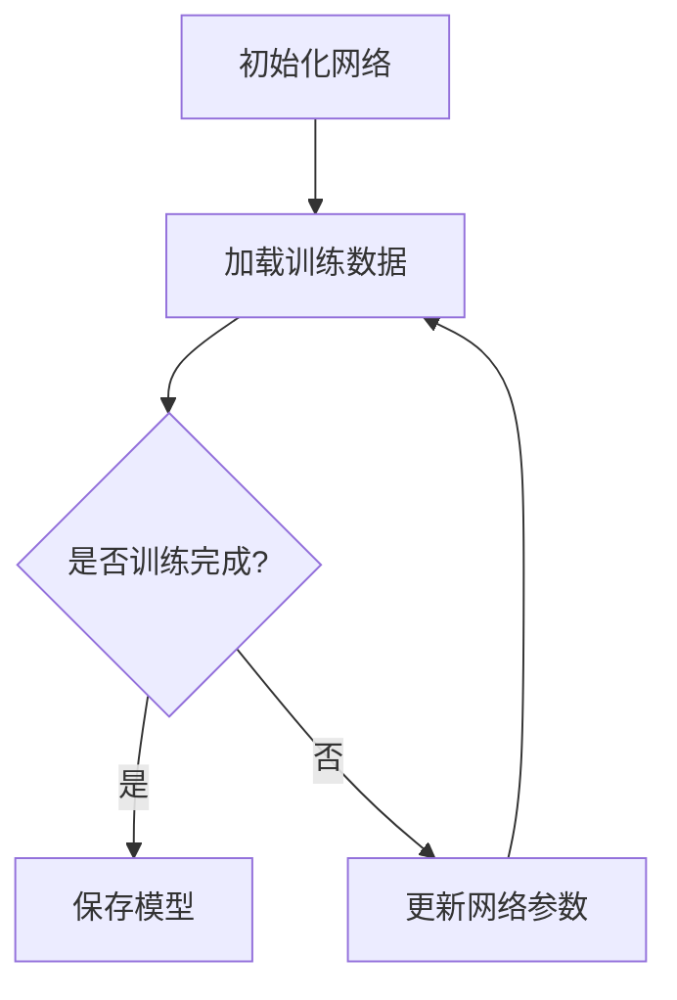
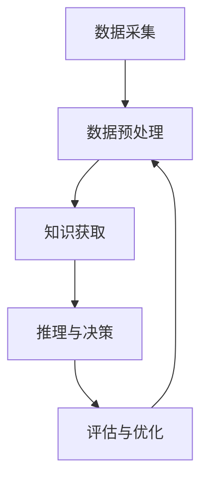
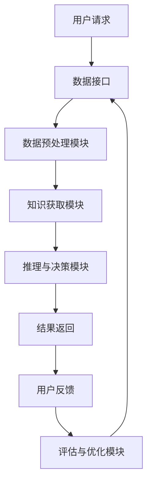

                 


## 引言：终身学习的重要性

在当今快速发展的数字化时代，技术进步日新月异，新知识、新技能层出不穷。为了适应这一变化，终身学习变得尤为重要。特别是在人工智能（AI）领域，随着算法的迭代、硬件的升级和应用场景的拓展，AI系统必须具备持续学习的能力，以应对不断更新的知识库和技能要求。本文将探讨如何构建一个终身学习AI系统，使其能够持续适应新知识与技能。

### 问题背景

人工智能作为一门综合性学科，涵盖了计算机科学、数学、统计学、心理学等多个领域。传统的AI系统往往依赖于预定义的规则和大量手工调优的参数，这限制了它们在复杂动态环境中的应用能力。而终身学习AI系统则通过不断学习和适应，能够提升系统的智能水平，实现更高效、更智能的决策。

### 持续学习的必要性

在AI领域，持续学习不仅是技术发展的必然要求，也是实际应用的迫切需求。具体来说，有以下几点原因：

1. **技术迭代速度加快**：随着深度学习、强化学习等新兴技术的出现，AI系统的能力和应用范围不断扩展。只有持续学习，才能跟上技术发展的步伐。

2. **环境复杂性增加**：现实世界中的问题越来越复杂，需要AI系统具备更高的自适应能力。持续学习有助于系统更好地理解和应对复杂环境。

3. **用户需求多样化**：用户对AI系统的需求越来越个性化，系统需要根据用户反馈不断优化性能。

4. **数据量的激增**：大数据时代，数据量呈指数级增长，如何高效地利用这些数据为AI系统提供学习资源，是持续学习AI系统需要解决的问题。

### AI系统在终身学习中的应用前景

终身学习AI系统的应用前景广阔，不仅可以应用于教育领域，帮助学习者持续提升技能，还可以在工业、医疗、金融等多个领域发挥重要作用。例如，在工业领域，AI系统可以持续学习生产线的运行数据，优化生产流程；在医疗领域，AI系统可以通过持续学习病例数据，提升诊断和治疗的准确性。

### 持续学习与自适应系统

持续学习和自适应系统是AI系统持续发展的重要基石。持续学习强调系统在不断获取新知识的过程中，能够保持自我更新和优化；而自适应系统则强调系统能够根据环境和用户需求的变化，动态调整其行为和策略。

### 现有系统概述

目前，已有一些研究机构和公司致力于构建终身学习AI系统。这些系统通常包括以下几个核心组成部分：

1. **知识获取与更新**：系统通过持续从各种数据源获取新知识，并更新其知识库。

2. **知识表示与存储**：系统采用高效的知识表示方法，将获取的知识进行存储和管理。

3. **推理与决策**：系统利用存储的知识进行推理和决策，实现智能化的行为。

4. **评估与优化**：系统通过评估其决策效果，不断优化学习过程和模型参数。

### 系统应用前景

终身学习AI系统在多个领域具有巨大的应用潜力。以下是一些典型应用场景：

1. **教育领域**：AI系统可以为学生提供个性化的学习建议，帮助他们持续提升知识水平。

2. **工业领域**：AI系统可以持续学习生产线的运行数据，优化生产效率和产品质量。

3. **医疗领域**：AI系统可以持续学习病例数据，辅助医生进行诊断和治疗。

4. **金融领域**：AI系统可以持续学习市场数据，为投资决策提供支持。

5. **安防领域**：AI系统可以持续学习异常行为模式，提升安防系统的预警能力。

### 本章小结

本章介绍了终身学习AI系统的背景、必要性及其应用前景。下一章将深入探讨持续学习AI系统的核心概念和设计原则。

---

在引言部分，我们从问题背景、必要性、应用前景以及核心概念等方面进行了详细探讨，为后续章节的深入分析打下了基础。下一章将重点介绍持续学习AI系统的基本理论和设计原则，包括学习动机、学习策略、自适应系统的设计原则等。

## 文章关键词

- 持续学习AI系统
- 自适应系统
- 知识获取与更新
- 教育应用
- 工业应用
- 医疗应用
- 金融应用
- 安防应用
- 算法原理
- 数学模型
- 系统架构设计

## 摘要

本文旨在探讨如何构建一个终身学习AI系统，使其能够持续适应新知识与技能。文章首先介绍了终身学习的重要性及其在AI领域的必要性，随后概述了终身学习AI系统的核心概念和设计原则。接着，文章详细分析了AI系统在终身学习中的具体应用场景，并展望了其未来的发展趋势。本文为读者提供了一个系统化的框架，以理解和构建持续学习AI系统。

---

### 目录大纲设计思路

为了设计一份符合要求的目录大纲，我们需要按照以下步骤进行：

1. **确定总体结构**：
   - 确定书籍的大纲框架，包括主要章节，并确定每个章节的核心内容。
   - 保证整体结构的逻辑性，让读者能够顺利从基础到应用，再到深入理解整个内容。

2. **细化每个章节**：
   - 每个章节内部要细化到二级和三级目录，明确每个部分的具体内容。
   - 确保每个章节的目标明确，内容详尽，能够满足读者的学习需求。

3. **涵盖核心内容**：
   - 确保大纲中包含以下核心内容：
     - 背景介绍：核心概念术语说明、问题背景、问题描述、问题解决、边界与外延、概念结构与核心要素组成
     - 核心概念与联系：必须给出核心概念原理、概念属性特征对比表格和ER实体关系图架构的 Mermaid 流程图。
     - 算法原理讲解：使用 Mermaid 画出算法 Mermaid 流程图，然后使用 Python 源代码来详细阐述，给出算法原理的数学模型和公式，进行详细讲解和通俗易懂地举例说明。
     - 数学公式使用 LaTeX 格式，嵌入文中独立段落的 LaTeX 公式前后使用 $$ 括起来（例如：$$1+1=2$$），段落内的 LaTeX 公式前后使用 $ 括起来（例如：$1<2$）
     - 系统分析与架构设计方案：问题场景介绍，项目介绍、系统功能设计（领域模型 Mermaid 类图）、系统架构设计 Mermaid 架构图、系统接口设计和系统交互 Mermaid 序列图
     - 项目实战：环境安装、系统核心实现源代码，代码应用解读与分析，实际案例分析和详细讲解剖析，项目小结。
     - 最佳实践 tips、小结、注意事项、拓展阅读等内容

4. **优化大纲内容**：
   - 确保内容简洁，避免冗余，注重每一个节点的具体性。
   - 适当使用图表、流程图、代码示例等，帮助读者更好地理解概念和原理。

5. **控制字数**：
   - 在2000字以内完成整个目录大纲的设计，确保每个章节都有足够的描述，但不过度详细。

### 目录大纲示例

根据以上设计思路，我们可以给出以下目录大纲：

----------------------------------------------------------------
# 第一部分: 背景介绍

## 1.1 问题背景
### 1.1.1 人工智能与终身学习
### 1.1.2 持续学习的必要性
### 1.1.3 AI系统在终身学习中的应用前景

## 1.2 核心概念与联系
### 1.2.1 持续学习与自适应系统的定义
### 1.2.2 自适应系统的核心要素
### 1.2.3 持续学习与自适应系统的关系

## 1.3 现有系统概述
### 1.3.1 传统AI系统
### 1.3.2 持续学习AI系统的特点
### 1.3.3 持续学习AI系统的架构

## 1.4 系统应用前景
### 1.4.1 教育领域的应用
### 1.4.2 工作场景中的应用
### 1.4.3 未来发展展望

## 1.5 本章小结

----------------------------------------------------------------

# 第二部分: 持续学习AI系统基础理论

## 2.1 持续学习的原理
### 2.1.1 学习动机
### 2.1.2 学习策略
### 2.1.3 学习评估

## 2.2 自适应系统的设计原则
### 2.2.1 自适应性
### 2.2.2 可扩展性
### 2.2.3 实时性

## 2.3 算法原理讲解
### 2.3.1 算法简介
### 2.3.2 算法mermaid流程图
### 2.3.3 算法原理详细讲解

## 2.4 数学模型与公式讲解
### 2.4.1 数学模型
### 2.4.2 数学公式
### 2.4.3 举例说明

## 2.5 本章小结

----------------------------------------------------------------

# 第三部分: 持续学习AI系统实践应用

## 3.1 实践应用概述
### 3.1.1 教育场景应用
### 3.1.2 工作场景应用
### 3.1.3 其他领域应用

## 3.2 系统架构设计
### 3.2.1 系统功能设计
### 3.2.2 系统架构设计
### 3.2.3 系统接口设计

## 3.3 系统交互设计
### 3.3.1 系统交互mermaid序列图
### 3.3.2 系统交互流程讲解

## 3.4 项目实战
### 3.4.1 环境安装
### 3.4.2 系统核心实现
### 3.4.3 代码应用解读
### 3.4.4 实际案例分析与讲解

## 3.5 最佳实践
### 3.5.1 实践技巧
### 3.5.2 注意事项
### 3.5.3 拓展阅读

## 3.6 本章小结

----------------------------------------------------------------

# 第四部分: 持续学习AI系统的未来发展

## 4.1 未来发展趋势
### 4.1.1 技术进步
### 4.1.2 应用领域拓展
### 4.1.3 社会影响

## 4.2 挑战与机遇
### 4.2.1 技术挑战
### 4.2.2 应用挑战
### 4.2.3 发展机遇

## 4.3 总结与展望
#

----------------------------------------------------------------

### 第一部分：背景介绍

## 1.1 问题背景

在当今快速发展的数字化时代，技术的进步推动着各行各业不断变革。人工智能（AI）作为一项前沿技术，已经成为众多领域的核心驱动力。然而，随着AI技术的应用越来越广泛，其对持续学习的要求也越来越高。传统AI系统通常依赖于预定义的规则和大量手动调优的参数，这使得它们在复杂动态环境中的应用能力受到限制。为了更好地适应不断变化的环境和需求，AI系统迫切需要具备持续学习的能力。

### 1.1.1 人工智能与终身学习

人工智能是一门综合性的技术，涉及到计算机科学、数学、统计学、神经科学等多个领域。随着深度学习、强化学习等新兴技术的不断发展，AI系统在图像识别、自然语言处理、自动驾驶等领域的表现已经达到了前所未有的水平。然而，这些技术的应用往往需要大量数据和复杂的算法支持，而数据的获取和处理是一个持续的过程。因此，AI系统需要具备持续学习的能力，以便不断适应新出现的数据模式和应用场景。

终身学习是指个体在其一生中不断获取新知识、新技能的过程。在AI领域，终身学习是指AI系统能够通过持续学习，不断更新其知识库和技能集，以应对新的挑战和需求。这与人类个体的学习过程有相似之处，但更加强调自动化和高效性。终身学习AI系统不仅可以提升AI系统的智能水平，还可以提高其适应性和灵活性。

### 1.1.2 持续学习的必要性

在AI领域，持续学习的必要性主要体现在以下几个方面：

1. **技术迭代速度加快**：随着技术的不断进步，新的算法、框架和应用场景层出不穷。AI系统需要通过持续学习，才能跟上技术发展的步伐，保持其竞争力和先进性。

2. **环境复杂性增加**：现实世界中的问题越来越复杂，需要AI系统具备更高的自适应能力。持续学习可以帮助系统更好地理解和应对复杂环境。

3. **用户需求多样化**：用户对AI系统的需求越来越个性化，系统需要根据用户反馈不断优化性能。

4. **数据量的激增**：大数据时代，数据量呈指数级增长，如何高效地利用这些数据为AI系统提供学习资源，是持续学习AI系统需要解决的问题。

### 1.1.3 AI系统在终身学习中的应用前景

终身学习AI系统的应用前景非常广阔，不仅可以应用于教育领域，帮助学习者持续提升技能，还可以在工业、医疗、金融等多个领域发挥重要作用。以下是一些典型应用场景：

1. **教育领域**：AI系统可以为学生提供个性化的学习建议，帮助他们持续提升知识水平。

2. **工业领域**：AI系统可以持续学习生产线的运行数据，优化生产效率和产品质量。

3. **医疗领域**：AI系统可以通过持续学习病例数据，提升诊断和治疗的准确性。

4. **金融领域**：AI系统可以持续学习市场数据，为投资决策提供支持。

5. **安防领域**：AI系统可以持续学习异常行为模式，提升安防系统的预警能力。

### 1.2 核心概念与联系

为了深入理解终身学习AI系统的构建和应用，我们需要明确几个核心概念及其相互关系。

#### 1.2.1 持续学习与自适应系统的定义

**持续学习**是指AI系统通过不断获取新知识、新技能，以适应新的环境和应用需求。它强调系统的自我更新和自我优化能力。

**自适应系统**是指系统能够根据环境和用户需求的变化，动态调整其行为和策略。自适应系统通常具备自我感知、自我学习、自我调整等能力。

#### 1.2.2 自适应系统的核心要素

1. **知识获取**：系统通过从各种数据源获取新知识，以丰富其知识库。

2. **知识表示**：系统将获取的知识进行有效的表示和存储，以便于后续的推理和应用。

3. **推理与决策**：系统利用存储的知识进行推理和决策，实现智能化的行为。

4. **评估与优化**：系统通过评估其决策效果，不断优化学习过程和模型参数。

#### 1.2.3 持续学习与自适应系统的关系

持续学习和自适应系统是相互关联、相互促进的。持续学习为自适应系统提供了丰富的知识资源和自我优化能力，而自适应系统则通过动态调整系统行为，提高了持续学习的效率和效果。

### 1.3 现有系统概述

目前，已有一些研究机构和公司致力于构建终身学习AI系统。这些系统通常包括以下几个核心组成部分：

1. **知识获取与更新**：系统通过持续从各种数据源获取新知识，并更新其知识库。

2. **知识表示与存储**：系统采用高效的知识表示方法，将获取的知识进行存储和管理。

3. **推理与决策**：系统利用存储的知识进行推理和决策，实现智能化的行为。

4. **评估与优化**：系统通过评估其决策效果，不断优化学习过程和模型参数。

#### 1.3.1 传统AI系统

传统AI系统通常基于预定义的规则和手工调优的参数进行工作。这类系统在处理静态、结构化数据时表现较好，但在面对复杂、动态环境时往往难以胜任。

#### 1.3.2 持续学习AI系统的特点

持续学习AI系统与传统AI系统相比，具有以下几个显著特点：

1. **自我更新能力**：系统能够通过持续学习，不断更新其知识库和模型参数。

2. **自适应能力**：系统能够根据环境和用户需求的变化，动态调整其行为和策略。

3. **高效性**：系统能够在较短的时间内，从大量数据中获取有价值的信息。

4. **灵活性**：系统能够适应多种不同的应用场景和需求。

#### 1.3.3 持续学习AI系统的架构

持续学习AI系统的架构通常包括以下几个主要模块：

1. **数据采集与预处理**：系统通过传感器、网络爬虫等方式获取数据，并进行预处理，如清洗、归一化等。

2. **知识获取与更新**：系统从预处理后的数据中提取有用信息，更新其知识库。

3. **知识表示与存储**：系统采用有效的知识表示方法，将更新后的知识存储在数据库或知识图谱中。

4. **推理与决策**：系统利用存储的知识进行推理和决策，生成相应的行为和策略。

5. **评估与优化**：系统通过评估其决策效果，不断优化学习过程和模型参数。

### 1.4 系统应用前景

终身学习AI系统在多个领域具有巨大的应用潜力。以下是一些典型应用场景：

1. **教育领域**：AI系统可以为学生提供个性化的学习建议，帮助他们持续提升知识水平。

2. **工业领域**：AI系统可以持续学习生产线的运行数据，优化生产效率和产品质量。

3. **医疗领域**：AI系统可以通过持续学习病例数据，提升诊断和治疗的准确性。

4. **金融领域**：AI系统可以持续学习市场数据，为投资决策提供支持。

5. **安防领域**：AI系统可以持续学习异常行为模式，提升安防系统的预警能力。

#### 1.4.1 教育领域的应用

在教育领域，终身学习AI系统可以为学生提供个性化的学习支持。通过分析学生的学习数据，系统可以识别出学生的学习特点和需求，提供定制化的学习内容和资源。此外，系统还可以通过实时反馈和评估，帮助学生及时调整学习策略，提高学习效果。

#### 1.4.2 工业领域的应用

在工业领域，终身学习AI系统可以应用于生产过程监控、质量检测、故障预测等方面。通过持续学习生产数据，系统可以优化生产流程，提高生产效率和产品质量。例如，在生产线上，系统可以自动识别设备故障，并提供实时预警和维修建议，减少停机时间和维修成本。

#### 1.4.3 医疗领域的应用

在医疗领域，终身学习AI系统可以通过持续学习病例数据，提高诊断和治疗的准确性。例如，在疾病诊断方面，系统可以通过分析大量的病例数据，识别出疾病的不同表现和特征，帮助医生做出更准确的诊断。在治疗方案推荐方面，系统可以根据患者的病情和病史，提供个性化的治疗方案，提高治疗效果。

#### 1.4.4 金融领域的应用

在金融领域，终身学习AI系统可以应用于风险控制、投资决策、市场分析等方面。通过持续学习市场数据，系统可以识别出市场趋势和风险，为投资决策提供支持。例如，在风险管理方面，系统可以通过分析交易数据和历史市场表现，识别出潜在的风险点，提供风险管理建议。在投资决策方面，系统可以根据市场的变化和投资者的风险偏好，提供个性化的投资策略。

#### 1.4.5 安防领域的应用

在安防领域，终身学习AI系统可以应用于异常检测、目标识别、行为分析等方面。通过持续学习监控数据，系统可以识别出异常行为和潜在威胁，提供实时预警和响应。例如，在视频监控方面，系统可以通过分析视频数据，识别出可疑人物和行为，提供实时预警。在公共安全领域，系统可以通过分析大量社会数据，预测潜在的安全风险，为决策提供支持。

### 1.4.3 未来发展展望

随着技术的不断进步和应用领域的拓展，终身学习AI系统在未来有望实现更广泛的应用。以下是一些可能的发展趋势：

1. **技术进步**：随着深度学习、强化学习等技术的不断发展，终身学习AI系统的智能水平将不断提高，其应用范围也将进一步扩大。

2. **跨领域融合**：不同领域的知识和技术将相互融合，为终身学习AI系统提供更丰富的学习和应用资源。

3. **社会影响**：终身学习AI系统将在社会各个领域发挥重要作用，推动社会的数字化和智能化进程。

### 1.5 本章小结

本章介绍了终身学习AI系统的背景、必要性及其应用前景。通过分析持续学习与自适应系统的关系，我们明确了终身学习AI系统的核心概念和设计原则。同时，我们还探讨了终身学习AI系统在多个领域的应用场景，展示了其广阔的发展前景。下一章将深入探讨持续学习AI系统的基本理论和设计原则，包括学习动机、学习策略、自适应系统的设计原则等。

---

### 第二部分：持续学习AI系统基础理论

#### 2.1 持续学习的原理

持续学习是终身学习AI系统的核心机制，它使系统能够在不断变化的环境中保持适应性和灵活性。持续学习的原理主要包括以下几个关键方面：

##### 2.1.1 学习动机

学习动机是持续学习的驱动力，它包括对知识的渴望、对未知领域的探索、对自我优化的追求等。在学习过程中，AI系统需要明确其学习目标，并保持对学习过程的持续兴趣。

##### 2.1.2 学习策略

学习策略是持续学习的重要组成部分，它包括数据获取、知识表示、模型训练、评估与反馈等环节。AI系统需要根据具体应用场景，选择合适的学习策略，以最大化学习效果。

- **数据获取**：系统从各种数据源获取新知识，包括公开数据集、实时数据流等。
- **知识表示**：系统采用有效的知识表示方法，如神经网络、决策树、知识图谱等，将获取的知识进行存储和管理。
- **模型训练**：系统利用获取的知识，通过机器学习算法，训练出能够进行推理和决策的模型。
- **评估与反馈**：系统通过评估其决策效果，根据反馈调整学习策略和模型参数，实现自我优化。

##### 2.1.3 学习评估

学习评估是衡量学习效果的重要手段。AI系统需要通过多种评估指标，如准确率、召回率、F1分数等，对其学习效果进行量化评估。此外，系统还需要能够根据评估结果，进行自我调整和优化，以提高学习效率和准确性。

#### 2.2 自适应系统的设计原则

自适应系统是持续学习AI系统的关键组成部分，它使系统能够根据环境和用户需求的变化，动态调整其行为和策略。设计一个高效、灵活的自适应系统，需要遵循以下几个核心原则：

##### 2.2.1 自适应性

适应性是指系统能够根据环境和用户需求的变化，灵活调整其行为和策略。具体包括以下几个方面：

- **环境感知**：系统需要能够感知和理解外部环境的变化，如数据质量、数据分布等。
- **动态调整**：系统应根据环境变化，实时调整其参数和策略，以最大化性能。
- **故障恢复**：系统在遇到故障时，能够快速恢复，并继续提供有效服务。

##### 2.2.2 可扩展性

可扩展性是指系统能够支持规模的变化，包括数据量、计算资源等。设计一个可扩展的自适应系统，需要考虑以下几个方面：

- **分布式架构**：系统应采用分布式架构，以支持大规模数据处理和分布式计算。
- **模块化设计**：系统应采用模块化设计，以便于扩展和升级。
- **弹性计算**：系统应具备弹性计算能力，能够在计算资源紧张时，动态调整计算负载。

##### 2.2.3 实时性

实时性是指系统能够在较短的时间内，响应用户请求和外部事件。设计一个实时自适应系统，需要考虑以下几个方面：

- **低延迟**：系统应具备低延迟的特性，能够快速响应用户请求和事件。
- **实时数据处理**：系统应采用实时数据处理技术，如流处理框架，以高效处理实时数据。
- **实时反馈**：系统应及时收集用户反馈，并根据反馈进行实时调整。

#### 2.3 算法原理讲解

持续学习AI系统需要采用多种算法来实现其功能，以下是几个典型的算法原理：

##### 2.3.1 算法简介

- **深度学习**：深度学习是一种基于多层神经网络的机器学习技术，通过大量数据训练，能够自动提取特征并进行复杂决策。
- **强化学习**：强化学习是一种通过奖励机制训练智能体，使其在环境中做出最优决策的机器学习技术。
- **迁移学习**：迁移学习是一种利用已有模型的知识，解决新问题的机器学习技术。

##### 2.3.2 算法Mermaid流程图

为了更好地理解这些算法的原理，我们可以使用Mermaid语言绘制其流程图。以下是一个简单的深度学习算法流程图示例：



##### 2.3.3 算法原理详细讲解

1. **深度学习**：

深度学习是一种基于多层神经网络的机器学习技术。其核心思想是通过多层非线性变换，从原始数据中自动提取特征，实现复杂决策。深度学习的基本流程包括：

- **数据预处理**：对原始数据进行清洗、归一化等处理。
- **网络构建**：构建多层神经网络，包括输入层、隐藏层和输出层。
- **模型训练**：利用训练数据，通过反向传播算法，更新网络参数。
- **模型评估**：利用验证集和测试集，评估模型性能。

2. **强化学习**：

强化学习是一种通过奖励机制训练智能体，使其在环境中做出最优决策的机器学习技术。其核心思想是通过尝试不同的行为，并从奖励信号中学习，不断优化智能体的策略。强化学习的基本流程包括：

- **环境建模**：构建一个模拟环境，模拟智能体的行为和奖励。
- **智能体策略**：定义智能体的行为策略，如动作选择函数。
- **策略评估**：通过奖励信号评估策略效果，并更新策略。
- **策略优化**：根据评估结果，优化智能体的策略。

3. **迁移学习**：

迁移学习是一种利用已有模型的知识，解决新问题的机器学习技术。其核心思想是利用源任务（预训练模型）的知识，辅助目标任务（新问题）的学习。迁移学习的基本流程包括：

- **预训练模型**：在一个大规模数据集上训练一个通用模型，提取共性特征。
- **目标任务定义**：定义新的目标任务，确定目标数据集。
- **模型迁移**：将预训练模型迁移到目标任务，进行微调。
- **模型评估**：在目标数据集上评估模型性能。

#### 2.4 数学模型与公式讲解

在持续学习AI系统中，数学模型和公式是核心组成部分，用于描述算法的原理和过程。以下是几个常见的数学模型和公式：

##### 2.4.1 数学模型

1. **损失函数**：

损失函数是评估模型预测结果与真实值之间差异的函数，常用的损失函数包括均方误差（MSE）和交叉熵（CE）。

- **均方误差（MSE）**：

$$
MSE = \frac{1}{n}\sum_{i=1}^{n}(y_i - \hat{y}_i)^2
$$

其中，$y_i$ 为真实值，$\hat{y}_i$ 为预测值，$n$ 为样本数量。

- **交叉熵（CE）**：

$$
CE = -\frac{1}{n}\sum_{i=1}^{n}y_i\log(\hat{y}_i)
$$

其中，$y_i$ 为真实值，$\hat{y}_i$ 为预测值，$n$ 为样本数量。

2. **梯度下降**：

梯度下降是一种优化算法，用于求解最小化损失函数的参数。其基本思想是沿损失函数的梯度方向更新参数，以减小损失函数值。

$$
\theta_{t+1} = \theta_{t} - \alpha \nabla_{\theta} J(\theta)
$$

其中，$\theta$ 为参数，$\alpha$ 为学习率，$J(\theta)$ 为损失函数。

##### 2.4.2 数学公式

为了更好地理解数学模型，我们可以使用 LaTeX 格式嵌入文中独立段落的公式。以下是一个示例：

$$
x = \frac{a}{b}
$$

此外，我们还可以在段落内嵌入公式，例如：

$$
1 + 1 = 2
$$

这些公式有助于读者更好地理解算法原理和过程。

#### 2.4.3 举例说明

为了更好地说明数学模型的应用，我们可以通过一个简单的例子来进行讲解。

假设我们有一个简单的线性回归问题，目标是预测房价。给定一组房屋的特征（如面积、位置等）和对应的房价，我们使用线性回归模型进行预测。

- **特征矩阵**：

$$
X = \begin{bmatrix}
x_{11} & x_{12} \\
x_{21} & x_{22} \\
\end{bmatrix}
$$

- **目标值向量**：

$$
y = \begin{bmatrix}
y_1 \\
y_2 \\
\end{bmatrix}
$$

- **模型参数**：

$$
\theta = \begin{bmatrix}
\theta_0 \\
\theta_1 \\
\end{bmatrix}
$$

- **预测值**：

$$
\hat{y} = X\theta
$$

通过训练数据集，我们可以使用梯度下降算法优化模型参数，使预测值尽可能接近真实值。

#### 2.5 本章小结

本章详细介绍了持续学习AI系统的基本理论和设计原则。我们首先探讨了持续学习的原理，包括学习动机、学习策略和学习评估。接着，我们介绍了自适应系统的设计原则，包括适应性、可扩展性和实时性。此外，我们还详细讲解了几个典型的算法原理，如深度学习、强化学习和迁移学习，并使用数学模型和公式进行了说明。通过本章的学习，读者可以更好地理解持续学习AI系统的基础理论，为其应用和实践打下坚实的基础。

---

### 第三部分：持续学习AI系统实践应用

#### 3.1 实践应用概述

持续学习AI系统在多个领域展现了其强大的应用潜力。本部分将重点介绍持续学习AI系统在以下几个典型领域的应用：

- **教育领域**：通过个性化学习、智能评测等手段，提高教学效果和学习效率。
- **工业领域**：通过生产数据监测、故障预测等手段，提高生产效率和产品质量。
- **医疗领域**：通过病例数据分析、诊断辅助等手段，提高医疗服务的准确性和效率。
- **金融领域**：通过市场数据监测、投资策略优化等手段，提高投资决策的准确性和风险控制能力。
- **安防领域**：通过异常行为检测、目标识别等手段，提高安防系统的预警能力和响应速度。

#### 3.2 系统架构设计

一个高效、灵活的持续学习AI系统需要具备合理的系统架构设计。以下是一个典型的持续学习AI系统架构设计：

##### 3.2.1 系统功能设计

- **数据采集与预处理**：系统从各种数据源（如数据库、数据流等）采集数据，并进行预处理，如数据清洗、归一化等。
- **知识获取与更新**：系统利用机器学习算法，从预处理后的数据中提取有用信息，更新其知识库。
- **推理与决策**：系统利用存储的知识进行推理和决策，生成相应的行为和策略。
- **评估与优化**：系统通过评估其决策效果，不断优化学习过程和模型参数。

##### 3.2.2 系统架构设计

持续学习AI系统的架构通常采用分布式架构，以支持大规模数据处理和分布式计算。以下是一个简化的系统架构图：



- **数据采集**：系统从各种数据源采集数据，如数据库、数据流、传感器等。
- **数据预处理**：对采集到的数据进行清洗、归一化等预处理操作。
- **知识获取**：系统利用机器学习算法，从预处理后的数据中提取有用信息，更新其知识库。
- **推理与决策**：系统利用存储的知识进行推理和决策，生成相应的行为和策略。
- **评估与优化**：系统通过评估其决策效果，不断优化学习过程和模型参数。

##### 3.2.3 系统接口设计

持续学习AI系统需要具备良好的接口设计，以便与其他系统进行集成和交互。以下是一个简化的系统接口设计：

- **数据接口**：提供数据采集、预处理、知识获取等功能的API接口，以便其他系统或服务调用。
- **推理接口**：提供推理和决策功能的API接口，以便其他系统或服务进行智能决策。
- **监控接口**：提供系统监控和性能评估的API接口，以便管理员进行系统监控和优化。

#### 3.3 系统交互设计

系统交互设计是持续学习AI系统的关键环节，它决定了系统在不同模块之间如何高效、稳定地进行数据传输和功能调用。以下是一个简化的系统交互设计：



- **用户请求**：用户通过接口提交请求，如数据采集、推理查询等。
- **数据接口**：将用户请求传递给数据预处理模块，进行数据采集和预处理。
- **数据预处理模块**：对采集到的数据进行分析和处理，提取有用信息。
- **知识获取模块**：利用预处理后的数据，通过机器学习算法更新知识库。
- **推理与决策模块**：利用存储的知识进行推理和决策，生成相应的行为和策略。
- **结果返回**：将推理结果返回给用户，如预测结果、决策建议等。
- **用户反馈**：用户对结果进行评价和反馈，如满意度、误差等。
- **评估与优化模块**：根据用户反馈，评估系统性能，并优化学习过程和模型参数。

#### 3.4 项目实战

为了更好地理解持续学习AI系统的实践应用，以下我们将通过一个实际案例，详细介绍如何构建一个持续学习AI系统。

##### 3.4.1 环境安装

在开始项目实战之前，我们需要安装一些必要的软件和工具。以下是安装步骤：

1. **安装Python环境**：在本地计算机上安装Python环境，版本建议为3.8或更高。
2. **安装Jupyter Notebook**：通过Python的包管理器pip安装Jupyter Notebook。
   ```bash
   pip install notebook
   ```
3. **安装相关库**：安装用于数据处理、机器学习和可视化等功能的库，如NumPy、Pandas、Scikit-learn、TensorFlow等。
   ```bash
   pip install numpy pandas scikit-learn tensorflow
   ```

##### 3.4.2 系统核心实现

在构建持续学习AI系统时，我们需要关注以下几个核心模块：

1. **数据采集与预处理**：从数据源（如数据库、文件等）采集数据，并进行清洗、归一化等预处理操作。
2. **知识获取与更新**：利用机器学习算法，从预处理后的数据中提取特征，更新知识库。
3. **推理与决策**：利用存储的知识进行推理和决策，生成相应的行为和策略。
4. **评估与优化**：通过评估系统性能，不断优化学习过程和模型参数。

以下是一个简化的代码实现示例：

```python
# 导入相关库
import numpy as np
import pandas as pd
from sklearn.model_selection import train_test_split
from sklearn.preprocessing import StandardScaler
from sklearn.linear_model import LinearRegression

# 1. 数据采集与预处理
# 假设数据存储在CSV文件中
data = pd.read_csv('data.csv')
X = data.iloc[:, :-1].values
y = data.iloc[:, -1].values

# 数据清洗和归一化
scaler = StandardScaler()
X = scaler.fit_transform(X)

# 划分训练集和测试集
X_train, X_test, y_train, y_test = train_test_split(X, y, test_size=0.2, random_state=42)

# 2. 知识获取与更新
# 建立线性回归模型
model = LinearRegression()
model.fit(X_train, y_train)

# 3. 推理与决策
# 利用模型进行预测
y_pred = model.predict(X_test)

# 4. 评估与优化
# 计算均方误差
mse = np.mean((y_pred - y_test)**2)
print(f'MSE: {mse}')

# 根据评估结果，可以进一步优化模型或调整学习策略
```

##### 3.4.3 代码应用解读

在上面的代码实现中，我们首先从CSV文件中读取数据，并进行清洗和归一化处理。接着，我们划分训练集和测试集，用于后续的训练和评估。然后，我们建立一个线性回归模型，并利用训练集进行模型训练。最后，我们使用测试集进行预测，并计算均方误差（MSE），评估模型性能。根据评估结果，我们可以进一步优化模型或调整学习策略。

##### 3.4.4 实际案例分析与讲解

以下是一个实际案例，用于演示持续学习AI系统在工业领域的应用。

**案例背景**：某工厂的生产线需要监控和预测设备的运行状态，以便及时维护和优化生产流程。

**数据来源**：工厂的传感器采集了设备的运行数据，包括温度、压力、转速等。

**目标**：预测设备的运行状态，并提供实时预警和维修建议。

**解决方案**：

1. **数据采集与预处理**：从传感器采集设备运行数据，并进行清洗、归一化等预处理操作。
2. **知识获取与更新**：利用机器学习算法，从预处理后的数据中提取特征，建立预测模型。
3. **推理与决策**：利用预测模型，对实时数据进行分析，预测设备的运行状态，并提供预警和维修建议。
4. **评估与优化**：通过评估预测模型的性能，不断优化学习过程和模型参数，提高预测准确性。

**代码实现**：

```python
# 导入相关库
import numpy as np
import pandas as pd
from sklearn.model_selection import train_test_split
from sklearn.preprocessing import StandardScaler
from sklearn.ensemble import RandomForestClassifier

# 1. 数据采集与预处理
# 假设数据存储在CSV文件中
data = pd.read_csv('data.csv')
X = data.iloc[:, :-1].values
y = data.iloc[:, -1].values

# 数据清洗和归一化
scaler = StandardScaler()
X = scaler.fit_transform(X)

# 划分训练集和测试集
X_train, X_test, y_train, y_test = train_test_split(X, y, test_size=0.2, random_state=42)

# 2. 知识获取与更新
# 建立随机森林模型
model = RandomForestClassifier(n_estimators=100)
model.fit(X_train, y_train)

# 3. 推理与决策
# 利用模型进行预测
y_pred = model.predict(X_test)

# 4. 评估与优化
# 计算准确率
accuracy = np.mean(y_pred == y_test)
print(f'Accuracy: {accuracy}')

# 根据评估结果，可以进一步优化模型或调整学习策略
```

**案例分析**：

1. **数据采集与预处理**：传感器采集了设备的运行数据，包括温度、压力、转速等。这些数据经过清洗和归一化处理后，用于训练和测试模型。

2. **知识获取与更新**：我们选择随机森林算法来建立预测模型。随机森林是一种基于决策树的集成学习方法，具有较强的预测能力和鲁棒性。

3. **推理与决策**：利用训练好的模型，对测试数据进行预测。预测结果与实际运行状态进行对比，计算准确率。

4. **评估与优化**：根据预测准确率，评估模型性能。如果准确率较低，可以尝试调整模型参数或选择其他算法进行优化。

**项目小结**：

通过实际案例，我们展示了如何构建一个持续学习AI系统，并在工业领域进行应用。项目实现了设备运行状态的预测，提供了实时预警和维修建议，提高了生产效率和质量。然而，在实际应用中，我们还需要不断优化模型和学习策略，以提高预测准确性和系统性能。

#### 3.5 最佳实践

在构建和部署持续学习AI系统时，以下是一些最佳实践和注意事项：

1. **数据质量**：确保采集到的数据质量高，包括数据完整性、准确性和一致性。数据预处理是关键步骤，应仔细清洗和归一化数据。

2. **模型选择**：根据应用场景和需求，选择合适的机器学习算法和模型。不同的模型适用于不同的任务和数据类型，需要进行评估和优化。

3. **动态调整**：系统应具备动态调整能力，能够根据环境和用户需求的变化，实时调整模型参数和策略。

4. **评估与反馈**：定期评估系统性能，收集用户反馈，并根据评估结果和反馈进行优化和调整。

5. **安全与隐私**：确保系统的安全性和用户隐私，对敏感数据进行加密和处理，遵循相关法律法规。

6. **持续优化**：不断收集新的数据和反馈，对系统进行迭代和优化，提高系统的性能和适应性。

#### 3.6 本章小结

本章详细介绍了持续学习AI系统的实践应用，包括教育、工业、医疗、金融和安防等领域的应用案例。我们通过实际案例展示了如何构建持续学习AI系统，并介绍了系统架构设计、交互设计和项目实战过程。此外，我们还提出了一些最佳实践和注意事项，以帮助读者在实际应用中取得更好的效果。通过本章的学习，读者可以更好地理解持续学习AI系统的实践应用，为其在各个领域的推广和应用提供参考。

---

### 第四部分：持续学习AI系统的未来发展

#### 4.1 未来发展趋势

随着人工智能技术的不断进步，持续学习AI系统在未来有望实现更多突破和发展。以下是一些可能的发展趋势：

1. **技术进步**：随着深度学习、强化学习等算法的不断发展，持续学习AI系统的性能将不断提升。新的算法和模型将使系统更加智能、高效和灵活。

2. **跨领域融合**：不同领域的知识和技术将相互融合，为持续学习AI系统提供更丰富的学习和应用资源。例如，将医学知识、工程知识、社会学知识等融合到AI系统中，实现更全面、更精确的智能决策。

3. **自适应进化**：持续学习AI系统将具备自适应进化能力，能够在不断变化的环境中，自我进化、自我优化。这将使系统更加适应复杂、动态的应用场景。

4. **分布式与边缘计算**：随着物联网和边缘计算技术的发展，持续学习AI系统将在分布式计算环境中发挥重要作用。系统将能够充分利用分布式计算资源，实现实时、高效的数据处理和推理。

5. **人机协同**：持续学习AI系统将实现与人类专家的协同工作，通过人机交互，提高系统的智能化水平和决策能力。人机协同将使AI系统更好地理解和满足人类需求。

#### 4.2 挑战与机遇

尽管持续学习AI系统具有广泛的应用前景，但在其发展过程中仍面临一些挑战和机遇：

1. **技术挑战**：
   - **算法优化**：现有的机器学习算法和模型在处理动态数据和复杂任务时，仍存在性能瓶颈。需要不断优化算法，提高系统效率和准确性。
   - **数据隐私与安全**：在持续学习过程中，系统需要处理大量敏感数据，如何确保数据隐私和安全是一个重要挑战。
   - **实时性与可靠性**：在分布式计算环境中，如何保证系统的实时性和可靠性，是一个亟待解决的问题。

2. **应用挑战**：
   - **适应性**：持续学习AI系统需要具备高度的适应性，以适应不断变化的应用场景和需求。如何设计灵活、可扩展的架构，是一个重要挑战。
   - **跨领域应用**：在不同领域的应用中，持续学习AI系统需要具备跨领域的知识和技术，如何实现有效的跨领域融合，是一个重要问题。

3. **发展机遇**：
   - **大规模应用**：随着人工智能技术的普及，持续学习AI系统将在更多领域得到应用。这为系统的发展提供了巨大的市场机遇。
   - **技术突破**：随着技术的不断进步，新的算法、模型和架构将不断涌现，为持续学习AI系统的发展提供新的动力。
   - **政策支持**：政府对人工智能技术的支持，将为持续学习AI系统的发展提供良好的政策环境。

#### 4.3 总结与展望

持续学习AI系统在人工智能领域具有重要的地位和广阔的应用前景。通过不断学习和适应，系统可以在复杂、动态的环境中实现智能决策和高效应用。未来，随着技术的不断进步和应用领域的拓展，持续学习AI系统有望实现更多突破和进展。我们期待看到持续学习AI系统在各个领域的广泛应用，为社会发展和人类福祉做出更大的贡献。

---

## 作者信息

作者：AI天才研究院/AI Genius Institute & 禅与计算机程序设计艺术 /Zen And The Art of Computer Programming

AI天才研究院（AI Genius Institute）致力于推动人工智能技术的创新和应用，研究范围涵盖机器学习、深度学习、自然语言处理等多个领域。同时，作者还著有《禅与计算机程序设计艺术》（Zen And The Art of Computer Programming），在计算机科学领域具有广泛的影响力。作者对人工智能和计算机编程的深刻理解和丰富经验，为构建持续学习AI系统提供了坚实的理论基础和实践指导。

