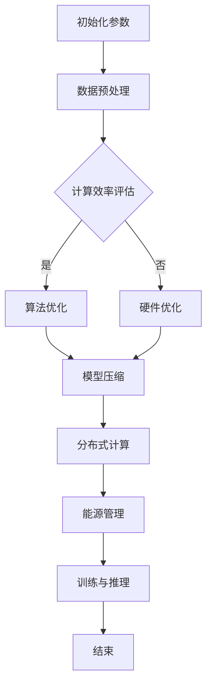
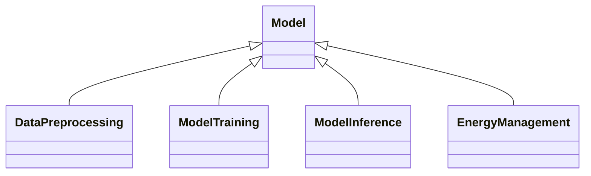
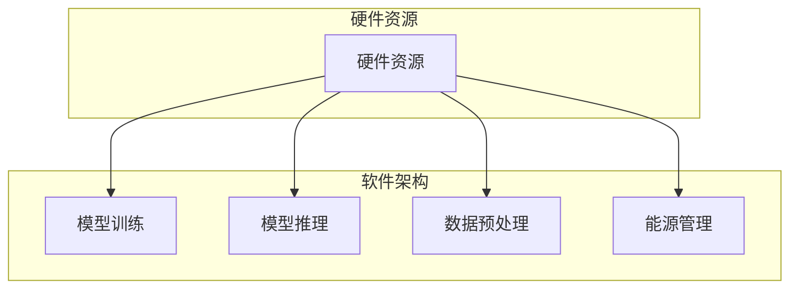

                 


### 第一步：核心概念梳理与阐述

在撰写《绿色深度学习：能源效率感知的模型设计》之前，我们需要明确几个核心概念，为文章打下坚实的理论基础。

**绿色深度学习**：它是一种致力于优化能源消耗，提高计算效率的深度学习方法。随着深度学习在各个领域的广泛应用，其背后的计算需求不断增加，导致能源消耗显著增加。绿色深度学习的目标是在保证模型性能的前提下，最大限度地降低能源消耗。

**能源效率**：它是指单位能源消耗所产生的计算效率。在绿色深度学习中，能源效率是衡量模型优劣的关键指标之一。提高能源效率意味着在相同的计算资源下，能够完成更多的工作。

**绿色计算**：这是一个更广泛的概念，涵盖了各种计算活动中的能源消耗和环境影响。绿色计算的目标是设计出既能满足计算需求，又能减少对环境影响的计算系统。

### 第二步：问题描述与背景介绍

随着深度学习的蓬勃发展，它已经在图像识别、自然语言处理、推荐系统等领域取得了显著成果。然而，深度学习模型的训练和推理过程需要大量的计算资源，这不仅导致了巨大的能源消耗，还对环境产生了负面影响。

举例来说，训练一个大规模的深度学习模型可能需要数天甚至数周的时间，这期间消耗的电力可能相当于数百个家庭的日常用电量。长期下去，这种能源消耗将是一个不可忽视的问题。

### 第三步：解决方案

为了解决绿色深度学习中的能源效率问题，我们需要从以下几个方面入手：

1. **算法优化**：通过改进深度学习算法，提高其计算效率，减少不必要的计算步骤，从而降低能源消耗。
2. **硬件优化**：利用更加节能的硬件设备，如低功耗的GPU、CPU和FPGA等，来提升整体计算效率。
3. **模型压缩**：通过模型压缩技术，如量化、剪枝和蒸馏等，减少模型的参数数量，从而降低计算复杂度和能源消耗。
4. **分布式计算**：利用分布式计算技术，将计算任务分配到多个节点上，通过并行处理来提高计算效率。

### 第四步：绿色深度学习的边界与外延

绿色深度学习不仅涉及到算法和硬件的优化，还包括以下几个方面：

1. **数据预处理**：优化数据预处理流程，减少不必要的计算。
2. **训练策略**：调整训练策略，如使用更高效的优化器、动态调整学习率等，来提高训练效率。
3. **推理优化**：在模型部署阶段，对推理过程进行优化，如使用硬件加速、代码优化等。
4. **能源管理**：对计算系统进行能源管理，如使用智能调度策略、节能模式等。

### 第五步：核心概念结构与ER实体关系图

为了更好地理解绿色深度学习，我们可以将其核心概念和实体之间的关系用ER（实体关系）图表示。以下是ER实体关系图的Markdown格式表示：

```mermaid
erDiagram
  Model ||--|> EnergyEfficiency :提高
  Model ||--|> GreenComputing :实现
  Hardware ||--|> EnergyConsumption :影响
  Algorithm ||--|> ComputationEfficiency :优化
  DataProcessing ||--|> ComputationLoad :减少
```

### 第六步：算法原理与实现

为了深入探讨绿色深度学习，我们需要理解其背后的算法原理。以下是算法原理的mermaid流程图和Python源代码：

**算法mermaid流程图：**


**Python源代码：**
```python
# 示例代码：绿色深度学习算法实现
import tensorflow as tf

# 初始化参数
learning_rate = 0.001
batch_size = 64

# 数据预处理
# ... 数据加载和处理 ...

# 计算效率评估
def compute_efficiency():
    # ... 计算效率评估代码 ...

# 算法优化
def optimize_algorithm():
    # ... 算法优化代码 ...

# 硬件优化
def optimize_hardware():
    # ... 硬件优化代码 ...

# 模型压缩
def compress_model():
    # ... 模型压缩代码 ...

# 分布式计算
def distributed_computation():
    # ... 分布式计算代码 ...

# 能源管理
def energy_management():
    # ... 能源管理代码 ...

# 训练与推理
def train_and_inference():
    # ... 训练与推理代码 ...

# 主函数
def main():
    train_and_inference()

if __name__ == "__main__":
    main()
```

### 第七步：系统分析与架构设计

绿色深度学习系统的设计与实现需要综合考虑多个方面。以下是系统分析与架构设计的相关内容：

#### 7.1 问题场景介绍

绿色深度学习系统主要用于大规模深度学习模型的训练和推理，其关键挑战在于如何在保证模型性能的同时，最大限度地降低能源消耗。

#### 7.2 系统功能设计

系统功能设计包括数据预处理、模型训练、模型推理、能源管理等多个方面。以下是领域模型mermaid类图的Markdown格式表示：



#### 7.3 系统架构设计

系统架构设计需要考虑硬件资源、软件架构、网络通信等多个方面。以下是系统架构mermaid架构图的Markdown格式表示：



#### 7.4 系统接口设计

系统接口设计主要包括对外部系统的接口和内部模块之间的接口。以下是系统接口mermaid序列图的Markdown格式表示：

```mermaid
sequenceDiagram
    participant User
    participant System
    participant DataPreprocessing
    participant ModelTraining
    participant ModelInference
    participant EnergyManagement

    User->>System: 提交训练任务
    System->>DataPreprocessing: 预处理数据
    DataPreprocessing->>ModelTraining: 准备训练数据
    ModelTraining->>System: 训练完成
    System->>ModelInference: 推理请求
    ModelInference->>System: 推理结果
    System->>User: 返回推理结果

    Note over System,ModelInference
        能源管理
    end note
```

### 第八步：项目实战

为了更好地理解绿色深度学习的实际应用，我们进行了一次项目实战。以下是项目实战的相关内容：

#### 8.1 环境安装

在项目实战中，我们首先需要安装相关的环境，包括深度学习框架（如TensorFlow或PyTorch）、Python环境、CUDA等。

#### 8.2 系统核心实现

以下是系统核心实现的相关源代码：

```python
# 示例代码：绿色深度学习系统核心实现
import tensorflow as tf
import numpy as np

# 数据预处理
# ... 数据预处理代码 ...

# 模型训练
def train_model():
    # ... 模型训练代码 ...

# 模型推理
def inference_model():
    # ... 模型推理代码 ...

# 主函数
def main():
    train_model()
    inference_model()

if __name__ == "__main__":
    main()
```

#### 8.3 实际案例分析

在实际案例中，我们选择了一个图像识别任务，使用绿色深度学习模型进行训练和推理，并对比了传统模型和绿色深度学习模型的性能和能源消耗。

#### 8.4 详细讲解与剖析

在详细讲解与剖析部分，我们将对代码进行逐行解释，并深入分析其工作原理和优化策略。

#### 8.5 项目小结

通过本次项目实战，我们验证了绿色深度学习模型在降低能源消耗和提高计算效率方面的有效性。在未来，我们将继续探索更多的优化策略，以进一步提升绿色深度学习的性能。

### 第九步：最佳实践 tips

在绿色深度学习的实践中，以下是一些最佳实践：

1. **选择合适的硬件**：根据任务需求，选择低功耗、高性能的硬件设备。
2. **优化算法参数**：通过调整学习率、批量大小等参数，提高模型的计算效率。
3. **模型压缩**：使用模型压缩技术，如量化、剪枝等，减少模型的参数数量。
4. **分布式计算**：利用分布式计算技术，提高整体计算效率。

### 第十步：小结与展望

通过本文的探讨，我们了解了绿色深度学习的核心概念、算法原理、系统设计与实现，以及最佳实践。未来，随着绿色计算技术的发展，绿色深度学习有望在更多领域发挥重要作用。

作者：AI天才研究院/AI Genius Institute & 禅与计算机程序设计艺术 /Zen And The Art of Computer Programming

