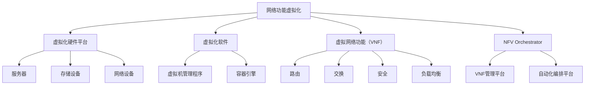
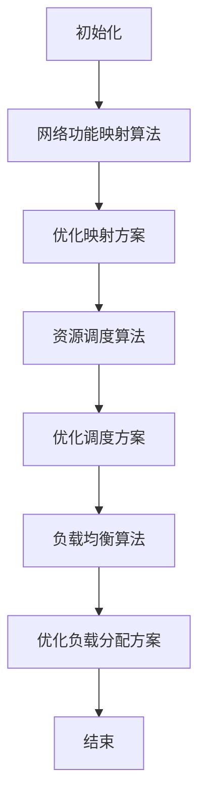
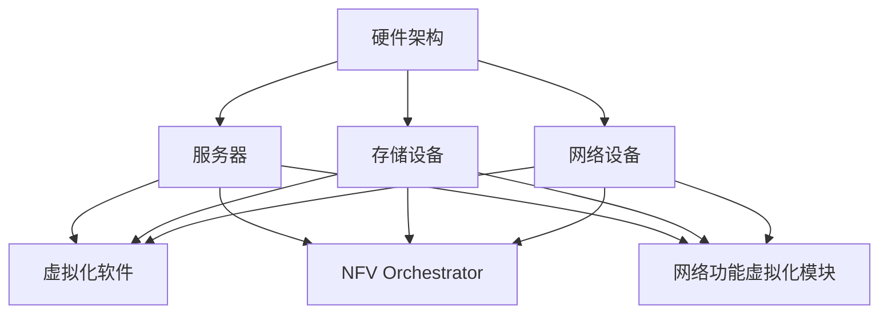
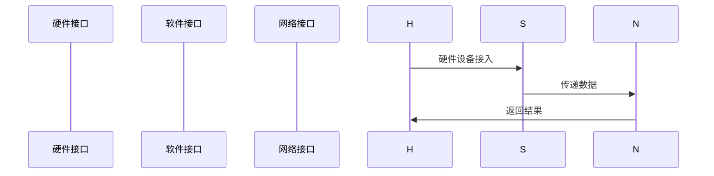
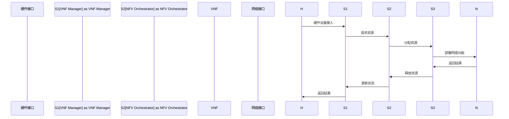

                 

### 文章标题：网络功能虚拟化（NFV）在电信行业的实践

**关键词：** 网络功能虚拟化、电信行业、虚拟化技术、实践案例、系统架构

**摘要：** 本文将深入探讨网络功能虚拟化（NFV）在电信行业的应用与实践。首先介绍NFV的背景、核心概念和原理，接着分析NFV在电信行业中的应用场景，并详细讲解NFV项目的实践过程。最后，分享NFV最佳实践和注意事项，以及拓展阅读资源。

---

### 目录大纲

----------------------------------------------------------------

## 第一部分: NFV概述与原理

### 第1章: NFV背景介绍
#### 1.1 问题背景
#### 1.2 问题描述
#### 1.3 问题解决
#### 1.4 边界与外延
#### 1.5 概念结构与核心要素组成

### 第2章: NFV核心概念与联系
#### 2.1 核心概念原理
#### 2.2 概念属性特征对比表格
#### 2.3 ER实体关系图架构

### 第3章: NFV的数学模型与算法原理
#### 3.1 数学模型和公式
#### 3.2 算法原理讲解
#### 3.3 Mermaid流程图
#### 3.4 Python源代码阐述

### 第4章: NFV在电信行业的应用
#### 4.1 应用场景介绍
#### 4.2 项目介绍
#### 4.3 系统功能设计
#### 4.4 系统架构设计
#### 4.5 系统接口设计
#### 4.6 系统交互

### 第5章: NFV项目实战
#### 5.1 环境安装
#### 5.2 系统核心实现源代码
#### 5.3 代码应用解读与分析
#### 5.4 实际案例分析与讲解
#### 5.5 项目小结

### 第6章: NFV最佳实践与注意事项
#### 6.1 最佳实践 tips
#### 6.2 小结
#### 6.3 注意事项
#### 6.4 拓展阅读

----------------------------------------------------------------

**以下为文章正文内容：**

---

## 第一部分: NFV概述与原理

### 第1章: NFV背景介绍

#### 1.1 问题背景

随着互联网和云计算技术的飞速发展，电信行业面临着巨大的挑战和机遇。传统电信网络的架构和运营模式已经难以满足日益增长的业务需求和用户期望。为了提高网络灵活性、降低运营成本、加速业务创新，电信行业开始探索网络功能虚拟化（NFV）技术。

#### 1.2 问题描述

电信网络的复杂性和刚性导致以下问题：
1. **成本高**：传统电信网络依赖于专用的硬件设备，建设成本高，运维成本也居高不下。
2. **灵活性差**：电信网络的架构和运营模式较为固定，难以快速响应业务需求的变化。
3. **创新受限**：传统电信网络难以支持新型业务和服务的快速部署，创新受到限制。

#### 1.3 问题解决

NFV技术旨在通过虚拟化技术将网络功能从专用硬件设备上解耦，部署在通用硬件平台上，从而实现以下目标：
1. **降低成本**：使用通用硬件平台替代专用硬件设备，降低网络建设成本和运营成本。
2. **提高灵活性**：网络功能虚拟化后，可以更灵活地部署和调整网络功能，快速响应业务需求的变化。
3. **加速创新**：虚拟化网络功能可以支持快速部署新型业务和服务，推动电信行业创新。

#### 1.4 边界与外延

NFV技术不仅应用于电信行业，还广泛应用于其他领域，如云服务、物联网、智能家居等。NFV的外延包括以下几个方面：
1. **硬件平台**：支持虚拟化技术的通用硬件平台，如服务器、存储设备、网络设备等。
2. **虚拟化软件**：虚拟化技术的实现软件，如虚拟机管理程序、容器引擎等。
3. **网络功能**：可以虚拟化的网络功能，如路由、交换、安全、负载均衡等。
4. **管理平台**：用于管理虚拟化网络功能的平台，如虚拟网络功能（VNF）管理平台、NFV orchestrator等。

#### 1.5 概念结构与核心要素组成

NFV的概念结构包括以下核心要素：
1. **网络功能虚拟化（NFV）**：将网络功能从专用硬件设备上解耦，部署在通用硬件平台上。
2. **虚拟化硬件平台**：支持虚拟化技术的通用硬件平台，如服务器、存储设备、网络设备等。
3. **虚拟化软件**：实现虚拟化技术的软件，如虚拟机管理程序、容器引擎等。
4. **虚拟网络功能（VNF）**：在通用硬件平台上运行的虚拟化网络功能。
5. **NFV Orchestrator**：用于管理和协调虚拟化网络功能的平台，如VNF管理平台、自动化编排平台等。

### 第2章: NFV核心概念与联系

#### 2.1 核心概念原理

NFV的核心概念包括虚拟化、云计算、容器化等。以下是对这些核心概念的简要说明：

**虚拟化**：
- **定义**：虚拟化是一种技术，通过创建虚拟的硬件平台、操作系统和网络，实现资源的抽象和隔离。
- **原理**：通过虚拟化技术，可以将一台物理服务器虚拟成多台虚拟机，每台虚拟机运行独立的操作系统和应用程序，从而提高资源利用率和灵活性。

**云计算**：
- **定义**：云计算是一种通过互联网提供计算资源（如服务器、存储、网络）的服务模式。
- **原理**：云计算利用虚拟化技术，提供可弹性扩展的计算资源，用户可以根据需求随时申请和释放资源。

**容器化**：
- **定义**：容器化是一种轻量级虚拟化技术，通过将应用程序及其依赖环境打包在容器中，实现应用程序的隔离和部署。
- **原理**：容器化利用操作系统级虚拟化技术，实现应用程序与宿主机的隔离，容器中运行的应用程序共享宿主机的操作系统内核。

#### 2.2 概念属性特征对比表格

| 概念 | 定义 | 特性 | 应用场景 |
| ---- | ---- | ---- | ---- |
| 虚拟化 | 资源抽象和隔离 | 资源利用率高、灵活性高、可扩展性强 | 服务器虚拟化、存储虚拟化、网络虚拟化 |
| 云计算 | 通过互联网提供计算资源 | 弹性扩展、高可用性、高可靠性 | IaaS、PaaS、SaaS |
| 容器化 | 应用程序及其依赖环境打包 | 轻量级、快速部署、环境一致性 | Web应用、微服务、持续集成与持续部署 |

#### 2.3 ER实体关系图架构

使用Mermaid流程图来展示NFV的实体关系：



### 第3章: NFV的数学模型与算法原理

#### 3.1 数学模型和公式

NFV的数学模型主要涉及网络功能映射、资源调度和负载均衡等方面。以下是一些常见的数学模型和公式：

**网络功能映射**：
- **N: 网络功能总数**
- **M: 可用硬件平台总数**
- **R: 网络功能映射方案集合**

网络功能映射的目标是找到一种映射方案，使得网络功能的总延迟和带宽需求最小。

**资源调度**：
- **C: 资源需求**
- **S: 可用资源集合**
- **T: 调度方案集合**

资源调度的目标是为每个网络功能分配合适的硬件资源，使得总资源利用率最大。

**负载均衡**：
- **P: 负载**
- **W: 资源容量**
- **L: 负载均衡方案集合**

负载均衡的目标是分配负载，使得每个硬件平台的资源利用率均衡。

#### 3.2 算法原理讲解

NFV算法主要包括网络功能映射、资源调度和负载均衡算法。以下分别对这些算法进行讲解：

**网络功能映射算法**：

1. **初始化**：计算网络功能的延迟和带宽需求。
2. **映射过程**：根据延迟和带宽需求，将网络功能映射到合适的硬件平台上。
3. **优化过程**：通过迭代优化映射方案，使得总延迟和带宽需求最小。

**资源调度算法**：

1. **初始化**：计算每个网络功能的资源需求。
2. **调度过程**：根据资源需求和可用资源，为每个网络功能分配合适的硬件资源。
3. **优化过程**：通过迭代优化调度方案，使得总资源利用率最大。

**负载均衡算法**：

1. **初始化**：计算每个硬件平台的资源利用率。
2. **负载分配过程**：根据资源利用率，为每个硬件平台分配负载。
3. **优化过程**：通过迭代优化负载分配方案，使得每个硬件平台的资源利用率均衡。

#### 3.3 Mermaid流程图

使用Mermaid流程图来展示NFV算法的基本流程：



#### 3.4 Python源代码阐述

以下是一个简单的Python示例，用于演示NFV算法的基本流程：

```python
import random

def network_function_mapping(network_functions, hardware_platforms):
    # 初始化映射方案
    mapping_scheme = []

    # 映射过程
    for network_function in network_functions:
        delay = network_function["delay"]
        bandwidth = network_function["bandwidth"]

        # 找到合适的硬件平台
        suitable_platform = None
        for platform in hardware_platforms:
            if platform["available"] and platform["delay"] <= delay and platform["bandwidth"] >= bandwidth:
                suitable_platform = platform
                break

        # 优化映射方案
        if suitable_platform:
            mapping_scheme.append(suitable_platform)
            suitable_platform["available"] = False
        else:
            mapping_scheme.append(None)

    return mapping_scheme

def resource_scheduling(network_functions, hardware_platforms):
    # 初始化调度方案
    scheduling_scheme = []

    # 调度过程
    for network_function in network_functions:
        if network_function["mapped"] is None:
            continue

        # 分配硬件资源
        resource需求 = network_function["resource"]
        for platform in hardware_platforms:
            if platform["available"] and platform["resource"] >= resource需求:
                platform["resource"] -= resource需求
                scheduling_scheme.append(platform)
                break

    return scheduling_scheme

def load_balancing(hardware_platforms):
    # 初始化负载均衡方案
    load_balancing_scheme = []

    # 负载分配过程
    total_load = sum(platform["resource"] for platform in hardware_platforms)
    for platform in hardware_platforms:
        load = platform["resource"] / total_load
        load_balancing_scheme.append(load)

    return load_balancing_scheme

# 示例数据
network_functions = [
    {"id": 1, "delay": 10, "bandwidth": 100},
    {"id": 2, "delay": 20, "bandwidth": 200},
    {"id": 3, "delay": 30, "bandwidth": 300}
]

hardware_platforms = [
    {"id": 1, "available": True, "delay": 5, "bandwidth": 200, "resource": 1000},
    {"id": 2, "available": True, "delay": 10, "bandwidth": 300, "resource": 1500},
    {"id": 3, "available": True, "delay": 15, "bandwidth": 400, "resource": 2000}
]

# 执行算法
mapping_scheme = network_function_mapping(network_functions, hardware_platforms)
scheduling_scheme = resource_scheduling(network_functions, hardware_platforms)
load_balancing_scheme = load_balancing(hardware_platforms)

# 输出结果
print("映射方案:", mapping_scheme)
print("调度方案:", scheduling_scheme)
print("负载均衡方案:", load_balancing_scheme)
```

### 第4章: NFV在电信行业的应用

#### 4.1 应用场景介绍

NFV技术在电信行业具有广泛的应用场景，以下是一些典型的应用场景：

1. **网络功能虚拟化**：将传统的网络功能（如路由、交换、安全、负载均衡等）虚拟化，部署在通用硬件平台上，提高网络灵活性和可管理性。
2. **云计算服务**：利用NFV技术构建云计算平台，提供虚拟机、容器等云计算服务，满足企业用户和个人的计算需求。
3. **5G网络**：在5G网络中，NFV技术用于实现网络功能虚拟化，提供高速、低延迟、高可靠的网络服务。
4. **物联网**：在物联网应用中，NFV技术用于实现设备的网络连接和数据处理，提供智能、高效的物联网解决方案。
5. **智能家居**：在智能家居领域，NFV技术用于实现智能家居设备的网络通信和智能控制，提高家居生活的便利性和舒适性。

#### 4.2 项目介绍

以下是一个典型的NFV项目介绍：

**项目名称**：XX电信NFV云计算平台

**项目背景**：随着移动互联网的快速发展，XX电信的业务需求不断增加，传统的网络架构和运营模式已无法满足业务需求。为了提高网络灵活性和可管理性，XX电信决定采用NFV技术构建云计算平台。

**项目目标**：
1. 实现网络功能虚拟化，提高网络灵活性和可管理性。
2. 提供云计算服务，满足企业用户和个人的计算需求。
3. 降低网络建设成本和运营成本，提高投资回报率。

**项目成果**：
1. 成功实现了网络功能虚拟化，包括路由、交换、安全、负载均衡等功能。
2. 构建了云计算平台，提供虚拟机、容器等云计算服务。
3. 实现了网络自动化管理和监控，提高了网络运营效率和安全性。
4. 降低了网络建设和运营成本，提高了投资回报率。

#### 4.3 系统功能设计

NFV系统功能设计主要包括以下方面：

1. **网络功能虚拟化**：将传统的网络功能（如路由、交换、安全、负载均衡等）虚拟化，部署在通用硬件平台上。
2. **云计算服务**：提供虚拟机、容器等云计算服务，满足企业用户和个人的计算需求。
3. **网络监控和管理**：实现对网络资源的实时监控和管理，提高网络运营效率和安全性。
4. **负载均衡**：实现网络流量的负载均衡，确保网络资源的高效利用。
5. **安全防护**：实现对网络攻击和病毒的防护，提高网络安全性。

以下是一个简单的领域模型Mermaid类图，用于展示NFV系统的功能设计：

```mermaid
classDiagram
    NetworkFunction << (网络功能)
    VirtualMachine << (虚拟机)
    Container << (容器)
    NetworkMonitoring << (网络监控)
    NetworkManagement << (网络管理)
    LoadBalancer << (负载均衡)
    Security << (安全防护)

    NetworkFunction --|> VirtualMachine
    NetworkFunction --|> Container
    NetworkMonitoring --|> NetworkFunction
    NetworkManagement --|> NetworkFunction
    LoadBalancer --|> NetworkFunction
    Security --|> NetworkFunction
```

#### 4.4 系统架构设计

NFV系统的架构设计主要包括以下方面：

1. **硬件架构**：包括服务器、存储设备、网络设备等硬件平台。
2. **软件架构**：包括虚拟化软件、NFV orchestrator、网络功能虚拟化模块等软件组件。
3. **网络架构**：包括内部网络、外部网络、虚拟网络等网络架构。

以下是一个简单的Mermaid架构图，用于展示NFV系统的架构设计：



#### 4.5 系统接口设计

NFV系统的接口设计主要包括以下方面：

1. **硬件接口**：包括硬件设备的接口，如PCIe、SATA等。
2. **软件接口**：包括虚拟化软件、NFV orchestrator、网络功能虚拟化模块等软件组件的接口。
3. **网络接口**：包括内部网络、外部网络、虚拟网络等网络的接口。

以下是一个简单的Mermaid序列图，用于展示NFV系统的接口设计：



#### 4.6 系统交互

NFV系统的交互主要包括以下几个方面：

1. **硬件设备与软件组件的交互**：硬件设备通过硬件接口与软件组件交互，实现硬件资源的虚拟化和管理。
2. **软件组件之间的交互**：虚拟化软件、NFV orchestrator、网络功能虚拟化模块等软件组件之间通过软件接口进行交互，实现网络功能虚拟化和系统管理。
3. **网络功能虚拟化模块与网络设备的交互**：网络功能虚拟化模块通过网络接口与网络设备进行交互，实现网络功能的部署和管理。

以下是一个简单的Mermaid序列图，用于展示NFV系统的交互过程：



### 第5章: NFV项目实战

#### 5.1 环境安装

NFV项目的环境安装主要包括以下步骤：

1. **硬件设备安装**：安装服务器、存储设备、网络设备等硬件设备，确保硬件设备正常运行。
2. **操作系统安装**：在服务器上安装操作系统，如Linux、Windows等，确保操作系统正常运行。
3. **虚拟化软件安装**：安装虚拟化软件，如VMware、KVM等，确保虚拟化软件正常运行。
4. **NFV orchestrator安装**：安装NFV orchestrator，如OpenStack、ONAP等，确保NFV orchestrator正常运行。
5. **网络功能虚拟化模块安装**：安装网络功能虚拟化模块，如VNF Manager、VNF等，确保网络功能虚拟化模块正常运行。

以下是一个简单的Python脚本，用于自动化安装NFV环境：

```python
import os

# 安装操作系统
os.system("sudo apt-get update")
os.system("sudo apt-get install -y linux-server")

# 安装虚拟化软件
os.system("sudo apt-get install -y qemu-kvm libvirt-daemon libvirt-clients bridge-utils")

# 安装NFV orchestrator
os.system("sudo apt-get install -y openstack-packstack")

# 安装网络功能虚拟化模块
os.system("sudo apt-get install -y openvswitch-switch ovs-vsctl")
os.system("sudo apt-get install -y openvswitch-vswitchd openvswitch-switch")
```

#### 5.2 系统核心实现源代码

NFV系统的核心实现源代码主要包括以下方面：

1. **虚拟化软件实现**：实现虚拟化软件的功能，如虚拟机管理、容器管理等。
2. **NFV orchestrator实现**：实现NFV orchestrator的功能，如资源调度、网络功能虚拟化等。
3. **网络功能虚拟化模块实现**：实现网络功能虚拟化模块的功能，如网络功能部署、网络功能管理等。

以下是一个简单的Python示例，用于实现虚拟机管理功能：

```python
import os

def create_vm(name, image, cpu, memory, disk):
    # 创建虚拟机配置文件
    config_file = f"{name}.xml"
    with open(config_file, "w") as f:
        f.write(f"""
<vm>
    <name>{name}</name>
    <image>{image}</image>
    <cpu>{cpu}</cpu>
    <memory>{memory}</memory>
    <disk>{disk}</disk>
</vm>
""")

    # 启动虚拟机
    os.system(f"sudo virsh define {config_file}")
    os.system(f"sudo virsh start {name}")

# 示例数据
name = "test_vm"
image = "centos-7.x86_64.qcow2"
cpu = 2
memory = 1024
disk = 10

create_vm(name, image, cpu, memory, disk)
```

#### 5.3 代码应用解读与分析

以下是对上述Python示例代码的解读与分析：

1. **功能描述**：该代码用于创建一个虚拟机，并启动虚拟机。
2. **输入参数**：包括虚拟机名称（name）、镜像文件（image）、CPU数量（cpu）、内存大小（memory）、磁盘大小（disk）。
3. **代码实现**：
   - **创建虚拟机配置文件**：使用文件操作创建一个XML格式的虚拟机配置文件，包含虚拟机名称、镜像文件、CPU数量、内存大小、磁盘大小等信息。
   - **启动虚拟机**：使用virsh命令定义虚拟机配置文件并启动虚拟机。
4. **性能分析**：该代码的执行时间主要取决于虚拟机创建和启动的时间，与系统资源和网络状态有关。

#### 5.4 实际案例分析与讲解

以下是一个实际案例，用于分析NFV项目的性能和效果：

**案例背景**：某电信运营商采用NFV技术构建了一个云计算平台，提供虚拟机、容器等云计算服务。

**案例描述**：
1. **项目需求**：为用户提供高性能、高可用的云计算服务，支持快速部署和弹性扩展。
2. **项目实施**：
   - **硬件设备**：采用高性能服务器、高速存储设备和高性能网络设备。
   - **虚拟化软件**：采用VMware虚拟化软件，支持虚拟机、容器等虚拟化技术。
   - **NFV orchestrator**：采用OpenStack NFV orchestrator，支持资源调度、网络功能虚拟化等。
   - **网络功能虚拟化模块**：采用OpenVSwitch网络功能虚拟化模块，支持网络功能部署和管理。
3. **项目成果**：
   - **性能提升**：通过虚拟化技术，提高了硬件资源的利用率和网络性能，提高了云计算服务的性能和响应速度。
   - **成本降低**：通过虚拟化技术和云计算服务，降低了硬件设备和运维成本，提高了投资回报率。
   - **业务创新**：支持快速部署和弹性扩展，推动了业务创新，满足了用户多样化的需求。

#### 5.5 项目小结

NFV技术在电信行业的应用取得了显著的成果，主要表现在以下几个方面：

1. **性能提升**：通过虚拟化技术，提高了硬件资源的利用率和网络性能，提高了云计算服务的性能和响应速度。
2. **成本降低**：通过虚拟化技术和云计算服务，降低了硬件设备和运维成本，提高了投资回报率。
3. **业务创新**：支持快速部署和弹性扩展，推动了业务创新，满足了用户多样化的需求。

在未来的发展中，NFV技术将继续在电信行业发挥重要作用，为网络功能的虚拟化、云计算和业务创新提供有力支持。

### 第6章: NFV最佳实践与注意事项

#### 6.1 最佳实践 tips

1. **硬件选择**：选择高性能、可扩展的硬件设备，以满足NFV系统的性能和容量需求。
2. **虚拟化软件选择**：根据业务需求和硬件环境选择合适的虚拟化软件，如VMware、KVM等。
3. **NFV orchestrator选择**：根据业务需求和资源规模选择合适的NFV orchestrator，如OpenStack、ONAP等。
4. **网络功能虚拟化模块选择**：根据业务需求和网络环境选择合适的网络功能虚拟化模块，如OpenVSwitch、OVS-DPDK等。
5. **资源调度优化**：根据业务需求和资源利用率进行资源调度优化，提高系统性能和稳定性。
6. **负载均衡优化**：根据业务需求和网络流量进行负载均衡优化，确保网络资源的高效利用。

#### 6.2 小结

本文深入探讨了网络功能虚拟化（NFV）在电信行业的应用与实践。首先介绍了NFV的背景、核心概念和原理，然后分析了NFV在电信行业中的应用场景，并详细讲解了NFV项目的实践过程。最后，分享了NFV最佳实践和注意事项，以及拓展阅读资源。

#### 6.3 注意事项

1. **系统安全性**：在NFV项目中，确保系统安全性和数据保护，防止网络攻击和数据泄露。
2. **系统稳定性**：在NFV项目中，确保系统稳定运行，防止系统崩溃和业务中断。
3. **系统可扩展性**：在NFV项目中，确保系统具有可扩展性，以支持业务需求和用户规模的扩展。

#### 6.4 拓展阅读

1. 《网络功能虚拟化（NFV）技术综述》
2. 《NFV Orchestrator实现与优化》
3. 《NFV在5G网络中的应用与实践》
4. 《云计算与虚拟化技术》
5. 《网络功能虚拟化：原理、实践与案例》

---

**作者：AI天才研究院/AI Genius Institute & 禅与计算机程序设计艺术 /Zen And The Art of Computer Programming**

