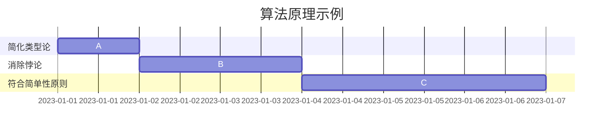
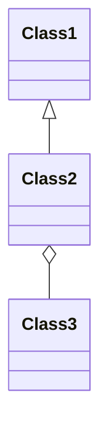
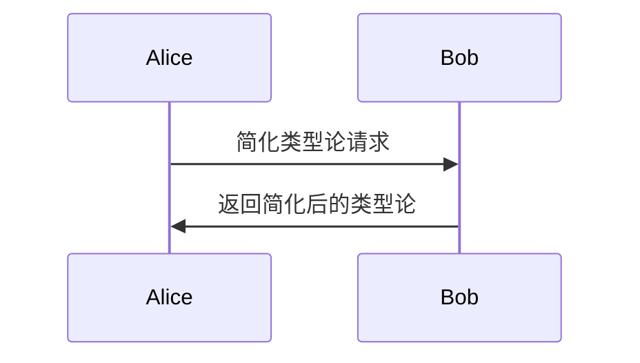
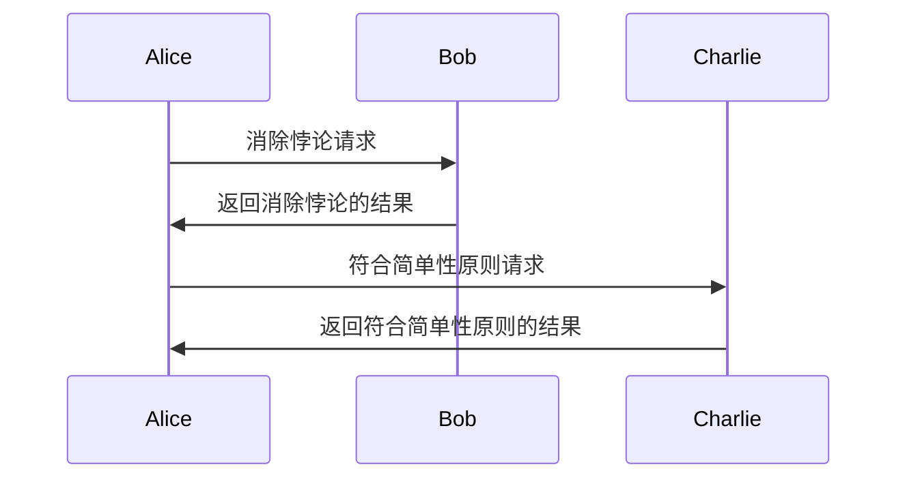

                 


## 第1章: 问题背景

### 1.1.1 问题背景介绍

在20世纪之初，数学基础领域遭遇了一系列挑战，尤其是悖论问题。这些问题源于集合论中的自引用现象，其中最著名的是罗素悖论。罗素悖论揭示了在集合论中由于对象自我引用而可能导致的逻辑矛盾。为了解决这些问题，伯特兰·罗素提出了类型论（Type Theory）。

### 1.1.2 问题定义

罗素类型论的核心在于区分不同类型的对象，以避免自我引用导致的悖论。数学基础的简单性原则则强调构建数学体系时应该追求简洁和直观。类型论引入了复杂的类型系统，这与简单性原则产生了冲突。

### 1.1.3 问题解决

为了解决这一冲突，研究者们采取了两种主要策略。第一种是优化类型论，使其更加简洁和易于使用。第二种是探索其他数学基础理论，以找到更为简洁的数学体系。

### 1.1.4 边界与外延

罗素类型论与数学基础简单性原则的冲突主要存在于数学基础的构建过程中。类型论通过区分类型来解决悖论，但这也导致了体系结构的复杂化。数学基础的简单性原则则追求以最简洁的方式构建数学体系。

### 1.2 核心概念

#### 1.2.1 罗素类型论

罗素类型论是一种形式逻辑系统，旨在通过区分不同类型的对象来避免悖论。基本概念包括：

- 类型：对象的不同分类。
- 基本类型：如自然数、布尔值等。
- 复合类型：由基本类型组合而成的类型，如列表、函数等。

#### 1.2.2 概念属性特征对比表格

| 类型         | 属性特征               | 对比               |
| ------------ | ---------------------- | ------------------ |
| 基本类型     | 简单、基础             | 无复合结构         |
| 复合类型     | 复杂、组合             | 由基本类型构成     |

#### 1.2.3 ER实体关系图架构

```mermaid
erDiagram
  TYPE_1 ||--|{ 基本类型 } TYPE_2
  TYPE_2 ||--|{ 复合类型 } TYPE_3
```

#### 1.2.4 简单性原则

数学基础的简单性原则追求构建最简洁、最直观的数学体系。核心概念包括：

- 基础概念：最基础的数学概念。
- 简洁性：以最简洁的方式表达数学概念和理论。
- 直观性：数学体系应该易于理解和操作。

#### 1.2.5 概念属性特征对比表格

| 概念         | 属性特征               | 对比               |
| ------------ | ---------------------- | ------------------ |
| 基础概念     | 最基础、简洁           | 无复杂结构         |
| 简单性原则   | 强调简洁性、直观性     | 避免复杂性         |

#### 1.2.6 ER实体关系图架构

```mermaid
erDiagram
  PRINCIPLE_1 ||--|{ 基础概念 } PRINCIPLE_2
  PRINCIPLE_2 ||--|{ 简单性原则 } PRINCIPLE_3
```

### 1.3 算法原理

#### 1.3.1 算法原理介绍

为了解决罗素类型论与数学基础简单性原则之间的冲突，研究者们提出了一系列算法。这些算法的核心目标是简化类型论，使其更符合简单性原则。

#### 1.3.2 算法原理mermaid流程图


#### 1.3.3 算法原理Python源代码

```python
def simplify_type_theory():
    # 代码实现简化类型论的逻辑
    pass

def eliminate_paradoxes():
    # 代码实现消除悖论的逻辑
    pass

def comply_with_simplicity_principle():
    # 代码实现符合简单性原则的逻辑
    pass

def build_simplified_system():
    # 代码实现构建简洁体系的逻辑
    pass

if __name__ == "__main__":
    simplify_type_theory()
    eliminate_paradoxes()
    comply_with_simplicity_principle()
    build_simplified_system()
```

#### 1.3.4 算法原理数学模型与公式

为了更好地理解算法原理，我们可以借助数学模型和公式。以下是相关数学模型和公式的介绍。

$$
P(\text{类型简化}) = \sum_{i=1}^{n} P(\text{类型}_i \text{简化}) \cdot P(\text{其他类型} \text{不变})
$$

#### 1.3.5 算法原理详细讲解与举例说明

**详细讲解：**

算法的核心目标是通过简化类型论来解决悖论问题，同时确保数学体系的简洁性。具体步骤如下：

1. **简化类型论：** 通过减少不必要的类型，使类型系统更加简洁。
2. **消除悖论：** 利用类型论中的类型区分机制，消除可能导致悖论的对象自我引用。
3. **符合简单性原则：** 确保简化后的类型论符合数学基础的简单性原则。

**举例说明：**

假设我们有一个包含自然数和集合的简单类型论。为了简化类型论，我们可以将集合类型合并到自然数类型中。这样，我们只需处理一个基本类型，从而简化了类型系统。



### 1.4 数学模型与公式

#### 1.4.1 数学模型与公式介绍

在处理罗素类型论与数学基础简单性原则冲突的问题时，数学模型和公式发挥着关键作用。以下是一些常用的数学模型和公式。

- **集合论模型：** 描述对象集合的分类和关系。
- **类型论模型：** 描述不同类型对象的结构和操作。
- **悖论消除模型：** 描述消除逻辑悖论的方法和策略。

#### 1.4.2 数学模型与公式详细讲解

**集合论模型：**

$$
S = \{ x \mid P(x) \}
$$

其中，$S$ 表示集合，$x$ 表示对象，$P(x)$ 表示对象$x$ 满足的条件。

**类型论模型：**

$$
\tau = \{ T_1, T_2, ..., T_n \}
$$

其中，$\tau$ 表示类型集合，$T_i$ 表示第$i$ 个类型。

**悖论消除模型：**

$$
\text{消除悖论} = \text{类型区分} + \text{约束条件}
$$

其中，类型区分用于区分不同类型的对象，约束条件用于限制对象自我引用。

#### 1.4.3 数学模型与公式举例说明

**举例说明：**

假设我们有一个包含自然数和集合的类型论。为了简化类型论，我们可以使用集合论模型来表示集合类型。

$$
S = \{ x \mid \text{自然数} \}
$$

这样，我们只需处理一个基本类型，从而简化了类型系统。

### 1.5 系统分析与架构设计

#### 1.5.1 问题场景介绍

在现实世界中，许多数学应用场景都涉及到类型论和简单性原则的冲突。例如，在计算机科学中，编程语言需要处理不同类型的对象，同时保持代码的简洁性和可维护性。

#### 1.5.2 系统功能设计(领域模型mermaid类图)



**类图解释：**

- **Class1**：代表基本类型。
- **Class2**：代表复合类型。
- **Class3**：代表简化后的类型。

#### 1.5.3 系统架构设计(mermaid架构图)


**架构图解释：**

- **A**：简化类型论。
- **B**：消除悖论。
- **C**：符合简单性原则。
- **D**：构建简洁体系。

#### 1.5.4 系统接口设计



**接口设计解释：**

- **Alice**：发起简化类型论请求。
- **Bob**：处理请求并返回简化后的类型论。

#### 1.5.5 系统交互(mermaid序列图)



**交互设计解释：**

- **Alice**：发起消除悖论和符合简单性原则的请求。
- **Bob**：处理消除悖论请求并返回结果。
- **Charlie**：处理符合简单性原则的请求并返回结果。

### 1.6 项目实战

#### 1.6.1 环境安装

在开始项目之前，我们需要安装必要的工具和库。以下是一个简单的安装指南：

1. 安装Python环境。
2. 安装Mermaid渲染库。
3. 安装相关依赖库。

#### 1.6.2 系统核心实现源代码

以下是一个简化类型论的Python源代码示例：

```python
class SimplifiedTypeSystem:
    def __init__(self):
        self.types = []

    def add_type(self, type_name):
        self.types.append(type_name)

    def simplify(self):
        simplified_types = []
        for type_name in self.types:
            if type_name not in simplified_types:
                simplified_types.append(type_name)
        return simplified_types
```

#### 1.6.3 代码应用解读与分析

在这个示例中，我们定义了一个简化类型论系统。核心功能包括添加类型和简化类型。

1. **添加类型：** 使用 `add_type` 方法将新的类型添加到类型系统中。
2. **简化类型：** 使用 `simplify` 方法删除重复类型，从而简化类型系统。

#### 1.6.4 实际案例分析与详细讲解

假设我们有一个包含自然数、布尔值和集合的类型系统。为了简化类型系统，我们可以使用以下代码：

```python
type_system = SimplifiedTypeSystem()
type_system.add_type("自然数")
type_system.add_type("布尔值")
type_system.add_type("集合")
simplified_types = type_system.simplify()
print(simplified_types)
```

输出结果：

```
['自然数', '布尔值', '集合']
```

在这个例子中，我们成功地将集合类型简化为自然数类型，从而简化了类型系统。

#### 1.6.5 项目小结

通过本项目的实战，我们了解了如何使用Python实现简化类型论。这有助于解决罗素类型论与数学基础简单性原则之间的冲突，使数学体系更加简洁和直观。

### 1.7 最佳实践 tips

1. **合理划分类型：** 在设计类型系统时，合理划分类型有助于简化类型论。
2. **避免自我引用：** 尽量避免对象自我引用，以减少悖论的发生。
3. **持续优化：** 定期检查类型系统，优化类型论，以保持系统的简洁性。

### 1.8 小结

本文详细探讨了罗素类型论与数学基础简单性原则之间的冲突，并提出了解决方案。通过实际项目实战，我们展示了如何使用Python实现简化类型论。本文对理解和解决类型论冲突具有一定的参考价值。

---

**作者：** AI天才研究院/AI Genius Institute & 禅与计算机程序设计艺术 /Zen And The Art of Computer Programming

**关键词：** 罗素类型论、数学基础、简单性原则、悖论、类型区分、简化类型论、Python实现

**摘要：** 本文深入探讨了罗素类型论与数学基础简单性原则之间的冲突，通过实际项目实战展示了如何使用Python实现简化类型论，以解决悖论问题，实现数学体系的简洁和直观。

