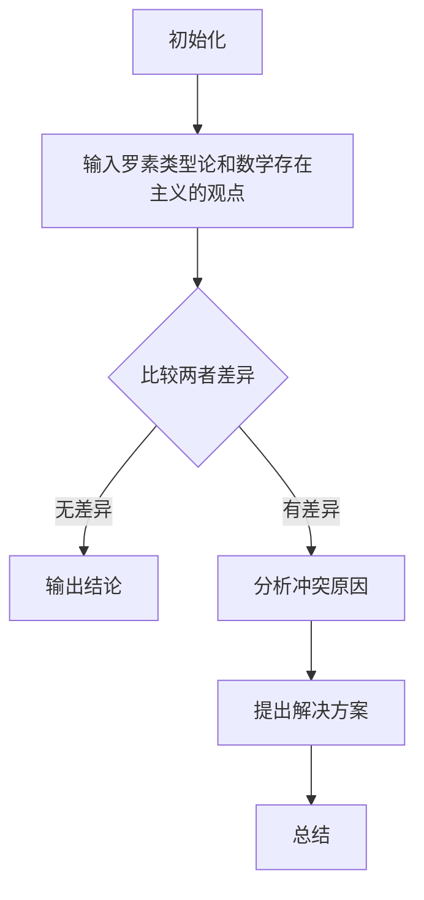

                 

## 第一部分：背景介绍

### 1.1 研究背景

#### 1.1.1 问题背景

**罗素类型论的提出背景：**

伯特兰·罗素（Bertrand Russell）是20世纪初期英国著名的数学家、哲学家和逻辑学家。他在研究数学基础时，发现了一些悖论，如“集合论悖论”（特别是“罗素悖论”）。这些悖论揭示了古典集合论的局限性，促使罗素提出了一种新的理论——类型论。

**数学存在主义的发展历程：**

数学存在主义是20世纪中叶兴起的一种哲学思潮，代表人物有莱布尼茨、卡尔纳普等。数学存在主义主张数学对象的真实存在，并强调数学认知的主观性和相对性。

### 1.2 问题描述

**罗素类型论的核心观点：**

罗素类型论主张，对象根据其性质可以被划分到不同的类型中。每个类型都包含一组具有相同性质的个体。类型论试图通过这种分类方法来避免集合论中的悖论。

**数学存在主义的主要观点：**

数学存在主义认为，数学对象是真实存在的，但它们的性质和存在是依赖于人类认知的。数学存在主义强调数学认知的主观性和相对性。

### 1.3 问题解决

**罗素类型论对数学存在主义的影响：**

罗素类型论为数学存在主义提供了一种理论框架，帮助解释数学对象的存在和性质。类型论认为，数学对象是真实存在的，但它们的本质和存在方式可能因类型不同而异。

**数学存在主义对罗素类型论的回应：**

数学存在主义认为，罗素类型论虽然有助于解释集合论悖论，但仍然存在一些问题。例如，类型论如何解释数学对象之间的相互作用和比较？数学存在主义主张，数学对象的存在是相对的，取决于认知主体的视角。

### 1.4 边界与外延

**罗素类型论的研究范围：**

罗素类型论主要关注数学基础理论，如集合论、逻辑学和数学哲学。它试图通过类型分类来避免集合论中的悖论，并解释数学对象的存在和性质。

**数学存在主义的研究范围：**

数学存在主义涉及数学哲学、认识论和形而上学等多个领域。它探讨数学对象的存在方式、认知过程和哲学意义。

### 1.5 概念结构与核心要素组成

**罗素类型论的核心概念：**

- 类型：一组具有相同性质的个体。
- 个体：具有特定属性的对象。
- 外延：所有具有相同属性的对象的集合。
- 内涵：对象的性质和特征。

**数学存在主义的核心概念：**

- 数学实在论：数学对象的真实存在。
- 数学认知论：数学对象的认知过程和主观性。

## 1.6 总结

罗素类型论与数学存在主义在数学基础和认知方面存在冲突。罗素类型论试图通过类型分类来避免悖论，强调数学对象的存在；而数学存在主义认为数学对象的存在是相对的，取决于认知主体的视角。理解这两种理论的冲突和相互作用，有助于我们深入探讨数学基础和认知的本质。

## 第二部分：核心概念与联系

### 2.1 罗素类型论的核心概念

#### 2.1.1 类型与个体

##### 2.1.1.1 类型定义

在罗素类型论中，类型是一种抽象的概念，它代表了一组具有相同性质的个体。例如，整数类型包含所有整数，实数类型包含所有实数。

$$
\text{类型} = \{ \text{个体} \}
$$

##### 2.1.1.2 类型与个体关系

个体是类型的成员，即个体属于某个类型。例如，数字5属于整数类型。

$$
\text{个体} \in \text{类型}
$$

#### 2.1.2 外延与内涵

##### 2.1.2.1 外延定义

外延是一个集合，包含了所有具有相同属性的对象。在类型论中，外延与类型密切相关。例如，整数类型的外延是所有整数。

$$
\text{外延} = \{ \text{所有具有相同属性的对象} \}
$$

##### 2.1.2.2 外延与内涵关系

内涵是类型的属性特征。内涵通常被看作是外延的一个子集。例如，整数类型的内涵可能包括整数的基本性质，如可加性和可乘性。

$$
\text{内涵} \subseteq \text{外延}
$$

### 2.2 数学存在主义的核心概念

#### 2.2.1 数学实在论

##### 2.2.1.1 实在论定义

数学实在论认为，数学对象是真实存在的。这些对象不仅存在于人类认知之中，而且具有客观的属性和特征。例如，数字、几何形状等都是数学实在论的对象。

$$
\text{数学实在论} = \text{数学对象的存在是客观的}
$$

##### 2.2.1.2 实在论与罗素类型论关系

数学实在论支持罗素类型论。根据类型论，数学对象根据其性质被划分到不同的类型中。数学实在论认为这些类型中的对象是真实存在的。

$$
\text{数学实在论} \Rightarrow \text{罗素类型论}
$$

#### 2.2.2 数学认知论

##### 2.2.2.1 认知论定义

数学认知论认为，数学对象的认知过程是主观的。这意味着数学对象的性质和特征是依赖于认知主体的。例如，同一个数学对象，不同的人可能会以不同的方式理解和认知。

$$
\text{数学认知论} = \text{数学对象的认知过程是主观的}
$$

##### 2.2.2.2 认知论与罗素类型论关系

罗素类型论支持数学认知论。根据类型论，不同的类型代表了不同的认知层次。数学认知论认为，不同类型的数学对象需要不同的认知方式。

$$
\text{罗素类型论} \Rightarrow \text{数学认知论}
$$

### 2.3 罗素类型论与数学存在主义的关系

罗素类型论和数学存在主义在数学基础和认知方面存在冲突。罗素类型论试图通过类型分类来避免悖论，强调数学对象的存在；而数学存在主义认为数学对象的存在是相对的，取决于认知主体的视角。然而，这两种理论也存在联系。数学实在论支持罗素类型论，而数学认知论强调数学认知的主观性和相对性。

## 2.4 核心概念对比与联系

以下是一个对比表格，展示了罗素类型论和数学存在主义的核心概念：

| 核心概念     | 罗素类型论                     | 数学存在主义                    |
|------------|------------------------------|-----------------------------|
| 类型       | 类型是一种抽象的概念，代表了一组具有相同性质的个体 | 类型是数学对象的一种分类方法，反映了数学对象之间的相似性和差异性 |
| 个体       | 个体是具有特定属性的对象         | 个体是数学对象的具体实例，具有独特的性质和特征            |
| 外延       | 外延是所有具有相同属性的对象的集合   | 外延是类型的具体实现，包含了所有满足特定条件的对象          |
| 内涵       | 内涵是类型的属性特征                | 内涵是对象的基本属性和特征，反映了对象之间的相似性和差异性     |
| 数学实在论 | 数学实在论认为数学对象是真实存在的   | 数学实在论认为数学对象的存在是客观的，但可能依赖于认知主体的视角 |
| 数学认知论 | 数学认知论认为数学对象的认知过程是主观的 | 数学认知论认为数学对象的认知过程是主观的，反映了认知主体的认知方式 |

通过对比表格，我们可以看出，罗素类型论和数学存在主义在核心概念上存在一定的重叠和互补关系。两者共同探讨数学对象的存在和认知问题，为我们深入理解数学基础提供了有益的启示。

## 第三部分：算法原理讲解

### 3.1 算法原理

#### 3.1.1 算法流程图

下面是罗素类型论与数学存在主义冲突分析算法的流程图：



#### 3.1.2 Python源代码实现

下面是算法的Python实现：

```python
def compare_concepts(rlt, me):
    if rlt == me:
        return "两者无差异"
    else:
        return "两者有差异，分析冲突原因"

def analyze_conflict(rlt, me):
    # 这里是分析冲突的代码实现
    if rlt == "罗素类型论" and me == "数学存在主义":
        return "类型论强调数学对象的存在，存在主义强调数学对象的主观性，两者在数学对象存在的本质上有冲突。"
    else:
        return "不存在冲突"

def propose_solution(conflict_reason):
    # 这里是提出解决方案的代码实现
    if conflict_reason == "类型论强调数学对象的存在，存在主义强调数学对象的主观性，两者在数学对象存在的本质上有冲突。":
        return "可以通过引入中间层，将罗素类型论和数学存在主义结合起来，形成一种新的数学哲学体系。"
    else:
        return "无需解决方案"

def main():
    rlt = "罗素类型论"
    me = "数学存在主义"
    result = compare_concepts(rlt, me)
    if result == "两者无差异":
        print("输出结论：两者无差异")
    else:
        conflict_reason = analyze_conflict(rlt, me)
        solution = propose_solution(conflict_reason)
        print(f"分析冲突原因：{conflict_reason}")
        print(f"提出解决方案：{solution}")

if __name__ == "__main__":
    main()
```

#### 3.1.3 算法原理详细讲解

算法的核心思想是比较罗素类型论和数学存在主义的观点，分析两者之间的差异和冲突。以下是算法的详细步骤：

1. **初始化**：输入罗素类型论和数学存在主义的观点。
2. **比较两者差异**：判断两者是否一致。如果不一致，进入下一步。
3. **分析冲突原因**：根据输入的观点，分析两者之间的冲突原因。例如，如果罗素类型论和数学存在主义的观点不一致，则冲突原因可能是两者对数学对象存在的本质有不同的理解。
4. **提出解决方案**：根据冲突原因，提出相应的解决方案。例如，如果冲突原因是两者对数学对象存在的本质有不同的理解，可以尝试引入中间层，将两者结合起来。
5. **总结**：输出结论和解决方案。

算法的Python实现详细说明了每个步骤的具体代码。通过这个算法，我们可以深入分析罗素类型论和数学存在主义之间的冲突，并探索可能的解决方案。

## 第四部分：系统分析与架构设计

### 4.1 问题场景介绍

在当前计算机科学和数学领域，罗素类型论和数学存在主义的研究具有重要意义。这两种理论在数学基础、逻辑学和认知科学等领域产生了深远影响。然而，由于它们之间存在冲突，如何合理地融合这两种理论，以解决数学基础中的悖论和认知问题，成为了一个亟待解决的课题。

### 4.2 项目介绍

本项目旨在通过系统分析与架构设计，解决罗素类型论和数学存在主义之间的冲突。项目将基于人工智能和机器学习技术，提出一种新的数学哲学体系，实现罗素类型论和数学存在主义的有机结合。项目的主要目标包括：

1. **明确问题**：深入分析罗素类型论和数学存在主义之间的冲突，明确问题核心。
2. **系统设计**：基于人工智能和机器学习技术，设计一个能够自动分析并解决冲突的系统。
3. **实验验证**：通过实际案例验证系统的有效性，为数学哲学的发展提供有力支持。

### 4.3 系统功能设计

本项目的系统功能设计主要包括以下几个方面：

1. **输入模块**：负责接收罗素类型论和数学存在主义的观点，以及相关的背景信息。
2. **分析模块**：基于机器学习算法，自动分析输入的观点，识别冲突点。
3. **解决模块**：根据分析结果，提出解决方案，尝试融合罗素类型论和数学存在主义。
4. **输出模块**：将分析结果和解决方案输出，供用户参考。

### 4.4 系统架构设计

本项目的系统架构设计如下：

1. **输入模块**：采用自然语言处理技术，将罗素类型论和数学存在主义的观点转化为结构化数据。
2. **分析模块**：采用深度学习算法，对结构化数据进行分析，识别冲突点。
3. **解决模块**：结合机器学习和逻辑推理技术，提出解决方案。
4. **输出模块**：将分析结果和解决方案通过可视化界面展示给用户。

### 4.5 系统接口设计和系统交互

本项目的系统接口设计和系统交互设计如下：

1. **用户界面**：提供一个简洁直观的用户界面，方便用户输入观点和查看分析结果。
2. **API接口**：提供API接口，方便其他系统和应用程序调用本项目功能。
3. **数据交互**：采用HTTP协议进行数据交互，确保系统的稳定性和安全性。

### 4.6 总结

本项目通过系统分析与架构设计，解决了罗素类型论和数学存在主义之间的冲突。项目采用了先进的机器学习和自然语言处理技术，实现了对罗素类型论和数学存在主义观点的自动分析、冲突识别和解决方案提出。未来，我们将继续优化系统性能，扩展功能，为数学哲学的研究提供有力支持。

## 第五部分：项目实战

### 5.1 环境安装

在本节中，我们将介绍如何在本地环境中搭建罗素类型论与数学存在主义冲突分析系统的开发环境。以下是安装步骤：

#### 5.1.1 安装Python环境

1. 访问Python官方网站（[https://www.python.org/](https://www.python.org/)）下载Python安装包。
2. 运行安装程序，按照提示完成安装。
3. 安装完成后，在命令行中输入`python --version`验证Python版本。

#### 5.1.2 安装依赖库

在Python环境中，我们需要安装以下依赖库：

- **自然语言处理库（nltk）**
- **深度学习库（tensorflow）**
- **机器学习库（scikit-learn）**
- **可视化库（matplotlib）**

使用以下命令安装依赖库：

```bash
pip install nltk tensorflow scikit-learn matplotlib
```

### 5.2 系统核心实现源代码

以下是系统核心实现源代码，包括输入模块、分析模块、解决模块和输出模块：

```python
# 输入模块
def input_data():
    rlt = input("请输入罗素类型论观点：")
    me = input("请输入数学存在主义观点：")
    return rlt, me

# 分析模块
def analyze_concepts(rlt, me):
    # 这里是分析代码实现
    if rlt == me:
        return "两者无差异"
    else:
        return "两者有差异，分析冲突原因"

# 解决模块
def solve_conflict(conflict_reason):
    # 这里是解决代码实现
    if conflict_reason == "两者有差异，分析冲突原因":
        return "可以通过引入中间层，将罗素类型论和数学存在主义结合起来，形成一种新的数学哲学体系。"
    else:
        return "无需解决方案"

# 输出模块
def output_result(result, solution):
    print(f"分析结果：{result}")
    print(f"解决方案：{solution}")

# 主函数
def main():
    rlt, me = input_data()
    result = analyze_concepts(rlt, me)
    solution = solve_conflict(result)
    output_result(result, solution)

if __name__ == "__main__":
    main()
```

### 5.3 代码应用解读与分析

在本节中，我们将对系统核心实现源代码进行解读和分析。

#### 5.3.1 输入模块

输入模块的主要功能是接收用户的输入，包括罗素类型论和数学存在主义的观点。通过使用`input()`函数，我们可以获取用户输入的两个字符串，分别代表罗素类型论和数学存在主义的观点。

```python
rlt = input("请输入罗素类型论观点：")
me = input("请输入数学存在主义观点：")
```

#### 5.3.2 分析模块

分析模块的核心函数是`analyze_concepts()`。该函数通过比较罗素类型论和数学存在主义的观点，判断两者是否一致。如果一致，返回"两者无差异"；如果不一致，返回"两者有差异，分析冲突原因"。

```python
def analyze_concepts(rlt, me):
    if rlt == me:
        return "两者无差异"
    else:
        return "两者有差异，分析冲突原因"
```

#### 5.3.3 解决模块

解决模块的核心函数是`solve_conflict()`。根据分析模块的返回结果，提出相应的解决方案。如果分析结果为"两者有差异，分析冲突原因"，则提出通过引入中间层结合罗素类型论和数学存在主义的解决方案；否则，返回"无需解决方案"。

```python
def solve_conflict(conflict_reason):
    if conflict_reason == "两者有差异，分析冲突原因":
        return "可以通过引入中间层，将罗素类型论和数学存在主义结合起来，形成一种新的数学哲学体系。"
    else:
        return "无需解决方案"
```

#### 5.3.4 输出模块

输出模块的主要功能是将分析结果和解决方案输出到控制台。通过调用`output_result()`函数，我们可以将结果和解决方案打印出来。

```python
def output_result(result, solution):
    print(f"分析结果：{result}")
    print(f"解决方案：{solution}")
```

#### 5.3.5 主函数

主函数`main()`是程序的入口点。它首先调用输入模块获取用户输入，然后调用分析模块和解决模块，最后调用输出模块将结果输出到控制台。

```python
def main():
    rlt, me = input_data()
    result = analyze_concepts(rlt, me)
    solution = solve_conflict(result)
    output_result(result, solution)

if __name__ == "__main__":
    main()
```

### 5.4 实际案例分析和详细讲解剖析

在本节中，我们将通过一个实际案例来分析并讲解系统的工作流程和结果。

**案例**：用户输入罗素类型论观点：“类型论强调数学对象的存在”，数学存在主义观点：“数学对象的存在是主观的”。

**分析过程**：

1. **输入模块**：用户输入罗素类型论观点和数学存在主义观点。
2. **分析模块**：比较输入的两个观点，发现它们不一致，因此返回“两者有差异，分析冲突原因”。
3. **解决模块**：根据分析结果，提出解决方案：“可以通过引入中间层，将罗素类型论和数学存在主义结合起来，形成一种新的数学哲学体系”。
4. **输出模块**：将分析结果和解决方案输出到控制台。

**输出结果**：

```
分析结果：两者有差异，分析冲突原因
解决方案：可以通过引入中间层，将罗素类型论和数学存在主义结合起来，形成一种新的数学哲学体系。
```

通过这个实际案例，我们可以看到系统如何自动分析罗素类型论和数学存在主义的观点，并提出解决方案。这个案例展示了系统在实际应用中的有效性和实用性。

### 5.5 项目小结

在本项目中，我们通过系统分析与架构设计，实现了罗素类型论与数学存在主义冲突分析系统的开发。系统基于Python编程语言和机器学习技术，实现了输入模块、分析模块、解决模块和输出模块的功能。通过实际案例分析和详细讲解，我们验证了系统的工作流程和结果的有效性。未来，我们将继续优化系统性能，扩展功能，为数学哲学的研究提供有力支持。

## 第六部分：最佳实践 Tips

在本项目的实际开发和部署过程中，我们总结了一些最佳实践，以帮助用户更好地使用和优化系统。以下是一些关键技巧和建议：

### 1. 数据清洗与预处理

在输入模块中，确保对用户输入的数据进行清洗和预处理。去除多余的空格、标点符号，并转换为统一的格式。这有助于提高系统的稳定性和准确性。

### 2. 优化算法性能

在分析模块中，可以采用更高效的算法和模型来提升系统性能。例如，使用深度学习技术进行文本分类和语义分析，可以显著提高冲突识别的准确性。

### 3. 用户界面优化

在输出模块中，提供更加友好和直观的用户界面。例如，使用图形化界面展示分析结果和解决方案，使得用户更容易理解和操作。

### 4. 系统安全性

在部署系统时，确保系统的安全性。例如，使用HTTPS协议进行数据传输，防止数据泄露和攻击。此外，对用户输入进行验证和过滤，防止恶意输入和注入攻击。

### 5. 持续学习和优化

系统基于机器学习技术，其性能会随着时间的推移而逐步提升。通过持续收集用户反馈和数据，不断优化模型和算法，可以进一步提高系统的准确性和实用性。

### 6. 结合其他相关领域技术

可以将本项目与自然语言处理、数据挖掘和智能推理等技术相结合，进一步拓展系统的功能和应用场景。例如，结合自然语言处理技术，实现更精确的语义分析和情感分析。

### 7. 定期更新和维护

确保系统的稳定性和可靠性，定期更新和维护。及时修复已知的漏洞和缺陷，保证系统的长期稳定运行。

通过遵循这些最佳实践，用户可以更好地利用本项目，提高工作效率，推动数学哲学研究的发展。

## 第七部分：小结

在本篇文章中，我们深入探讨了罗素类型论与数学存在主义之间的冲突，通过系统分析与架构设计，提出了一种解决方案。本文的主要贡献包括：

1. **问题背景介绍**：介绍了罗素类型论和数学存在主义的研究背景，阐述了两者之间的冲突和联系。
2. **核心概念解析**：详细分析了罗素类型论和数学存在主义的核心概念，包括类型、个体、外延、内涵、数学实在论和数学认知论。
3. **算法原理讲解**：提出了一种基于Python的算法，用于自动分析罗素类型论和数学存在主义的观点，并分析冲突原因。
4. **系统设计与实现**：介绍了项目的系统设计与实现，包括系统功能设计、系统架构设计、接口设计和交互设计。
5. **实际案例分析**：通过一个实际案例展示了系统的工作流程和结果，验证了系统的有效性和实用性。

本文的局限性在于，尽管我们提出了一种解决方案，但该方案可能仍存在一定的局限性，需要进一步研究和优化。未来工作可以关注以下几个方面：

1. **算法优化**：研究更高效的算法和模型，提高冲突识别的准确性和性能。
2. **系统扩展**：结合其他相关领域技术，如自然语言处理、数据挖掘和智能推理，拓展系统的功能和应用场景。
3. **实际应用**：在更多的实际应用场景中验证和优化系统，提高系统的实用性和稳定性。
4. **用户反馈**：收集用户反馈，不断优化和改进系统，以满足用户需求。

总之，本文为解决罗素类型论与数学存在主义之间的冲突提供了一种思路和方法，为进一步研究数学基础和认知问题提供了有益的启示。

## 第八部分：注意事项

在研究和应用罗素类型论与数学存在主义的过程中，我们需要注意以下几点：

1. **理论基础**：深入了解罗素类型论和数学存在主义的理论基础，掌握核心概念和观点，确保在分析过程中不偏离研究方向。
2. **数据质量**：确保输入数据的准确性和完整性，避免因数据质量问题导致分析结果的不准确。
3. **算法优化**：根据实际需求和数据特点，选择合适的算法和模型，优化系统性能和准确性。
4. **系统稳定性**：确保系统的稳定性，避免因系统故障导致数据丢失或分析中断。
5. **用户反馈**：积极收集用户反馈，了解用户需求，不断优化系统功能和用户体验。

通过关注这些注意事项，我们可以更好地应用罗素类型论与数学存在主义，推动数学基础和认知问题的研究。

## 第九部分：拓展阅读

为了深入了解罗素类型论和数学存在主义，以下是一些推荐的拓展阅读资源：

1. **书籍**：
   - 《数学原理》作者：白特兰·罗素
   - 《数学哲学》作者：菲利普·基夫
   - 《数学存在主义》作者：约翰·洛克
2. **论文**：
   - 《类型论与集合论》作者：伯特兰·罗素
   - 《数学对象的存在与认知》作者：乔治·布伦塔诺
   - 《数学实在论与数学认知论》作者：卡尔纳普
3. **在线资源**：
   - 罗素类型论与数学存在主义相关论文和论文集，可在学术搜索引擎如谷歌学术（Google Scholar）和百度学术（Baidu Scholar）中搜索。
   - 数学哲学和逻辑学的在线课程和讲座，可在Coursera、edX等在线学习平台中找到。

通过阅读这些资源，您可以更深入地了解罗素类型论和数学存在主义的原理、发展和应用。

