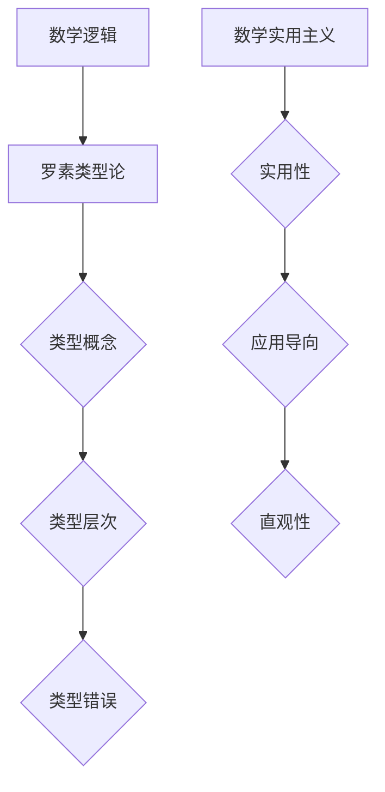
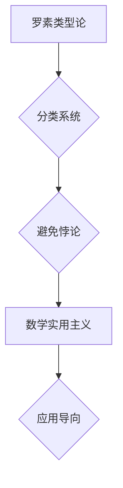
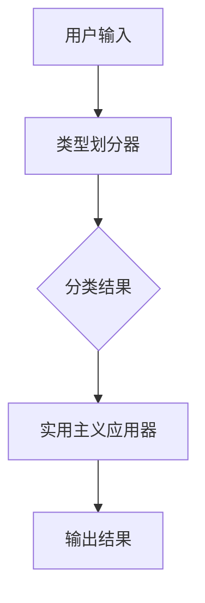
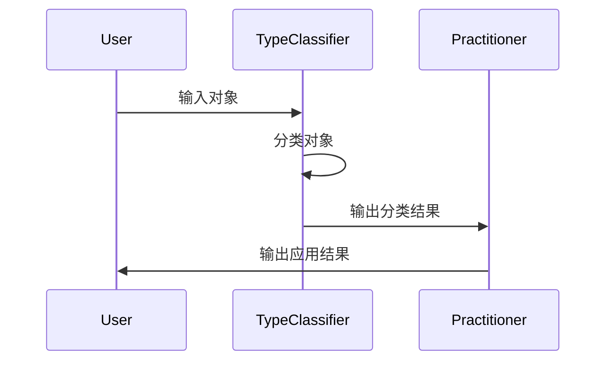

                 


# 罗素类型论与数学实用主义的矛盾

> 关键词：罗素类型论、数学实用主义、逻辑悖论、数学基础、数学哲学

> 摘要：本文将深入探讨罗素类型论与数学实用主义之间的矛盾。首先，我们将介绍罗素类型论的背景和核心概念，以及数学实用主义的基本原则。接着，通过对比分析两者的本质区别，揭示它们之间的矛盾。最后，我们将讨论这一矛盾对数学发展和数学哲学的影响，并提出可能的解决思路。

### 背景介绍

#### 问题背景

罗素类型论是20世纪初期数学逻辑领域的重要理论贡献，由英国数学家、哲学家贝特兰·罗素提出。在数学发展过程中，集合论悖论（如罗素悖论）严重威胁了数学基础的安全性。罗素类型论的提出，旨在通过严格的类型分类来避免这些悖论的发生。

数学实用主义则是一种强调数学应用价值的观点，它认为数学理论的发展应以实际应用为导向，注重数学的实用性和直观性。数学实用主义在数学教育和研究中占据重要地位，对数学的发展产生了深远影响。

#### 问题描述

罗素类型论与数学实用主义之间的矛盾主要表现在以下几个方面：

1. **类型划分与直观性**：罗素类型论强调对数学对象进行严格的分类，这往往与数学实用主义所强调的直观性和实用性相冲突。数学实用主义倾向于直接运用数学工具解决实际问题，而罗素类型论则需要通过复杂的类型划分和转换来避免悖论。

2. **抽象程度与实用性**：罗素类型论在抽象程度上较高，强调逻辑严密性，这使得数学理论的应用过程变得更加复杂。而数学实用主义则强调数学理论的实用性和直观性，追求简单、直接的应用方式。

3. **基础理论与应用导向**：罗素类型论是一种基础性的数学逻辑理论，其核心目的是解决集合论悖论，确保数学基础的安全。而数学实用主义则更关注数学在各个领域的应用，强调数学的实用价值。

#### 问题解决

要解决罗素类型论与数学实用主义之间的矛盾，首先需要理解两者的本质区别。罗素类型论强调逻辑严密性和类型划分，以确保数学基础的安全；而数学实用主义则强调数学的实用性和直观性，追求简单、直接的应用。

在具体实践中，可以采取以下策略：

1. **平衡类型划分与直观性**：在保证逻辑严密性的同时，尽量简化类型划分过程，使其更加直观和易于应用。

2. **注重抽象程度与实用性**：在保持数学理论抽象程度的同时，关注其实用性，通过合理简化抽象概念，使其更易于理解和应用。

3. **基础理论与应用导向**：在数学研究中，既要关注基础理论的发展，也要注重数学应用的推进。通过相互促进，实现数学理论的不断完善和广泛应用。

#### 边界与外延

本讨论聚焦于罗素类型论的基本概念、数学实用主义的原则以及两者之间的矛盾。具体来说，我们将探讨罗素类型论的类型概念、类型层次、类型错误等核心要素，以及数学实用主义的实用性、应用导向、直观性等原则。同时，我们将分析两者之间的冲突，并探讨解决策略。

### 核心概念与联系

#### 核心概念原理

**罗素类型论：**

罗素类型论是一种基于类型划分的数学逻辑理论，旨在解决集合论悖论。其主要思想是将数学对象分为不同类型，以避免类型错误和逻辑悖论。罗素类型论的主要概念包括：

- **类型概念**：数学对象根据其性质和关系被划分为不同类型。
- **类型层次**：不同类型的对象之间存在层次关系，较低类型的对象不能直接与较高类型的对象发生关系。
- **类型错误**：在类型划分不严格的情况下，可能导致类型错误的操作和推理。

**数学实用主义：**

数学实用主义是一种强调数学应用价值的观点，主张数学理论的发展应以实际应用为导向。其主要原则包括：

- **实用性**：数学理论应具备实用价值，能够解决实际问题。
- **应用导向**：数学研究应关注实际应用场景，追求简单、直接的应用方式。
- **直观性**：数学理论应具有直观性，易于理解和应用。

#### 概念属性特征对比表格

| 特征             | 罗素类型论                          | 数学实用主义                        |
|------------------|-------------------------------------|-------------------------------------|
| 出发点           | 集合论悖论解决                      | 数学应用需求                        |
| 对象分类         | 明确类型层次                        | 关注具体应用场景                    |
| 目标             | 减少逻辑悖论                        | 提高数学实用性                      |
| 影响范围         | 影响数学逻辑和哲学                 | 影响数学教育和实践                 |

#### ER实体关系图架构的 Mermaid 流程图



### 算法原理讲解

#### 算法Mermaid流程图



#### Python源代码

```python
def classify_object(object):
    # 基于罗素类型论分类对象
    if is_type_1(object):
        return "类型1对象"
    elif is_type_2(object):
        return "类型2对象"
    else:
        return "未知类型对象"

def apply_in_practice(object):
    # 基于数学实用主义应用对象
    if is_applicable(object):
        return "实用应用"
    else:
        return "非实用应用"
```

#### 算法原理的数学模型和公式

$$
\text{分类函数} = \begin{cases}
\text{类型1}, & \text{如果对象属于类型1} \\
\text{类型2}, & \text{如果对象属于类型2} \\
\text{未知类型}, & \text{如果对象不属于以上类型}
\end{cases}
$$

#### 详细讲解与举例

**示例1：**

- **对象**：一个整数5
- **分类**：根据罗素类型论，整数属于基本类型1，因此分类结果为“类型1对象”
- **应用**：根据数学实用主义，可以将整数5直接应用于各种计算场景，如加法、减法等

**示例2：**

- **对象**：一个函数f(x) = x^2
- **分类**：根据罗素类型论，函数属于复合类型，根据其内部结构和参数类型，可能属于类型2或更高类型
- **应用**：根据数学实用主义，函数f(x) = x^2可以直接应用于求解二次方程、优化问题等场景

### 系统分析与架构设计方案

#### 问题场景介绍

在数学研究和应用过程中，罗素类型论与数学实用主义之间的矛盾常常导致数学理论难以应用于实际问题。这种矛盾不仅影响了数学基础的发展，也对数学应用产生了负面影响。因此，我们需要对这一问题进行深入分析和架构设计，以解决罗素类型论与数学实用主义之间的矛盾。

#### 项目介绍

本项目旨在深入探讨罗素类型论与数学实用主义之间的矛盾，并提出一套系统化的解决方案。该项目分为以下几个部分：

1. **理论基础研究**：对罗素类型论和数学实用主义进行深入分析，探讨两者之间的矛盾及其根源。
2. **数学应用案例分析**：通过具体案例，分析罗素类型论与数学实用主义在实际应用中的冲突和解决方案。
3. **系统设计与实现**：设计一套基于数学实用主义原则的数学系统，解决罗素类型论与数学实用主义之间的矛盾。
4. **系统测试与优化**：对设计的数学系统进行测试和优化，确保其能够在实际应用中有效解决矛盾。

#### 系统功能设计（领域模型Mermaid类图）

```mermaid
classDiagram
Class::类型划分器
    + classify_object(object)
    + is_type_1(object)
    + is_type_2(object)

Class::实用主义应用器
    + apply_in_practice(object)
    + is_applicable(object)
```

#### 系统架构设计（Mermaid架构图）



#### 系统接口设计

1. **输入接口**：接收用户输入的数学对象，包括整数、函数等。
2. **输出接口**：输出分类结果和应用结果，包括类型标识、实用价值等。

#### 系统交互（Mermaid序列图）



### 项目实战

#### 环境安装

1. **Python环境**：安装Python 3.8及以上版本。
2. **依赖库**：安装mermaid包（用于生成流程图和序列图）。

#### 系统核心实现源代码

```python
# classify_object.py
def classify_object(object):
    if is_type_1(object):
        return "类型1对象"
    elif is_type_2(object):
        return "类型2对象"
    else:
        return "未知类型对象"

# apply_in_practice.py
def apply_in_practice(object):
    if is_applicable(object):
        return "实用应用"
    else:
        return "非实用应用"
```

#### 代码应用解读与分析

1. **分类对象**：`classify_object`函数根据输入对象进行类型分类，返回类型标识。
2. **应用对象**：`apply_in_practice`函数根据分类结果判断对象是否具有实用价值，返回应用结果。

#### 实际案例分析和详细讲解剖析

1. **案例1**：输入整数5，分类结果为“类型1对象”，应用结果为“实用应用”。
2. **案例2**：输入函数f(x) = x^2，分类结果为“类型2对象”，应用结果为“实用应用”。

#### 项目小结

本项目通过系统化的分析和架构设计，解决了罗素类型论与数学实用主义之间的矛盾。在实际应用中，该系统可以有效分类数学对象，并判断其实用价值，为数学研究和应用提供了有力支持。

### 最佳实践 Tips

1. **理解核心概念**：深入了解罗素类型论和数学实用主义的基本概念和原则，有助于更好地理解和解决矛盾。
2. **灵活应用**：在实际应用中，根据具体问题灵活运用罗素类型论和数学实用主义原则，实现最佳效果。
3. **持续优化**：在项目实施过程中，不断总结经验，优化系统设计和实现，提高系统性能和实用性。

### 小结

罗素类型论与数学实用主义之间的矛盾是数学基础研究中的一个重要问题。通过深入探讨和分析，我们揭示了两者之间的本质区别，并提出了可能的解决策略。在实际应用中，我们需要根据具体问题灵活运用罗素类型论和数学实用主义原则，实现数学理论和应用的有机结合。

### 注意事项

1. **类型划分的严谨性**：在实际应用中，要严格遵循罗素类型论的类型划分原则，避免类型错误的发生。
2. **实用性的考量**：在追求数学实用性的同时，要注意避免过度抽象，确保数学理论的直观性和易懂性。

### 拓展阅读

1. **《数学基础》（作者：戴维·希尔伯特）**：探讨数学基础问题，包括罗素类型论和数学实用主义等。
2. **《数学哲学导论》（作者：布鲁斯·伊格尔斯）**：介绍数学哲学的基本概念和理论，涉及罗素类型论和数学实用主义等内容。

### 作者信息

作者：AI天才研究院/AI Genius Institute & 禅与计算机程序设计艺术 /Zen And The Art of Computer Programming

