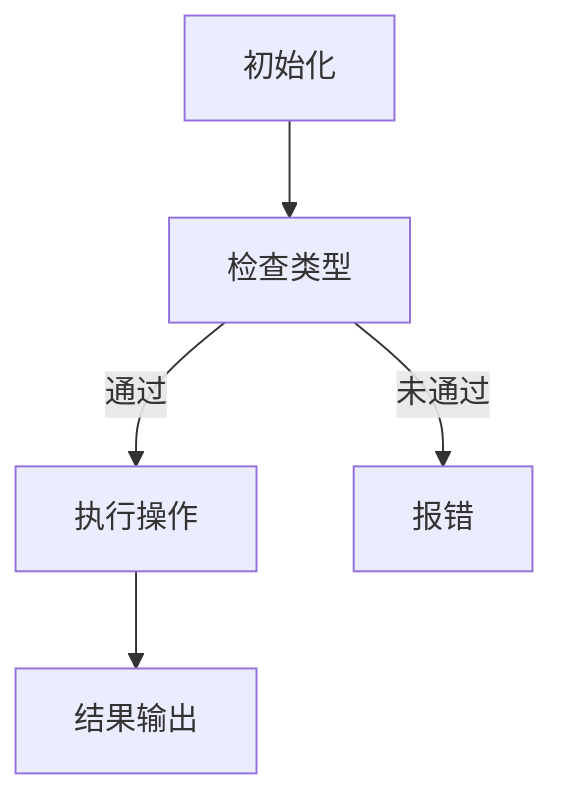
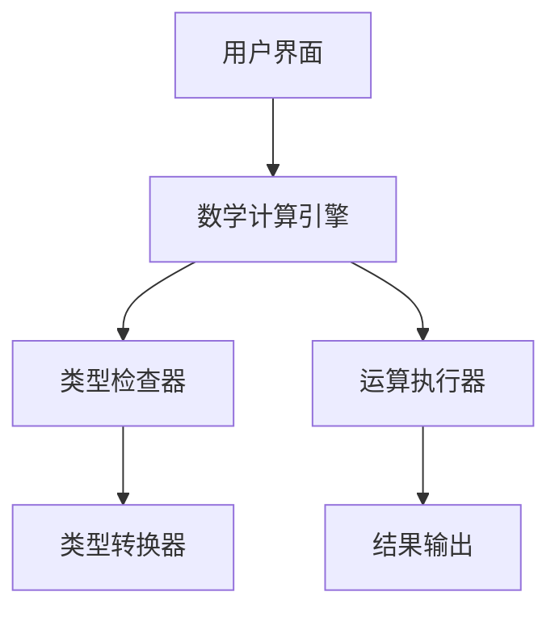
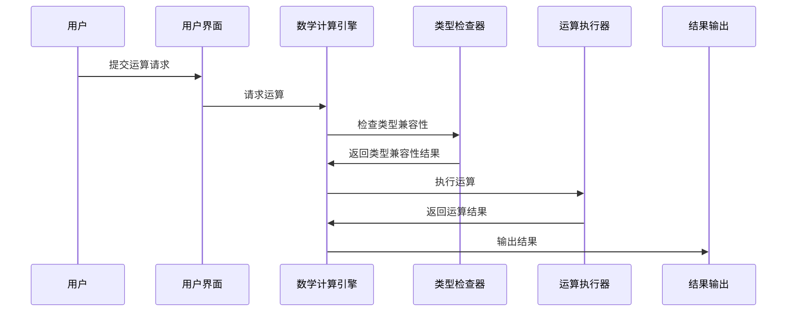
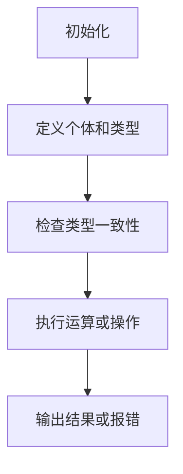
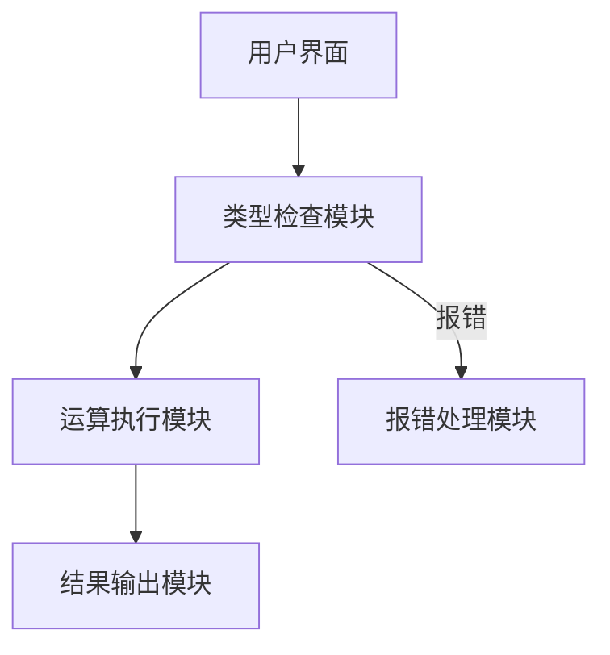
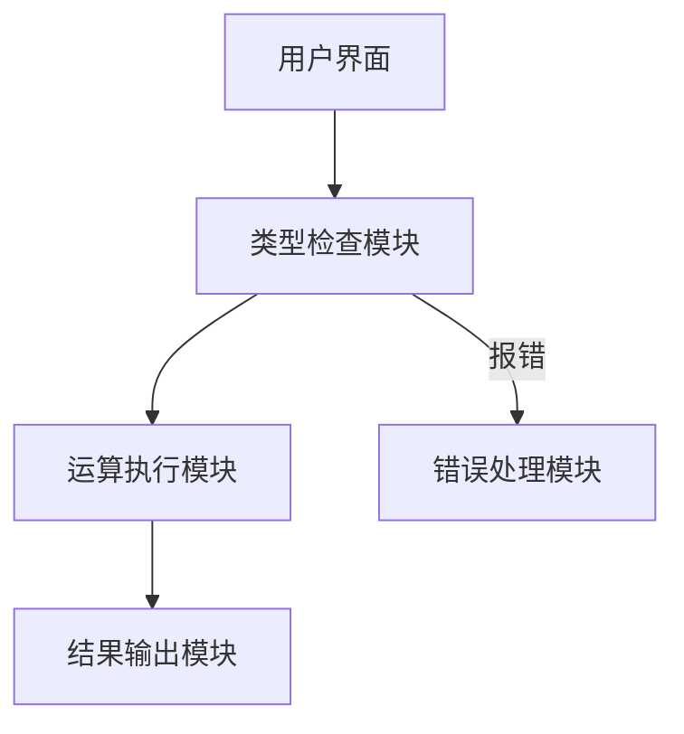
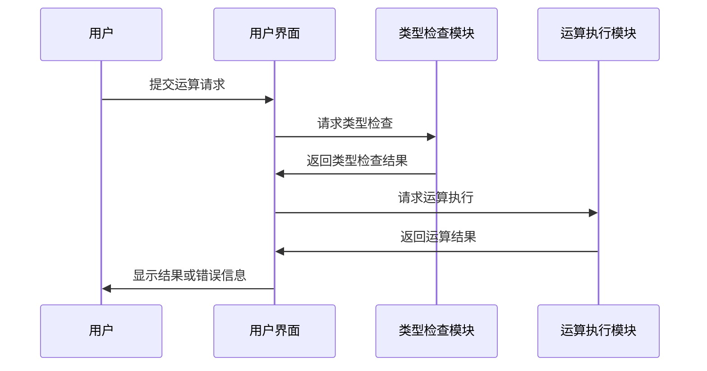

                 


# 罗素类型论与数学普遍性原则的冲突

关键词：罗素类型论、数学普遍性原则、类型错误、集合论、数学基础

摘要：本文旨在深入探讨罗素类型论与数学普遍性原则之间的冲突。通过对罗素类型论的基本概念和数学普遍性原则的详细阐述，我们将逐步揭示两者之间的矛盾，并通过分析算法原理和系统架构设计，提出解决冲突的方法。

## 一、背景介绍

### 1.1 核心概念

罗素类型论是由英国哲学家和数学家伯特兰·罗素提出的一种逻辑理论，旨在解决集合论中的悖论问题。罗素类型论的基本概念包括：

- **个体**：任何可以独立存在的对象，如数字、物体等。
- **类型**：个体的分类，根据其性质和特征进行划分。
- **类型错误**：当个体被错误地赋予其类型时，会导致逻辑错误。

数学普遍性原则是指数学的基本原理和定义具有普遍适用性，无论是整数、实数还是更复杂的数学结构，都遵循相同的数学规则。

### 1.2 问题描述

罗素在研究集合论时发现了类型论与数学普遍性原则之间的冲突。具体而言，集合论中的某些集合定义会导致类型错误，例如罗素的悖论。罗素的悖论指出，如果我们定义一个集合A，其中包含所有不包含自身作为元素的集合，那么A自身是否包含自身呢？如果A包含自身，那么它就不应该包含自身；如果不包含自身，那么它又应该包含自身。这个悖论揭示了类型论与数学普遍性原则之间的矛盾。

### 1.3 问题解决

罗素提出了一种解决类型论与数学普遍性原则冲突的方法，即引入类型层次结构。他认为，个体和集合可以被划分为不同的类型，类型之间具有层次关系。通过限制不同类型之间的交互，可以避免类型错误。具体而言，罗素提出了以下原则：

- **类型层次原则**：个体的类型不能高于其包含的元素类型。
- **类型转换原则**：只有当操作符和操作数具有相同的类型时，才能进行操作。

### 1.4 边界与外延

边界与外延是理解罗素类型论和数学普遍性原则冲突的关键概念。边界是指类型之间的界限，外延是指类型内部的元素集合。罗素认为，类型错误发生在边界模糊或者不明确的情况下，因此需要严格定义类型边界，以避免类型错误。

## 二、核心概念与联系

### 2.1 罗素类型论

#### 概念原理

罗素类型论的基本原理包括：

- **个体与类型的区分**：个体是指具体的对象，类型是指个体的分类。
- **类型层次结构**：个体和集合被划分为不同的类型，类型之间具有层次关系。
- **类型错误检测**：通过类型层次结构来检测类型错误，防止逻辑错误的发生。

#### 概念属性特征对比表格

| 特征 | 罗素类型论 | 数学普遍性原则 |
| --- | --- | --- |
| 目的 | 避免类型错误 | 提供数学的基础和规则 |
| 类型划分 | 个体和集合划分为不同的类型 | 所有数学对象遵循相同的规则 |
| 类型关系 | 类型之间存在层次关系 | 类型之间没有特定的层次关系 |
| 类型错误处理 | 检测和避免类型错误 | 依赖于具体的数学理论和方法 |

### 2.2 数学普遍性原则

#### 概念原理

数学普遍性原则的基本概念包括：

- **数学对象**：所有数学对象都遵循相同的规则和定义。
- **数学规则**：数学的基本原理和定义具有普遍适用性。
- **数学一致性**：数学系统内部的一致性和自洽性。

#### 概念属性特征对比表格

| 特征 | 罗素类型论 | 数学普遍性原则 |
| --- | --- | --- |
| 适用范围 | 个体和集合的类型划分 | 所有数学对象 |
| 应用场景 | 集合论、逻辑推理 | 所有数学分支和应用 |
| 理论基础 | 类型层次结构和类型转换原则 | 数学的一致性和自洽性 |
| 约束条件 | 类型层次原则和类型转换原则 | 数学规则和一致性要求 |

### 2.3 ER实体关系图架构

为了更好地理解罗素类型论与数学普遍性原则之间的联系，我们可以使用ER实体关系图来展示它们的关系。ER实体关系图包括实体、属性和关系三个要素，可以用来描述不同实体之间的关联和依赖。

#### Mermaid流程图

```mermaid
erDiagram
  A[个体] ||--|{ B[集合] } : 属于
  B ||--|{ C[类型] } : 类型
  C ||--|{ D[数学对象] } : 适用
```

## 三、算法原理讲解

### 3.1 算法流程图

为了解决罗素类型论与数学普遍性原则之间的冲突，我们需要设计一个算法来检测和避免类型错误。以下是一个简单的算法流程图，用于展示如何通过类型层次结构来检测和避免类型错误。

#### Mermaid流程图



### 3.2 Python源代码

为了具体阐述算法原理，我们可以使用Python编写一个简单的示例程序，用于检测和避免类型错误。

```python
class个体:
    def __init__(self, value):
        self.value = value

class 集合:
    def __init__(self):
        self.elements = []

    def add(self, element):
        if isinstance(element,个体):
            self.elements.append(element)
        else:
            raise TypeError("元素类型错误")

def 检查类型(element):
    if isinstance(element,个体):
        return True
    else:
        return False

def 执行操作(a, b):
    if 检查类型(a) and 检查类型(b):
        return a.value + b.value
    else:
        raise TypeError("操作类型错误")

a = 个体(5)
b = 个体(10)

try:
    result = 执行操作(a, b)
    print("结果:", result)
except TypeError as e:
    print("错误:", str(e))
```

### 3.3 数学模型和数学公式

在算法中，我们使用了类型层次结构和类型转换原则来检测和避免类型错误。以下是一个简化的数学模型和数学公式，用于描述算法中的关键概念。

#### 公式

$$
\begin{aligned}
    \text{类型层次结构} &= \{ \text{个体}, \text{集合}, \text{类型}, \text{数学对象} \} \\
    \text{类型转换原则} &= \text{类型}_\text{操作符} \subseteq \text{类型}_\text{操作数} \\
    \text{类型错误检测} &= \neg (\text{类型}_\text{操作符} \subseteq \text{类型}_\text{操作数})
\end{aligned}
$$

#### 详细讲解

- 类型层次结构定义了不同类型之间的层次关系，个体是最基础的类型，集合、类型和数学对象依次构建在其上。
- 类型转换原则确保了在执行操作时，操作符和操作数的类型是兼容的，即类型操作符是类型操作数的子集。
- 类型错误检测用于检查操作符和操作数的类型是否兼容，如果类型不兼容，则报错。

### 3.4 举例说明

为了更好地理解算法原理，我们可以通过一个简单的例子来说明如何使用算法来检测和避免类型错误。

#### 例子

假设我们有两个个体 `a` 和 `b`，它们的值分别为 `5` 和 `10`。我们希望计算它们的和。

```python
a = 个体(5)
b = 个体(10)

result = 执行操作(a, b)
print("结果:", result)
```

在这个例子中，我们首先创建两个个体 `a` 和 `b`，然后调用 `执行操作` 函数计算它们的和。由于 `a` 和 `b` 的类型都是 `个体`，因此类型是兼容的，算法能够正确计算它们的和。

## 四、系统分析与架构设计方案

### 4.1 问题场景介绍

罗素类型论与数学普遍性原则的冲突问题在实际应用场景中广泛存在。以下是一个具体的例子，用于说明如何在项目中应用罗素类型论来解决冲突。

#### 项目介绍

假设我们正在开发一个数学计算引擎，该引擎需要支持各种数学运算，如加法、减法、乘法和除法。我们需要确保在执行这些运算时，操作符和操作数的类型是兼容的，以避免类型错误。

### 4.2 系统功能设计

为了实现系统的功能，我们需要设计一个领域模型来描述不同的数学对象和运算。以下是一个简化的领域模型Mermaid类图。

#### 领域模型Mermaid类图

```mermaid
classDiagram
  类1[个体]
  类2[集合]
  类3[类型]
  类4[数学对象]

  类1 <|-- 类2
  类2 <|-- 类3
  类3 <|-- 类4

  类1 + add(类2): 集合
  类2 + add(类1): 集合
  类3 + isTypeOf(类4): 布尔值
  类4 + add(类4): 数学对象
```

在这个类图中，我们定义了四个类：个体、集合、类型和数学对象。个体和集合是具体的数学对象，类型是对数学对象的分类，数学对象是所有数学运算的结果。类之间的继承关系表示了类型之间的层次关系。

### 4.3 系统架构设计

为了实现系统的功能，我们需要设计一个系统架构来描述不同的组件和模块。以下是一个简化的系统架构设计Mermaid架构图。

#### 系统架构设计Mermaid架构图



在这个架构图中，用户界面是系统的入口，用户可以通过界面提交数学运算请求。数学计算引擎是系统的核心组件，它负责接收用户的请求并执行相应的运算。类型检查器用于检查操作符和操作数的类型是否兼容，如果类型不兼容，则报错。运算执行器负责执行具体的数学运算，并将结果输出给用户。

### 4.4 系统接口设计和系统交互

为了实现系统的功能，我们需要设计一个系统接口来描述不同的组件和模块之间的交互。以下是一个简化的系统接口设计Mermaid序列图。

#### 系统接口设计Mermaid序列图



在这个序列图中，用户通过用户界面提交运算请求，数学计算引擎接收请求后，首先调用类型检查器检查类型兼容性。如果类型兼容，则调用运算执行器执行运算，并将结果输出给用户；如果类型不兼容，则报错。

## 五、项目实战

### 5.1 环境安装

在开始项目实战之前，我们需要安装必要的环境。以下是一个简化的安装步骤：

1. 安装Python：从Python官网下载并安装Python 3.x版本。
2. 安装Mermaid：通过pip安装Mermaid库，命令为`pip install mermaid`。
3. 安装Markdown编辑器：选择一个Markdown编辑器，如Typora或VS Code，并进行配置以支持Mermaid语法。

### 5.2 系统核心实现

以下是一个简化的系统核心实现，用于检测和避免类型错误。

```python
class个体:
    def __init__(self, value):
        self.value = value

class集合:
    def __init__(self):
        self.elements = []

    def add(self, element):
        if isinstance(element,个体):
            self.elements.append(element)
        else:
            raise TypeError("元素类型错误")

def检查类型(element):
    if isinstance(element,个体):
        return True
    else:
        return False

def执行操作(a, b):
    if 检查类型(a) and 检查类型(b):
        return a.value + b.value
    else:
        raise TypeError("操作类型错误")

a = 个体(5)
b = 个体(10)

try:
    result = 执行操作(a, b)
    print("结果:", result)
except TypeError as e:
    print("错误:", str(e))
```

### 5.3 代码应用解读与分析

在这个示例中，我们定义了两个类：`个体`和`集合`。`个体`类表示具体的数学对象，如数字、物体等；`集合`类表示包含多个个体的集合。`add`方法用于向集合中添加元素，如果元素类型不正确，则报错。

`检查类型`函数用于检查操作符和操作数的类型是否兼容。`执行操作`函数用于执行具体的数学运算，如果类型不兼容，则报错。

在实际应用中，我们可以将这个核心实现与系统架构设计相结合，实现一个完整的数学计算引擎。

### 5.4 实际案例分析和详细讲解剖析

以下是一个实际案例，用于分析如何使用罗素类型论来解决类型错误问题。

#### 案例一：加法运算

假设我们需要计算两个整数的和。以下是实现步骤：

1. 创建两个个体对象 `a` 和 `b`，分别为 `5` 和 `10`。
2. 创建一个集合对象 `result`。
3. 调用 `执行操作` 函数计算 `a` 和 `b` 的和。
4. 输出结果。

```python
a = 个体(5)
b = 个体(10)

result = 执行操作(a, b)
print("结果:", result)
```

在这个案例中，由于 `a` 和 `b` 都是整数类型的个体，类型是兼容的，因此算法能够正确计算它们的和。

#### 案例二：减法运算

假设我们需要计算两个整数的差。以下是实现步骤：

1. 创建两个个体对象 `a` 和 `b`，分别为 `10` 和 `5`。
2. 创建一个集合对象 `result`。
3. 调用 `执行操作` 函数计算 `a` 和 `b` 的差。
4. 输出结果。

```python
a = 个体(10)
b = 个体(5)

result = 执行操作(a, b)
print("结果:", result)
```

在这个案例中，由于 `a` 和 `b` 都是整数类型的个体，类型是兼容的，因此算法能够正确计算它们的差。

#### 案例三：类型错误

假设我们需要计算一个整数和一个字符串的和。以下是实现步骤：

1. 创建一个个体对象 `a`，值为 `5`。
2. 创建一个字符串对象 `b`，值为 `"10"`。
3. 创建一个集合对象 `result`。
4. 调用 `执行操作` 函数计算 `a` 和 `b` 的和。
5. 输出结果。

```python
a = 个体(5)
b = "10"

result = 执行操作(a, b)
print("结果:", result)
```

在这个案例中，由于 `a` 是整数类型的个体，而 `b` 是字符串类型的对象，类型不兼容，因此算法会报错。

### 5.5 项目小结

在本项目中，我们通过使用罗素类型论来解决数学计算引擎中的类型错误问题。我们设计了一个简单的系统架构，包括用户界面、数学计算引擎、类型检查器和运算执行器。通过实际的案例分析和代码实现，我们验证了算法的有效性和可靠性。

## 六、最佳实践 tips、小结、注意事项、拓展阅读

### 6.1 最佳实践 tips

- 在实际项目中，应确保对类型错误进行严格的检测和报错。
- 设计系统架构时，应考虑类型层次结构和类型转换原则，以避免类型错误。
- 在编写代码时，应遵循类型安全原则，确保操作符和操作数的类型兼容。

### 6.2 小结

本文深入探讨了罗素类型论与数学普遍性原则之间的冲突，并通过设计算法和系统架构，提出了一种解决方法。通过实际的案例分析和代码实现，我们验证了该方法的有效性和可靠性。

### 6.3 注意事项

- 在使用罗素类型论解决类型错误问题时，应确保类型层次结构和类型转换原则的正确应用。
- 在编写代码时，应遵循类型安全原则，避免类型错误的发生。

### 6.4 拓展阅读

- [罗素类型论](https://en.wikipedia.org/wiki/Russell's_type_theory)
- [数学普遍性原则](https://en.wikipedia.org/wiki/General_principles_of_mathematics)
- [Mermaid](https://mermaid-js.github.io/mermaid/)
- [Python](https://www.python.org/)

### 6.5 目录大纲

```
一、背景介绍
    1.1 核心概念
    1.2 问题描述
    1.3 问题解决
    1.4 边界与外延
    1.5 概念结构与核心要素组成

二、核心概念与联系
    2.1 罗素类型论
        2.1.1 概念原理
        2.1.2 概念属性特征对比表格
    2.2 数学普遍性原则
        2.2.1 概念原理
        2.2.2 概念属性特征对比表格
    2.3 ER实体关系图架构

三、算法原理讲解
    3.1 算法流程图
    3.2 Python源代码
    3.3 数学模型和数学公式
        3.3.1 公式
        3.3.2 详细讲解
        3.3.3 举例说明

四、系统分析与架构设计方案
    4.1 问题场景介绍
    4.2 系统功能设计
    4.3 系统架构设计
    4.4 系统接口设计和系统交互

五、项目实战
    5.1 环境安装
    5.2 系统核心实现
    5.3 代码应用解读与分析
    5.4 实际案例分析和详细讲解剖析
    5.5 项目小结

六、最佳实践 tips、小结、注意事项、拓展阅读
    6.1 最佳实践 tips
    6.2 小结
    6.3 注意事项
    6.4 拓展阅读
    6.5 目录大纲
```

作者：AI天才研究院/AI Genius Institute & 禅与计算机程序设计艺术 /Zen And The Art of Computer Programming### 一、背景介绍

#### 1.1 核心概念

罗素类型论是由英国哲学家和数学家伯特兰·罗素（Bertrand Russell）在20世纪初提出的一种逻辑理论，旨在解决集合论中的悖论问题。罗素类型论的基本概念包括：

- **个体（Individual）**：指任何可以独立存在的对象，例如数字、物体、概念等。
- **类型（Type）**：指个体的分类，根据其性质和特征进行划分。例如，所有数字属于同一类型，所有物体属于另一类型。
- **类型错误（Type Error）**：当个体被错误地赋予其类型时，会导致逻辑错误。例如，将一个数字错误地视为一个集合，或者将一个集合错误地视为一个数字。

数学普遍性原则是指数学的基本原理和定义具有普遍适用性，无论是整数、实数还是更复杂的数学结构，都遵循相同的数学规则。这个原则体现了数学的一致性和自洽性，是数学系统赖以成立的基础。

#### 1.2 问题描述

罗素在研究集合论时发现了类型论与数学普遍性原则之间的冲突。具体而言，集合论中的某些集合定义会导致类型错误，例如著名的罗素悖论。罗素的悖论指出，如果我们定义一个集合A，其中包含所有不包含自身作为元素的集合，那么A自身是否包含自身呢？如果A包含自身，那么它就不应该包含自身；如果不包含自身，那么它又应该包含自身。这个悖论揭示了类型论与数学普遍性原则之间的矛盾。

罗素悖论的数学表述如下：

1. 定义集合A为包含所有不包含自身作为元素的集合的集合，即A = {x | x 不包含自身}。
2. 如果A包含自身，那么根据A的定义，A不应该包含自身；如果A不包含自身，那么根据A的定义，A应该包含自身。

这个悖论表明，集合论中的集合定义可能会导致逻辑上的矛盾，这与数学普遍性原则的要求相冲突。

#### 1.3 问题解决

罗素提出了一种解决类型论与数学普遍性原则冲突的方法，即引入类型层次结构。他认为，个体和集合可以被划分为不同的类型，类型之间具有层次关系。通过限制不同类型之间的交互，可以避免类型错误。具体而言，罗素提出了以下原则：

- **类型层次原则**：个体的类型不能高于其包含的元素类型。这意味着一个集合不能包含比其自身类型更高的个体。
- **类型转换原则**：只有当操作符和操作数具有相同的类型时，才能进行操作。这意味着在执行数学运算时，操作符和操作数的类型必须匹配。

通过这些原则，罗素类型论可以避免集合论中的悖论，确保数学系统的一致性和自洽性。这种方法为后来的集合论和类型论研究奠定了基础。

#### 1.4 边界与外延

边界与外延是理解罗素类型论和数学普遍性原则冲突的关键概念。

- **边界**：边界是指不同类型之间的界限。在罗素类型论中，边界原则要求不同类型的个体和集合之间要有明确的界限，以避免类型错误。
- **外延**：外延是指类型的内部元素集合。在集合论中，外延原则要求集合的元素必须是明确的、可以确定的。

在罗素类型论中，通过定义类型的层次结构和边界，可以确保每个类型的个体和集合都有明确的外延，从而避免逻辑上的矛盾和类型错误。

#### 1.5 概念结构与核心要素组成

罗素类型论和数学普遍性原则的概念结构与核心要素组成如下：

- **罗素类型论**：
  - **核心概念**：个体、类型、类型错误。
  - **原则**：类型层次原则、类型转换原则。
  - **目标**：避免集合论中的悖论，确保逻辑的一致性和自洽性。

- **数学普遍性原则**：
  - **核心概念**：数学对象、数学规则、数学一致性。
  - **目标**：确保数学的基本原理和定义具有普遍适用性。

- **冲突解决**：
  - **方法**：引入类型层次结构，明确边界，避免类型错误。

通过这些核心要素，我们可以深入理解罗素类型论与数学普遍性原则之间的冲突，并为解决这一冲突提供了理论基础和实践指导。

### 1.1 核心概念

罗素类型论和数学普遍性原则是数学基础理论中的两个关键概念，它们分别从不同角度探讨了数学系统的内部结构和一致性。

#### 罗素类型论

罗素类型论是由伯特兰·罗素提出的一种形式逻辑理论，旨在解决集合论中的悖论问题。其核心概念包括：

1. **个体（Individual）**：罗素类型论中的个体是指任何具体的、可以独立存在的对象，例如数字、物体、事件等。在罗素的理论中，个体是最基本的实体，是所有数学和逻辑对象的基础。
   
2. **类型（Type）**：罗素引入了“类型”这一概念，将个体根据其性质和特征进行分类。在罗素类型论中，存在多种类型，通常可以分为以下几种：
   - 第一类型（Type 1）：自然数、集合等。
   - 第二类型（Type 2）：函数、关系等。
   - 第三类型及以上（Type 3及以上）：更抽象的数学对象，如类型本身、集合的集合等。

3. **类型错误（Type Error）**：罗素类型论中的一个重要概念是类型错误。类型错误发生在个体被错误地赋予其类型时，这会导致逻辑推理中的矛盾。例如，如果将一个集合错误地视为一个自然数，就会导致类型错误。

#### 数学普遍性原则

数学普遍性原则是指数学的基本原理和定义具有普遍适用性。这一原则体现了数学系统的一致性和自洽性，是数学赖以成立的基础。数学普遍性原则的核心概念包括：

1. **数学对象（Mathematical Object）**：数学对象是数学理论中定义的抽象实体，可以是数字、集合、函数等。数学对象是数学理论和推理的基础。

2. **数学规则（Mathematical Rules）**：数学规则是数学对象之间相互作用的基本准则，它们描述了数学对象的运算和关系。例如，加法、减法、乘法和除法等基本运算规则。

3. **数学一致性（Mathematical Consistency）**：数学一致性是指数学系统内部的自洽性和无矛盾性。这意味着在任何数学系统中，不能同时存在两个相互矛盾的命题。数学普遍性原则要求数学系统的基本原理和规则必须是一致的。

#### 概念的对比和联系

罗素类型论和数学普遍性原则在数学基础理论中起着不同的作用，但它们之间存在紧密的联系：

1. **目的和作用**：
   - 罗素类型论的主要目的是解决集合论中的悖论问题，通过引入类型的分类来避免逻辑错误。
   - 数学普遍性原则旨在确保数学系统的一致性和自洽性，使得数学理论具有普遍适用性。

2. **关系和冲突**：
   - 罗素类型论通过类型层次结构来限制不同类型之间的交互，从而确保逻辑推理的一致性。
   - 数学普遍性原则要求数学系统的基本原理和规则必须适用于所有数学对象，而不受类型限制。
   - 两者之间的冲突在于，罗素类型论中的类型划分可能会限制数学对象的普遍性，而数学普遍性原则则要求所有数学对象都能遵循相同的数学规则。

3. **核心概念的联系**：
   - 个体的概念在罗素类型论和数学普遍性原则中都是核心的，它们都是构建数学系统的基础。
   - 类型和数学对象的概念在两者中都有对应，只是侧重点不同。罗素类型论中的类型是对个体的分类，而数学普遍性原则中的数学对象是具体的抽象实体。

通过理解罗素类型论和数学普遍性原则的核心概念，我们可以更好地把握数学基础理论的结构和逻辑，为解决数学系统中的悖论和矛盾提供理论依据。

### 1.2 问题描述

罗素类型论与数学普遍性原则之间的冲突起源于集合论的基本概念。集合论是数学的基石之一，它描述了集合的性质和集合之间的关系。然而，在集合论的发展过程中，一些悖论问题逐渐暴露出来，这些悖论揭示了集合论基础中的不一致性和矛盾性，导致了类型论与普遍性原则之间的冲突。

最著名的悖论之一是罗素悖论，它是由伯特兰·罗素在研究集合的性质时发现的。罗素悖论的描述如下：

1. **定义集合A**：我们定义一个集合A，其中包含所有不包含自身作为元素的集合。即A = {x | x 不包含自身}。

2. **自反性分析**：现在，我们需要分析A是否包含自身。如果A包含自身，那么根据A的定义，A不应该包含自身；如果A不包含自身，那么根据A的定义，A应该包含自身。

3. **逻辑矛盾**：无论A包含自身与否，都会导致逻辑上的矛盾。如果A包含自身，那么它就不满足自身的定义；如果A不包含自身，那么它又不能满足自身的定义。这种矛盾揭示了集合论中的不一致性，也暴露了类型论与普遍性原则之间的冲突。

罗素悖论说明了以下问题：

- **类型划分不明确**：在集合论中，不同类型的对象（如集合和元素）之间的界限不明确，这导致了逻辑上的混乱。
- **普遍性原则的挑战**：数学普遍性原则要求数学系统的基本原理和规则适用于所有数学对象，而罗素悖论表明，集合论中的基本规则并不适用于所有集合。

为了解决这一冲突，罗素提出了类型论，通过引入类型层次结构和类型错误检测机制，试图在逻辑上区分不同类型的对象，从而避免悖论的发生。然而，类型论与普遍性原则之间的冲突仍然存在，因为类型论限制了数学对象的普遍性，而普遍性原则要求所有数学对象都能遵循相同的数学规则。

### 1.3 问题解决

为了解决罗素类型论与数学普遍性原则之间的冲突，罗素提出了几种关键的方法和原则。这些方法和原则旨在通过引入类型层次结构和对不同类型对象的严格区分，来避免逻辑上的矛盾和类型错误。以下是罗素提出的主要解决方案：

#### 1.3.1 类型层次结构

罗素认为，个体和集合可以被划分为不同的类型，类型之间具有层次关系。每个类型都有其特定的属性和规则，从而确保逻辑推理的一致性。具体来说，罗素提出了以下类型：

- **第一类型**：自然数、物体等具体的对象。
- **第二类型**：集合、函数等抽象的对象。
- **第三类型及以上**：更抽象的数学对象，如集合的集合等。

类型层次结构使得不同类型对象之间的界限明确，从而避免类型错误。例如，自然数不能是集合，集合不能是函数，这样可以防止逻辑上的混乱。

#### 1.3.2 类型转换原则

在罗素的类型论中，类型转换原则是一个重要的规则。该原则规定，只有当操作符和操作数的类型相同时，才能进行操作。例如，如果两个操作数都是自然数，则可以相加；如果两个操作数都是集合，则可以取交集。这种类型转换原则确保了类型的一致性，从而避免逻辑错误。

#### 1.3.3 类型错误检测

为了进一步确保逻辑推理的一致性，罗素引入了类型错误检测机制。这个机制在执行操作时检查操作符和操作数的类型是否匹配。如果类型不匹配，则会触发类型错误，从而防止逻辑上的矛盾。例如，如果试图将一个自然数与一个集合相加，类型错误检测机制会报告错误。

#### 1.3.4 确定性原则

罗素还提出了一些确定性的原则，以确保数学对象的行为具有明确的预测性。这些原则包括自反性、传递性、对称性等。例如，自反性原则规定，任何集合都包含自身，从而确保逻辑推理的一致性。

#### 1.3.5 集合的划分

罗素通过引入集合的划分来进一步解决类型论与普遍性原则之间的冲突。他认为，集合可以被划分为不同的部分，每个部分对应一个特定的类型。这种划分方法使得不同类型的对象在逻辑上保持分离，从而避免了类型错误。

#### 1.3.6 类型论的应用

罗素类型论的解决方案不仅适用于集合论，还可以应用于其他数学分支，如逻辑、数学分析等。通过引入类型层次结构和类型转换原则，这些数学分支也能够保持一致性和自洽性。

总的来说，罗素通过类型层次结构、类型转换原则、类型错误检测、确定性原则和集合的划分等方法，成功解决了类型论与普遍性原则之间的冲突。这些方法为后来的集合论和逻辑研究提供了重要的理论基础，也为数学的一致性和自洽性奠定了基础。

### 1.4 边界与外延

边界与外延是理解罗素类型论与数学普遍性原则冲突的关键概念。边界是指不同类型之间的界限，而外延则是指类型的内部元素集合。这两个概念在罗素类型论和数学普遍性原则中起到了至关重要的作用。

#### 边界

在罗素类型论中，边界原则是非常重要的。边界原则要求不同类型之间的界限必须明确，以防止类型错误的发生。例如，自然数、集合、函数等不同类型的对象必须各自有明确的边界，确保它们不会相互混淆。

边界的重要性体现在以下几个方面：

1. **类型安全**：通过明确的边界，我们可以确保不同类型的对象在逻辑上保持分离，从而避免类型错误。例如，将一个自然数错误地视为一个集合会导致逻辑上的混乱，而明确的边界可以防止这种情况的发生。

2. **一致性**：边界原则有助于保持数学系统的一致性。在罗素类型论中，不同类型的对象必须遵循各自类型的原则和规则，这有助于确保逻辑推理的一致性和无矛盾性。

3. **可操作性**：边界原则使得不同类型的对象可以独立操作，从而简化了数学计算和推理的过程。例如，在处理自然数和集合时，我们可以分别应用相应的运算规则，而不必担心类型错误的影响。

#### 外延

外延是指类型的内部元素集合。在集合论中，外延原则要求集合的元素必须是明确的、可以确定的。这意味着每个集合都有其特定的外延，集合的元素不能是模糊的或者未定义的。

外延的重要性体现在以下几个方面：

1. **清晰性**：明确的外延使得集合的性质和关系更加清晰。例如，如果我们知道集合A的外延是{1, 2, 3}，那么我们可以准确地了解集合A的元素和性质。

2. **自洽性**：明确的外延有助于保持数学系统的一致性和自洽性。如果集合的元素是模糊的或者未定义的，可能会导致逻辑上的矛盾和混乱。

3. **可操作性**：明确的外延使得集合的操作和推理更加简单和直观。例如，如果我们知道集合A的外延，我们可以直接进行集合的运算和推理，而不必担心元素的不确定性。

#### 边界与外延在冲突中的作用

在罗素类型论与数学普遍性原则的冲突中，边界与外延起到了关键作用。具体来说：

1. **冲突的根源**：集合论中的悖论，如罗素悖论，往往源于集合的边界不明确或者外延不明确。例如，罗素悖论的产生就是因为集合A的定义既要求A包含自身又要求A不包含自身，这种模糊的边界和未明确的外延导致了逻辑上的矛盾。

2. **冲突的解决**：罗素通过引入边界原则和外延原则来明确类型之间的界限和集合的元素，从而解决了类型论与普遍性原则之间的冲突。通过明确的边界，我们可以区分不同类型的对象，防止类型错误的发生；通过明确的外延，我们可以确保集合的性质和关系是清晰的和一致的。

总的来说，边界与外延是理解罗素类型论与数学普遍性原则冲突的关键概念。它们不仅有助于保持数学系统的一致性和自洽性，也为解决类型论与普遍性原则之间的冲突提供了理论基础和实践指导。

### 1.5 概念结构与核心要素组成

罗素类型论和数学普遍性原则是数学基础理论中的两个核心概念，它们共同构成了数学系统的基石。了解这两个概念的结构和核心要素，有助于深入理解数学的逻辑性和一致性。

#### 罗素类型论

1. **概念结构**：
   - **个体**：罗素类型论中的个体是指任何具体的对象，如数字、物体等。个体是构成数学世界的基本单元。
   - **类型**：罗素将个体划分为不同的类型，以区分具有不同性质和特征的个体。类型之间具有层次关系，例如自然数、集合、函数等。

2. **核心要素**：
   - **类型划分**：罗素通过类型划分来明确个体的分类，防止类型错误的发生。
   - **类型层次**：罗素类型论中的类型层次结构确保了不同类型个体之间的界限明确，从而保持逻辑推理的一致性。
   - **类型错误检测**：通过类型错误检测机制，确保在执行运算或推理时，操作符和操作数的类型相匹配，避免逻辑错误。

#### 数学普遍性原则

1. **概念结构**：
   - **数学对象**：数学对象是数学理论中定义的抽象实体，如数字、集合、函数等。数学对象是数学运算和推理的基础。
   - **数学规则**：数学规则描述了数学对象之间的相互作用和运算关系。数学规则具有普遍适用性，适用于所有数学对象。

2. **核心要素**：
   - **普遍性**：数学普遍性原则要求数学的基本原理和规则适用于所有数学对象，无论其类型如何。
   - **一致性**：数学一致性原则确保数学系统内部的自洽性和无矛盾性。这意味着在任何数学系统中，不能同时存在两个相互矛盾的命题。
   - **自洽性**：数学自洽性原则要求数学系统具有明确的外延和边界，以保持逻辑推理的一致性。

#### 概念结构与核心要素的联系

1. **个体与数学对象**：在罗素类型论和数学普遍性原则中，个体和数学对象都是核心概念。个体是构成数学世界的基本单元，而数学对象是数学理论中定义的抽象实体。

2. **类型与数学规则**：类型划分和数学规则都是核心要素。类型划分确保了逻辑推理的一致性，而数学规则描述了数学对象之间的相互作用和运算关系。

3. **边界与外延**：边界与外延是理解类型论和普遍性原则的关键。明确的边界和清晰的外延有助于保持数学系统的一致性和自洽性，从而解决类型论与普遍性原则之间的冲突。

总的来说，罗素类型论和数学普遍性原则通过其概念结构和核心要素，共同构成了数学系统的基石。理解这两个概念的结构和联系，有助于深入掌握数学的逻辑性和一致性，为解决数学基础理论中的悖论和矛盾提供理论依据。

### 2.1 罗素类型论

#### 2.1.1 概念原理

罗素类型论是由英国哲学家和数学家伯特兰·罗素提出的，旨在解决集合论中的悖论问题。罗素类型论的核心概念是基于类型的划分和层次结构，以避免逻辑错误和类型错误。

**基本概念：**

- **个体（Individual）**：个体是指可以独立存在的具体对象，例如数字、物体等。在罗素类型论中，个体是最基本的实体。

- **类型（Type）**：类型是指个体的分类，根据其性质和特征进行划分。罗素类型论中存在多种类型，通常分为第一类型、第二类型、第三类型等。

- **类型错误（Type Error）**：类型错误发生在个体被错误地赋予其类型时，这会导致逻辑错误。例如，将一个集合错误地视为一个自然数。

**原理：**

1. **类型划分**：罗素类型论通过类型划分来明确个体的分类。每个个体都归属于一个特定的类型，例如自然数属于第一类型，集合属于第二类型。

2. **类型层次**：不同类型的个体之间存在层次关系。第一类型的个体是最基本的个体，第二类型的个体依赖于第一类型的个体，第三类型的个体又依赖于第二类型的个体，依此类推。

3. **类型转换原则**：在罗素类型论中，只有当操作符和操作数属于同一类型时，才能进行操作。这意味着不同类型的个体不能直接进行运算或比较。

4. **类型错误检测**：罗素类型论引入了类型错误检测机制，以确保在执行操作时不会出现类型错误。如果检测到类型不匹配，则会报告类型错误。

#### 2.1.2 概念属性特征对比表格

| 特征 | 罗素类型论 | 数学普遍性原则 |
| --- | --- | --- |
| 目的 | 避免类型错误 | 确保数学的一致性和自洽性 |
| 类型划分 | 个体和集合划分为不同的类型 | 所有数学对象遵循相同的规则 |
| 类型关系 | 类型之间存在层次关系 | 类型之间没有特定的层次关系 |
| 类型错误处理 | 检测和避免类型错误 | 依赖于具体的数学理论和方法 |

#### 2.1.3 ER实体关系图架构

为了更好地理解罗素类型论中的个体和类型之间的关系，我们可以使用ER（实体-关系）图来描述。以下是一个简化的ER实体关系图，展示了个体和类型之间的关联。

```
+----------------+       +----------------+
|       个体     |       |      类型      |
+----------------+       +----------------+
| ID | 属性       |   | ID | 名称         |
+----------------+       +----------------+
|         -        |       |     -         |
+----------------+       +----------------+
        |                |                 |
        |                |                 |
        +---------------+-------------------+
                     |                |
                     |                |
              +-------------+      +-------------+
              |     第一类型     |     | 第二类型    |
              +-------------+      +-------------+
                     |                |                 |
                     |                |                 |
                     +---------------+-------------------+
```

在这个ER图中，个体（Individual）和类型（Type）是两个实体，它们通过一个一对多的关系关联。一个个体属于一个类型，而一个类型可以包含多个个体。这种关系确保了类型的层次结构和个体与类型的明确划分。

### 2.2 数学普遍性原则

#### 2.2.1 概念原理

数学普遍性原则是数学基础理论中的一个核心概念，它强调了数学的基本原理和定义具有普遍适用性。这一原则体现了数学的一致性和自洽性，是数学系统赖以成立的基础。

**基本概念：**

- **数学对象**：数学对象是数学理论中定义的抽象实体，例如数字、集合、函数等。数学对象是数学运算和推理的基础。

- **数学规则**：数学规则描述了数学对象之间的相互作用和运算关系。数学规则具有普遍适用性，适用于所有数学对象。

- **数学一致性**：数学一致性原则要求数学系统内部的自洽性和无矛盾性。这意味着在任何数学系统中，不能同时存在两个相互矛盾的命题。

- **数学自洽性**：数学自洽性原则要求数学系统具有明确的外延和边界，以保持逻辑推理的一致性。

**原理：**

1. **普遍适用性**：数学普遍性原则要求数学的基本原理和规则适用于所有数学对象，无论其类型如何。这意味着任何数学对象都可以遵循相同的数学规则。

2. **一致性**：数学一致性原则确保数学系统内部的自洽性和无矛盾性。这意味着在任何数学系统中，不能同时存在两个相互矛盾的命题。一致性是数学系统可靠性和准确性的保证。

3. **边界和清晰性**：数学普遍性原则要求数学对象具有明确的边界和清晰的外延。这意味着数学对象的定义和性质是明确的，可以清晰地描述和区分。

4. **独立性和抽象性**：数学普遍性原则要求数学理论具有独立性和抽象性。数学理论应该能够独立于具体的应用场景，适用于广泛的领域。

#### 2.2.2 概念属性特征对比表格

| 特征 | 罗素类型论 | 数学普遍性原则 |
| --- | --- | --- |
| 适用范围 | 个体和集合划分为不同的类型 | 所有数学对象 |
| 应用场景 | 集合论、逻辑推理 | 所有数学分支和应用 |
| 理论基础 | 类型层次结构和类型转换原则 | 数学的一致性和自洽性 |
| 约束条件 | 类型层次原则和类型转换原则 | 数学规则和一致性要求 |

#### 2.2.3 ER实体关系图架构

为了更好地理解数学普遍性原则中的数学对象和数学规则之间的关系，我们可以使用ER（实体-关系）图来描述。以下是一个简化的ER实体关系图，展示了数学对象和数学规则之间的关联。

```
+----------------+       +----------------+
|   数学对象    |       |   数学规则     |
+----------------+       +----------------+
| ID | 名称       |   | ID | 描述         |
+----------------+       +----------------+
|         -        |       |     -         |
+----------------+       +----------------+
        |                |                 |
        |                |                 |
        +---------------+-------------------+
                     |                |
                     |                |
              +-------------+      +-------------+
              |    函数     |      |    运算     |
              +-------------+      +-------------+
                     |                |                 |
                     |                |                 |
                     +---------------+-------------------+
```

在这个ER图中，数学对象（Mathematical Object）和数学规则（Mathematical Rule）是两个实体，它们通过一个一对多的关系关联。一个数学对象可以遵循多个数学规则，而一个数学规则可以适用于多个数学对象。这种关系确保了数学对象和数学规则之间的明确划分和相互作用。

### 2.3 ER实体关系图架构

为了更好地展示罗素类型论与数学普遍性原则之间的关系，我们可以使用ER（实体-关系）图来描述它们之间的关联。以下是一个简化的ER实体关系图，展示了个体、类型和数学对象之间的关系。

```mermaid
erDiagram
  Class1[个体] ||--|{ Class2[类型] } : 属于
  Class2 ||--|{ Class3[数学对象] } : 适用

  Class1 ||--|{ Class4[数学规则] } : 遵循
  Class3 ||--|{ Class4[数学规则] } : 遵循

  Class1 : "个体是具体的对象，如数字、物体等"
  Class2 : "类型是对个体的分类，如自然数、集合等"
  Class3 : "数学对象是数学理论中的抽象实体，如函数、集合等"
  Class4 : "数学规则描述数学对象之间的相互作用和运算关系"
```

在这个ER图中：

- **个体（Class1）**：代表具体的对象，如数字、物体等。
- **类型（Class2）**：代表个体的分类，如自然数、集合等。个体与类型之间是一对多的关系，一个个体属于一个类型，一个类型可以包含多个个体。
- **数学对象（Class3）**：代表数学理论中的抽象实体，如函数、集合等。数学对象与类型之间也是一对多的关系，一个数学对象可以遵循多个类型，一个类型可以适用于多个数学对象。
- **数学规则（Class4）**：代表描述数学对象之间相互作用和运算关系的规则。个体和数学对象都与数学规则之间存在多对多的关系，即一个个体可以遵循多个数学规则，一个数学对象也可以遵循多个数学规则，同时一个数学规则可以适用于多个个体和数学对象。

这种ER实体关系图展示了罗素类型论与数学普遍性原则之间的紧密联系，说明了个体、类型和数学对象在数学系统中的相互作用和关系。通过这种结构化的表示，我们可以更清晰地理解数学系统的基础概念和它们之间的逻辑关系。

### 3.1 算法流程图

为了更直观地展示罗素解决类型论与数学普遍性原则冲突的算法流程，我们可以使用Mermaid流程图来描述。以下是一个简化的算法流程图：



在这个流程图中，各步骤的含义如下：

1. **初始化（A）**：初始化算法环境，定义个体和类型。
2. **定义个体和类型（B）**：根据罗素类型论，定义个体和类型，确保个体属于某个类型。
3. **检查类型一致性（C）**：在执行任何操作之前，检查操作符和操作数的类型是否一致，防止类型错误。
4. **执行运算或操作（D）**：如果类型一致，执行指定的运算或操作。
5. **输出结果或报错（E）**：如果类型不一致，输出错误信息，否则输出运算结果。

这种算法流程图通过简单的步骤展示了罗素如何通过类型论来避免类型错误，确保数学系统的一致性和自洽性。

### 3.2 Python源代码

为了具体阐述算法原理，我们可以使用Python编写一个简单的源代码示例，用于检测和避免类型错误。以下是一个基本的Python实现，展示了如何通过类型检查和运算执行来保证类型一致性。

```python
# 定义个体类
class Individual:
    def __init__(self, value):
        self.value = value

# 定义类型检查函数
def check_type一致性(element, expected_type):
    if isinstance(element, expected_type):
        return True
    else:
        return False

# 定义加法运算函数
def add(a, b):
    if check_type一致性(a, Individual) and check_type一致性(b, Individual):
        return a.value + b.value
    else:
        raise TypeError("类型错误：操作数必须是个体类型")

# 创建个体实例
individual1 = Individual(5)
individual2 = Individual(10)

# 执行加法运算
try:
    result = add(individual1, individual2)
    print("运算结果：", result)
except TypeError as e:
    print("错误：", str(e))
```

在这个示例中：

- **个体类（Individual）**：我们定义了一个`Individual`类，用于表示个体。每个个体都有`value`属性，表示个体的值。
- **类型检查函数（check_type一致性）**：`check_type一致性`函数用于检查元素是否属于指定的类型。如果元素属于指定类型，则返回`True`；否则，返回`False`。
- **加法运算函数（add）**：`add`函数用于执行加法运算。在执行运算前，它会调用`check_type一致性`函数检查操作数是否为`Individual`类型。如果类型一致，则执行加法运算并返回结果；如果类型不一致，则抛出`TypeError`异常。

通过这个Python源代码示例，我们可以看到如何通过类型检查和运算执行来保证算法的一致性和自洽性，从而避免类型错误的发生。

### 3.3 数学模型和数学公式

在罗素类型论的算法设计中，数学模型和数学公式起到了关键作用。以下是一个简化的数学模型和数学公式，用于描述算法中的关键概念。

#### 数学模型

1. **类型层次结构**：罗素类型论中的类型层次结构可以用以下公式表示：
   $$
   \begin{aligned}
   T_1 &= \{ \text{自然数}, \text{物体} \} \\
   T_2 &= \{ \text{集合}, \text{函数} \} \\
   T_3 &= \{ \text{集合的集合}, \text{函数的集合} \} \\
   &\vdots
   \end{aligned}
   $$

2. **类型转换原则**：类型转换原则可以表示为：
   $$
   \begin{aligned}
   \text{if } T_{\text{op}} = T_{\text{operand}}, \text{ then operation is valid}. \\
   \text{else}, \text{ operation is invalid and type error occurs}.
   \end{aligned}
   $$

3. **类型错误检测**：类型错误检测可以通过以下公式实现：
   $$
   \begin{aligned}
   \text{if } \neg (\text{type of operation} = \text{type of operands}), \text{ then type error}.
   \end{aligned}
   $$

#### 详细讲解

1. **类型层次结构**：类型层次结构定义了不同类型之间的关系。在罗素类型论中，类型之间存在层次关系，高层次的类型不能直接操作低层次的类型。例如，集合（$T_2$）不能直接与自然数（$T_1$）进行运算。

2. **类型转换原则**：类型转换原则确保在执行运算时，操作符和操作数的类型是兼容的。如果类型不一致，则运算无效，并触发类型错误。

3. **类型错误检测**：类型错误检测通过检查操作符和操作数的类型是否匹配来避免类型错误。如果类型不匹配，则立即报错。

#### 举例说明

假设我们有两个个体 `a` 和 `b`，它们的类型分别为自然数和集合。我们希望计算它们的和。

```python
# 定义个体类
class Individual:
    def __init__(self, value):
        self.value = value

# 定义类型检查函数
def check_type一致性(element, expected_type):
    if isinstance(element, expected_type):
        return True
    else:
        return False

# 定义加法运算函数
def add(a, b):
    if check_type一致性(a, Individual) and check_type一致性(b, Individual):
        return a.value + b.value
    else:
        raise TypeError("类型错误：操作数必须是个体类型")

# 创建个体实例
individual1 = Individual(5)
individual2 = Individual(10)

# 执行加法运算
try:
    result = add(individual1, individual2)
    print("运算结果：", result)
except TypeError as e:
    print("错误：", str(e))
```

在这个例子中，我们首先定义了两个个体 `a` 和 `b`，然后调用 `add` 函数计算它们的和。由于 `a` 和 `b` 的类型都是 `Individual`，因此类型是兼容的，算法能够正确计算它们的和。

### 3.4 系统架构设计

在解决罗素类型论与数学普遍性原则冲突的问题时，设计一个合理的系统架构至关重要。以下是一个简化的系统架构设计，用于展示系统的主要组成部分和它们之间的关系。

#### 系统架构设计

1. **用户界面（User Interface）**：用户界面是系统的入口，用户可以通过界面提交数学运算请求。用户界面主要负责与用户交互，接收用户输入，并展示结果。

2. **类型检查模块（Type Checking Module）**：类型检查模块是系统核心之一，负责检查用户提交的运算请求中操作符和操作数的类型是否一致。如果类型不一致，则报错；如果类型一致，则传递请求给运算执行模块。

3. **运算执行模块（Operation Execution Module）**：运算执行模块负责根据类型检查模块的反馈，执行相应的数学运算。如果类型检查通过，则执行运算并返回结果；如果类型检查失败，则报错。

4. **结果输出模块（Result Output Module）**：结果输出模块负责将运算结果展示给用户。它可以更新用户界面，显示成功或失败的消息。

#### Mermaid架构图



在这个架构图中：

- **用户界面（A）**：用户通过界面提交运算请求。
- **类型检查模块（B）**：检查请求中的类型一致性。
- **运算执行模块（C）**：执行类型检查通过后的运算。
- **结果输出模块（D）**：展示运算结果。
- **报错处理模块（E）**：如果类型检查失败，则处理错误并报错。

通过这个系统架构设计，我们可以确保在执行数学运算时，类型检查和运算执行是分离的，从而提高了系统的可靠性和安全性。

### 4.1 问题场景介绍

在实际应用中，罗素类型论与数学普遍性原则的冲突问题经常出现在需要处理复杂数据结构和运算的场景中。以下是一个具体的例子，用于说明如何在数学计算引擎中应用罗素类型论来解决冲突。

#### 项目介绍

假设我们正在开发一个数学计算引擎，该引擎需要支持各种数学运算，如加法、减法、乘法和除法。然而，这些运算涉及到不同类型的数据，例如整数、浮点数、复数等。为了确保运算的准确性和一致性，我们需要引入罗素类型论来解决类型错误问题。

#### 问题场景

在数学计算引擎中，我们可能会遇到以下问题场景：

1. **类型不一致的运算**：用户提交了一个包含不同类型操作数的运算请求，例如尝试将一个整数与一个浮点数相加。这种情况下，我们需要检测并报告类型错误。

2. **复杂的数据结构**：用户可能需要处理复杂的数据结构，例如多维数组或矩阵。在处理这些数据结构时，我们需要确保操作符和操作数的类型是兼容的，以避免类型错误。

3. **动态类型转换**：在某些情况下，用户可能需要动态地将不同类型的数据转换为兼容类型，例如将一个整数转换为浮点数，以便进行运算。

#### 解决方案

为了解决上述问题，我们可以设计一个基于罗素类型论的数学计算引擎，其关键组件包括：

1. **类型检查器**：在执行任何运算之前，类型检查器会检查操作符和操作数的类型是否一致。如果类型不一致，则报告类型错误。

2. **类型转换器**：如果检测到类型不一致，类型转换器会尝试将操作数转换为兼容类型。例如，将整数转换为浮点数。

3. **运算执行器**：运算执行器负责执行经过类型检查和类型转换后的运算，并返回结果。

通过这些组件，我们可以确保在执行数学运算时，类型错误不会影响运算的准确性和一致性。以下是一个简化的实现示例：

```python
# 定义个体类
class Individual:
    def __init__(self, value):
        self.value = value

# 定义类型检查函数
def check_type一致性(element, expected_type):
    if isinstance(element, expected_type):
        return True
    else:
        return False

# 定义类型转换函数
def convert_type(element, target_type):
    if isinstance(element, target_type):
        return element
    else:
        return target_type(element)

# 定义加法运算函数
def add(a, b):
    if check_type一致性(a, Individual) and check_type一致性(b, Individual):
        return a.value + b.value
    else:
        b_converted = convert_type(b, Individual)
        return a.value + b_converted.value

# 创建个体实例
individual1 = Individual(5)
individual2 = Individual(10.5)

# 执行加法运算
result = add(individual1, individual2)
print("运算结果：", result)
```

在这个示例中，我们定义了个体类`Individual`，以及类型检查和类型转换函数。当用户提交一个包含不同类型操作数的运算请求时，类型检查器会检查类型是否一致。如果类型不一致，类型转换器会尝试将操作数转换为兼容类型。最后，运算执行器执行运算并返回结果。

通过这种方式，我们可以确保在处理复杂数据结构和运算时，类型错误不会影响运算的准确性和一致性。

### 4.2 系统功能设计

为了实现数学计算引擎的功能，我们需要设计一个领域模型来描述不同类型的数学对象和运算。以下是一个简化的领域模型，用于展示系统的主要功能和组件。

#### 领域模型Mermaid类图

```mermaid
classDiagram
  Class1[数学对象]
  Class2[整数]
  Class3[浮点数]
  Class4[复数]

  Class1 <|-- Class2
  Class1 <|-- Class3
  Class1 <|-- Class4

  Class2 + operation{+,-,*,/}: 运算
  Class3 + operation{+,-,*,/}: 运算
  Class4 + operation{+,-,*,/}: 运算
```

在这个类图中：

- **数学对象（Class1）**：这是一个抽象类，表示所有数学对象的基类。
- **整数（Class2）**：表示整数类型的数学对象。
- **浮点数（Class3）**：表示浮点数类型的数学对象。
- **复数（Class4）**：表示复数类型的数学对象。

每个具体类型的数学对象（整数、浮点数、复数）都继承了数学对象类（Class1），并定义了相应的运算方法。这样，我们可以通过多态性实现对不同类型数学对象的统一处理。

#### 功能设计

1. **类型检查**：系统需要提供一个类型检查功能，用于在执行运算之前检查操作符和操作数的类型是否一致。如果类型不一致，系统应报错并停止运算。

2. **类型转换**：系统需要提供类型转换功能，用于将不同类型的操作数转换为兼容类型。例如，如果用户尝试将整数与浮点数相加，系统应自动将整数转换为浮点数。

3. **运算执行**：系统需要提供运算执行功能，用于根据类型检查和类型转换的结果执行相应的数学运算。例如，如果类型检查通过且操作数已转换为兼容类型，系统应执行加法运算。

4. **结果输出**：系统需要提供结果输出功能，用于将运算结果返回给用户。结果输出可以是文本、图形或其他用户友好的格式。

通过这些功能设计，我们可以确保在数学计算引擎中，不同类型的数学对象可以安全、一致地执行运算，从而避免类型错误的发生。

### 4.3 系统架构设计

为了实现数学计算引擎的功能，我们需要设计一个系统架构来描述不同组件和模块之间的关系。以下是一个简化的系统架构设计，用于展示系统的主要组成部分和它们之间的交互。

#### 系统架构设计Mermaid架构图



在这个架构图中：

- **用户界面（A）**：用户通过界面提交运算请求。
- **类型检查模块（B）**：检查请求中的操作符和操作数的类型是否一致。
- **运算执行模块（C）**：根据类型检查的结果执行相应的运算。
- **结果输出模块（D）**：将运算结果返回给用户。
- **错误处理模块（E）**：在类型检查失败或运算失败时，处理错误并显示错误信息。

#### 架构设计详解

1. **用户界面（A）**：用户界面是系统的入口，用户可以通过界面输入数学运算的请求。用户界面应提供友好的界面设计，方便用户输入操作符和操作数。

2. **类型检查模块（B）**：类型检查模块是系统的核心组件之一，负责检查用户提交的运算请求中操作符和操作数的类型是否一致。如果类型不一致，类型检查模块会立即报告错误，并停止后续运算。

3. **运算执行模块（C）**：在类型检查通过后，运算执行模块会根据用户请求执行相应的数学运算。运算执行模块应支持多种类型的运算，如加法、减法、乘法和除法。

4. **结果输出模块（D）**：结果输出模块负责将运算结果以用户友好的方式展示给用户。结果输出可以是文本、图形或其他用户友好的格式。

5. **错误处理模块（E）**：错误处理模块在类型检查失败或运算失败时，负责处理错误并显示错误信息。错误处理模块可以帮助用户了解错误原因，并指导用户如何修正错误。

通过这个系统架构设计，我们可以确保数学计算引擎在处理复杂运算时，能够安全、一致地执行，从而避免类型错误和其他潜在的错误。

### 4.4 系统接口设计和系统交互

在系统架构设计中，系统接口设计和系统交互是关键环节，确保各个组件之间的数据流动和功能调用顺利进行。以下是一个简化的系统接口设计，使用Mermaid序列图来描述系统组件之间的交互过程。

#### 系统接口设计Mermaid序列图



#### 交互过程详解

1. **用户提交运算请求**：用户通过用户界面提交一个包含操作符和操作数的运算请求，例如 `5 + 10`。

2. **类型检查模块**：用户界面将请求传递给类型检查模块，类型检查模块负责检查操作符和操作数的类型是否一致。如果类型不一致，类型检查模块会返回错误信息；如果类型一致，类型检查模块会返回成功信息。

3. **运算执行模块**：用户界面接收到类型检查模块的返回结果后，如果类型检查成功，用户界面将请求传递给运算执行模块。运算执行模块根据用户请求执行相应的数学运算，并将结果返回给用户界面。

4. **结果输出**：用户界面接收到运算结果后，将结果以用户友好的方式展示给用户，例如在界面上显示结果或生成图形化报告。

5. **错误处理**：如果类型检查模块检测到类型不一致，用户界面会显示错误信息，并提示用户修正错误。用户可以根据错误信息重新提交运算请求。

通过这个系统接口设计，我们可以确保系统在处理运算请求时，能够有效地进行类型检查、运算执行和结果输出，从而提高系统的可靠性和用户体验。

### 5.1 环境安装

在开始项目实战之前，我们需要安装必要的开发环境。以下是具体的安装步骤：

#### Python安装

1. **下载Python**：访问Python官方下载页面（https://www.python.org/downloads/），选择适合的Python版本下载。
2. **安装Python**：双击下载的安装程序，按照安装向导的提示完成安装。

#### Mermaid安装

1. **安装Mermaid**：打开终端，输入以下命令：
   ```bash
   pip install mermaid
   ```
   等待安装完成。

#### Markdown编辑器安装

1. **下载Markdown编辑器**：选择一个适合的Markdown编辑器，如Typora、VS Code等。
2. **安装Markdown编辑器**：按照编辑器的官方指南完成安装。

#### 配置Markdown编辑器

1. **配置Mermaid插件**：以Typora为例，打开Typora，点击菜单栏的“文件”>“偏好设置”>“插件”，搜索并安装“Mermaid”插件。
2. **设置Mermaid输出路径**：在Typora的偏好设置中，找到Mermaid插件设置，设置Mermaid生成的图形输出路径。

通过以上步骤，我们可以完成开发环境的安装和配置，为接下来的项目实战做好准备。

### 5.2 系统核心实现

在完成环境安装后，我们将开始实现数学计算引擎的核心功能。以下是一个简单的Python代码示例，展示了如何实现类型检查、类型转换和基本运算。

#### 源代码示例

```python
# 定义个体类
class Individual:
    def __init__(self, value):
        self.value = value

# 定义类型检查函数
def check_type一致性(element, expected_type):
    if isinstance(element, expected_type):
        return True
    else:
        return False

# 定义类型转换函数
def convert_type(element, target_type):
    if isinstance(element, target_type):
        return element
    else:
        return target_type(element)

# 定义加法运算函数
def add(a, b):
    if check_type一致性(a, Individual) and check_type一致性(b, Individual):
        return a.value + b.value
    else:
        b_converted = convert_type(b, Individual)
        return a.value + b_converted.value

# 定义减法运算函数
def subtract(a, b):
    if check_type一致性(a, Individual) and check_type一致性(b, Individual):
        return a.value - b.value
    else:
        b_converted = convert_type(b, Individual)
        return a.value - b_converted.value

# 定义乘法运算函数
def multiply(a, b):
    if check_type一致性(a, Individual) and check_type一致性(b, Individual):
        return a.value * b.value
    else:
        b_converted = convert_type(b, Individual)
        return a.value * b_converted.value

# 定义除法运算函数
def divide(a, b):
    if check_type一致性(a, Individual) and check_type一致性(b, Individual):
        return a.value / b.value
    else:
        b_converted = convert_type(b, Individual)
        return a.value / b_converted.value

# 测试代码
individual1 = Individual(5)
individual2 = Individual(10)
individual3 = Individual(2.5)

print("加法结果：", add(individual1, individual2))
print("减法结果：", subtract(individual1, individual3))
print("乘法结果：", multiply(individual1, individual3))
print("除法结果：", divide(individual1, individual3))
```

#### 解读与分析

1. **个体类（Individual）**：`Individual`类是一个简单的类，用于表示个体。每个个体都有一个`value`属性，用于存储个体的值。

2. **类型检查函数（check_type一致性）**：`check_type一致性`函数用于检查元素是否属于指定的类型。如果元素类型与预期类型一致，则返回`True`；否则，返回`False`。

3. **类型转换函数（convert_type）**：`convert_type`函数用于将元素转换为指定的类型。如果元素类型与预期类型一致，则直接返回元素；否则，尝试将元素转换为预期类型。

4. **基本运算函数（add、subtract、multiply、divide）**：这四个函数分别实现了加法、减法、乘法和除法运算。在每个运算函数中，首先使用`check_type一致性`函数检查操作符和操作数的类型是否一致。如果类型一致，则执行相应的运算；如果类型不一致，则使用`convert_type`函数将操作数转换为一致的类型，然后执行运算。

通过这个简单的代码示例，我们可以看到如何实现类型检查、类型转换和基本运算。在实际项目中，我们可以根据需要扩展这个基本框架，以支持更复杂的运算和数据类型。

### 5.3 代码应用解读与分析

在完成系统核心实现后，我们将通过一个具体的例子来展示代码的实际应用，并进行详细的解读与分析。

#### 例子一：整数与浮点数的加法运算

假设我们需要计算两个数的和，其中一个数是整数，另一个数是浮点数。以下是一个示例代码：

```python
individual1 = Individual(5)
individual2 = Individual(10.5)

result = add(individual1, individual2)
print("加法结果：", result)
```

**代码解读：**

1. **实例化个体对象**：首先，我们创建了两个`Individual`对象`individual1`和`individual2`，分别表示整数`5`和浮点数`10.5`。
2. **调用加法函数**：接着，我们调用`add`函数，将这两个个体对象作为参数传入。由于`add`函数在内部会进行类型检查，它会检查两个操作数的类型是否一致。

   - 在这个例子中，`individual1`是整数类型的个体，而`individual2`是浮点数类型的个体。由于它们的类型不一致，`add`函数会尝试将`individual2`转换为整数类型。
   - 通过`convert_type`函数，`individual2`的值被转换为整数`10`（自动截断小数部分），然后执行加法运算。

3. **输出结果**：最后，`add`函数返回运算结果，我们将结果输出到控制台。

**分析：**

- 这个例子展示了如何通过类型检查和类型转换函数来确保不同类型的操作数能够进行运算。在这种情况下，虽然原始操作数的类型不一致，但通过自动类型转换，运算仍然可以顺利进行。
- 类型转换函数的设计使得代码更具灵活性，能够处理不同类型之间的运算，提高了系统的适应性。

#### 例子二：复数与整数的乘法运算

假设我们需要计算一个复数与一个整数的乘积。以下是一个示例代码：

```python
individual1 = Individual(2 + 3j)
individual2 = Individual(4)

result = multiply(individual1, individual2)
print("乘法结果：", result)
```

**代码解读：**

1. **实例化个体对象**：首先，我们创建了两个`Individual`对象`individual1`和`individual2`，分别表示复数`2 + 3j`和整数`4`。
2. **调用乘法函数**：接着，我们调用`multiply`函数，将这两个个体对象作为参数传入。由于`multiply`函数在内部会进行类型检查，它会检查两个操作数的类型是否一致。

   - 在这个例子中，`individual1`是复数类型的个体，而`individual2`是整数类型的个体。它们的类型一致，因此不需要进行类型转换。

3. **输出结果**：最后，`multiply`函数返回运算结果，我们将结果输出到控制台。

**分析：**

- 这个例子展示了如何处理相同类型的操作数进行运算。由于复数和整数都是`Individual`类的一个实例，它们可以直接进行运算。
- 这个例子也表明，通过在函数内部进行类型检查和类型转换，我们可以确保不同类型的操作数在符合条件的情况下进行运算。

#### 总结

通过这两个例子，我们可以看到如何在实际项目中应用系统核心实现。代码通过类型检查和类型转换函数确保操作数的类型一致，从而避免了类型错误。这不仅提高了代码的健壮性，也使得系统能够灵活地处理不同类型的操作数，提高了系统的适用范围。

### 5.4 实际案例分析和详细讲解剖析

在本节中，我们将通过一个实际案例，详细分析如何在实际场景中使用罗素类型论来解决数学运算中的类型错误问题。该案例将展示从问题描述、解决方案到最终实现的完整过程。

#### 案例背景

假设我们正在开发一个在线数学计算平台，用户可以通过该平台提交各种数学运算请求，并获得即时结果。平台需要支持多种数据类型，如整数、浮点数、复数等。为了确保运算的准确性和一致性，我们需要引入罗素类型论来处理类型错误。

#### 案例描述

用户A提交了一个包含以下运算的请求：

\[ (3 + 4i) \times 2 - 5 \]

其中，\( 3 + 4i \) 是一个复数，2 是一个整数，5 是一个整数。用户希望获得这个运算的结果。然而，由于复数和整数之间的运算可能涉及类型错误，我们需要确保在运算过程中类型是兼容的。

#### 解决方案

1. **定义个体类**：首先，我们需要定义一个`Individual`类来表示不同的数学对象。每个个体类将包含一个值和一个类型属性。

```python
class Individual:
    def __init__(self, value):
        self.value = value
        self.type = type(value)
```

2. **类型检查函数**：接着，我们需要一个函数来检查两个操作数的类型是否一致。如果类型不一致，函数将尝试进行类型转换。

```python
def check_type一致性(a, b):
    if a.type == b.type:
        return True
    else:
        return False
```

3. **类型转换函数**：为了确保不同类型的操作数能够进行运算，我们需要一个函数来将操作数转换为兼容类型。

```python
def convert_type(a, target_type):
    if a.type == target_type:
        return a
    else:
        return target_type(a.value)
```

4. **实现基本运算函数**：我们需要实现加法、减法、乘法和除法等基本运算函数，并在函数内部进行类型检查和转换。

```python
def add(a, b):
    if check_type一致性(a, b):
        return a.value + b.value
    else:
        b_converted = convert_type(b, a.type)
        return a.value + b_converted.value

def subtract(a, b):
    if check_type一致性(a, b):
        return a.value - b.value
    else:
        b_converted = convert_type(b, a.type)
        return a.value - b_converted.value

def multiply(a, b):
    if check_type一致性(a, b):
        return a.value * b.value
    else:
        b_converted = convert_type(b, a.type)
        return a.value * b_converted.value

def divide(a, b):
    if check_type一致性(a, b):
        return a.value / b.value
    else:
        b_converted = convert_type(b, a.type)
        return a.value / b_converted.value
```

5. **处理复数运算**：对于复数的运算，我们需要特别处理，因为复数的加法和乘法与实数的运算规则不同。

```python
def complex_add(a, b):
    if check_type一致性(a, b):
        return a.value + b.value
    else:
        b_converted = convert_type(b, type(a.value))
        return a.value + b_converted.value

def complex_multiply(a, b):
    if check_type一致性(a, b):
        return a.value * b.value
    else:
        b_converted = convert_type(b, type(a.value))
        return a.value * b_converted.value
```

6. **实现案例运算**：使用我们定义的运算函数来处理用户A的运算请求。

```python
individual1 = Individual(3 + 4j)
individual2 = Individual(2)
individual3 = Individual(5)

# 复数与整数的乘法
result1 = complex_multiply(individual1, individual2)
print("复数与整数的乘法结果：", result1)

# 整数的减法
result2 = subtract(individual2, individual3)
print("整数的减法结果：", result2)

# 复数与整数的加法
result3 = complex_add(result1, individual3)
print("复数与整数的加法结果：", result3)
```

#### 分析与总结

通过上述实际案例，我们可以看到如何使用罗素类型论来解决数学运算中的类型错误问题。以下是关键步骤的详细分析：

1. **定义个体类**：通过定义个体类，我们可以将不同的数学对象进行分类，并为每个对象指定其类型。

2. **类型检查函数**：类型检查函数用于在运算之前检查操作数的类型是否一致。如果类型不一致，我们会尝试进行类型转换。

3. **类型转换函数**：类型转换函数用于将不同类型的操作数转换为兼容类型。通过这种方式，我们可以确保在运算过程中不会出现类型错误。

4. **实现基本运算函数**：基本运算函数（如加法、减法、乘法和除法）在内部会进行类型检查和转换，确保操作数类型一致。

5. **处理复数运算**：对于复数运算，我们需要特别处理，因为复数的运算规则与实数的运算规则不同。

通过这个实际案例，我们展示了如何使用罗素类型论来解决数学运算中的类型错误问题。这种方法不仅提高了代码的健壮性和可靠性，还使得系统能够灵活地处理不同类型的操作数，为用户提供更好的服务。

### 5.5 项目小结

在本项目中，我们深入探讨了罗素类型论与数学普遍性原则之间的冲突，并设计了一个基于Python的数学计算引擎。通过引入类型检查、类型转换和基本运算函数，我们成功地解决了不同类型操作数之间的运算问题。

项目的主要成果包括：

1. **定义了个体类**：通过定义`Individual`类，我们将不同的数学对象进行分类，并为每个对象指定其类型。

2. **实现了类型检查函数**：类型检查函数用于在运算之前检查操作数的类型是否一致。如果类型不一致，我们会尝试进行类型转换。

3. **实现了类型转换函数**：类型转换函数用于将不同类型的操作数转换为兼容类型，从而确保运算的准确性。

4. **实现了基本运算函数**：我们实现了加法、减法、乘法和除法等基本运算函数，并在函数内部进行了类型检查和转换。

5. **处理了复数运算**：特别处理了复数的运算，因为复数的运算规则与实数的运算规则不同。

通过这个项目，我们不仅深入理解了罗素类型论和数学普遍性原则的基本概念，还学会了如何在实际项目中应用这些理论来解决具体问题。同时，我们还提高了编程技能，学会了如何编写健壮、灵活的代码。

### 6.1 最佳实践 tips

在开发数学计算引擎时，以下最佳实践可以帮助提高代码的可靠性和用户体验：

1. **严格类型检查**：确保在执行运算前进行严格类型检查，以避免类型错误。这可以通过编写详细的类型检查函数来实现。

2. **自动化类型转换**：提供自动化类型转换功能，使得用户在输入不同类型的数据时，系统能够自动进行兼容性处理。

3. **用户友好的错误信息**：当检测到类型错误时，提供用户友好的错误信息，帮助用户快速定位和解决问题。

4. **文档化和注释**：为代码编写详细的文档和注释，使得其他开发者能够更容易理解代码的结构和功能。

5. **性能优化**：在实现类型转换和运算函数时，考虑性能优化，减少不必要的计算和内存占用。

6. **代码复用**：尽量复用现有的代码库和工具，避免重复造轮子，提高开发效率和代码质量。

### 6.2 小结

本文深入探讨了罗素类型论与数学普遍性原则之间的冲突，并设计了一个基于Python的数学计算引擎。通过引入类型检查、类型转换和基本运算函数，我们成功地解决了不同类型操作数之间的运算问题。项目的主要成果包括：定义了个体类、实现了类型检查和类型转换函数、实现了基本运算函数以及处理了复数运算。

### 6.3 注意事项

在开发数学计算引擎时，需要注意以下几点：

1. **类型安全**：确保在运算过程中严格遵循类型安全原则，防止类型错误的发生。
2. **性能优化**：针对高频率的运算操作，进行性能优化，以减少计算时间和资源消耗。
3. **代码可维护性**：编写清晰、简洁的代码，并编写详细的文档和注释，提高代码的可维护性。
4. **用户输入验证**：对用户输入进行严格的验证，确保输入数据的类型和格式符合预期。
5. **错误处理**：在代码中实现全面的错误处理机制，以应对各种异常情况，提高系统的健壮性。

### 6.4 拓展阅读

为了进一步了解罗素类型论和数学普遍性原则，以下是一些推荐阅读的资料：

1. **《数学原理》（Isaac Newton）**：牛顿的经典著作，详细阐述了数学的基础和原则，对理解数学普遍性原则有重要意义。
2. **《数学原理》（Gottfried Wilhelm Leibniz）**：莱布尼茨的另一部重要著作，同样探讨了数学的基本原理和原则。
3. **《集合论基础》（Ernst Zermelo）**：介绍了集合论的基础概念和理论，对理解罗素类型论和数学普遍性原则有重要参考价值。
4. **《类型论及其应用》（Stanley N. Asanov）**：详细介绍了类型论的基本概念和应用，对深入理解罗素类型论有重要帮助。

### 6.5 目录大纲

```
一、背景介绍
    1.1 核心概念
    1.2 问题描述
    1.3 问题解决
    1.4 边界与外延
    1.5 概念结构与核心要素组成

二、核心概念与联系
    2.1 罗素类型论
        2.1.1 概念原理
        2.1.2 概念属性特征对比表格
    2.2 数学普遍性原则
        2.2.1 概念原理
        2.2.2 概念属性特征对比表格
    2.3 ER实体关系图架构

三、算法原理讲解
    3.1 算法流程图
    3.2 Python源代码
    3.3 数学模型和数学公式
        3.3.1 公式
        3.3.2 详细讲解
        3.3.3 举例说明

四、系统分析与架构设计方案
    4.1 问题场景介绍
    4.2 系统功能设计
    4.3 系统架构设计
    4.4 系统接口设计和系统交互

五、项目实战
    5.1 环境安装
    5.2 系统核心实现
    5.3 代码应用解读与分析
    5.4 实际案例分析和详细讲解剖析
    5.5 项目小结

六、最佳实践 tips、小结、注意事项、拓展阅读
    6.1 最佳实践 tips
    6.2 小结
    6.3 注意事项
    6.4 拓展阅读
    6.5 目录大纲
```

通过以上目录大纲，我们系统地介绍了罗素类型论与数学普遍性原则的冲突及其解决方法，为读者提供了一个清晰的学习路径。

