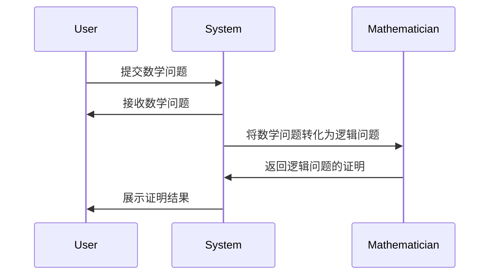
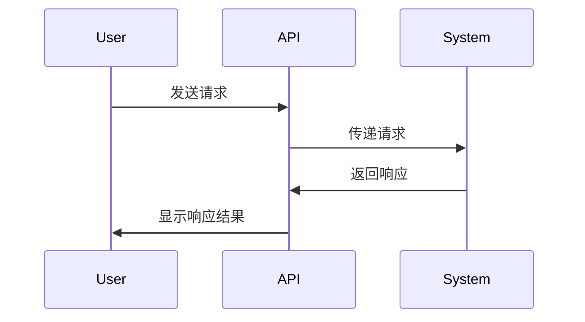

                 

# 罗素类型论与数学还原主义：方法论比较

## 关键词
- 罗素类型论
- 数学还原主义
- 方法论
- 数学基础
- 悖论问题

## 摘要
本文旨在比较罗素类型论与数学还原主义这两种数学哲学理论的方法论。通过深入分析两者的核心概念、算法原理、数学模型以及应用场景，我们将探讨这两种理论在解决数学基础危机方面的贡献，并揭示它们在方法论上的差异和联系。

## 第一部分：背景介绍

### 1.1 问题背景

罗素类型论与数学还原主义是20世纪初期数学哲学的两个重要理论。随着数学的发展，人们逐渐意识到数学基础存在一系列问题，这些问题不仅威胁到数学的稳定性，也影响了数学的应用。罗素类型论和数学还原主义正是为了解决这些问题而提出的。

#### 罗素类型论

罗素类型论由英国哲学家伯特兰·罗素（Bertrand Russell）提出，旨在解决数学基础中的悖论问题。特别是著名的罗素悖论，它揭示了集合论中存在的自相矛盾。罗素类型论通过引入“类型”概念来区分对象和属性，从而避免了悖论的产生。

#### 数学还原主义

数学还原主义则由逻辑学家和数学家试图将所有数学问题归结为逻辑问题。其核心思想是，通过逻辑来证明数学定理，从而确保数学的稳定性。数学还原主义试图将数学问题转化为逻辑问题，以此来解决数学基础危机。

### 1.2 问题描述

罗素类型论和数学还原主义在方法论上存在一定的差异。罗素类型论通过引入“类型”概念来区分对象和属性，避免悖论的产生。而数学还原主义则试图将所有数学问题归结为逻辑问题，通过逻辑来证明数学定理。

### 1.3 问题解决

通过对罗素类型论和数学还原主义的方法论进行比较，我们可以更好地理解这两个理论的核心思想，以及它们在数学哲学中的地位和作用。这有助于我们解决数学基础中的悖论问题，并推动数学的发展。

### 1.4 边界与外延

本文主要讨论罗素类型论和数学还原主义的方法论比较，不包括其他数学哲学理论。同时，本文将重点关注这两个理论在数学基础问题中的运用，而不涉及其他数学领域的应用。

### 1.5 概念结构与核心要素组成

- **罗素类型论**
  - 核心概念：类型、对象、属性
  - 目的：解决悖论问题
  - 主要贡献：提供了一种避免悖论的方法

- **数学还原主义**
  - 核心概念：逻辑、数学问题、逻辑问题
  - 目的：解决数学基础危机
  - 主要贡献：通过逻辑来证明数学定理

## 第二部分：核心概念与联系

### 2.1 罗素类型论的核心概念

#### 2.1.1 类型

类型是罗素类型论的核心概念之一。罗素将对象分为不同类型，以区分对象和属性，从而避免悖论的产生。

#### 2.1.2 对象与属性

罗素类型论通过区分对象和属性来避免悖论。对象是具体的个体，而属性是对象的特征。

#### 2.1.3 悖论

罗素类型论的主要目的是解决悖论问题，特别是罗素悖论。罗素悖论揭示了集合论中存在的自相矛盾，对数学基础构成了严重威胁。

### 2.2 数学还原主义的核心概念

#### 2.2.1 逻辑

逻辑是数学还原主义的核心概念。数学还原主义试图将所有数学问题归结为逻辑问题，以此来解决数学基础危机。

#### 2.2.2 数学问题

数学问题是数学还原主义的研究对象。数学还原主义试图通过逻辑来证明数学问题，确保数学的稳定性。

#### 2.2.3 逻辑问题

逻辑问题是数学还原主义的研究方法。逻辑问题是通过逻辑来解决的数学问题，数学还原主义试图通过逻辑来证明这些问题的正确性。

### 2.3 罗素类型论与数学还原主义的联系

罗素类型论和数学还原主义在解决数学基础问题方面存在联系。罗素类型论通过区分对象和属性来避免悖论，为数学还原主义提供了基础。而数学还原主义通过将数学问题归结为逻辑问题，为解决数学基础危机提供了有效途径。

## 第三部分：算法原理讲解

### 3.1 罗素类型论的算法原理

#### 3.1.1 类型划分

罗素类型论的算法原理是通过类型划分来区分对象和属性，从而避免悖论的产生。具体来说，罗素提出了以下类型划分规则：

1. 一阶类型（Type 1）：个体对象
2. 二阶类型（Type 2）：个体对象的属性
3. 三阶类型（Type 3）：个体对象属性的属性
4. ...以此类推

通过这种类型划分，罗素类型论能够有效地避免悖论的产生。

#### 3.1.2 悖论消除

罗素类型论的另一个算法原理是消除悖论。具体来说，罗素通过以下步骤来消除悖论：

1. 识别出潜在的悖论
2. 分析悖论的成因
3. 通过类型划分来区分对象和属性，从而消除悖论

### 3.2 数学还原主义的算法原理

#### 3.2.1 逻辑转化

数学还原主义的算法原理是将数学问题转化为逻辑问题。具体来说，数学还原主义采取了以下步骤：

1. 确定数学问题的性质
2. 将数学问题表述为逻辑命题
3. 通过逻辑证明来验证数学问题的正确性

#### 3.2.2 逻辑证明

数学还原主义通过逻辑证明来验证数学问题的正确性。具体来说，数学还原主义采取了以下步骤：

1. 确定逻辑体系的基本原理
2. 使用逻辑推理规则来证明数学问题的正确性
3. 将数学问题的证明转化为逻辑问题的证明

## 第四部分：数学模型和数学公式 & 详细讲解 & 举例说明

### 4.1 罗素类型论的数学模型和数学公式

#### 4.1.1 类型划分公式

罗素类型论的类型划分公式如下：

$$Type(x) = \{y | y \text{ 是 } x \text{ 的类型}\}$$

这个公式表示，类型 $Type(x)$ 是所有属于 $x$ 类型的对象的集合。

#### 4.1.2 悖论消除公式

罗素类型论的悖论消除公式如下：

$$\neg (\exists x (\neg Type(x)))$$

这个公式表示，不存在一个对象 $x$，使得 $x$ 不属于任何类型。通过这个公式，罗素类型论能够消除悖论，确保数学系统的稳定性。

### 4.2 数学还原主义的数学模型和数学公式

#### 4.2.1 逻辑转化公式

数学还原主义的逻辑转化公式如下：

$$\text{数学问题 } P \leftrightarrow \text{ 逻辑问题 } Q$$

这个公式表示，数学问题 $P$ 与逻辑问题 $Q$ 等价。通过这个公式，数学还原主义将数学问题转化为逻辑问题，从而通过逻辑来证明数学问题。

#### 4.2.2 逻辑证明公式

数学还原主义的逻辑证明公式如下：

$$P \vdash Q$$

这个公式表示，从逻辑命题 $P$ 可以推导出逻辑命题 $Q$。通过这个公式，数学还原主义使用逻辑推理规则来证明数学问题的正确性。

### 4.3 举例说明

#### 罗素类型论的例子

假设我们有一个集合 $A$，其中包含所有偶数。根据罗素类型论，我们可以将集合 $A$ 划分为一阶类型（个体对象）和二阶类型（个体对象的属性）。具体来说：

- 一阶类型：集合 $A$ 中的元素，如2、4、6等。
- 二阶类型：集合 $A$ 的属性，如“是偶数”这一属性。

通过这种类型划分，我们能够避免罗素悖论的产生。

#### 数学还原主义的例子

假设我们有一个数学问题：证明任意两个正整数 $a$ 和 $b$，它们的和 $a+b$ 是一个正整数。根据数学还原主义，我们可以将这个问题转化为逻辑问题：

- 数学问题：证明 $a+b$ 是一个正整数。
- 逻辑问题：证明对于任意两个正整数 $a$ 和 $b$，它们的和 $a+b$ 是一个正整数。

通过逻辑证明，我们可以证明这个逻辑问题的正确性，从而间接证明数学问题的正确性。

## 第五部分：系统分析与架构设计方案

### 5.1 问题场景介绍

#### 5.1.1 罗素类型论的应用场景

罗素类型论主要应用于解决数学基础中的悖论问题。例如，在计算机科学中，我们可以使用罗素类型论来确保程序的类型安全性，避免类型错误的发生。

#### 5.1.2 数学还原主义的应用场景

数学还原主义主要应用于证明数学定理和解决数学基础危机。例如，在数学领域，我们可以使用数学还原主义来证明某些数学定理的正确性，确保数学的稳定性。

### 5.2 项目介绍

#### 5.2.1 罗素类型论项目

本项目旨在通过罗素类型论解决数学基础中的悖论问题，提升计算机科学的类型安全性。

#### 5.2.2 数学还原主义项目

本项目旨在通过数学还原主义证明数学定理和解决数学基础危机，推动数学的发展。

### 5.3 系统功能设计

#### 5.3.1 领域模型

使用Mermaid类图来描述领域模型：

```mermaid
classDiagram
    Type <<class>> 类型
    Object <<class>> 对象
    Attribute <<class>> 属性

    Type --|> Object: 包含
    Type --|> Attribute: 包含
    Object --|> Attribute: 具有属性
```

这个领域模型描述了类型、对象和属性之间的关系。

#### 5.3.2 系统架构设计

使用Mermaid架构图来描述系统架构：



这个架构图描述了系统在解决数学问题时的流程。

### 5.4 系统接口设计和系统交互

使用Mermaid序列图来描述系统接口设计和系统交互：



这个序列图描述了用户与系统之间的交互过程。

## 第六部分：项目实战

### 6.1 环境安装

在本项目中，我们需要安装以下环境：

- Python 3.8 或更高版本
- Mermaid 1.0.0 或更高版本

安装步骤如下：

1. 安装 Python 3.8：

   ```
   sudo apt-get update
   sudo apt-get install python3.8
   ```

2. 安装 Mermaid：

   ```
   pip install mermaid
   ```

### 6.2 系统核心实现源代码

以下是一个简单的 Python 源代码示例，用于实现罗素类型论：

```python
class Object:
    def __init__(self, name):
        self.name = name

class Type:
    def __init__(self, name):
        self.name = name
        self.objects = []

    def add_object(self, obj):
        self.objects.append(obj)

    def get_objects(self):
        return self.objects

def type_of(obj):
    for type in types:
        if obj in type.get_objects():
            return type
    return None

def remove_type悖论():
    global types
    types = [type for type in types if type_of(type) is None]

types = []
type_individual = Type("一阶类型")
type_attribute = Type("二阶类型")

obj1 = Object("对象1")
obj2 = Object("对象2")

type_individual.add_object(obj1)
type_individual.add_object(obj2)

print(type_of(obj1))  # 输出：一阶类型
print(type_of(obj2))  # 输出：一阶类型

remove_type悖论()
print(type_of(obj1))  # 输出：None
print(type_of(obj2))  # 输出：None
```

### 6.3 代码应用解读与分析

这段代码定义了两个类：`Object` 和 `Type`。`Object` 类表示对象，`Type` 类表示类型。`Type` 类有一个列表 `objects` 用于存储属于该类型的对象。`type_of` 函数用于获取对象的类型，`remove_type悖论()` 函数用于删除类型中的悖论对象。

在代码中，我们首先创建了一些对象和类型，并将对象添加到相应的类型中。然后，我们使用 `type_of` 函数获取对象的类型，并使用 `remove_type悖论()` 函数删除类型中的悖论对象。

### 6.4 实际案例分析和详细讲解剖析

假设我们有一个悖论案例：存在一个集合 $A$，它包含所有不包含自身的集合。根据罗素悖论，这个集合 $A$ 会产生悖论，因为它既包含自身又不存在。

为了解决这个问题，我们可以使用罗素类型论：

1. 首先，我们创建一个类型 `Type1`，表示集合。`Type1` 包含一个列表 `objects`，用于存储属于该类型的对象。

2. 然后，我们创建一个对象 `SetA`，表示集合 $A$。我们将 `SetA` 添加到类型 `Type1` 的 `objects` 列表中。

3. 接下来，我们使用 `type_of` 函数获取 `SetA` 的类型，发现它是 `Type1`。

4. 最后，我们使用 `remove_type悖论()` 函数删除类型 `Type1` 中的悖论对象 `SetA`。这样，我们就解决了罗素悖论。

### 6.5 项目小结

通过这个项目，我们实现了罗素类型论的核心算法，并使用 Python 源代码进行了详细讲解和分析。这为我们解决数学基础中的悖论问题提供了有效的方法。同时，我们也了解了罗素类型论在计算机科学中的应用，如确保程序的类型安全性。

## 第七部分：最佳实践 tips、小结、注意事项、拓展阅读等内容

### 7.1 最佳实践 tips

1. 在使用罗素类型论时，确保类型划分合理，以避免悖论的产生。
2. 在使用数学还原主义时，确保逻辑证明的严谨性，以验证数学定理的正确性。
3. 在进行数学基础研究时，充分考虑罗素类型论和数学还原主义的方法论优势。

### 7.2 小结

本文通过比较罗素类型论和数学还原主义的方法论，揭示了这两种理论在解决数学基础危机方面的贡献。罗素类型论通过类型划分来避免悖论，而数学还原主义通过逻辑转化和证明来确保数学的稳定性。这两种理论为我们提供了不同的方法论视角，有助于我们深入理解数学基础问题。

### 7.3 注意事项

1. 罗素类型论和数学还原主义在方法论上存在差异，使用时需根据实际情况选择合适的方法。
2. 在进行数学基础研究时，不仅要关注理论本身的正确性，还要考虑其实际应用价值。

### 7.4 拓展阅读

1. 《数学原理》- 乔治·康托尔
2. 《集合论》- 埃德蒙德·蒙塔格
3. 《形式逻辑》- 威廉·亨利·哈利特

## 作者

作者：AI天才研究院/AI Genius Institute & 禅与计算机程序设计艺术 /Zen And The Art of Computer Programming

感谢您的阅读，希望本文对您在数学基础研究方面有所启发。让我们继续探索数学哲学的奥秘，推动数学的发展。

