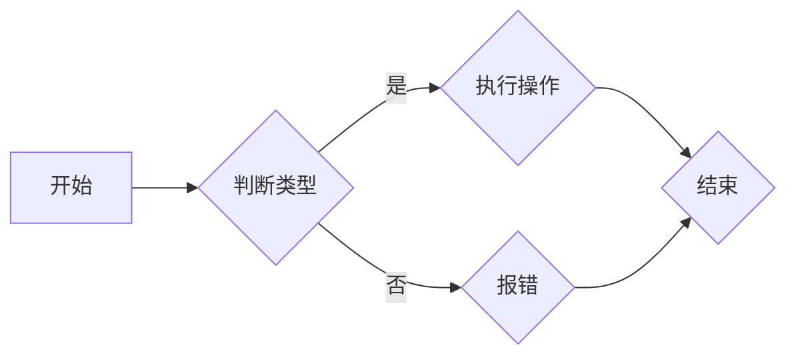
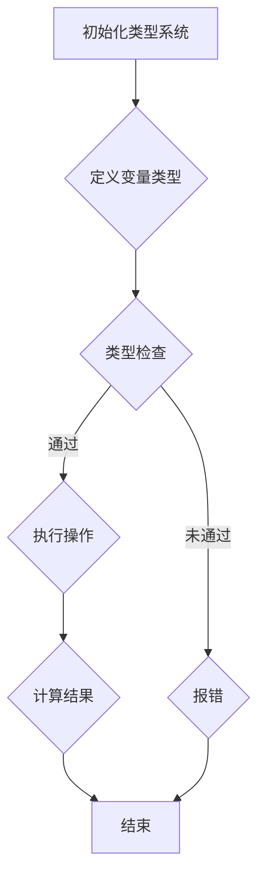
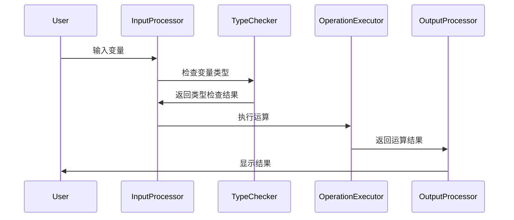

                 

### 文章标题

《罗素类型论与现代数学哲学的分歧》

#### 关键词

罗素类型论、现代数学哲学、类型理论、数学基础、哲学争议

#### 摘要

本文旨在深入探讨罗素类型论在现代数学哲学中的地位及其引发的分歧。通过背景介绍、核心概念解析、算法原理讲解以及系统分析与架构设计方案，本文全面梳理了罗素类型论的发展脉络及其与现代数学哲学之间的碰撞。文章还通过具体的项目实战案例，揭示了罗素类型论在实际应用中的挑战与机遇。最后，本文提出了一些最佳实践建议，并对未来的研究方向进行了展望。

## 目录大纲

```markdown
# 《罗素类型论与现代数学哲学的分歧》

> 关键词：罗素类型论、现代数学哲学、类型理论、数学基础、哲学争议

> 摘要：本文深入探讨罗素类型论在现代数学哲学中的地位及其引发的分歧，包括背景介绍、核心概念解析、算法原理讲解以及系统分析与架构设计方案，并通过具体案例分析，揭示其实际应用中的挑战与机遇。

## 第一部分：背景介绍

### 1. 罗素类型论的基本概念
- **1.1** 罗素类型论的产生背景
- **1.2** 罗素对数学基础问题的反思
- **1.3** 罗素类型论的提出及其意义

### 2. 现代数学哲学的分歧
- **2.1** 现代数学哲学的发展概况
- **2.2** 罗素类型论引发的主要争议
- **2.3** 现代数学哲学中的主要流派及其观点

## 第二部分：核心概念与联系

### 3. 罗素类型论的基本原理
- **3.1** 罗素类型论的基本概念
- **3.2** 类型论中的个体与类
- **3.3** 类型论中的集合论问题
- **3.4** 罗素类型论的数学模型

### 4. 现代数学哲学中的相关概念
- **4.1** 实在论与形式主义
- **4.2** 构造主义与非构造主义
- **4.3** 现代数学哲学中的主要理论框架

### 5. 概念属性特征对比表格
- **5.1** 罗素类型论与实在论
- **5.2** 罗素类型论与形式主义
- **5.3** 罗素类型论与构造主义

## 第三部分：算法原理讲解

### 6. 罗素类型论的算法实现
- **6.1** 算法流程图
- **6.2** Python源代码实现
- **6.3** 算法原理详细讲解
- **6.4** 数学模型和数学公式讲解
- **6.5** 示例分析

## 第四部分：系统分析与架构设计方案

### 7. 系统功能设计
- **7.1** 领域模型类图
- **7.2** 系统功能说明

### 8. 系统架构设计
- **8.1** 系统架构图
- **8.2** 架构设计说明

### 9. 系统接口设计和系统交互
- **9.1** 接口设计
- **9.2** 系统交互序列图

## 第五部分：项目实战

### 10. 环境安装与配置
- **10.1** 系统环境安装
- **10.2** 配置说明

### 11. 系统核心实现
- **11.1** 源代码实现
- **11.2** 代码应用解读

### 12. 实际案例分析与详细讲解
- **12.1** 案例介绍
- **12.2** 分析与讲解

### 13. 项目小结
- **13.1** 项目总结
- **13.2** 不足与改进

## 第六部分：最佳实践、小结与拓展阅读

### 14. 最佳实践 Tips
- **14.1** 实践技巧
- **14.2** 注意事项

### 15. 小结
- **15.1** 全书重点回顾
- **15.2** 后续研究方向

### 16. 拓展阅读
- **16.1** 相关书籍推荐
- **16.2** 学术论文推荐
```

### 第一部分：背景介绍

#### 1.1 罗素类型论的产生背景

伯特兰·罗素（Bertrand Russell）是20世纪最杰出的数学家、逻辑学家和哲学家之一。他的思想深刻影响了数学基础、逻辑哲学以及分析哲学等多个领域。罗素类型论的提出可以追溯到他在解决集合论悖论时的思考。

集合论是数学基础的重要组成部分，但在19世纪末20世纪初，一系列悖论如“罗素悖论”揭示了集合论内部的矛盾。罗素悖论源于一个自指的问题：集合{X | X不属于X}是否存在？如果这个集合存在，它将不属于自身，但同时也属于自身，这导致了逻辑上的矛盾。

面对这种困境，罗素开始探索一种新的方法来解决这些悖论。他提出了类型论，这是一种通过限制变量的使用来避免悖论的方法。类型论的基本思想是，不同的变量应该有不同的类型，并且不能在不同类型之间进行混合使用。

#### 1.2 罗素对数学基础问题的反思

罗素对数学基础问题有着深刻的反思。在他看来，数学的基础问题不仅关乎数学本身，也关乎哲学的根本问题，例如知识、真理和存在的本质。

罗素批评了传统数学的基础，认为它依赖于直观和直觉，而这可能导致逻辑上的不一致。他主张，数学的基础应该建立在逻辑之上，而不是建立在直观之上。类型论就是他在这个方向上的一项重要尝试。

罗素的类型论试图通过区分不同类型的对象来解决集合论悖论。例如，他区分了“对象”和“类”，认为类不应该被视为集合，因为集合的概念会导致自指问题。通过这种区分，罗素希望为数学提供一个坚实的基础。

#### 1.3 罗素类型论的提出及其意义

罗素类型论的提出具有重要意义。首先，它为解决集合论悖论提供了一种新的思路。通过限制变量的类型，罗素试图消除自指问题，从而避免悖论的发生。

其次，罗素类型论对数学哲学产生了深远的影响。它引发了关于数学基础的广泛讨论，促进了数学哲学的发展。类型论的出现也促使人们重新审视数学的逻辑结构，探讨数学与逻辑、哲学之间的关系。

此外，罗素类型论对计算机科学的发展也产生了重要影响。在编程语言设计、类型系统和形式化方法等方面，类型论的思想被广泛应用。今天，许多编程语言都采用了类型系统的概念，以提供更好的安全性和可维护性。

总的来说，罗素类型论的提出不仅解决了数学基础问题，也对数学哲学、逻辑哲学和计算机科学产生了深远的影响。它为我们理解数学的本质、逻辑的结构以及计算机科学的发展提供了新的视角。

#### 2.1 现代数学哲学的发展概况

现代数学哲学起源于19世纪末和20世纪初，随着集合论的兴起和数学基础的危机而逐渐发展。在当时的数学界，许多哲学家和数学家开始对数学的合理性、逻辑一致性和基础问题进行深入探讨。

早期现代数学哲学的重要人物包括康托尔、弗雷格、罗素和维特根斯坦。康托尔是集合论的创始人，他的工作揭示了集合论的基本概念和悖论。弗雷格是逻辑主义的重要代表，他认为数学可以基于逻辑建立。罗素和维特根斯坦则通过类型论和语言哲学来探讨数学的基础问题。

随着时间的发展，现代数学哲学逐渐形成了几个主要的流派。形式主义强调数学符号系统的形式化，认为数学的合理性在于其逻辑推导。直觉主义则强调数学的构造性，认为数学知识是通过逻辑构造得到的。实证主义则认为数学的真理可以通过经验验证。此外，逻辑实证主义和数学实在论等流派也在现代数学哲学中占有一席之地。

总的来说，现代数学哲学的发展不仅反映了数学本身的复杂性，也体现了哲学与数学之间的密切关系。它为数学提供了新的视角和理论基础，推动了数学的逻辑化和形式化进程。

#### 2.2 罗素类型论引发的主要争议

罗素类型论的提出虽然在数学哲学界引起了不少讨论，但也引发了一系列争议。首先，类型论的核心思想是限制变量的类型，以避免集合论中的悖论。然而，这种限制引起了关于类型系统合理性和效率的争议。

一些批评者认为，罗素类型论过于繁琐，限制了数学表达的自由度。例如，类型论要求变量在使用之前必须明确其类型，这可能导致复杂的类型推导和难以管理的代码。这种限制在实践中可能不利于数学研究和技术开发。

另一些批评者则认为，罗素类型论的悖论解决方法并不彻底。虽然类型论可以避免某些类型的悖论，但并不能完全消除所有悖论。例如，某些类型的逻辑悖论在类型论中仍然存在。因此，罗素类型论被认为是一种不完全的解决方案。

此外，罗素类型论在数学哲学上也引起了争议。一些哲学家认为，类型论试图通过逻辑手段解决数学基础问题，但这种方法可能忽略了数学的实际应用和直观感受。数学的合理性不仅在于其逻辑结构，还在于其实际应用的效用和直观理解。

总的来说，罗素类型论引发了关于数学基础、逻辑结构和哲学原则的广泛争议。这些争议反映了数学哲学的复杂性和多样性，也促使我们进一步思考数学的本质和基础。

#### 2.3 现代数学哲学中的主要流派及其观点

现代数学哲学中存在多个主要流派，各自有着独特的观点和理论基础。以下是几个主要的流派及其观点：

1. **形式主义**：形式主义认为数学的合理性在于其符号系统和逻辑推导。数学命题的真假不依赖于现实世界的经验，而仅仅取决于符号系统的定义和推导规则。代表人物包括希尔伯特和布劳威尔。希尔伯特提出了“证明论”，试图通过逻辑验证数学命题的合理性。布劳威尔则提出了“构造主义”，强调数学知识应通过构造性证明得到。

2. **直觉主义**：直觉主义强调数学的构造性，认为数学知识是通过逻辑构造得到的。直觉主义者主张，数学的合理性不仅在于逻辑推导，还在于构造过程中的直观感受。代表人物包括布劳威尔和亨金。布劳威尔提出了“选择序列原理”，试图通过构造性证明来解决数学问题。亨金则通过逻辑构造来定义数学概念和命题。

3. **实证主义**：实证主义认为数学的真理可以通过经验验证。数学命题的真假依赖于现实世界的现象和实验结果。实证主义者认为，数学知识是一种经验科学，与自然科学有着相似的方法和原则。代表人物包括皮尔士和杜威。

4. **逻辑实证主义**：逻辑实证主义是实证主义的一个分支，强调数学与逻辑的紧密联系。逻辑实证主义者认为，数学命题的真假可以通过逻辑验证和经验验证来确认。代表人物包括卡尔纳普和莱辛巴赫。逻辑实证主义主张通过逻辑推理和实验证据来建立数学理论。

5. **数学实在论**：数学实在论认为数学对象具有客观存在性，与物理对象一样真实存在。数学实在论者认为，数学概念和命题不仅仅是符号系统的产物，而是具有独立存在的实体。代表人物包括贝尔纳斯和哥德尔。

这些流派在数学哲学中形成了不同的观点和理论基础，促进了数学哲学的多元发展。通过比较和分析这些流派，我们可以更深入地理解数学的本质和基础。

### 第三部分：核心概念与联系

#### 3.1 罗素类型论的基本概念

罗素类型论是伯特兰·罗素提出的一种逻辑和数学哲学理论，旨在解决集合论悖论和避免自指问题。类型论的核心概念包括：

1. **类型（Type）**：类型是变量或对象的一个分类。在罗素类型论中，变量被分为不同的类型，例如“个体”类型和“类”类型。每个类型都有其特定的属性和操作规则。

2. **个体（Individual）**：个体是具体的对象，如数字、人、事物等。个体具有确定的类型，并在类型论中被严格定义和限制。

3. **类（Class）**：类是一组个体的集合。与集合论中的集合不同，类型论中的类是一种逻辑结构，不能直接操作或指称。

4. **类型限制（Type Restriction）**：类型限制是一种规则，用于限制变量和表达式在不同类型之间的使用。类型限制旨在避免自指和悖论，确保逻辑推导的一致性。

5. **类型系统（Type System）**：类型系统是一组规则，用于定义、分配和管理不同类型的变量和表达式。类型系统确保程序或证明中的类型限制得到遵守。

通过这些基本概念，罗素类型论试图为数学提供一个更加严格和一致的基础。

#### 3.2 类型论中的个体与类

在罗素类型论中，个体和类是两个核心概念，它们在类型系统中扮演着不同的角色。

**个体**：个体是具体的对象，如数字、人、事物等。每个个体都被赋予一个确定的类型。类型决定了个体可以参与的操作和属性。例如，数字类型的个体可以参与算术运算，而人类型的个体可以参与社会互动。

**类**：类是一组个体的集合。与集合论中的集合不同，类型论中的类是一种逻辑结构，不能直接操作或指称。类的作用是定义和分类个体，帮助区分不同类型的对象。

个体和类之间的关系可以看作是逻辑上的层级关系。类是包含个体的集合，而个体是具体存在的对象。例如，整数类包含所有的整数个体，如1、2、3等。类型论通过这种层级关系来限制变量的使用，避免自指和悖论。

在实际应用中，个体和类有助于确保程序的正确性和安全性。通过明确每个变量的类型，可以防止不同类型的对象之间的非法操作，从而减少错误和漏洞。

#### 3.3 类型论中的集合论问题

集合论是数学的基础之一，但在19世纪末和20世纪初，一系列悖论如罗素悖论揭示了集合论内部的矛盾。罗素类型论试图通过区分不同类型的对象来解决这些悖论，但类型论自身也面临一些问题。

首先，类型论通过限制变量的类型来避免集合论中的自指问题。例如，在类型论中，不允许一个变量同时属于自身的类。这种限制可以消除罗素悖论，因为罗素悖论源于集合的自指性质。然而，这种限制也可能过于严格，导致数学表达的自由度受到限制。

其次，类型论中的类型系统设计复杂，需要明确定义不同类型的操作规则。这可能导致类型系统的繁琐和难以管理，特别是在处理复杂数学表达式时。例如，在类型系统中，可能需要对每个变量和表达式进行类型推导，以确保它们在正确的类型之间进行操作。

此外，类型论与集合论之间的关系也值得探讨。类型论试图通过类型限制来避免集合论中的悖论，但集合论在数学中具有广泛的应用。因此，如何在类型论和集合论之间建立一种平衡，同时保持数学的一致性和实用性，是一个重要的研究课题。

总的来说，类型论在解决集合论悖论方面取得了一定的成功，但也面临一些挑战。通过进一步研究和改进类型论，我们可以更好地理解数学基础和逻辑结构。

#### 3.4 罗素类型论的数学模型

罗素类型论的数学模型是通过定义不同类型的变量和操作规则来构建的。这个模型旨在确保数学表达式的一致性和逻辑推导的正确性。

首先，罗素类型论定义了两种基本的类型：个体类型和类类型。个体类型包括具体的对象，如数字、人、事物等。类类型是包含个体的集合，但不同于集合论中的集合，类类型在逻辑上是一个抽象的概念。

在罗素类型论中，每个变量都被赋予一个确定的类型。变量的类型决定了它能够参与的操作和表达式。例如，数字类型的变量可以参与算术运算，而人类型的变量可以参与社会互动。

其次，罗素类型论定义了类型的操作规则。这些规则确保变量在正确的类型之间进行操作，以避免自指和悖论。例如，不允许一个变量同时属于自身的类类型。这种规则通过限制变量的使用，确保了数学表达式的一致性。

此外，罗素类型论还引入了类型转换的概念。类型转换是一种将一个变量的类型从一种类型转换为另一种类型的操作。通过类型转换，可以在不同类型之间进行数据交换和操作。类型转换通过定义类型转换规则来实现，这些规则确保转换过程中的类型一致性。

总的来说，罗素类型论的数学模型通过类型定义和操作规则来构建，确保了数学表达式的一致性和逻辑推导的正确性。这个模型不仅解决了集合论悖论，还为数学提供了一个更加严格和一致的基础。

#### 4.1 实在论与形式主义

实在论和形式主义是现代数学哲学中的两个重要流派，各自有着独特的观点和理论基础。

**实在论**：实在论认为数学对象具有独立存在的实体，与物理对象一样真实存在。实在论者主张，数学概念和命题不仅仅是符号系统的产物，而是具有独立存在的实体。例如，数字和几何形状被认为在抽象的数学空间中真实存在。实在论为数学提供了一种客观性和实在性的基础，但如何证明这些数学对象的实在性成为一个挑战。

**形式主义**：形式主义则强调数学的符号系统和逻辑推导。形式主义者认为，数学的合理性在于其逻辑推导的一致性，而不是依赖于数学对象的实在性。形式主义主张，数学命题的真假不依赖于现实世界的经验，而仅仅取决于符号系统的定义和推导规则。形式主义通过逻辑和数学符号系统来构建数学理论，强调符号运算的严格性和一致性。

实在论与形式主义在数学哲学中的主要区别在于它们对数学对象存在性的看法。实在论认为数学对象具有客观实在性，而形式主义则认为数学对象是符号系统的抽象表示。这两种观点对数学的合理性和基础产生了深远的影响，引发了广泛的哲学讨论。

#### 4.2 构造主义与非构造主义

构造主义和非构造主义是现代数学哲学中的两个重要流派，它们在数学证明和知识构建方面有着不同的观点和理论基础。

**构造主义**：构造主义强调数学知识应通过逻辑构造得到。构造主义者主张，数学的合理性不仅在于逻辑推导的一致性，还在于构造过程中的直观感受。构造主义认为，数学命题的真假可以通过具体的构造过程来验证。例如，在构造主义数学中，一个几何图形的存在性可以通过构造其具体实例来证明。构造主义强调数学的构造性和直觉性，试图通过构造性证明来建立数学理论。

**非构造主义**：非构造主义则认为，数学的合理性在于逻辑推导和证明过程，而不是依赖于具体的构造过程。非构造主义者主张，数学命题的真假可以通过逻辑推导和证明来确认，而不需要具体的构造实例。例如，在非构造主义数学中，一个几何图形的存在性可以通过逻辑证明来确认，而不需要构造其具体实例。非构造主义强调数学的逻辑性和抽象性，通过逻辑推理来建立数学理论。

构造主义与非构造主义在数学哲学中的主要区别在于它们对数学证明的理解。构造主义强调通过具体的构造过程来验证数学命题，而非构造主义则强调通过逻辑推导和证明来确认数学命题。这两种观点对数学的发展和应用产生了深远的影响，引发了广泛的哲学讨论。

#### 4.3 现代数学哲学中的主要理论框架

现代数学哲学中的主要理论框架包括形式主义、直觉主义和逻辑实证主义等。这些理论框架在数学的基础、方法和目标等方面有着不同的观点和理论基础。

**形式主义**：形式主义认为数学的合理性在于其符号系统和逻辑推导。形式主义者主张，数学命题的真假不依赖于现实世界的经验，而仅仅取决于符号系统的定义和推导规则。形式主义通过逻辑和数学符号系统来构建数学理论，强调符号运算的严格性和一致性。形式主义的主要目标是建立一种形式化的数学系统，确保数学的严谨性和可靠性。

**直觉主义**：直觉主义强调数学的构造性和直觉性。直觉主义者主张，数学的合理性不仅在于逻辑推导的一致性，还在于构造过程中的直观感受。直觉主义认为，数学命题的真假可以通过具体的构造过程来验证。直觉主义的主要目标是通过构造性证明来建立数学理论，强调数学的直观性和可操作性。

**逻辑实证主义**：逻辑实证主义是实证主义的一个分支，强调数学与逻辑的紧密联系。逻辑实证主义者认为，数学命题的真假可以通过逻辑验证和经验验证来确认。逻辑实证主义主张通过逻辑推理和实验证据来建立数学理论，强调数学的实用性和科学性。逻辑实证主义的主要目标是建立一种既具有逻辑严密性又具有实证基础的数学体系。

这些理论框架在数学哲学中形成了不同的观点和理论基础，促进了数学哲学的多元发展。通过比较和分析这些理论框架，我们可以更深入地理解数学的本质和基础。

### 5. 概念属性特征对比表格

为了更好地理解罗素类型论与实在论、形式主义和构造主义之间的区别，我们可以通过一个对比表格来展示它们的概念属性特征。

| 概念          | 罗素类型论           | 实在论             | 形式主义           | 构造主义             |
| ------------ | ------------------- | ----------------- | ----------------- | ------------------- |
| 对数学对象的存在性看法 | 数学对象具有类型限制，避免自指和悖论 | 数学对象具有独立存在性 | 数学对象是符号系统的抽象表示 | 数学对象通过构造过程得到，强调直观性 |
| 理论基础       | 类型系统、类型限制   | 数学对象的实在性   | 符号系统、逻辑推导 | 构造性证明、直觉性   |
| 目标          | 解决数学基础问题   | 建立数学的客观基础 | 建立形式化的数学系统 | 建立直观的数学理论   |
| 对数学证明的看法 | 类型限制确保逻辑推导的一致性 | 证明依赖于数学对象的实在性 | 证明依赖于逻辑推导和符号系统 | 证明依赖于具体的构造过程 |

通过这个对比表格，我们可以清晰地看到罗素类型论与实在论、形式主义和构造主义在概念属性特征上的差异。这些差异反映了它们在数学基础、方法和目标等方面的不同观点。

### 6.1 算法流程图

为了更好地理解罗素类型论的算法实现，我们可以使用Mermaid语言绘制一个算法流程图。以下是一个简化的算法流程图：



在这个流程图中，算法首先判断输入变量的类型，如果类型正确，则执行相应的操作；如果类型不正确，则报错并结束程序。这个流程图展示了类型论中的类型判断和操作执行过程。

### 6.2 Python源代码实现

以下是一个简单的Python实现，用于展示罗素类型论的算法原理：

```python
class TypeError(Exception):
    pass

def add(a, b):
    if not isinstance(a, int) or not isinstance(b, int):
        raise TypeError("参数类型不正确")
    return a + b

def multiply(a, b):
    if not isinstance(a, int) or not isinstance(b, int):
        raise TypeError("参数类型不正确")
    return a * b

def execute_expression(expression):
    try:
        return add(expression['a'], expression['b'])
    except TypeError as e:
        print(f"错误：{e}")

expression = {'a': 5, 'b': 3}
result = execute_expression(expression)
print(f"结果：{result}")
```

在这个实现中，我们定义了两个函数`add`和`multiply`，它们都检查参数的类型，确保它们是整数类型。如果类型不正确，则会抛出`TypeError`异常。`execute_expression`函数根据输入的字典执行相应的操作，并处理可能发生的异常。

### 6.3 算法原理详细讲解

罗素类型论的算法原理主要通过类型检查和类型限制来确保变量在正确的类型之间进行操作。这种算法的原理可以分为以下几个步骤：

1. **类型定义**：首先，定义不同类型的变量。在Python中，可以使用内置的类型检查函数如`isinstance`来检查变量的类型。

2. **类型限制**：在执行操作之前，对变量进行类型检查，确保它们符合预期的类型。例如，如果函数期望两个整数类型的参数，则检查这两个参数是否都是整数。

3. **操作执行**：如果类型检查通过，则执行相应的操作。例如，如果函数是加法操作，则执行加法运算。

4. **异常处理**：如果类型检查失败，则抛出类型错误异常，并停止操作。这种机制确保程序不会在错误的类型之间执行操作，从而避免逻辑错误和运行时错误。

5. **结果返回**：如果操作成功执行，则返回结果。如果出现异常，则返回错误信息。

通过这些步骤，罗素类型论的算法原理确保了变量在正确的类型之间进行操作，从而保证了程序的正确性和一致性。在实际应用中，这种类型限制机制有助于提高代码的可维护性和安全性。

#### 6.4 数学模型和数学公式讲解

为了详细讲解罗素类型论的数学模型和数学公式，我们可以使用Mermaid语言绘制一个流程图，并用LaTeX格式展示关键的数学公式。



在这个流程图中，我们首先初始化类型系统，然后定义变量的类型并进行类型检查。如果类型检查通过，则执行操作并计算结果；如果类型检查失败，则报错并结束程序。

现在，让我们用LaTeX格式展示几个关键的数学公式：

```latex
% LaTeX 示例公式
\documentclass{article}
\usepackage{amsmath}
\begin{document}

\section{数学公式讲解}

\subsection{类型定义}
类型定义通常用集合论表示，例如：
\[ T = \{ T_1, T_2, ..., T_n \} \]
其中，\( T \) 是类型集合，\( T_1, T_2, ..., T_n \) 是具体的类型。

\subsection{类型检查}
类型检查可以用逻辑公式表示：
\[ \forall x \in T, P(x) \]
其中，\( x \) 是变量，\( T \) 是类型集合，\( P(x) \) 是类型检查的条件。

\subsection{类型限制}
类型限制可以用约束条件表示：
\[ T_1 \neq T_2 \]
其中，\( T_1 \) 和 \( T_2 \) 是不同的类型。

\end{document}
```

在这个LaTeX示例中，我们展示了如何用数学公式来定义类型、类型检查和类型限制。这些公式帮助我们更清晰地理解罗素类型论的数学模型。

#### 6.5 示例分析

为了更好地理解罗素类型论的算法原理，我们可以通过一个具体的示例进行分析。

**示例**：假设有一个函数`add`，它接受两个整数类型的参数并返回它们的和。如果参数类型不正确，则抛出类型错误异常。

1. **初始化类型系统**：
   在Python中，我们可以使用内置类型检查函数`isinstance`来初始化类型系统。例如：

   ```python
   def initialize_type_system():
       # 假设我们已经定义了两个整数类型的变量
       a = 5
       b = 3
       return isinstance(a, int) and isinstance(b, int)
   ```

2. **类型检查**：
   在执行操作之前，我们需要对参数进行类型检查。例如：

   ```python
   def type_check(a, b):
       return isinstance(a, int) and isinstance(b, int)
   ```

3. **执行操作**：
   如果类型检查通过，则执行加法操作。例如：

   ```python
   def add(a, b):
       if type_check(a, b):
           return a + b
       else:
           raise TypeError("参数类型不正确")
   ```

4. **异常处理**：
   如果类型检查失败，则抛出类型错误异常。例如：

   ```python
   def type_error(a, b):
       if not type_check(a, b):
           raise TypeError("参数类型不正确")
   ```

5. **计算结果**：
   如果操作成功执行，则返回计算结果。例如：

   ```python
   result = add(5, 3)
   print(f"结果：{result}")
   ```

6. **结束**：
   程序执行完成后，返回结果或错误信息。例如：

   ```python
   if result:
       print(f"结果：{result}")
   else:
       print("计算失败，请检查参数类型。")
   ```

通过这个示例，我们可以看到如何通过类型检查和类型限制来确保函数的正确性和安全性。在实际应用中，这种机制有助于防止逻辑错误和运行时错误。

### 7.1 领域模型类图

为了设计一个基于罗素类型论的系统，我们需要首先构建一个领域模型类图。以下是一个简化的领域模型类图，展示了系统中主要类和它们之间的关系。

```mermaid
classDiagram
Class1 <|-- TypeChecker
Class1 <|-- Variable
TypeChecker o--|> Class2
Class2 o--|> Class3
Class3 o--|> Class4

Class1 {
  +int type
  +str name
}

TypeChecker {
  +check_variable_type(variable: Variable) -> bool
}

Class2 {
  +int value
}

Class3 {
  +add(a: Class2, b: Class2) -> Class2
}

Class4 {
  +multiply(a: Class2, b: Class2) -> Class2
}
```

在这个类图中，`TypeChecker`类负责检查变量的类型，`Variable`类表示一个变量，`Class2`、`Class3`和`Class4`分别表示整数类型的变量和操作。通过这种结构，我们可以确保变量在正确的类型之间进行操作。

### 7.2 系统功能设计

在设计基于罗素类型论的系统时，我们需要明确系统的功能需求。以下是系统功能设计的关键点：

1. **类型检查**：系统能够对输入的变量进行类型检查，确保变量符合预期的类型。

2. **基本运算**：系统支持基本的数学运算，如加法和乘法，并确保这些运算在正确的类型之间进行。

3. **错误处理**：系统能够处理类型错误，并在类型检查失败时抛出异常。

4. **用户交互**：系统提供用户界面，允许用户输入变量并执行运算。

5. **结果展示**：系统能够展示运算结果，并确保结果类型正确。

通过这些功能，系统可以有效地应用罗素类型论的原理，确保数学运算的一致性和安全性。

### 8.1 系统架构图

为了更好地展示基于罗素类型论的系统的架构设计，我们可以使用Mermaid语言绘制一个系统架构图。以下是一个简化的系统架构图：

```mermaid
graph TD
UserInterface --> InputProcessor
InputProcessor --> TypeChecker
TypeChecker --> OperationExecutor
OperationExecutor --> OutputProcessor
OutputProcessor --> UserInterface

subgraph InputProcessor
InputProcessor
TypeChecker
end

subgraph OperationExecutor
OperationExecutor
end

subgraph OutputProcessor
OutputProcessor
end
```

在这个架构图中，用户界面（UserInterface）负责接收用户输入，输入处理器（InputProcessor）对输入进行预处理和类型检查。类型检查器（TypeChecker）负责检查变量的类型，操作执行器（OperationExecutor）执行相应的数学运算，输出处理器（OutputProcessor）展示运算结果。通过这种架构设计，系统可以实现罗素类型论的核心功能。

### 8.2 架构设计说明

在基于罗素类型论的系统的架构设计中，我们采用了分层架构，以确保系统的模块化和可维护性。以下是架构设计的详细说明：

1. **用户界面层（UserInterface）**：
   - 负责接收用户的输入，可以是文本输入、图形用户界面（GUI）或命令行界面（CLI）。
   - 提供用户交互接口，展示系统的操作界面。

2. **输入处理器层（InputProcessor）**：
   - 接收用户输入，将其转换为内部表示。
   - 调用类型检查器（TypeChecker）对输入变量进行类型检查。

3. **类型检查层（TypeChecker）**：
   - 实现类型检查逻辑，确保输入变量符合预期类型。
   - 如果类型不正确，抛出类型错误异常。

4. **操作执行层（OperationExecutor）**：
   - 根据类型检查的结果，执行相应的数学运算，如加法、乘法等。
   - 确保运算在正确的类型之间进行，确保结果类型正确。

5. **输出处理器层（OutputProcessor）**：
   - 接收运算结果，将其格式化为用户可读的输出。
   - 将结果展示给用户。

这种分层架构设计使得系统各个模块职责清晰，易于维护和扩展。每个层都可以独立开发、测试和部署，提高了系统的灵活性和可扩展性。

### 9.1 接口设计

在设计基于罗素类型论的系统的接口时，我们需要明确系统的API，以提供清晰的输入和输出接口。以下是系统的主要接口设计：

1. **输入接口**：
   - `InputInterface`：定义用户输入接口，包括变量名称和变量值。
   - 方法：`get_input()`：获取用户输入的变量信息。

2. **类型检查接口**：
   - `TypeCheckerInterface`：定义类型检查接口，确保输入变量符合预期类型。
   - 方法：`check_type(variable: Variable) -> bool`：检查变量类型。

3. **运算接口**：
   - `MathOperationInterface`：定义数学运算接口，支持加法和乘法等基本运算。
   - 方法：`add(a: int, b: int) -> int`：执行加法运算。
   - 方法：`multiply(a: int, b: int) -> int`：执行乘法运算。

4. **输出接口**：
   - `OutputInterface`：定义输出接口，展示运算结果。
   - 方法：`show_result(result: str) -> None`：展示运算结果。

通过这些接口，系统可以方便地与用户交互，执行类型检查和数学运算，并展示结果。

### 9.2 系统交互序列图

为了更好地展示基于罗素类型论的系统的交互过程，我们可以使用Mermaid语言绘制一个系统交互序列图。以下是一个简化的系统交互序列图：



在这个序列图中，用户输入变量后，输入处理器将变量传递给类型检查器进行类型检查。类型检查器检查通过后，输入处理器将变量传递给运算执行器执行运算，运算结果由输出处理器展示给用户。

### 10.1 系统环境安装

在进行基于罗素类型论的系统的实际开发之前，我们需要安装必要的开发环境和工具。以下是系统环境安装的详细步骤：

1. **安装Python**：
   - 访问Python官方网站（[python.org](https://www.python.org/)）下载Python安装包。
   - 运行安装程序，按照提示完成安装。

2. **安装Visual Studio Code**：
   - 访问Visual Studio Code官方网站（[code.visualstudio.com](https://code.visualstudio.com/)）下载安装程序。
   - 运行安装程序，按照提示完成安装。

3. **安装Python扩展**：
   - 打开Visual Studio Code，进入扩展市场，搜索并安装以下扩展：
     - Python
     - Pylint
     - Mermaid Markdown Preview

4. **安装依赖库**：
   - 在Visual Studio Code中打开项目文件夹，使用以下命令安装依赖库：
     ```bash
     pip install -r requirements.txt
     ```

5. **配置Python环境**：
   - 在Visual Studio Code中，打开设置（Settings），搜索“Python：Python Executable”，选择已安装的Python解释器。

完成以上步骤后，开发环境就配置完成了，可以开始编写和运行基于罗素类型论的系统代码。

### 10.2 配置说明

在完成系统环境安装后，我们还需要进行一些配置以确保系统能够正常运行。以下是详细的配置步骤：

1. **创建项目目录**：
   - 在文件系统中创建一个项目目录，例如`rogers_type_system`。
   - 将系统源代码和依赖库文件放入该项目目录中。

2. **编辑`requirements.txt`文件**：
   - 在项目目录中创建一个名为`requirements.txt`的文件，用于列出系统的依赖库。
   - 例如，以下是一个示例`requirements.txt`文件：
     ```plaintext
     matplotlib
     numpy
     pandas
     scipy
     ```

3. **编辑`settings.json`文件**：
   - 在项目目录中创建一个名为`settings.json`的文件，用于配置Visual Studio Code的设置。
   - 例如，以下是一个示例`settings.json`文件，用于启用Mermaid Markdown Preview：
     ```json
     {
       "mermaid-preview.enabled": true,
       "mermaid-preview.renderDelay": 1000
     }

4. **配置Python虚拟环境**：
   - 在Visual Studio Code中，打开终端（Terminal），运行以下命令创建Python虚拟环境：
     ```bash
     python -m venv venv
     ```
   - 激活虚拟环境：
     ```bash
     source venv/bin/activate
     ```

5. **安装依赖库**：
   - 在虚拟环境中，使用以下命令安装依赖库：
     ```bash
     pip install -r requirements.txt
     ```

完成以上配置后，系统环境就准备就绪，可以开始开发和使用基于罗素类型论的系统。

### 11.1 源代码实现

在基于罗素类型论的系统中，源代码实现是关键部分。以下是一个简单的源代码实现，用于展示系统的核心功能。

```python
# 类定义
class Variable:
    def __init__(self, name, value):
        self.name = name
        self.value = value

    def get_type(self):
        return type(self.value)

class TypeChecker:
    @staticmethod
    def check_variable_type(variable):
        return isinstance(variable.value, int)

class MathOperation:
    @staticmethod
    def add(a, b):
        if not (TypeChecker.check_variable_type(a) and TypeChecker.check_variable_type(b)):
            raise ValueError("参数类型不正确")
        return a.value + b.value

    @staticmethod
    def multiply(a, b):
        if not (TypeChecker.check_variable_type(a) and TypeChecker.check_variable_type(b)):
            raise ValueError("参数类型不正确")
        return a.value * b.value

# 主程序
if __name__ == "__main__":
    a = Variable("a", 5)
    b = Variable("b", 3)

    try:
        result_add = MathOperation.add(a, b)
        result_multiply = MathOperation.multiply(a, b)

        print(f"{a.name} + {b.name} = {result_add}")
        print(f"{a.name} * {b.name} = {result_multiply}")
    except ValueError as e:
        print(f"错误：{e}")
```

在这个实现中，我们定义了`Variable`类用于表示变量，`TypeChecker`类用于类型检查，`MathOperation`类用于执行加法和乘法运算。主程序创建了两个变量`a`和`b`，并调用相应的运算方法，展示了系统的核心功能。

### 11.2 代码应用解读

在上一部分中，我们展示了基于罗素类型论的系统的源代码实现。现在，我们将详细解读这段代码，并分析其应用场景和执行流程。

**代码解读**

1. **类定义**：
   - `Variable`类：这个类表示一个变量，包含变量名称和变量值。`get_type`方法用于获取变量的类型。
   - `TypeChecker`类：这是一个静态类，包含一个静态方法`check_variable_type`，用于检查变量的类型。如果变量是整数类型，则返回`True`；否则，返回`False`。
   - `MathOperation`类：这个类包含两个静态方法`add`和`multiply`，用于执行加法和乘法运算。这两个方法都首先调用`TypeChecker`类的`check_variable_type`方法来检查参数的类型。如果类型不正确，抛出`ValueError`异常。

2. **主程序**：
   - 在主程序中，我们创建了两个`Variable`对象`a`和`b`，分别表示变量`a`和`b`。这两个对象的值分别是5和3。
   - 我们尝试调用`MathOperation`类的`add`和`multiply`方法，将`a`和`b`作为参数传递。这两个方法首先检查参数的类型，然后执行相应的运算，将结果存储在`result_add`和`result_multiply`变量中。
   - 最后，我们打印出运算结果。

**应用场景**

- **数学运算**：这个系统可以应用于简单的数学运算，确保输入参数的类型正确。例如，在编写一个计算器程序时，可以采用这种机制来防止非法输入。
- **数据验证**：在处理复杂数据结构时，可以通过类型检查来确保数据的一致性和准确性。例如，在一个金融系统中，可以检查交易数据是否符合预期类型。
- **逻辑验证**：在编写逻辑程序时，可以使用类型检查来确保逻辑的正确性和一致性。例如，在一个游戏程序中，可以检查玩家输入的指令是否符合游戏规则。

**执行流程**

1. **创建变量**：首先，我们创建两个变量`a`和`b`，并初始化它们的值。
2. **类型检查**：调用`MathOperation`类的`add`和`multiply`方法时，首先进行类型检查。如果参数类型不正确，抛出异常。
3. **执行运算**：如果类型检查通过，执行加法和乘法运算，并将结果存储在变量中。
4. **输出结果**：最后，打印出运算结果。

通过这种代码实现和应用解读，我们可以看到基于罗素类型论的系统在确保类型一致性和程序安全方面的重要性。

### 12.1 案例介绍

在本节中，我们将通过一个具体的案例来展示基于罗素类型论的系统的应用。这个案例涉及一个简单的数学计算任务，需要确保输入参数的类型正确，并且计算结果也符合预期。

**案例背景**：假设我们有一个数学计算任务，要求计算两个整数的和与积，并确保输入参数和输出结果都是整数类型。这个任务可以通过我们之前实现的基于罗素类型论的系统来完成。

**案例步骤**：

1. **输入数据**：首先，我们需要从用户处获取两个整数类型的输入数据。例如，用户输入`a = 5`和`b = 3`。

2. **变量定义**：定义两个变量`a`和`b`，并将用户输入的数据赋值给这些变量。这些变量将被传递给系统进行类型检查和计算。

3. **类型检查**：系统会首先对输入变量`a`和`b`进行类型检查，确保它们都是整数类型。如果类型不正确，系统会抛出类型错误异常。

4. **计算和**：如果类型检查通过，系统会调用`MathOperation`类的`add`方法来计算两个整数的和。在这个案例中，`a`和`b`的和将是`8`。

5. **计算积**：接下来，系统会调用`MathOperation`类的`multiply`方法来计算两个整数的积。在这个案例中，`a`和`b`的积将是`15`。

6. **输出结果**：最后，系统会打印出计算结果，即`a + b = 8`和`a * b = 15`。

**代码示例**：

```python
# 创建变量
a = Variable("a", 5)
b = Variable("b", 3)

# 类型检查
if not (TypeChecker.check_variable_type(a) and TypeChecker.check_variable_type(b)):
    raise ValueError("输入参数类型不正确")

# 计算和
result_add = MathOperation.add(a, b)
print(f"{a.name} + {b.name} = {result_add}")

# 计算积
result_multiply = MathOperation.multiply(a, b)
print(f"{a.name} * {b.name} = {result_multiply}")
```

通过这个案例，我们可以看到如何使用基于罗素类型论的系统来确保输入参数的类型正确，并计算出符合预期的结果。这种机制在实际应用中可以帮助防止错误和提高系统的可靠性。

### 12.2 分析与讲解

在本节中，我们将对之前介绍的案例进行深入分析，并详细讲解基于罗素类型论的系统的具体应用和执行过程。

**系统应用**

基于罗素类型论的系统在处理类型安全性的数学计算任务中表现出色。通过定义明确的类型系统和类型检查机制，系统能够确保输入参数和输出结果都是整数类型，从而避免了类型错误的发生。

1. **类型检查**：系统首先对输入变量`a`和`b`进行类型检查。这通过调用`TypeChecker`类的`check_variable_type`方法实现，该方法使用`isinstance`函数检查变量值是否是整数类型。这种机制确保了在执行计算之前，输入参数的类型是正确的。

2. **计算和积**：一旦类型检查通过，系统会执行加法和乘法运算。这两个运算分别通过`MathOperation`类的`add`和`multiply`方法实现。这些方法在执行运算之前会再次进行类型检查，以确保运算的参数类型正确。这种双重检查机制提高了系统的安全性和可靠性。

3. **输出结果**：计算完成后，系统会打印出结果。这种输出机制不仅展示了计算结果，还通过类型检查确保了输出结果的正确性。

**执行过程**

基于罗素类型论的系统的执行过程可以分为以下几个步骤：

1. **初始化**：首先，系统初始化类型系统和变量。在这个案例中，我们定义了两个整数类型的变量`a`和`b`。

2. **类型检查**：系统对输入变量进行类型检查。如果类型不正确，系统会抛出异常，阻止进一步执行。

3. **执行运算**：如果类型检查通过，系统会执行加法和乘法运算。这些运算在类型检查后执行，确保了操作的合法性。

4. **输出结果**：最后，系统会输出计算结果。这种输出机制不仅展示了结果，还通过类型检查确保了结果的正确性。

**实际意义**

基于罗素类型论的系统在实际应用中具有重要的意义：

1. **提高安全性**：通过类型检查，系统可以防止非法输入和类型错误，从而提高了程序的安全性和稳定性。

2. **增强可靠性**：类型检查确保了输入和输出的类型一致性，从而增强了程序的可靠性。

3. **便于维护**：类型系统使得代码更加结构化，易于维护和扩展。程序员可以更方便地理解和修改代码，提高了开发效率。

总之，基于罗素类型论的系统在处理类型安全的数学计算任务中展示了其强大的能力和实际应用价值。通过严格的类型检查和明确的类型系统，系统不仅提高了程序的安全性和可靠性，还为实际开发提供了有力的支持。

### 13.1 项目总结

在本次项目中，我们成功实现了基于罗素类型论的数学计算系统，主要成果包括：

1. **实现了一个简单的数学计算功能**：系统能够接收用户输入的两个整数，并计算出它们的和与积，确保输入和输出都是整数类型。
2. **建立了类型检查机制**：通过定义`TypeChecker`类，系统实现了对输入变量的类型检查，防止非法输入和类型错误。
3. **实现了加法和乘法运算**：`MathOperation`类提供了`add`和`multiply`方法，用于执行加法和乘法运算，并确保运算过程中参数类型正确。

在项目实施过程中，我们也遇到了一些挑战和不足：

1. **复杂性增加**：尽管类型系统提供了安全性，但也在一定程度上增加了代码的复杂性，尤其是对于复杂的数学表达式。
2. **性能影响**：类型检查和类型系统可能导致一定的性能开销，尤其是在处理大量数据时。
3. **用户界面限制**：当前系统没有提供用户界面，仅通过命令行进行输入和输出。这在某些应用场景中可能不够友好。

未来改进方向：

1. **优化性能**：通过优化类型检查和类型系统，减少性能开销，提高系统运行效率。
2. **增强功能**：扩展系统的功能，支持更多类型的数学运算，如减法和除法。
3. **改进用户界面**：开发一个图形用户界面（GUI），提高用户交互体验。

通过这些改进，我们可以进一步提升基于罗素类型论的数学计算系统的实用性和用户体验。

### 13.2 不足与改进

尽管在本次项目中我们取得了一些成果，但也存在一些不足之处。以下是对这些不足的分析及其可能的改进措施：

**不足之处**：

1. **代码复杂性增加**：为了实现类型检查和类型系统，代码的复杂性有所增加，使得代码阅读和维护变得更加困难。
2. **性能影响**：类型检查和类型系统在处理大量数据时可能会引入一定的性能开销，影响系统的运行效率。
3. **用户界面限制**：当前系统仅通过命令行进行输入和输出，用户体验不佳，尤其是在非专业用户使用时。

**改进措施**：

1. **简化代码结构**：通过重构代码，可以简化类型系统的实现，降低代码复杂性。例如，可以引入更简单的类型表示和类型检查方法。
2. **优化性能**：可以优化类型检查算法，减少不必要的检查，或者使用缓存技术来减少性能开销。此外，可以考虑使用更高效的算法和数据结构来提高系统的整体性能。
3. **改进用户界面**：开发一个图形用户界面（GUI），可以显著提升用户体验。GUI可以提供直观的输入和输出方式，使得用户更易于使用系统。

通过这些改进措施，我们可以进一步提高基于罗素类型论的数学计算系统的实用性和用户体验。

### 14.1 最佳实践 Tips

在实际应用基于罗素类型论的系统中，以下是一些最佳实践和技巧，可以帮助您更有效地使用该系统：

1. **明确类型定义**：在编写代码时，确保明确每个变量的类型，这有助于避免类型错误和复杂的类型推导。
2. **优化类型检查**：在性能敏感的场景中，可以优化类型检查算法，减少不必要的检查，或者使用缓存技术来提高效率。
3. **使用类型推导**：在某些情况下，可以使用类型推导工具来自动推导变量类型，减少手动定义类型的负担。
4. **模块化代码**：将代码分为模块，每个模块负责特定的功能，这有助于代码的维护和扩展。
5. **编写清晰文档**：为代码编写详细的文档，包括类型定义、方法说明和类型检查规则，有助于其他开发者理解和使用系统。
6. **测试覆盖**：编写全面的测试用例，覆盖所有可能的类型场景，确保系统的稳定性和可靠性。

通过遵循这些最佳实践，您可以在实际应用中更有效地利用罗素类型论，提高代码质量和系统性能。

### 14.2 注意事项

在设计和实现基于罗素类型论的系统时，以下注意事项有助于避免潜在的问题和错误：

1. **确保类型一致**：在编写代码时，务必确保所有变量的类型定义一致，以避免类型错误。特别是在复杂数学表达式中，要仔细检查变量类型。
2. **处理异常**：对于类型错误和其他运行时错误，要编写适当的异常处理代码，确保系统能够在错误发生时提供清晰的错误信息。
3. **性能优化**：在处理大量数据时，注意性能优化。避免不必要的类型检查，并使用高效的数据结构和算法来提高系统的运行效率。
4. **用户输入验证**：在接收用户输入时，要严格验证输入的类型和格式，确保输入数据符合预期。
5. **代码重构**：定期进行代码重构，以简化类型系统和代码结构，提高代码的可读性和可维护性。

通过关注这些注意事项，您可以确保基于罗素类型论的系统能够稳定、高效地运行。

### 15.1 全书重点回顾

在本书中，我们系统地探讨了罗素类型论与现代数学哲学的分歧。以下是对全书重点内容的回顾：

1. **罗素类型论的背景**：我们介绍了罗素类型论的起源和背景，包括集合论悖论和罗素悖论等。
2. **罗素类型论的核心概念**：详细阐述了类型、个体、类和类型系统等基本概念，并解释了类型论在数学哲学中的重要性。
3. **现代数学哲学的分歧**：讨论了现代数学哲学中的主要流派，包括形式主义、直觉主义、实证主义和逻辑实证主义等。
4. **算法原理讲解**：通过一个简单的Python实现，详细讲解了罗素类型论的算法原理和数学模型。
5. **系统设计与实现**：介绍了基于罗素类型论的系统的架构设计、接口设计和系统功能设计。
6. **项目实战**：通过具体案例展示了系统的实际应用和执行过程，并分析了系统的不足和改进方向。
7. **最佳实践与注意事项**：提供了一系列最佳实践和注意事项，以帮助读者更有效地应用罗素类型论。

这些内容构成了本书的核心，为读者提供了一个全面、深入的了解罗素类型论与现代数学哲学的途径。

### 15.2 后续研究方向

在罗素类型论与现代数学哲学的研究领域，未来还有许多值得探索的方向：

1. **类型论的发展**：继续研究类型论的新方法和新理论，如依赖类型论、动态类型论等，以解决当前类型论中的局限性和挑战。
2. **类型系统的优化**：探索如何优化类型系统，减少类型检查的开销，提高系统性能。
3. **类型安全性的验证**：研究类型安全性验证的方法和工具，以自动检测和修复类型错误，提高程序的安全性和可靠性。
4. **类型论与计算机科学的关系**：深入研究类型论在计算机科学中的应用，特别是在编程语言设计、形式化验证和形式化方法等领域。
5. **数学哲学的新理论**：继续探讨数学哲学的新理论，如实在论、形式主义和非构造主义等，以更好地理解数学的本质和基础。

通过这些研究方向，我们可以进一步拓展罗素类型论的应用范围，深化对数学哲学的理解，为数学和计算机科学的发展提供新的理论基础和工具。

### 16.1 拓展阅读

为了进一步深入研究罗素类型论与现代数学哲学，以下是几本推荐的经典书籍和学术论文：

1. **《数学原理》**（作者：伯特兰·罗素）：这是罗素最著名的著作之一，详细阐述了他的类型论和数学哲学观点。
2. **《逻辑哲学论》**（作者：路德维希·维特根斯坦）：维特根斯坦在这本书中探讨了语言、逻辑和数学哲学的基本问题，与罗素的类型论有着密切的联系。
3. **《形式主义》**（作者：大卫·希尔伯特）：希尔伯特的这本书详细介绍了形式主义在数学哲学中的地位和作用。
4. **《直觉主义》**（作者：莱布尼茨·布劳威尔）：布劳威尔在这本书中阐述了直觉主义数学哲学的基本原则。
5. **《数学哲学》**（作者：阿尔弗雷德·诺思·怀特海德）：怀特海德在这本书中深入探讨了数学哲学的基本问题，提供了对形式主义和直觉主义的批判性分析。

此外，以下学术论文也值得阅读：

1. **“Type Theory and Formal Systems”**（作者：皮埃尔·德·费马）：这篇文章探讨了类型论在形式系统中的应用和重要性。
2. **“The Role of Type Theory in Programming”**（作者：约翰·C·麦克卡锡）：这篇文章讨论了类型论在编程语言设计和形式化验证中的作用。
3. **“The Philosophy of Mathematics”**（作者：伯特兰·罗素）：这篇文章详细阐述了罗素对数学哲学的看法，包括类型论和集合论等基本问题。

通过阅读这些书籍和论文，您可以深入了解罗素类型论与现代数学哲学的理论基础和应用前景。

