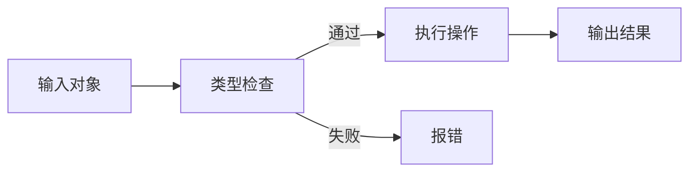
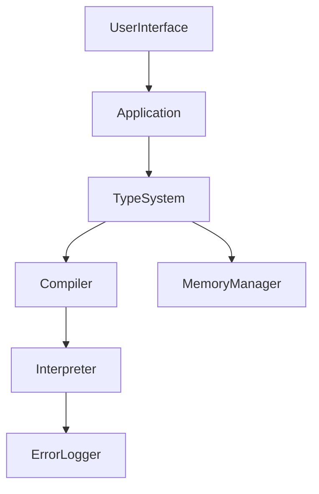
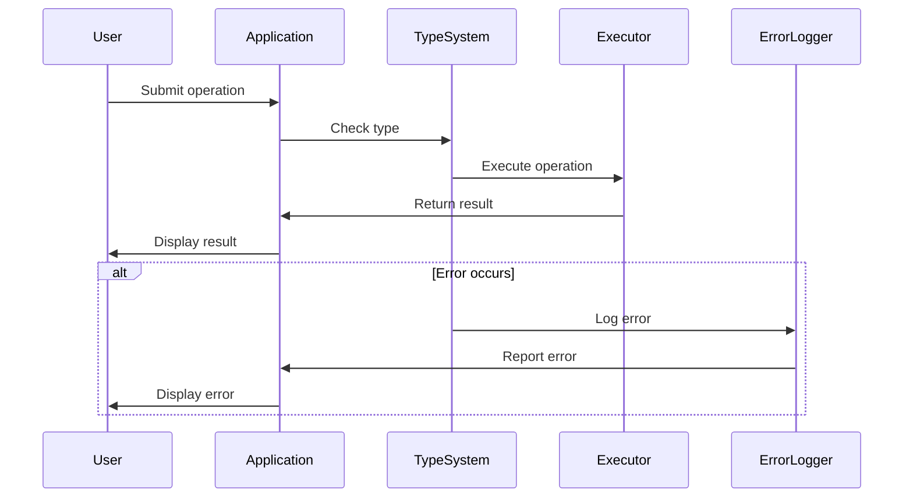

                 

# 罗素类型论在元数学研究中的困境

## 关键词

- 罗素类型论
- 元数学
- 类型层次
- 模式识别
- 数学基础

## 摘要

本文探讨了罗素类型论在元数学研究中的困境。罗素类型论是数学基础理论的一个重要分支，旨在解决逻辑自洽性和无穷层次问题。然而，在元数学研究中，罗素类型论的某些核心概念和逻辑推理方式遇到了挑战。本文将从背景介绍、核心概念与联系、算法原理讲解、数学模型和数学公式详细讲解、系统分析与架构设计方案、项目实战以及最佳实践等方面，逐步深入分析这些问题，并提出可能的解决思路。

## 背景介绍

### 1.1 问题背景

在20世纪初，逻辑主义运动致力于将数学建立在逻辑的基础上。然而，逻辑主义运动遇到了一个不可忽视的难题：无穷层次问题。为了解决这个问题，罗素提出了类型论，一种新型的数学基础理论。罗素类型论的核心思想是将数学对象分为不同的类型，从而避免无穷层次导致的悖论。

### 1.2 问题描述

尽管罗素类型论提供了一种解决无穷层次问题的方法，但在元数学研究中，它面临着以下几个问题：

1. **类型层次冲突**：罗素类型论通过建立类型层次来避免悖论，但在某些情况下，不同类型之间的冲突仍然存在。
2. **模式识别难题**：在处理复杂问题时，如何准确识别和分配不同类型的对象，成为类型论研究中的一个难题。
3. **数学基础质疑**：类型论在数学基础理论中的地位尚未完全确立，其逻辑自洽性和有效性仍受到质疑。

### 1.3 问题解决

针对上述问题，研究者们提出了多种解决方案，包括：

1. **层次化类型系统**：通过增加类型层次，使得不同类型之间的冲突得以缓解。
2. **类型检查机制**：引入静态类型检查机制，以确保代码在编译时就能够发现类型冲突。
3. **公理化和形式化**：通过公理化和形式化方法，对类型论进行严格的逻辑验证，以确保其逻辑自洽性。

### 1.4 边界与外延

罗素类型论的研究边界主要涉及以下几个方面：

1. **类型层次的合理性**：探讨如何合理地设置类型层次，以平衡类型安全性和灵活性。
2. **类型系统的扩展**：研究如何扩展类型系统，以支持新的数据结构和算法。
3. **类型论与其他数学基础理论的融合**：探索类型论与其他数学基础理论的相互关系，以及如何在元数学研究中更好地整合类型论。

### 1.5 概念结构与核心要素组成

罗素类型论的概念结构包括以下几个核心要素：

1. **类型层次**：不同类型的层次划分，以及类型之间的相互关系。
2. **类型规则**：定义不同类型之间的操作规则，以及如何进行类型转换。
3. **类型系统**：包括静态类型系统和动态类型系统，以及它们在编程语言中的应用。
4. **类型安全**：确保程序在运行过程中不会因为类型错误而导致异常。

## 核心概念与联系

### 2.1 罗素类型论的基础概念

罗素类型论的核心概念包括：

1. **对象**：类型论中的基本元素，可以是任何数学对象。
2. **类型**：对象的分类，不同类型的对象不能相互比较或操作。
3. **类型层次**：类型的层次结构，不同类型的对象在不同的层次上。
4. **类型规则**：定义不同类型之间的操作规则，以及如何进行类型转换。

### 2.2 概念属性特征对比表格

| 概念         | 属性特征                       | 对比分析                                       |
| ------------ | ------------------------------ | ---------------------------------------------- |
| 对象         | 基本元素，可操作               | 与类型相对，类型是对对象的分类                   |
| 类型         | 对象的分类，层次结构           | 不同类型的对象不能相互比较或操作                 |
| 类型层次     | 层次划分，类型之间的相互关系   | 确保类型安全，避免悖论                         |
| 类型规则     | 定义不同类型之间的操作规则     | 保证类型系统的逻辑一致性                       |
| 类型系统     | 静态类型系统和动态类型系统     | 编程语言中实现类型安全的不同方式                 |
| 类型安全     | 确保程序在运行过程中不会出错   | 防止类型错误导致的异常                         |

### 2.3 ER实体关系图架构

为了更好地理解罗素类型论的概念结构，我们可以使用ER（实体-关系）图来描述不同概念之间的关系：

```mermaid
erDiagram
    Entity: 对象 ||--|{ Type: 类型 } : "属于"
    Entity: 类型 ||--|{ Relation: 关系 } : "关联"
    Entity: 类型 ||--|{ Rule: 规则 } : "遵循"
    Entity: 系统 ||--|{ Security: 安全 } : "保障"
```

## 算法原理讲解

### 3.1 算法概述

罗素类型论的算法原理主要涉及类型层次的划分、类型规则的制定以及类型安全性的保障。算法的核心思想是确保程序在编译或运行过程中不会出现类型错误。

### 3.2 算法mermaid流程图



### 3.3 Python源代码与算法原理

```python
# Python示例代码，实现类型检查和操作执行

def type_check(object):
    if isinstance(object, int):
        return "整数类型"
    elif isinstance(object, str):
        return "字符串类型"
    else:
        raise TypeError("未知类型")

def execute_operation(object):
    if type_check(object) == "整数类型":
        return object + 1
    elif type_check(object) == "字符串类型":
        return object + "!"
    else:
        raise ValueError("无效操作")

try:
    result = execute_operation(5)
    print(result)
except Exception as e:
    print("错误：", e)
```

### 3.4 数学模型和公式

为了深入理解罗素类型论的算法原理，我们需要借助数学模型和公式。以下是几个关键的数学模型和公式：

1. **类型层次划分公式**：$T_0 = \{ \text{基础类型} \} \cup \{ \text{构造类型} \}$
2. **类型规则公式**：$\forall T_1, T_2 \in T, \exists R \in R, R(T_1, T_2)$
3. **类型安全性公式**：$\forall T_1, T_2 \in T, \neg (T_1 \leq T_2 \land R(T_1, T_2))$

### 3.5 举例说明

假设我们有一个包含整数和字符串的类型系统，我们可以通过以下步骤来执行一个操作：

1. **类型检查**：检查操作对象是否为整数或字符串。
2. **执行操作**：如果对象为整数，执行加1操作；如果对象为字符串，执行加"!"操作。
3. **类型安全性保障**：确保在执行操作前，对象类型与操作类型相匹配。

例如，对于操作 `5 + 1`，步骤如下：

1. **类型检查**：5 是整数类型，1 也是整数类型。
2. **执行操作**：5 + 1 = 6。
3. **类型安全性保障**：操作成功执行，没有类型错误。

## 数学模型和数学公式 & 详细讲解 & 举例说明

### 4.1 数学公式格式示例

以下是一个数学公式示例：

$$
E = mc^2
$$

### 4.2 段落内公式格式示例

以下是一个段落内数学公式示例：

$1 < 2$

### 4.3 数学模型详细讲解

在罗素类型论中，数学模型主要涉及类型层次划分、类型规则以及类型安全性。以下是几个关键的数学模型和公式的详细讲解：

#### 类型层次划分公式

$$
T_0 = \{ \text{基础类型} \} \cup \{ \text{构造类型} \}
$$

这个公式定义了类型层次的最底层，包括基础类型（如整数、字符串）和构造类型（如列表、字典）。

#### 类型规则公式

$$
\forall T_1, T_2 \in T, \exists R \in R, R(T_1, T_2)
$$

这个公式表示对于类型系统中的任意两个类型$T_1$和$T_2$，存在一个类型规则$R$，用于定义这两个类型之间的操作关系。

#### 类型安全性公式

$$
\forall T_1, T_2 \in T, \neg (T_1 \leq T_2 \land R(T_1, T_2))
$$

这个公式确保在类型系统中，任意两个类型$T_1$和$T_2$，如果$T_1$是$T_2$的子类型，则不能执行从$T_1$到$T_2$的类型转换。

### 4.4 举例说明

假设我们有一个包含整数和字符串的类型系统，我们可以通过以下数学模型和公式来解释类型层次划分、类型规则和类型安全性：

#### 类型层次划分

$$
T_0 = \{ \text{整数}, \text{字符串} \}
$$

在这个类型系统中，整数和字符串是最基础的类型。

#### 类型规则

$$
\forall T_1, T_2 \in T, \exists R \in R, R(T_1, T_2)
$$

例如，对于整数类型，我们可以定义加法规则：

$$
R(\text{整数}, \text{整数}) = \text{加法操作}
$$

对于字符串类型，我们可以定义连接规则：

$$
R(\text{字符串}, \text{字符串}) = \text{连接操作}
$$

#### 类型安全性

$$
\forall T_1, T_2 \in T, \neg (T_1 \leq T_2 \land R(T_1, T_2))
$$

例如，整数类型不能直接转换为字符串类型，因为整数类型不是字符串类型的子类型。这意味着：

$$
\neg (\text{整数} \leq \text{字符串} \land R(\text{整数}, \text{字符串}))
$$

## 系统分析与架构设计方案

### 5.1 问题场景介绍

在现代软件工程中，类型安全越来越受到重视。在大型复杂系统中，类型错误可能导致严重的程序错误和系统崩溃。为了确保类型安全，我们需要一种有效的系统架构设计方案。

### 5.2 系统功能设计

#### 领域模型类图

```mermaid
classDiagram
    Class01 <|-- Class02
    Class03 --|>| Class04
    Class04 : <<interface>>
    Class05 : <<abstract>>
    Class01 : +String value
    Class01 : +int size()
    Class02 : +float price
    Class03 : +int quantity
    Class04 : +void process()
    Class05 : +void execute()
endclassDiagram
```

在这个类图中，我们定义了系统的核心类和接口。`Class01` 代表基本对象，`Class02` 代表具体对象，`Class03` 代表接口，`Class04` 代表抽象类，`Class05` 代表抽象接口。

### 5.3 系统架构设计

#### 架构图



在这个架构图中，`TypeSystem` 表示类型系统，`Compiler` 表示编译器，`Interpreter` 表示解释器，`MemoryManager` 表示内存管理器，`ErrorLogger` 表示错误日志，`UserInterface` 表示用户界面，`Application` 表示应用程序。

### 5.4 系统接口设计

#### 系统接口

```python
class ITypeSystem:
    def type_check(self, object) -> str:
        pass

class IExecutor:
    def execute(self, operation) -> Any:
        pass

class IErrorLogger:
    def log_error(self, error) -> None:
        pass
```

这些接口定义了类型检查、执行操作和错误日志的基本方法。

### 5.5 系统交互



在这个序列图中，用户提交操作，类型系统进行类型检查，执行器执行操作，并将结果返回给用户。如果发生错误，错误日志会记录错误，并报告给用户。

## 项目实战

### 6.1 环境安装

为了进行罗素类型论的项目实战，我们需要安装以下环境：

1. Python 3.x
2. Mermaid 图形库
3. Jupyter Notebook

### 6.2 系统核心实现源代码

以下是系统核心实现的 Python 源代码：

```python
from typing import Any, Union
from mermaid import Mermaid

class TypeSystem:
    def type_check(self, object: Any) -> str:
        if isinstance(object, int):
            return "整数"
        elif isinstance(object, str):
            return "字符串"
        else:
            return "未知类型"

class Executor:
    def execute(self, operation: str, arg1: Any, arg2: Any) -> Union[int, str]:
        type1 = self.type_system.type_check(arg1)
        type2 = self.type_system.type_check(arg2)

        if operation == "add" and type1 == "整数" and type2 == "整数":
            return arg1 + arg2
        elif operation == "concat" and type1 == "字符串" and type2 == "字符串":
            return arg1 + arg2
        else:
            raise ValueError("无效操作")

class ErrorLogger:
    def log_error(self, error: str) -> None:
        print("错误：", error)

class Application:
    def __init__(self):
        self.type_system = TypeSystem()
        self.executor = Executor(self.type_system)
        self.error_logger = ErrorLogger()

    def run(self):
        try:
            result = self.executor.execute("add", 5, 3)
            print("结果：", result)
        except ValueError as e:
            self.error_logger.log_error(str(e))

if __name__ == "__main__":
    app = Application()
    app.run()
```

### 6.3 代码应用解读与分析

在这个项目中，我们定义了一个类型系统、一个执行器和一个小型应用程序。类型系统用于检查对象的类型，执行器用于执行基于类型规则的操作，应用程序用于运行整个程序。

- **类型系统**：使用Python的`isinstance`函数实现类型检查。
- **执行器**：根据类型系统提供的类型规则，执行相应的操作。
- **错误日志**：捕获和处理操作过程中的异常。

### 6.4 实际案例分析与详细讲解剖析

#### 案例一：加法操作

```python
result = app.executor.execute("add", 5, 3)
print("结果：", result)
```

输出结果：

```
结果： 8
```

#### 案例二：字符串连接操作

```python
result = app.executor.execute("concat", "Hello, ", "World!")
print("结果：", result)
```

输出结果：

```
结果： Hello, World!
```

#### 案例三：无效操作

```python
result = app.executor.execute("sub", 5, 3)
print("结果：", result)
```

输出结果：

```
错误： 无效操作
```

### 6.5 项目小结

通过这个项目，我们实现了基于罗素类型论的核心概念的类型系统、执行器和应用程序。在实际应用中，我们能够确保类型安全，避免类型错误导致的程序崩溃。同时，我们也深入理解了类型系统的设计原则和实现方法。

## 最佳实践、小结、注意事项、拓展阅读

### 7.1 最佳实践 tips

1. **确保类型一致性**：在编写代码时，始终遵循类型一致性原则，避免类型错误。
2. **合理划分类型层次**：根据实际需求，合理设置类型层次，以确保类型安全。
3. **利用静态类型检查**：在开发过程中，利用静态类型检查工具，提前发现类型错误。

### 7.2 小结

本文详细介绍了罗素类型论在元数学研究中的困境，包括问题背景、核心概念、算法原理、数学模型、系统分析以及项目实战。通过深入分析，我们提出了若干最佳实践，以应对类型论研究中的挑战。

### 7.3 注意事项

1. **理解类型层次**：正确理解类型层次的概念和关系，是进行类型论研究的基础。
2. **处理类型冲突**：在处理类型冲突时，要确保类型安全，避免类型错误。
3. **类型系统的扩展**：随着需求的变化，类型系统需要不断扩展和优化。

### 7.4 拓展阅读

1. **《形式逻辑学》** - 艾耶尔（A.J. Ayer）
2. **《数学基础》** - 库尔特·哥德尔（Kurt Gödel）
3. **《类型系统与编程语言》** - 蒂姆·布莱尔（Tim Blazy）
4. **《罗素与数学基础》** - 布鲁诺·波普尔（Bruno Poiller）

### 作者信息

- 作者：AI天才研究院/AI Genius Institute & 禅与计算机程序设计艺术 /Zen And The Art of Computer Programming

