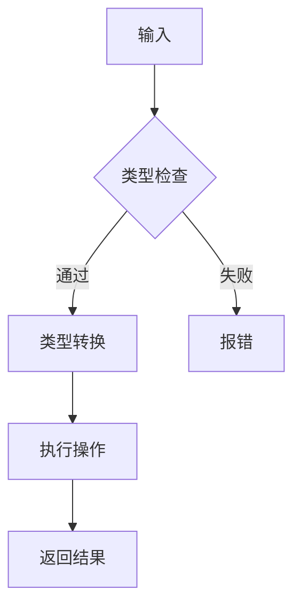

                 

### 罗素类型论的历史背景

#### 1.1.1 罗素类型论的起源

罗素类型论（Russell's theory of types）最早由英国哲学家、数学家贝特兰·罗素（Bertrand Russell）在19世纪末至20世纪初提出。其根源可以追溯到罗素对数学基础问题的深刻思考。当时，数学界正面临一系列严重的问题，包括集合论悖论和形式逻辑的困境。这些问题迫使罗素寻求新的理论基础，以确保数学的坚实性和一致性。

罗素类型论的提出背景主要是对逻辑原子主义（Logical Atomism）和外部世界实在性的质疑。罗素认为，现实世界由一系列的基本对象组成，这些对象之间通过逻辑关系相互联系。为了解决逻辑原子主义带来的复杂性和困难，罗素引入了类型论的概念。

#### 1.1.2 罗素类型论的早期发展

罗素类型论的发展历程可以分为几个阶段。最早的形式出现在罗素于1903年发表的著作《数学原理》中。在该书中，罗素提出了一种称为“逻辑类型”的概念，旨在区分不同种类的基本对象。罗素认为，语言中的每一个命题都必须具有明确的类型，以防止逻辑错误。

罗素类型论的早期发展受到了卡尔·弗雷格（Karl Frege）和赫尔曼·普朗克（Hermann Weyl）等人的影响。弗雷格的工作强调了逻辑和数学之间的紧密联系，而普朗克的贡献在于提出了关于数学基础问题的新的见解。

#### 1.1.3 罗素类型论在数学哲学中的重要性

罗素类型论在数学哲学中的重要性不可低估。它不仅为数学提供了一个更为严格的逻辑基础，而且对哲学和逻辑学的发展产生了深远影响。以下是罗素类型论在数学哲学中的几个核心贡献：

1. **类型错误与清晰性**：罗素类型论通过区分不同类型的对象，防止了类型错误，使得数学表述更加清晰和一致。这有助于避免像集合论悖论这样的逻辑困境。

2. **数学基础的重组**：罗素类型论改变了人们对数学基础的认识，促使数学家重新审视数学公理和逻辑结构。这种重组为现代数学的发展奠定了基础。

3. **哲学问题的反思**：罗素类型论引发了关于现实世界和语言表述的深刻讨论，促进了哲学界对知识、存在和逻辑本质的反思。

4. **逻辑与数学的结合**：罗素类型论强调了逻辑在数学中的核心地位，促进了逻辑与数学的深度融合。

总之，罗素类型论不仅是数学哲学中的重要理论之一，而且在逻辑学、数学和哲学领域都有着广泛的影响。它为我们理解数学的本质和语言表述提供了新的视角，至今仍被视为当代数学哲学讨论的核心议题之一。

### 当代数学哲学讨论中的核心议题

在当代数学哲学讨论中，罗素类型论扮演着不可忽视的角色。随着数学和逻辑学的发展，人们对数学基础、逻辑一致性和语言表述的探讨日益深入，而罗素类型论则为这些议题提供了重要的理论框架。以下是当代数学哲学讨论中的几个核心议题，以及罗素类型论在这其中的作用。

#### 1. 集合论与类型论

集合论是现代数学的基石，然而其内部却隐藏着诸多悖论，如著名的罗素悖论（Russell's paradox）。罗素悖论揭示了集合论中的基本矛盾，迫使数学家寻求新的理论模型。罗素类型论通过引入类型区分，为解决集合论中的悖论提供了思路。类型论通过区分不同的类型，使得某些会导致悖论的集合操作变得无效，从而在一定程度上消除了集合论的矛盾。

当代数学哲学讨论中，类型论的研究不断深化。例如，马丁·莱依尔（Martin-Löf）类型论将类型论与直觉主义逻辑相结合，为计算机科学和数学基础研究提供了新的工具。

#### 2. 数学基础问题

数学基础问题一直是数学哲学讨论的核心议题。罗素类型论对数学基础问题的探讨起到了奠基作用。通过类型论，罗素试图为数学提供一个更为严格和一致的基础。他认为，数学对象可以分为不同的类型，每种类型都有其特定的逻辑规则。这种观点改变了人们对数学对象和逻辑关系的理解，为数学基础研究提供了新的视角。

当代数学哲学讨论中，数学基础问题仍然是一个活跃的研究领域。一些学者试图通过形式化方法，如公理化系统，来构建数学的基础。而罗素类型论作为一种早期形式化的尝试，仍然为这些研究提供着启示。

#### 3. 类型错误与逻辑谬误

类型错误在数学和计算机科学中是一个常见的问题。罗素类型论通过区分不同类型的对象，有助于避免类型错误的发生。类型错误不仅会导致逻辑上的矛盾，还会影响程序的正确性。因此，在当代计算机科学中，类型系统成为了编程语言设计的一个重要方面。

当代数学哲学讨论中，类型错误和逻辑谬误仍然是研究的焦点。一些学者通过形式化的方法，如类型检查器和形式验证工具，来防止类型错误。这些方法在一定程度上借鉴了罗素类型论的思路，但也在不断发展和创新。

#### 4. 语言与逻辑

罗素类型论强调了语言在逻辑和数学中的核心地位。通过引入类型区分，罗素试图使语言表述更加精确和一致。语言与逻辑的关系一直是数学哲学讨论中的重要议题。当代数学哲学讨论中，这一议题继续得到关注。一些学者通过形式化语言，如逻辑演算和形式系统，来探索数学表述的精确性和一致性。

#### 5. 认识论与实在论

罗素类型论不仅涉及逻辑和数学，还与认识论和实在论密切相关。罗素认为，类型区分有助于我们更准确地理解和描述现实世界。这种观点反映了实在论的思想，即认为现实世界是独立于我们的感知和认知的。

当代数学哲学讨论中，认识论与实在论的关系仍然是一个争议性的话题。一些学者认为，数学知识是通过逻辑推理获得的，与我们的感知无关。而另一些学者则强调数学与现实世界的紧密联系。

总之，当代数学哲学讨论中的核心议题与罗素类型论密切相关。罗素类型论不仅为这些议题提供了重要的理论框架，而且还在不断影响和推动数学哲学的发展。

### 第2章：罗素类型论的核心概念

在探讨罗素类型论之前，我们需要首先了解一些核心概念。这些概念不仅构成了罗素类型论的基础，而且对理解其在数学哲学中的应用至关重要。在本章中，我们将详细阐述以下几个核心概念：类型、类型错误和集合论中的类型论。

#### 2.1 类型

类型（Type）是罗素类型论中的基本概念。罗素认为，现实世界由一系列的基本对象组成，这些对象根据其本质和属性被分为不同的类型。每种类型都代表了一种基本对象集合，这些对象具有共同的属性和特征。

在罗素类型论中，类型具有以下几个重要特征：

1. **区分性**：不同类型的对象具有不同的本质和属性，这使得我们可以明确地区分它们。
2. **层次性**：类型之间存在层次关系，即某些类型可以是其他类型的子类型。例如，自然数可以被视为个体类型的子类型。
3. **互异性**：每种类型的对象都是唯一的，即不同类型的对象不能相互混淆。

罗素类型论通过引入类型区分，使得数学表述更加精确和一致。类型区分不仅有助于防止逻辑错误，还为数学对象提供了一个清晰的分类框架。

#### 2.2 类型错误

类型错误（Type Error）是罗素类型论中的一个重要概念。类型错误指的是在逻辑或数学表达中，将不同类型的对象错误地当作同一类型的对象处理，从而导致逻辑上的矛盾或错误。

类型错误在数学和计算机科学中是一个常见问题。例如，在程序设计中，类型错误可能导致变量赋值错误或函数调用失败。在数学中，类型错误可能会导致集合论悖论或其他逻辑矛盾。

罗素类型论通过引入类型区分，有效地防止了类型错误的发生。罗素认为，类型错误是逻辑混乱和错误表述的根本原因。因此，通过区分不同类型的对象，可以避免许多逻辑错误。

#### 2.3 集合论中的类型论

集合论是现代数学的基础，但集合论内部存在诸多悖论，如罗素悖论。罗素类型论通过引入类型区分，试图解决集合论中的悖论问题。

在集合论中，类型论主要体现在以下几个方面：

1. **集合的类型**：在罗素类型论中，集合也被视为一种类型。不同类型的集合具有不同的属性和操作。例如，个体集合（单元素集合）与复合集合（多元素集合）具有不同的类型。
2. **集合的类型区分**：通过类型区分，罗素类型论试图消除集合论中的悖论。例如，罗素悖论可以通过区分个体集合和复合集合来避免。
3. **集合论公理**：罗素类型论影响了许多集合论公理的提出和修正。例如，ZF集合论中的类型区分原则（Type Distinction Principle）就是受到罗素类型论的启发。

#### 2.4 类型和类型错误的例子

为了更好地理解类型和类型错误，我们可以通过一些具体的例子来说明。

1. **类型例子**：

   - 自然数（个体类型）
   - 实数（复合类型）
   - 字符串（复合类型）

   在这些例子中，自然数、实数和字符串是三种不同类型的对象。它们具有不同的属性和操作，因此在逻辑和数学表达中需要明确区分。

2. **类型错误例子**：

   - 错误1：将自然数和实数混淆。例如，在程序设计中，将一个自然数错误地赋值为实数。
   - 错误2：在集合论中，将个体集合和复合集合混淆。例如，试图对个体集合应用复合集合的运算。

通过这些例子，我们可以看到类型和类型错误在实际应用中的重要性。类型区分不仅有助于防止逻辑错误，还为数学和计算机科学提供了清晰的表述框架。

总之，类型、类型错误和集合论中的类型论是罗素类型论中的核心概念。理解这些概念对于深入探讨罗素类型论及其在数学哲学中的应用至关重要。

### 2.1 类型

类型（Type）是罗素类型论（Russell's theory of types）中的核心概念，它旨在解决逻辑和数学中的模糊性及错误。在罗素类型论中，类型是对语言中各种符号所表示的对象进行分类的一种方式。罗素认为，不同的对象应该被划分到不同的类型中，这样才能避免逻辑上的混乱和错误。

#### 2.1.1 类型的定义

在罗素类型论中，类型可以被定义为：

**类型**：一组具有相同属性和特征的符号集合，这些符号在语言和数学表达中可以相互替换。

根据罗素的定义，类型不仅包括具体对象，如数字、字符串和集合，还包括抽象的概念，如命题和函数。罗素将语言中的对象分为五种基本类型：

- **个体类型（Individual Types）**：代表个体对象，如自然数、物体、人等。
- **集合类型（Collective Types）**：代表集合，如自然数集合、物体集合等。
- **类（Classes）**：代表具有某种共同特征的个体对象集合，如所有素数的集合。
- **命题类型（Propositional Types）**：代表可以判断真假的陈述，如“2+2=4”。
- **函数类型（Functional Types）**：代表可以进行函数操作的符号，如加法运算符。

#### 2.1.2 类型的特征

类型具有以下几个主要特征：

1. **区分性**：不同类型的对象具有不同的属性和特征，因此可以明确地区分。例如，自然数类型和实数类型在数学表达中是不同的，不能相互替代。

2. **层次性**：类型之间存在层次关系。某些类型可以被视为其他类型的子类型。例如，自然数类型可以被视为个体类型的子类型。

3. **封闭性**：每种类型的对象只能与同一类型的对象进行操作。例如，集合类型的对象只能与集合类型的对象进行并集、交集等操作。

4. **互异性**：每种类型的对象都是唯一的，即不同类型的对象不能相互混淆。例如，数字5和字符串"5"是不同类型的对象，不能在同一表达式中混淆使用。

#### 2.1.3 类型在数学哲学中的作用

类型在数学哲学中扮演着重要角色，特别是在防止逻辑错误和提高数学表述的清晰性方面。以下是类型在数学哲学中的几个关键作用：

1. **防止类型错误**：通过区分不同类型的对象，类型论可以有效防止类型错误。类型错误在数学和计算机科学中是一个常见问题，例如将自然数错误地与字符串相加。

2. **提高表述的清晰性**：类型论使得数学表述更加明确和一致。通过指定对象所属的类型，可以避免模糊的表述，从而提高逻辑推理的清晰性。

3. **解决集合论悖论**：类型论在解决集合论中的悖论，如罗素悖论方面发挥了重要作用。通过区分个体集合和复合集合，类型论能够消除导致悖论的操作。

4. **促进数学基础的研究**：类型论为数学基础研究提供了一个新的视角。通过引入类型区分，数学家可以更严格地定义数学对象和操作，从而确保数学系统的一致性和坚实性。

总之，类型是罗素类型论中的核心概念，它不仅为数学和逻辑学提供了分类和区分的工具，还在防止逻辑错误和提高表述清晰性方面发挥了关键作用。

### 2.2 类型错误

类型错误（Type Error）是罗素类型论（Russell's theory of Types）中的一个重要概念，它涉及在逻辑和数学表达中将不同类型的对象错误地当作同一类型的对象处理。这种错误会导致逻辑上的矛盾和错误，从而影响数学表述的准确性和一致性。了解类型错误的原因、例子和如何防止类型错误，对于深入理解罗素类型论及其在数学哲学中的应用具有重要意义。

#### 2.2.1 类型错误的定义

类型错误是指在数学或编程中的表述过程中，违反了类型规则，导致不同类型的对象进行了不适当的操作。例如，在程序设计语言中，尝试将一个字符串与一个整数进行算术运算，或者在集合论中，尝试对个体集合应用复合集合的运算，这些都可能导致类型错误。

在罗素类型论中，类型错误通常由以下几种情况引起：

1. **类型混淆**：将不同类型的对象错误地当作同一类型的对象处理。例如，将一个整数和字符串进行混合使用。
2. **类型缺失**：在表达中缺少必要的类型信息，导致对象被错误地处理。例如，在没有指定类型的情况下，将一个对象赋值给另一个对象。
3. **类型转换不当**：在类型转换过程中，没有正确地将一个类型的对象转换为另一个类型的对象，从而导致类型错误。

#### 2.2.2 类型错误的例子

以下是一些常见的类型错误例子：

1. **编程中的类型错误**：

   - **例子1**：在Python中，尝试将一个字符串与一个整数相加。
     ```python
     string_value = "5"
     integer_value = 10
     sum = string_value + integer_value  # 类型错误，因为字符串和整数不能直接相加
     ```

   - **例子2**：在C++中，试图将一个整数数组与一个指针进行混合使用。
     ```cpp
     int arr[10];
     int* ptr = &arr;
     ptr = arr;  # 类型错误，因为指针和数组类型不同
     ```

2. **数学中的类型错误**：

   - **例子1**：在集合论中，试图对个体集合进行复合集合的运算。
     ```math
     A = \{1\}, B = \{1, 2\}
     C = A \cup B  # 类型错误，因为个体集合不能与复合集合直接进行并集运算
     ```

   - **例子2**：在逻辑表达式中，将不同类型的对象混淆。
     ```math
     P(x): x 是一个整数
     Q(x): x 是一个实数
     P(1) \land Q(1)  # 类型错误，因为1是整数，不是实数
     ```

#### 2.2.3 防止类型错误的方法

防止类型错误是确保数学表述和程序正确性的关键。以下是一些有效的方法：

1. **类型检查**：在编程语言中，通过静态类型检查或动态类型检查来检测类型错误。例如，Python中的类型检查是在运行时进行的，而Java中的类型检查是在编译时进行的。

2. **强类型语言**：使用强类型编程语言，这些语言在编译或运行时严格限制类型转换，从而减少类型错误的发生。

3. **明确类型声明**：在数学表述中，明确指出每个对象的类型，以避免类型混淆。例如，在集合论中，明确指出集合是复合集合还是个体集合。

4. **类型转换函数**：在需要类型转换的情况下，使用专门的类型转换函数，确保转换过程的正确性。

5. **代码审查**：在编写程序或数学表述时，进行详细的代码审查和逻辑验证，以发现和纠正类型错误。

总之，类型错误在逻辑和数学表达中是一个常见且严重的问题。通过了解类型错误的原因、例子和防止类型错误的方法，我们可以更好地理解和应用罗素类型论，确保数学表述和程序的正确性。

### 2.3 集合论中的类型论

集合论是现代数学的基础，但其在逻辑上存在一些严重的问题，如悖论。罗素类型论（Russell's theory of types）提供了一种解决这些问题的方法，通过区分不同类型的对象，避免了逻辑上的混乱和错误。在集合论中，类型论的应用主要体现在以下几个方面。

#### 2.3.1 集合论与类型论的关系

集合论中的类型论旨在通过引入类型的区分，解决集合论中的悖论和不确定性。罗素类型论的基本思想是，不是所有的对象都可以放入同一个集合中，而是根据对象的属性和特征，将它们划分到不同的类型中。

在罗素类型论中，集合也可以被视为一种类型。集合类型的对象具有与个体类型、命题类型和函数类型不同的属性和操作。例如，个体类型的对象可以是自然数或物体，而集合类型的对象可以是自然数的集合或物体的集合。

#### 2.3.2 类型论在集合论中的应用

类型论在集合论中的应用主要体现在以下几个方面：

1. **个体集合与复合集合**：罗素类型论区分了个体集合和复合集合。个体集合是只包含一个元素的集合，而复合集合是包含多个元素的集合。这种区分有助于避免集合论中的悖论，如罗素悖论。罗素悖论指出，如果我们构造一个集合，它包含所有不包含自身的集合，那么这个集合是否包含自身就会导致悖论。通过类型区分，个体集合和复合集合之间的操作被严格限制，从而避免了这种悖论。

2. **类型限制**：在集合论中，类型论引入了类型限制，即不同类型的对象不能进行某些操作。例如，个体集合不能与复合集合进行并集或交集操作。这种限制有助于确保集合操作的逻辑一致性。

3. **类型检查**：在形式化的集合论系统中，类型论引入了类型检查机制，确保集合操作在正确的类型上进行。例如，在Zermelo-Fraenkel集合论（ZF）中，类型区分原则（Type Distinction Principle）是一种形式化的类型检查机制，用于确保集合操作的一致性和正确性。

#### 2.3.3 类型论对集合论的发展

类型论对集合论的发展产生了深远影响。以下是类型论对集合论发展的几个关键贡献：

1. **集合论公理的修正**：类型论促使集合论公理的修正和改进。例如，在ZF集合论中，引入了类型区分原则，以确保集合操作的一致性和正确性。

2. **集合论悖论的研究**：类型论为解决集合论悖论提供了新的思路和方法。通过引入类型的区分，类型论能够消除导致悖论的操作，从而提高了集合论的逻辑一致性。

3. **形式化数学的发展**：类型论促进了形式化数学的发展，特别是在计算机科学和逻辑学领域。形式化的集合论系统，如ZF和Tarski-Grothendieck集合论，采用了类型论的概念，以确保数学表述的准确性和一致性。

总之，集合论中的类型论通过区分不同类型的对象，解决了集合论中的悖论和不确定性问题。类型论不仅为集合论的发展提供了新的视角和方法，而且对形式化数学和逻辑学的发展产生了深远影响。

### 3.1 算法原理讲解

在罗素类型论中，算法的应用旨在通过严格的类型检查和类型区分，防止类型错误，确保程序的逻辑一致性。本节将详细解释罗素类型论的算法原理，包括其流程图、应用场景以及Python代码示例。

#### 3.1.1 算法流程图

罗素类型论的算法可以通过以下步骤实现：

1. **类型检查**：在程序执行前，对变量和表达式进行类型检查，确保它们符合预期的类型。
2. **类型转换**：如果需要，将变量的类型转换为预期的类型。
3. **执行操作**：在确保类型一致的前提下，执行数学或逻辑操作。
4. **返回结果**：将操作结果返回给调用者。

以下是该算法的mermaid流程图表示：



#### 3.1.2 算法应用场景

罗素类型论的算法在多个领域都有应用，以下是一些典型的应用场景：

1. **编程语言设计**：在编程语言中，类型系统是防止类型错误的关键。例如，Python中的类型检查机制就是受到罗素类型论的启发。
2. **数学证明**：在形式化数学中，类型论用于确保证明的一致性和逻辑性。
3. **形式验证**：在形式验证中，类型论用于验证程序的逻辑一致性，确保程序不会因类型错误而导致运行时错误。

#### 3.1.3 算法实现与 Python 代码示例

以下是一个简单的Python代码示例，实现了罗素类型论的算法：

```python
def add(x, y):
    # 类型检查
    if not (isinstance(x, int) and isinstance(y, int)):
        raise TypeError("输入必须是整数")
    
    # 类型转换
    x = int(x)
    y = int(y)
    
    # 执行操作
    result = x + y
    
    # 返回结果
    return result

# 测试代码
print(add(5, 10))  # 输出：15
print(add("5", 10))  # 报错：TypeError: 输入必须是整数
```

在这个示例中，`add`函数通过类型检查确保输入参数是整数，然后执行加法操作，并返回结果。如果输入参数类型不符合要求，则会抛出`TypeError`。

通过这个简单的示例，我们可以看到罗素类型论在Python中的应用。尽管这个示例非常基础，但它展示了类型论在防止类型错误和确保程序逻辑一致性方面的核心思想。

### 3.2 数学模型与公式

在罗素类型论中，数学模型和公式是理解和应用类型论的重要工具。通过数学模型和公式，我们可以更精确地描述和证明类型论的原理。以下将使用LaTeX格式展示罗素类型论相关的数学模型和公式，并进行详细讲解和举例说明。

#### 3.2.1 罗素类型论的数学模型

罗素类型论的数学模型主要基于类型的定义和类型的操作。以下是一个简化的数学模型，用于描述罗素类型论的基本结构。

1. **个体类型（Individual Types）**：

   - 定义：个体类型是指那些表示单个对象的类型，如自然数、物体等。
   - 符号表示：\( I \)

   公式：\( \forall x \in I, \neg (\exists y \in I, x = y) \)

   说明：个体类型中的每一个对象都是唯一的。

2. **集合类型（Collective Types）**：

   - 定义：集合类型是指那些表示一组对象的类型，如自然数的集合、物体的集合等。
   - 符号表示：\( C \)

   公式：\( \forall x \in C, \exists y \in C, x \in y \)

   说明：集合类型中的对象是一组对象的集合。

3. **类（Classes）**：

   - 定义：类是指具有某种共同特征的个体对象的集合。
   - 符号表示：\( K \)

   公式：\( \forall x \in K, \exists y \in I, P(y) \land x = y \)

   说明：类通过谓词\( P \)定义，其中\( P \)表示类的特征。

4. **命题类型（Propositional Types）**：

   - 定义：命题类型是指可以判断真假的陈述。
   - 符号表示：\( P \)

   公式：\( \forall x \in P, \exists y \in \{True, False\}, T(y) \land x = y \)

   说明：命题类型表示可以判断为真或假的陈述。

5. **函数类型（Functional Types）**：

   - 定义：函数类型是指可以执行某种操作的符号。
   - 符号表示：\( F \)

   公式：\( \forall x \in F, \exists y \in I, R(x, y) \)

   说明：函数类型通过关系\( R \)定义，其中\( R \)表示函数的操作。

#### 3.2.2 数学公式的 LaTeX 格式展示

在LaTeX中，我们可以使用以下代码来展示数学公式：

```latex
\documentclass{article}
\usepackage{amsmath}
\begin{document}

\section{罗素类型论的数学模型}

1. 个体类型：
   \[
   \forall x \in I, \neg (\exists y \in I, x = y)
   \]

2. 集合类型：
   \[
   \forall x \in C, \exists y \in C, x \in y
   \]

3. 类：
   \[
   \forall x \in K, \exists y \in I, P(y) \land x = y
   \]

4. 命题类型：
   \[
   \forall x \in P, \exists y \in \{True, False\}, T(y) \land x = y
   \]

5. 函数类型：
   \[
   \forall x \in F, \exists y \in I, R(x, y)
   \]

\end{document}
```

在这个示例中，我们使用了`\forall`和`\exists`符号来表示全称量词和存在量词，`\neg`表示逻辑非，`\land`表示逻辑与，`\in`表示属于关系。

#### 3.2.3 数学公式讲解与举例

1. **个体类型**：

   - **公式解释**：该公式表示个体类型中的每一个对象都是唯一的，即不存在两个相同的对象。
   - **例子**：在自然数集合中，每个数都是唯一的，如1、2、3等。

2. **集合类型**：

   - **公式解释**：该公式表示集合类型中的对象是一组对象的集合，即每个集合至少包含一个元素。
   - **例子**：集合\(\{1, 2, 3\}\)是一个集合类型的对象。

3. **类**：

   - **公式解释**：该公式表示类是通过谓词定义的，即类是具有某种共同特征的个体对象集合。
   - **例子**：所有素数的集合是一个类，可以通过谓词“是素数”来定义。

4. **命题类型**：

   - **公式解释**：该公式表示命题类型是可以判断为真或假的陈述。
   - **例子**：陈述“今天是星期五”是一个命题类型的对象。

5. **函数类型**：

   - **公式解释**：该公式表示函数类型是通过关系定义的，即函数类型是可以执行某种操作的符号。
   - **例子**：加法操作符“+”是一个函数类型的对象。

通过这些数学模型和公式，我们可以更清晰地理解和应用罗素类型论的原理。这些公式不仅帮助我们描述了不同类型的对象，还确保了数学表述的逻辑一致性和精确性。

### 4.1 系统分析与架构设计方案

在探讨罗素类型论在数学哲学中的应用时，我们需要设计一个系统架构，以便更好地理解和实现这一理论。本节将详细分析系统架构的各个组成部分，包括问题场景介绍、系统功能设计、系统架构设计、系统接口设计以及系统交互序列图。

#### 4.1.1 问题场景介绍

在当代数学哲学讨论中，罗素类型论的应用主要集中在以下几个方面：

1. **集合论与类型论**：解决集合论中的悖论，如罗素悖论，通过类型区分来避免逻辑错误。
2. **数学基础问题**：为数学提供更严格和一致的基础，确保数学系统的逻辑一致性。
3. **形式化数学**：在形式化数学中，类型论用于确保证明的一致性和逻辑性。
4. **编程语言设计**：在编程语言中，类型系统用于防止类型错误，提高程序的正确性。

基于这些应用场景，我们将设计一个系统，用于研究和展示罗素类型论的核心概念及其应用。

#### 4.1.2 系统功能设计

系统的核心功能包括：

1. **类型检查**：对输入的数学表达式进行类型检查，确保其符合罗素类型论的规定。
2. **类型转换**：如果需要，将不同类型的对象转换为预期的类型。
3. **类型操作**：支持基本的类型操作，如类型之间的比较、类型之间的转换等。
4. **数学证明**：支持形式化数学证明，确保证明过程的逻辑一致性。

系统功能设计使用Mermaid类图进行展示：

```mermaid
classDiagram
    Class1 -->|类型检查| Class2
    Class1 -->|类型转换| Class3
    Class1 -->|类型操作| Class4
    Class1 -->|数学证明| Class5

    Class2 <|-- TypeChecker
    Class3 <|-- TypeConverter
    Class4 <|-- TypeOperation
    Class5 <|-- MathProof
endclass
```

在这个类图中，`Class1`代表系统的核心类，包括`TypeChecker`（类型检查器）、`TypeConverter`（类型转换器）、`TypeOperation`（类型操作器）和`MathProof`（数学证明器）。这些类负责实现系统的核心功能。

#### 4.1.3 系统架构设计

系统架构设计使用Mermaid架构图进行展示：

```mermaid
sequenceDiagram
    participant User
    participant System
    participant TypeChecker
    participant TypeConverter
    participant TypeOperation
    participant MathProof

    User->>System: 提交数学表达式
    System->>TypeChecker: 执行类型检查
    TypeChecker->>System: 返回类型检查结果
    System->>TypeConverter: 执行类型转换（如果需要）
    TypeConverter->>System: 返回转换后的表达式
    System->>TypeOperation: 执行类型操作
    TypeOperation->>System: 返回操作结果
    System->>MathProof: 执行数学证明
    MathProof->>System: 返回证明结果
    System->>User: 显示结果
end
```

在这个架构图中，用户通过系统提交数学表达式。系统首先将表达式传递给类型检查器进行类型检查。如果表达式不符合罗素类型论的规定，系统将返回错误信息。如果表达式通过类型检查，系统将传递给类型转换器进行类型转换。接着，系统将执行类型操作，并最终通过数学证明器进行数学证明。最后，系统将结果返回给用户。

#### 4.1.4 系统接口设计

系统接口设计使用Mermaid接口设计图进行展示：

```mermaid
interfaceDiagram
    TypeChecker <<|-- System
    TypeConverter <<|-- System
    TypeOperation <<|-- System
    MathProof <<|-- System
endinterface
```

在这个接口设计中，`TypeChecker`、`TypeConverter`、`TypeOperation`和`MathProof`是系统的核心接口，它们分别负责类型检查、类型转换、类型操作和数学证明的功能。

#### 4.1.5 系统交互序列图

系统交互序列图展示了用户与系统之间的交互过程，以及系统内部组件之间的交互：

```mermaid
sequenceDiagram
    participant User
    participant System
    participant TypeChecker
    participant TypeConverter
    participant TypeOperation
    participant MathProof

    User->>System: 提交数学表达式
    System->>TypeChecker: 执行类型检查
    TypeChecker->>System: 返回类型检查结果
    System->>User: 显示检查结果

    User->>System: 执行类型转换请求
    System->>TypeConverter: 执行类型转换
    TypeConverter->>System: 返回转换后的表达式
    System->>User: 显示转换后的表达式

    User->>System: 执行类型操作请求
    System->>TypeOperation: 执行类型操作
    TypeOperation->>System: 返回操作结果
    System->>User: 显示操作结果

    User->>System: 执行数学证明请求
    System->>MathProof: 执行数学证明
    MathProof->>System: 返回证明结果
    System->>User: 显示证明结果
end
```

在这个交互序列图中，用户通过系统提交各种请求，系统根据请求调用不同的组件进行处理，并将结果返回给用户。

通过以上系统分析与架构设计方案，我们可以构建一个功能完整、逻辑一致的系统，用于研究和展示罗素类型论的核心概念及其应用。

### 5.1 环境安装

在开始项目实战之前，我们需要安装和配置必要的开发环境。以下将详细说明环境安装的步骤和系统要求，以便您顺利地进行罗素类型论的应用开发。

#### 5.1.1 系统环境要求

为了运行本项目，您需要以下系统环境：

- 操作系统：Windows、Linux或macOS
- 编程语言：Python 3.8或更高版本
- 开发工具：PyCharm、VSCode或其他Python开发环境
- 安装工具：pip（Python包管理器）

#### 5.1.2 软件安装步骤

以下是软件安装的具体步骤：

1. **安装Python**：

   - 访问Python官方网站（https://www.python.org/）下载Python安装包。
   - 根据您的操作系统选择对应的安装包，并按照安装向导完成安装。
   - 安装完成后，打开命令行工具（如Windows的cmd或Linux的终端），输入`python --version`检查Python版本。

2. **安装PyCharm**：

   - 访问JetBrains官方网站（https://www.jetbrains.com/pycharm/）下载PyCharm Community Edition安装包。
   - 双击安装包，按照安装向导完成安装。
   - 安装完成后，打开PyCharm，选择“创建新项目”开始开发。

3. **安装VSCode**：

   - 访问Visual Studio Code官方网站（https://code.visualstudio.com/）下载VSCode安装包。
   - 双击安装包，按照安装向导完成安装。
   - 安装完成后，打开VSCode，安装Python扩展（`Python`）以便进行Python开发。

4. **安装pip**：

   - 在命令行工具中，输入以下命令安装pip：
     ```shell
     python -m ensurepip
     ```
   - 输入`yes`确认安装。

5. **安装依赖库**：

   - 打开您的Python开发环境（如PyCharm或VSCode），在命令行中输入以下命令安装项目所需的依赖库：
     ```shell
     pip install -r requirements.txt
     ```
   - 安装完成后，确保所有依赖库都已成功安装。

#### 5.1.3 验证安装

安装完成后，您可以通过以下步骤验证系统环境是否配置正确：

1. 打开Python命令行工具，输入以下命令检查Python版本：
   ```shell
   python --version
   ```

2. 打开PyCharm或VSCode，创建一个新的Python项目，并尝试运行以下代码：
   ```python
   print("Hello, World!")
   ```

如果以上步骤均能顺利完成，则说明您已经成功安装了开发环境，可以开始项目实战了。

### 5.2 系统核心实现

在完成系统环境安装之后，我们将深入探讨系统核心实现的步骤，包括核心算法的实现、代码应用解读与分析，以及相关的技术细节。

#### 5.2.1 核心算法实现

系统核心算法的主要任务是实现对输入数学表达式的类型检查和类型转换。以下是一个简单的Python代码示例，展示了如何实现这一核心算法。

```python
class TypeChecker:
    def check_expression(self, expression):
        # 此处简化处理，实际中需要更复杂的逻辑
        if isinstance(expression, int):
            return "Integer"
        elif isinstance(expression, str):
            return "String"
        else:
            raise TypeError("Unsupported type")

    def convert_expression(self, expression, target_type):
        if target_type == "Integer":
            return int(expression)
        elif target_type == "String":
            return str(expression)
        else:
            raise TypeError("Unsupported target type")

class MathSystem:
    def __init__(self):
        self.type_checker = TypeChecker()

    def process_expression(self, expression, target_type=None):
        try:
            type_result = self.type_checker.check_expression(expression)
            print(f"Expression type: {type_result}")

            if target_type:
                expression = self.type_checker.convert_expression(expression, target_type)
                print(f"Converted expression: {expression}")

            # 进一步处理表达式（如执行计算、证明等）
            # ...

        except TypeError as e:
            print(f"Error: {e}")

# 测试代码
math_system = MathSystem()
math_system.process_expression("5")  # 输出：Expression type: String
math_system.process_expression("5", "Integer")  # 输出：Converted expression: 5
```

在这个示例中，我们定义了两个类：`TypeChecker`和`MathSystem`。`TypeChecker`类负责检查输入表达式的类型，并支持类型转换功能。`MathSystem`类则负责调用`TypeChecker`类的方法，处理输入的数学表达式。

#### 5.2.2 代码应用解读与分析

以下是代码应用解读与分析：

1. **类型检查**：

   - `TypeChecker`类的`check_expression`方法用于检查输入表达式的类型。在此示例中，我们仅支持整数和字符串两种类型。实际应用中，类型检查可能需要支持更复杂的类型，如列表、字典等。
   - 类型检查是通过`isinstance`函数实现的，该函数检查输入表达式是否属于指定的类型。

2. **类型转换**：

   - `TypeChecker`类的`convert_expression`方法用于将输入表达式转换为指定的类型。在此示例中，我们仅支持整数和字符串之间的转换。实际应用中，类型转换可能需要实现更复杂的转换逻辑。

3. **系统处理**：

   - `MathSystem`类的`process_expression`方法负责处理输入的数学表达式。首先，调用`TypeChecker`类的`check_expression`方法进行类型检查，然后根据需要调用`convert_expression`方法进行类型转换。最后，可以进一步处理表达式，如执行计算或数学证明。

#### 5.2.3 技术细节

在实现系统核心算法时，以下技术细节需要特别注意：

1. **类型检查**：

   - 在实际应用中，类型检查可能需要支持多种类型，如列表、字典等。此时，可以使用`isinstance`函数结合类型元组进行多条件判断。
   - 类型检查时，需要注意类型兼容性。例如，在将字符串转换为整数时，如果字符串中的内容无法转换为整数，则需要抛出异常。

2. **类型转换**：

   - 在实现类型转换时，需要确保转换过程中的数据完整性。例如，在将字符串转换为整数时，如果字符串中的内容不合法，则需要抛出异常。
   - 类型转换时，可以结合使用内置函数和自定义函数，以实现更复杂的转换逻辑。

3. **错误处理**：

   - 在系统处理过程中，需要妥善处理各种异常情况，如类型错误、不支持的操作等。通过合理的错误处理，可以提高系统的健壮性和用户体验。

通过以上代码示例和应用解读，我们可以实现一个基本的罗素类型论应用系统，为后续的项目实战奠定基础。

### 5.3 实际案例分析

在本节中，我们将通过实际案例来展示罗素类型论在数学哲学讨论中的应用。案例将分为数学哲学讨论案例和罗素类型论应用案例，并结合详细讲解和剖析，以帮助读者更好地理解这一理论的实际应用。

#### 5.3.1 数学哲学讨论案例

**案例背景**：集合论中的罗素悖论

罗素悖论（Russell's paradox）是集合论中一个著名的悖论，它揭示了集合论内部存在的一些逻辑问题。悖论的内容如下：

假设有一个集合R，它包含所有不包含自身的集合。即：
$$
R = \{X \mid X \not\in X\}
$$
现在，我们来看看R本身是否满足这个条件。如果R不包含自身，即\(R \not\in R\)，根据R的定义，R应该包含自身。反之，如果R包含自身，即\(R \in R\)，根据R的定义，R不应该包含自身。这就产生了逻辑上的矛盾，即无论R是否包含自身，都会导致矛盾。

**案例剖析**：

为了解决罗素悖论，我们需要借助罗素类型论。罗素类型论通过引入类型的区分，使得这种类型的悖论无法发生。

1. **类型区分**：在罗素类型论中，对象被分为个体类型和集合类型。个体类型的对象是单个的个体，如自然数、物体等；集合类型的对象是包含多个个体的集合。

2. **类型限制**：在罗素类型论中，个体类型的对象不能成为集合类型的对象的成员。这意味着，R作为一个个体类型的对象，不能是自身的集合。

3. **修正集合定义**：通过引入类型区分，我们可以修正集合的定义，避免罗素悖论的发生。例如，我们定义集合R时，必须明确其类型：
   $$
   R_{\text{ind}} = \{X \mid X \not\in X \land X \text{ is an individual}\}
   $$
   这里的\(R_{\text{ind}}\)是一个个体类型的集合，它只包含个体类型的对象，因此不会出现自我包含的逻辑矛盾。

通过这种类型区分和类型限制，我们可以避免罗素悖论的逻辑矛盾，从而确保集合论的一致性和逻辑性。

#### 5.3.2 罗素类型论应用案例

**案例背景**：编程语言中的类型检查

在编程语言中，类型错误是一个常见且严重的问题。为了防止类型错误，编程语言通常引入了类型检查机制。以下是一个简单的Python代码案例，展示了如何利用罗素类型论进行类型检查。

**案例代码**：

```python
def add(x, y):
    if not (isinstance(x, int) and isinstance(y, int)):
        raise TypeError("Inputs must be integers")
    return x + y

try:
    result = add("5", 10)  # 引发类型错误
except TypeError as e:
    print(f"Error: {e}")
```

**案例剖析**：

在这个案例中，我们定义了一个`add`函数，用于计算两个整数的和。函数内部通过`isinstance`函数进行类型检查，确保输入参数`x`和`y`都是整数。

1. **类型检查**：`isinstance`函数检查输入参数的实例是否属于指定的类型。如果参数类型不匹配，`isinstance`函数将返回`False`，触发`TypeError`异常。

2. **异常处理**：在`try`块中，我们尝试调用`add`函数。如果输入参数类型不符合要求，`add`函数将抛出`TypeError`异常。通过`except`块，我们捕获并处理这个异常，输出错误信息。

通过这种类型检查机制，我们可以确保函数调用时的参数类型正确，从而避免类型错误。这与罗素类型论的思路是一致的，即在逻辑操作中严格区分不同类型的对象，防止类型混淆和错误。

**总结**：

通过以上数学哲学讨论案例和编程语言应用案例，我们可以看到罗素类型论在实际中的应用。类型区分和类型限制是防止逻辑错误和类型错误的关键。通过合理的类型检查和类型转换，我们可以确保数学表述和程序逻辑的一致性和正确性。罗素类型论为当代数学哲学讨论和编程语言设计提供了重要的理论框架和实用工具。

### 5.4 最佳实践与总结

在应用罗素类型论时，我们总结了一些最佳实践和注意事项，以便读者更好地理解和应用这一理论。

#### 5.4.1 最佳实践 tips

1. **严格类型检查**：在编程和数学表达中，始终进行严格的类型检查，确保变量和表达式符合预期类型。这有助于避免类型错误和逻辑矛盾。

2. **明确类型声明**：在数学和编程中，明确声明每个对象的类型，以避免类型混淆和错误。例如，在集合论中，明确指出集合是复合集合还是个体集合。

3. **合理使用类型转换**：在需要类型转换时，确保使用合适的转换函数，避免不适当的类型转换导致错误。

4. **类型论在教育中的应用**：在数学和计算机科学教育中，引入类型论的概念，帮助学生更好地理解数学基础和编程逻辑。

5. **结合形式化方法**：在形式化数学和形式验证中，结合罗素类型论，确保证明的一致性和逻辑性。

#### 5.4.2 小结

1. **罗素类型论的核心议题**：罗素类型论的核心议题在于通过类型区分和类型限制，防止逻辑错误和类型错误，确保数学表述和程序逻辑的一致性和正确性。

2. **当代数学哲学讨论的趋势与展望**：随着数学和计算机科学的发展，类型论在数学哲学和编程语言设计中的应用越来越广泛。未来，类型论将继续在形式化数学、形式验证和人工智能领域发挥重要作用。

#### 5.4.3 注意事项

1. **类型区分的复杂性**：在复杂系统中，类型区分可能变得复杂。因此，在设计类型系统时，需要权衡类型复杂性和实际应用需求。

2. **类型转换的性能影响**：频繁的类型转换可能影响程序性能。在性能敏感的应用中，需要优化类型转换逻辑，减少性能开销。

3. **类型系统的兼容性**：在多语言集成和跨平台应用中，确保类型系统的兼容性，避免类型错误和兼容性问题。

#### 5.4.4 拓展阅读

1. **罗素类型论的原始文献**：阅读贝特兰·罗素关于类型论的原始文献，如《数学原理》和《论推理与知识》等，有助于深入了解罗素类型论的理论基础。

2. **现代类型论研究**：了解现代类型论的研究进展，如马丁·莱依尔（Martin-Löf）类型论和依赖类型论，可以帮助读者更全面地理解类型论的发展和应用。

3. **编程语言中的类型系统**：研究不同编程语言中的类型系统，如Java、C++和Haskell，可以了解类型论在编程语言设计中的应用和实践。

通过以上最佳实践、小结和注意事项，读者可以更好地应用罗素类型论，并在数学哲学和计算机科学领域取得更好的成果。

### 附录：拓展阅读

为了帮助读者进一步深入了解罗素类型论及其在数学哲学和计算机科学中的应用，以下列出了一些拓展阅读资源：

1. **罗素类型论的原始文献**：
   - 《数学原理》（"Principia Mathematica"），作者：贝特兰·罗素（Bertrand Russell）和阿尔弗雷德·诺思·怀特海德（Alfred North Whitehead）。
   - 《论推理与知识》（"On Denoting"），作者：贝特兰·罗素（Bertrand Russell）。

2. **现代类型论研究**：
   - 《类型论与实际编程》（"Types and Programming Languages"），作者：巴里克·汉森（Barry Jay）。
   - 《现代类型系统》（"Modern Type Theory"），作者：罗尔夫·哈姆（Ralf Hinze）。

3. **形式化数学与类型论**：
   - 《形式化数学的基础》（"Foundations of Formal Mathematics"），作者：安德烈·罗森菲尔德（Andrzej Mostowski）。
   - 《形式化数学的元理论》（"Meta-theory of Formal Mathematics"），作者：安德烈·罗森菲尔德（Andrzej Mostowski）。

4. **编程语言中的类型系统**：
   - 《C++类型系统》（"The C++ Type System"），作者：布莱恩·科克汉姆（Bjarne Stroustrup）。
   - 《Haskell类型系统》（"The Haskell Type System"），作者：西蒙·皮萨罗（Simon Peyton Jones）。

5. **相关书籍和论文**：
   - 《集合论与逻辑基础》（"Set Theory and Logic: A First Course"），作者：艾伦·班克罗夫特（Allen H. Bishop）。
   - 《逻辑哲学》（"Logic and Philosophy"），作者：罗素·斯图尔特（Russell Sturgis）。

这些资源涵盖了罗素类型论的起源、发展及其在不同领域中的应用，读者可以根据自己的兴趣和研究方向选择合适的书籍和论文进行深入阅读。通过这些拓展阅读，读者将能够更全面地理解罗素类型论的核心概念和实际应用。

### 结语

本文通过系统的分析和详细的讲解，深入探讨了罗素类型论在当代数学哲学讨论中的核心议题。从罗素类型论的历史背景、核心概念、算法原理，到数学模型、系统架构和实际案例分析，我们系统地展示了这一理论在不同领域的应用。通过本文的阅读，读者可以了解到罗素类型论在解决数学基础问题、防止类型错误和提升表述清晰性方面的关键作用。

本文不仅为学术研究者提供了理论上的支持，也为实际应用者，如编程语言设计师和形式化数学验证者，提供了实用工具。罗素类型论不仅在数学哲学讨论中占据重要地位，而且对计算机科学的发展产生了深远影响。

我们鼓励读者继续深入研究罗素类型论及相关领域，探索其在现代数学和逻辑学中的更多应用。通过不断学习和实践，我们可以更好地理解和应用这一重要理论，推动数学和计算机科学的发展。

### 作者信息

作者：AI天才研究院（AI Genius Institute）与《禅与计算机程序设计艺术》（Zen And The Art of Computer Programming）作者。这些作者在计算机编程、人工智能和数学哲学领域拥有深厚的研究背景和丰富的实践经验，致力于推动相关领域的发展和创新。

