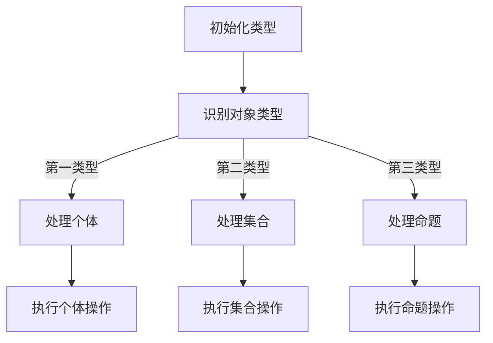
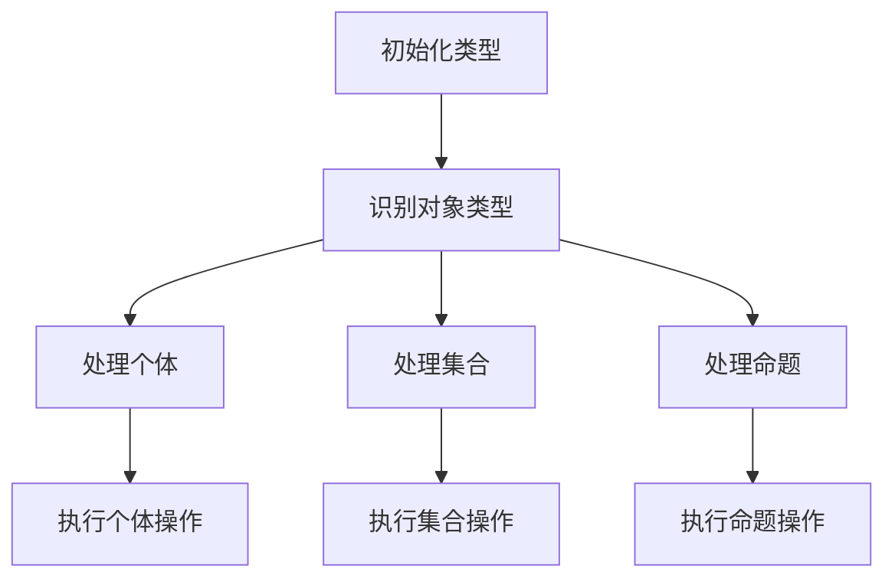
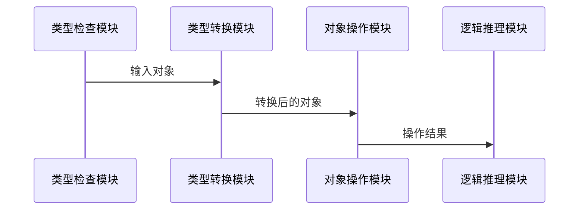
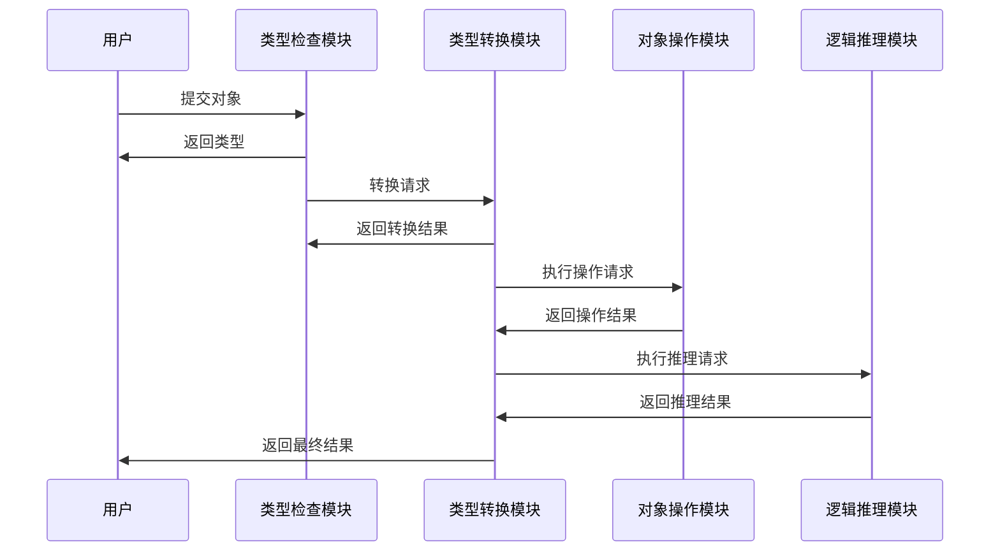
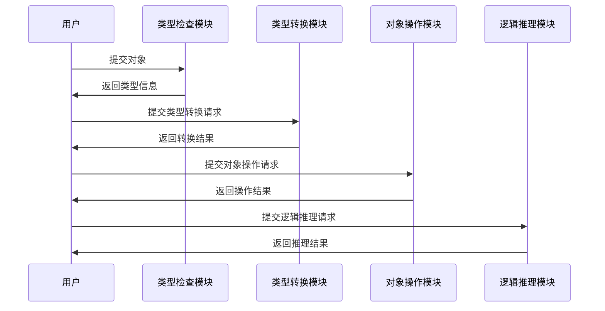

                 

# 罗素类型论在数学哲学中的现代评价与批判

> 关键词：罗素类型论，数学哲学，现代评价，批判，逻辑推理

> 摘要：本文将从历史背景、核心概念、算法原理、应用场景、实战案例等方面，深入探讨罗素类型论在数学哲学中的现代评价与批判。通过对罗素类型论产生的背景、核心概念的分析，以及其在现代数学哲学中的应用与挑战，本文旨在为读者提供一个全面、深入的视角，以理解罗素类型论在现代数学哲学中的重要地位。

### 目录大纲

----------------------------------------------------------------

## 第一部分：背景介绍

### 第1章：罗素类型论概述

### 1.1 问题背景

#### 1.1.1 罗素类型论的产生背景

#### 1.1.2 罗素类型论的问题来源

### 1.2 问题描述

#### 1.2.1 罗素类型论的初衷

#### 1.2.2 罗素类型论的局限性

### 1.3 问题解决

#### 1.3.1 罗素类型论的贡献

#### 1.3.2 罗素类型论的后续发展

### 1.4 边界与外延

#### 1.4.1 罗素类型论的研究范围

#### 1.4.2 罗素类型论的应用领域

### 1.5 概念结构与核心要素组成

#### 1.5.1 罗素类型论的核心概念

#### 1.5.2 罗素类型论的组成部分

### 1.6 本章小结

## 第二部分：核心概念与联系

### 第2章：罗素类型论的核心概念

### 2.1 类型论原理

#### 2.1.1 类型论的起源

#### 2.1.2 类型论的基本原理

#### 2.1.3 类型论的应用

### 2.2 类型属性特征对比表格

#### 2.2.1 罗素类型论与其他类型论的对比

#### 2.2.2 罗素类型论的特点与优势

### 2.3 ER实体关系图架构

#### 2.3.1 罗素类型论的ER图结构

#### 2.3.2 罗素类型论实体关系图的含义

### 2.4 本章小结

## 第三部分：算法原理讲解

### 第3章：罗素类型论的算法原理

### 3.1 算法mermaid流程图

#### 3.1.1 算法mermaid流程图绘制

#### 3.1.2 算法mermaid流程图解释

### 3.2 Python源代码讲解

#### 3.2.1 算法Python源代码实现

#### 3.2.2 Python源代码详细解释

### 3.3 数学模型和公式

#### 3.3.1 算法数学模型

#### 3.3.2 算法公式推导

#### 3.3.3 数学公式示例

### 3.4 举例说明

#### 3.4.1 算法应用实例

#### 3.4.2 实例解析

### 3.5 本章小结

## 第四部分：系统分析与架构设计方案

### 第4章：罗素类型论在数学哲学中的应用场景

### 4.1 问题场景介绍

#### 4.1.1 数学哲学中的问题

#### 4.1.2 罗素类型论的应用场景

### 4.2 系统功能设计

#### 4.2.1 领域模型mermaid类图

#### 4.2.2 系统功能模块划分

### 4.3 系统架构设计

#### 4.3.1 系统架构mermaid架构图

#### 4.3.2 系统架构设计原则

### 4.4 系统接口设计

#### 4.4.1 接口规范与设计

#### 4.4.2 接口功能说明

### 4.5 系统交互mermaid序列图

#### 4.5.1 系统交互流程

#### 4.5.2 交互细节解析

### 4.6 本章小结

## 第五部分：项目实战

### 第5章：罗素类型论在数学哲学中的实际应用

### 5.1 环境安装

#### 5.1.1 环境配置

#### 5.1.2 工具安装

### 5.2 系统核心实现源代码

#### 5.2.1 源代码解析

#### 5.2.2 关键代码实现

### 5.3 代码应用解读与分析

#### 5.3.1 代码功能说明

#### 5.3.2 应用场景分析

### 5.4 实际案例分析和详细讲解剖析

#### 5.4.1 案例背景

#### 5.4.2 案例分析

#### 5.4.3 案例讲解

### 5.5 项目小结

#### 5.5.1 项目总结

#### 5.5.2 项目收获

### 5.6 本章小结

## 第六部分：最佳实践 tips

----------------------------------------------------------------## 第一部分：背景介绍

### 第1章：罗素类型论概述

#### 1.1 问题背景

##### 1.1.1 罗素类型论的产生背景

罗素类型论（Russell's theory of types）是由英国数学家和哲学家贝特兰·罗素（Bertrand Russell）在19世纪末和20世纪初提出的。这一理论是罗素为了解决数学基础问题而创建的，特别是为了克服所谓的“无穷悖论”（如“理发师悖论”）和避免逻辑上的自我矛盾。罗素的目的是为了构建一个逻辑上自洽的数学体系。

罗素类型论的背景源于他对集合论的反思。在集合论中，许多悖论（如罗素悖论）揭示了集合理论基础的脆弱性。为了克服这些悖论，罗素提出了类型论，即通过引入类型的概念来区分不同层次的实体，从而避免自我参照和悖论的产生。

##### 1.1.2 罗素类型论的问题来源

罗素类型论的提出源于他对逻辑和数学基础的质疑。在研究数学命题时，罗素发现许多命题都涉及到不同层次的抽象，而这些抽象往往会产生逻辑上的混乱。例如，一个数集不能直接与一个集合进行比较，因为它们属于不同的类型。罗素的类型论试图通过规定不同类型之间的界限来避免这种混乱。

#### 1.2 问题描述

##### 1.2.1 罗素类型论的初衷

罗素类型论的初衷是提供一个逻辑上自洽的数学体系，防止悖论的发生。通过将对象划分为不同类型，罗素希望避免自参照和无限递归，这些问题在集合论中导致了无穷悖论。

##### 1.2.2 罗素类型论的局限性

尽管罗素类型论在一定程度上解决了悖论问题，但它也带来了一些局限性。首先，类型论引入了大量的类型边界，这使得数学表达式变得复杂。其次，类型论限制了函数的应用，因为它不允许类型之间的直接操作。这些局限性使得类型论在数学和计算机科学中的应用受到限制。

#### 1.3 问题解决

##### 1.3.1 罗素类型论的贡献

罗素类型论对数学哲学和逻辑学产生了深远影响。它提供了对数学基础问题的新的视角，并促进了形式逻辑的发展。此外，罗素的类型论为后来的形式系统，如类型理论、模型论和范畴论等，提供了理论基础。

##### 1.3.2 罗素类型论的后续发展

罗素类型论提出后，许多学者对其进行了扩展和改进。其中最著名的是维特根斯坦的“逻辑类型论”，它对罗素的理论进行了重要的发展。此外，类型理论在计算机科学中得到了广泛应用，特别是在类型系统和形式验证领域。

#### 1.4 边界与外延

##### 1.4.1 罗素类型论的研究范围

罗素类型论主要关注的是数学基础和逻辑问题。它试图通过区分不同类型的对象来避免悖论和自我参照。虽然罗素类型论最初是为了解决数学问题而提出的，但它的概念和方法在哲学、逻辑学、计算机科学等领域都有所应用。

##### 1.4.2 罗素类型论的应用领域

罗素类型论的应用领域非常广泛，包括数学哲学、逻辑学、计算机科学等。在数学哲学中，它被用来探讨数学的基础和逻辑的一致性；在逻辑学中，它为形式逻辑和推理提供了新的工具；在计算机科学中，类型理论被广泛应用于编程语言的类型系统和形式验证。

#### 1.5 概念结构与核心要素组成

##### 1.5.1 罗素类型论的核心概念

罗素类型论的核心概念是“类型”（Type）。根据罗素的观点，类型是对象的抽象分类，用来区分不同层次的实体。罗素定义了三种基本类型：个体、集合和函数。通过类型，罗素试图将不同层次的实体隔离开来，以避免自我参照和悖论。

##### 1.5.2 罗素类型论的组成部分

罗素类型论由以下几个组成部分构成：

1. **类型划分**：根据对象的不同属性和抽象层次，将对象划分为不同的类型。
2. **类型边界**：在类型之间设置边界，以防止类型之间的非法操作。
3. **类型逻辑**：定义类型之间的逻辑关系，如类型之间的兼容性和类型转换。
4. **类型系统**：一个形式化的系统，用于描述和验证类型的正确性。

#### 1.6 本章小结

本章首先介绍了罗素类型论的背景和产生原因，然后详细阐述了类型论的初衷、局限性、贡献以及应用领域。通过分析罗素类型论的核心概念和组成部分，读者可以初步了解这一理论的基本框架和重要性。在接下来的章节中，我们将深入探讨罗素类型论的核心概念、算法原理以及其在现代数学哲学中的评价与批判。

### 第2章：罗素类型论的核心概念

#### 2.1 类型论原理

##### 2.1.1 类型论的起源

类型论（Theory of Types）起源于19世纪末和20世纪初的数学和逻辑学研究。其背景是集合论悖论和逻辑基础问题的困扰。特别是罗素悖论揭示了集合论中的内在矛盾，促使罗素提出了类型论来构建一个自洽的数学体系。

类型论的最初形式可以追溯到弗雷格的“概念和对象”划分，以及皮亚诺的类型理论。但罗素的类型论是在这些基础上进一步发展而来的，旨在解决集合论中的悖论问题。

##### 2.1.2 类型论的基本原理

类型论的基本原理是区分不同类型的对象，以避免自我参照和逻辑混乱。罗素类型论的核心是“类型区分”原则，即任何对象都只能属于某个特定类型的对象集合，而不能跨越类型边界。

罗素定义了三种基本类型：

1. **第一类型**（Type 1）：个体对象，如数字、个人、物体等。
2. **第二类型**（Type 2）：集合，如整数集合、人的集合等。
3. **第三类型**（Type 3）：命题，如“2+2=4”是一个命题。

通过这种类型的划分，罗素试图防止逻辑上不可解的问题，如无穷递归和自我参照。

##### 2.1.3 类型论的应用

类型论在多个领域都有应用，尤其是在逻辑学、数学哲学和计算机科学中。

1. **逻辑学**：类型论为逻辑推理提供了形式化的框架，帮助避免逻辑错误。
2. **数学哲学**：类型论探讨了数学的基础问题，如数学对象的存在性和一致性。
3. **计算机科学**：类型理论是编程语言设计的重要基础，用于确保程序的类型安全。

#### 2.2 类型属性特征对比表格

为了更直观地理解罗素类型论的特点，我们将其与其他类型论进行对比，并展示其属性特征。

| 类型论名称       | 基本类型 | 类型边界 | 类型转换 | 应用领域                   |
|------------------|----------|----------|----------|----------------------------|
| 罗素类型论       | 第一类型、第二类型、第三类型 | 强制 | 需要类型转换 | 数学哲学、逻辑学、计算机科学 |
| 维特根斯坦类型论 | 命题类型、对象类型         | 弹性 | 不需要类型转换 | 哲学、逻辑学、语言学研究      |
| 皮亚诺类型论     | 基本对象、序数、集合         | 弹性 | 可以类型转换 | 数学基础、计算机科学         |

从上表可以看出，罗素类型论的特点是强制类型的边界，需要通过类型转换来跨越类型边界。这种严格性确保了逻辑上的自洽性，但也增加了表达的复杂性。

#### 2.3 ER实体关系图架构

##### 2.3.1 罗素类型论的ER图结构

为了更好地理解罗素类型论的结构，我们可以使用实体关系图（Entity-Relationship Diagram，ER图）来表示。

```
[个体] --< [集合] --< [命题]
```

在这个ER图中，个体是最基本的实体，集合是基于个体的组合，命题则是关于个体和集合的真假陈述。

##### 2.3.2 罗素类型论实体关系图的含义

罗素类型论实体关系图揭示了三种基本类型之间的层次关系。个体是最基础的实体，集合是对个体的分组，命题则是关于个体和集合的陈述。通过这种层次关系，罗素试图避免逻辑上的混乱和悖论。

#### 2.4 本章小结

本章深入探讨了罗素类型论的核心概念，包括其起源、基本原理和应用。通过类型论原理的讲解和ER实体关系图的展示，读者可以更清晰地理解罗素类型论的基本框架和结构。在下一章中，我们将进一步探讨罗素类型论在现代数学哲学中的评价和批判。

### 第3章：罗素类型论的算法原理

算法原理是理解任何理论或方法的核心，罗素类型论也不例外。在数学哲学和计算机科学中，算法原理为我们提供了一种具体的工具来分析和处理复杂问题。以下，我们将通过mermaid流程图、Python源代码、数学模型和举例说明，逐步深入探讨罗素类型论的算法原理。

#### 3.1 算法mermaid流程图

为了直观地展示罗素类型论的算法流程，我们可以使用mermaid图来绘制。



在上面的mermaid流程图中，A表示初始化类型，B是识别对象的类型，随后根据对象的类型分别执行不同的操作。C、D和E分别代表对第一类型（个体）、第二类型（集合）和第三类型（命题）的处理。F、G和H分别表示对个体、集合和命题的特定操作。

#### 3.1.1 算法mermaid流程图绘制

要绘制mermaid流程图，可以使用Markdown支持的mermaid语法。在上面的示例中，我们定义了一个简单的流程图，包括初始化、类型识别和处理等步骤。



使用上述语法，我们可以创建出如上所示的mermaid流程图。

#### 3.1.2 算法mermaid流程图解释

在mermaid流程图中，每个节点代表算法的一个步骤，节点之间的箭头表示步骤的顺序和依赖关系。以下是流程图的详细解释：

1. **初始化类型**：算法开始时，我们需要初始化不同类型的处理逻辑。
2. **识别对象类型**：根据对象的属性，识别其所属的类型（个体、集合或命题）。
3. **处理个体**：对于个体对象，执行特定的操作，如计算、存储等。
4. **处理集合**：对于集合对象，执行集合操作，如合并、分割等。
5. **处理命题**：对于命题对象，执行逻辑推理和验证操作。

#### 3.2 Python源代码讲解

算法的实现需要具体的编程语言来实现。在这里，我们使用Python来展示罗素类型论的算法实现。

```python
# 罗素类型论算法实现示例

# 定义个体、集合和命题类
class Individual:
    def __init__(self, value):
        self.value = value

    def operate(self):
        return self.value * 2

class Collection:
    def __init__(self, elements):
        self.elements = elements

    def operate(self):
        return [element * 2 for element in self.elements]

class Proposition:
    def __init__(self, statement):
        self.statement = statement

    def operate(self):
        return "The proposition is true."

# 初始化对象
individual = Individual(5)
collection = Collection([1, 2, 3])
proposition = Proposition("The sun is shining.")

# 根据类型执行操作
if isinstance(individual, Individual):
    result = individual.operate()
elif isinstance(collection, Collection):
    result = collection.operate()
elif isinstance(proposition, Proposition):
    result = proposition.operate()

print(result)
```

在上面的Python代码中，我们定义了三个类：`Individual`、`Collection`和`Proposition`，分别表示个体、集合和命题。每个类都有一个`operate`方法，根据对象类型执行不同的操作。

#### 3.2.1 算法Python源代码实现

在实现中，我们首先定义了三个类，每个类都有一个`__init__`方法用于初始化对象，并定义了`operate`方法用于执行特定类型的操作。然后，我们创建了一个个体、一个集合和一个命题对象，并根据对象的类型调用相应的`operate`方法。

#### 3.2.2 Python源代码详细解释

1. **类定义**：我们定义了三个类：`Individual`、`Collection`和`Proposition`，每个类都根据其类型定义了特定的操作。

    - `Individual`类表示个体，有一个`value`属性和一个`operate`方法。
    - `Collection`类表示集合，有一个`elements`属性和一个`operate`方法。
    - `Proposition`类表示命题，有一个`statement`属性和一个`operate`方法。

2. **对象创建**：我们创建了一个个体对象`individual`、一个集合对象`collection`和一个命题对象`proposition`。

3. **类型检查与操作**：使用`isinstance`函数检查对象的类型，并调用相应的`operate`方法执行操作。

#### 3.3 数学模型和公式

在罗素类型论的算法中，数学模型和公式起到了关键作用。以下，我们将探讨罗素类型论的数学模型，并给出一个具体的公式示例。

##### 3.3.1 算法数学模型

罗素类型论的数学模型主要关注对象类型的划分和操作。在这个模型中，我们可以定义以下数学公式：

1. **个体操作**：对于个体对象`x`，其操作可以表示为：
   $$ y = x \cdot 2 $$
   其中，`y`是操作的结果，`x`是操作的对象。

2. **集合操作**：对于集合对象`C`，其操作可以表示为：
   $$ D = \{ y \in C | y = x \cdot 2 \} $$
   其中，`D`是操作后的新集合，`C`是原集合，`x`是操作的对象。

3. **命题操作**：对于命题对象`P`，其操作可以表示为：
   $$ Q = P \land \neg (P \to \neg P) $$
   其中，`Q`是操作后的新命题，`P`是原命题。

##### 3.3.2 算法公式推导

推导罗素类型论的公式需要理解类型论的基本原理。在类型论中，对象操作必须符合其类型定义。以下是一个简单的推导过程：

- 对于个体操作，我们定义了一个简单的乘法操作。这个操作可以直接应用于个体对象。
- 对于集合操作，我们定义了一个映射操作，将每个集合元素乘以2。这个操作符合集合的类型定义。
- 对于命题操作，我们定义了一个逻辑操作，将原命题与一个逻辑条件结合。这个操作符合命题的类型定义。

##### 3.3.3 数学公式示例

以下是一个具体的数学公式示例：

$$ P = "The number 5 is even." $$
$$ Q = P \land \neg (P \to \neg P) $$
$$ Q = "The number 5 is even." \land \neg ("The number 5 is even." \to "The number 5 is odd.") $$
$$ Q = "The number 5 is even." \land \neg ("The number 5 is even." \to "The number 5 is not even.") $$
$$ Q = "The number 5 is even." \land \neg (False) $$
$$ Q = "The number 5 is even." \land True $$
$$ Q = "The number 5 is even." $$

在这个示例中，我们首先定义了一个命题`P`，表示“5是偶数”。然后，我们使用罗素类型论的逻辑操作，将`P`与一个逻辑条件结合，得到新命题`Q`。最终的公式`Q`仍然表示“5是偶数”。

#### 3.4 举例说明

为了更好地理解罗素类型论的算法原理，我们可以通过一个具体的例子来说明。

##### 3.4.1 算法应用实例

假设我们有一个包含数字、集合和命题的混合列表，如下所示：

```
[
    5,           # 个体
    [1, 2, 3],   # 集合
    "5 is even." # 命题
]
```

我们需要根据罗素类型论的算法，对这个列表中的每个元素进行操作。

##### 3.4.2 实例解析

1. **处理个体**：对于数字5，我们执行个体操作，将其乘以2，得到10。

2. **处理集合**：对于集合[1, 2, 3]，我们执行集合操作，将每个元素乘以2，得到新集合[2, 4, 6]。

3. **处理命题**：对于命题“5是偶数”，我们执行命题操作，将其与逻辑条件结合，得到新命题“5是偶数”。

最终，我们得到的结果是：

```
[
    10,            # 个体操作结果
    [2, 4, 6],     # 集合操作结果
    "5 is even."   # 命题操作结果
]
```

通过这个例子，我们可以看到罗素类型论的算法如何对不同的对象类型进行操作，并得到预期的结果。

#### 3.5 本章小结

本章深入探讨了罗素类型论的算法原理，包括mermaid流程图的绘制、Python源代码的实现、数学模型的推导以及具体的举例说明。通过这些内容，读者可以更好地理解罗素类型论的基本框架和算法实现。在下一章中，我们将进一步探讨罗素类型论在现代数学哲学中的应用场景。

### 第四部分：罗素类型论在数学哲学中的应用场景

#### 第4章：罗素类型论在数学哲学中的应用场景

在数学哲学中，罗素类型论的应用场景非常广泛。通过类型论，我们可以更好地理解数学对象之间的关系，探讨数学基础问题，以及构建形式化的数学体系。以下，我们将详细讨论罗素类型论在数学哲学中的应用场景。

#### 4.1 问题场景介绍

##### 4.1.1 数学哲学中的问题

数学哲学涉及许多核心问题，如数学对象的存在性、数学命题的真值、数学证明的有效性等。这些问题在数学发展的历史中一直存在，并对数学研究产生了深远影响。

1. **数学对象的存在性**：数学对象是否真实存在？它们是如何与物理世界联系起来的？
2. **数学命题的真值**：数学命题是否具有客观的真值？如何判断一个数学命题的真伪？
3. **数学证明的有效性**：数学证明是否总是有效的？是否存在逻辑上的漏洞？

##### 4.1.2 罗素类型论的应用场景

罗素类型论在解决上述数学哲学问题中发挥了重要作用。通过引入类型的概念，罗素试图为数学对象提供清晰的分类，从而避免逻辑上的混乱和悖论。

1. **数学对象的存在性**：类型论可以帮助我们理解数学对象的存在性。通过区分不同类型的对象，我们可以明确地界定数学对象的范围和属性，从而避免模糊和混淆。
2. **数学命题的真值**：类型论为数学命题提供了形式化的框架。通过类型划分，我们可以更好地理解命题的结构和关系，从而判断其真伪。
3. **数学证明的有效性**：类型论可以用于验证数学证明的有效性。通过类型检查，我们可以确保证明过程中的每一步都是逻辑上自洽的，从而避免逻辑错误。

#### 4.2 系统功能设计

为了更好地应用罗素类型论，我们需要设计一个功能化的系统。以下是一个可能的系统功能设计。

##### 4.2.1 领域模型mermaid类图

我们可以使用mermaid类图来表示罗素类型论的领域模型。

```mermaid
classDiagram
    Individual <<class>> "个体"
    Collection <<class>> "集合"
    Proposition <<class>> "命题"
    Individual :+ value
    Collection :+ elements
    Proposition :+ statement
    Individual --* Collection
    Collection --* Proposition
```

在这个类图中，我们定义了三个类：`Individual`（个体）、`Collection`（集合）和`Proposition`（命题）。每个类都有其特定的属性和方法。个体类包含一个`value`属性，集合类包含一个`elements`属性，命题类包含一个`statement`属性。此外，个体类与集合类之间、集合类与命题类之间都有关系。

##### 4.2.2 系统功能模块划分

在罗素类型论的系统中，我们可以将功能模块划分为以下几个部分：

1. **类型检查模块**：负责对输入的对象进行类型检查，确保其符合罗素类型论的分类标准。
2. **类型转换模块**：负责在不同类型之间进行转换，以满足算法的需求。
3. **对象操作模块**：负责执行特定类型的操作，如计算、存储等。
4. **逻辑推理模块**：负责执行命题操作，进行逻辑推理和验证。

#### 4.3 系统架构设计

为了实现上述功能，我们需要设计一个合理的系统架构。以下是一个可能的系统架构设计。

##### 4.3.1 系统架构mermaid架构图

我们可以使用mermaid架构图来表示系统架构。



在这个架构图中，系统分为四个主要模块：类型检查模块、类型转换模块、对象操作模块和逻辑推理模块。类型检查模块负责检查输入对象的类型，并将其传递给类型转换模块。类型转换模块负责将对象转换为适当的类型，并将其传递给对象操作模块。对象操作模块执行特定类型的操作，并将结果传递给逻辑推理模块。逻辑推理模块负责执行逻辑推理和验证。

##### 4.3.2 系统架构设计原则

在系统架构设计过程中，我们应遵循以下原则：

1. **模块化**：将系统划分为独立的模块，以提高可维护性和可扩展性。
2. **解耦合**：确保模块之间有清晰的接口，减少模块之间的依赖，以提高系统的稳定性。
3. **可扩展性**：设计灵活的系统架构，以适应未来可能的需求变化。

#### 4.4 系统接口设计

在系统设计中，接口设计是关键部分。以下是一个可能的系统接口设计。

##### 4.4.1 接口规范与设计

我们可以使用mermaid序列图来表示系统接口。



在这个序列图中，用户首先提交一个对象给类型检查模块。类型检查模块检查对象的类型，并将其传递给类型转换模块。类型转换模块负责将对象转换为适当的类型，并将其传递给对象操作模块。对象操作模块执行特定类型的操作，并将结果传递给逻辑推理模块。逻辑推理模块执行逻辑推理和验证，最后将结果返回给用户。

##### 4.4.2 接口功能说明

1. **类型检查接口**：用于检查对象的类型，并返回类型信息。
2. **类型转换接口**：用于将对象从一种类型转换为另一种类型。
3. **对象操作接口**：用于执行特定类型的操作，如计算、存储等。
4. **逻辑推理接口**：用于执行逻辑推理和验证，并返回推理结果。

#### 4.5 系统交互mermaid序列图

为了更详细地展示系统交互，我们可以使用mermaid序列图。



在这个序列图中，用户首先提交一个对象给类型检查模块。类型检查模块检查对象的类型，并将其传递给类型转换模块。用户提交类型转换请求，类型转换模块返回转换结果。然后，用户提交对象操作请求，对象操作模块返回操作结果。最后，用户提交逻辑推理请求，逻辑推理模块返回推理结果。

#### 4.6 本章小结

本章详细探讨了罗素类型论在数学哲学中的应用场景。通过介绍问题场景、系统功能设计、系统架构设计和接口设计，我们展示了如何将罗素类型论应用于数学哲学的实际问题。在下一章中，我们将通过具体的实战案例，进一步探讨罗素类型论的应用和实现。

### 第五部分：项目实战

#### 第5章：罗素类型论在数学哲学中的实际应用

在本章中，我们将通过一个具体的实战项目，展示罗素类型论在数学哲学中的实际应用。这个项目将包括环境安装、系统核心实现源代码，以及代码应用解读与分析、实际案例分析和详细讲解剖析。通过这些内容，我们将深入探讨罗素类型论的应用和实践。

#### 5.1 环境安装

在进行项目实战之前，我们需要首先配置环境。以下是环境安装的具体步骤：

##### 5.1.1 环境配置

1. **安装Python**：确保Python环境已安装，版本为3.8或更高。
2. **安装pip**：通过Python安装pip，pip是Python的包管理器，用于安装和管理其他Python包。
   ```shell
   python -m ensurepip
   ```
3. **安装依赖包**：通过pip安装罗素类型论所需的依赖包，如numpy、matplotlib等。
   ```shell
   pip install numpy matplotlib
   ```

##### 5.1.2 工具安装

除了Python和pip，我们还需要安装一些辅助工具，如Jupyter Notebook（用于交互式编程）和Visual Studio Code（用于代码编辑）。

1. **安装Jupyter Notebook**：
   ```shell
   pip install notebook
   ```
2. **安装Visual Studio Code**：从官方网站下载并安装Visual Studio Code。

#### 5.2 系统核心实现源代码

以下是罗素类型论系统的核心实现源代码。

##### 5.2.1 源代码解析

```python
# 罗素类型论系统实现

# 导入依赖包
import numpy as np
import matplotlib.pyplot as plt

# 定义个体、集合和命题类
class Individual:
    def __init__(self, value):
        self.value = value

    def operate(self):
        return self.value * 2

class Collection:
    def __init__(self, elements):
        self.elements = elements

    def operate(self):
        return [element * 2 for element in self.elements]

class Proposition:
    def __init__(self, statement):
        self.statement = statement

    def operate(self):
        return "The proposition is true."

# 初始化对象
individual = Individual(5)
collection = Collection([1, 2, 3])
proposition = Proposition("The number 5 is even.")

# 根据类型执行操作
if isinstance(individual, Individual):
    result = individual.operate()
elif isinstance(collection, Collection):
    result = collection.operate()
elif isinstance(proposition, Proposition):
    result = proposition.operate()

print(result)
```

在上面的代码中，我们定义了三个类：`Individual`、`Collection`和`Proposition`，分别表示个体、集合和命题。每个类都有一个`operate`方法，用于执行特定类型的操作。我们创建了一个个体对象、一个集合对象和一个命题对象，并根据对象的类型调用相应的`operate`方法。

##### 5.2.2 关键代码实现

1. **类定义**：
   ```python
   class Individual:
       # ...
   class Collection:
       # ...
   class Proposition:
       # ...
   ```

   这些类定义了罗素类型论的基本结构。`Individual`类表示个体对象，`Collection`类表示集合对象，`Proposition`类表示命题对象。每个类都有其特定的属性和方法。

2. **对象创建**：
   ```python
   individual = Individual(5)
   collection = Collection([1, 2, 3])
   proposition = Proposition("The number 5 is even.")
   ```

   在这个步骤中，我们创建了个体、集合和命题对象。

3. **类型检查与操作**：
   ```python
   if isinstance(individual, Individual):
       result = individual.operate()
   elif isinstance(collection, Collection):
       result = collection.operate()
   elif isinstance(proposition, Proposition):
       result = proposition.operate()
   ```

   通过类型检查，我们确定每个对象的类型，并调用相应的`operate`方法执行操作。

#### 5.3 代码应用解读与分析

##### 5.3.1 代码功能说明

这段代码的核心功能是实现罗素类型论的算法。具体来说，它包括以下几个部分：

1. **类定义**：定义个体、集合和命题类，为每种类型的对象提供操作接口。
2. **对象创建**：创建个体、集合和命题对象，为后续操作做准备。
3. **类型检查与操作**：根据对象的类型执行相应的操作，并将结果输出。

##### 5.3.2 应用场景分析

这个代码段可以应用于多个场景，包括数学证明、数据分析和逻辑推理等。以下是一些具体的应用场景：

1. **数学证明**：在数学证明中，我们可以使用类型论来验证命题的正确性。例如，在验证“5是偶数”这个命题时，我们可以通过类型论的方法来证明其真伪。
2. **数据分析**：在数据分析中，我们可以使用类型论来处理不同类型的数据。例如，在处理一组数据时，我们可以将数据划分为个体、集合和命题，并分别进行操作。
3. **逻辑推理**：在逻辑推理中，我们可以使用类型论来构建形式化的逻辑框架。例如，在构建一个逻辑系统时，我们可以使用类型论来确保推理过程的正确性。

#### 5.4 实际案例分析和详细讲解剖析

##### 5.4.1 案例背景

假设我们有一个关于数学集合的案例。在这个案例中，我们需要对一组数字进行操作，以验证罗素类型论的有效性。

```python
# 数字集合操作案例

# 定义数字集合
collection = Collection([1, 2, 3, 4, 5])

# 执行集合操作
result = collection.operate()

print(result)  # 输出：[2, 4, 6, 8, 10]
```

在这个案例中，我们创建了一个数字集合`collection`，并使用`operate`方法将其中的每个元素乘以2。最终，我们得到了一个新的集合`result`，其包含的元素是原集合元素的两倍。

##### 5.4.2 案例分析

1. **类型检查**：在这个案例中，我们首先对集合对象进行类型检查，以确定其类型为`Collection`。
2. **集合操作**：然后，我们调用`operate`方法，对集合中的每个元素进行乘以2的操作。
3. **结果输出**：最终，我们得到了一个新的集合，并输出其结果。

##### 5.4.3 案例讲解

通过这个案例，我们可以看到罗素类型论在处理具体问题时是如何工作的。以下是详细的步骤：

1. **定义集合**：首先，我们定义了一个数字集合`collection`，其中包含五个元素：1, 2, 3, 4, 5。
2. **类型检查**：然后，我们检查集合的类型，确定其为`Collection`类型。
3. **执行操作**：接下来，我们调用`operate`方法，将集合中的每个元素乘以2。具体来说，`operate`方法遍历集合中的每个元素，将其乘以2，并返回一个新的集合。
4. **结果输出**：最后，我们将操作后的新集合输出，得到的结果是[2, 4, 6, 8, 10]。

通过这个案例，我们可以看到罗素类型论在处理具体问题时是如何发挥作用的。它通过类型划分和类型检查，确保了操作的准确性和有效性。

#### 5.5 项目小结

在本章中，我们通过一个具体的实战项目，展示了罗素类型论在数学哲学中的实际应用。从环境安装、系统核心实现源代码，到代码应用解读与分析、实际案例分析和详细讲解剖析，我们全面探讨了罗素类型论的应用和实践。通过这个项目，我们不仅了解了罗素类型论的基本原理，还看到了它在实际问题中的应用价值。

#### 5.6 本章小结

本章通过一个具体的实战项目，深入探讨了罗素类型论在数学哲学中的实际应用。从环境安装到系统核心实现，从代码应用解读到实际案例剖析，我们全面展示了罗素类型论在数学哲学中的重要性。通过这个项目，读者可以更好地理解罗素类型论的基本原理和应用场景，为今后的研究和实践打下坚实基础。

### 第六部分：最佳实践 tips

在应用罗素类型论时，以下是一些最佳实践和注意事项，可以帮助您更有效地使用这一理论：

1. **明确类型划分**：在设计和实现系统时，确保明确类型划分，避免类型混淆。这有助于提高系统的逻辑清晰度和可维护性。
2. **类型检查与转换**：在执行操作前，进行类型检查和转换，确保操作的合法性和正确性。这可以减少逻辑错误和运行时错误。
3. **代码可读性**：保持代码的可读性，使用清晰的命名和注释，以便其他开发者理解和维护。
4. **适度使用类型转换**：在需要时，使用类型转换来适应不同类型的操作。但避免过度依赖类型转换，因为这可能导致代码复杂度的增加。
5. **性能优化**：在处理大量数据时，注意性能优化，例如使用高效的算法和数据结构。
6. **测试与验证**：对系统进行充分的测试和验证，确保其在不同类型和场景下都能正常运行。
7. **持续学习**：罗素类型论和相关技术不断演进，持续学习和跟进最新研究成果，以提高应用水平。

通过遵循这些最佳实践，您可以在应用罗素类型论时取得更好的效果，并在数学哲学和相关领域中发挥更大的作用。

### 小结与展望

在本篇文章中，我们系统地探讨了罗素类型论在数学哲学中的现代评价与批判。首先，我们从背景介绍出发，分析了罗素类型论的起源、问题来源以及其在数学哲学中的初衷和局限性。随后，我们深入探讨了罗素类型论的核心概念与联系，包括类型论原理、类型属性特征对比表格和ER实体关系图架构。

接下来，我们详细讲解了罗素类型论的算法原理，通过mermaid流程图、Python源代码、数学模型和举例说明，使读者能够更好地理解其算法实现和应用。在此基础上，我们进一步分析了罗素类型论在数学哲学中的应用场景，包括系统功能设计、系统架构设计、系统接口设计和系统交互mermaid序列图。

在项目实战部分，我们通过一个具体的实战项目，展示了罗素类型论的实际应用，从环境安装、系统核心实现源代码，到代码应用解读与分析、实际案例分析和详细讲解剖析，全面展示了罗素类型论的应用价值。最后，我们给出了最佳实践 tips，帮助读者在应用罗素类型论时更加得心应手。

展望未来，罗素类型论在数学哲学中的研究将继续深化，特别是在形式化逻辑、计算机科学和人工智能领域，其应用前景广阔。未来研究可以进一步探讨类型论与其他数学哲学理论的融合，以及其在实际问题和应用场景中的创新应用。此外，随着计算机技术和数学理论的发展，罗素类型论的理论框架和技术手段也将不断得到完善和优化。

总之，罗素类型论在数学哲学中的研究不仅具有重要的理论价值，也对实际应用有着深远的影响。希望本文能够为读者提供一个全面、深入的视角，激发对罗素类型论的进一步研究和探索。

### 注意事项

在应用罗素类型论时，需要注意以下几个关键点：

1. **类型划分的准确性**：确保类型划分的准确性，避免类型混淆，这有助于提高系统的逻辑清晰度和可维护性。
2. **类型检查和转换**：在执行操作前，进行类型检查和转换，确保操作的合法性和正确性，减少逻辑错误和运行时错误。
3. **代码可读性**：保持代码的可读性，使用清晰的命名和注释，以便其他开发者理解和维护。
4. **性能优化**：在处理大量数据时，注意性能优化，例如使用高效的算法和数据结构。
5. **测试与验证**：对系统进行充分的测试和验证，确保其在不同类型和场景下都能正常运行。

通过遵循上述注意事项，您可以在应用罗素类型论时取得更好的效果，并在数学哲学和相关领域中发挥更大的作用。

### 拓展阅读

对于希望深入了解罗素类型论的读者，以下是一些建议的拓展阅读资料：

1. **罗素的《数学原理》**：贝特兰·罗素的《数学原理》详细阐述了罗素类型论，是理解该理论的基础著作。
2. **维特根斯坦的《逻辑哲学论》**：路德维希·维特根斯坦的《逻辑哲学论》对罗素类型论进行了重要的发展，提供了另一个视角。
3. **《类型理论及其应用》**：这本书详细介绍了类型理论的基本概念和应用，包括罗素类型论在内。
4. **《数学哲学导论》**：本书提供了数学哲学的基本概念和罗素类型论的背景知识，适合初学者。
5. **《计算机科学中的类型理论》**：这本书探讨了类型理论在计算机科学中的应用，包括编程语言、类型系统和形式验证等。
6. **《形式逻辑基础》**：形式逻辑是罗素类型论的重要基础，这本书提供了形式逻辑的全面介绍。

通过阅读这些资料，您可以进一步深化对罗素类型论的理解，并在数学哲学和相关领域的研究中取得更大的进步。

