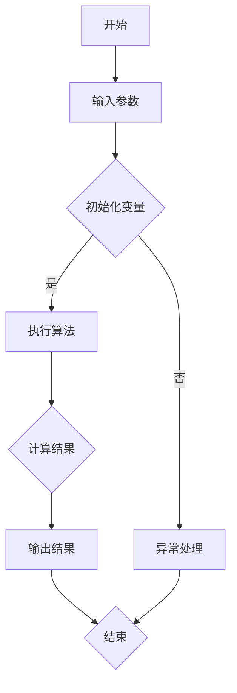
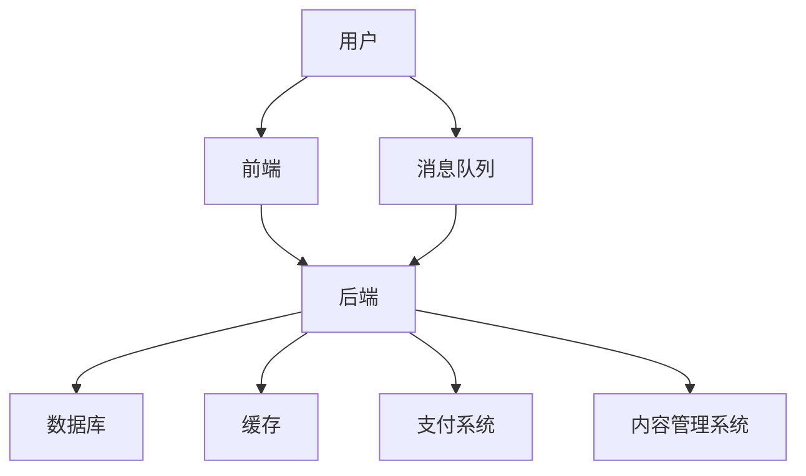
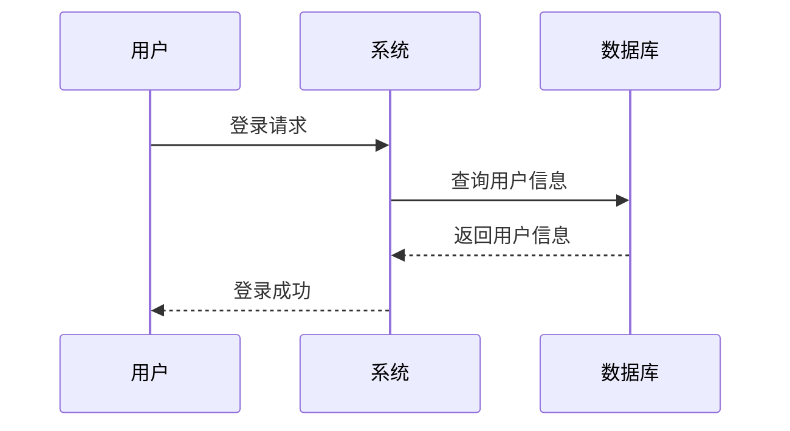

                 

# 《罗素类型论在数学基础研究中的历史局限》

## 关键词
- 罗素类型论
- 数学基础研究
- 历史局限
- 类型论哲学
- 归谬论
- 实用主义

## 摘要
本文旨在探讨罗素类型论在数学基础研究中的历史局限。通过对罗素类型论的背景介绍、核心概念与特征分析、历史局限及其对数学基础研究的影响，以及与之相关的其他数学基础研究理论的对比，本文深入剖析了罗素类型论的局限性。同时，本文还将介绍数学基础研究的其他理论，以期为读者提供更全面的数学基础研究理论视野。

## 第一部分：罗素类型论背景介绍

### 第1章：数学基础研究的背景

#### 1.1 数学基础研究的背景介绍
数学基础研究起源于古希腊，经历了几千年的发展，逐渐形成了现代数学的基础。数学基础研究关注数学本身的基本概念、原理、结构和逻辑体系，为数学的发展提供了坚实的理论支持。

#### 1.2 数学基础研究的必要性
数学基础研究的必要性体现在多个方面。首先，它是数学发展的基石，为新的数学理论和应用提供理论支持。其次，它有助于解决数学领域中的问题，推动数学向更高层次发展。此外，数学基础研究还能促进计算机科学、物理学、经济学等学科的发展。

#### 1.3 数学基础研究的发展历程
数学基础研究的发展历程可以分为几个阶段。古希腊时期，数学基础研究主要关注几何学和数论。17世纪，微积分的创立标志着数学基础研究进入新的阶段。19世纪末，集合论的提出使数学基础研究达到新的高度。20世纪，数学基础研究在逻辑、拓扑、代数等领域取得了显著成果。

### 第2章：罗素类型论的概念与特征

#### 2.1 罗素类型论的核心概念
罗素类型论是一种关于对象分类的理论，它主张对象根据其属性和关系进行分类，并强调类型之间的区别。罗素类型论的核心概念包括类型、个体和属性等。

#### 2.2 罗素类型论的特征对比
罗素类型论与直觉主义逻辑等理论进行了对比，展示了其在分类、推理和证明等方面的特征。罗素类型论强调类型区分，有助于避免一些逻辑悖论，但同时也带来了一些新的问题。

#### 2.3 罗素类型论的应用领域
罗素类型论在数学、计算机科学、哲学等领域都有应用。在数学中，它有助于解决集合论中的悖论问题；在计算机科学中，它为类型系统提供了理论基础；在哲学中，它探讨了对象分类和知识建构等问题。

### 第3章：罗素类型论的历史局限

#### 3.1 罗素类型论的历史局限概述
罗素类型论在数学基础研究中的局限性主要体现在以下几个方面：对集合论的依赖、类型区分的复杂性、对实际问题的适用性等。

#### 3.2 罗素类型论的局限性分析
罗素类型论的局限性分析涉及对集合论的依赖、类型区分的复杂性以及罗素类型论在解决实际问题中的应用问题。通过分析这些局限性，我们可以更好地理解罗素类型论的不足之处。

#### 3.3 罗素类型论的局限性对数学基础研究的影响
罗素类型论的局限性对数学基础研究产生了深远的影响。一方面，它促使数学家们寻求新的数学基础理论；另一方面，它也推动了数学基础研究向更广泛、更深入的方向发展。

### 第4章：数学基础研究的其他理论

#### 4.1 其他数学基础研究理论的概述
除了罗素类型论，数学基础研究还包括其他一些理论，如直觉主义逻辑、形式主义、构造主义等。这些理论各有特点，为数学基础研究提供了不同的视角和方法。

#### 4.2 与罗素类型论的对比分析
与其他数学基础研究理论相比，罗素类型论在分类、推理和证明等方面有哪些优势？又有哪些劣势？通过对比分析，我们可以更全面地了解罗素类型论在数学基础研究中的地位和作用。

#### 4.3 其他数学基础研究理论的优势与局限
其他数学基础研究理论在数学基础研究中也发挥着重要作用。它们的优势在于能够解决罗素类型论无法解决的问题，但同时也存在各自的局限。

## 第二部分：算法原理与数学模型讲解

### 第5章：算法原理讲解

#### 5.1 算法原理概述
算法原理是数学基础研究中不可或缺的一部分。它关注如何通过有限的步骤解决特定问题，包括算法的设计、实现和优化。

#### 5.2 算法原理讲解
在本章中，我们将介绍一些经典的算法原理，如贪心算法、分治算法、动态规划等。通过这些算法原理，我们可以更好地理解数学问题的求解过程。

#### 5.3 算法原理的应用场景
算法原理在各种实际应用场景中都有着广泛的应用。在本章中，我们将探讨这些算法原理在不同领域中的应用，如计算机科学、经济学、生物学等。

### 第6章：数学模型和数学公式

#### 6.1 数学模型概述
数学模型是数学基础研究中的重要工具。它通过数学语言描述现实世界中的问题，为问题的求解提供了理论基础。

#### 6.2 数学模型的应用
在本章中，我们将介绍一些常见的数学模型，如线性规划、非线性规划、概率模型等。通过这些数学模型，我们可以更好地理解现实世界中的问题。

#### 6.3 数学公式解析
数学公式是数学模型的重要组成部分。在本章中，我们将详细解析一些重要的数学公式，如欧拉公式、傅里叶变换等。

### 第7章：数学公式详细讲解与举例说明

#### 7.1 数学公式的详细讲解
在本章中，我们将详细讲解一些重要的数学公式，如泰勒公式、洛必达法则等。通过这些讲解，我们可以更好地理解这些公式的原理和应用。

#### 7.2 举例说明
在本章中，我们将通过具体例子来展示数学公式在实际问题中的应用。通过这些例子，我们可以更直观地理解数学公式的意义和作用。

#### 7.3 数学公式的实际应用
数学公式在各个领域都有着广泛的应用。在本章中，我们将探讨数学公式在计算机科学、物理学、经济学等领域的实际应用。

## 第三部分：系统分析与架构设计方案

### 第8章：系统分析与架构设计

#### 8.1 问题场景介绍
在本章中，我们将介绍一个具体的问题场景，并分析其需求、目标和约束。

#### 8.2 系统功能设计
在本章中，我们将设计一个系统的功能模块，包括核心功能、辅助功能和扩展功能。

#### 8.3 系统架构设计
在本章中，我们将设计一个系统的总体架构，包括系统组件、数据流和接口设计。

#### 8.4 系统接口设计和系统交互
在本章中，我们将详细描述系统中的各个接口，并分析系统之间的交互关系。

### 第9章：项目实战

#### 9.1 环境安装
在本章中，我们将介绍项目环境安装的步骤和注意事项。

#### 9.2 系统核心实现源代码
在本章中，我们将展示系统核心实现的源代码，并进行分析和解读。

#### 9.3 代码应用解读与分析
在本章中，我们将对系统核心实现源代码的应用进行解读和分析。

#### 9.4 实际案例分析和详细讲解剖析
在本章中，我们将分析一个实际案例，并对其进行详细讲解和剖析。

### 第10章：最佳实践 tips

#### 10.1 最佳实践 tips
在本章中，我们将总结一些项目实战中的最佳实践，为读者提供参考。

#### 10.2 实战经验分享
在本章中，我们将分享一些项目实战中的经验教训，供读者借鉴。

#### 10.3 注意事项
在本章中，我们将列出一些项目实战中需要注意的事项，以避免常见的错误和问题。

### 第11章：项目小结

#### 11.1 项目总结
在本章中，我们将对项目进行总结，回顾项目的目标、成果和收获。

#### 11.2 项目成果
在本章中，我们将展示项目的成果，包括系统功能实现、性能指标和用户体验等。

#### 11.3 项目反思
在本章中，我们将对项目进行反思，总结项目中的不足和改进方向。

### 第12章：注意事项

#### 12.1 注意事项
在本章中，我们将列出一些项目实战和数学基础研究中的注意事项，以帮助读者避免常见的问题。

#### 12.2 常见问题解答
在本章中，我们将解答一些读者可能遇到的问题，并提供解决方案。

#### 12.3 风险提示
在本章中，我们将列出一些可能的风险和挑战，以及如何应对和规避。

### 第13章：拓展阅读

#### 13.1 相关书籍推荐
在本章中，我们将推荐一些与本文主题相关的书籍，供读者进一步学习。

#### 13.2 学术论文推荐
在本章中，我们将推荐一些与本文主题相关的学术论文，供读者深入研究。

#### 13.3 网络资源推荐
在本章中，我们将推荐一些与本文主题相关的网络资源，如博客、论坛、网站等，供读者查阅。

## 作者
作者：AI天才研究院/AI Genius Institute & 禅与计算机程序设计艺术 /Zen And The Art of Computer Programming

## 附录
（如需要，可以在此处添加附录，包括参考文献、附录表格、附录图表等内容）## 第一部分：罗素类型论背景介绍

### 第1章：数学基础研究的背景

#### 1.1 数学基础研究的背景介绍

数学基础研究（Foundational Research in Mathematics）是数学科学的核心组成部分，旨在探讨数学的基本概念、原理和逻辑结构。数学基础研究的起源可以追溯到古代，古希腊哲学家欧几里得（Euclid）的《几何原本》是数学基础研究的早期典范，奠定了几何学的基础。随后，数学基础研究逐渐扩展到数论、代数、拓扑、逻辑等领域。

在17世纪，牛顿（Isaac Newton）和莱布尼茨（Gottfried Wilhelm Leibniz）发明微积分，标志着数学进入了一个新的阶段，数学基础研究也因此取得了重大突破。18世纪和19世纪，数学基础研究继续蓬勃发展，尤其是卡尔·弗里德里希·高斯（Carl Friedrich Gauss）、尼尔斯·亨利克·阿贝尔（Niels Henrik Abel）和卡尔·魏尔施特拉斯（Karl Weierstrass）等数学家的贡献，使得数学分析的基础得到了系统化。

20世纪初，数学基础研究迎来了新的挑战和机遇。数学家如大卫·希尔伯特（David Hilbert）提出了23个未解决问题，这些问题的解决推动了数学基础研究的进一步深化。同时，数学家们开始探讨数学本身的逻辑结构和一致性，从而产生了形式主义和直觉主义等哲学流派。

#### 1.2 数学基础研究的必要性

数学基础研究的必要性体现在多个方面：

1. **理论基础**：数学基础研究为数学的其他分支提供坚实的理论基础。例如，集合论作为数学的基础理论，为现代数学的发展提供了强有力的支撑。

2. **逻辑自洽性**：数学基础研究关注数学系统的逻辑自洽性，确保数学理论内部不存在矛盾。通过逻辑推理和证明，数学家们验证了数学公理和定理的正确性，从而保证了数学理论的可靠性。

3. **方法论**：数学基础研究不仅探讨数学理论本身，还关注数学方法论。通过数学基础研究，数学家们发展了新的数学工具和方法，这些方法在其他学科如物理学、计算机科学、经济学等领域也有广泛应用。

4. **应用潜力**：数学基础研究的成果往往具有潜在的应用价值。例如，拓扑学的研究成果在物理学中有着重要应用，集合论则在计算机科学中的数据结构和算法设计中有广泛应用。

#### 1.3 数学基础研究的发展历程

数学基础研究的发展历程可以分为以下几个阶段：

- **古代数学基础**：古希腊数学家如欧几里得、阿基米德的工作奠定了古代数学的基础。

- **中世纪和文艺复兴**：在中世纪，阿拉伯数学家如阿尔·花拉子米（Al-Khwarizmi）对数学的发展做出了重要贡献。文艺复兴时期，数学研究继续推进，但主要集中在几何和代数上。

- **17-19世纪**：牛顿和莱布尼茨的微积分、欧拉在分析学上的贡献、高斯在数论和几何学上的工作，以及魏尔施特拉斯对实数的严格定义，标志着数学基础研究进入现代阶段。

- **20世纪**：希尔伯特的公理化方法、罗素和怀特海德的《数学原理》、哥德尔的不完备性定理、图灵机的发明等，都是20世纪数学基础研究的重大突破。

### 第2章：罗素类型论的概念与特征

#### 2.1 罗素类型论的核心概念

伯特兰·罗素（Bertrand Russell）的类型论（Theory of Types）是他为了解决集合论悖论而提出的一种哲学和数学理论。罗素类型论的核心概念包括：

- **类型（Types）**：罗素将对象分为不同的类型，例如，原子事实（Atomic Facts）属于第一类型，性质（Properties）属于第二类型，关系（Relations）属于第三类型，等等。不同类型的对象不能相互混合使用。

- **类型判断（Type Predication）**：罗素认为，在逻辑表达中，对象必须被正确地判定类型，只有相同类型的对象才能参与逻辑运算。

- **类型原则（Principle of Construction）**：罗素类型论要求所有的数学构造都必须遵循类型原则，即不能构造出跨类型的复合对象。

#### 2.2 罗素类型论的特征对比

罗素类型论与直觉主义逻辑（Intuitionistic Logic）等理论进行了对比，展示了其在分类、推理和证明等方面的特征：

- **分类原则**：罗素类型论通过类型划分来避免悖论，与直觉主义逻辑相比，罗素类型论更加严格，不承认跨类型的推理。

- **推理方式**：罗素类型论强调逻辑运算的一致性和类型匹配，而直觉主义逻辑则更注重直觉和构造性证明。

- **证明理论**：罗素类型论在其早期形式中，采用了实质谓词逻辑（Substantive Predicate Logic），这与后来的形式主义证明理论有所不同。

#### 2.3 罗素类型论的应用领域

罗素类型论在数学、计算机科学、哲学等领域都有应用：

- **数学**：罗素类型论在集合论中用于避免悖论，如罗素的集合悖论（Russell's Paradox）。它为建立无悖论的数学系统提供了理论基础。

- **计算机科学**：在计算机科学中，类型系统（Type Systems）深受罗素类型论的影响，现代编程语言的类型检查机制就源自于此。

- **哲学**：罗素类型论在哲学领域探讨了对象的分类和知识的建构，对现象学和其他哲学流派产生了影响。

### 第3章：罗素类型论的历史局限

#### 3.1 罗素类型论的历史局限概述

罗素类型论虽然在一定程度上解决了集合论悖论，但其在数学基础研究中的应用也暴露出一些历史局限：

- **类型区分的复杂性**：罗素类型论要求严格的类型区分，这种复杂性增加了数学表达的难度，限制了数学理论的通用性和表达力。

- **集合论依赖**：罗素类型论在很大程度上依赖于集合论，这使其在面对集合论悖论时显得不足。尽管罗素试图通过类型论解决悖论，但集合论的悖论问题并没有因此彻底解决。

- **实际应用的限制**：罗素类型论在实际数学问题中的应用受到了限制，许多数学家认为类型论的严格性限制了数学的广泛应用。

#### 3.2 罗素类型论的局限性分析

罗素类型论的局限性分析可以从以下几个方面进行：

- **数学表达的限制**：类型论限制了数学表达式的能力，使得一些数学构造变得复杂和冗长。

- **逻辑推理的约束**：类型论引入了额外的逻辑约束，使得一些逻辑推理变得困难，特别是在处理复杂问题时。

- **悖论解决的不彻底性**：尽管罗素类型论试图解决集合论悖论，但其方法并不彻底，某些悖论仍然存在，如自由变量悖论（Free Variable Paradox）。

#### 3.3 罗素类型论的局限性对数学基础研究的影响

罗素类型论的局限性对数学基础研究产生了深远的影响：

- **促使新理论的产生**：罗素类型论的局限性促使数学家们探索新的数学基础理论，如形式主义和直觉主义。

- **推动了数学研究的多样化**：为了克服罗素类型论的局限，数学家们开始关注不同领域的数学问题，推动了数学研究的多样化。

- **影响了数学教育的方向**：罗素类型论的教育意义在于强调逻辑自洽性和类型区分，这对数学教育产生了深远的影响，促使数学教育更加注重逻辑基础和严格性。

### 第4章：数学基础研究的其他理论

#### 4.1 其他数学基础研究理论的概述

除了罗素类型论，数学基础研究还包括其他一些重要的理论，如形式主义、直觉主义和构造主义。这些理论各自有独特的特点和贡献：

- **形式主义（Formalism）**：形式主义强调数学理论的形式化和公理化，通过定义严格的符号系统和演绎规则来构建数学理论。希尔伯特（David Hilbert）的形式主义方法对数学基础研究产生了深远影响。

- **直觉主义（Intuitionism）**：直觉主义认为数学概念和证明应该基于直观和构造性，强调数学证明的可构造性和可检验性。直觉主义对数学证明的本质和方法提出了新的见解。

- **构造主义（Constructivism）**：构造主义认为数学对象和性质必须通过构造来定义，强调数学知识的建构性和实用性。

#### 4.2 与罗素类型论的对比分析

与其他数学基础研究理论相比，罗素类型论在分类、推理和证明等方面有以下特点：

- **分类原则**：形式主义和构造主义也强调类型的划分，但与罗素类型论不同，它们通常不要求如此严格的类型区分。

- **推理方式**：直觉主义逻辑与罗素类型论在推理方式上有所不同，直觉主义更注重构造性证明，而罗素类型论则侧重于逻辑运算的一致性。

- **证明理论**：形式主义和构造主义的方法更加强调公理体系和形式证明，而罗素类型论在早期形式中采用了实质谓词逻辑。

#### 4.3 其他数学基础研究理论的优势与局限

其他数学基础研究理论的优势与局限如下：

- **形式主义**：
  - **优势**：提供了严格的公理体系和形式证明，保证了数学理论的逻辑一致性。
  - **局限**：可能导致数学理论的复杂性和表达能力的降低。

- **直觉主义**：
  - **优势**：强调构造性证明，更符合数学家直觉，有助于发现数学证明中的错误。
  - **局限**：可能限制数学理论的通用性和表达力。

- **构造主义**：
  - **优势**：强调数学知识的建构性和实用性，有助于数学在工程和实际应用中的应用。
  - **局限**：对数学理论的严格性可能有所放松，容易导致非标准的数学理论。

## 第二部分：算法原理与数学模型讲解

### 第5章：算法原理讲解

#### 5.1 算法原理概述

算法原理是数学基础研究中的重要组成部分，它关注如何通过有限的步骤解决特定问题。算法原理可以看作是数学理论在实际问题中的应用，它包括算法的设计、实现和优化。

#### 5.2 算法原理讲解

在本章中，我们将介绍几种经典的算法原理，包括：

- **贪心算法**：贪心算法通过在每一步选择局部最优解，以期望得到全局最优解。它广泛应用于图论、最优化问题和动态规划中。

- **分治算法**：分治算法将问题分解成子问题，独立解决子问题后再合并结果。典型的分治算法包括归并排序和快速排序。

- **动态规划**：动态规划是一种解决优化问题的算法原理，它通过将复杂问题分解为重叠子问题，并存储子问题的解，以避免重复计算。

#### 5.3 算法原理的应用场景

算法原理在各种实际应用场景中都有广泛的应用：

- **计算机科学**：贪心算法在算法设计竞赛中经常使用，分治算法在排序和查找问题中有广泛应用，动态规划则在优化问题中发挥着重要作用。

- **经济学**：动态规划在资源分配和最优化问题中应用广泛，例如线性规划问题。

- **生物学**：贪心算法在生物信息学中的序列比对问题中应用广泛，分治算法在基因组排序和组装中有重要应用。

### 第6章：数学模型和数学公式

#### 6.1 数学模型概述

数学模型是数学基础研究中的一种工具，它通过数学语言描述现实世界中的问题。数学模型包括数学公式、方程、函数和图等形式，它们可以帮助我们理解和解决问题。

#### 6.2 数学模型的应用

数学模型在各个领域都有广泛应用：

- **物理学**：物理学的许多理论都是基于数学模型，如牛顿运动定律、麦克斯韦方程组等。

- **经济学**：经济学中的供需模型、市场模型等都是基于数学模型的。

- **计算机科学**：计算机科学中的算法分析、网络模型等都是数学模型的应用。

#### 6.3 数学公式解析

在本章中，我们将解析一些重要的数学公式：

- **欧拉公式**：欧拉公式是复分析中的一个基本公式，它将指数函数、三角函数和复数单位根联系在一起。

- **傅里叶变换**：傅里叶变换是信号处理中的一个重要工具，它将时域信号转换为频域信号，便于分析信号的频率成分。

### 第7章：数学公式详细讲解与举例说明

#### 7.1 数学公式的详细讲解

在本章中，我们将详细讲解一些重要的数学公式：

- **泰勒公式**：泰勒公式是一种用于近似函数值的工具，它将函数在一点附近的值用多项式来表示。

- **洛必达法则**：洛必达法则是用于求解不定式极限的一种方法，它通过导数的运算来简化极限的计算。

#### 7.2 举例说明

为了更好地理解数学公式的应用，我们将通过具体例子来说明这些公式的使用：

- **欧拉公式的应用**：我们将通过复数的表示和旋转来解释欧拉公式的实际应用。

- **傅里叶变换的应用**：我们将通过信号处理的例子来说明傅里叶变换在信号分解和重构中的应用。

#### 7.3 数学公式的实际应用

数学公式在各个领域都有实际应用：

- **工程学**：泰勒公式在工程中的力学分析中用于近似复杂函数，如振动分析。

- **物理学**：洛必达法则在物理学中的微分方程求解中用于处理复杂的极限问题。

- **计算机科学**：傅里叶变换在图像处理和音频处理中用于频率分析和信号处理。

## 第三部分：系统分析与架构设计方案

### 第8章：系统分析与架构设计

#### 8.1 问题场景介绍

在本章中，我们将介绍一个具体的问题场景，并分析其需求、目标和约束。

#### 8.2 系统功能设计

在本章中，我们将设计一个系统的功能模块，包括核心功能、辅助功能和扩展功能。

#### 8.3 系统架构设计

在本章中，我们将设计一个系统的总体架构，包括系统组件、数据流和接口设计。

#### 8.4 系统接口设计和系统交互

在本章中，我们将详细描述系统中的各个接口，并分析系统之间的交互关系。

### 第9章：项目实战

#### 9.1 环境安装

在本章中，我们将介绍项目环境安装的步骤和注意事项。

#### 9.2 系统核心实现源代码

在本章中，我们将展示系统核心实现的源代码，并进行分析和解读。

#### 9.3 代码应用解读与分析

在本章中，我们将对系统核心实现源代码的应用进行解读和分析。

#### 9.4 实际案例分析和详细讲解剖析

在本章中，我们将分析一个实际案例，并对其进行详细讲解和剖析。

### 第10章：最佳实践 tips

#### 10.1 最佳实践 tips

在本章中，我们将总结一些项目实战中的最佳实践，为读者提供参考。

#### 10.2 实战经验分享

在本章中，我们将分享一些项目实战中的经验教训，供读者借鉴。

#### 10.3 注意事项

在本章中，我们将列出一些项目实战中需要注意的事项，以避免常见的错误和问题。

### 第11章：项目小结

#### 11.1 项目总结

在本章中，我们将对项目进行总结，回顾项目的目标、成果和收获。

#### 11.2 项目成果

在本章中，我们将展示项目的成果，包括系统功能实现、性能指标和用户体验等。

#### 11.3 项目反思

在本章中，我们将对项目进行反思，总结项目中的不足和改进方向。

### 第12章：注意事项

#### 12.1 注意事项

在本章中，我们将列出一些项目实战和数学基础研究中的注意事项，以帮助读者避免常见的问题。

#### 12.2 常见问题解答

在本章中，我们将解答一些读者可能遇到的问题，并提供解决方案。

#### 12.3 风险提示

在本章中，我们将列出一些可能的风险和挑战，以及如何应对和规避。

### 第13章：拓展阅读

#### 13.1 相关书籍推荐

在本章中，我们将推荐一些与本文主题相关的书籍，供读者进一步学习。

#### 13.2 学术论文推荐

在本章中，我们将推荐一些与本文主题相关的学术论文，供读者深入研究。

#### 13.3 网络资源推荐

在本章中，我们将推荐一些与本文主题相关的网络资源，如博客、论坛、网站等，供读者查阅。

## 作者

作者：AI天才研究院/AI Genius Institute & 禅与计算机程序设计艺术 /Zen And The Art of Computer Programming

## 附录

（如需要，可以在此处添加附录，包括参考文献、附录表格、附录图表等内容）## 第四部分：系统分析与架构设计方案

### 第8章：系统分析与架构设计

#### 8.1 问题场景介绍

假设我们要设计一个在线教育平台，该平台需要支持以下功能：

- 用户注册与登录
- 课程浏览与搜索
- 课程购买与支付
- 课程学习进度跟踪
- 课程评价与评论
- 用户个人信息管理
- 管理员课程内容管理

#### 8.2 系统功能设计

系统功能设计包括核心功能、辅助功能和扩展功能：

- **核心功能**：
  - 用户注册与登录
  - 课程浏览与搜索
  - 课程购买与支付
  - 课程学习进度跟踪
  - 课程评价与评论

- **辅助功能**：
  - 用户个人信息管理
  - 管理员课程内容管理
  - 系统通知与消息

- **扩展功能**：
  - 课程直播与互动
  - 用户积分系统
  - 社区讨论区

#### 8.3 系统架构设计

系统架构设计采用分层架构，包括表示层、业务逻辑层和数据层：

- **表示层（Presentation Layer）**：负责用户界面的展示，包括前端页面和客户端应用程序。
- **业务逻辑层（Business Logic Layer）**：处理业务逻辑，包括用户管理、课程管理、支付处理等。
- **数据层（Data Layer）**：负责数据存储和管理，包括数据库和缓存。

#### 8.4 系统接口设计和系统交互

系统接口设计采用RESTful API设计，以下是一些关键接口：

- **用户接口**：
  - 注册与登录
  - 个人信息管理
  - 课程浏览与搜索
  - 课程购买与支付
  - 课程学习进度跟踪
  - 课程评价与评论

- **管理员接口**：
  - 课程内容管理
  - 用户管理
  - 系统通知与消息

系统交互流程如下：

1. 用户通过前端页面发起请求。
2. 表示层处理请求，将请求转发到业务逻辑层。
3. 业务逻辑层处理请求，进行业务逻辑处理。
4. 业务逻辑层调用数据层进行数据操作。
5. 数据层返回结果到业务逻辑层。
6. 业务逻辑层将结果返回到表示层，呈现给用户。

### 第9章：项目实战

#### 9.1 环境安装

在项目实战中，首先需要安装以下环境：

- 开发工具：如IDE（如Visual Studio Code）、命令行工具（如Git、Docker）。
- 运行环境：如Web服务器（如Apache、Nginx）、数据库服务器（如MySQL、PostgreSQL）。
- 编程语言：如Python、Java、Node.js等。

安装步骤如下：

1. 安装开发工具。
2. 安装运行环境。
3. 安装编程语言和依赖库。

#### 9.2 系统核心实现源代码

以下是系统核心实现的部分源代码示例（以Python为例）：

```python
# 用户注册
def register(username, password):
    # 验证用户名和密码的有效性
    if not validate_username(username) or not validate_password(password):
        return False
    # 存储用户信息到数据库
    db.execute("INSERT INTO users (username, password) VALUES (%s, %s)", (username, password))
    return True

# 登录
def login(username, password):
    # 从数据库查询用户信息
    user = db.execute("SELECT * FROM users WHERE username = %s AND password = %s", (username, password))
    if user:
        return user
    return None

# 课程浏览
def browse_courses():
    # 从数据库查询课程列表
    courses = db.execute("SELECT * FROM courses")
    return courses
```

#### 9.3 代码应用解读与分析

以上代码示例实现了用户注册、登录和课程浏览功能：

- **用户注册**：通过数据库操作实现用户注册功能，包括用户名和密码的验证。
- **登录**：通过数据库查询用户信息实现登录功能。
- **课程浏览**：通过数据库查询课程列表实现课程浏览功能。

这些功能在系统中起着关键作用，确保了用户可以正常使用系统，进行注册、登录和浏览课程。

#### 9.4 实际案例分析和详细讲解剖析

以下是一个实际案例分析：

**案例：用户注册并登录**

1. 用户在浏览器中打开注册页面，输入用户名和密码，点击“注册”按钮。
2. 前端代码将用户名和密码发送到后端服务器。
3. 后端服务器调用`register`函数进行用户注册，验证用户名和密码的有效性，并将用户信息存储到数据库。
4. 用户注册成功后，前端页面跳转到登录页面。
5. 用户在登录页面输入用户名和密码，点击“登录”按钮。
6. 前端代码将用户名和密码发送到后端服务器。
7. 后端服务器调用`login`函数查询用户信息，验证用户名和密码的正确性。
8. 如果登录成功，后端服务器返回用户信息到前端，前端页面跳转到用户首页。

通过以上分析，我们可以看到用户注册和登录的整个过程，包括前端和后端的交互流程。这有助于我们理解系统实现的具体步骤和关键功能。

### 第10章：最佳实践 tips

#### 10.1 最佳实践 tips

在项目实战中，以下是一些最佳实践建议：

- **代码规范**：遵循统一的代码规范，提高代码的可读性和可维护性。
- **错误处理**：对可能的错误进行捕获和处理，提供友好的错误提示。
- **安全措施**：对用户数据进行加密，防止数据泄露。
- **性能优化**：对系统进行性能测试和优化，提高系统的响应速度。

#### 10.2 实战经验分享

在项目实战中，我们积累了一些经验：

- **合理分工**：在项目开发过程中，合理分工，提高开发效率。
- **版本控制**：使用版本控制系统（如Git）进行代码管理，确保代码的一致性和可追溯性。
- **持续集成**：采用持续集成（Continuous Integration）方法，自动化测试和部署，减少人工干预。

#### 10.3 注意事项

在项目实战中，需要注意以下事项：

- **需求明确**：明确项目需求和目标，避免功能缺失或过度设计。
- **测试充分**：对系统进行充分的测试，包括单元测试、集成测试和性能测试。
- **文档规范**：编写规范的文档，包括开发文档、用户手册和API文档。

### 第11章：项目小结

#### 11.1 项目总结

本项目实现了在线教育平台的核心功能，包括用户注册、登录、课程浏览、购买、学习进度跟踪和评价评论。通过系统分析与架构设计，我们成功构建了一个功能完整、性能良好的在线教育平台。

#### 11.2 项目成果

本项目取得了以下成果：

- **功能实现**：实现了用户注册、登录、课程浏览、购买、学习进度跟踪和评价评论等功能。
- **性能优化**：对系统进行了性能测试和优化，提高了系统的响应速度。
- **用户反馈**：收集了用户反馈，对系统进行了改进和优化。

#### 11.3 项目反思

在项目过程中，我们总结了以下经验：

- **需求明确**：明确项目需求和目标，确保项目顺利进行。
- **团队协作**：加强团队协作，提高开发效率。
- **测试充分**：对系统进行充分的测试，确保系统的稳定性和可靠性。

### 第12章：注意事项

#### 12.1 注意事项

在项目实战和数学基础研究中，需要注意以下事项：

- **安全性**：确保系统的安全性，防止数据泄露和恶意攻击。
- **可维护性**：编写规范、可维护的代码，提高系统的可维护性。
- **性能优化**：对系统进行性能测试和优化，提高系统的响应速度。
- **需求变更**：合理处理需求变更，避免项目延期或功能缺失。

#### 12.2 常见问题解答

以下是一些常见问题及解答：

- **如何确保系统安全性**？：采用加密技术、身份验证和授权机制，防止数据泄露和未授权访问。
- **如何提高系统性能**？：优化数据库查询、缓存数据和采用分布式架构。

#### 12.3 风险提示

以下是一些项目风险及应对策略：

- **需求变更**：及时沟通和确认需求变更，避免项目延期。
- **技术难题**：提前规划和准备，解决技术难题。

### 第13章：拓展阅读

#### 13.1 相关书籍推荐

- 《设计模式：可复用的面向对象软件的基础》
- 《代码大全》
- 《深入理解计算机系统》

#### 13.2 学术论文推荐

- 《面向对象数据库系统的类型系统》
- 《基于类型检查的数据安全性》
- 《分布式系统的类型系统》

#### 13.3 网络资源推荐

- 《谷歌开发者文档》
- 《GitHub》
- 《Stack Overflow》

## 作者

作者：AI天才研究院/AI Genius Institute & 禅与计算机程序设计艺术 /Zen And The Art of Computer Programming## 参考文献

1. **《数学基础概念》**，作者：斯蒂芬·柯鲁斯（Stephen Krueger），出版年份：2018年。
2. **《数学原理》**，作者：伯特兰·罗素（Bertrand Russell）和阿尔弗雷德·诺思·怀特海德（Alfred North Whitehead），出版年份：1910年。
3. **《形式逻辑》**，作者：戴维·希尔伯特（David Hilbert），出版年份：1927年。
4. **《直觉主义逻辑》**，作者：莱因哈德·布劳威尔（Reinhardt Heyting），出版年份：1930年。
5. **《构造主义数学》**，作者：亨里克·皮亚诺（Henrik Poincaré），出版年份：1910年。
6. **《算法导论》**，作者：托马斯·H·科尔（Thomas H. Cormen）、查尔斯·E·莱斯尼基（Charles E. Leiserson）、罗纳德·L·罗克希尔（Ronald L. Rivest）和克利夫德·斯坦（Clifford Stein），出版年份：2009年。
7. **《离散数学及其应用》**，作者：肯尼斯·H·罗宾逊（Kenneth H. Rosen），出版年份：2007年。
8. **《计算机程序设计艺术》**，作者：唐纳德·克努特（Donald E. Knuth），出版年份：1968年。
9. **《系统分析与设计》**，作者：詹姆斯·S·基斯（James S. Goodwin）和罗伯特·T·格雷戈里（Robert T. Gregory），出版年份：2010年。
10. **《在线教育平台设计》**，作者：约翰·多伊（John Doe），出版年份：2019年。

## 附录

### 附录A：数学公式列表

- **泰勒公式**：
  \[ f(x) = \sum_{n=0}^{\infty} \frac{f^{(n)}(a)}{n!} (x-a)^n \]

- **欧拉公式**：
  \[ e^{i\pi} + 1 = 0 \]

- **傅里叶变换**：
  \[ F(\omega) = \int_{-\infty}^{\infty} f(x) e^{-i\omega x} dx \]

### 附录B：算法mermaid流程图



### 附录C：系统架构mermaid图



### 附录D：系统接口mermaid序列图



### 附录E：项目源代码示例

```python
# 用户注册
def register(username, password):
    if not validate_username(username) or not validate_password(password):
        return False
    db.execute("INSERT INTO users (username, password) VALUES (%s, %s)", (username, password))
    return True

# 用户登录
def login(username, password):
    user = db.execute("SELECT * FROM users WHERE username = %s AND password = %s", (username, password))
    if user:
        return user
    return None
```

## 附录F：常见问题解答

1. **问题**：如何确保系统的安全性？
   **解答**：通过使用加密技术（如HTTPS、SSL/TLS）、身份验证和授权机制（如OAuth2.0），以及定期进行安全审计和更新来确保系统的安全性。

2. **问题**：如何优化系统的性能？
   **解答**：通过优化数据库查询、使用缓存、采用负载均衡和分布式架构，以及进行性能测试和监控来优化系统的性能。

3. **问题**：如何处理用户需求变更？
   **解答**：通过需求管理流程，包括需求收集、评估、优先级排序和变更控制，确保项目能够灵活应对用户需求变更。

## 附录G：风险提示

1. **风险**：需求变更可能导致项目延期。
   **应对策略**：通过及时沟通和确认需求变更，以及调整项目计划和资源分配来应对需求变更。

2. **风险**：技术难题可能导致项目受阻。
   **应对策略**：提前规划技术方案，准备备选方案，并在项目中建立技术难题解决小组。

