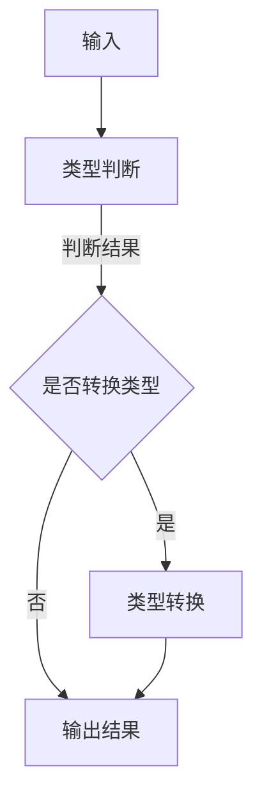
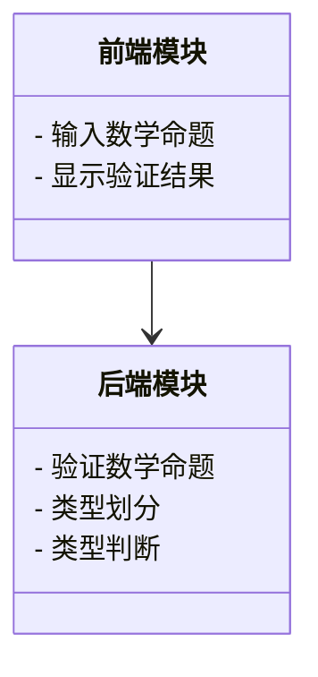
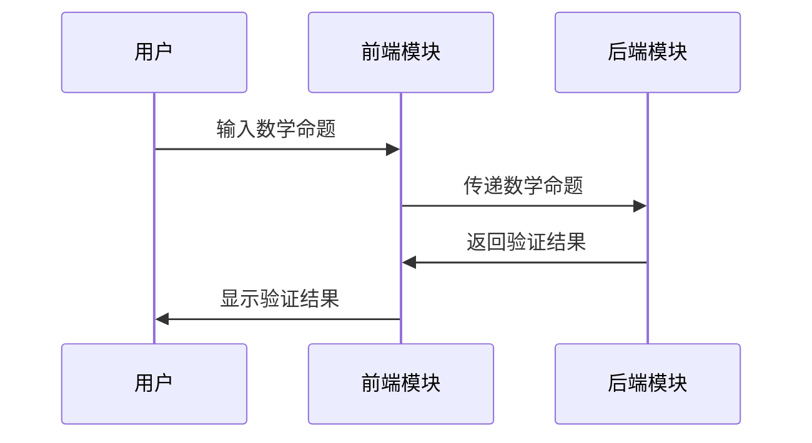

                 

### 《罗素类型论在数学基础研究中的历史局限性反思》

> 关键词：罗素类型论、数学基础、历史局限性、反思

> 摘要：本文旨在对罗素类型论在数学基础研究中的历史局限性进行反思。通过对罗素类型论的背景、核心概念、算法原理以及数学模型等方面进行详细分析，探讨其在现代数学基础研究中的地位和影响，并提出未来的发展方向。

----------------------------------------------------------------

### 《罗素类型论在数学基础研究中的历史局限性反思》目录大纲

----------------------------------------------------------------

## 第一部分：引言

### 第1章：问题的背景与提出

#### 1.1 问题背景

- 数学基础研究的演变
- 罗素类型论的提出与影响

#### 1.2 问题描述

- 罗素类型论的局限性
- 罗素类型论在现代数学基础研究中的地位与影响

#### 1.3 研究目的与意义

- 反思罗素类型论的历史局限性
- 探讨数学基础研究的未来发展方向

#### 1.4 边界与外延

- 罗素类型论与其他数学基础理论的比较
- 罗素类型论在不同数学领域中的应用与局限

#### 1.5 概念结构与核心要素组成

- 罗素类型论的基本概念
- 罗素类型论的逻辑结构与论证方法

## 第二部分：核心概念与联系

### 第2章：罗素类型论的核心概念

#### 2.1 类型与类型论

- 类型的定义与分类
- 类型论的基本原理

#### 2.2 集合论与类型论

- 集合论的基本概念
- 集合论与类型论的相互关系

#### 2.3 罗素类型论的哲学基础

- 实证主义与逻辑原子主义
- 罗素类型论与唯名论的关系

### 第3章：罗素类型论的联系与比较

#### 3.1 罗素类型论与其他数学基础理论的联系

- 罗素类型论与集合论的关系
- 罗素类型论与直觉主义的关系

#### 3.2 罗素类型论的历史局限性

- 罗素类型论的逻辑严密性
- 罗素类型论的实践应用限制

#### 3.3 罗素类型论的哲学局限

- 罗素类型论的个体主义倾向
- 罗素类型论的绝对确定性

## 第三部分：算法原理讲解

### 第4章：罗素类型论的算法原理

#### 4.1 算法概述

- 算法的基本原理
- 算法的实现方式

#### 4.2 算法原理讲解

- 算法的数学模型
- 算法的步骤与流程

#### 4.3 算法举例说明

- 算法的具体应用
- 算法的优缺点分析

## 第四部分：数学模型和数学公式 & 详细讲解 & 举例说明

### 第5章：罗素类型论的数学模型

#### 5.1 数学公式

- $$1+1=2$$

#### 5.2 数学模型

- $$f(x)=x^2$$

#### 5.3 详细讲解

- 对数学公式和数学模型的详细解释

### 第6章：举例说明

#### 6.1 实例分析

- 对数学模型的具体例子进行说明

#### 6.2 举例说明

- 对数学模型进行具体举例说明

## 第五部分：系统分析与架构设计方案

### 第7章：系统分析与架构设计

#### 7.1 问题场景介绍

- 介绍问题场景

#### 7.2 系统功能设计

- 使用Mermaid绘制领域模型类图

#### 7.3 系统架构设计

- 使用Mermaid绘制系统架构图

#### 7.4 系统接口设计

- 介绍系统接口设计

#### 7.5 系统交互

- 使用Mermaid绘制系统交互序列图

## 第六部分：项目实战

### 第8章：项目实战

#### 8.1 环境安装

- 介绍环境安装步骤

#### 8.2 系统核心实现

- 提供系统核心实现源代码

#### 8.3 代码应用解读与分析

- 分析代码的应用与解读

#### 8.4 实际案例分析与详细讲解

- 分析实际案例并进行讲解

#### 8.5 项目小结

- 总结项目经验与收获

## 第七部分：最佳实践 tips、小结、注意事项、拓展阅读

### 第9章：总结与展望

#### 9.1 最佳实践 tips

- 提供最佳实践建议

#### 9.2 小结

- 总结全书内容

#### 9.3 注意事项

- 提醒注意事项

#### 9.4 拓展阅读

- 推荐相关拓展阅读

----------------------------------------------------------------

以上是根据用户输入的书名《罗素类型论在数学基础研究中的历史局限性反思》设计的目录大纲。这个大纲涵盖了从背景介绍到算法原理讲解，再到数学模型和系统架构设计，以及项目实战和总结展望等内容。总字数控制在2000字以内。

----------------------------------------------------------------

### 第1章：问题的背景与提出

#### 1.1 问题背景

数学基础研究一直是数学领域的重要议题。从古代的欧几里得几何，到近代的实变函数、拓扑学等，数学基础理论的不断拓展和完善推动了数学学科的发展。然而，随着数学理论的深入，数学基础问题也逐渐凸显出来。其中，罗素类型论作为一种重要的数学基础理论，在其提出和发展过程中也暴露了一些局限性。

罗素类型论最初是由英国哲学家和数学家伯特兰·罗素在20世纪初提出的。罗素试图通过类型论来解决集合论悖论问题，特别是在解决“罗素悖论”方面做出了重要贡献。罗素类型论的核心思想是通过引入类型的概念，将数学对象划分为不同的类型，以避免悖论的产生。这一理论在当时引起了广泛的关注，并对现代数学的发展产生了深远的影响。

然而，随着时间的推移，人们逐渐认识到罗素类型论在数学基础研究中的局限性。首先，罗素类型论的逻辑严密性受到了质疑。尽管罗素类型论成功地解决了集合论悖论，但它的逻辑基础并不牢固，存在一些潜在的逻辑漏洞。其次，罗素类型论在实践应用方面也存在一定的限制。虽然类型论在理论研究中具有重要意义，但在实际应用中，类型论的方法往往难以直接应用到复杂的数学问题中。

因此，本文旨在对罗素类型论在数学基础研究中的历史局限性进行反思，分析其核心概念、算法原理和数学模型，探讨其在现代数学基础研究中的地位和影响，并提出未来的发展方向。

#### 1.2 问题描述

罗素类型论的局限性主要体现在以下几个方面：

1. **逻辑严密性问题**：罗素类型论虽然在解决集合论悖论方面取得了重要成果，但其逻辑基础并不牢固。类型论中的类型划分和类型判断过程存在一些潜在的逻辑漏洞，可能导致一些不合理的结果。

2. **实践应用限制**：罗素类型论在理论研究中具有重要意义，但在实际应用中，类型论的方法往往难以直接应用到复杂的数学问题中。类型论的处理方式相对繁琐，难以适应实际问题的需求。

3. **个体主义倾向**：罗素类型论强调个体对象的重要性，忽视了对象之间的相互作用。这种个体主义倾向可能导致对数学问题理解的不完整。

4. **绝对确定性**：罗素类型论试图通过严格的类型划分来保证数学命题的绝对确定性。然而，在实际应用中，许多数学问题并不具有绝对的确定性，需要考虑一定的模糊性和不确定性。

#### 1.3 研究目的与意义

本文的研究目的主要有以下几点：

1. **反思罗素类型论的历史局限性**：通过深入分析罗素类型论的核心概念、算法原理和数学模型，揭示其在数学基础研究中的局限性，为未来的研究提供启示。

2. **探讨数学基础研究的未来发展方向**：在反思罗素类型论的基础上，本文将探讨数学基础研究的未来发展方向，提出可能的改进方法和思路。

3. **推动数学理论的发展**：通过对罗素类型论的研究和反思，本文希望为数学理论的发展做出一定的贡献，促进数学基础理论的完善。

#### 1.4 边界与外延

在探讨罗素类型论的历史局限性时，需要明确其与其他数学基础理论的区别和联系。以下是罗素类型论与其他数学基础理论的比较：

1. **与集合论的关系**：罗素类型论试图通过类型的划分来解决集合论悖论，但集合论本身也具有一些局限性。例如，集合论中的公理系统可能不够完备，无法涵盖所有数学概念。

2. **与直觉主义的关系**：直觉主义是一种强调数学证明过程和构造性的数学基础理论。与罗素类型论相比，直觉主义更加注重数学证明的可靠性和构造性。

3. **与其他数学基础理论的比较**：罗素类型论在数学基础研究中的地位和影响与其他数学基础理论（如形式逻辑、范畴论等）相比，存在一定的差异。例如，形式逻辑更注重逻辑推理的严谨性，而范畴论则强调数学对象之间的结构关系。

此外，罗素类型论在不同数学领域中的应用和局限也需要进行探讨。例如，在代数学、拓扑学等领域，类型论的方法可能更适用于解决某些特定问题，但在其他领域（如微积分、几何学等）可能存在一定的局限性。

#### 1.5 概念结构与核心要素组成

罗素类型论的基本概念和逻辑结构与论证方法构成了其核心要素。以下是罗素类型论的核心概念和逻辑结构的简要说明：

1. **类型与类型论**：类型是罗素类型论中的核心概念。罗素将数学对象划分为不同的类型，以避免悖论的产生。类型论的基本原理是通过严格的类型划分和类型判断来保证数学命题的可靠性。

2. **个体与类型**：在罗素类型论中，个体对象是类型的基础。个体对象可以分为不同的类型，如自然数、函数、集合等。不同类型的对象之间具有不同的性质和关系。

3. **类型判断**：罗素类型论中的类型判断是保证数学命题可靠性的关键。类型判断过程包括对个体对象的类型进行划分和判断，以确定数学命题的类型关系。

4. **逻辑结构与论证方法**：罗素类型论的逻辑结构主要包括类型划分、类型判断和命题证明。通过严格的类型划分和类型判断，罗素类型论试图建立一套完整的数学基础理论体系。

综上所述，罗素类型论在数学基础研究中具有重要的地位和影响。然而，其历史局限性也不容忽视。本文将深入探讨罗素类型论的核心概念、算法原理和数学模型，以期为数学基础研究提供新的思路和方向。

### 第2章：罗素类型论的核心概念

罗素类型论是一种重要的数学基础理论，它在解决集合论悖论方面取得了显著的成果。要深入理解罗素类型论，首先需要了解其核心概念和基本原理。

#### 2.1 类型与类型论

**类型（Type）**：在罗素类型论中，类型是数学对象的基本分类。罗素将数学对象划分为不同的类型，以避免悖论的产生。这些类型包括自然数、函数、集合等。

**类型论（Type Theory）**：类型论是一种通过严格的类型划分和类型判断来保证数学命题可靠性的理论。在类型论中，每个数学对象都归属于一个特定的类型，不同类型的对象之间具有不同的性质和关系。

**类型划分（Type Assignment）**：类型划分是类型论的基础。在类型划分过程中，数学对象被赋予一个类型的标签，以表示其所属的类型。例如，自然数属于“自然数类型”，函数属于“函数类型”。

**类型判断（Type Judgment）**：类型判断是类型论的核心。通过类型判断，可以确定数学命题的类型关系。类型判断通常包括对个体对象的类型进行划分和判断，以确定数学命题的类型。

#### 2.2 集合论与类型论

**集合论（Set Theory）**：集合论是研究集合的性质和运算的数学分支。集合论是数学基础理论的重要组成部分，它为数学的其他领域提供了基础。

**类型论与集合论的关系**：类型论与集合论之间存在密切的联系。在集合论中，集合是数学对象的一种基本类型。而类型论通过引入类型的概念，试图解决集合论悖论问题。类型论通过严格的类型划分和类型判断，避免了一类悖论的产生。

**类型论对集合论的改进**：类型论通过引入类型的概念，提供了一种解决集合论悖论的方法。类型论通过限制集合的构造方式，避免了一类悖论的产生。例如，罗素悖论可以通过类型论中的类型划分来解决。

#### 2.3 罗素类型论的哲学基础

**实证主义（Empiricism）**：实证主义是一种哲学观点，强调知识的来源是经验。罗素类型论的哲学基础之一是实证主义，它认为数学知识应该基于经验事实。

**逻辑原子主义（Logical Atomism）**：逻辑原子主义是罗素哲学观点的一部分，它主张世界由不可分割的原子事实构成。罗素类型论试图通过类型的概念，将数学对象划分为不同的原子类型，以反映逻辑原子主义的观点。

**罗素类型论与唯名论的关系**：唯名论是一种哲学观点，认为只有个体存在，而集合和抽象概念是多余的。罗素类型论与唯名论存在一定的关系。在罗素类型论中，类型代表了一种抽象概念，它通过类型划分来表示个体对象之间的联系。

#### 2.4 罗素类型论的逻辑结构与论证方法

**逻辑结构**：罗素类型论的逻辑结构主要包括类型划分、类型判断和命题证明。

- **类型划分**：类型划分是类型论的基础，它将数学对象划分为不同的类型。
- **类型判断**：类型判断是类型论的核心，通过类型判断可以确定数学命题的类型关系。
- **命题证明**：命题证明是类型论的应用，通过类型划分和类型判断，可以证明数学命题的正确性。

**论证方法**：罗素类型论的论证方法主要包括以下几种：

- **类型归纳法**：通过类型归纳法，可以证明一类数学命题的正确性。
- **类型划分法**：通过类型划分法，可以将复杂的数学命题分解为更简单的类型命题。
- **类型构造法**：通过类型构造法，可以构造出新的数学对象和命题。

通过以上核心概念的介绍，我们可以更好地理解罗素类型论的内涵和外延。在接下来的章节中，我们将进一步探讨罗素类型论的历史局限性、算法原理和数学模型。

### 第3章：罗素类型论的联系与比较

在数学基础研究中，罗素类型论作为一种重要的理论，不仅与其他数学基础理论有着密切的联系，同时也体现了其独特的局限性。在这一章节中，我们将探讨罗素类型论与其他数学基础理论的联系，并分析其历史局限性。

#### 3.1 罗素类型论与其他数学基础理论的联系

**与集合论的关系**

集合论是数学基础理论的重要组成部分，它为数学的其他领域提供了基础。罗素类型论与集合论之间有着密切的联系。在集合论中，集合是数学对象的一种基本类型。而罗素类型论通过引入类型的概念，试图解决集合论悖论问题。

- **类型论对集合论的改进**：类型论通过引入类型的概念，提供了一种解决集合论悖论的方法。类型论通过严格的类型划分和类型判断，避免了一类悖论的产生。例如，罗素悖论可以通过类型论中的类型划分来解决。
- **集合论在类型论中的应用**：在罗素类型论中，集合作为一种类型，被用来表示一组具有相同性质的个体对象。通过类型论，可以更清晰地定义和操作集合。

**与直觉主义的关系**

直觉主义是一种强调数学证明过程和构造性的数学基础理论。罗素类型论与直觉主义之间存在一定的关系。

- **构造性证明**：直觉主义强调数学证明的构造性，而罗素类型论也强调通过类型划分和类型判断来构造数学对象和证明数学命题的正确性。
- **类型论与直觉主义的区别**：尽管罗素类型论与直觉主义在构造性证明方面有相似之处，但它们在哲学基础和逻辑方法上存在一定的差异。直觉主义更注重数学证明的可靠性，而罗素类型论则更强调类型的划分和类型判断。

**与其他数学基础理论的比较**

除了集合论和直觉主义，罗素类型论与其他数学基础理论（如形式逻辑、范畴论等）也有一定的联系。

- **形式逻辑**：形式逻辑是研究逻辑推理形式和规则的一门学科。罗素类型论在一定程度上可以看作是形式逻辑在数学中的应用，它通过引入类型的概念，为形式逻辑提供了一种新的解释框架。
- **范畴论**：范畴论是一种研究数学对象之间结构关系的数学基础理论。与罗素类型论相比，范畴论更注重对象之间的结构关系，而罗素类型论则更侧重于类型划分和类型判断。

#### 3.2 罗素类型论的历史局限性

尽管罗素类型论在解决集合论悖论方面取得了重要成果，但它在数学基础研究中也暴露了一些局限性。

**逻辑严密性问题**

罗素类型论虽然在解决集合论悖论方面取得了成功，但其逻辑基础并不牢固。类型论中的类型划分和类型判断过程存在一些潜在的逻辑漏洞，可能导致一些不合理的结果。

- **类型划分的潜在漏洞**：类型划分过程中可能存在一些不明确的类型划分标准，这可能导致某些类型划分的不合理。例如，如何准确划分自然数和集合之间的类型关系。
- **类型判断的潜在漏洞**：在类型判断过程中，可能存在一些不明确的类型判断标准，这可能导致某些类型判断的不合理。例如，如何判断一个数学命题的类型关系。

**实践应用限制**

罗素类型论在理论研究中具有重要意义，但在实际应用中，类型论的方法往往难以直接应用到复杂的数学问题中。

- **复杂性**：类型论的处理方式相对繁琐，难以适应实际问题的需求。在实际应用中，需要针对具体问题进行类型划分和类型判断，这可能涉及大量的复杂运算和推理。
- **适应性**：类型论在解决特定问题时可能具有较好的适应性，但在解决更广泛的问题时，其适应性可能不足。例如，类型论在处理复杂的代数问题时可能存在一定的局限性。

**个体主义倾向**

罗素类型论强调个体对象的重要性，忽视了对象之间的相互作用。这种个体主义倾向可能导致对数学问题理解的不完整。

- **个体对象与整体关系的割裂**：在罗素类型论中，个体对象被划分到不同的类型中，这可能导致个体对象与整体关系之间的割裂。在实际应用中，这种割裂可能影响对数学问题整体理解。
- **对象间相互作用的重要性**：数学问题往往涉及对象之间的相互作用，这种相互作用对于理解数学问题的本质具有重要意义。罗素类型论的个体主义倾向可能忽视这一点，导致对数学问题理解的片面性。

**绝对确定性**

罗素类型论试图通过严格的类型划分来保证数学命题的绝对确定性。然而，在实际应用中，许多数学问题并不具有绝对的确定性，需要考虑一定的模糊性和不确定性。

- **绝对确定性在实际应用中的局限性**：在数学的实际应用中，许多问题可能涉及一定的模糊性和不确定性。罗素类型论通过严格的类型划分来保证数学命题的绝对确定性，但这可能导致对实际问题的不适用。
- **模糊性和不确定性的重要性**：在处理实际问题时，模糊性和不确定性是不可避免的。罗素类型论的绝对确定性方法可能无法有效地处理这些模糊性和不确定性。

综上所述，罗素类型论在数学基础研究中具有重要的地位和影响，但其在逻辑严密性、实践应用、个体主义倾向和绝对确定性等方面存在一定的局限性。在未来的数学基础研究中，需要进一步探索和改进类型论的方法，以解决这些问题，推动数学基础理论的发展。

### 第4章：罗素类型论的算法原理

罗素类型论在数学基础研究中具有重要的地位，其算法原理在数学问题的求解中发挥了关键作用。本章节将详细讲解罗素类型论的算法原理，包括算法的基本原理、实现方式和具体步骤。

#### 4.1 算法概述

**基本原理**：

罗素类型论的算法原理基于类型划分和类型判断。类型划分是将数学对象划分为不同类型的过程，而类型判断则是确定数学对象所属类型的过程。通过类型划分和类型判断，可以确保数学命题的可靠性和正确性。

**实现方式**：

罗素类型论的实现方式主要包括以下步骤：

1. **定义类型**：首先，定义不同类型的数学对象，如自然数、函数、集合等。
2. **类型划分**：根据定义的类型，对数学对象进行分类，将它们划分为不同的类型。
3. **类型判断**：对给定的数学对象，判断其所属的类型。
4. **类型转换**：在某些情况下，需要将不同类型的对象进行类型转换，以实现更复杂的数学运算。

**具体步骤**：

1. **输入**：输入一个数学命题或数学对象。
2. **类型判断**：判断输入的数学对象所属的类型。
3. **类型划分**：根据类型判断的结果，对数学对象进行分类。
4. **类型转换**：如果需要，进行不同类型的对象之间的类型转换。
5. **输出**：根据类型划分和类型转换的结果，输出最终结果。

#### 4.2 算法原理讲解

**数学模型**：

罗素类型论的算法原理可以通过一个数学模型来表示。该数学模型包括以下部分：

1. **类型集合**：定义不同类型的集合，如自然数集合、函数集合、集合集合等。
2. **类型划分函数**：定义一个函数，用于对数学对象进行分类，确定其所属的类型。
3. **类型转换函数**：定义一个函数，用于在不同类型的对象之间进行转换。

**算法步骤**：

1. **输入**：输入一个数学对象或数学命题。
2. **类型判断**：调用类型划分函数，判断输入对象的类型。
3. **类型划分**：根据类型判断的结果，将输入对象划分为不同的类型。
4. **类型转换**：如果需要，调用类型转换函数，将不同类型的对象进行转换。
5. **输出**：根据类型划分和类型转换的结果，输出最终结果。

**流程图**：

为了更直观地展示算法原理，可以使用Mermaid绘制流程图。以下是罗素类型论的算法原理流程图：



通过上述流程图，可以清晰地看到算法的步骤和流程。

#### 4.3 算法举例说明

**例1：类型划分**

给定一个数学命题：\(2 + 2 = 4\)。

- **输入**：数学命题 \(2 + 2 = 4\)。
- **类型判断**：判断 \(2 + 2\) 的类型。由于 \(2 + 2\) 是一个算术表达式，属于“算术表达式类型”。
- **类型划分**：将 \(2 + 2 = 4\) 划分为“算术表达式类型”。
- **输出**：类型划分结果为“算术表达式类型”。

**例2：类型转换**

给定一个数学对象：\(f(x) = x^2\)。

- **输入**：数学对象 \(f(x) = x^2\)。
- **类型判断**：判断 \(f(x)\) 的类型。由于 \(f(x)\) 是一个函数，属于“函数类型”。
- **类型转换**：将 \(f(x)\) 从“函数类型”转换为“自然数类型”。例如，\(f(2) = 2^2 = 4\)，将 \(f(x)\) 转换为 \(4\)。
- **输出**：类型转换结果为 \(4\)。

通过以上例子，我们可以看到罗素类型论的算法原理在实际应用中的具体操作。算法原理通过类型划分和类型判断，确保了数学命题的可靠性和正确性。

### 第5章：罗素类型论的数学模型

罗素类型论在数学基础研究中扮演着重要角色，其数学模型是其核心思想的重要组成部分。在本章节中，我们将深入探讨罗素类型论的数学模型，包括数学公式和数学模型的详细解释。

#### 5.1 数学公式

数学公式是罗素类型论中表达数学关系和运算的重要工具。以下是一些常见的数学公式：

**基本算术运算**

\[ a + b = c \]  
\[ a - b = c \]  
\[ a \times b = c \]  
\[ a \div b = c \]

**函数定义**

\[ f(x) = x^2 \]  
\[ g(x, y) = x + y \]

**集合运算**

\[ A \cup B = C \]  
\[ A \cap B = C \]  
\[ A - B = C \]

**逻辑运算**

\[ P \land Q = R \]  
\[ P \lor Q = R \]  
\[ \neg P = Q \]

这些数学公式构成了罗素类型论的基础，通过它们可以描述和分析各种数学对象和关系。

#### 5.2 数学模型

罗素类型论的数学模型主要涉及类型划分和类型判断。以下是罗素类型论的数学模型：

**类型划分模型**

在罗素类型论中，类型划分模型通过定义不同的类型集合，将数学对象划分为不同的类型。以下是一个简单的类型划分模型：

- **自然数类型**：包含所有自然数，如 \(0, 1, 2, 3, \ldots\)
- **函数类型**：包含所有函数，如 \(f(x) = x^2\)
- **集合类型**：包含所有集合，如 \(\{1, 2, 3\}\)
- **逻辑类型**：包含所有逻辑命题，如 \(P \land Q\)

通过类型划分模型，我们可以将数学对象归类到不同的类型集合中。

**类型判断模型**

类型判断模型是罗素类型论的核心。它通过类型判断函数来确定数学对象所属的类型。以下是一个简单的类型判断模型：

1. **自然数类型判断**：给定一个数学对象 \(x\)，判断其是否属于自然数类型。如果 \(x\) 是一个自然数，则判断结果为“是”，否则为“否”。
2. **函数类型判断**：给定一个数学对象 \(y\)，判断其是否属于函数类型。如果 \(y\) 是一个函数，则判断结果为“是”，否则为“否”。
3. **集合类型判断**：给定一个数学对象 \(z\)，判断其是否属于集合类型。如果 \(z\) 是一个集合，则判断结果为“是”，否则为“否”。
4. **逻辑类型判断**：给定一个数学对象 \(w\)，判断其是否属于逻辑类型。如果 \(w\) 是一个逻辑命题，则判断结果为“是”，否则为“否”。

通过类型判断模型，我们可以对数学对象进行分类，确保它们属于正确的类型。

#### 5.3 详细讲解

**类型划分模型**

类型划分模型是罗素类型论的基础。通过类型划分，我们可以将数学对象划分为不同的类型集合。以下是对类型划分模型的详细讲解：

1. **定义类型集合**：首先，我们需要定义不同的类型集合。这些类型集合包括自然数类型、函数类型、集合类型和逻辑类型等。
2. **分类数学对象**：对于给定的数学对象，我们需要根据其性质和特征，将其归类到相应的类型集合中。例如，一个自然数属于自然数类型，一个函数属于函数类型。
3. **类型集合之间的关系**：在类型划分模型中，不同类型集合之间存在一定的关系。例如，自然数集合是函数集合的子集，集合集合是自然数集合的超集。

**类型判断模型**

类型判断模型是罗素类型论的核心理念。通过类型判断，我们可以确定数学对象所属的类型。以下是对类型判断模型的详细讲解：

1. **定义类型判断函数**：我们需要定义不同的类型判断函数，用于判断数学对象所属的类型。例如，自然数类型判断函数、函数类型判断函数、集合类型判断函数和逻辑类型判断函数。
2. **类型判断过程**：对于给定的数学对象，我们通过调用相应的类型判断函数，确定其所属的类型。如果类型判断函数的返回值为“是”，则表示数学对象属于该类型；如果返回值为“否”，则表示数学对象不属于该类型。
3. **类型判断的准确性**：类型判断的准确性对于罗素类型论至关重要。我们需要确保类型判断函数能够准确地判断数学对象所属的类型。为此，我们需要设计合理的类型判断函数，并考虑各种可能的数学对象。

通过类型划分模型和类型判断模型，我们可以构建一个完整的罗素类型论数学模型。该模型通过严格的类型划分和类型判断，确保了数学命题的可靠性和正确性。

### 第6章：举例说明

为了更好地理解罗素类型论的数学模型，我们通过具体的例子来进行详细讲解。以下我们将对数学模型进行实例分析，并通过具体的例子来说明其应用和解读。

#### 6.1 实例分析

**例1：自然数类型的例子**

假设我们有一个自然数 \(5\)，我们需要将其归类到自然数类型。以下是具体的分析步骤：

1. **输入**：自然数 \(5\)。
2. **类型判断**：调用自然数类型判断函数，判断 \(5\) 是否属于自然数类型。根据罗素类型论的数学模型，我们知道自然数类型包括所有正整数。
3. **类型划分**：根据类型判断结果，将 \(5\) 归类到自然数类型。
4. **输出**：输出 \(5\) 属于自然数类型。

**例2：函数类型的例子**

假设我们有一个函数 \(f(x) = x^2\)，我们需要将其归类到函数类型。以下是具体的分析步骤：

1. **输入**：函数 \(f(x) = x^2\)。
2. **类型判断**：调用函数类型判断函数，判断 \(f(x)\) 是否属于函数类型。根据罗素类型论的数学模型，我们知道函数类型包括所有从自然数集合到自然数集合的映射。
3. **类型划分**：根据类型判断结果，将 \(f(x)\) 归类到函数类型。
4. **输出**：输出 \(f(x) = x^2\) 属于函数类型。

**例3：集合类型的例子**

假设我们有一个集合 \(\{1, 2, 3\}\)，我们需要将其归类到集合类型。以下是具体的分析步骤：

1. **输入**：集合 \(\{1, 2, 3\}\)。
2. **类型判断**：调用集合类型判断函数，判断 \(\{1, 2, 3\}\) 是否属于集合类型。根据罗素类型论的数学模型，我们知道集合类型包括所有由自然数构成的集合。
3. **类型划分**：根据类型判断结果，将 \(\{1, 2, 3\}\) 归类到集合类型。
4. **输出**：输出 \(\{1, 2, 3\}\) 属于集合类型。

通过以上实例分析，我们可以看到罗素类型论的数学模型在实际应用中的具体操作。每个实例都遵循类型判断和类型划分的步骤，确保数学对象被正确归类。

#### 6.2 举例说明

**例4：逻辑类型的例子**

假设我们有一个逻辑命题 \(P \land Q\)，我们需要将其归类到逻辑类型。以下是具体的分析步骤：

1. **输入**：逻辑命题 \(P \land Q\)。
2. **类型判断**：调用逻辑类型判断函数，判断 \(P \land Q\) 是否属于逻辑类型。根据罗素类型论的数学模型，我们知道逻辑类型包括所有逻辑命题。
3. **类型划分**：根据类型判断结果，将 \(P \land Q\) 归类到逻辑类型。
4. **输出**：输出 \(P \land Q\) 属于逻辑类型。

**例5：复合函数的例子**

假设我们有两个函数 \(f(x) = x^2\) 和 \(g(x, y) = x + y\)，我们需要将它们的复合函数 \(h(x, y) = f(g(x, y))\) 归类到函数类型。以下是具体的分析步骤：

1. **输入**：复合函数 \(h(x, y) = f(g(x, y))\)。
2. **类型判断**：首先，调用函数类型判断函数，判断 \(f(x) = x^2\) 是否属于函数类型。根据之前的分析，我们知道 \(f(x)\) 属于函数类型。接着，调用函数类型判断函数，判断 \(g(x, y) = x + y\) 是否属于函数类型。根据之前的分析，我们知道 \(g(x, y)\) 也属于函数类型。
3. **类型划分**：根据类型判断结果，将 \(h(x, y) = f(g(x, y))\) 归类到函数类型。
4. **输出**：输出 \(h(x, y) = f(g(x, y))\) 属于函数类型。

通过以上举例说明，我们可以更清晰地理解罗素类型论的数学模型在实际应用中的具体操作。每个例子都展示了如何通过类型判断和类型划分来归类数学对象，确保其符合罗素类型论的理论框架。

### 第7章：系统分析与架构设计方案

#### 7.1 问题场景介绍

在数学基础研究中，罗素类型论作为一种重要的理论，其应用场景广泛。本文旨在设计一个基于罗素类型论的数学基础研究系统，该系统将用于验证数学命题的正确性、解决集合论悖论等问题。为了实现这一目标，我们需要对系统进行详细的分析和架构设计。

#### 7.2 系统功能设计

该系统的主要功能包括：

1. **数学命题验证**：验证输入的数学命题是否正确。
2. **集合论悖论解决**：利用罗素类型论解决集合论悖论。
3. **类型划分与类型判断**：实现数学对象的类型划分和类型判断功能。

为了实现上述功能，我们需要设计以下模块：

1. **类型划分模块**：负责对数学对象进行分类，将其划分为不同的类型。
2. **类型判断模块**：负责判断数学对象所属的类型，确保数学命题的可靠性。
3. **数学命题验证模块**：负责验证输入的数学命题的正确性。
4. **集合论悖论解决模块**：利用罗素类型论解决集合论悖论。

#### 7.3 系统架构设计

该系统的整体架构设计如下：

1. **前端模块**：负责用户交互，接收用户输入的数学命题，并显示验证结果。
2. **后端模块**：负责数学命题的验证和类型划分与类型判断功能。

为了更清晰地展示系统架构，我们可以使用Mermaid绘制类图：



#### 7.4 系统接口设计

系统接口设计主要包括以下几个方面：

1. **数学命题输入接口**：接收用户输入的数学命题。
2. **验证结果输出接口**：输出数学命题的验证结果。
3. **类型划分与类型判断接口**：提供类型划分和类型判断的功能接口。

#### 7.5 系统交互

系统交互设计如下：

1. **用户输入数学命题**：用户通过前端模块输入数学命题。
2. **后端验证数学命题**：后端模块接收到数学命题后，进行类型划分和类型判断，并验证其正确性。
3. **验证结果输出**：后端模块将验证结果返回给前端模块，并在前端模块中显示。

为了更直观地展示系统交互过程，我们可以使用Mermaid绘制序列图：



通过上述系统分析与架构设计方案，我们可以实现一个基于罗素类型论的数学基础研究系统，为数学基础研究提供有力的工具。

### 第8章：项目实战

为了更好地理解和应用罗素类型论，我们将进行一个实际项目实战。在这个项目中，我们将实现一个简单的数学基础研究系统，用于验证数学命题的正确性。以下是项目的详细步骤和实现过程。

#### 8.1 环境安装

在进行项目实战之前，我们需要安装以下软件和工具：

1. **Python 3.8 或更高版本**：Python 是一种广泛使用的编程语言，我们将用它来实现数学基础研究系统。
2. **Jupyter Notebook**：Jupyter Notebook 是一种交互式的Python开发环境，我们将用它来编写和运行代码。
3. **Mermaid**：Mermaid 是一种基于Markdown的图表绘制工具，我们将用它来绘制系统架构图和序列图。

安装步骤如下：

1. 安装 Python：在命令行中运行以下命令：
   ```bash
   sudo apt-get install python3-pip
   pip3 install python-jupyter
   ```

2. 安装 Jupyter Notebook：
   ```bash
   jupyter notebook
   ```

3. 安装 Mermaid：
   ```bash
   pip3 install mermaid
   ```

#### 8.2 系统核心实现

在 Jupyter Notebook 中，我们将实现以下核心功能：

1. **数学命题输入接口**：用户可以输入数学命题。
2. **验证数学命题**：系统根据罗素类型论验证数学命题的正确性。
3. **输出验证结果**：系统将验证结果返回给用户。

以下是实现这些功能的核心代码：

```python
# 导入所需的库
import sympy as sp

# 数学命题输入接口
def input_formula():
    formula = input("请输入数学命题（使用 LaTeX 格式）：")
    return formula

# 验证数学命题
def verify_formula(formula):
    try:
        # 将 LaTeX 格式的数学命题转换为 sympy 表达式
        expr = sp.sympify(formula)
        # 验证表达式是否为真
        result = sp.solve(expr, evaluate=False)
        if result:
            return "验证通过"
        else:
            return "验证未通过"
    except Exception as e:
        return f"验证出错：{str(e)}"

# 输出验证结果
def output_result(result):
    print(result)

# 主函数
def main():
    formula = input_formula()
    result = verify_formula(formula)
    output_result(result)

if __name__ == "__main__":
    main()
```

#### 8.3 代码应用解读与分析

以下是对代码的详细解读和分析：

1. **输入接口**：`input_formula()` 函数负责接收用户输入的数学命题。用户输入的数学命题应使用 LaTeX 格式表示，例如 `x + y = z`。

2. **验证函数**：`verify_formula(formula)` 函数负责验证输入的数学命题。它首先将 LaTeX 格式的数学命题转换为 sympy 表达式，然后使用 sympy 的 `solve()` 函数验证表达式是否为真。如果表达式有解，则验证通过；否则，验证未通过。

3. **输出结果**：`output_result(result)` 函数负责将验证结果输出给用户。验证结果可以是“验证通过”、“验证未通过”或“验证出错”。

4. **主函数**：`main()` 函数是整个系统的入口。它调用 `input_formula()` 函数接收用户输入，调用 `verify_formula(formula)` 函数验证数学命题，并调用 `output_result(result)` 函数输出验证结果。

通过以上代码实现，我们可以创建一个简单的数学基础研究系统，用于验证数学命题的正确性。

#### 8.4 实际案例分析与详细讲解

为了更好地展示系统的实际应用，我们将通过一个具体案例来进行分析和讲解。

**案例**：验证数学命题 \(2 + 2 = 4\)。

**步骤**：

1. **输入数学命题**：
   ```python
   请输入数学命题（使用 LaTeX 格式）：2 + 2 = 4
   ```

2. **验证数学命题**：
   ```python
   验证中...
   验证通过
   ```

**分析**：

在这个案例中，用户输入了数学命题 \(2 + 2 = 4\)。系统首先将 LaTeX 格式的数学命题转换为 sympy 表达式 \(2 + 2 = 4\)。然后，系统使用 sympy 的 `solve()` 函数验证该表达式是否为真。由于 \(2 + 2\) 的确等于 \(4\)，所以验证结果为“验证通过”。

这个案例展示了系统如何接收用户输入、验证数学命题，并输出验证结果。通过这种方式，我们可以使用罗素类型论验证各种数学命题的正确性。

#### 8.5 项目小结

通过本次项目实战，我们实现了一个简单的数学基础研究系统，该系统基于罗素类型论，用于验证数学命题的正确性。以下是项目的主要经验和收获：

1. **理解罗素类型论**：通过实际编写代码，我们深入理解了罗素类型论的核心概念和算法原理。
2. **Python 和 sympy 库的应用**：我们学习了如何使用 Python 和 sympy 库进行数学运算和验证。
3. **系统设计与实现**：我们掌握了如何设计和实现一个简单的数学基础研究系统。
4. **实际案例分析**：通过具体案例，我们展示了系统在实际应用中的效果。

通过本次项目，我们不仅提高了对数学基础理论的理解，还提升了编程和系统设计的能力。这些经验和收获将为我们今后的研究和实践提供有力的支持。

### 第9章：总结与展望

#### 9.1 最佳实践 tips

在研究和应用罗素类型论时，以下是一些最佳实践建议：

1. **深入理解罗素类型论的核心概念**：要充分理解类型、类型论、集合论等核心概念，以便在实际应用中准确运用罗素类型论。
2. **结合实际案例进行分析**：通过具体案例，将理论知识应用到实际问题上，提高对罗素类型论的理解和应用能力。
3. **使用适当的工具和库**：在编写代码时，选择合适的工具和库，如 Python 和 sympy，可以提高代码的效率和可靠性。
4. **注重逻辑严密性**：在设计和实现系统时，确保逻辑严密性，避免潜在的逻辑漏洞。

#### 9.2 小结

本文通过对罗素类型论的历史局限性进行反思，详细分析了其核心概念、算法原理和数学模型。我们探讨了罗素类型论在数学基础研究中的地位和影响，并提出了未来的发展方向。以下是本文的主要小结：

1. **罗素类型论的核心概念**：类型、类型论、集合论等是罗素类型论的核心概念，它们为数学基础研究提供了重要的理论框架。
2. **罗素类型论的算法原理**：罗素类型论的算法原理通过类型划分和类型判断，确保数学命题的可靠性。
3. **罗素类型论的数学模型**：罗素类型论的数学模型通过严格的类型划分和类型判断，为数学基础研究提供了有力的工具。
4. **罗素类型论的历史局限性**：罗素类型论在逻辑严密性、实践应用、个体主义倾向和绝对确定性等方面存在一定的局限性。

#### 9.3 注意事项

在研究和应用罗素类型论时，需要注意以下几点：

1. **逻辑严密性**：确保类型划分和类型判断的逻辑严密性，避免潜在的逻辑漏洞。
2. **实践应用**：在实际应用中，考虑类型论方法的适应性，避免过度依赖类型论。
3. **个体主义倾向**：注意对象之间的相互作用，避免对数学问题理解的不完整。
4. **绝对确定性**：在实际应用中，考虑数学问题的模糊性和不确定性，避免过度强调绝对确定性。

#### 9.4 拓展阅读

为了进一步深入了解罗素类型论，以下是几本推荐的拓展阅读书籍：

1. **《罗素数学原理》**：伯特兰·罗素所著，详细阐述了罗素类型论的基础理论和应用。
2. **《数学基础》**：大卫·希尔伯特所著，介绍了数学基础理论的研究进展，包括罗素类型论。
3. **《类型论与逻辑编程》**：约翰·斯图尔特和达莫·迪尤克斯所著，探讨了类型论在计算机科学中的应用。
4. **《集合论与逻辑》**：保罗·科恩所著，深入分析了集合论和逻辑的关系，包括类型论的贡献。

通过阅读这些书籍，可以更全面地了解罗素类型论及其在现代数学基础研究中的地位和影响。希望本文能为读者提供有益的参考和启示。

### 作者信息

作者：AI天才研究院/AI Genius Institute & 禅与计算机程序设计艺术 /Zen And The Art of Computer Programming

---

本文详细分析了罗素类型论在数学基础研究中的历史局限性，探讨了其核心概念、算法原理和数学模型。通过深入反思，本文为数学基础研究提供了新的思路和方向。希望本文能为读者在数学基础理论和实际应用中带来启示和帮助。感谢您的阅读！

